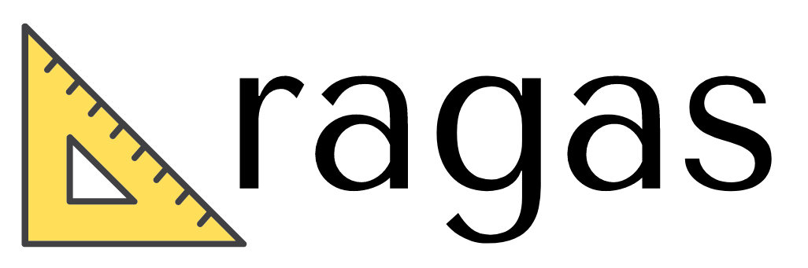

<h1 align="center">
  
</h1>
<p align="center">
  <i>为你的 LLM 应用评估加速 🚀</i>
</p>

<p align="center">
    <a href="https://github.com/vibrantlabsai/ragas/releases">
        
    </a>
    <a href="https://www.python.org/">
        
    </a>
    <a href="https://github.com/vibrantlabsai/ragas/blob/master/LICENSE">
        
    </a>
    <a href="https://pypi.org/project/ragas/">
        
    </a>
    <a href="https://discord.gg/5djav8GGNZ">
        
    </a>
    <a target="_blank" href="https://deepwiki.com/vibrantlabsai/ragas">
      
    </a>
</p>

<h4 align="center">
    <p>
        <a href="https://docs.ragas.io/">文档</a> |
        <a href="#fire-quickstart">快速开始</a> |
        <a href="https://discord.gg/5djav8GGNZ">加入 Discord</a> |
        <a href="https://blog.ragas.io/">博客</a> |
        <a href="https://newsletter.ragas.io/">新闻通讯</a> |
        <a href="https://www.ragas.io/careers">招聘</a>
    <p>
</h4>

客观指标、智能测试生成与数据驱动的 LLM 应用洞察

Ragas 是你评估和优化大语言模型 (LLM) 应用的终极工具包。告别耗时且主观的评估方式，拥抱数据驱动、高效的评估工作流。
还没有准备好测试数据集？我们还提供与生产对齐的测试集生成功能。

## 核心功能

- 🎯 客观指标：使用基于 LLM 和传统指标精确评估你的 LLM 应用。
- 🧪 测试数据生成：自动创建覆盖广泛场景的综合测试数据集。
- 🔗 无缝集成：与 LangChain 等流行 LLM 框架及主流可观测性工具完美配合。
- 📊 构建反馈循环：利用生产数据持续改进你的 LLM 应用。

## :shield: 安装

通过 PyPI：

```bash
pip install ragas
```

或者从源码安装：

```bash
pip install git+https://github.com/vibrantlabsai/ragas
```

## :fire: 快速开始

### 克隆完整的示例项目

最快的入门方式是使用 `ragas quickstart` 命令：

```bash
# 列出可用模板
ragas quickstart

# 创建一个 RAG 评估项目
ragas quickstart rag_eval

# 指定创建位置
ragas quickstart rag_eval -o ./my-project
```

可用模板：
- `rag_eval` - 评估 RAG 系统

即将推出：
- `agent_evals` - 评估 AI 代理
- `benchmark_llm` - 对 LLM 进行基准测试和比较
- `prompt_evals` - 评估提示词变体
- `workflow_eval` - 评估复杂工作流

### 评估你的 LLM 应用

`ragas` 提供了用于常见评估任务的预构建指标。例如，Aspect Critique 使用 `DiscreteMetric` 评估你输出的任何方面：

```python
import asyncio
from openai import AsyncOpenAI
from ragas.metrics import DiscreteMetric
from ragas.llms import llm_factory

# Setup your LLM
client = AsyncOpenAI()
llm = llm_factory("gpt-4o", client=client)

# Create a custom aspect evaluator
metric = DiscreteMetric(
    name="summary_accuracy",
    allowed_values=["accurate", "inaccurate"],
    prompt="""Evaluate if the summary is accurate and captures key information.

Response: {response}

Answer with only 'accurate' or 'inaccurate'."""
)

# Score your application's output
async def main():
    score = await metric.ascore(
        llm=llm,
        response="The summary of the text is..."
    )
    print(f"Score: {score.value}")  # 'accurate' or 'inaccurate'
    print(f"Reason: {score.reason}")

if __name__ == "__main__":
    asyncio.run(main())
```

> **注意**：请确保已设置 `OPENAI_API_KEY` 环境变量。

查看完整的[快速入门指南](https://docs.ragas.io/en/latest/getstarted/quickstart)

## 想通过评估来改进你的 AI 应用？

在过去两年中，我们见证并帮助了许多通过评估改进的 AI 应用。如果你想通过评估来改进和扩展你的 AI 应用，我们可以提供帮助。

🔗 预约一个[时间](https://cal.com/team/vibrantlabs/app)或给我们发邮件：[founders@vibrantlabs.com](mailto:founders@vibrantlabs.com)。

## 🫂 社区

如果你想更深入地参与 Ragas，请查看我们的 [Discord 服务器](https://discord.gg/5qGUJ6mh7C)。这是一个有趣的社区，我们在这里讨论 LLM、检索、生产问题等等。

## 贡献者

```yml
+----------------------------------------------------------------------------+
|     +----------------------------------------------------------------+     |
|     | Developers: Those who built with `ragas`.                      |     |
|     | (You have `import ragas` somewhere in your project)            |     |
|     |     +----------------------------------------------------+     |     |
|     |     | Contributors: Those who make `ragas` better.       |     |     |
|     |     | (You make PR to this repo)                         |     |     |
|     |     +----------------------------------------------------+     |     |
|     +----------------------------------------------------------------+     |
+----------------------------------------------------------------------------+
```

我们欢迎社区贡献！无论是 Bug 修复、功能添加还是文档改进，你的参与都很有价值。

1. Fork 本仓库
2. 创建你的功能分支 (git checkout -b feature/AmazingFeature)
3. 提交你的修改 (git commit -m 'Add some AmazingFeature')
4. 推送到分支 (git push origin feature/AmazingFeature)
5. 发起 Pull Request

## 🔍 开放分析

在 Ragas，我们信奉透明原则。我们收集最少的匿名使用数据，以改进产品并指导开发工作。

✅ 不收集任何个人或公司身份信息

✅ 开源的数据收集[代码](./src/ragas/_analytics.py)

✅ 公开可用的聚合[数据](https://github.com/vibrantlabsai/ragas/issues/49)

如需退出，请将 `RAGAS_DO_NOT_TRACK` 环境变量设置为 `true`。

### 引用我们

```
@misc{ragas2024,
  author       = {VibrantLabs},
  title        = {Ragas: Supercharge Your LLM Application Evaluations},
  year         = {2024},
  howpublished = {\url{https://github.com/vibrantlabsai/ragas}},
}
```
