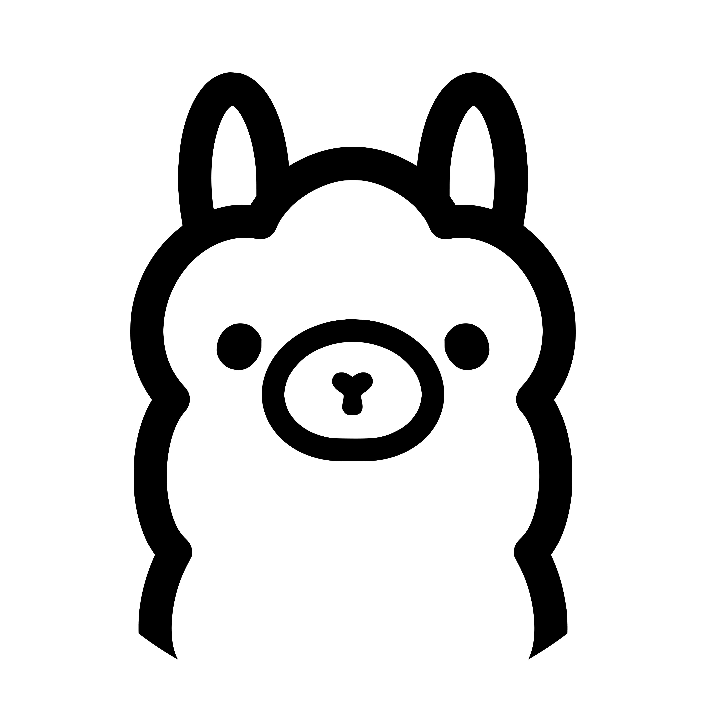
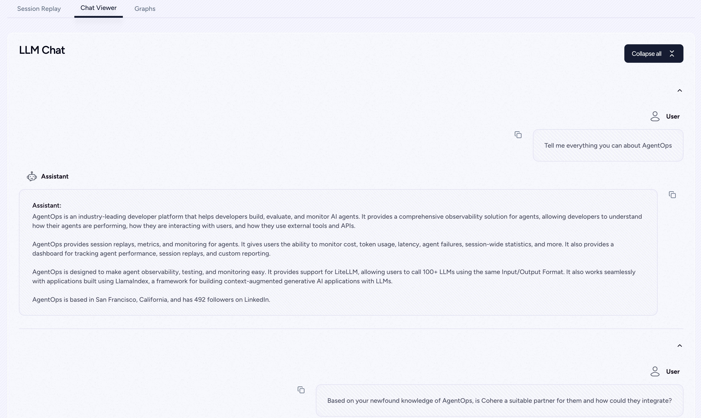
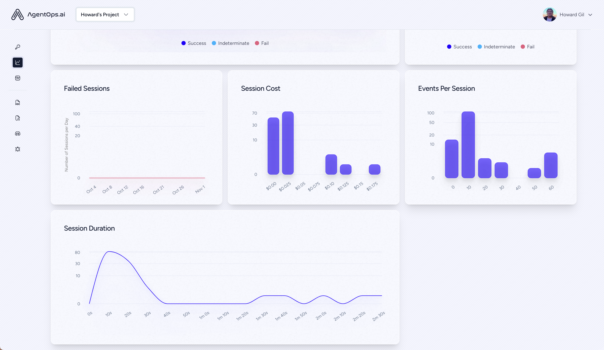
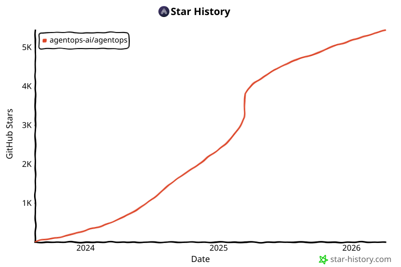

<div align="center">
  <a href="https://agentops.ai?ref=gh">
    
  </a>
</div>

<div align="center">
  <em>面向 AI 代理的可观测性与开发者工具平台</em>
</div>

<br />

<div align="center">
  <a href="https://pepy.tech/project/agentops">
    
  </a>
  <a href="https://github.com/agentops-ai/agentops/issues">
  
  </a>
  
  <a href="https://opensource.org/licenses/MIT">
    
  </a>
  <a href="https://smithery.ai/server/@AgentOps-AI/agentops-mcp">
    
  </a>
</div>

<p align="center">
  <a href="https://twitter.com/agentopsai/">
    
  </a>
  <a href="https://discord.gg/FagdcwwXRR">
    
  </a>
  <a href="https://app.agentops.ai/?ref=gh">
    
  </a>
  <a href="https://docs.agentops.ai/introduction">
    
  </a>
  <a href="https://entelligence.ai/AgentOps-AI&agentops">
    
  </a>
</p>

<div align="center">
  <video src="https://github.com/user-attachments/assets/dfb4fa8d-d8c4-4965-9ff6-5b8514c1c22f" width="650" autoplay loop muted></video>
</div>

<br/>

AgentOps 帮助开发者构建、评估和监控 AI 代理。从原型到生产。

## 开源

AgentOps 应用在 MIT 许可下开源。可在我们的 [app 目录](https://github.com/AgentOps-AI/agentops/tree/main/app)中浏览代码。

## 主要集成 🔌

<div align="center" style="background-color: white; padding: 20px; border-radius: 10px; margin: 0 auto; max-width: 800px;">
  <div style="display: flex; flex-wrap: wrap; justify-content: center; align-items: center; gap: 30px; margin-bottom: 20px;">
    <a href="https://docs.agentops.ai/v2/integrations/openai_agents_python"></a>
    <a href="https://docs.agentops.ai/v1/integrations/crewai"></a>
    <a href="https://docs.ag2.ai/docs/ecosystem/agentops"></a>
    <a href="https://docs.agentops.ai/v1/integrations/microsoft"></a>
  </div>

  <div style="display: flex; flex-wrap: wrap; justify-content: center; align-items: center; gap: 30px; margin-bottom: 20px;">
    <a href="https://docs.agentops.ai/v1/integrations/langchain"></a>
    <a href="https://docs.agentops.ai/v1/integrations/camel"></a>
    <a href="https://docs.llamaindex.ai/en/stable/module_guides/observability/?h=agentops#agentops"></a>
    <a href="https://docs.agentops.ai/v1/integrations/cohere"></a>
  </div>
</div>

|                                       |                                                               |
| ------------------------------------- | ------------------------------------------------------------- |
| 📊 **回放分析与调试** | 逐步代理执行图                           |
| 💸 **LLM 成本管理**            | 跟踪 LLM 基础模型提供商的支出               |
| 🤝 **框架集成**         | 与 CrewAI、AG2 (AutoGen)、Agno、LangGraph 等的原生集成         |
| ⚒️ **自托管**                      | 想在自己的云上运行 AgentOps？完全支持        |

## 快速开始 ⌨️

```bash
pip install agentops
```

#### 两行代码实现会话回放

初始化 AgentOps 客户端，即可自动获取所有 LLM 调用的分析数据。

[获取 API 密钥](https://app.agentops.ai/settings/projects)

```python
import agentops

# 程序开头（如 main.py, __init__.py）
agentops.init( < INSERT YOUR API KEY HERE >)

...

# 程序结尾
agentops.end_session('Success')
```

所有会话可在 [AgentOps 仪表盘](https://app.agentops.ai?ref=gh)查看
<br/>

## 自托管

想在你的机器上运行完整的 AgentOps 应用（仪表盘 + API 后端）？请按照 `app/README.md` 中的设置指南操作：

- [运行应用和后端（仪表盘 + API）](app/README.md)

<details>
  <summary>代理调试</summary>
  <a href="https://app.agentops.ai?ref=gh">
    
  </a>
  <a href="https://app.agentops.ai?ref=gh">
    
  </a>
  <a href="https://app.agentops.ai?ref=gh">
    
  </a>
</details>

<details>
  <summary>会话回放</summary>
  <a href="https://app.agentops.ai?ref=gh">
    
  </a>
</details>

<details>
  <summary>汇总分析</summary>
  <a href="https://app.agentops.ai?ref=gh">
   
  </a>
  <a href="https://app.agentops.ai?ref=gh">
   
  </a>
</details>

### 一流的开发者体验
用尽可能少的代码为你的代理、工具和函数添加强大的可观测性：一次一行。
<br/>
请参阅我们的[文档](http://docs.agentops.ai)

```python
# 创建会话 span（所有其他 span 的根）
from agentops.sdk.decorators import session

@session
def my_workflow():
    # 你的会话代码
    return result
```

```python
# 创建代理 span 以跟踪代理操作
from agentops.sdk.decorators import agent

@agent
class MyAgent:
    def __init__(self, name):
        self.name = name

    # 代理方法
```

```python
# 创建操作/任务 span 以跟踪特定操作
from agentops.sdk.decorators import operation, task

@operation  # 或 @task
def process_data(data):
    # 处理数据
    return result
```

```python
# 创建工作流 span 以跟踪多操作工作流
from agentops.sdk.decorators import workflow

@workflow
def my_workflow(data):
    # 工作流实现
    return result
```

```python
# 嵌套装饰器以构建正确的 span 层级
from agentops.sdk.decorators import session, agent, operation

@agent
class MyAgent:
    @operation
    def nested_operation(self, message):
        return f"Processed: {message}"

    @operation
    def main_operation(self):
        result = self.nested_operation("test message")
        return result

@session
def my_session():
    agent = MyAgent()
    return agent.main_operation()
```

所有装饰器支持：
- 输入/输出记录
- 异常处理
- Async/await 函数
- Generator 函数
- 自定义属性和名称

## 集成 🦾

### OpenAI Agents SDK 🖇️

使用工具、交接和防护机制构建多代理系统。AgentOps 原生集成 OpenAI Agents SDK 的 Python 和 TypeScript 版本。

#### Python

```bash
pip install openai-agents
```

- [Python 集成指南](https://docs.agentops.ai/v2/integrations/openai_agents_python)
- [OpenAI Agents Python 文档](https://openai.github.io/openai-agents-python/)

#### TypeScript

```bash
npm install agentops @openai/agents
```

- [TypeScript 集成指南](https://docs.agentops.ai/v2/integrations/openai_agents_js)
- [OpenAI Agents JS 文档](https://openai.github.io/openai-agents-js)

### CrewAI 🛶

只需 2 行代码即可为 Crew 代理添加可观测性。只需在环境中设置 `AGENTOPS_API_KEY`，你的 Crew 即可在 AgentOps 仪表盘上获得自动监控。

```bash
pip install 'crewai[agentops]'
```

- [AgentOps 集成示例](https://docs.agentops.ai/v1/integrations/crewai)
- [CrewAI 官方文档](https://docs.crewai.com/how-to/AgentOps-Observability)

### AG2 🤖
只需两行代码，即可为 AG2（原 AutoGen）代理添加完整的可观测性和监控。在环境中设置 `AGENTOPS_API_KEY` 并调用 `agentops.init()`

- [AG2 可观测性示例](https://github.com/ag2ai/ag2/blob/main/notebook/agentchat_agentops.ipynb)
- [AG2 - AgentOps 文档](https://docs.ag2.ai/latest/docs/ecosystem/agentops/)

### Camel AI 🐪

以完整的可观测性跟踪和分析 CAMEL 代理。在环境中设置 `AGENTOPS_API_KEY` 并初始化 AgentOps 即可开始。

- [Camel AI](https://www.camel-ai.org/) - 高级代理通信框架
- [AgentOps 集成示例](https://docs.agentops.ai/v1/integrations/camel)
- [Camel AI 官方文档](https://docs.camel-ai.org/cookbooks/agents_tracking.html)

<details>
  <summary>安装</summary>

```bash
pip install "camel-ai[all]==0.2.11"
pip install agentops
```

```python
import os
import agentops
from camel.agents import ChatAgent
from camel.messages import BaseMessage
from camel.models import ModelFactory
from camel.types import ModelPlatformType, ModelType

# 初始化 AgentOps
agentops.init(os.getenv("AGENTOPS_API_KEY"), tags=["CAMEL Example"])

# 在 AgentOps 初始化后导入工具包以进行跟踪
from camel.toolkits import SearchToolkit

# 设置带搜索工具的代理
sys_msg = BaseMessage.make_assistant_message(
    role_name='Tools calling operator',
    content='You are a helpful assistant'
)

# 配置工具和模型
tools = [*SearchToolkit().get_tools()]
model = ModelFactory.create(
    model_platform=ModelPlatformType.OPENAI,
    model_type=ModelType.GPT_4O_MINI,
)

# 创建并运行代理
camel_agent = ChatAgent(
    system_message=sys_msg,
    model=model,
    tools=tools,
)

response = camel_agent.step("What is AgentOps?")
print(response)

agentops.end_session("Success")
```

查看我们的 [Camel 集成指南](https://docs.agentops.ai/v1/integrations/camel)了解更多示例，包括多代理场景。
</details>

### Langchain 🦜🔗

AgentOps 与使用 Langchain 构建的应用无缝协作。要使用处理器，请将 Langchain 作为可选依赖安装：

<details>
  <summary>安装</summary>

```shell
pip install agentops[langchain]
```

要使用处理器，请导入并进行设置

```python
import os
from langchain.chat_models import ChatOpenAI
from langchain.agents import initialize_agent, AgentType
from agentops.integration.callbacks.langchain import LangchainCallbackHandler

AGENTOPS_API_KEY = os.environ['AGENTOPS_API_KEY']
handler = LangchainCallbackHandler(api_key=AGENTOPS_API_KEY, tags=['Langchain Example'])

llm = ChatOpenAI(openai_api_key=OPENAI_API_KEY,
                 callbacks=[handler],
                 model='gpt-3.5-turbo')

agent = initialize_agent(tools,
                         llm,
                         agent=AgentType.CHAT_ZERO_SHOT_REACT_DESCRIPTION,
                         verbose=True,
                         callbacks=[handler], # 你必须传入回调处理器来记录代理
                         handle_parsing_errors=True)
```

查看 [Langchain 示例 Notebook](./examples/langchain/langchain_examples.ipynb) 了解更多详情，包括异步处理器。

</details>

### Cohere ⌨️

对 Cohere（>=5.4.0）的一流支持。这是一个持续迭代的集成，如果你需要添加任何功能，请在 Discord 上联系我们！

- [AgentOps 集成示例](https://docs.agentops.ai/v1/integrations/cohere)
- [Cohere 官方文档](https://docs.cohere.com/reference/about)

<details>
  <summary>安装</summary>

```bash
pip install cohere
```

```python python
import cohere
import agentops

# 程序代码开头（如 main.py, __init__.py）
agentops.init(<INSERT YOUR API KEY HERE>)
co = cohere.Client()

chat = co.chat(
    message="Is it pronounced ceaux-hear or co-hehray?"
)

print(chat)

agentops.end_session('Success')
```

```python python
import cohere
import agentops

# 程序代码开头（如 main.py, __init__.py）
agentops.init(<INSERT YOUR API KEY HERE>)

co = cohere.Client()

stream = co.chat_stream(
    message="Write me a haiku about the synergies between Cohere and AgentOps"
)

for event in stream:
    if event.event_type == "text-generation":
        print(event.text, end='')

agentops.end_session('Success')
```
</details>

### Anthropic ﹨

跟踪使用 Anthropic Python SDK（>=0.32.0）构建的代理。

- [AgentOps 集成指南](https://docs.agentops.ai/v1/integrations/anthropic)
- [Anthropic 官方文档](https://docs.anthropic.com/en/docs/welcome)

<details>
  <summary>安装</summary>

```bash
pip install anthropic
```

```python python
import anthropic
import agentops

# 程序代码开头（如 main.py, __init__.py）
agentops.init(<INSERT YOUR API KEY HERE>)

client = anthropic.Anthropic(
    # 这是默认值，可以省略
    api_key=os.environ.get("ANTHROPIC_API_KEY"),
)

message = client.messages.create(
        max_tokens=1024,
        messages=[
            {
                "role": "user",
                "content": "Tell me a cool fact about AgentOps",
            }
        ],
        model="claude-3-opus-20240229",
    )
print(message.content)

agentops.end_session('Success')
```

流式调用
```python python
import anthropic
import agentops

# 程序代码开头（如 main.py, __init__.py）
agentops.init(<INSERT YOUR API KEY HERE>)

client = anthropic.Anthropic(
    # 这是默认值，可以省略
    api_key=os.environ.get("ANTHROPIC_API_KEY"),
)

stream = client.messages.create(
    max_tokens=1024,
    model="claude-3-opus-20240229",
    messages=[
        {
            "role": "user",
            "content": "Tell me something cool about streaming agents",
        }
    ],
    stream=True,
)

response = ""
for event in stream:
    if event.type == "content_block_delta":
        response += event.delta.text
    elif event.type == "message_stop":
        print("\n")
        print(response)
        print("\n")
```

异步

```python python
import asyncio
from anthropic import AsyncAnthropic

client = AsyncAnthropic(
    # 这是默认值，可以省略
    api_key=os.environ.get("ANTHROPIC_API_KEY"),
)

async def main() -> None:
    message = await client.messages.create(
        max_tokens=1024,
        messages=[
            {
                "role": "user",
                "content": "Tell me something interesting about async agents",
            }
        ],
        model="claude-3-opus-20240229",
    )
    print(message.content)

await main()
```
</details>

### Mistral 〽️

跟踪使用 Mistral Python SDK（>=0.32.0）构建的代理。

- [AgentOps 集成示例](./examples/mistral//mistral_example.ipynb)
- [Mistral 官方文档](https://docs.mistral.ai)

<details>
  <summary>安装</summary>

```bash
pip install mistralai
```

同步

```python python
from mistralai import Mistral
import agentops

# 程序代码开头（如 main.py, __init__.py）
agentops.init(<INSERT YOUR API KEY HERE>)

client = Mistral(
    # 这是默认值，可以省略
    api_key=os.environ.get("MISTRAL_API_KEY"),
)

message = client.chat.complete(
        messages=[
            {
                "role": "user",
                "content": "Tell me a cool fact about AgentOps",
            }
        ],
        model="open-mistral-nemo",
    )
print(message.choices[0].message.content)

agentops.end_session('Success')
```

流式调用

```python python
from mistralai import Mistral
import agentops

# 程序代码开头（如 main.py, __init__.py）
agentops.init(<INSERT YOUR API KEY HERE>)

client = Mistral(
    # 这是默认值，可以省略
    api_key=os.environ.get("MISTRAL_API_KEY"),
)

message = client.chat.stream(
        messages=[
            {
                "role": "user",
                "content": "Tell me something cool about streaming agents",
            }
        ],
        model="open-mistral-nemo",
    )

response = ""
for event in message:
    if event.data.choices[0].finish_reason == "stop":
        print("\n")
        print(response)
        print("\n")
    else:
        response += event.text

agentops.end_session('Success')
```

异步

```python python
import asyncio
from mistralai import Mistral

client = Mistral(
    # 这是默认值，可以省略
    api_key=os.environ.get("MISTRAL_API_KEY"),
)

async def main() -> None:
    message = await client.chat.complete_async(
        messages=[
            {
                "role": "user",
                "content": "Tell me something interesting about async agents",
            }
        ],
        model="open-mistral-nemo",
    )
    print(message.choices[0].message.content)

await main()
```

异步流式调用

```python python
import asyncio
from mistralai import Mistral

client = Mistral(
    # 这是默认值，可以省略
    api_key=os.environ.get("MISTRAL_API_KEY"),
)

async def main() -> None:
    message = await client.chat.stream_async(
        messages=[
            {
                "role": "user",
                "content": "Tell me something interesting about async streaming agents",
            }
        ],
        model="open-mistral-nemo",
    )

    response = ""
    async for event in message:
        if event.data.choices[0].finish_reason == "stop":
            print("\n")
            print(response)
            print("\n")
        else:
            response += event.text

await main()
```
</details>

### CamelAI ﹨

跟踪使用 CamelAI Python SDK（>=0.32.0）构建的代理。

- [CamelAI 集成指南](https://docs.camel-ai.org/cookbooks/agents_tracking.html#)
- [CamelAI 官方文档](https://docs.camel-ai.org/index.html)

<details>
  <summary>安装</summary>

```bash
pip install camel-ai[all]
pip install agentops
```

```python python
# 导入依赖
import agentops
import os
from getpass import getpass
from dotenv import load_dotenv

# 设置密钥
load_dotenv()
openai_api_key = os.getenv("OPENAI_API_KEY") or "<your openai key here>"
agentops_api_key = os.getenv("AGENTOPS_API_KEY") or "<your agentops key here>"

```
</details>

[在此查看使用示例！](examples/camelai_examples/README.md)。

### LiteLLM 🚅

AgentOps 支持 LiteLLM（>=1.3.1），允许你使用相同的输入/输出格式调用 100+ LLM。

- [AgentOps 集成示例](https://docs.agentops.ai/v1/integrations/litellm)
- [LiteLLM 官方文档](https://docs.litellm.ai/docs/providers)

<details>
  <summary>安装</summary>

```bash
pip install litellm
```

```python python
# 不要这样使用 LiteLLM
# from litellm import completion
# ...
# response = completion(model="claude-3", messages=messages)

# 应该这样使用 LiteLLM
import litellm
...
response = litellm.completion(model="claude-3", messages=messages)
# 或
response = await litellm.acompletion(model="claude-3", messages=messages)
```
</details>

### LlamaIndex 🦙

AgentOps 与使用 LlamaIndex 构建的应用无缝协作。LlamaIndex 是一个用于构建上下文增强生成式 AI 应用的框架。

<details>
  <summary>安装</summary>

```shell
pip install llama-index-instrumentation-agentops
```

要使用处理器，请导入并进行设置

```python
from llama_index.core import set_global_handler

# 注意：你可以按照 AgentOps 文档中的说明设置 AgentOps 环境变量（如 'AGENTOPS_API_KEY'），
# 或将 AgentOps AOClient 预期的等效关键字参数作为 **eval_params 传递给 set_global_handler。

set_global_handler("agentops")
```

查看 [LlamaIndex 文档](https://docs.llamaindex.ai/en/stable/module_guides/observability/?h=agentops#agentops)了解更多详情。

</details>

### Llama Stack 🦙🥞

AgentOps 支持 Llama Stack Python Client（>=0.0.53），允许你监控 Agentic 应用。

- [AgentOps 集成示例 1](https://github.com/AgentOps-AI/agentops/pull/530/files/65a5ab4fdcf310326f191d4b870d4f553591e3ea#diff-fdddf65549f3714f8f007ce7dfd1cde720329fe54155d54389dd50fbd81813cb)
- [AgentOps 集成示例 2](https://github.com/AgentOps-AI/agentops/pull/530/files/65a5ab4fdcf310326f191d4b870d4f553591e3ea#diff-6688ff4fb7ab1ce7b1cc9b8362ca27264a3060c16737fb1d850305787a6e3699)
- [Llama Stack Python Client 官方仓库](https://github.com/meta-llama/llama-stack-client-python)

### SwarmZero AI 🐝

以完整的可观测性跟踪和分析 SwarmZero 代理。在环境中设置 `AGENTOPS_API_KEY` 并初始化 AgentOps 即可开始。

- [SwarmZero](https://swarmzero.ai) - 高级多代理框架
- [AgentOps 集成示例](https://docs.agentops.ai/v1/integrations/swarmzero)
- [SwarmZero AI 集成示例](https://docs.swarmzero.ai/examples/ai-agents/build-and-monitor-a-web-search-agent)
- [SwarmZero AI - AgentOps 文档](https://docs.swarmzero.ai/sdk/observability/agentops)
- [SwarmZero Python SDK 官方仓库](https://github.com/swarmzero/swarmzero)

<details>
  <summary>安装</summary>

```bash
pip install swarmzero
pip install agentops
```

```python
from dotenv import load_dotenv
load_dotenv()

import agentops
agentops.init(<INSERT YOUR API KEY HERE>)

from swarmzero import Agent, Swarm
# ...
```
</details>

## 评估路线图 🧭

| 平台                                                                     | 仪表盘                                  | 评估                                  |
| ---------------------------------------------------------------------------- | ------------------------------------------ | -------------------------------------- |
| ✅ Python SDK                                                                | ✅ 多会话和跨会话指标 | ✅ 自定义评估指标                 |
| 🚧 评估构建器 API                                                    | ✅ 自定义事件标签跟踪              | 🔜 代理评分卡                    |
| 🚧 [Javascript/Typescript SDK (Alpha)](https://github.com/AgentOps-AI/agentops-node) | ✅ 会话回放                         | 🔜 评估游乐场 + 排行榜 |

## 调试路线图 🧭

| 性能测试                       | 环境                                                                        | LLM 测试                                 | 推理和执行测试                   |
| ----------------------------------------- | ----------------------------------------------------------------------------------- | ------------------------------------------- | ------------------------------------------------- |
| ✅ 事件延迟分析                 | 🔜 非平稳环境测试                                               | 🔜 LLM 非确定性函数检测 | 🚧 无限循环和递归思维检测 |
| ✅ 代理工作流执行定价       | 🔜 多模态环境                                                         | 🚧 Token 溢出标志               | 🔜 错误推理检测                     |
| 🚧 成功验证器（外部）          | 🔜 执行容器                                                             | 🔜 上下文溢出标志             | 🔜 生成式代码验证器                     |
| 🔜 代理控制器/技能测试          | ✅ 蜜罐和提示词注入检测 ([PromptArmor](https://promptarmor.com)) | ✅ API 账单追踪                        | 🔜 错误断点分析                      |
| 🔜 信息上下文约束测试 | 🔜 反代理障碍（如验证码）                                            | 🔜 CI/CD 集成检查                 |                                                   |
| 🔜 回归测试                     | ✅ 多代理框架可视化                                              |                                             |                                                   |

### 为什么选择 AgentOps？ 🤔

没有合适的工具，AI 代理会变得缓慢、昂贵且不可靠。我们的使命是帮助你将代理从原型推向生产。以下是 AgentOps 的优势：

- **全面的可观测性**：跟踪 AI 代理的性能、用户交互和 API 使用情况。
- **实时监控**：通过会话回放、指标和实时监控工具获取即时洞察。
- **成本控制**：监控和管理 LLM 和 API 调用的支出。
- **故障检测**：快速识别和响应代理故障以及多代理交互问题。
- **工具使用统计**：通过详细分析了解代理如何使用外部工具。
- **会话级指标**：通过全面的统计信息获取代理会话的全局视图。

AgentOps 旨在让代理的可观测性、测试和监控变得简单。

## Star 历史

查看我们在社区中的增长：



## 使用 AgentOps 的热门项目

| 仓库 | Stars  |
| :--------  | -----: |
|  &nbsp; [geekan](https://github.com/geekan) / [MetaGPT](https://github.com/geekan/MetaGPT) | 42787 |
|  &nbsp; [run-llama](https://github.com/run-llama) / [llama_index](https://github.com/run-llama/llama_index) | 34446 |
|  &nbsp; [crewAIInc](https://github.com/crewAIInc) / [crewAI](https://github.com/crewAIInc/crewAI) | 18287 |
|  &nbsp; [camel-ai](https://github.com/camel-ai) / [camel](https://github.com/camel-ai/camel) | 5166 |
|  &nbsp; [superagent-ai](https://github.com/superagent-ai) / [superagent](https://github.com/superagent-ai/superagent) | 5050 |
|  &nbsp; [iyaja](https://github.com/iyaja) / [llama-fs](https://github.com/iyaja/llama-fs) | 4713 |
|  &nbsp; [ag2ai](https://github.com/ag2ai) / [ag2](https://github.com/ag2ai/ag2) | 4240 |
|  &nbsp; [BasedHardware](https://github.com/BasedHardware) / [Omi](https://github.com/BasedHardware/Omi) | 2723 |
|  &nbsp; [MervinPraison](https://github.com/MervinPraison) / [PraisonAI](https://github.com/MervinPraison/PraisonAI) | 2007 |
|  &nbsp; [AgentOps-AI](https://github.com/AgentOps-AI) / [Jaiqu](https://github.com/AgentOps-AI/Jaiqu) | 272 |
|  &nbsp; [swarmzero](https://github.com/swarmzero) / [swarmzero](https://github.com/swarmzero/swarmzero) | 195 |
|  &nbsp; [strnad](https://github.com/strnad) / [CrewAI-Studio](https://github.com/strnad/CrewAI-Studio) | 134 |
|  &nbsp; [alejandro-ao](https://github.com/alejandro-ao) / [exa-crewai](https://github.com/alejandro-ao/exa-crewai) | 55 |
|  &nbsp; [tonykipkemboi](https://github.com/tonykipkemboi) / [youtube_yapper_trapper](https://github.com/tonykipkemboi/youtube_yapper_trapper) | 47 |
|  &nbsp; [sethcoast](https://github.com/sethcoast) / [cover-letter-builder](https://github.com/sethcoast/cover-letter-builder) | 27 |
|  &nbsp; [bhancockio](https://github.com/bhancockio) / [chatgpt4o-analysis](https://github.com/bhancockio/chatgpt4o-analysis) | 19 |
|  &nbsp; [breakstring](https://github.com/breakstring) / [Agentic_Story_Book_Workflow](https://github.com/breakstring/Agentic_Story_Book_Workflow) | 14 |
|  &nbsp; [MULTI-ON](https://github.com/MULTI-ON) / [multion-python](https://github.com/MULTI-ON/multion-python) | 13 |

_由 [github-dependents-info](https://github.com/nvuillam/github-dependents-info) 生成，作者 [Nicolas Vuillamy](https://github.com/nvuillam)_
