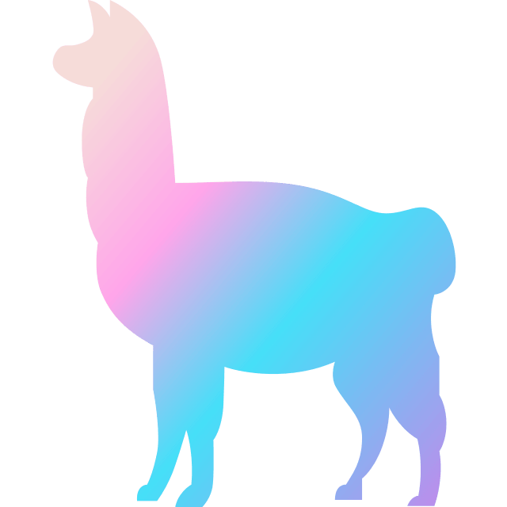
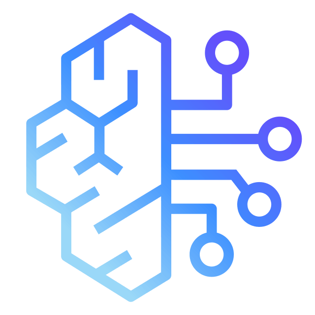
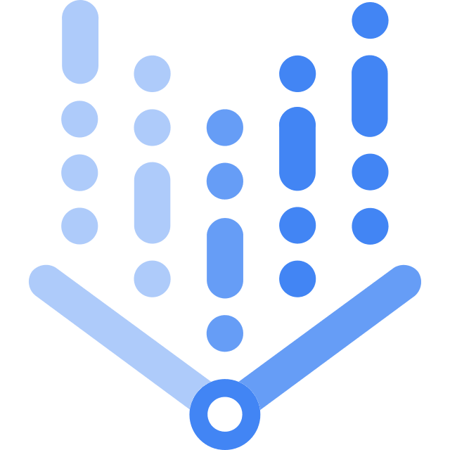

<p align="center">
    <a target="_blank" href="https://phoenix.arize.com" style="background:none">
        </img>
    </a>
    <br/>
    <br/>
    <a href="https://arize.com/docs/phoenix/">
        
    </a>
    <a target="_blank" href="https://join.slack.com/t/arize-ai/shared_invite/zt-3r07iavnk-ammtATWSlF0pSrd1DsMW7g">
        
    </a>
     <a target="_blank" href="https://bsky.app/profile/arize-phoenix.bsky.social">
        
    </a>
    <a target="_blank" href="https://x.com/ArizePhoenix">
        
    </a>
    <a target="_blank" href="https://pypi.org/project/arize-phoenix/">
        
    </a>
    <a target="_blank" href="https://anaconda.org/conda-forge/arize-phoenix">
        
    </a>
    <a target="_blank" href="https://pypi.org/project/arize-phoenix/">
        
    </a>
    <a target="_blank" href="https://hub.docker.com/r/arizephoenix/phoenix/tags">
        
    </a>
    <a target="_blank" href="https://hub.docker.com/r/arizephoenix/phoenix-helm">
        
    </a>
    <a target="_blank" href="https://github.com/Arize-ai/phoenix/tree/main/js/packages/phoenix-mcp">
        
    </a>
    <a href="cursor://anysphere.cursor-deeplink/mcp/install?name=phoenix&config=eyJjb21tYW5kIjoibnB4IC15IEBhcml6ZWFpL3Bob2VuaXgtbWNwQGxhdGVzdCAtLWJhc2VVcmwgaHR0cHM6Ly9teS1waG9lbml4LmNvbSAtLWFwaUtleSB5b3VyLWFwaS1rZXkifQ%3D%3D"></a>
    
</p>

Phoenix 是一个开源的 AI 可观测性平台，专为实验、评估和故障排查而设计。它提供：

- [**_Tracing_**](https://arize.com/docs/phoenix/tracing/llm-traces) - 使用基于 OpenTelemetry 的插桩来跟踪你的 LLM 应用运行时。
- [**_Evaluation_**](https://arize.com/docs/phoenix/evaluation/llm-evals) - 利用 LLM 通过响应评估和检索评估对应用性能进行基准测试。
- [**_Datasets_**](https://arize.com/docs/phoenix/datasets-and-experiments/overview-datasets) - 创建带版本的数据集，用于实验、评估和微调。
- [**_Experiments_**](https://arize.com/docs/phoenix/datasets-and-experiments/overview-datasets#experiments) - 跟踪并评估对提示词、LLM 和检索的更改。
- [**_Playground_**](https://arize.com/docs/phoenix/prompt-engineering/overview-prompts)- 优化提示词、比较模型、调整参数并重放已跟踪的 LLM 调用。
- [**_Prompt Management_**](https://arize.com/docs/phoenix/prompt-engineering/overview-prompts/prompt-management)- 使用版本控制、标签和实验，系统化地管理和测试提示词变更。

Phoenix 与供应商和编程语言无关，并且开箱即用支持流行框架（[OpenAI Agents SDK](https://arize.com/docs/phoenix/tracing/integrations-tracing/openai-agents-sdk)、[Claude Agent SDK](https://arize.com/docs/phoenix/integrations/python/claude-agent-sdk)、[LangGraph](https://arize.com/docs/phoenix/tracing/integrations-tracing/langchain)、[Vercel AI SDK](https://arize.com/docs/phoenix/tracing/integrations-tracing/vercel-ai-sdk)、[Mastra](https://arize.com/docs/phoenix/integrations/typescript/mastra)、[CrewAI](https://arize.com/docs/phoenix/tracing/integrations-tracing/crewai)、[LlamaIndex](https://arize.com/docs/phoenix/tracing/integrations-tracing/llamaindex)、[DSPy](https://arize.com/docs/phoenix/tracing/integrations-tracing/dspy)）以及 LLM 提供商（[OpenAI](https://arize.com/docs/phoenix/tracing/integrations-tracing/openai)、[Anthropic](https://arize.com/docs/phoenix/tracing/integrations-tracing/anthropic)、[Google GenAI](https://arize.com/docs/phoenix/tracing/integrations-tracing/google-genai)、[Google ADK](https://arize.com/docs/phoenix/integrations/llm-providers/google-gen-ai/google-adk-tracing)、[AWS Bedrock](https://arize.com/docs/phoenix/tracing/integrations-tracing/bedrock)、[OpenRouter](https://arize.com/docs/phoenix/integrations/python/openrouter)、[LiteLLM](https://arize.com/docs/phoenix/tracing/integrations-tracing/litellm) 等）。有关自动插桩的详细信息，请查看 [OpenInference](https://github.com/Arize-ai/openinference) 项目。

Phoenix 几乎可以在任何地方运行，包括你的本地机器、Jupyter notebook、容器化部署环境或云端。

## 安装

通过 `pip` 或 `conda` 安装 Phoenix

```shell
pip install arize-phoenix
```

Phoenix 容器镜像可通过 [Docker Hub](https://hub.docker.com/r/arizephoenix/phoenix) 获取，并可使用 Docker 或 Kubernetes 部署。Arize AI 也在 [app.phoenix.arize.com](https://app.phoenix.arize.com/) 提供云实例。

## 软件包

`arize-phoenix` 包含完整的 Phoenix 平台。不过，如果你已经部署了 Phoenix 平台，也可以配合使用轻量级 Python 子包和 TypeScript 包。

### Python 子包

| 软件包                                                                                       | 版本与文档                                                                                                                                                                                                                                                                          | 说明                                                                                       |
| --------------------------------------------------------------------------------------------- | ----------------------------------------------------------------------------------------------------------------------------------------------------------------------------------------------------------------------------------------------------------------------------------- | ------------------------------------------------------------------------------------------ |
| [arize-phoenix-otel](https://github.com/Arize-ai/phoenix/tree/main/packages/phoenix-otel)     | [](https://pypi.org/project/arize-phoenix-otel/) [](https://arize-phoenix.readthedocs.io/projects/otel/en/latest/index.html)       | 提供对 OpenTelemetry 原语的轻量封装，并带有 Phoenix 感知的默认配置 |
| [arize-phoenix-client](https://github.com/Arize-ai/phoenix/tree/main/packages/phoenix-client) | [](https://pypi.org/project/arize-phoenix-client/) [](https://arize-phoenix.readthedocs.io/projects/client/en/latest/index.html) | 用于通过 Phoenix 的 OpenAPI REST 接口与服务器交互的轻量客户端 |
| [arize-phoenix-evals](https://github.com/Arize-ai/phoenix/tree/main/packages/phoenix-evals)   | [](https://pypi.org/project/arize-phoenix-evals/) [](https://arize-phoenix.readthedocs.io/projects/evals/en/latest/index.html)    | 用于评估 LLM 应用的工具，包括 RAG 相关性、答案相关性等 |

### TypeScript 子包

| 软件包                                                                                             | 版本与文档                                                                                                                                                                                                                                                                                     | 说明                                                                                                         |
| --------------------------------------------------------------------------------------------------- | ---------------------------------------------------------------------------------------------------------------------------------------------------------------------------------------------------------------------------------------------------------------------------------------------- | ------------------------------------------------------------------------------------------------------------ |
| [@arizeai/phoenix-otel](https://github.com/Arize-ai/phoenix/tree/main/js/packages/phoenix-otel)     | [](https://www.npmjs.com/package/@arizeai/phoenix-otel) [](https://arize-ai.github.io/phoenix/)                                           | 提供对 OpenTelemetry 原语的轻量封装，并带有 Phoenix 感知的默认配置 |
| [@arizeai/phoenix-client](https://github.com/Arize-ai/phoenix/tree/main/js/packages/phoenix-client) | [](https://www.npmjs.com/package/@arizeai/phoenix-client) [](https://arize-ai.github.io/phoenix/)                                       | Arize Phoenix API 的客户端 |
| [@arizeai/phoenix-evals](https://github.com/Arize-ai/phoenix/tree/main/js/packages/phoenix-evals)   | [](https://www.npmjs.com/package/@arizeai/phoenix-evals) [](https://arize-ai.github.io/phoenix/)                                         | 面向 LLM 应用的 TypeScript 评估库（alpha 版本） |
| [@arizeai/phoenix-mcp](https://github.com/Arize-ai/phoenix/tree/main/js/packages/phoenix-mcp)       | [](https://www.npmjs.com/package/@arizeai/phoenix-mcp) [](./js/packages/phoenix-mcp/README.md)                                               | Arize Phoenix 的 MCP 服务器实现，为 Phoenix 的能力提供统一接口 |
| [@arizeai/phoenix-cli](https://github.com/Arize-ai/phoenix/tree/main/js/packages/phoenix-cli)       | [](https://www.npmjs.com/package/@arizeai/phoenix-cli) [](https://arize.com/docs/phoenix/sdk-api-reference/typescript/arizeai-phoenix-cli) | 用于获取 traces、datasets 和 experiments，以便配合 Claude Code、Cursor 及其他编码代理使用的 CLI |

## Tracing 集成

Phoenix 构建于 OpenTelemetry 之上，与供应商、语言和框架无关。有关 tracing 集成和示例应用的详细信息，请参见 [OpenInference](https://github.com/Arize-ai/openinference) 项目。

**Python 集成**
| | 集成 | 软件包 | 版本 |
|:---:|---|---|---|
| <picture><source media="(prefers-color-scheme: dark)" srcset="assets/023-openai-f0792d3e3a.png"></picture> | [OpenAI](https://arize.com/docs/phoenix/tracing/integrations-tracing/openai) | `openinference-instrumentation-openai` | [](https://pypi.python.org/pypi/openinference-instrumentation-openai) |
| <picture><source media="(prefers-color-scheme: dark)" srcset="assets/023-openai-f0792d3e3a.png"></picture> | [OpenAI Agents](https://arize.com/docs/phoenix/tracing/integrations-tracing/openai-agents-sdk) | `openinference-instrumentation-openai-agents` | [](https://pypi.python.org/pypi/openinference-instrumentation-openai-agents) |
|  | [LlamaIndex](https://arize.com/docs/phoenix/tracing/integrations-tracing/llamaindex) | `openinference-instrumentation-llama-index` | [](https://pypi.python.org/pypi/openinference-instrumentation-llama-index) |
| | [DSPy](https://arize.com/docs/phoenix/tracing/integrations-tracing/dspy) | `openinference-instrumentation-dspy` | [](https://pypi.python.org/pypi/openinference-instrumentation-dspy) |
|  | [AWS Bedrock](https://arize.com/docs/phoenix/tracing/integrations-tracing/bedrock) | `openinference-instrumentation-bedrock` | [](https://pypi.python.org/pypi/openinference-instrumentation-bedrock) |
|  | [LangChain](https://arize.com/docs/phoenix/tracing/integrations-tracing/langchain) | `openinference-instrumentation-langchain` | [](https://pypi.python.org/pypi/openinference-instrumentation-langchain) |
|  | [MistralAI](https://arize.com/docs/phoenix/tracing/integrations-tracing/mistralai) | `openinference-instrumentation-mistralai` | [](https://pypi.python.org/pypi/openinference-instrumentation-mistralai) |
|  | [Google GenAI](https://arize.com/docs/phoenix/tracing/integrations-tracing/google-gen-ai) | `openinference-instrumentation-google-genai` | [](https://pypi.python.org/pypi/openinference-instrumentation-google-genai) |
|  | [Google ADK](https://arize.com/docs/phoenix/integrations/llm-providers/google-gen-ai/google-adk-tracing) | `openinference-instrumentation-google-adk` | [](https://pypi.python.org/pypi/openinference-instrumentation-google-adk) |
| | [Guardrails](https://arize.com/docs/phoenix/tracing/integrations-tracing/guardrails) | `openinference-instrumentation-guardrails` | [](https://pypi.python.org/pypi/openinference-instrumentation-guardrails) |
|  | [VertexAI](https://arize.com/docs/phoenix/tracing/integrations-tracing/vertexai) | `openinference-instrumentation-vertexai` | [](https://pypi.python.org/pypi/openinference-instrumentation-vertexai) |
|  | [CrewAI](https://arize.com/docs/phoenix/tracing/integrations-tracing/crewai) | `openinference-instrumentation-crewai` | [](https://pypi.python.org/pypi/openinference-instrumentation-crewai) |
| | [Haystack](https://arize.com/docs/phoenix/tracing/integrations-tracing/haystack) | `openinference-instrumentation-haystack` | [](https://pypi.python.org/pypi/openinference-instrumentation-haystack) |
| | [LiteLLM](https://arize.com/docs/phoenix/tracing/integrations-tracing/litellm) | `openinference-instrumentation-litellm` | [](https://pypi.python.org/pypi/openinference-instrumentation-litellm) |
| <picture><source media="(prefers-color-scheme: dark)" srcset="assets/024-groq-05382362a2.png"></picture> | [Groq](https://arize.com/docs/phoenix/tracing/integrations-tracing/groq) | `openinference-instrumentation-groq` | [](https://pypi.python.org/pypi/openinference-instrumentation-groq) |
| | [Instructor](https://arize.com/docs/phoenix/tracing/integrations-tracing/instructor) | `openinference-instrumentation-instructor` | [](https://pypi.python.org/pypi/openinference-instrumentation-instructor) |
| <picture><source media="(prefers-color-scheme: dark)" srcset="assets/025-anthropic-39940e6819.png"></picture> | [Anthropic](https://arize.com/docs/phoenix/tracing/integrations-tracing/anthropic) | `openinference-instrumentation-anthropic` | [](https://pypi.python.org/pypi/openinference-instrumentation-anthropic) |
|  | [Smolagents](https://huggingface.co/docs/smolagents/en/tutorials/inspect_runs) | `openinference-instrumentation-smolagents` | [](https://pypi.python.org/pypi/openinference-instrumentation-smolagents) |
| | [Agno](https://arize.com/docs/phoenix/tracing/integrations-tracing/agno) | `openinference-instrumentation-agno` | [](https://pypi.python.org/pypi/openinference-instrumentation-agno) |
| <picture><source media="(prefers-color-scheme: dark)" srcset="assets/026-mcp-db2985c528.png"></picture> | [MCP](https://arize.com/docs/phoenix/tracing/integrations-tracing/model-context-protocol-mcp) | `openinference-instrumentation-mcp` | [](https://pypi.python.org/pypi/openinference-instrumentation-mcp) |
|  | [Pydantic AI](https://arize.com/docs/phoenix/integrations/python/pydantic) | `openinference-instrumentation-pydantic-ai` | [](https://pypi.python.org/pypi/openinference-instrumentation-pydantic-ai) |
| | [Autogen AgentChat](https://arize.com/docs/phoenix/integrations/frameworks/autogen/autogen-tracing) | `openinference-instrumentation-autogen-agentchat` | [](https://pypi.python.org/pypi/openinference-instrumentation-autogen-agentchat) |
| | [Portkey](https://arize.com/docs/phoenix/integrations/portkey) | `openinference-instrumentation-portkey` | [](https://pypi.python.org/pypi/openinference-instrumentation-portkey) |
| | [Agent Spec](https://arize.com/docs/phoenix/tracing/integrations-tracing/agentspec) | `openinference-instrumentation-agentspec` | [](https://pypi.python.org/pypi/openinference-instrumentation-agentspec) |
|  | [Claude Agent SDK](https://arize.com/docs/phoenix/integrations/python/claude-agent-sdk) | `openinference-instrumentation-claude-agent-sdk` | [](https://pypi.python.org/pypi/openinference-instrumentation-claude-agent-sdk) |

## Span Processor

通过添加 span processor 来对来自其他插桩库的数据进行规范化和转换，从而统一数据。

| 软件包                                                                                                           | 说明                                                             | 版本                                                                                                                                                                   |
| ----------------------------------------------------------------------------------------------------------------- | ---------------------------------------------------------------- | ---------------------------------------------------------------------------------------------------------------------------------------------------------------------- |
| [`openinference-instrumentation-openlit`](./python/instrumentation/openinference-instrumentation-openlit)         | OpenLIT traces 的 OpenInference Span Processor。                 | [](https://pypi.python.org/pypi/openinference-instrumentation-openlit)         |
| [`openinference-instrumentation-openllmetry`](./python/instrumentation/openinference-instrumentation-openllmetry) | OpenLLMetry (Traceloop) traces 的 OpenInference Span Processor。 | [](https://pypi.python.org/pypi/openinference-instrumentation-openllmetry) |

### JavaScript 集成

| | 集成 | 软件包 | 版本 |
|:---:|---|---|---|
| <picture><source media="(prefers-color-scheme: dark)" srcset="assets/023-openai-f0792d3e3a.png"></picture> | [OpenAI](https://arize.com/docs/phoenix/tracing/integrations-tracing/openai-node-sdk) | `@arizeai/openinference-instrumentation-openai` | [](https://www.npmjs.com/package/@arizeai/openinference-instrumentation-openai) |
|  | [LangChain.js](https://arize.com/docs/phoenix/tracing/integrations-tracing/langchain) | `@arizeai/openinference-instrumentation-langchain` | [](https://www.npmjs.com/package/@arizeai/openinference-instrumentation-langchain) |
| <picture><source media="(prefers-color-scheme: dark)" srcset="assets/027-vercel-ceeaa3edb1.png"></picture> | [Vercel AI SDK](https://arize.com/docs/phoenix/tracing/integrations-tracing/vercel-ai-sdk) | `@arizeai/openinference-vercel` | [](https://www.npmjs.com/package/@arizeai/openinference-vercel) |
| | [BeeAI](https://arize.com/docs/phoenix/tracing/integrations-tracing/beeai) | `@arizeai/openinference-instrumentation-beeai` | [](https://www.npmjs.com/package/@arizeai/openinference-instrumentation-beeai) |
|  | [Claude Agent SDK](https://arize.com/docs/phoenix/integrations/typescript/claude-agent-sdk) | `@arizeai/openinference-instrumentation-claude-agent-sdk` | [](https://www.npmjs.com/package/@arizeai/openinference-instrumentation-claude-agent-sdk) |
| <picture><source media="(prefers-color-scheme: dark)" srcset="assets/028-mastra-e589040202.png"></picture> | [Mastra](https://arize.com/docs/phoenix/integrations/typescript/mastra) | `@mastra/arize` | [](https://www.npmjs.com/package/@mastra/arize) |
| <picture><source media="(prefers-color-scheme: dark)" srcset="assets/026-mcp-db2985c528.png"></picture> | [MCP](https://arize.com/docs/phoenix/integrations/typescript/mcp) | `@arizeai/openinference-instrumentation-mcp` | [](https://www.npmjs.com/package/@arizeai/openinference-instrumentation-mcp) |

### Java 集成

| | 集成 | 软件包 | 版本 |
|:---:|---|---|---|
|  | [LangChain4j](https://github.com/Arize-ai/openinference/tree/main/java/instrumentation/openinference-instrumentation-langchain4j) | `openinference-instrumentation-langchain4j` | [](https://central.sonatype.com/artifact/com.arize/openinference-instrumentation-langchain4j) |
| | SpringAI | `openinference-instrumentation-springAI` | [](https://central.sonatype.com/artifact/com.arize/openinference-instrumentation-springAI) |
| | [Arconia](https://arconia.io/docs/arconia/latest/observability/generative-ai/) | `openinference-instrumentation-springAI` | [](https://central.sonatype.com/artifact/com.arize/openinference-instrumentation-springAI) |

### 平台

| | 平台 | 说明 | 文档 |
|:---:|---|---|---|
| | [BeeAI](https://docs.beeai.dev/observability/agents-traceability) | 带有内置可观测性的 AI agent 框架 | [集成指南](https://docs.beeai.dev/observability/agents-traceability) |
|  | [Dify](https://docs.dify.ai/en/guides/monitoring/integrate-external-ops-tools/integrate-phoenix) | 开源 LLM 应用开发平台 | [集成指南](https://docs.dify.ai/en/guides/monitoring/integrate-external-ops-tools/integrate-phoenix) |
| | [Envoy AI Gateway](https://github.com/envoyproxy/ai-gateway) | 基于 Envoy Proxy 构建、面向 AI 工作负载的 AI Gateway | [集成指南](https://github.com/envoyproxy/ai-gateway/tree/main/cmd/aigw#opentelemetry-setup-with-phoenix) |
| | [LangFlow](https://arize.com/docs/phoenix/tracing/integrations-tracing/langflow) | 用于构建多代理和 RAG 应用的可视化框架 | [集成指南](https://arize.com/docs/phoenix/tracing/integrations-tracing/langflow) |
| | [LiteLLM Proxy](https://docs.litellm.ai/docs/observability/phoenix_integration#using-with-litellm-proxy) | 面向 LLM 的代理服务器 | [集成指南](https://docs.litellm.ai/docs/observability/phoenix_integration#using-with-litellm-proxy) |
| | [Flowise](https://arize.com/docs/phoenix/integrations/platforms/flowise) | 用于构建 LLM 应用的可视化框架 | [集成指南](https://arize.com/docs/phoenix/integrations/platforms/flowise) |
| | [Prompt Flow](https://arize.com/docs/phoenix/integrations/platforms/prompt-flow) | Microsoft 的 prompt flow 编排工具 | [集成指南](https://arize.com/docs/phoenix/integrations/platforms/prompt-flow) |
|  | [NVIDIA NeMo](https://arize.com/docs/phoenix/integrations/python/nvidia) | 面向企业代理的 NVIDIA NeMo Agent Toolkit | [集成指南](https://arize.com/docs/phoenix/integrations/python/nvidia) |
| | [Graphite](https://arize.com/docs/phoenix/integrations/python/graphite) | 带可视化构建器的多代理 LLM 工作流框架 | [集成指南](https://arize.com/docs/phoenix/integrations/python/graphite) |

## Coding Agent Skills

此仓库包含一些 [skills](https://docs.anthropic.com/en/docs/claude-code/skills)，用于教会编码代理如何使用 Phoenix。它们位于 [`.agents/skills/`](.agents/skills/) 中，可与 Claude Code、Cursor 及其他兼容工具配合使用。

| 技能 | 说明 |
| ----- | ---- |
| [phoenix-cli](.agents/skills/phoenix-cli/) | 使用 Phoenix CLI 调试 LLM 应用: 获取 traces、分析错误、审查 experiments，并查询 GraphQL API |
| [phoenix-evals](.agents/skills/phoenix-evals/) | 使用 Phoenix 为 AI/LLM 应用构建并运行评估器 |
| [phoenix-tracing](.agents/skills/phoenix-tracing/) | 用于跟踪 LLM 应用的 OpenInference 语义约定与插桩 |

## 安全与隐私

我们非常重视数据安全与隐私。更多详情请参见我们的 [安全与隐私文档](https://arize.com/docs/phoenix/self-hosting/security/privacy)。

### 遥测

默认情况下，Phoenix 会收集基础的 Web 分析数据（例如页面浏览量、UI 交互），帮助我们了解 Phoenix 的使用方式并改进产品。**你的 trace 数据、评估结果或任何敏感信息都不会被收集。**

你可以通过设置环境变量来选择退出遥测：`PHOENIX_TELEMETRY_ENABLED=false`

## 社区

加入我们的社区，与成千上万的 AI 构建者交流。

- 🌍 加入我们的 [Slack 社区](https://join.slack.com/t/arize-ai/shared_invite/zt-3r07iavnk-ammtATWSlF0pSrd1DsMW7g)。
- 📚 阅读我们的 [文档](https://arize.com/docs/phoenix)。
- 💡 在 _#phoenix-support_ 频道提问并提供反馈。
- 🌟 在我们的 [GitHub](https://github.com/Arize-ai/phoenix) 上点亮星标。
- 🐞 通过 [GitHub Issues](https://github.com/Arize-ai/phoenix/issues) 报告 bug。
- 𝕏 在 [𝕏](https://twitter.com/ArizePhoenix) 上关注我们。
- 🗺️ 查看我们的 [roadmap](https://github.com/orgs/Arize-ai/projects/45)，了解我们接下来的方向。
- 🧑‍🏫 在 Arize 的学习中心深入了解 [Agents](http://arize.com/ai-agents/) 和 [LLM Evaluations](https://arize.com/llm-evaluation) 的全部内容。

## 破坏性变更

有关破坏性变更列表，请参见 [迁移指南](./MIGRATION.md)。

## 版权、专利与许可

版权所有 2025 Arize AI, Inc. 保留所有权利。

本代码的部分内容受一项或多项美国专利保护。参见 [IP_NOTICE](https://github.com/Arize-ai/phoenix/blob/main/IP_NOTICE)。

本软件依据 Elastic License 2.0 (ELv2) 条款授权。参见 [LICENSE](https://github.com/Arize-ai/phoenix/blob/main/LICENSE)。
