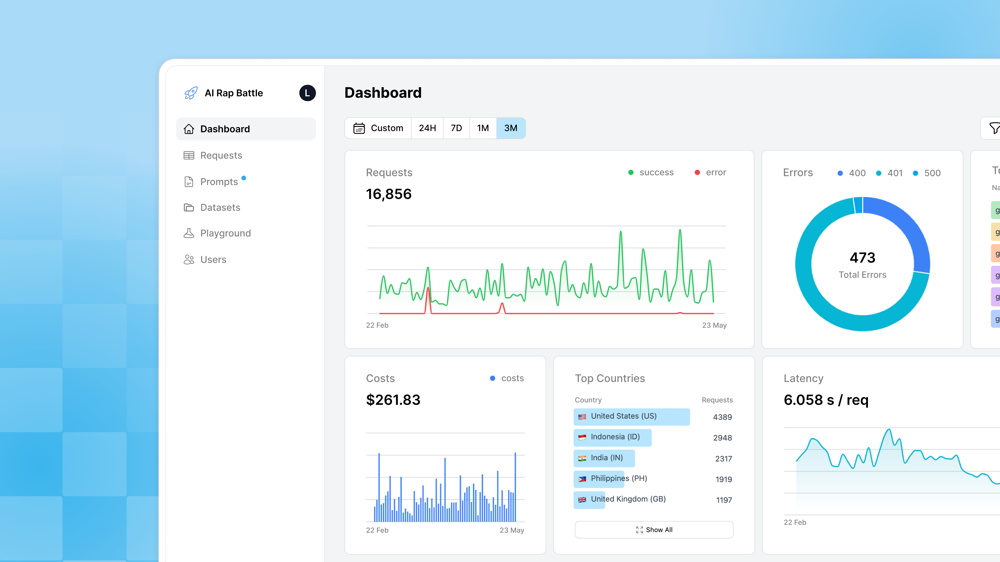
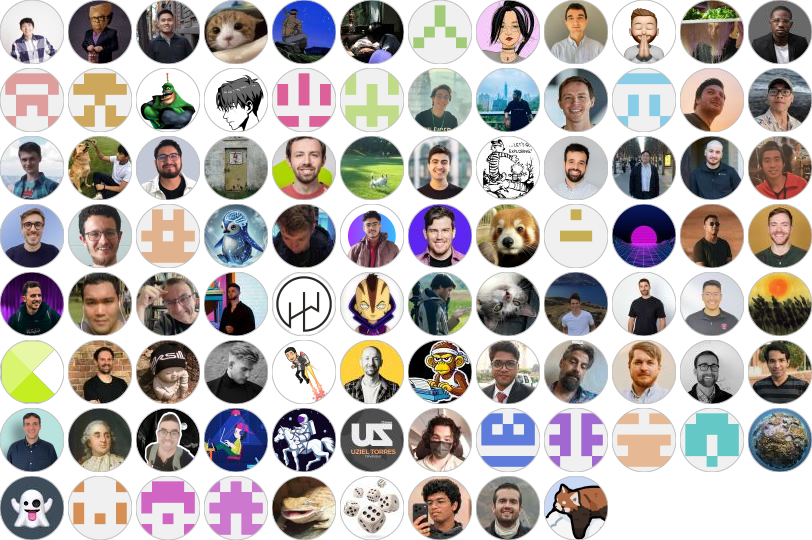

<div align="center">

| 🔍 可观测性 | 🕸️ 智能体追踪 | 🚂 LLM 路由 |
| :--------------: | :--------------: | :------------------: |
|  💰 成本与延迟追踪  |   📚 数据集与微调    |    🎛️ 自动回退   |

</div>

<p align="center" style="margin: 0; padding: 0;">
  
</p>
</br>

<p align="center">
  <a href='https://github.com/helicone/helicone/graphs/contributors'></a>
  <a href='https://github.com/helicone/helicone/stargazers'></a>
  <a href='https://github.com/helicone/helicone/pulse'></a>
  <a href='https://github.com/helicone/helicone/issues?q=is%3Aissue+is%3Aclosed'></a>
  <a href='https://www.ycombinator.com/companies/helicone'></a>
</p>
<p align="center">
  <a href="https://docs.helicone.ai/">文档</a> • <a href="https://www.helicone.ai/changelog">更新日志</a> • <a href="https://github.com/helicone/helicone/issues">缺陷报告</a> • <a href="https://helicone.ai/demo">查看 Helicone 实际演示！（免费）</a>
</p>

## Helicone 是面向 AI 工程师的 AI Gateway 和 LLM 可观测性平台

- 🌐 **AI Gateway**：通过 OpenAI API 使用 1 个 API 密钥访问 100+ AI 模型，支持智能路由和自动回退。[2 分钟快速上手。](https://docs.helicone.ai/gateway/overview)
- 🔌 **快速集成**：一行代码即可记录来自 [OpenAI](https://www.helicone.ai/models?providers=openai)、[Anthropic](https://www.helicone.ai/models?providers=anthropic)、[LangChain](https://docs.helicone.ai/gateway/integrations/langchain)、[Gemini](https://www.helicone.ai/models?providers=gemini%2Cgoogle-ai-studio)、[Vercel AI SDK](https://docs.helicone.ai/gateway/integrations/vercel-ai-sdk) 及 [更多](https://docs.helicone.ai/gateway/overview) 提供商的所有请求。
- 📊 **观测**：检查和调试代理、聊天机器人、文档处理管道等的追踪与[会话](https://docs.helicone.ai/features/sessions)
- 📈 **分析**：跟踪[成本](https://docs.helicone.ai/faq/how-we-calculate-cost#developer)、延迟、质量等指标。一行代码即可导出到 [PostHog](https://docs.helicone.ai/getting-started/integration-method/posthog) 以创建自定义仪表盘
- 🎮 **Playground**：在 UI 中快速测试和迭代提示词、会话和追踪。
- 🧠 **提示词管理**：使用生产数据[对提示词进行版本管理](https://docs.helicone.ai/features/prompts)。通过 AI Gateway 部署提示词，无需修改代码。你的提示词始终由你掌控，随时可访问。
- 🎛️ **微调**：通过我们的微调合作伙伴 [OpenPipe](https://openpipe.ai/) 或 [Autonomi](https://www.autonomi.ai/) 进行微调（更多合作伙伴即将推出）
- 🛡️ **企业就绪**：符合 SOC 2 和 GDPR 标准

> 🎁 慷慨的每月[免费额度](https://www.helicone.ai/pricing)（10k 请求/月） - 无需信用卡！
>


## 快速开始 ⚡️

1. 在[此处](https://helicone.ai/signup)注册获取 API 密钥，并在 [helicone.ai/credits](https://us.helicone.ai/credits) 充值

2. 更新代码中的 `baseURL` 并添加你的 API 密钥。

   ```typescript
   import OpenAI from "openai";

   const client = new OpenAI({
     baseURL: "https://ai-gateway.helicone.ai",
     apiKey: process.env.HELICONE_API_KEY,
   });

   const response = await client.chat.completions.create({
     model: "gpt-4o-mini",  // claude-sonnet-4, gemini-2.0-flash or any model from https://www.helicone.ai/models
     messages: [{ role: "user", content: "Hello!" }]
   });
   ```

3. 🎉 搞定！在 [Helicone](https://us.helicone.ai/dashboard) 查看你的日志，通过一个 API 访问 100+ 模型。

### 自托管开源 LLM 可观测性

#### Docker

Helicone 的自托管和更新非常简单。要在本地快速开始，只需使用我们的 [docker-compose](https://docs.helicone.ai/getting-started/self-deploy-docker) 文件。

```bash
# Clone the repository
git clone https://github.com/Helicone/helicone.git
cd docker
cp .env.example .env

# Start the services
./helicone-compose.sh helicone up
```

#### Helm

对于企业级工作负载，我们还提供生产就绪的 Helm chart。如需访问，请联系 enterprise@helicone.ai。

#### 手动部署（不推荐）

不推荐手动部署。请使用 Docker 或 Helm。如果必须手动部署，请按照[此处](https://docs.helicone.ai/getting-started/self-deploy)的说明操作。

#### 架构

Helicone 由五个服务组成：

- **Web**：前端平台（NextJS）
- **Worker**：代理日志记录（Cloudflare Workers）
- **Jawn**：用于提供和收集日志的专用服务器（Express + Tsoa）
- **Supabase**：应用数据库和认证
- **ClickHouse**：分析数据库
- **Minio**：日志对象存储。

## 集成 🔌

### 推理提供商

| 集成                                                                            | 支持                                                                                                                                     | 说明                                           |
| -------------------------------------------------------------------------------------- | -------------------------------------------------------------------------------------------------------------------------------------------- | ----------------------------------------------------- |
| AI Gateway                                | [JS/TS, Python, cURL](https://docs.helicone.ai/gateway/overview)                                                                                                                          | 统一 API，支持 100+ 提供商，具备智能路由、自动回退和统一可观测性
| 异步日志记录 (OpenLLMetry)                                                            | [JS/TS](https://docs.helicone.ai/getting-started/integration-method/openllmetry), [Python](https://www.npmjs.com/package/@helicone/helicone) | 多个 LLM 平台的异步日志记录       |
| OpenAI                                                                                 | [JS/TS, Python](https://www.helicone.ai/models?providers=openai)              | 推理提供商                                                     |
| Azure OpenAI                                                                           | [JS/TS, Python](https://www.helicone.ai/models?providers=azure)                | 推理提供商                                                     |
| Anthropic                                                                              | [JS/TS, Python](https://www.helicone.ai/models?search=anthropic)        | 推理提供商                                                     |
| Ollama                                                                                 | [JS/TS](https://docs.helicone.ai/integrations/ollama/javascript)                                                                             | 本地运行和使用大语言模型             |
| AWS Bedrock                                                                            | [JS/TS](https://www.helicone.ai/models?providers=azure%2Cbedrock)                                                                            | 推理提供商                                                     |
| Gemini API                                                                             | [JS/TS](https://www.helicone.ai/models?providers=google-ai-studio)                                                                         | 推理提供商                                                     |
| Gemini Vertex AI                                                                       | [JS/TS](https://www.helicone.ai/models?providers=vertex)                                                                      | Google Cloud Vertex AI 上的 Gemini 模型             |
| Vercel AI                                                                              | [JS/TS](https://docs.helicone.ai/gateway/integrations/vercel-ai-sdk)                                                                           | 用于构建 AI 应用的 AI SDK           |
| Anyscale | [JS/TS, Python](https://www.helicone.ai/models?providers=anyscale)                                                                                                                                | 推理提供商                                                     |
| TogetherAI | [JS/TS, Python](https://www.helicone.ai/models?providers=together)     | 推理提供商                                                                                                                                | -                                                     |
| Hyperbolic | [JS/TS, Python](https://www.helicone.ai/models?providers=hyperbolic)   | 推理提供商                                                                                                                                | 高性能 AI 推理平台                |
| Groq                                                                                   | [JS/TS, Python](https://www.helicone.ai/models?providers=groq)                  | 高性能模型                               |
| DeepInfra     | [JS/TS, Python](https://www.helicone.ai/models?providers=deepinfra)                                                                                                                                | 各种模型的无服务器 AI 推理            |       |
| Fireworks AI  | [JS/TS, Python](https://www.helicone.ai/models?providers=fireworks)                                                                                                                                | 开源 LLM 的快速推理 API               |

### 框架

| 框架                                                             | 支持                                                            | 说明                                                                             |
| --------------------------------------------------------------------- | ------------------------------------------------------------------- | --------------------------------------------------------------------------------------- |
| LangChain   | [JS/TS, Python](https://www.helicone.ai/models?providers=langchain)                                                       | 使用 AI Gateway 与 LangChain 进行统一提供商访问                               |
| LlamaIndex | [Python](https://www.helicone.ai/models?providers=llamaindex)                                                              | 构建 LLM 驱动数据应用的框架                                    |
| LangGraph   | [Python](https://www.helicone.ai/models?providers=langgraph)                                                              | 使用 LLM 构建有状态、多参与者应用                                       |
| Vercel AI SDK | [JS/TS](https://www.helicone.ai/models?providers=vercel-ai-sdk)                                                               | 用于构建 AI 应用的 AI SDK                                              |
| Semantic Kernel | [C#, Python](https://www.helicone.ai/models?providers=semantic-kernel)                                                          | Microsoft 的 AI 编排框架                                                  |
| CrewAI         | [Python](https://docs.helicone.ai/integrations/openai/crewai)                                                                   | 编排角色扮演 AI 代理的框架                                      |                                                           |
| ModelFusion                            | [JS/TS](https://github.com/vercel/modelfusion/blob/main/docs/integration/observability/helicone.md) | 将 AI 模型集成到 JavaScript 和 TypeScript 应用的抽象层 |
| PostHog | [JS/TS, Python, cURL](https://docs.helicone.ai/getting-started/integration-method/posthog) | 产品分析平台。构建自定义仪表盘。    |
| RAGAS                     | [Python](https://docs.helicone.ai/other-integrations/ragas) | 检索增强生成的评估框架 |
| Open WebUI           | [JS/TS](https://docs.helicone.ai/other-integrations/open-webui) | 与本地 LLM 交互的 Web 界面           |
| MetaGPT                | [YAML](https://docs.helicone.ai/other-integrations/meta-gpt) | 多代理框架                                   |
| Open Devin           | [Docker](https://docs.helicone.ai/other-integrations/open-devin) | AI 软件工程师                                    |
| Mem0 EmbedChain      | [Python](https://docs.helicone.ai/other-integrations/embedchain) | 构建 RAG 应用的框架                 |
| Dify                      | [No code required](https://docs.helicone.ai/other-integrations/dify) | AI 原生应用开发的 LLMOps 平台   |

> 此列表可能不是最新的。没有找到你的提供商或框架？在我们的[文档](https://docs.helicone.ai/gateway/integrations/overview)中查看最新集成。如果文档中也没有，请联系 help@helicone.ai 请求新的集成。

## 贡献

我们 ❤️ 贡献者！我们热烈欢迎关于文档、集成、成本和功能请求的贡献。

如果你对 Helicone 的改进有想法，请创建一个 [GitHub issue](https://github.com/Helicone/helicone/issues)。

## 许可证

Helicone 采用 [Apache v2.0 许可证](LICENSE) 授权。

## 其他资源

- **LLM 成本 API**：我们拥有最大的开源 API 定价数据库，涵盖 300+ 模型和 OpenAI、Anthropic 等提供商。[开始查询。](https://www.helicone.ai/llm-cost)

- **数据管理**：通过我们的 [API](https://docs.helicone.ai/rest/user/post-v1userquery) 管理和导出你的 Helicone 数据，或通过我们的 [MCP 服务器](https://docs.helicone.ai/integrations/tools/mcp) 访问。

  - 指南：[ETL](https://docs.helicone.ai/use-cases/etl)、[请求导出](https://docs.helicone.ai/use-cases/getting-user-requests)

- **数据所有权**：了解[数据所有权与自主权](https://docs.helicone.ai/use-cases/data-autonomy)

了解更多请访问我们的[文档](https://docs.helicone.ai/)。

# 贡献者

<a href="https://github.com/Helicone/helicone/graphs/contributors">
  
</a>
