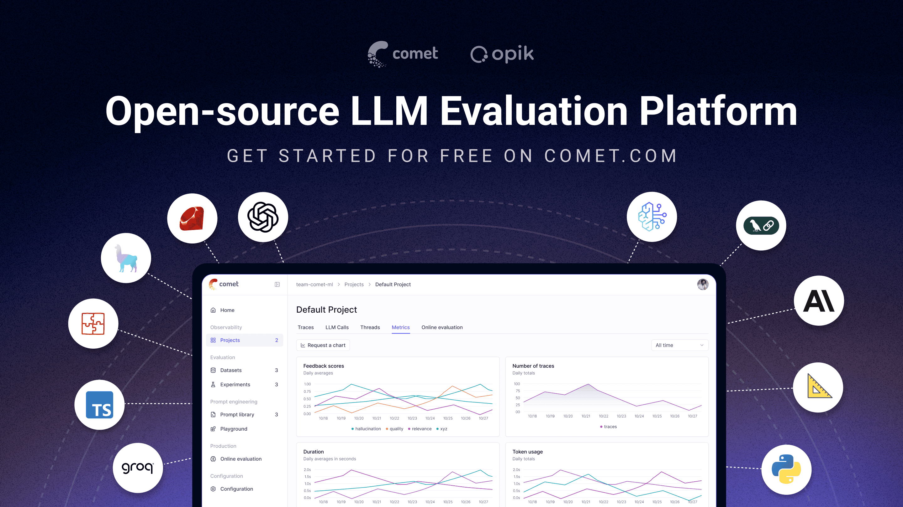
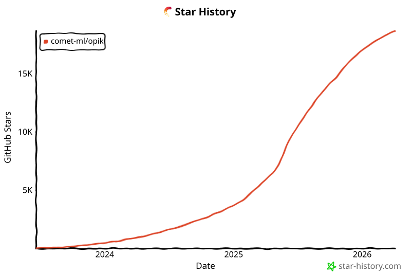

<div align="center"><b><a href="README.md">English</a> | <a href="readme_CN.md">简体中文</a> | <a href="readme_JP.md">日本語</a> | <a href="readme_PT_BR.md">Português (Brasil)</a> | <a href="readme_KO.md">한국어</a><br><a href="readme_ES.md">Español</a> | <a href="readme_FR.md">Français</a> | <a href="readme_DE.md">Deutsch</a> | <a href="readme_RU.md">Русский</a> | <a href="readme_AR.md">العربية</a> | <a href="readme_HI.md">हिन्दी</a> | <a href="readme_TR.md">Türkçe</a></b></div>

<h1 align="center" style="border-bottom: none">
    <div>
        <a href="https://www.comet.com/site/products/opik/?from=llm&utm_source=opik&utm_medium=github&utm_content=header_img&utm_campaign=opik"><picture>
            <source media="(prefers-color-scheme: dark)" srcset="assets/004-logo-dark-mode-ce4c48479b.svg">
            <source media="(prefers-color-scheme: light)" srcset="assets/003-opik-logo-19735a24eb.svg">
            
        </picture></a>
        <br>
        Opik
    </div>
</h1>
<h2 align="center" style="border-bottom: none">开源 AI 可观测性、评估与优化平台</h2>
<p align="center">
Opik 帮助你构建、测试并优化生成式 AI 应用，使其从原型到生产环境都能更稳定地运行。从 RAG 聊天机器人、代码助手到复杂的智能体系统，Opik 提供全面的追踪、评估，以及自动化提示词和工具优化能力，让 AI 开发不再依赖猜测。
</p>

<div align="center">

[](https://pypi.org/project/opik/)
[](https://github.com/comet-ml/opik/blob/main/LICENSE)
[](https://github.com/comet-ml/opik/actions/workflows/build_apps.yml)
<!-- [](https://colab.research.google.com/github/comet-ml/opik/blob/main/apps/opik-documentation/documentation/docs/cookbook/opik_quickstart.ipynb) -->

</div>

<p align="center">
    <a href="https://www.comet.com/site/products/opik/?from=llm&utm_source=opik&utm_medium=github&utm_content=website_button&utm_campaign=opik"><b>官网</b></a> •
    <a href="https://chat.comet.com"><b>Slack 社区</b></a> •
    <a href="https://x.com/Cometml"><b>Twitter</b></a> •
    <a href="https://www.comet.com/docs/opik/changelog"><b>更新日志</b></a> •
    <a href="https://www.comet.com/docs/opik/?from=llm&utm_source=opik&utm_medium=github&utm_content=docs_button&utm_campaign=opik"><b>文档</b></a>
</p>

<div align="center" style="margin-top: 1em; margin-bottom: 1em;">
<a href="#-what-is-opik">🚀 什么是 Opik？</a> • <a href="#%EF%B8%8F-opik-server-installation">🛠️ Opik 服务端安装</a> • <a href="#-opik-client-sdk">💻 Opik 客户端 SDK</a> • <a href="#-logging-traces-with-integrations">📝 记录追踪</a><br>
<a href="#-llm-as-a-judge-metrics">🧑‍⚖️ LLM-as-a-Judge 指标</a> • <a href="#-evaluating-your-llm-application">🔍 评估你的应用</a> • <a href="#-star-us-on-github">⭐ 在 GitHub 上支持我们</a> • <a href="#-contributing">🤝 参与贡献</a>
</div>

<br>

[](https://www.comet.com/signup?from=llm&utm_source=opik&utm_medium=github&utm_content=readme_banner&utm_campaign=opik)

<a id="-what-is-opik"></a>
## 🚀 什么是 Opik？

Opik（由 [Comet](https://www.comet.com?from=llm&utm_source=opik&utm_medium=github&utm_content=what_is_opik_link&utm_campaign=opik) 构建）是一个开源平台，旨在简化 LLM 应用的整个生命周期。它帮助开发者对模型和智能体系统进行评估、测试、监控与优化。其核心能力包括：

- **全面的可观测性**：深入追踪 LLM 调用、对话日志和智能体活动。
- **高级评估能力**：稳健的提示词评估、LLM-as-a-Judge 和实验管理。
- **生产就绪**：适用于生产环境的可扩展监控仪表盘和在线评估规则。
- **Opik Agent Optimizer**：专用 SDK 和一组优化器，用于增强提示词和智能体。
- **Opik Guardrails**：帮助你实现安全、负责任 AI 实践的功能。

<br>

核心能力还包括：

- **开发与追踪：**
  - 在开发阶段和生产环境中，结合详细上下文追踪所有 LLM 调用和 trace（[Quickstart](https://www.comet.com/docs/opik/quickstart/?from=llm&utm_source=opik&utm_medium=github&utm_content=quickstart_link&utm_campaign=opik)）。
  - 丰富的第三方集成，轻松实现可观测性：可无缝集成不断扩展的框架列表，并原生支持众多大型且流行的框架（包括近期新增的 **Google ADK**、**Autogen** 和 **Flowise AI**）。（[Integrations](https://www.comet.com/docs/opik/integrations/overview/?from=llm&utm_source=opik&utm_medium=github&utm_content=integrations_link&utm_campaign=opik)）
  - 通过 [Python SDK](https://www.comet.com/docs/opik/tracing/annotate_traces/#annotating-traces-and-spans-using-the-sdk?from=llm&utm_source=opik&utm_medium=github&utm_content=sdk_link&utm_campaign=opik) 或 [UI](https://www.comet.com/docs/opik/tracing/annotate_traces/#annotating-traces-through-the-ui?from=llm&utm_source=opik&utm_medium=github&utm_content=ui_link&utm_campaign=opik) 为 trace 和 span 添加反馈评分注解。
  - 在 [Prompt Playground](https://www.comet.com/docs/opik/prompt_engineering/playground) 中试验提示词和模型。

- **评估与测试：**
  - 通过 [Datasets](https://www.comet.com/docs/opik/evaluation/manage_datasets/?from=llm&utm_source=opik&utm_medium=github&utm_content=datasets_link&utm_campaign=opik) 和 [Experiments](https://www.comet.com/docs/opik/evaluation/evaluate_your_llm/?from=llm&utm_source=opik&utm_medium=github&utm_content=eval_link&utm_campaign=opik) 自动化 LLM 应用评估。
  - 利用强大的 LLM-as-a-Judge 指标处理复杂任务，例如 [幻觉检测](https://www.comet.com/docs/opik/evaluation/metrics/hallucination/?from=llm&utm_source=opik&utm_medium=github&utm_content=hallucination_link&utm_campaign=opik)、[内容审核](https://www.comet.com/docs/opik/evaluation/metrics/moderation/?from=llm&utm_source=opik&utm_medium=github&utm_content=moderation_link&utm_campaign=opik) 以及 RAG 评估（[Answer Relevance](https://www.comet.com/docs/opik/evaluation/metrics/answer_relevance/?from=llm&utm_source=opik&utm_medium=github&utm_content=alex_link&utm_campaign=opik)、[Context Precision](https://www.comet.com/docs/opik/evaluation/metrics/context_precision/?from=llm&utm_source=opik&utm_medium=github&utm_content=context_link&utm_campaign=opik)）。
  - 通过我们的 [PyTest integration](https://www.comet.com/docs/opik/testing/pytest_integration/?from=llm&utm_source=opik&utm_medium=github&utm_content=pytest_link&utm_campaign=opik) 将评估集成到你的 CI/CD 流水线中。

- **生产监控与优化：**
  - 记录海量生产 trace：Opik 面向大规模场景设计（40M+ traces/day）。
  - 在 [Opik Dashboard](https://www.comet.com/docs/opik/production/production_monitoring/?from=llm&utm_source=opik&utm_medium=github&utm_content=dashboard_link&utm_campaign=opik) 中随时间监控反馈评分、trace 数量和 token 使用量。
  - 使用结合 LLM-as-a-Judge 指标的 [Online Evaluation Rules](https://www.comet.com/docs/opik/production/rules/?from=llm&utm_source=opik&utm_medium=github&utm_content=dashboard_link&utm_campaign=opik) 识别生产问题。
  - 利用 **Opik Agent Optimizer** 和 **Opik Guardrails**，在生产环境中持续改进并保护你的 LLM 应用。

> [!TIP]
> 如果你正在寻找 Opik 当前尚未具备的功能，请提交新的 [Feature request](https://github.com/comet-ml/opik/issues/new/choose) 🚀

<br>

<a id="%EF%B8%8F-opik-server-installation"></a>
## 🛠️ Opik 服务端安装

几分钟内即可启动你的 Opik 服务端。请选择最适合你需求的方案：

### 方案 1：Comet.com Cloud（最简单且推荐）

无需任何配置即可立即使用 Opik。非常适合快速上手和免维护场景。

👉 [创建你的免费 Comet 账户](https://www.comet.com/signup?from=llm&utm_source=opik&utm_medium=github&utm_content=install_create_link&utm_campaign=opik)

### 方案 2：自托管 Opik 以获得完全控制

在你自己的环境中部署 Opik。你可以根据需求选择适合本地部署的 Docker，或适合扩展的 Kubernetes。

#### 使用 Docker Compose 自托管（适用于本地开发与测试）

这是在本地运行 Opik 实例最简单的方式。请注意新的 `./opik.sh` 安装脚本：

在 Linux 或 Mac 环境中：

```bash
# Clone the Opik repository
git clone https://github.com/comet-ml/opik.git

# Navigate to the repository
cd opik

# Start the Opik platform
./opik.sh
```

在 Windows 环境中：

```powershell
# Clone the Opik repository
git clone https://github.com/comet-ml/opik.git

# Navigate to the repository
cd opik

# Start the Opik platform
powershell -ExecutionPolicy ByPass -c ".\\opik.ps1"
```

**开发环境服务配置**

Opik 安装脚本现已支持适用于不同开发场景的服务配置：

```bash
# Start full Opik suite (default behavior)
./opik.sh

# Start only infrastructure services (databases, caches etc.)
./opik.sh --infra

# Start infrastructure + backend services
./opik.sh --backend

# Enable guardrails with any profile
./opik.sh --guardrails # Guardrails with full Opik suite
./opik.sh --backend --guardrails # Guardrails with infrastructure + backend
```

你可以使用 `--help` 或 `--info` 选项来排查问题。Dockerfile 现在确保容器以非 root 用户运行，以增强安全性。全部启动完成后，你就可以在浏览器中访问 [localhost:5173](http://localhost:5173)！详细说明请参见 [Local Deployment Guide](https://www.comet.com/docs/opik/self-host/local_deployment?from=llm&utm_source=opik&utm_medium=github&utm_content=self_host_link&utm_campaign=opik)。

#### 使用 Kubernetes 与 Helm 自托管（适用于可扩展部署）

对于生产环境或更大规模的自托管部署，Opik 可以通过我们的 Helm chart 安装到 Kubernetes 集群中。点击下方徽章查看完整的 [Kubernetes Installation Guide using Helm](https://www.comet.com/docs/opik/self-host/kubernetes/#kubernetes-installation?from=llm&utm_source=opik&utm_medium=github&utm_content=kubernetes_link&utm_campaign=opik)。

[](https://www.comet.com/docs/opik/self-host/kubernetes/#kubernetes-installation?from=llm&utm_source=opik&utm_medium=github&utm_content=kubernetes_link&utm_campaign=opik)

> [!IMPORTANT]
> **1.7.0 版本变更**：请查看 [changelog](https://github.com/comet-ml/opik/blob/main/CHANGELOG.md) 了解重要更新和破坏性变更。

<a id="-opik-client-sdk"></a>
## 💻 Opik 客户端 SDK

Opik 提供一套客户端库和 REST API，用于与 Opik 服务端交互。其中包括 Python、TypeScript 和 Ruby（通过 OpenTelemetry）的 SDK，可无缝集成到你的工作流中。关于详细的 API 与 SDK 参考，请参阅 [Opik Client Reference Documentation](https://www.comet.com/docs/opik/reference/overview?from=llm&utm_source=opik&utm_medium=github&utm_content=reference_link&utm_campaign=opik)。

### Python SDK 快速开始

开始使用 Python SDK：

安装该包：

```bash
# install using pip
pip install opik

# or install with uv
uv pip install opik
```

运行 `opik configure` 命令来配置 Python SDK。该命令会提示你输入 Opik 服务端地址（适用于自托管实例），或 API key 与 workspace（适用于 Comet.com）：

```bash
opik configure
```

> [!TIP]
> 你也可以在 Python 代码中调用 `opik.configure(use_local=True)`，将 SDK 配置为运行在本地自托管安装上，或者直接为 Comet.com 提供 API key 和 workspace 详情。更多配置选项请参阅 [Python SDK documentation](https://www.comet.com/docs/opik/python-sdk-reference/?from=llm&utm_source=opik&utm_medium=github&utm_content=python_sdk_docs_link&utm_campaign=opik)。

现在你已经可以通过 [Python SDK](https://www.comet.com/docs/opik/python-sdk-reference/?from=llm&utm_source=opik&utm_medium=github&utm_content=sdk_link2&utm_campaign=opik) 开始记录 trace。

<a id="-logging-traces-with-integrations"></a>
### 📝 通过集成记录追踪

记录 trace 最简单的方式是使用我们的直接集成之一。Opik 支持广泛的框架，包括近期新增的 **Google ADK**、**Autogen**、**AG2** 和 **Flowise AI**：

| 集成                  | 说明                                                    | 文档                                                                                                                                                                           |
| --------------------- | ------------------------------------------------------- | ------------------------------------------------------------------------------------------------------------------------------------------------------------------------------ |
| ADK                   | 为 Google Agent Development Kit (ADK) 记录 trace       | [Documentation](https://www.comet.com/docs/opik/integrations/adk?utm_source=opik&utm_medium=github&utm_content=google_adk_link&utm_campaign=opik)                              |
| AG2                   | 为 AG2 LLM 调用记录 trace                              | [Documentation](https://www.comet.com/docs/opik/integrations/ag2?utm_source=opik&utm_medium=github&utm_content=ag2_link&utm_campaign=opik)                                     |
| AIsuite               | 为 aisuite LLM 调用记录 trace                          | [Documentation](https://www.comet.com/docs/opik/integrations/aisuite?utm_source=opik&utm_medium=github&utm_content=aisuite_link&utm_campaign=opik)                             |
| Agno                  | 为 Agno 智能体编排框架调用记录 trace                   | [Documentation](https://www.comet.com/docs/opik/integrations/agno?utm_source=opik&utm_medium=github&utm_content=agno_link&utm_campaign=opik)                                   |
| Anthropic             | 为 Anthropic LLM 调用记录 trace                        | [Documentation](https://www.comet.com/docs/opik/integrations/anthropic?utm_source=opik&utm_medium=github&utm_content=anthropic_link&utm_campaign=opik)                         |
| Autogen               | 为 Autogen 智能体工作流记录 trace                      | [Documentation](https://www.comet.com/docs/opik/integrations/autogen?utm_source=opik&utm_medium=github&utm_content=autogen_link&utm_campaign=opik)                             |
| Bedrock               | 为 Amazon Bedrock LLM 调用记录 trace                   | [Documentation](https://www.comet.com/docs/opik/integrations/bedrock?utm_source=opik&utm_medium=github&utm_content=bedrock_link&utm_campaign=opik)                             |
| BeeAI (Python)        | 为 BeeAI Python 智能体框架调用记录 trace               | [Documentation](https://www.comet.com/docs/opik/integrations/beeai?utm_source=opik&utm_medium=github&utm_content=beeai_link&utm_campaign=opik)                                 |
| BeeAI (TypeScript)    | 为 BeeAI TypeScript 智能体框架调用记录 trace           | [Documentation](https://www.comet.com/docs/opik/integrations/beeai-typescript?utm_source=opik&utm_medium=github&utm_content=beeai_typescript_link&utm_campaign=opik)           |
| BytePlus              | 为 BytePlus LLM 调用记录 trace                         | [Documentation](https://www.comet.com/docs/opik/integrations/byteplus?utm_source=opik&utm_medium=github&utm_content=byteplus_link&utm_campaign=opik)                           |
| Cloudflare Workers AI | 为 Cloudflare Workers AI 调用记录 trace                | [Documentation](https://www.comet.com/docs/opik/integrations/cloudflare-workers-ai?utm_source=opik&utm_medium=github&utm_content=cloudflare_workers_ai_link&utm_campaign=opik) |
| Cohere                | 为 Cohere LLM 调用记录 trace                           | [Documentation](https://www.comet.com/docs/opik/integrations/cohere?utm_source=opik&utm_medium=github&utm_content=cohere_link&utm_campaign=opik)                               |
| CrewAI                | 为 CrewAI 调用记录 trace                               | [Documentation](https://www.comet.com/docs/opik/integrations/crewai?utm_source=opik&utm_medium=github&utm_content=crewai_link&utm_campaign=opik)                               |
| Cursor                | 为 Cursor 对话记录 trace                               | [Documentation](https://www.comet.com/docs/opik/integrations/cursor?utm_source=opik&utm_medium=github&utm_content=cursor_link&utm_campaign=opik)                               |
| DeepSeek              | 为 DeepSeek LLM 调用记录 trace                         | [Documentation](https://www.comet.com/docs/opik/integrations/deepseek?utm_source=opik&utm_medium=github&utm_content=deepseek_link&utm_campaign=opik)                           |
| Dify                  | 为 Dify 智能体运行记录 trace                           | [Documentation](https://www.comet.com/docs/opik/integrations/dify?utm_source=opik&utm_medium=github&utm_content=dify_link&utm_campaign=opik)                                   |
| DSPY                  | 为 DSPy 运行记录 trace                                 | [Documentation](https://www.comet.com/docs/opik/integrations/dspy?utm_source=opik&utm_medium=github&utm_content=dspy_link&utm_campaign=opik)                                   |
| Fireworks AI          | 为 Fireworks AI LLM 调用记录 trace                     | [Documentation](https://www.comet.com/docs/opik/integrations/fireworks-ai?utm_source=opik&utm_medium=github&utm_content=fireworks_ai_link&utm_campaign=opik)                   |
| Flowise AI            | 为 Flowise AI 可视化 LLM 构建器记录 trace              | [Documentation](https://www.comet.com/docs/opik/integrations/flowise?utm_source=opik&utm_medium=github&utm_content=flowise_link&utm_campaign=opik)                             |
| Gemini (Python)       | 为 Google Gemini LLM 调用记录 trace                    | [Documentation](https://www.comet.com/docs/opik/integrations/gemini?utm_source=opik&utm_medium=github&utm_content=gemini_link&utm_campaign=opik)                               |
| Gemini (TypeScript)   | 为 Google Gemini TypeScript SDK 调用记录 trace         | [Documentation](https://www.comet.com/docs/opik/integrations/gemini-typescript?utm_source=opik&utm_medium=github&utm_content=gemini_typescript_link&utm_campaign=opik)         |
| Groq                  | 为 Groq LLM 调用记录 trace                             | [Documentation](https://www.comet.com/docs/opik/integrations/groq?utm_source=opik&utm_medium=github&utm_content=groq_link&utm_campaign=opik)                                   |
| Guardrails            | 为 Guardrails AI 校验记录 trace                        | [Documentation](https://www.comet.com/docs/opik/integrations/guardrails-ai?utm_source=opik&utm_medium=github&utm_content=guardrails_link&utm_campaign=opik)                    |
| Haystack              | 为 Haystack 调用记录 trace                             | [Documentation](https://www.comet.com/docs/opik/integrations/haystack?utm_source=opik&utm_medium=github&utm_content=haystack_link&utm_campaign=opik)                           |
| Harbor                | 为 Harbor 基准评测试验记录 trace                       | [Documentation](https://www.comet.com/docs/opik/integrations/harbor?utm_source=opik&utm_medium=github&utm_content=harbor_link&utm_campaign=opik)                               |
| Instructor            | 为使用 Instructor 发起的 LLM 调用记录 trace           | [Documentation](https://www.comet.com/docs/opik/integrations/instructor?utm_source=opik&utm_medium=github&utm_content=instructor_link&utm_campaign=opik)                       |
| LangChain (Python)    | 为 LangChain LLM 调用记录 trace                        | [Documentation](https://www.comet.com/docs/opik/integrations/langchain?utm_source=opik&utm_medium=github&utm_content=langchain_link&utm_campaign=opik)                         |
| LangChain (JS/TS)     | 为 LangChain JavaScript/TypeScript 调用记录 trace      | [Documentation](https://www.comet.com/docs/opik/integrations/langchainjs?utm_source=opik&utm_medium=github&utm_content=langchainjs_link&utm_campaign=opik)                     |
| LangGraph             | 为 LangGraph 执行记录 trace                            | [Documentation](https://www.comet.com/docs/opik/integrations/langgraph?utm_source=opik&utm_medium=github&utm_content=langgraph_link&utm_campaign=opik)                         |
| Langflow              | 为 Langflow 可视化 AI 构建器记录 trace                 | [Documentation](https://www.comet.com/docs/opik/integrations/langflow?utm_source=opik&utm_medium=github&utm_content=langflow_link&utm_campaign=opik)                           |
| LiteLLM               | 为 LiteLLM 模型调用记录 trace                          | [Documentation](https://www.comet.com/docs/opik/integrations/litellm?utm_source=opik&utm_medium=github&utm_content=litellm_link&utm_campaign=opik)                             |
| LiveKit Agents        | 为 LiveKit Agents AI 智能体框架调用记录 trace          | [Documentation](https://www.comet.com/docs/opik/integrations/livekit?utm_source=opik&utm_medium=github&utm_content=livekit_link&utm_campaign=opik)                             |
| LlamaIndex            | 为 LlamaIndex LLM 调用记录 trace                       | [Documentation](https://www.comet.com/docs/opik/integrations/llama_index?utm_source=opik&utm_medium=github&utm_content=llama_index_link&utm_campaign=opik)                     |
| Mastra                | 为 Mastra AI 工作流框架调用记录 trace                  | [Documentation](https://www.comet.com/docs/opik/integrations/mastra?utm_source=opik&utm_medium=github&utm_content=mastra_link&utm_campaign=opik)                               |
| Microsoft Agent Framework (Python) | 为 Microsoft Agent Framework 调用记录 trace | [Documentation](https://www.comet.com/docs/opik/integrations/microsoft-agent-framework?utm_source=opik&utm_medium=github&utm_content=agent_framework_link&utm_campaign=opik)              |
| Microsoft Agent Framework (.NET) | 为 Microsoft Agent Framework .NET 调用记录 trace | [Documentation](https://www.comet.com/docs/opik/integrations/microsoft-agent-framework-dotnet?utm_source=opik&utm_medium=github&utm_content=agent_framework_dotnet_link&utm_campaign=opik) |
| Mistral AI            | 为 Mistral AI LLM 调用记录 trace                       | [Documentation](https://www.comet.com/docs/opik/integrations/mistral?utm_source=opik&utm_medium=github&utm_content=mistral_link&utm_campaign=opik)                             |
| n8n                   | 为 n8n 工作流执行记录 trace                            | [Documentation](https://www.comet.com/docs/opik/integrations/n8n?utm_source=opik&utm_medium=github&utm_content=n8n_link&utm_campaign=opik)                                     |
| Novita AI             | 为 Novita AI LLM 调用记录 trace                        | [Documentation](https://www.comet.com/docs/opik/integrations/novita-ai?utm_source=opik&utm_medium=github&utm_content=novita_ai_link&utm_campaign=opik)                         |
| Ollama                | 为 Ollama LLM 调用记录 trace                           | [Documentation](https://www.comet.com/docs/opik/integrations/ollama?utm_source=opik&utm_medium=github&utm_content=ollama_link&utm_campaign=opik)                               |
| OpenAI (Python)       | 为 OpenAI LLM 调用记录 trace                           | [Documentation](https://www.comet.com/docs/opik/integrations/openai?utm_source=opik&utm_medium=github&utm_content=openai_link&utm_campaign=opik)                               |
| OpenAI (JS/TS)        | 为 OpenAI JavaScript/TypeScript 调用记录 trace         | [Documentation](https://www.comet.com/docs/opik/integrations/openai-typescript?utm_source=opik&utm_medium=github&utm_content=openai_typescript_link&utm_campaign=opik)         |
| OpenAI Agents         | 为 OpenAI Agents SDK 调用记录 trace                    | [Documentation](https://www.comet.com/docs/opik/integrations/openai_agents?utm_source=opik&utm_medium=github&utm_content=openai_agents_link&utm_campaign=opik)                 |
| OpenClaw              | 为 OpenClaw 智能体运行记录 trace                       | [Documentation](https://www.comet.com/docs/opik/integrations/openclaw?utm_source=opik&utm_medium=github&utm_content=openclaw_link&utm_campaign=opik) |
| OpenRouter            | 为 OpenRouter LLM 调用记录 trace                       | [Documentation](https://www.comet.com/docs/opik/integrations/openrouter?utm_source=opik&utm_medium=github&utm_content=openrouter_link&utm_campaign=opik)                       |
| OpenTelemetry         | 为 OpenTelemetry 支持的调用记录 trace                  | [Documentation](https://www.comet.com/docs/opik/tracing/opentelemetry/overview?utm_source=opik&utm_medium=github&utm_content=opentelemetry_link&utm_campaign=opik)             |
| OpenWebUI             | 为 OpenWebUI 对话记录 trace                            | [Documentation](https://www.comet.com/docs/opik/integrations/openwebui?utm_source=opik&utm_medium=github&utm_content=openwebui_link&utm_campaign=opik)                         |
| Pipecat               | 为 Pipecat 实时语音智能体调用记录 trace                | [Documentation](https://www.comet.com/docs/opik/integrations/pipecat?utm_source=opik&utm_medium=github&utm_content=pipecat_link&utm_campaign=opik)                             |
| Predibase             | 为 Predibase LLM 调用记录 trace                        | [Documentation](https://www.comet.com/docs/opik/integrations/predibase?utm_source=opik&utm_medium=github&utm_content=predibase_link&utm_campaign=opik)                         |
| Pydantic AI           | 为 PydanticAI 智能体调用记录 trace                     | [Documentation](https://www.comet.com/docs/opik/integrations/pydantic-ai?utm_source=opik&utm_medium=github&utm_content=pydantic_ai_link&utm_campaign=opik)                     |
| Ragas                 | 为 Ragas 评估记录 trace                                | [Documentation](https://www.comet.com/docs/opik/integrations/ragas?utm_source=opik&utm_medium=github&utm_content=ragas_link&utm_campaign=opik)                                 |
| Semantic Kernel       | 为 Microsoft Semantic Kernel 调用记录 trace            | [Documentation](https://www.comet.com/docs/opik/integrations/semantic-kernel?utm_source=opik&utm_medium=github&utm_content=semantic_kernel_link&utm_campaign=opik)             |
| Smolagents            | 为 Smolagents 智能体记录 trace                         | [Documentation](https://www.comet.com/docs/opik/integrations/smolagents?utm_source=opik&utm_medium=github&utm_content=smolagents_link&utm_campaign=opik)                       |
| Spring AI             | 为 Spring AI 框架调用记录 trace                        | [Documentation](https://www.comet.com/docs/opik/integrations/spring-ai?utm_source=opik&utm_medium=github&utm_content=spring_ai_link&utm_campaign=opik)                         |
| Strands Agents        | 为 Strands agents 调用记录 trace                       | [Documentation](https://www.comet.com/docs/opik/integrations/strands-agents?utm_source=opik&utm_medium=github&utm_content=strands_agents_link&utm_campaign=opik)               |
| Together AI           | 为 Together AI LLM 调用记录 trace                      | [Documentation](https://www.comet.com/docs/opik/integrations/together-ai?utm_source=opik&utm_medium=github&utm_content=together_ai_link&utm_campaign=opik)                     |
| Vercel AI SDK         | 为 Vercel AI SDK 调用记录 trace                        | [Documentation](https://www.comet.com/docs/opik/integrations/vercel-ai-sdk?utm_source=opik&utm_medium=github&utm_content=vercel_ai_sdk_link&utm_campaign=opik)                 |
| VoltAgent             | 为 VoltAgent 智能体框架调用记录 trace                  | [Documentation](https://www.comet.com/docs/opik/integrations/voltagent?utm_source=opik&utm_medium=github&utm_content=voltagent_link&utm_campaign=opik)                         |
| WatsonX               | 为 IBM watsonx LLM 调用记录 trace                      | [Documentation](https://www.comet.com/docs/opik/integrations/watsonx?utm_source=opik&utm_medium=github&utm_content=watsonx_link&utm_campaign=opik)                             |
| xAI Grok              | 为 xAI Grok LLM 调用记录 trace                         | [Documentation](https://www.comet.com/docs/opik/integrations/xai-grok?utm_source=opik&utm_medium=github&utm_content=xai_grok_link&utm_campaign=opik)                           |

> [!TIP]
> 如果你使用的框架未列在上方，欢迎 [提交 issue](https://github.com/comet-ml/opik/issues) 或提交 PR 来补充该集成。

如果你没有使用上述任何框架，也可以使用 `track` 函数装饰器来 [记录 trace](https://www.comet.com/docs/opik/tracing/log_traces/?from=llm&utm_source=opik&utm_medium=github&utm_content=traces_link&utm_campaign=opik)：

```python
import opik

opik.configure(use_local=True) # Run locally

@opik.track
def my_llm_function(user_question: str) -> str:
    # Your LLM code here

    return "Hello"
```

> [!TIP]
> `track` 装饰器可以与我们的任意集成配合使用，也可以用于追踪嵌套函数调用。

<a id="-llm-as-a-judge-metrics"></a>
### 🧑‍⚖️ LLM-as-a-Judge 指标

Python 版 Opik SDK 内置了多个 LLM-as-a-Judge 指标，帮助你评估 LLM 应用。更多信息请参阅 [指标文档](https://www.comet.com/docs/opik/evaluation/metrics/overview/?from=llm&utm_source=opik&utm_medium=github&utm_content=metrics_2_link&utm_campaign=opik)。

要使用它们，只需导入相应指标并调用 `score` 函数：

```python
from opik.evaluation.metrics import Hallucination

metric = Hallucination()
score = metric.score(
    input="What is the capital of France?",
    output="Paris",
    context=["France is a country in Europe."]
)
print(score)
```

Opik 还内置了多种预构建的启发式指标，并支持你创建自己的指标。更多信息请参阅 [指标文档](https://www.comet.com/docs/opik/evaluation/metrics/overview?from=llm&utm_source=opik&utm_medium=github&utm_content=metrics_3_link&utm_campaign=opik)。

<a id="-evaluating-your-llm-application"></a>
### 🔍 评估你的 LLM 应用

Opik 支持你在开发阶段通过 [Datasets](https://www.comet.com/docs/opik/evaluation/manage_datasets/?from=llm&utm_source=opik&utm_medium=github&utm_content=datasets_2_link&utm_campaign=opik) 和 [Experiments](https://www.comet.com/docs/opik/evaluation/evaluate_your_llm/?from=llm&utm_source=opik&utm_medium=github&utm_content=experiments_link&utm_campaign=opik) 评估 LLM 应用。Opik Dashboard 为实验提供了增强图表，并改进了对大型 trace 的处理。你还可以借助我们的 [PyTest integration](https://www.comet.com/docs/opik/testing/pytest_integration/?from=llm&utm_source=opik&utm_medium=github&utm_content=pytest_2_link&utm_campaign=opik) 将评估作为 CI/CD 流水线的一部分运行。

<a id="-star-us-on-github"></a>
## ⭐ 在 GitHub 上支持我们

如果你觉得 Opik 有用，请考虑给我们点一个 star。你的支持能帮助我们壮大社区，并持续改进产品。

[](https://github.com/comet-ml/opik)

<a id="-contributing"></a>
## 🤝 参与贡献

参与 Opik 的方式有很多：

- 提交 [bug reports](https://github.com/comet-ml/opik/issues) 和 [feature requests](https://github.com/comet-ml/opik/issues)
- 审阅文档并提交 [Pull Requests](https://github.com/comet-ml/opik/pulls) 进行改进
- 通过演讲或写作介绍 Opik，并 [告诉我们](https://chat.comet.com)
- 为 [热门功能请求](https://github.com/comet-ml/opik/issues?q=is%3Aissue+is%3Aopen+label%3A%22enhancement%22) 点赞，以表达你的支持

想了解更多如何参与 Opik，请参阅我们的 [贡献指南](CONTRIBUTING.md)。
