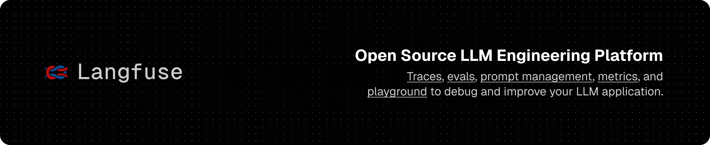
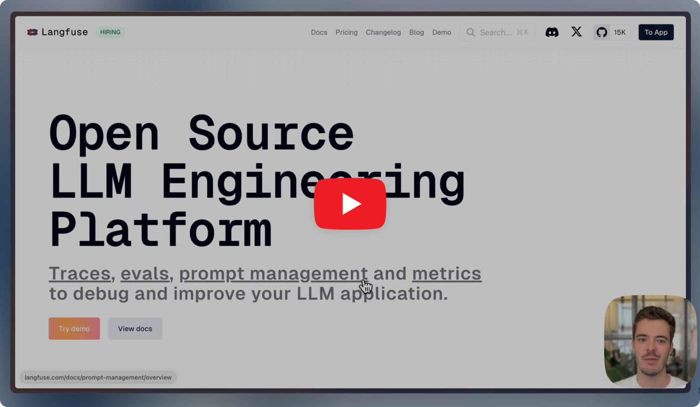
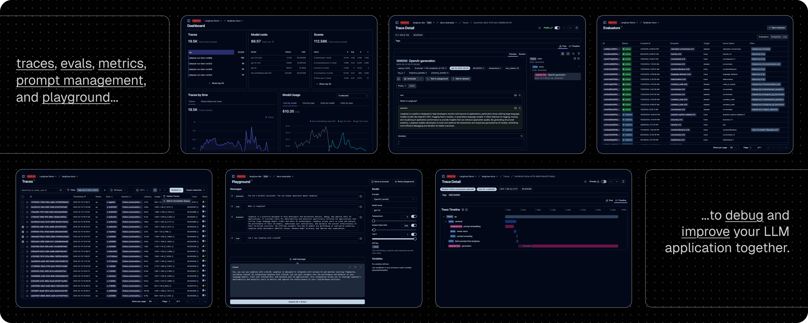
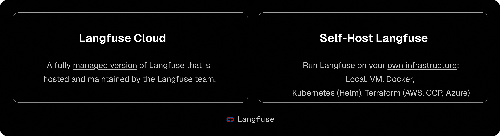
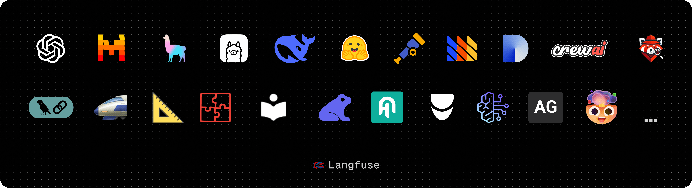
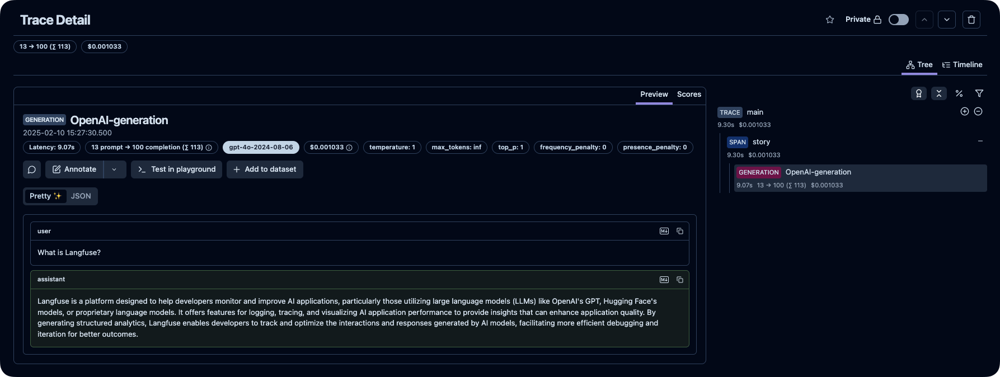
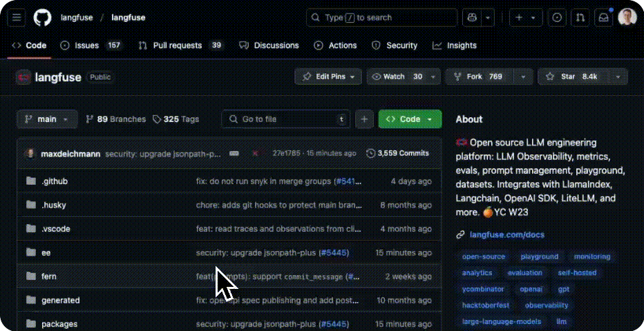
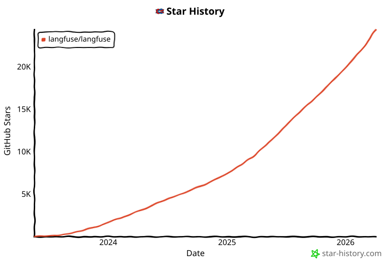

<div align="center">
   <div>
      <h3>
        <a href="https://langfuse.com/blog/2025-06-04-open-sourcing-langfuse-product">
            <strong>Langfuse 正在进一步加码开源</strong>
         </a> <br> <br>
         <a href="https://cloud.langfuse.com">
            <strong>Langfuse Cloud</strong>
         </a> · 
         <a href="https://langfuse.com/docs/deployment/self-host">
            <strong>自托管</strong>
         </a> · 
         <a href="https://langfuse.com/demo">
            <strong>演示</strong>
         </a>
      </h3>
   </div>

   <div>
      <a href="https://langfuse.com/docs"><strong>文档</strong></a> ·
      <a href="https://langfuse.com/issues"><strong>报告缺陷</strong></a> ·
      <a href="https://langfuse.com/ideas"><strong>功能请求</strong></a> ·
      <a href="https://langfuse.com/changelog"><strong>更新日志</strong></a> ·
      <a href="https://langfuse.com/roadmap"><strong>路线图</strong></a> ·
   </div>
   <br/>
   <span>Langfuse 使用 <a href="https://github.com/orgs/langfuse/discussions"><strong>GitHub Discussions</strong></a> 处理支持问题和功能请求。</span>
   <br/>
   <span><b>我们正在招聘。</b> 欢迎<a href="https://langfuse.com/careers"><strong>加入我们</strong></a>，投递产品工程和技术市场拓展相关岗位。</span>
   <br/>
   <br/>
   <div>
   </div>
</div>

<p align="center">
   <a href="https://github.com/langfuse/langfuse/blob/main/LICENSE">
   
   </a>
   <a href="https://www.ycombinator.com/companies/langfuse"></a>
   <a href="https://hub.docker.com/u/langfuse" target="_blank">
   </a>
   <a href="https://pypi.python.org/pypi/langfuse"></a>
   <a href="https://www.npmjs.com/package/langfuse"></a>
   <br/>
   <a href="https://discord.com/invite/7NXusRtqYU" target="_blank">
   </a>
   <a href="https://twitter.com/intent/follow?screen_name=langfuse" target="_blank">
   </a>
   <a href="https://www.linkedin.com/company/langfuse/" target="_blank">
   </a>
   <a href="https://github.com/langfuse/langfuse/graphs/commit-activity" target="_blank">
   </a>
   <a href="https://github.com/langfuse/langfuse/" target="_blank">
   </a>
   <a href="https://github.com/langfuse/langfuse/discussions/" target="_blank">
   </a>
   <a href="https://deepwiki.com/langfuse/langfuse" target="_blank">
   </a>
</p>

<p align="center">
  <a href="./README.md"></a>
  <a href="./README.zh-CN.md"></a>
  <a href="./README.ja.md"></a>
  <a href="./README.kr.md"></a>
</p>

<p align="center">
   <a href="https://github.com/ClickHouse/ClickHouse"><strong>自豪地基于 ClickHouse 开源数据库构建</strong></a>
</p>

Langfuse 是一个**开源 LLM 工程**平台，帮助团队协作式地**开发、监控、评估**并**调试** AI 应用。Langfuse 可以在**几分钟内完成自托管部署**，并且已经过**生产环境验证**。

[](https://langfuse.com/watch-demo)

## ✨ 核心功能



- [LLM 应用可观测性](https://langfuse.com/docs/tracing)：为你的应用添加埋点并开始将 trace 发送到 Langfuse，从而跟踪 LLM 调用以及应用中的其他相关逻辑，例如检索、嵌入或 agent 动作。检查和调试复杂日志与用户会话。可通过交互式 [demo](https://langfuse.com/docs/demo) 查看实际效果。

- [Prompt 管理](https://langfuse.com/docs/prompt-management/get-started) 帮助你集中管理、版本控制并协作迭代 prompt。借助服务端和客户端的强缓存能力，你可以在不为应用增加额外延迟的情况下迭代 prompt。

- [评估](https://langfuse.com/docs/evaluation/overview) 是 LLM 应用开发流程中的关键环节，而 Langfuse 能适配你的需求。它支持 LLM-as-a-judge、用户反馈收集、人工标注，以及通过 API/SDK 构建自定义评估流水线。

- [数据集](https://langfuse.com/docs/evaluation/dataset-runs/datasets) 可用于构建测试集和基准，以评估你的 LLM 应用。它们支持持续改进、部署前测试、结构化实验、灵活评估，并可与 LangChain 和 LlamaIndex 等框架无缝集成。

- [LLM Playground](https://langfuse.com/docs/playground) 是一个用于测试和迭代 prompt 与模型配置的工具，可缩短反馈回路并加速开发。当你在 tracing 中看到不理想的结果时，可以直接跳转到 playground 继续迭代。

- [完整 API](https://langfuse.com/docs/api)：Langfuse 经常被用来支撑定制化的 LLMOps 工作流，同时通过 API 使用 Langfuse 提供的各种构建模块。提供 OpenAPI 规范、Postman 集合，以及适用于 Python、JS/TS 的强类型 SDK。

## 📦 部署 Langfuse



### Langfuse Cloud

由 Langfuse 团队托管部署，提供慷慨的免费层，无需信用卡。

<div align="center">
    <a href="https://cloud.langfuse.com" target="_blank">
        
    </a>
</div>

### 自托管 Langfuse

在你自己的基础设施上运行 Langfuse：

- [本地（docker compose）](https://langfuse.com/self-hosting/local)：使用 Docker Compose 在 5 分钟内在你自己的机器上运行 Langfuse。

  ```bash
  # Get a copy of the latest Langfuse repository
  git clone https://github.com/langfuse/langfuse.git
  cd langfuse

  # Run the langfuse docker compose
  docker compose up
  ```

- [VM](https://langfuse.com/self-hosting/docker-compose)：使用 Docker Compose 在单台虚拟机上运行 Langfuse。
- [Kubernetes (Helm)](https://langfuse.com/self-hosting/kubernetes-helm)：使用 Helm 在 Kubernetes 集群上运行 Langfuse。这是首选的生产部署方式。
- Terraform 模板：[AWS](https://langfuse.com/self-hosting/aws)、[Azure](https://langfuse.com/self-hosting/azure)、[GCP](https://langfuse.com/self-hosting/gcp)

参阅[自托管文档](https://langfuse.com/self-hosting)了解更多架构与配置选项。

## 🔌 集成



### 主要集成：

| 集成                                                                         | 支持                       | 描述                                                                                                                                             |
| ---------------------------------------------------------------------------- | -------------------------- | ------------------------------------------------------------------------------------------------------------------------------------------------ |
| [SDK](https://langfuse.com/docs/sdk)                                         | Python, JS/TS              | 使用 SDK 进行手动埋点，获得完全灵活性。                                                                                                          |
| [OpenAI](https://langfuse.com/integrations/model-providers/openai-py)        | Python, JS/TS              | 通过可直接替换的 OpenAI SDK 实现自动埋点。                                                                                                      |
| [Langchain](https://langfuse.com/docs/integrations/langchain)                | Python, JS/TS              | 通过向 Langchain 应用传入 callback handler 实现自动埋点。                                                                                       |
| [LlamaIndex](https://langfuse.com/docs/integrations/llama-index/get-started) | Python                     | 通过 LlamaIndex 的回调系统实现自动埋点。                                                                                                        |
| [Haystack](https://langfuse.com/docs/integrations/haystack)                  | Python                     | 通过 Haystack 内容追踪系统实现自动埋点。                                                                                                        |
| [LiteLLM](https://langfuse.com/docs/integrations/litellm)                    | Python, JS/TS (proxy only) | 将任意 LLM 作为 GPT 的可直接替代项使用。支持 Azure、OpenAI、Cohere、Anthropic、Ollama、VLLM、Sagemaker、HuggingFace、Replicate（100+ LLM）。 |
| [Vercel AI SDK](https://langfuse.com/docs/integrations/vercel-ai-sdk)        | JS/TS                      | 为开发者设计的 TypeScript 工具集，用于基于 React、Next.js、Vue、Svelte、Node.js 构建 AI 驱动应用。                                             |
| [Mastra](https://langfuse.com/docs/integrations/mastra)                      | JS/TS                      | 用于构建 AI agents 和多 agent 系统的开源框架。                                                                                                  |
| [API](https://langfuse.com/docs/api)                                         |                            | 直接调用公共 API。提供 OpenAPI 规范。                                                                                                           |

### 与 Langfuse 集成的包：

| 名称                                                                    | 类型               | 描述                                                                                                                    |
| ----------------------------------------------------------------------- | ------------------ | ----------------------------------------------------------------------------------------------------------------------- |
| [Instructor](https://langfuse.com/docs/integrations/instructor)         | Library            | 用于获取结构化 LLM 输出（JSON、Pydantic）的库                                                                           |
| [DSPy](https://langfuse.com/docs/integrations/dspy)                     | Library            | 系统化优化语言模型 prompt 和权重的框架                                                                                  |
| [Mirascope](https://langfuse.com/docs/integrations/mirascope)           | Library            | 用于构建 LLM 应用的 Python 工具包。                                                                                     |
| [Ollama](https://langfuse.com/docs/integrations/ollama)                 | Model (local)      | 轻松在自己的机器上运行开源 LLM。                                                                                        |
| [Amazon Bedrock](https://langfuse.com/docs/integrations/amazon-bedrock) | Model              | 在 AWS 上运行基础模型和微调模型。                                                                                       |
| [AutoGen](https://langfuse.com/docs/integrations/autogen)               | Agent Framework    | 用于构建分布式 agent 的开源 LLM 平台。                                                                                  |
| [Flowise](https://langfuse.com/docs/integrations/flowise)               | Chat/Agent&nbsp;UI | 用于构建自定义 LLM 流程的 JS/TS 零代码工具。                                                                            |
| [Langflow](https://langfuse.com/docs/integrations/langflow)             | Chat/Agent&nbsp;UI | 基于 Python 的 LangChain UI，使用 react-flow 设计，提供轻松试验和原型化流程的方式。                                     |
| [Dify](https://langfuse.com/docs/integrations/dify)                     | Chat/Agent&nbsp;UI | 带零代码构建器的开源 LLM 应用开发平台。                                                                                 |
| [OpenWebUI](https://langfuse.com/docs/integrations/openwebui)           | Chat/Agent&nbsp;UI | 自托管的 LLM Chat Web UI，支持多种 LLM 运行器，包括自托管和本地模型。                                                   |
| [Promptfoo](https://langfuse.com/docs/integrations/promptfoo)           | Tool               | 开源 LLM 测试平台。                                                                                                     |
| [LobeChat](https://langfuse.com/docs/integrations/lobechat)             | Chat/Agent&nbsp;UI | 开源聊天机器人平台。                                                                                                    |
| [Vapi](https://langfuse.com/docs/integrations/vapi)                     | Platform           | 开源语音 AI 平台。                                                                                                      |
| [Inferable](https://langfuse.com/docs/integrations/other/inferable)     | Agents             | 用于构建分布式 agent 的开源 LLM 平台。                                                                                  |
| [Gradio](https://langfuse.com/docs/integrations/other/gradio)           | Chat/Agent&nbsp;UI | 用于构建类似聊天 UI 的 Web 界面的开源 Python 库。                                                                       |
| [Goose](https://langfuse.com/docs/integrations/goose)                   | Agents             | 用于构建分布式 agent 的开源 LLM 平台。                                                                                  |
| [smolagents](https://langfuse.com/docs/integrations/smolagents)         | Agents             | 开源 AI agents 框架。                                                                                                   |
| [CrewAI](https://langfuse.com/docs/integrations/crewai)                 | Agents             | 用于 agent 协作和工具使用的多 agent 框架。                                                                              |

## 🚀 快速开始

为你的应用添加埋点并开始将 trace 发送到 Langfuse，从而跟踪 LLM 调用以及应用中的其他相关逻辑，例如检索、嵌入或 agent 动作。检查和调试复杂日志与用户会话。

### 1️⃣ 创建新项目

1.  [创建 Langfuse 账户](https://cloud.langfuse.com/auth/sign-up) 或 [自托管](https://langfuse.com/self-hosting)
2.  创建一个新项目
3.  在项目设置中创建新的 API 凭证

### 2️⃣ 记录你的第一次 LLM 调用

[`@observe()` 装饰器](https://langfuse.com/docs/sdk/python/decorators)让你可以轻松追踪任何 Python LLM 应用。在这个快速开始中，我们还会使用 Langfuse 的 [OpenAI 集成](https://langfuse.com/integrations/model-providers/openai-py) 自动捕获所有模型参数。

> [!TIP]
> 不使用 OpenAI？访问[我们的文档](https://langfuse.com/docs/get-started#log-your-first-llm-call-to-langfuse)，了解如何记录其他模型和框架。

```bash
pip install langfuse openai
```

```bash filename=".env"
LANGFUSE_SECRET_KEY="sk-lf-..."
LANGFUSE_PUBLIC_KEY="pk-lf-..."
LANGFUSE_BASE_URL="https://cloud.langfuse.com" # 🇪🇺 EU region
# LANGFUSE_BASE_URL="https://us.cloud.langfuse.com" # 🇺🇸 US region
```

```python /@observe()/ /from langfuse.openai import openai/ filename="main.py"
from langfuse import observe
from langfuse.openai import openai # OpenAI integration

@observe()
def story():
    return openai.chat.completions.create(
        model="gpt-4o",
        messages=[{"role": "user", "content": "What is Langfuse?"}],
    ).choices[0].message.content

@observe()
def main():
    return story()

main()
```

### 3️⃣ 在 Langfuse 中查看 traces

在 Langfuse 中查看你的语言模型调用以及其他应用逻辑。



_[Langfuse 中的公开示例 trace](https://cloud.langfuse.com/project/cloramnkj0002jz088vzn1ja4/traces/2cec01e3-3dc2-472f-afcf-3b968cf0c1f4?timestamp=2025-02-10T14%3A27%3A30.275Z&observation=cb5ff844-07ef-41e6-b8e2-6c64344bc13b)_

> [!TIP]
>
> 进一步了解 Langfuse 中的 [tracing](https://langfuse.com/docs/tracing)，或体验[交互式 demo](https://langfuse.com/docs/demo)。

## ⭐️ 给我们点个 Star



## 💭 支持

如何找到你问题的答案：

- 我们的[文档](https://langfuse.com/docs)是寻找答案的最佳起点。内容覆盖全面，我们投入了大量时间维护它。你也可以通过 GitHub 对文档提出修改建议。
- [Langfuse 常见问题](https://langfuse.com/faq)，其中回答了最常见的问题。
- 使用 [Ask AI](https://langfuse.com/docs/ask-ai) 即时获取问题答案。

支持渠道：

- **在 GitHub Discussions 的[公开问答区](https://github.com/orgs/langfuse/discussions/categories/support)提出任何问题。** 请尽可能提供详细信息（例如代码片段、截图、背景信息），以帮助我们理解你的问题。
- 在 GitHub Discussions 上[请求新功能](https://github.com/orgs/langfuse/discussions/categories/ideas)。
- 在 GitHub Issues 上[报告缺陷](https://github.com/langfuse/langfuse/issues)。
- 对于时间敏感的问题，可通过应用内聊天组件联系我们。

## 🤝 参与贡献

欢迎贡献！

- 在 GitHub Discussions 的 [Ideas](https://github.com/orgs/langfuse/discussions/categories/ideas) 中投票。
- 提交并评论 [Issues](https://github.com/langfuse/langfuse/issues)。
- 提交 PR。开发环境搭建细节请参阅 [CONTRIBUTING.md](CONTRIBUTING.md)。

## 🥇 许可证

除 `ee` 目录外，本仓库采用 MIT 许可证。更多细节请参阅 [LICENSE](LICENSE) 和 [docs](https://langfuse.com/docs/open-source)。

## 依赖

我们将这套代码库部署在基于 Linux Alpine Image 的 Docker 容器中（[source](https://github.com/nodejs/docker-node)）。你可以在 [web/Dockerfile](web/Dockerfile) 和 [worker/Dockerfile](worker/Dockerfile) 中找到相关 Dockerfile。

## ⭐️ Star 历史

<a href="https://star-history.com/#langfuse/langfuse&Date">
 <picture>
   <source media="(prefers-color-scheme: dark)" srcset="assets/100-svg-76c0b6d440.svg" />
   <source media="(prefers-color-scheme: light)" srcset="assets/008-svg-8bd773a8cb.svg" />
   
 </picture>
</a>

## ❤️ 使用 Langfuse 的开源项目

使用 Langfuse 的热门开源 Python 项目，按 star 数排序（[来源](https://github.com/langfuse/langfuse-docs/blob/main/components-mdx/dependents)）：

| Repository                                                                                                                                                                                                                                                                                                     |  Stars |
| :------------------------------------------------------------------------------------------------------------------------------------------------------------------------------------------------------------------------------------------------------------------------------------------------------------- | -----: |
|  &nbsp; [langflow-ai](https://github.com/langflow-ai) / [langflow](https://github.com/langflow-ai/langflow)                                                                             | 116251 |
|  &nbsp; [open-webui](https://github.com/open-webui) / [open-webui](https://github.com/open-webui/open-webui)                                                                           | 109642 |
|  &nbsp; [abi](https://github.com/abi) / [screenshot-to-code](https://github.com/abi/screenshot-to-code)                                                                                    |  70877 |
|  &nbsp; [lobehub](https://github.com/lobehub) / [lobe-chat](https://github.com/lobehub/lobe-chat)                                                                                      |  65454 |
|  &nbsp; [infiniflow](https://github.com/infiniflow) / [ragflow](https://github.com/infiniflow/ragflow)                                                                                  |  64118 |
|  &nbsp; [firecrawl](https://github.com/firecrawl) / [firecrawl](https://github.com/firecrawl/firecrawl)                                                                                |  56713 |
|  &nbsp; [run-llama](https://github.com/run-llama) / [llama_index](https://github.com/run-llama/llama_index)                                                                            |  44203 |
|  &nbsp; [FlowiseAI](https://github.com/FlowiseAI) / [Flowise](https://github.com/FlowiseAI/Flowise)                                                                                    |  43547 |
|  &nbsp; [QuivrHQ](https://github.com/QuivrHQ) / [quivr](https://github.com/QuivrHQ/quivr)                                                                                              |  38415 |
|  &nbsp; [microsoft](https://github.com/microsoft) / [ai-agents-for-beginners](https://github.com/microsoft/ai-agents-for-beginners)                                                      |  38012 |
|  &nbsp; [chatchat-space](https://github.com/chatchat-space) / [Langchain-Chatchat](https://github.com/chatchat-space/Langchain-Chatchat)                                               |  36071 |
|  &nbsp; [mindsdb](https://github.com/mindsdb) / [mindsdb](https://github.com/mindsdb/mindsdb)                                                                                           |  35669 |
|  &nbsp; [danny-avila](https://github.com/danny-avila) / [LibreChat](https://github.com/danny-avila/LibreChat)                                                                            |  33142 |
|  &nbsp; [BerriAI](https://github.com/BerriAI) / [litellm](https://github.com/BerriAI/litellm)                                                                                          |  28726 |
|  &nbsp; [onlook-dev](https://github.com/onlook-dev) / [onlook](https://github.com/onlook-dev/onlook)                                                                                   |  22447 |
|  &nbsp; [NixOS](https://github.com/NixOS) / [nixpkgs](https://github.com/NixOS/nixpkgs)                                                                                                   |  21748 |
|  &nbsp; [kortix-ai](https://github.com/kortix-ai) / [suna](https://github.com/kortix-ai/suna)                                                                                          |  17976 |
|  &nbsp; [anthropics](https://github.com/anthropics) / [courses](https://github.com/anthropics/courses)                                                                                  |  17057 |
|  &nbsp; [mastra-ai](https://github.com/mastra-ai) / [mastra](https://github.com/mastra-ai/mastra)                                                                                      |  16484 |
|  &nbsp; [langfuse](https://github.com/langfuse) / [langfuse](https://github.com/langfuse/langfuse)                                                                                     |  16054 |
|  &nbsp; [Canner](https://github.com/Canner) / [WrenAI](https://github.com/Canner/WrenAI)                                                                                                 |  11868 |
|  &nbsp; [promptfoo](https://github.com/promptfoo) / [promptfoo](https://github.com/promptfoo/promptfoo)                                                                                |   8350 |
|  &nbsp; [The-Pocket](https://github.com/The-Pocket) / [PocketFlow](https://github.com/The-Pocket/PocketFlow)                                                                           |   8313 |
|  &nbsp; [OpenPipe](https://github.com/OpenPipe) / [ART](https://github.com/OpenPipe/ART)                                                                                               |   7093 |
|  &nbsp; [topoteretes](https://github.com/topoteretes) / [cognee](https://github.com/topoteretes/cognee)                                                                                |   7011 |
|  &nbsp; [awslabs](https://github.com/awslabs) / [agent-squad](https://github.com/awslabs/agent-squad)                                                                                    |   6785 |
|  &nbsp; [BasedHardware](https://github.com/BasedHardware) / [omi](https://github.com/BasedHardware/omi)                                                                                |   6231 |
|  &nbsp; [hatchet-dev](https://github.com/hatchet-dev) / [hatchet](https://github.com/hatchet-dev/hatchet)                                                                              |   6019 |
|  &nbsp; [zenml-io](https://github.com/zenml-io) / [zenml](https://github.com/zenml-io/zenml)                                                                                            |   4873 |
|  &nbsp; [refly-ai](https://github.com/refly-ai) / [refly](https://github.com/refly-ai/refly)                                                                                           |   4654 |
|  &nbsp; [coleam00](https://github.com/coleam00) / [ottomator-agents](https://github.com/coleam00/ottomator-agents)                                                                      |   4165 |
|  &nbsp; [JoshuaC215](https://github.com/JoshuaC215) / [agent-service-toolkit](https://github.com/JoshuaC215/agent-service-toolkit)                                                       |   3557 |
|  &nbsp; [colanode](https://github.com/colanode) / [colanode](https://github.com/colanode/colanode)                                                                                     |   3517 |
|  &nbsp; [VoltAgent](https://github.com/VoltAgent) / [voltagent](https://github.com/VoltAgent/voltagent)                                                                                |   3210 |
|  &nbsp; [bragai](https://github.com/bragai) / [bRAG-langchain](https://github.com/bragai/bRAG-langchain)                                                                               |   3010 |
|  &nbsp; [pingcap](https://github.com/pingcap) / [autoflow](https://github.com/pingcap/autoflow)                                                                                         |   2651 |
|  &nbsp; [sourcebot-dev](https://github.com/sourcebot-dev) / [sourcebot](https://github.com/sourcebot-dev/sourcebot)                                                                    |   2570 |
|  &nbsp; [open-webui](https://github.com/open-webui) / [pipelines](https://github.com/open-webui/pipelines)                                                                             |   2055 |
|  &nbsp; [YFGaia](https://github.com/YFGaia) / [dify-plus](https://github.com/YFGaia/dify-plus)                                                                                         |   1734 |
|  &nbsp; [TheSpaghettiDetective](https://github.com/TheSpaghettiDetective) / [obico-server](https://github.com/TheSpaghettiDetective/obico-server)                                       |   1687 |
|  &nbsp; [MLSysOps](https://github.com/MLSysOps) / [MLE-agent](https://github.com/MLSysOps/MLE-agent)                                                                                    |   1387 |
|  &nbsp; [TIGER-AI-Lab](https://github.com/TIGER-AI-Lab) / [TheoremExplainAgent](https://github.com/TIGER-AI-Lab/TheoremExplainAgent)                                                   |   1385 |
|  &nbsp; [trailofbits](https://github.com/trailofbits) / [buttercup](https://github.com/trailofbits/buttercup)                                                                            |   1223 |
|  &nbsp; [wassim249](https://github.com/wassim249) / [fastapi-langgraph-agent-production-ready-template](https://github.com/wassim249/fastapi-langgraph-agent-production-ready-template) |   1200 |
|  &nbsp; [alishobeiri](https://github.com/alishobeiri) / [thread](https://github.com/alishobeiri/thread)                                                                                 |   1098 |
|  &nbsp; [dmayboroda](https://github.com/dmayboroda) / [minima](https://github.com/dmayboroda/minima)                                                                                     |   1010 |
|  &nbsp; [zstar1003](https://github.com/zstar1003) / [ragflow-plus](https://github.com/zstar1003/ragflow-plus)                                                                           |    993 |
|  &nbsp; [openops-cloud](https://github.com/openops-cloud) / [openops](https://github.com/openops-cloud/openops)                                                                        |    939 |
|  &nbsp; [dynamiq-ai](https://github.com/dynamiq-ai) / [dynamiq](https://github.com/dynamiq-ai/dynamiq)                                                                                 |    927 |
|  &nbsp; [xataio](https://github.com/xataio) / [agent](https://github.com/xataio/agent)                                                                                                  |    857 |
|  &nbsp; [plastic-labs](https://github.com/plastic-labs) / [tutor-gpt](https://github.com/plastic-labs/tutor-gpt)                                                                       |    845 |
|  &nbsp; [trendy-design](https://github.com/trendy-design) / [llmchat](https://github.com/trendy-design/llmchat)                                                                        |    829 |
|  &nbsp; [hotovo](https://github.com/hotovo) / [aider-desk](https://github.com/hotovo/aider-desk)                                                                                         |    781 |
|  &nbsp; [opslane](https://github.com/opslane) / [opslane](https://github.com/opslane/opslane)                                                                                          |    719 |
|  &nbsp; [wrtnlabs](https://github.com/wrtnlabs) / [autoview](https://github.com/wrtnlabs/autoview)                                                                                     |    688 |
|  &nbsp; [andysingal](https://github.com/andysingal) / [llm-course](https://github.com/andysingal/llm-course)                                                                            |    643 |
|  &nbsp; [theopenconversationkit](https://github.com/theopenconversationkit) / [tock](https://github.com/theopenconversationkit/tock)                                                    |    587 |
|  &nbsp; [sentient-engineering](https://github.com/sentient-engineering) / [agent-q](https://github.com/sentient-engineering/agent-q)                                                   |    487 |
|  &nbsp; [NicholasGoh](https://github.com/NicholasGoh) / [fastapi-mcp-langgraph-template](https://github.com/NicholasGoh/fastapi-mcp-langgraph-template)                                 |    481 |
|  &nbsp; [i-am-alice](https://github.com/i-am-alice) / [3rd-devs](https://github.com/i-am-alice/3rd-devs)                                                                               |    472 |
|  &nbsp; [AIDotNet](https://github.com/AIDotNet) / [koala-ai](https://github.com/AIDotNet/koala-ai)                                                                                     |    470 |
|  &nbsp; [phospho-app](https://github.com/phospho-app) / [text-analytics-legacy](https://github.com/phospho-app/text-analytics-legacy)                                                  |    439 |
|  &nbsp; [inferablehq](https://github.com/inferablehq) / [inferable](https://github.com/inferablehq/inferable)                                                                          |    403 |
|  &nbsp; [duoyang666](https://github.com/duoyang666) / [ai_novel](https://github.com/duoyang666/ai_novel)                                                                               |    397 |
|  &nbsp; [strands-agents](https://github.com/strands-agents) / [samples](https://github.com/strands-agents/samples)                                                                     |    385 |
|  &nbsp; [FranciscoMoretti](https://github.com/FranciscoMoretti) / [sparka](https://github.com/FranciscoMoretti/sparka)                                                                  |    380 |
|  &nbsp; [RobotecAI](https://github.com/RobotecAI) / [rai](https://github.com/RobotecAI/rai)                                                                                             |    373 |
|  &nbsp; [ElectricCodeGuy](https://github.com/ElectricCodeGuy) / [SupabaseAuthWithSSR](https://github.com/ElectricCodeGuy/SupabaseAuthWithSSR)                                          |    370 |
|  &nbsp; [souzatharsis](https://github.com/souzatharsis) / [tamingLLMs](https://github.com/souzatharsis/tamingLLMs)                                                                      |    323 |
|  &nbsp; [aws-samples](https://github.com/aws-samples) / [aws-ai-ml-workshop-kr](https://github.com/aws-samples/aws-ai-ml-workshop-kr)                                                    |    295 |
|  &nbsp; [weizxfree](https://github.com/weizxfree) / [KnowFlow](https://github.com/weizxfree/KnowFlow)                                                                                   |    285 |
|  &nbsp; [zenml-io](https://github.com/zenml-io) / [zenml-projects](https://github.com/zenml-io/zenml-projects)                                                                          |    276 |
|  &nbsp; [wxai-space](https://github.com/wxai-space) / [LightAgent](https://github.com/wxai-space/LightAgent)                                                                           |    275 |
|  &nbsp; [Ozamatash](https://github.com/Ozamatash) / [deep-research-mcp](https://github.com/Ozamatash/deep-research-mcp)                                                                 |    269 |
|  &nbsp; [sql-agi](https://github.com/sql-agi) / [DB-GPT](https://github.com/sql-agi/DB-GPT)                                                                                            |    241 |
|  &nbsp; [guyernest](https://github.com/guyernest) / [advanced-rag](https://github.com/guyernest/advanced-rag)                                                                             |    238 |
|  &nbsp; [bklieger-groq](https://github.com/bklieger-groq) / [mathtutor-on-groq](https://github.com/bklieger-groq/mathtutor-on-groq)                                                    |    233 |
|  &nbsp; [plastic-labs](https://github.com/plastic-labs) / [honcho](https://github.com/plastic-labs/honcho)                                                                             |    224 |
|  &nbsp; [OVINC-CN](https://github.com/OVINC-CN) / [OpenWebUI](https://github.com/OVINC-CN/OpenWebUI)                                                                                   |    202 |
|  &nbsp; [zhutoutoutousan](https://github.com/zhutoutoutousan) / [worldquant-miner](https://github.com/zhutoutoutousan/worldquant-miner)                                                 |    202 |
|  &nbsp; [iceener](https://github.com/iceener) / [ai](https://github.com/iceener/ai)                                                                                                     |    186 |
|  &nbsp; [giselles-ai](https://github.com/giselles-ai) / [giselle](https://github.com/giselles-ai/giselle)                                                                              |    181 |
|  &nbsp; [ai-shifu](https://github.com/ai-shifu) / [ai-shifu](https://github.com/ai-shifu/ai-shifu)                                                                                     |    181 |
|  &nbsp; [aws-samples](https://github.com/aws-samples) / [sample-serverless-mcp-servers](https://github.com/aws-samples/sample-serverless-mcp-servers)                                    |    175 |
|  &nbsp; [celerforge](https://github.com/celerforge) / [freenote](https://github.com/celerforge/freenote)                                                                               |    171 |
|  &nbsp; [babelcloud](https://github.com/babelcloud) / [LLM-RGB](https://github.com/babelcloud/LLM-RGB)                                                                                 |    164 |
|  &nbsp; [8090-inc](https://github.com/8090-inc) / [xrx-sample-apps](https://github.com/8090-inc/xrx-sample-apps)                                                                       |    163 |
|  &nbsp; [deepset-ai](https://github.com/deepset-ai) / [haystack-core-integrations](https://github.com/deepset-ai/haystack-core-integrations)                                            |    163 |
|  &nbsp; [codecentric](https://github.com/codecentric) / [c4-genai-suite](https://github.com/codecentric/c4-genai-suite)                                                                  |    152 |
|  &nbsp; [XSpoonAi](https://github.com/XSpoonAi) / [spoon-core](https://github.com/XSpoonAi/spoon-core)                                                                                 |    150 |
|  &nbsp; [chatchat-space](https://github.com/chatchat-space) / [LangGraph-Chatchat](https://github.com/chatchat-space/LangGraph-Chatchat)                                               |    144 |
|  &nbsp; [langfuse](https://github.com/langfuse) / [langfuse-docs](https://github.com/langfuse/langfuse-docs)                                                                           |    139 |
|  &nbsp; [piyushgarg-dev](https://github.com/piyushgarg-dev) / [genai-cohort](https://github.com/piyushgarg-dev/genai-cohort)                                                            |    135 |
|  &nbsp; [i-dot-ai](https://github.com/i-dot-ai) / [redbox](https://github.com/i-dot-ai/redbox)                                                                                         |    132 |
|  &nbsp; [bmd1905](https://github.com/bmd1905) / [ChatOpsLLM](https://github.com/bmd1905/ChatOpsLLM)                                                                                     |    127 |
|  &nbsp; [Fintech-Dreamer](https://github.com/Fintech-Dreamer) / [FinSynth](https://github.com/Fintech-Dreamer/FinSynth)                                                                |    121 |
|  &nbsp; [kenshiro-o](https://github.com/kenshiro-o) / [nagato-ai](https://github.com/kenshiro-o/nagato-ai)                                                                               |    119 |

## 🔒 安全与隐私

我们非常重视数据安全与隐私。更多信息请参阅我们的 [Security and Privacy](https://langfuse.com/security) 页面。

### 遥测

默认情况下，Langfuse 会自动将自托管实例的基本使用统计信息上报到集中式服务器（PostHog）。

这有助于我们：

1. 了解 Langfuse 的使用方式，并改进最相关的功能。
2. 跟踪整体使用情况，用于内部和外部（例如融资）报告。

遥测数据不包含原始 trace、prompt、observation、score 或数据集内容。我们在[遥测文档](https://langfuse.com/self-hosting/security/telemetry)中记录了收集的确切字段、发送目标以及实现参考。

对于 Langfuse OSS，你可以通过设置 `TELEMETRY_ENABLED=false` 来选择退出。
