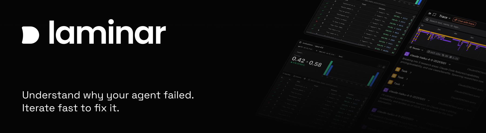
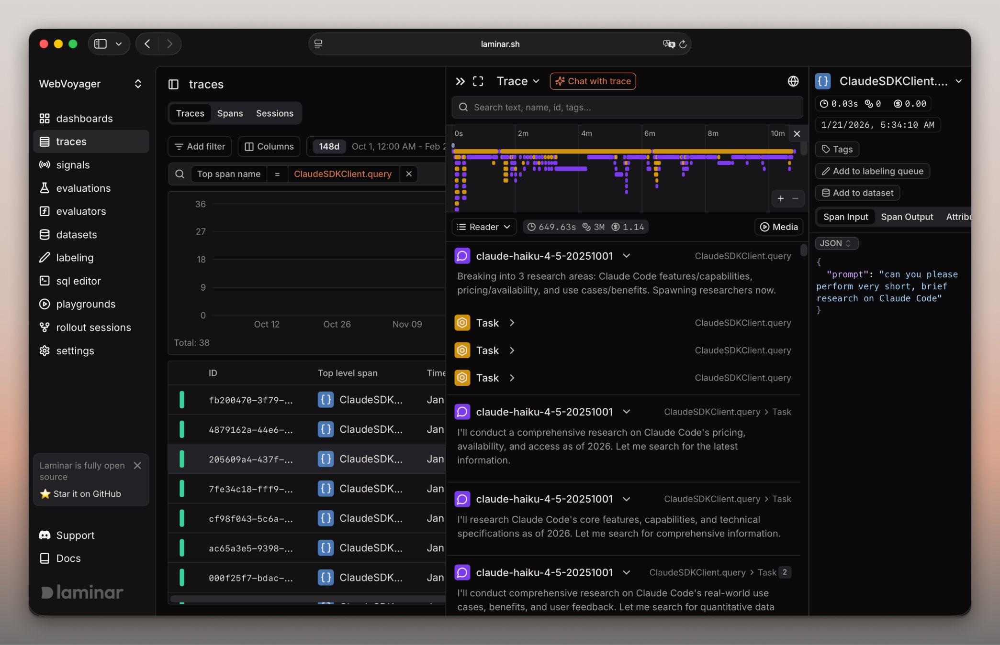

<a href="https://www.ycombinator.com/companies/laminar-ai"></a>
<a href="https://x.com/lmnrai"></a>
<a href="https://discord.gg/nNFUUDAKub">  </a>



# Laminar

[Laminar](https://laminar.sh) 是专为 AI 代理构建的开源可观测性平台。

- [x] 追踪。[文档](https://docs.laminar.sh/tracing/introduction)
    - [x] 基于 OpenTelemetry 的强大追踪 SDK - 1 行代码即可自动追踪 **Vercel AI SDK、Browser Use、Stagehand、LangChain、OpenAI、Anthropic、Gemini 等**。
- [x] 评估。[文档](https://docs.laminar.sh/evaluations/introduction)
    - [x] 不设限制、可扩展的 SDK 和 CLI，支持在本地或 CI/CD 管道中运行评估。
    - [x] 可视化评估和比较结果的 UI。
- [x] AI 监控。[文档](https://docs.laminar.sh/signals)
    - [x] 使用自然语言描述来定义事件，以跟踪代理的问题、逻辑错误和自定义行为。
- [x] SQL 访问所有数据。[文档](https://docs.laminar.sh/platform/sql-editor)
    - [x] 通过内置 SQL 编辑器查询追踪、指标和事件。支持从查询批量创建数据集。可通过 API 使用。
- [x] 仪表盘。[文档](https://docs.laminar.sh/custom-dashboards/overview)
    - [x] 强大的仪表盘构建器，适用于追踪、指标和事件，并支持自定义 SQL 查询。
- [x] 数据标注与数据集。[文档](https://docs.laminar.sh/datasets/introduction)
    - [x] 自定义数据渲染 UI，用于快速数据标注和创建评估数据集。
- [x] 极致高性能。
    - [x] 使用 Rust 编写 🦀
    - [x] 自定义实时引擎，可实时查看追踪数据。
    - [x] 超快的 span 数据全文搜索。
    - [x] 用于追踪数据的 gRPC 导出器。



## 文档

查看完整文档 [docs.laminar.sh](https://docs.laminar.sh)。

## 快速开始

最快最简单的方式是使用我们的托管平台 -> [laminar.sh](https://laminar.sh)

### 使用 Docker Compose 自托管

Laminar 的本地自托管非常简单。要快速开始，克隆仓库并使用 docker compose 启动服务：
```sh
git clone https://github.com/lmnr-ai/lmnr
cd lmnr
docker compose up -d
```

这将启动一个轻量但功能完整的版本。适合快速体验或轻量使用。你可以在浏览器中访问 http://localhost:5667 查看 UI。

你还需要正确配置 SDK 的 `baseUrl` 和相应端口。参见 [自托管指南](https://docs.laminar.sh/hosting-options#self-hosted-docker-compose)。

对于生产环境，我们建议使用我们的 [托管平台](https://laminar.sh) 或 `docker compose -f docker-compose-full.yml up -d`。

### 启用 Signals 功能

要在自托管模式下启用 [Signals / AI 监控](https://docs.laminar.sh/signals)，请在 `.env` 文件中设置 `GOOGLE_GENERATIVE_AI_API_KEY` 环境变量。app-server 和前端都需要此密钥。

```sh
# In .env at the repo root
GOOGLE_GENERATIVE_AI_API_KEY=your_key_here
```

## 贡献

关于本地运行和构建 Laminar，或了解 docker compose 文件的更多信息，
请参阅 [Contributing](/CONTRIBUTING.md) 指南。

## TypeScript 快速开始

首先，[创建一个项目](https://laminar.sh/projects)并生成项目 API 密钥。然后，

```sh
npm add @lmnr-ai/lmnr
```

这将安装 Laminar TypeScript SDK 和所有插桩包（OpenAI、Anthropic、LangChain ...）

要开始追踪 LLM 调用，只需添加
```typescript
import { Laminar } from '@lmnr-ai/lmnr';
Laminar.initialize({ projectApiKey: process.env.LMNR_PROJECT_API_KEY });
```

要追踪函数的输入/输出，请使用 `observe` 包装器。

```typescript
import { OpenAI } from 'openai';
import { observe } from '@lmnr-ai/lmnr';

const client = new OpenAI({ apiKey: process.env.OPENAI_API_KEY });

const poemWriter = observe({name: 'poemWriter'}, async (topic) => {
  const response = await client.chat.completions.create({
    model: "gpt-4o-mini",
    messages: [{ role: "user", content: `write a poem about ${topic}` }],
  });
  return response.choices[0].message.content;
});

await poemWriter();
```

## Python 快速开始

首先，[创建一个项目](https://laminar.sh/projects)并生成项目 API 密钥。然后，

```sh
pip install --upgrade 'lmnr[all]'
```
这将安装 Laminar Python SDK 和所有插桩包。查看所有插桩列表请见[这里](https://docs.laminar.sh/installation)。

要开始追踪 LLM 调用，只需添加
```python
from lmnr import Laminar
Laminar.initialize(project_api_key="<LMNR_PROJECT_API_KEY>")
```

要追踪函数的输入/输出，请使用 `@observe()` 装饰器。

```python
import os
from openai import OpenAI

from lmnr import observe, Laminar
Laminar.initialize(project_api_key="<LMNR_PROJECT_API_KEY>")

client = OpenAI(api_key=os.environ["OPENAI_API_KEY"])

@observe()  # 标注你想要追踪的所有函数
def poem_writer(topic):
    response = client.chat.completions.create(
        model="gpt-4o",
        messages=[
            {"role": "user", "content": f"write a poem about {topic}"},
        ],
    )
    poem = response.choices[0].message.content
    return poem

if __name__ == "__main__":
    print(poem_writer(topic="laminar flow"))
```

## 客户端库

要了解更多关于为代码添加插桩的信息，请查看我们的客户端库：

 <a href="https://www.npmjs.com/package/@lmnr-ai/lmnr">  </a>
 <a href="https://pypi.org/project/lmnr/">  </a>
