<h1 align="center" style="border-bottom: none">
    <a href="https://mlflow.org/">
        
    </a>
</h1>
<h2 align="center" style="border-bottom: none">面向代理、LLM 和模型的开源 AI 工程平台</h2>

MLflow 是最大的开源**面向代理、LLM 和 ML 模型的 AI 工程平台**。MLflow 帮助各种规模的团队[调试](https://mlflow.org/llm-tracing)、[评估](https://mlflow.org/llm-evaluation)、[监控](https://mlflow.org/ai-monitoring)和[优化](https://mlflow.org/prompt-optimization)生产级 AI 应用，同时控制成本并管理对模型和数据的访问。凭借 **6000 多万次月下载量**，数千家组织每天依赖 MLflow，满怀信心地将 AI 部署到生产环境。

MLflow 为代理和 LLM 应用提供的全面功能集包括生产级[可观测性](https://mlflow.org/docs/latest/genai/tracing)、[评估](https://mlflow.org/docs/latest/genai/eval-monitor)、[提示词管理](https://mlflow.org/docs/latest/genai/prompt-registry)、[提示词优化](https://mlflow.org/prompt-optimization)以及用于管理成本和模型访问的 [AI Gateway](https://mlflow.org/docs/latest/genai/governance/ai-gateway)。
了解更多请访问 [MLflow for LLMs and Agents](https://mlflow.org/docs/latest/genai)。

<div align="center">

[](https://pypi.org/project/mlflow/)
[](https://pepy.tech/projects/mlflow)
[](https://github.com/mlflow/mlflow/blob/master/LICENSE.txt)
<a href="https://twitter.com/intent/follow?screen_name=mlflow" target="_blank">
</a>
<a href="https://www.linkedin.com/company/mlflow-org/" target="_blank">
</a>
[](https://deepwiki.com/mlflow/mlflow)

</div>

<div align="center">
   <div>
      <a href="https://mlflow.org/"><strong>Website</strong></a> ·
      <a href="https://mlflow.org/docs/latest"><strong>Docs</strong></a> ·
      <a href="https://github.com/mlflow/mlflow/issues/new/choose"><strong>Feature Request</strong></a> ·
      <a href="https://mlflow.org/blog"><strong>News</strong></a> ·
      <a href="https://www.youtube.com/@mlflowoss"><strong>YouTube</strong></a> ·
      <a href="https://lu.ma/mlflow?k=c"><strong>Events</strong></a>
   </div>
</div>

<br>

## 3 步快速上手

从零到全栈 LLMOps 只需几分钟。无需复杂配置或大规模代码改动。[开始使用 →](https://mlflow.org/docs/latest/genai/tracing/quickstart/)

**1. 启动 MLflow 服务器**

```bash
uvx mlflow server
```

**2. 启用日志记录**

```python
import mlflow

mlflow.set_tracking_uri("http://localhost:5000")
mlflow.openai.autolog()
```

**3. 运行你的代码**

```python
from openai import OpenAI

client = OpenAI()
client.responses.create(
    model="gpt-5.4-mini",
    input="Hello!",
)
```

在 `http://localhost:5000` 的 MLflow UI 中查看追踪和指标。

## LLM 与代理

MLflow 提供构建、调试、评估和部署生产级 LLM 应用和 AI 代理所需的一切。支持 Python、TypeScript/JavaScript、Java 及任何其他编程语言。MLflow 还原生集成 [OpenTelemetry](https://opentelemetry.io/) 和 MCP。

<table>
  <tr>
    <td width="50%">
    
    <div align="center">
        <br>
        <a href="https://mlflow.org/docs/latest/genai/tracing/"><strong>可观测性</strong></a>
        <br><br>
        <div>捕获 LLM 应用和代理的完整追踪，获取深入的行为洞察。基于 OpenTelemetry 构建，支持所有 LLM 提供商和代理框架。监控生产质量、成本和安全性。</div><br>
        <a href="https://mlflow.org/docs/latest/genai/tracing/quickstart/">开始使用 →</a>
        <br><br>
    </div>
    </td>
    <td width="50%">
    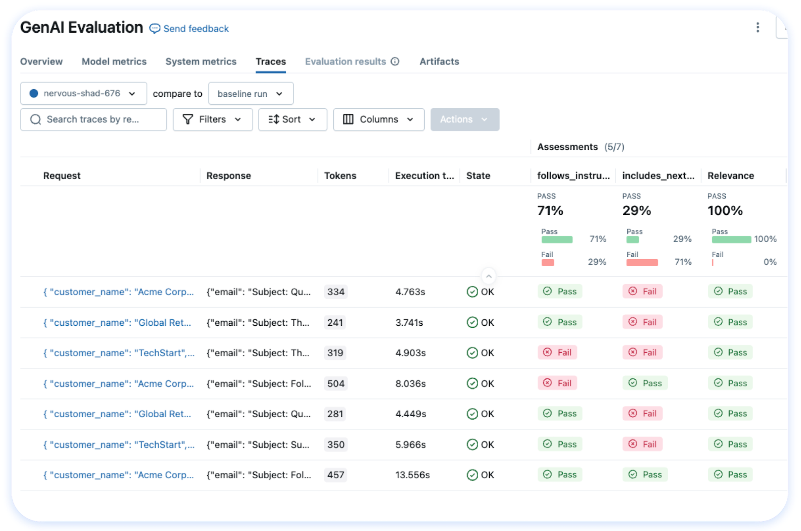
    <div align="center">
        <br>
        <a href="https://mlflow.org/docs/latest/genai/eval-monitor/"><strong>评估</strong></a>
        <br><br>
        <div>运行系统化评估，持续跟踪质量指标，并在回归问题进入生产环境之前发现它们。从 50+ 内置指标和 LLM 评判器中选择，或定义自己的指标。</div><br>
        <a href="https://mlflow.org/docs/latest/genai/eval-monitor/">开始使用 →</a>
        <br><br>
    </div>
    </td>
  </tr>
  <tr>
    <td width="50%">
      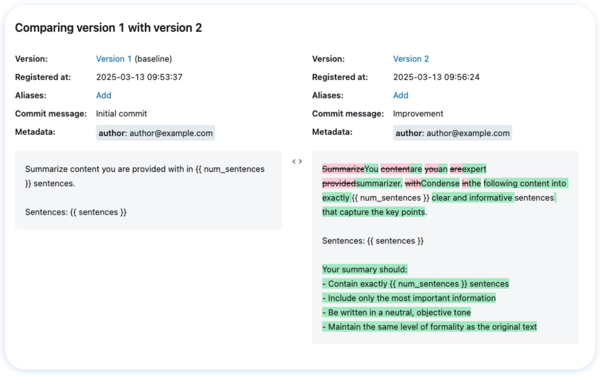
    <div align="center">
        <br>
        <a href="https://mlflow.org/docs/latest/genai/prompt-registry/"><strong>提示词与优化</strong></a>
        <br><br>
        <div>对提示词进行版本管理、测试和部署，并提供完整的血缘追踪。使用最先进的算法<a href="https://mlflow.org/prompt-optimization">自动优化提示词</a>，提升性能。</div><br>
        <a href="https://mlflow.org/docs/latest/genai/prompt-registry/create-and-edit-prompts/">开始使用 →</a>
        <br><br>
    </div>
    </td>
    <td width="50%">
      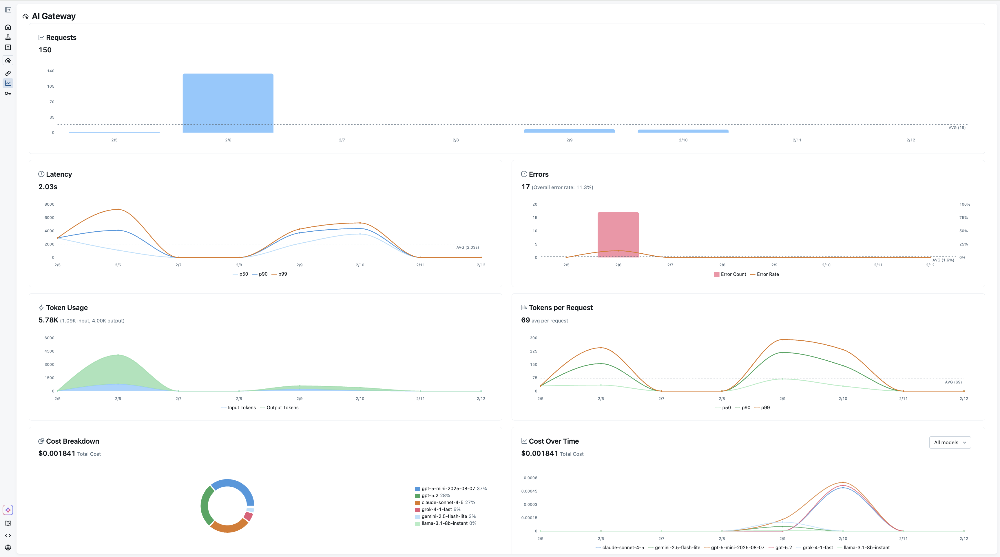
    <div align="center">
        <br>
        <a href="https://mlflow.org/docs/latest/genai/governance/ai-gateway/"><strong>AI Gateway</strong></a>
        <br><br>
        <div>适用于所有 LLM 提供商的统一 API 网关。通过兼容 OpenAI 的接口路由请求、管理速率限制、处理回退并控制成本，内置凭据管理、安全护栏和用于 A/B 测试的流量分割。</div><br>
        <a href="https://mlflow.org/docs/latest/genai/governance/ai-gateway/quickstart/">开始使用 →</a>
        <br><br>
    </div>
    </td>
  </tr>
</table>

## 模型训练

对于机器学习和深度学习模型开发，MLflow 提供了一整套管理 ML 生命周期的工具：

- [**实验追踪**](https://mlflow.org/docs/latest/ml/tracking/) — 跨实验追踪模型、参数、指标和评估结果
- [**模型评估**](https://mlflow.org/docs/latest/ml/evaluation/) — 与实验追踪集成的自动化评估工具
- [**模型注册表**](https://mlflow.org/docs/latest/ml/model-registry/) — 协作管理 ML 模型的完整生命周期
- [**部署**](https://mlflow.org/docs/latest/ml/deployment/) — 将模型部署到 Docker、Kubernetes、Azure ML、AWS SageMaker 等平台，执行批量和实时推理

了解更多请访问 [MLflow for Model Training](https://mlflow.org/docs/latest/ml)。

## 集成

MLflow 支持所有代理框架、LLM 提供商、工具和编程语言。我们为 60 多个框架提供一行代码自动追踪。查看[完整集成列表](https://mlflow.org/docs/latest/genai/tracing/integrations/)。

### OpenTelemetry

<table>
  <tr>
    <td align="center" width="110"><a href="https://mlflow.org/docs/latest/genai/tracing/app-instrumentation/opentelemetry"><br><sub><b>OpenTelemetry</b></sub></a></td>
  </tr>
</table>

### 代理框架 (Python)

<table>
  <tr>
    <td align="center" width="110"><a href="https://mlflow.org/docs/latest/genai/tracing/integrations/listing/langchain"><br><sub><b>LangChain</b></sub></a></td>
    <td align="center" width="110"><a href="https://mlflow.org/docs/latest/genai/tracing/integrations/listing/langgraph">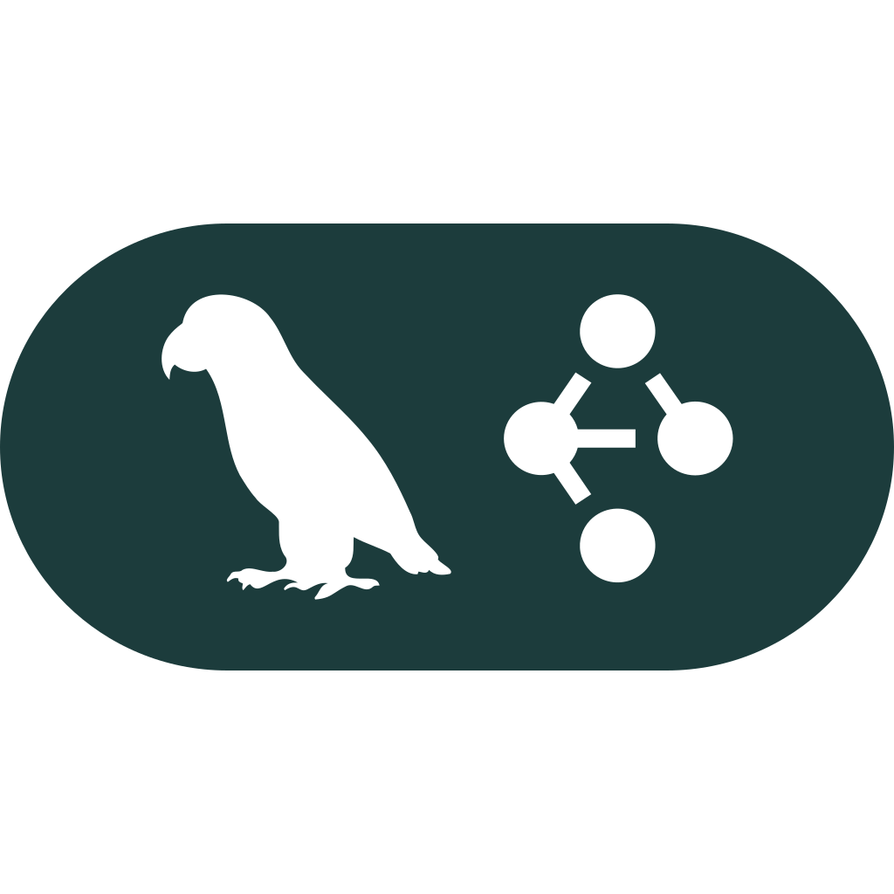<br><sub><b>LangGraph</b></sub></a></td>
    <td align="center" width="110"><a href="https://mlflow.org/docs/latest/genai/tracing/integrations/listing/openai-agent"><br><sub><b>OpenAI Agent</b></sub></a></td>
    <td align="center" width="110"><a href="https://mlflow.org/docs/latest/genai/tracing/integrations/listing/dspy"><br><sub><b>DSPy</b></sub></a></td>
    <td align="center" width="110"><a href="https://mlflow.org/docs/latest/genai/tracing/integrations/listing/pydantic_ai">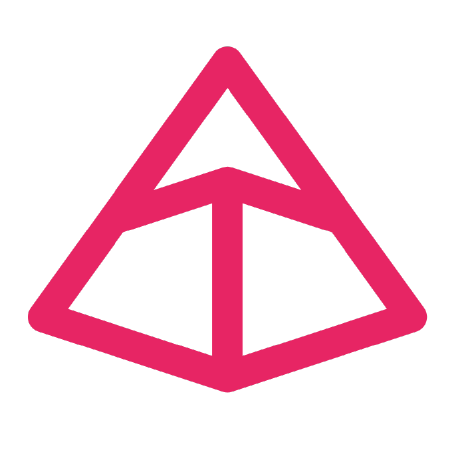<br><sub><b>PydanticAI</b></sub></a></td>
    <td align="center" width="110"><a href="https://mlflow.org/docs/latest/genai/tracing/integrations/listing/google-adk"><br><sub><b>Google ADK</b></sub></a></td>
  </tr>
  <tr>
    <td align="center" width="110"><a href="https://mlflow.org/docs/latest/genai/tracing/integrations/listing/microsoft-agent-framework"><br><sub><b>Microsoft Agent</b></sub></a></td>
    <td align="center" width="110"><a href="https://mlflow.org/docs/latest/genai/tracing/integrations/listing/crewai"><br><sub><b>CrewAI</b></sub></a></td>
    <td align="center" width="110"><a href="https://mlflow.org/docs/latest/genai/tracing/integrations/listing/llama_index"><br><sub><b>LlamaIndex</b></sub></a></td>
    <td align="center" width="110"><a href="https://mlflow.org/docs/latest/genai/tracing/integrations/listing/autogen"><br><sub><b>AutoGen</b></sub></a></td>
    <td align="center" width="110"><a href="https://mlflow.org/docs/latest/genai/tracing/integrations/listing/strands"><br><sub><b>Strands</b></sub></a></td>
    <td align="center" width="110"><a href="https://mlflow.org/docs/latest/genai/tracing/integrations/listing/livekit"><br><sub><b>LiveKit Agents</b></sub></a></td>
  </tr>
  <tr>
    <td align="center" width="110"><a href="https://mlflow.org/docs/latest/genai/tracing/integrations/listing/agno"><br><sub><b>Agno</b></sub></a></td>
    <td align="center" width="110"><a href="https://mlflow.org/docs/latest/genai/tracing/integrations/listing/bedrock-agentcore">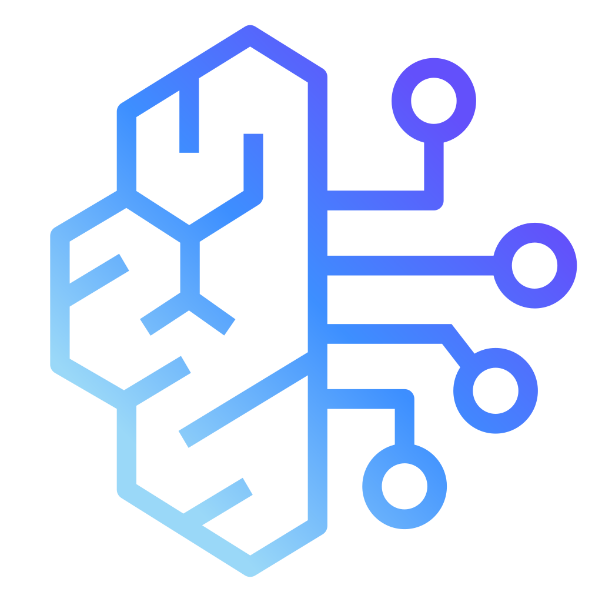<br><sub><b>Bedrock AgentCore</b></sub></a></td>
    <td align="center" width="110"><a href="https://mlflow.org/docs/latest/genai/tracing/integrations/listing/smolagents"><br><sub><b>Smolagents</b></sub></a></td>
    <td align="center" width="110"><a href="https://mlflow.org/docs/latest/genai/tracing/integrations/listing/semantic_kernel">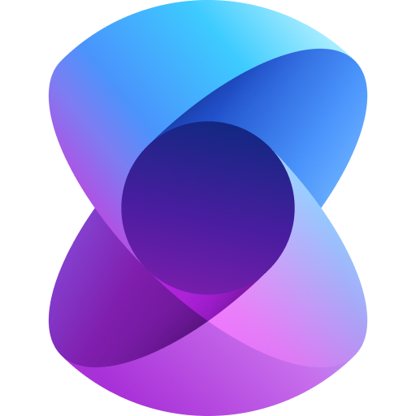<br><sub><b>Semantic Kernel</b></sub></a></td>
    <td align="center" width="110"><a href="https://mlflow.org/docs/latest/genai/tracing/integrations/listing/deepagent"><br><sub><b>DeepAgent</b></sub></a></td>
    <td align="center" width="110"><a href="https://mlflow.org/docs/latest/genai/tracing/integrations/listing/ag2"><br><sub><b>AG2</b></sub></a></td>
  </tr>
  <tr>
    <td align="center" width="110"><a href="https://mlflow.org/docs/latest/genai/tracing/integrations/listing/haystack"><br><sub><b>Haystack</b></sub></a></td>
    <td align="center" width="110"><a href="https://mlflow.org/docs/latest/genai/tracing/integrations/listing/koog"><br><sub><b>Koog</b></sub></a></td>
    <td align="center" width="110"><a href="https://mlflow.org/docs/latest/genai/tracing/integrations/listing/txtai"><br><sub><b>txtai</b></sub></a></td>
    <td align="center" width="110"><a href="https://mlflow.org/docs/latest/genai/tracing/integrations/listing/pipecat"><br><sub><b>Pipecat</b></sub></a></td>
    <td align="center" width="110"><a href="https://mlflow.org/docs/latest/genai/tracing/integrations/listing/watsonx-orchestrate"><br><sub><b>Watsonx</b></sub></a></td>
  </tr>
</table>

### 代理框架 (TypeScript)

<table>
  <tr>
    <td align="center" width="110"><a href="https://mlflow.org/docs/latest/genai/tracing/integrations/listing/langchain"><br><sub><b>LangChain</b></sub></a></td>
    <td align="center" width="110"><a href="https://mlflow.org/docs/latest/genai/tracing/integrations/listing/langgraph"><br><sub><b>LangGraph</b></sub></a></td>
    <td align="center" width="110"><a href="https://mlflow.org/docs/latest/genai/tracing/integrations/listing/vercelai"><br><sub><b>Vercel AI SDK</b></sub></a></td>
    <td align="center" width="110"><a href="https://mlflow.org/docs/latest/genai/tracing/integrations/listing/mastra"><br><sub><b>Mastra</b></sub></a></td>
    <td align="center" width="110"><a href="https://mlflow.org/docs/latest/genai/tracing/integrations/listing/voltagent"><br><sub><b>VoltAgent</b></sub></a></td>
  </tr>
</table>

### 代理框架 (Java)

<table>
  <tr>
    <td align="center" width="110"><a href="https://mlflow.org/docs/latest/genai/tracing/integrations/listing/spring-ai">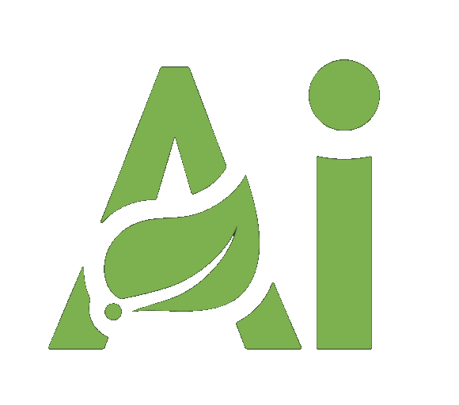<br><sub><b>Spring AI</b></sub></a></td>
    <td align="center" width="110"><a href="https://mlflow.org/docs/latest/genai/tracing/integrations/listing/quarkus-langchain4j"><br><sub><b>Quarkus LangChain4j</b></sub></a></td>
  </tr>
</table>

### 模型提供商

<table>
  <tr>
    <td align="center" width="110"><a href="https://mlflow.org/docs/latest/genai/tracing/integrations/listing/openai"><br><sub><b>OpenAI</b></sub></a></td>
    <td align="center" width="110"><a href="https://mlflow.org/docs/latest/genai/tracing/integrations/listing/anthropic"><br><sub><b>Anthropic</b></sub></a></td>
    <td align="center" width="110"><a href="https://mlflow.org/docs/latest/genai/tracing/integrations/listing/databricks"><br><sub><b>Databricks</b></sub></a></td>
    <td align="center" width="110"><a href="https://mlflow.org/docs/latest/genai/tracing/integrations/listing/gemini"><br><sub><b>Gemini</b></sub></a></td>
    <td align="center" width="110"><a href="https://mlflow.org/docs/latest/genai/tracing/integrations/listing/bedrock"><br><sub><b>Amazon Bedrock</b></sub></a></td>
    <td align="center" width="110"><a href="https://mlflow.org/docs/latest/genai/tracing/integrations/listing/litellm"><br><sub><b>LiteLLM</b></sub></a></td>
  </tr>
  <tr>
    <td align="center" width="110"><a href="https://mlflow.org/docs/latest/genai/tracing/integrations/listing/mistral"><br><sub><b>Mistral</b></sub></a></td>
    <td align="center" width="110"><a href="https://mlflow.org/docs/latest/genai/tracing/integrations/listing/xai-grok"><br><sub><b>xAI / Grok</b></sub></a></td>
    <td align="center" width="110"><a href="https://mlflow.org/docs/latest/genai/tracing/integrations/listing/ollama"><br><sub><b>Ollama</b></sub></a></td>
    <td align="center" width="110"><a href="https://mlflow.org/docs/latest/genai/tracing/integrations/listing/groq"><br><sub><b>Groq</b></sub></a></td>
    <td align="center" width="110"><a href="https://mlflow.org/docs/latest/genai/tracing/integrations/listing/deepseek"><br><sub><b>DeepSeek</b></sub></a></td>
    <td align="center" width="110"><a href="https://mlflow.org/docs/latest/genai/tracing/integrations/listing/qwen">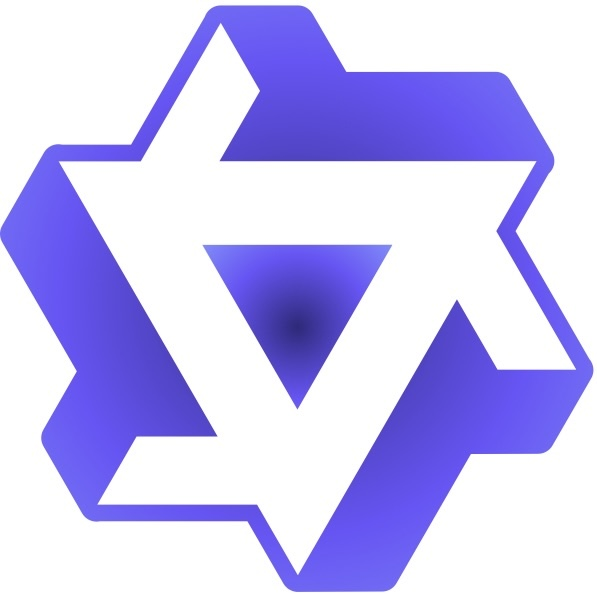<br><sub><b>Qwen</b></sub></a></td>
  </tr>
  <tr>
    <td align="center" width="110"><a href="https://mlflow.org/docs/latest/genai/tracing/integrations/listing/moonshot"><br><sub><b>Moonshot AI</b></sub></a></td>
    <td align="center" width="110"><a href="https://mlflow.org/docs/latest/genai/tracing/integrations/listing/cohere">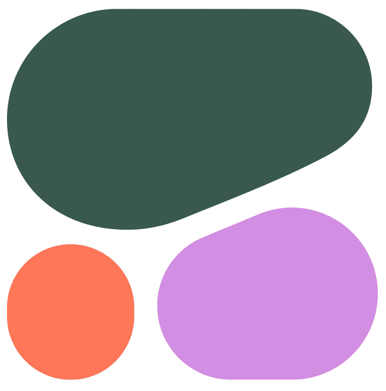<br><sub><b>Cohere</b></sub></a></td>
    <td align="center" width="110"><a href="https://mlflow.org/docs/latest/genai/tracing/integrations/listing/byteplus"><br><sub><b>BytePlus</b></sub></a></td>
    <td align="center" width="110"><a href="https://mlflow.org/docs/latest/genai/tracing/integrations/listing/novitaai"><br><sub><b>Novita AI</b></sub></a></td>
    <td align="center" width="110"><a href="https://mlflow.org/docs/latest/genai/tracing/integrations/listing/fireworksai"><br><sub><b>FireworksAI</b></sub></a></td>
    <td align="center" width="110"><a href="https://mlflow.org/docs/latest/genai/tracing/integrations/listing/togetherai">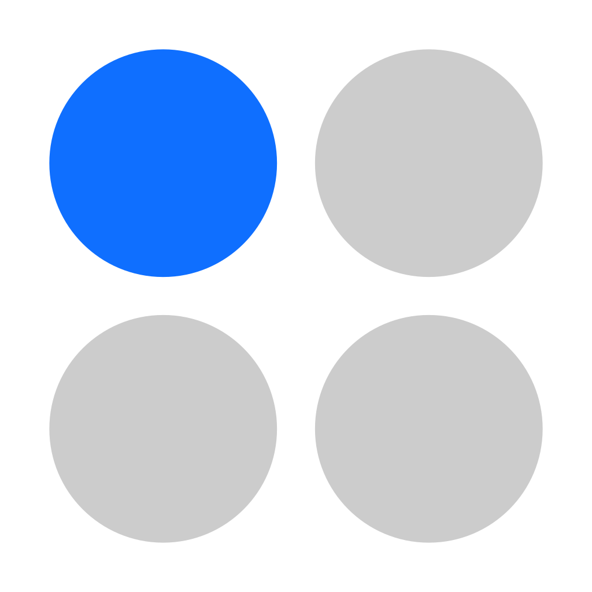<br><sub><b>Together AI</b></sub></a></td>
  </tr>
</table>

### 网关

<table>
  <tr>
    <td align="center" width="110"><a href="https://mlflow.org/docs/latest/genai/tracing/integrations/listing/databricks-ai-gateway"><br><sub><b>Databricks</b></sub></a></td>
    <td align="center" width="110"><a href="https://mlflow.org/docs/latest/genai/tracing/integrations/listing/litellm-proxy"><br><sub><b>LiteLLM Proxy</b></sub></a></td>
    <td align="center" width="110"><a href="https://mlflow.org/docs/latest/genai/tracing/integrations/listing/vercel-ai-gateway"><br><sub><b>Vercel AI Gateway</b></sub></a></td>
    <td align="center" width="110"><a href="https://mlflow.org/docs/latest/genai/tracing/integrations/listing/openrouter"><br><sub><b>OpenRouter</b></sub></a></td>
    <td align="center" width="110"><a href="https://mlflow.org/docs/latest/genai/tracing/integrations/listing/portkey">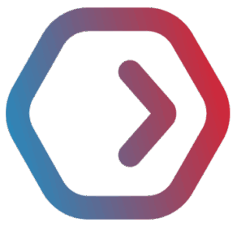<br><sub><b>Portkey</b></sub></a></td>
  </tr>
  <tr>
    <td align="center" width="110"><a href="https://mlflow.org/docs/latest/genai/tracing/integrations/listing/helicone">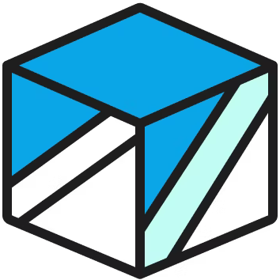<br><sub><b>Helicone</b></sub></a></td>
    <td align="center" width="110"><a href="https://mlflow.org/docs/latest/genai/tracing/integrations/listing/kong"><br><sub><b>Kong AI Gateway</b></sub></a></td>
    <td align="center" width="110"><a href="https://mlflow.org/docs/latest/genai/tracing/integrations/listing/pydantic-ai-gateway"><br><sub><b>PydanticAI Gateway</b></sub></a></td>
    <td align="center" width="110"><a href="https://mlflow.org/docs/latest/genai/tracing/integrations/listing/truefoundry">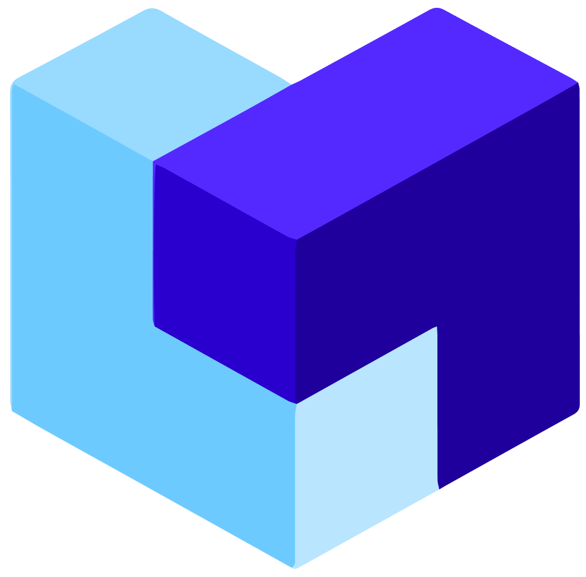<br><sub><b>TrueFoundry</b></sub></a></td>
  </tr>
</table>

### 工具与无代码

<table>
  <tr>
    <td align="center" width="110"><a href="https://mlflow.org/docs/latest/genai/tracing/integrations/listing/instructor"><br><sub><b>Instructor</b></sub></a></td>
    <td align="center" width="110"><a href="https://mlflow.org/docs/latest/genai/tracing/integrations/listing/claude_code"><br><sub><b>Claude Code</b></sub></a></td>
    <td align="center" width="110"><a href="https://mlflow.org/docs/latest/genai/tracing/integrations/listing/opencode"><br><sub><b>Opencode</b></sub></a></td>
    <td align="center" width="110"><a href="https://mlflow.org/docs/latest/genai/tracing/integrations/listing/langfuse"><br><sub><b>Langfuse</b></sub></a></td>
    <td align="center" width="110"><a href="https://mlflow.org/docs/latest/genai/tracing/integrations/listing/arize"><br><sub><b>Arize / Phoenix</b></sub></a></td>
    <td align="center" width="110"><a href="https://mlflow.org/docs/latest/genai/tracing/integrations/listing/goose"><br><sub><b>Goose</b></sub></a></td>
  </tr>
  <tr>
    <td align="center" width="110"><a href="https://mlflow.org/docs/latest/genai/tracing/integrations/listing/langflow"><br><sub><b>Langflow</b></sub></a></td>
  </tr>
</table>

## 托管 MLflow

MLflow 可以在多种环境中使用，包括本地环境、本地部署集群、云平台和托管服务。作为开源平台，MLflow 是**厂商中立的**，无论你在构建 AI 代理、LLM 应用还是 ML 模型，都可以使用 MLflow 的核心能力。

<table>
  <tr>
    <td align="center" width="130"><a href="https://docs.databricks.com/aws/en/mlflow3/genai/"><br><sub><b>Databricks</b></sub></a></td>
    <td align="center" width="130"><a href="https://aws.amazon.com/sagemaker-ai/experiments/"><br><sub><b>Amazon SageMaker</b></sub></a></td>
    <td align="center" width="130"><a href="https://learn.microsoft.com/en-us/azure/machine-learning/concept-mlflow?view=azureml-api-2">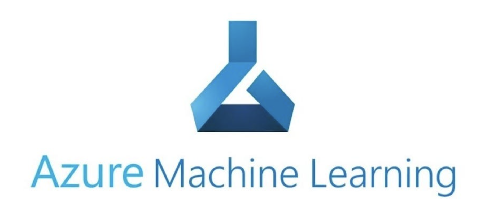<br><sub><b>Azure ML</b></sub></a></td>
    <td align="center" width="130"><a href="https://nebius.com/services/managed-mlflow"><br><sub><b>Nebius</b></sub></a></td>
    <td align="center" width="130"><a href="https://mlflow.org/docs/latest/ml/tracking/"><br><sub><b>Self-Hosted</b></sub></a></td>
  </tr>
</table>

## 💭 支持

- 如需关于 MLflow 使用的帮助或提问（例如"如何实现 X？"），请访问[文档](https://mlflow.org/docs/latest)。
- 在文档中，你可以向我们的 AI 聊天机器人提问。点击右下角的 **"Ask AI"** 按钮。
- 参加如办公时间和聚会的[线上活动](https://lu.ma/mlflow?k=c)。
- 要报告 bug、提交文档问题或功能请求，请[创建 GitHub issue](https://github.com/mlflow/mlflow/issues/new/choose)。
- 关于发布公告和其他讨论，请订阅我们的邮件列表（mlflow-users@googlegroups.com）或加入 [Slack](https://mlflow.org/slack)。

## 🤝 贡献

我们欢迎对 MLflow 的贡献！

- 提交 [bug 报告](https://github.com/mlflow/mlflow/issues/new?template=bug_report_template.yaml)和[功能请求](https://github.com/mlflow/mlflow/issues/new?template=feature_request_template.yaml)
- 参与 [good-first-issues](https://github.com/mlflow/mlflow/issues?q=is%3Aissue+is%3Aopen+label%3A%22good+first+issue%22) 和 [help-wanted](https://github.com/mlflow/mlflow/issues?q=is%3Aissue+is%3Aopen+label%3A%22help+wanted%22)
- 撰写关于 MLflow 的文章并分享你的经验

请参阅我们的[贡献指南](CONTRIBUTING.md)了解更多关于向 MLflow 贡献的信息。

## ⭐️ Star 历史

<a href="https://star-history.com/#mlflow/mlflow&Date">
 <picture>
   <source media="(prefers-color-scheme: dark)" srcset="assets/068-svg-1fb2473206.svg" />
   <source media="(prefers-color-scheme: light)" srcset="assets/067-svg-8e90a570fd.svg" />
   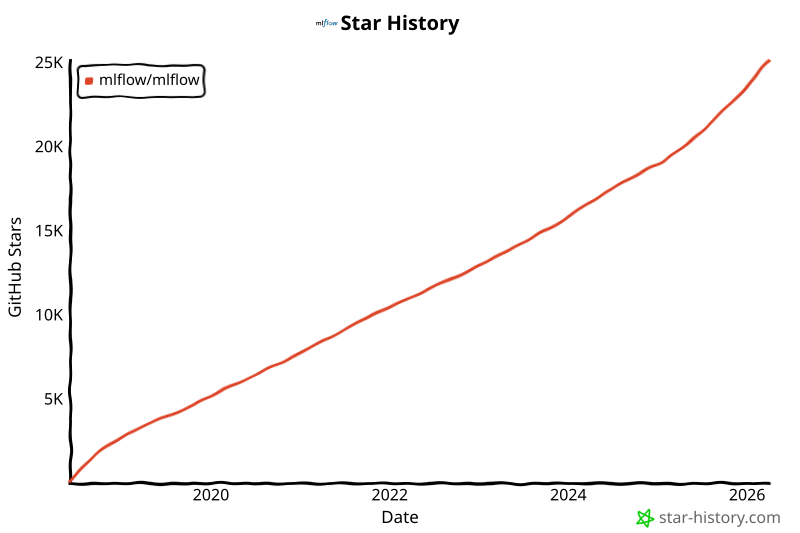
 </picture>
</a>

## ✏️ 引用

如果你在研究中使用 MLflow，请使用 [GitHub 仓库页面](https://github.com/mlflow/mlflow)顶部的"Cite this repository"按钮进行引用，该按钮将提供包括 APA 和 BibTeX 在内的引用格式。

## 👥 核心成员

MLflow 目前由以下核心成员维护，同时得到了数百位才华横溢的社区成员的重要贡献。

- [Ben Wilson](https://github.com/BenWilson2)
- [Corey Zumar](https://github.com/dbczumar)
- [Daniel Lok](https://github.com/daniellok-db)
- [Gabriel Fu](https://github.com/gabrielfu)
- [Harutaka Kawamura](https://github.com/harupy)
- [Joel Robin P](https://github.com/joelrobin18)
- [Matt Prahl](https://github.com/mprahl)
- [Pat Sukprasert](https://github.com/PattaraS)
- [Serena Ruan](https://github.com/serena-ruan)
- [Tomu Hirata](https://github.com/TomeHirata)
- [Weichen Xu](https://github.com/WeichenXu123)
- [Yuki Watanabe](https://github.com/B-Step62)
