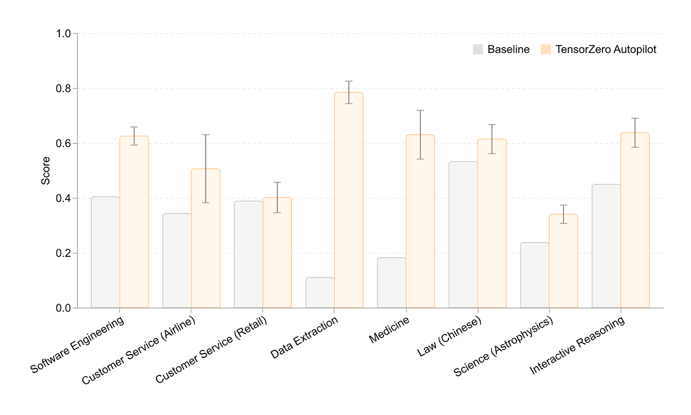
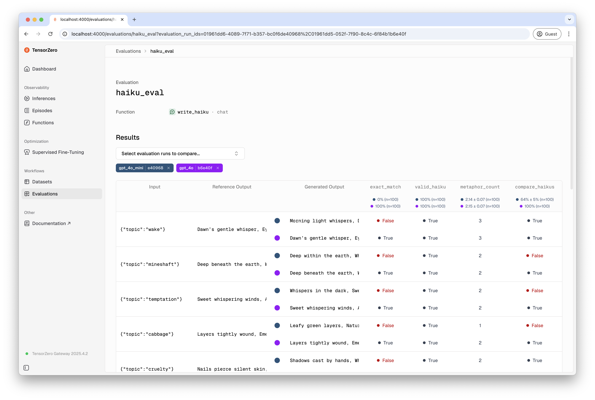

<p><picture></picture></p>

# TensorZero

<p><picture></picture></p>

**TensorZero 是一个开源的 LLMOps 平台，统一了以下能力：**

- **网关：** 通过统一的 API 访问所有 LLM 提供商，专为高性能打造（p99 延迟 <1ms）
- **可观测性：** 将推理结果和反馈存储到你的数据库中，可通过编程方式或 UI 访问
- **评估：** 使用启发式方法、LLM 评审等方式，对单次推理或端到端工作流进行基准测试
- **优化：** 收集指标和人类反馈，以优化提示词、模型和推理策略
- **实验：** 通过内置的 A/B 测试、路由、回退、重试等功能，充满信心地发布

你可以按需选用功能，渐进式采用，并与其他工具互补。
它与 **OpenAI SDK**、**OpenTelemetry** 以及 **所有主流 LLM 提供商** 良好兼容。

TensorZero 被从前沿 AI 初创公司到财富 10 强企业广泛使用，目前承载了全球约 1% 的 LLM API 支出。

<br>

<p align="center">
  <b><a href="https://www.tensorzero.com/" target="_blank">网站</a></b>
  ·
  <b><a href="https://www.tensorzero.com/docs" target="_blank">文档</a></b>
  ·
  <b><a href="https://www.x.com/tensorzero" target="_blank">Twitter</a></b>
  ·
  <b><a href="https://www.tensorzero.com/slack" target="_blank">Slack</a></b>
  ·
  <b><a href="https://www.tensorzero.com/discord" target="_blank">Discord</a></b>
  <br>
  <br>
  <b><a href="https://www.tensorzero.com/docs/quickstart" target="_blank">快速入门（5 分钟）</a></b>
  ·
  <b><a href="https://www.tensorzero.com/docs/deployment/tensorzero-gateway" target="_blank">部署指南</a></b>
  ·
  <b><a href="https://www.tensorzero.com/docs/gateway/api-reference" target="_blank">API 参考</a></b>
  ·
  <b><a href="https://www.tensorzero.com/docs/gateway/configuration-reference" target="_blank">配置参考</a></b>
</p>

## 演示

<video src="https://github.com/user-attachments/assets/04a8466e-27d8-4189-b305-e7cecb6881ee"></video>

## 功能特性

> [!NOTE]
>
> ### 🆕 TensorZero Autopilot
>
> TensorZero Autopilot 是一个由 TensorZero 驱动的**自动化 AI 工程师**，能够分析 LLM 可观测性数据、搭建评估、优化提示词和模型，并运行 A/B 测试。
>
> 它能够**显著提升 LLM 代理在各类任务中的表现**：
>
> 
> <br>
>
> **[了解更多 →](https://www.tensorzero.com/blog/automated-ai-engineer/)**&emsp;&emsp;**[预约演示 →](https://www.tensorzero.com/schedule-demo)**

### 🌐 LLM 网关

> **只需与 TensorZero 集成一次，即可访问所有主流 LLM 提供商。**

- [x] 通过单一统一的 API **[调用任何 LLM](https://www.tensorzero.com/docs/gateway/call-any-llm)**（API 或自托管）
- [x] 支持**[工具使用](https://www.tensorzero.com/docs/gateway/guides/tool-use)**、**[结构化输出 (JSON)](https://www.tensorzero.com/docs/gateway/generate-structured-outputs)**、**[批量推理](https://www.tensorzero.com/docs/gateway/guides/batch-inference)**、**[嵌入](https://www.tensorzero.com/docs/gateway/generate-embeddings)**、**[多模态（图像、文件）](https://www.tensorzero.com/docs/gateway/call-llms-with-image-and-file-inputs)**、**[缓存](https://www.tensorzero.com/docs/gateway/guides/inference-caching)**等
- [x] **[创建提示词模板和模式](https://www.tensorzero.com/docs/gateway/create-a-prompt-template)**，在应用程序和 LLM 之间强制执行结构化接口
- [x] 满足极致的吞吐量和延迟需求，得益于 🦀 Rust：**[在 10k+ QPS 下 p99 延迟开销 <1ms](https://www.tensorzero.com/docs/gateway/benchmarks)**
- [x] 通过路由、重试、回退、负载均衡、精细超时等**[确保高可用性](https://www.tensorzero.com/docs/gateway/guides/retries-fallbacks)**
- [x] **[跟踪使用量和成本](https://www.tensorzero.com/docs/operations/track-usage-and-cost)**，并通过精细范围（如标签）**[执行自定义速率限制](https://www.tensorzero.com/docs/operations/enforce-custom-rate-limits)**
- [x] **[为 TensorZero 设置认证](https://www.tensorzero.com/docs/operations/set-up-auth-for-tensorzero)**，允许客户端在无需共享提供商 API 密钥的情况下访问模型

#### 支持的模型提供商

**[Anthropic](https://www.tensorzero.com/docs/gateway/guides/providers/anthropic)**、
**[AWS Bedrock](https://www.tensorzero.com/docs/gateway/guides/providers/aws-bedrock)**、
**[AWS SageMaker](https://www.tensorzero.com/docs/gateway/guides/providers/aws-sagemaker)**、
**[Azure](https://www.tensorzero.com/docs/gateway/guides/providers/azure)**、
**[DeepSeek](https://www.tensorzero.com/docs/gateway/guides/providers/deepseek)**、
**[Fireworks](https://www.tensorzero.com/docs/gateway/guides/providers/fireworks)**、
**[GCP Vertex AI Anthropic](https://www.tensorzero.com/docs/gateway/guides/providers/gcp-vertex-ai-anthropic)**、
**[GCP Vertex AI Gemini](https://www.tensorzero.com/docs/gateway/guides/providers/gcp-vertex-ai-gemini)**、
**[Google AI Studio (Gemini API)](https://www.tensorzero.com/docs/gateway/guides/providers/google-ai-studio-gemini)**、
**[Groq](https://www.tensorzero.com/docs/gateway/guides/providers/groq)**、
**[Hyperbolic](https://www.tensorzero.com/docs/gateway/guides/providers/hyperbolic)**、
**[Mistral](https://www.tensorzero.com/docs/gateway/guides/providers/mistral)**、
**[OpenAI](https://www.tensorzero.com/docs/gateway/guides/providers/openai)**、
**[OpenRouter](https://www.tensorzero.com/docs/gateway/guides/providers/openrouter)**、
**[SGLang](https://www.tensorzero.com/docs/gateway/guides/providers/sglang)**、
**[TGI](https://www.tensorzero.com/docs/gateway/guides/providers/tgi)**、
**[Together AI](https://www.tensorzero.com/docs/gateway/guides/providers/together)**、
**[vLLM](https://www.tensorzero.com/docs/gateway/guides/providers/vllm)** 和
**[xAI (Grok)](https://www.tensorzero.com/docs/gateway/guides/providers/xai)**。

需要其他提供商？TensorZero 还支持**[任何 OpenAI 兼容的 API（如 Ollama）](https://www.tensorzero.com/docs/gateway/guides/providers/openai-compatible)**。

#### 使用示例

你可以将 TensorZero 与任何 OpenAI SDK（Python、Node、Go 等）或 OpenAI 兼容的客户端一起使用。

1. **[部署 TensorZero Gateway](https://www.tensorzero.com/docs/deployment/tensorzero-gateway)**（一个 Docker 容器）。
2. 在 OpenAI 兼容的客户端中更新 `base_url` 和 `model`。
3. 运行推理：

```python
from openai import OpenAI

# Point the client to the TensorZero Gateway
client = OpenAI(base_url="http://localhost:3000/openai/v1", api_key="not-used")

response = client.chat.completions.create(
    # Call any model provider (or TensorZero function)
    model="tensorzero::model_name::anthropic::claude-sonnet-4-6",
    messages=[
        {
            "role": "user",
            "content": "Share a fun fact about TensorZero.",
        }
    ],
)
```

详见 **[快速入门](https://www.tensorzero.com/docs/quickstart)** 了解更多信息。

### 🔍 LLM 可观测性

> **深入调试单个 API 调用，或宏观监控跨模型和提示词的指标变化——全部通过开源的 TensorZero UI 实现。**

- [x] 将推理结果和**[反馈（指标、人工编辑等）](https://www.tensorzero.com/docs/gateway/guides/metrics-feedback)**存储到你自己的数据库中
- [x] 使用 TensorZero UI 或编程方式深入分析单次推理或高层聚合模式
- [x] **[构建数据集](https://www.tensorzero.com/docs/gateway/api-reference/datasets-datapoints)**，用于优化、评估和其他工作流
- [x] 使用新的提示词、模型、推理策略等回放历史推理
- [x] **[导出 OpenTelemetry 追踪 (OTLP)](https://www.tensorzero.com/docs/operations/export-opentelemetry-traces)** 和 **[导出 Prometheus 指标](https://www.tensorzero.com/docs/operations/export-prometheus-metrics)** 到你喜欢的应用可观测性工具
- [ ] 即将推出：AI 辅助调试和根因分析；AI 辅助数据标注

### 📈 LLM 优化

> **将生产指标和人类反馈用于轻松优化提示词、模型和推理策略——通过 UI 或编程方式。**

- [x] 通过**[监督微调](https://www.tensorzero.com/docs/optimization/supervised-fine-tuning-sft)**、RLHF 和其他技术优化模型
- [x] 通过自动提示词工程算法（如 **[GEPA](https://www.tensorzero.com/docs/optimization/gepa)**）优化提示词
- [x] 使用**[动态上下文学习](https://www.tensorzero.com/docs/optimization/dynamic-in-context-learning-dicl)**、最佳/N 混合采样等优化**[推理策略](https://www.tensorzero.com/docs/gateway/guides/inference-time-optimizations)**
- [x] 为你的 LLM 启用反馈循环：一个数据与学习的飞轮，将生产数据转化为更智能、更快速、更经济的模型
- [ ] 即将推出：合成数据生成

### 📊 LLM 评估

> **使用由启发式方法和 LLM 评审驱动的评估来比较提示词、模型和推理策略。**

- [x] 通过由启发式方法或 LLM 评审驱动的*推理评估*来**[评估单次推理](https://www.tensorzero.com/docs/evaluations/inference-evaluations/tutorial)**（相当于 LLM 的单元测试）
- [x] 通过具有完全灵活性的*工作流评估*来**[评估端到端工作流](https://www.tensorzero.com/docs/evaluations/workflow-evaluations/tutorial)**（相当于 LLM 的集成测试）
- [x] 像优化其他 TensorZero 函数一样优化 LLM 评审，使其与人类偏好对齐
- [ ] 即将推出：更多内置评估器；无头评估

<table>
  <tr></tr> <!-- flip highlight order -->
  <tr>
    <td width="50%" align="center" valign="middle"><b>评估 » UI</b></td>
    <td width="50%" align="center" valign="middle"><b>评估 » CLI</b></td>
  </tr>
  <tr>
    <td width="50%" align="center" valign="middle"></td>
    <td width="50%" align="left" valign="middle">
<pre><code class="language-bash">docker compose run --rm evaluations \
  --evaluation-name extract_data \
  --dataset-name hard_test_cases \
  --variant-name gpt_4o \
  --concurrency 5</code></pre>
<pre><code class="language-bash">Run ID: 01961de9-c8a4-7c60-ab8d-15491a9708e4
Number of datapoints: 100
██████████████████████████████████████ 100/100
exact_match: 0.83 ± 0.03 (n=100)
semantic_match: 0.98 ± 0.01 (n=100)
item_count: 7.15 ± 0.39 (n=100)</code></pre>
    </td>
  </tr>
</table>

### 🧪 LLM 实验

> **通过内置的 A/B 测试、路由、回退、重试等功能，充满信心地发布。**

- [x] **[运行自适应 A/B 测试](https://www.tensorzero.com/docs/experimentation/run-adaptive-ab-tests)**，充满信心地发布，并为你的用例找到最佳的提示词和模型。
- [x] 在复杂工作流中执行原则性实验，包括对多轮 LLM 系统、序贯测试等的支持。

### 以及更多！

> **使用一个开源技术栈进行构建，它既适合原型开发，又从一开始就为支持最复杂的 LLM 应用和部署而设计。**

- [x] 使用 GitOps 友好的编排构建简单应用或大规模部署
- [x] 通过内置的扩展出口、编程优先的使用方式、直接的数据库访问等方式 **[扩展 TensorZero](https://www.tensorzero.com/docs/operations/extend-tensorzero)**
- [x] 与第三方工具集成：专业的可观测性和评估工具、模型提供商、代理编排框架等
- [x] 通过 Playground UI 交互式地试验提示词，实现快速迭代

## 常见问题

**TensorZero 与其他 LLM 框架有何不同？**

1. TensorZero 使你能够基于生产指标和人类反馈来优化复杂的 LLM 应用。
2. TensorZero 满足工业级 LLM 应用的需求：低延迟、高吞吐量、类型安全、自托管、GitOps、可定制性等。
3. TensorZero 统一了整个 LLMOps 技术栈，创造了复合效益。例如，LLM 评估可以与 AI 评审一起用于微调模型。

**我可以在 \_\_\_ 中使用 TensorZero 吗？**

可以。
支持所有主流编程语言。
它与 **OpenAI SDK**、**OpenTelemetry** 以及 **所有主流 LLM 提供商** 良好兼容。

**TensorZero 已经可以用于生产环境了吗？**

是的。
TensorZero 被从前沿 AI 初创公司到财富 10 强企业广泛使用，目前承载了全球约 1% 的 LLM API 支出。

这里有一个案例研究：**[在大型银行中用 LLM 自动化代码变更日志](https://www.tensorzero.com/blog/case-study-automating-code-changelogs-at-a-large-bank-with-llms)**

**TensorZero 的费用是多少？**

TensorZero（LLMOps 平台）是 100% 自托管和开源的。

TensorZero Autopilot（自动化 AI 工程师）是由 TensorZero 驱动的互补付费产品。

**谁在构建 TensorZero？**

我们的技术团队包括前 Rust 编译器维护者、拥有数千次引用的机器学习研究员（来自斯坦福、CMU、牛津、哥伦比亚大学），以及一家十角兽初创公司的首席产品官。我们的投资人与领先的开源项目（如 ClickHouse、CockroachDB）和 AI 实验室（如 OpenAI、Anthropic）相同。请参阅我们的 **[730 万美元种子轮融资公告](https://www.tensorzero.com/blog/tensorzero-raises-7-3m-seed-round-to-build-an-open-source-stack-for-industrial-grade-llm-applications/)** 和 **[VentureBeat 的报道](https://venturebeat.com/ai/tensorzero-nabs-7-3m-seed-to-solve-the-messy-world-of-enterprise-llm-development/)**。我们正在 **[纽约招聘](https://www.tensorzero.com/jobs)**。

**如何开始使用？**

你可以渐进式地采用 TensorZero。我们的 **[快速入门](https://www.tensorzero.com/docs/quickstart)** 可以在短短 5 分钟内，从一个普通的 OpenAI 封装器变为一个具备可观测性和微调功能的生产就绪 LLM 应用。

## 开始使用

**今天就动手构建吧。**
**[快速入门](https://www.tensorzero.com/docs/quickstart)** 展示了使用 TensorZero 搭建 LLM 应用有多么简单。

**有问题？**
在 **[Slack](https://www.tensorzero.com/slack)** 或 **[Discord](https://www.tensorzero.com/discord)** 上联系我们。

**在工作中使用 TensorZero？**
发送邮件至 **[hello@tensorzero.com](mailto:hello@tensorzero.com)**，与你的团队建立一个 Slack 或 Teams 频道（免费）。

## 示例

我们正在开发一系列 **完整的可运行示例**，展示 TensorZero 的数据与学习飞轮。

> **[使用 TensorZero 优化数据提取 (NER)](https://github.com/tensorzero/tensorzero/tree/main/examples/data-extraction-ner)**
>
> 此示例展示了如何使用 TensorZero 优化数据提取管道。
> 我们演示了微调和动态上下文学习 (DICL) 等技术。
> 最终，一个经过优化的 GPT-4o Mini 模型在此任务上超越了 GPT-4o，而且成本和延迟都只是后者的一小部分，仅使用了少量训练数据。

> **[代理式 RAG — 使用 LLM 进行多跳问答](https://github.com/tensorzero/tensorzero/tree/main/examples/rag-retrieval-augmented-generation/simple-agentic-rag/)**
>
> 此示例展示了如何使用 TensorZero 构建多跳检索代理。
> 该代理迭代地搜索 Wikipedia 以收集信息，并决定何时拥有足够的上下文来回答复杂问题。

> **[撰写俳句以满足隐藏偏好的评审](https://github.com/tensorzero/tensorzero/tree/main/examples/haiku-hidden-preferences)**
>
> 此示例微调 GPT-4o Mini 以生成符合特定口味的俳句。
> 你将看到 TensorZero 的“开箱即用数据飞轮”在行动：更好的变体带来更好的数据，更好的数据带来更好的变体。
> 你将看到多次微调 LLM 所带来的进步。

> **[图像数据提取 — 多模态（视觉）微调](https://github.com/tensorzero/tensorzero/tree/main/examples/multimodal-vision-finetuning)**
>
> 此示例展示了如何微调多模态模型 (VLM)，如 GPT-4o，以提升其在视觉-语言任务上的表现。
> 具体来说，我们将构建一个对文档图像（计算机科学研究论文的截图）进行分类的系统。

> **[通过 Best-of-N 采样提升 LLM 国际象棋能力](https://github.com/tensorzero/tensorzero/tree/main/examples/chess-puzzles/)**
>
> 此示例展示了 best-of-N 采样如何通过从多个生成的选项中选择最有前途的走法，显著提升 LLM 的国际象棋对弈能力。

## 博客文章

我们在 **[TensorZero 博客](https://www.tensorzero.com/blog)** 上撰写有关 LLM 工程的内容。
以下是我们最喜欢的一些文章：

- **[LLM 网关中的老虎机算法：通过自适应实验 (A/B 测试) 加速改进 LLM 应用](https://www.tensorzero.com/blog/bandits-in-your-llm-gateway/)**
- **[OpenAI 的强化微调 (RFT) 值得吗？](https://www.tensorzero.com/blog/is-openai-reinforcement-fine-tuning-rft-worth-it/)**
- **[通过程序化数据整理进行蒸馏：更智能的 LLM，推理成本降低 5-30 倍](https://www.tensorzero.com/blog/distillation-programmatic-data-curation-smarter-llms-5-30x-cheaper-inference/)**
- **[从 NER 到代理：自动提示词工程能否扩展到复杂任务？](https://www.tensorzero.com/blog/from-ner-to-agents-does-automated-prompt-engineering-scale-to-complex-tasks/)**
