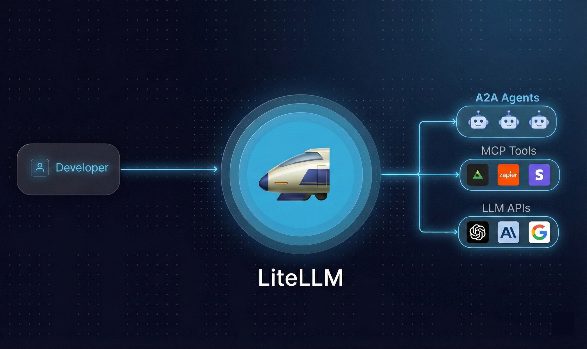
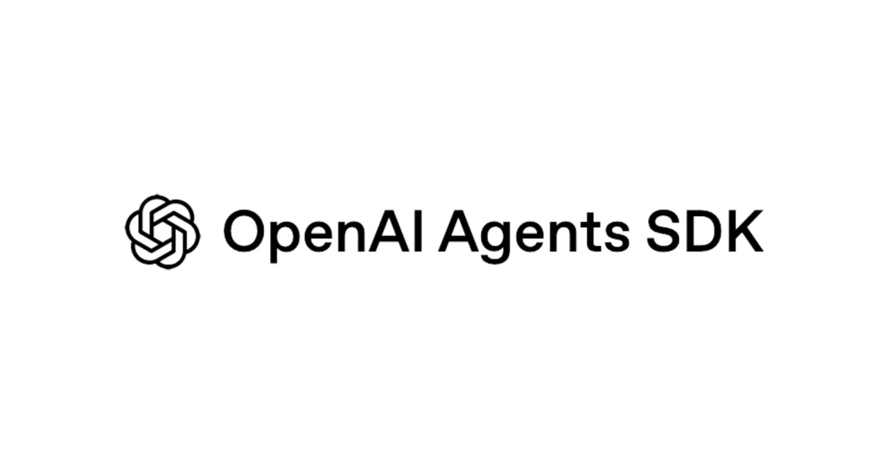
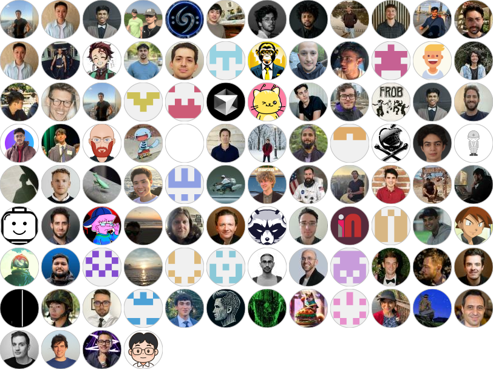

<h1 align="center">
        🚅 LiteLLM
    </h1>
    <p align="center">
        <p align="center">LiteLLM AI Gateway
        </p>
        <p align="center">面向 100+ LLM 的开源 AI Gateway。支持自托管。企业就绪。以 OpenAI 格式调用任意 LLM。</p>
        <p align="center">
        <a href="https://render.com/deploy?repo=https://github.com/BerriAI/litellm" target="_blank" rel="nofollow"></a>
        <a href="https://railway.com/deploy/RhvhdC?referralCode=7mRv9K&utm_medium=integration&utm_source=template&utm_campaign=generic">
          
        </a>
        </p>
    </p>
<h4 align="center"><a href="https://docs.litellm.ai/docs/simple_proxy" target="_blank">LiteLLM Proxy Server (AI Gateway)</a> | <a href="https://docs.litellm.ai/docs/enterprise#hosted-litellm-proxy" target="_blank"> 托管代理</a> | <a href="https://litellm.ai/enterprise"target="_blank">企业版</a> | <a href="https://litellm.ai/" target="_blank">网站</a></h4>
<h4 align="center">
    <a href="https://pypi.org/project/litellm/" target="_blank">
        
    </a>
    <a href="https://github.com/BerriAI/litellm" target="_blank">
        
    </a>
    <a href="https://www.ycombinator.com/companies/berriai">
        
    </a>
    <a href="https://wa.link/huol9n">
        
    </a>
    <a href="https://discord.gg/wuPM9dRgDw">
        
    </a>
    <a href="https://www.litellm.ai/support">
        
    </a>
    <a href="https://codspeed.io/BerriAI/litellm?utm_source=badge">
        
    </a>
</h4>



## LiteLLM 适用场景

<details open>
<summary><b>LLM</b> - 调用 100+ LLM（Python SDK + AI Gateway）</summary>

[**所有支持的端点**](https://docs.litellm.ai/docs/supported_endpoints) - `/chat/completions`、`/responses`、`/embeddings`、`/images`、`/audio`、`/batches`、`/rerank`、`/a2a`、`/messages` 等。

### Python SDK

```shell
pip install litellm
```

```python
from litellm import completion
import os

os.environ["OPENAI_API_KEY"] = "your-openai-key"
os.environ["ANTHROPIC_API_KEY"] = "your-anthropic-key"

# OpenAI
response = completion(model="openai/gpt-4o", messages=[{"role": "user", "content": "Hello!"}])

# Anthropic  
response = completion(model="anthropic/claude-sonnet-4-20250514", messages=[{"role": "user", "content": "Hello!"}])
```

### AI Gateway（Proxy Server）

[**入门教程 - 端到端指南**](https://docs.litellm.ai/docs/proxy/docker_quick_start) - 设置虚拟密钥，发起你的第一个请求

```shell
pip install 'litellm[proxy]'
litellm --model gpt-4o
```

```python
import openai

client = openai.OpenAI(api_key="anything", base_url="http://0.0.0.0:4000")
response = client.chat.completions.create(
    model="gpt-4o",
    messages=[{"role": "user", "content": "Hello!"}]
)
```

[**文档：LLM 提供商**](https://docs.litellm.ai/docs/providers)

</details>

<details>
<summary><b>智能体</b> - 调用 A2A 智能体（Python SDK + AI Gateway）</summary>

[**支持的提供商**](https://docs.litellm.ai/docs/a2a#add-a2a-agents) - LangGraph、Vertex AI Agent Engine、Azure AI Foundry、Bedrock AgentCore、Pydantic AI

### Python SDK - A2A 协议

```python
from litellm.a2a_protocol import A2AClient
from a2a.types import SendMessageRequest, MessageSendParams
from uuid import uuid4

client = A2AClient(base_url="http://localhost:10001")

request = SendMessageRequest(
    id=str(uuid4()),
    params=MessageSendParams(
        message={
            "role": "user",
            "parts": [{"kind": "text", "text": "Hello!"}],
            "messageId": uuid4().hex,
        }
    )
)
response = await client.send_message(request)
```

### AI Gateway（Proxy Server）

**步骤 1.** [将你的智能体添加到 AI Gateway](https://docs.litellm.ai/docs/a2a#adding-your-agent)

**步骤 2.** 通过 A2A SDK 调用智能体

```python
from a2a.client import A2ACardResolver, A2AClient
from a2a.types import MessageSendParams, SendMessageRequest
from uuid import uuid4
import httpx

base_url = "http://localhost:4000/a2a/my-agent"  # LiteLLM proxy + 智能体名称
headers = {"Authorization": "Bearer sk-1234"}    # LiteLLM 虚拟密钥

async with httpx.AsyncClient(headers=headers) as httpx_client:
    resolver = A2ACardResolver(httpx_client=httpx_client, base_url=base_url)
    agent_card = await resolver.get_agent_card()
    client = A2AClient(httpx_client=httpx_client, agent_card=agent_card)

    request = SendMessageRequest(
        id=str(uuid4()),
        params=MessageSendParams(
            message={
                "role": "user",
                "parts": [{"kind": "text", "text": "Hello!"}],
                "messageId": uuid4().hex,
            }
        )
    )
    response = await client.send_message(request)
```

[**文档：A2A 智能体网关**](https://docs.litellm.ai/docs/a2a)

</details>

<details>
<summary><b>MCP 工具</b> - 将 MCP 服务器连接到任意 LLM（Python SDK + AI Gateway）</summary>

### Python SDK - MCP Bridge

```python
from mcp import ClientSession, StdioServerParameters
from mcp.client.stdio import stdio_client
from litellm import experimental_mcp_client
import litellm

server_params = StdioServerParameters(command="python", args=["mcp_server.py"])

async with stdio_client(server_params) as (read, write):
    async with ClientSession(read, write) as session:
        await session.initialize()

        # 以 OpenAI 格式加载 MCP 工具
        tools = await experimental_mcp_client.load_mcp_tools(session=session, format="openai")

        # 搭配任意 LiteLLM 模型使用
        response = await litellm.acompletion(
            model="gpt-4o",
            messages=[{"role": "user", "content": "What's 3 + 5?"}],
            tools=tools
        )
```

### AI Gateway - MCP Gateway

**步骤 1.** [将你的 MCP 服务器添加到 AI Gateway](https://docs.litellm.ai/docs/mcp#adding-your-mcp)

**步骤 2.** 通过 `/chat/completions` 调用 MCP 工具

```bash
curl -X POST 'http://0.0.0.0:4000/v1/chat/completions' \
  -H 'Authorization: Bearer sk-1234' \
  -H 'Content-Type: application/json' \
  -d '{
    "model": "gpt-4o",
    "messages": [{"role": "user", "content": "Summarize the latest open PR"}],
    "tools": [{
      "type": "mcp",
      "server_url": "litellm_proxy/mcp/github",
      "server_label": "github_mcp",
      "require_approval": "never"
    }]
  }'
```

### 搭配 Cursor IDE 使用

```json
{
  "mcpServers": {
    "LiteLLM": {
      "url": "http://localhost:4000/mcp/",
      "headers": {
        "x-litellm-api-key": "Bearer sk-1234"
      }
    }
  }
}
```

[**文档：MCP Gateway**](https://docs.litellm.ai/docs/mcp)

</details>

---

## 如何使用 LiteLLM

你可以通过 Proxy Server 或 Python SDK 来使用 LiteLLM。两者都提供统一的接口来访问多个 LLM（100+ LLM）。请选择最适合你需求的方案：

<table style={{width: '100%', tableLayout: 'fixed'}}>
<thead>
<tr>
<th style={{width: '14%'}}></th>
<th style={{width: '43%'}}><strong><a href="https://docs.litellm.ai/docs/simple_proxy">LiteLLM AI Gateway</a></strong></th>
<th style={{width: '43%'}}><strong><a href="https://docs.litellm.ai/docs/">LiteLLM Python SDK</a></strong></th>
</tr>
</thead>
<tbody>
<tr>
<td style={{width: '14%'}}><strong>适用场景</strong></td>
<td style={{width: '43%'}}>访问多个 LLM 的中心化服务（LLM Gateway）</td>
<td style={{width: '43%'}}>直接在 Python 代码中使用 LiteLLM</td>
</tr>
<tr>
<td style={{width: '14%'}}><strong>目标用户</strong></td>
<td style={{width: '43%'}}>生成式 AI 赋能 / ML 平台团队</td>
<td style={{width: '43%'}}>构建 LLM 项目的开发者</td>
</tr>
<tr>
<td style={{width: '14%'}}><strong>核心功能</strong></td>
<td style={{width: '43%'}}>集中式 API 网关，支持认证与授权、按项目/用户的多租户成本追踪与支出管理、按项目自定义（日志记录、安全护栏、缓存）、用于安全访问控制的虚拟密钥、用于监控和管理的管理员面板 UI</td>
<td style={{width: '43%'}}>直接在代码库中集成 Python 库、跨多个部署（如 Azure/OpenAI）支持重试/降级逻辑的 Router - <a href="https://docs.litellm.ai/docs/routing">Router</a>、应用级负载均衡和成本追踪、兼容 OpenAI 错误格式的异常处理、可观测性回调（Lunary、MLflow、Langfuse 等）</td>
</tr>
</tbody>
</table>

LiteLLM 性能：在 1k RPS 下实现 **8ms P95 延迟**（基准测试见[此处](https://docs.litellm.ai/docs/benchmarks)）

[**查看 LiteLLM Proxy (LLM Gateway) 文档**](https://docs.litellm.ai/docs/simple_proxy) <br>
[**查看支持的 LLM 提供商**](https://docs.litellm.ai/docs/providers)

**稳定版本：** 使用带有 `-stable` 标签的 Docker 镜像。这些镜像在发布前经过了 12 小时的负载测试。[在此了解更多发布周期信息](https://docs.litellm.ai/docs/proxy/release_cycle)

支持更多提供商。如果缺少某个提供商或 LLM 平台，请提交[功能请求](https://github.com/BerriAI/litellm/issues/new?assignees=&labels=enhancement&projects=&template=feature_request.yml&title=%5BFeature%5D%3A+)。

## 开源采用者

<table>
  <tr>
    <td></td>
    <td></td>
    <td></td>
    <td></td>
    <td></td>
    <td><h2>Netflix</h2></td>
    <td></td>
  </tr>
</table>

## 支持的提供商（[网站支持的模型](https://models.litellm.ai/) | [文档](https://docs.litellm.ai/docs/providers)）

| 提供商                                                                            | `/chat/completions` | `/messages` | `/responses` | `/embeddings` | `/image/generations` | `/audio/transcriptions` | `/audio/speech` | `/moderations` | `/batches` | `/rerank` |
|-------------------------------------------------------------------------------------|---------------------|-------------|--------------|---------------|----------------------|-------------------------|-----------------|----------------|-----------|-----------|
| [Abliteration (`abliteration`)](https://docs.litellm.ai/docs/providers/abliteration) | ✅ |  |  |  |  |  |  |  |  |  |
| [AI/ML API (`aiml`)](https://docs.litellm.ai/docs/providers/aiml) | ✅ | ✅ | ✅ | ✅ | ✅ |  |  |  |  |  |
| [AI21 (`ai21`)](https://docs.litellm.ai/docs/providers/ai21) | ✅ | ✅ | ✅ |  |  |  |  |  |  |  |
| [AI21 Chat (`ai21_chat`)](https://docs.litellm.ai/docs/providers/ai21) | ✅ | ✅ | ✅ |  |  |  |  |  |  |  |
| [Aleph Alpha](https://docs.litellm.ai/docs/providers/aleph_alpha) | ✅ | ✅ | ✅ |  |  |  |  |  |  |  |
| [Amazon Nova](https://docs.litellm.ai/docs/providers/amazon_nova) | ✅ | ✅ | ✅ |  |  |  |  |  |  |  |
| [Anthropic (`anthropic`)](https://docs.litellm.ai/docs/providers/anthropic) | ✅ | ✅ | ✅ |  |  |  |  |  | ✅ |  |
| [Anthropic Text (`anthropic_text`)](https://docs.litellm.ai/docs/providers/anthropic) | ✅ | ✅ | ✅ |  |  |  |  |  | ✅ |  |
| [Anyscale](https://docs.litellm.ai/docs/providers/anyscale) | ✅ | ✅ | ✅ |  |  |  |  |  |  |  |
| [AssemblyAI (`assemblyai`)](https://docs.litellm.ai/docs/pass_through/assembly_ai) | ✅ | ✅ | ✅ |  |  | ✅ |  |  |  |  |
| [Auto Router (`auto_router`)](https://docs.litellm.ai/docs/proxy/auto_routing) | ✅ | ✅ | ✅ |  |  |  |  |  |  |  |
| [AWS - Bedrock (`bedrock`)](https://docs.litellm.ai/docs/providers/bedrock) | ✅ | ✅ | ✅ | ✅ |  |  |  |  |  | ✅ |
| [AWS - Sagemaker (`sagemaker`)](https://docs.litellm.ai/docs/providers/aws_sagemaker) | ✅ | ✅ | ✅ | ✅ |  |  |  |  |  |  |
| [Azure (`azure`)](https://docs.litellm.ai/docs/providers/azure) | ✅ | ✅ | ✅ | ✅ | ✅ | ✅ | ✅ | ✅ | ✅ |  |
| [Azure AI (`azure_ai`)](https://docs.litellm.ai/docs/providers/azure_ai) | ✅ | ✅ | ✅ | ✅ | ✅ | ✅ | ✅ | ✅ | ✅ |  |
| [Azure Text (`azure_text`)](https://docs.litellm.ai/docs/providers/azure) | ✅ | ✅ | ✅ |  |  | ✅ | ✅ | ✅ | ✅ |  |
| [Baseten (`baseten`)](https://docs.litellm.ai/docs/providers/baseten) | ✅ | ✅ | ✅ |  |  |  |  |  |  |  |
| [Bytez (`bytez`)](https://docs.litellm.ai/docs/providers/bytez) | ✅ | ✅ | ✅ |  |  |  |  |  |  |  |
| [Cerebras (`cerebras`)](https://docs.litellm.ai/docs/providers/cerebras) | ✅ | ✅ | ✅ |  |  |  |  |  |  |  |
| [Clarifai (`clarifai`)](https://docs.litellm.ai/docs/providers/clarifai) | ✅ | ✅ | ✅ |  |  |  |  |  |  |  |
| [Cloudflare AI Workers (`cloudflare`)](https://docs.litellm.ai/docs/providers/cloudflare_workers) | ✅ | ✅ | ✅ |  |  |  |  |  |  |  |
| [Codestral (`codestral`)](https://docs.litellm.ai/docs/providers/codestral) | ✅ | ✅ | ✅ |  |  |  |  |  |  |  |
| [Cohere (`cohere`)](https://docs.litellm.ai/docs/providers/cohere) | ✅ | ✅ | ✅ | ✅ |  |  |  |  |  | ✅ |
| [Cohere Chat (`cohere_chat`)](https://docs.litellm.ai/docs/providers/cohere) | ✅ | ✅ | ✅ |  |  |  |  |  |  |  |
| [CometAPI (`cometapi`)](https://docs.litellm.ai/docs/providers/cometapi) | ✅ | ✅ | ✅ | ✅ |  |  |  |  |  |  |
| [CompactifAI (`compactifai`)](https://docs.litellm.ai/docs/providers/compactifai) | ✅ | ✅ | ✅ |  |  |  |  |  |  |  |
| [Custom (`custom`)](https://docs.litellm.ai/docs/providers/custom_llm_server) | ✅ | ✅ | ✅ |  |  |  |  |  |  |  |
| [Custom OpenAI (`custom_openai`)](https://docs.litellm.ai/docs/providers/openai_compatible) | ✅ | ✅ | ✅ |  |  | ✅ | ✅ | ✅ | ✅ |  |
| [Dashscope (`dashscope`)](https://docs.litellm.ai/docs/providers/dashscope) | ✅ | ✅ | ✅ |  |  |  |  |  |  |  |
| [Databricks (`databricks`)](https://docs.litellm.ai/docs/providers/databricks) | ✅ | ✅ | ✅ |  |  |  |  |  |  |  |
| [DataRobot (`datarobot`)](https://docs.litellm.ai/docs/providers/datarobot) | ✅ | ✅ | ✅ |  |  |  |  |  |  |  |
| [Deepgram (`deepgram`)](https://docs.litellm.ai/docs/providers/deepgram) | ✅ | ✅ | ✅ |  |  | ✅ |  |  |  |  |
| [DeepInfra (`deepinfra`)](https://docs.litellm.ai/docs/providers/deepinfra) | ✅ | ✅ | ✅ |  |  |  |  |  |  |  |
| [Deepseek (`deepseek`)](https://docs.litellm.ai/docs/providers/deepseek) | ✅ | ✅ | ✅ |  |  |  |  |  |  |  |
| [ElevenLabs (`elevenlabs`)](https://docs.litellm.ai/docs/providers/elevenlabs) | ✅ | ✅ | ✅ |  |  | ✅ | ✅ |  |  |  |
| [Empower (`empower`)](https://docs.litellm.ai/docs/providers/empower) | ✅ | ✅ | ✅ |  |  |  |  |  |  |  |
| [Fal AI (`fal_ai`)](https://docs.litellm.ai/docs/providers/fal_ai) | ✅ | ✅ | ✅ |  | ✅ |  |  |  |  |  |
| [Featherless AI (`featherless_ai`)](https://docs.litellm.ai/docs/providers/featherless_ai) | ✅ | ✅ | ✅ |  |  |  |  |  |  |  |
| [Fireworks AI (`fireworks_ai`)](https://docs.litellm.ai/docs/providers/fireworks_ai) | ✅ | ✅ | ✅ |  |  |  |  |  |  |  |
| [FriendliAI (`friendliai`)](https://docs.litellm.ai/docs/providers/friendliai) | ✅ | ✅ | ✅ |  |  |  |  |  |  |  |
| [Galadriel (`galadriel`)](https://docs.litellm.ai/docs/providers/galadriel) | ✅ | ✅ | ✅ |  |  |  |  |  |  |  |
| [GitHub Copilot (`github_copilot`)](https://docs.litellm.ai/docs/providers/github_copilot) | ✅ | ✅ | ✅ | ✅ |  |  |  |  |  |  |
| [GitHub Models (`github`)](https://docs.litellm.ai/docs/providers/github) | ✅ | ✅ | ✅ |  |  |  |  |  |  |  |
| [Google - PaLM](https://docs.litellm.ai/docs/providers/palm) | ✅ | ✅ | ✅ |  |  |  |  |  |  |  |
| [Google - Vertex AI (`vertex_ai`)](https://docs.litellm.ai/docs/providers/vertex) | ✅ | ✅ | ✅ | ✅ | ✅ |  |  |  |  |  |
| [Google AI Studio - Gemini (`gemini`)](https://docs.litellm.ai/docs/providers/gemini) | ✅ | ✅ | ✅ |  |  |  |  |  |  |  |
| [GradientAI (`gradient_ai`)](https://docs.litellm.ai/docs/providers/gradient_ai) | ✅ | ✅ | ✅ |  |  |  |  |  |  |  |
| [Groq AI (`groq`)](https://docs.litellm.ai/docs/providers/groq) | ✅ | ✅ | ✅ |  |  |  |  |  |  |  |
| [Heroku (`heroku`)](https://docs.litellm.ai/docs/providers/heroku) | ✅ | ✅ | ✅ |  |  |  |  |  |  |  |
| [Hosted VLLM (`hosted_vllm`)](https://docs.litellm.ai/docs/providers/vllm) | ✅ | ✅ | ✅ |  |  |  |  |  |  |  |
| [Huggingface (`huggingface`)](https://docs.litellm.ai/docs/providers/huggingface) | ✅ | ✅ | ✅ | ✅ |  |  |  |  |  | ✅ |
| [Hyperbolic (`hyperbolic`)](https://docs.litellm.ai/docs/providers/hyperbolic) | ✅ | ✅ | ✅ |  |  |  |  |  |  |  |
| [IBM - Watsonx.ai (`watsonx`)](https://docs.litellm.ai/docs/providers/watsonx) | ✅ | ✅ | ✅ | ✅ |  |  |  |  |  |  |
| [Infinity (`infinity`)](https://docs.litellm.ai/docs/providers/infinity) |  |  |  | ✅ |  |  |  |  |  |  |
| [Jina AI (`jina_ai`)](https://docs.litellm.ai/docs/providers/jina_ai) |  |  |  | ✅ |  |  |  |  |  |  |
| [Lambda AI (`lambda_ai`)](https://docs.litellm.ai/docs/providers/lambda_ai) | ✅ | ✅ | ✅ |  |  |  |  |  |  |  |
| [Lemonade (`lemonade`)](https://docs.litellm.ai/docs/providers/lemonade) | ✅ | ✅ | ✅ |  |  |  |  |  |  |  |
| [LiteLLM Proxy (`litellm_proxy`)](https://docs.litellm.ai/docs/providers/litellm_proxy) | ✅ | ✅ | ✅ | ✅ | ✅ |  |  |  |  |  |
| [Llamafile (`llamafile`)](https://docs.litellm.ai/docs/providers/llamafile) | ✅ | ✅ | ✅ |  |  |  |  |  |  |  |
| [LM Studio (`lm_studio`)](https://docs.litellm.ai/docs/providers/lm_studio) | ✅ | ✅ | ✅ |  |  |  |  |  |  |  |
| [Maritalk (`maritalk`)](https://docs.litellm.ai/docs/providers/maritalk) | ✅ | ✅ | ✅ |  |  |  |  |  |  |  |
| [Meta - Llama API (`meta_llama`)](https://docs.litellm.ai/docs/providers/meta_llama) | ✅ | ✅ | ✅ |  |  |  |  |  |  |  |
| [Mistral AI API (`mistral`)](https://docs.litellm.ai/docs/providers/mistral) | ✅ | ✅ | ✅ | ✅ |  |  |  |  |  |  |
| [Moonshot (`moonshot`)](https://docs.litellm.ai/docs/providers/moonshot) | ✅ | ✅ | ✅ |  |  |  |  |  |  |  |
| [Morph (`morph`)](https://docs.litellm.ai/docs/providers/morph) | ✅ | ✅ | ✅ |  |  |  |  |  |  |  |
| [Nebius AI Studio (`nebius`)](https://docs.litellm.ai/docs/providers/nebius) | ✅ | ✅ | ✅ | ✅ |  |  |  |  |  |  |
| [NLP Cloud (`nlp_cloud`)](https://docs.litellm.ai/docs/providers/nlp_cloud) | ✅ | ✅ | ✅ |  |  |  |  |  |  |  |
| [Novita AI (`novita`)](https://novita.ai/models/llm?utm_source=github_litellm&utm_medium=github_readme&utm_campaign=github_link) | ✅ | ✅ | ✅ |  |  |  |  |  |  |  |
| [Nscale (`nscale`)](https://docs.litellm.ai/docs/providers/nscale) | ✅ | ✅ | ✅ |  |  |  |  |  |  |  |
| [Nvidia NIM (`nvidia_nim`)](https://docs.litellm.ai/docs/providers/nvidia_nim) | ✅ | ✅ | ✅ |  |  |  |  |  |  |  |
| [OCI (`oci`)](https://docs.litellm.ai/docs/providers/oci) | ✅ | ✅ | ✅ |  |  |  |  |  |  |  |
| [Ollama (`ollama`)](https://docs.litellm.ai/docs/providers/ollama) | ✅ | ✅ | ✅ | ✅ |  |  |  |  |  |  |
| [Ollama Chat (`ollama_chat`)](https://docs.litellm.ai/docs/providers/ollama) | ✅ | ✅ | ✅ |  |  |  |  |  |  |  |
| [Oobabooga (`oobabooga`)](https://docs.litellm.ai/docs/providers/openai_compatible) | ✅ | ✅ | ✅ |  |  | ✅ | ✅ | ✅ | ✅ |  |
| [OpenAI (`openai`)](https://docs.litellm.ai/docs/providers/openai) | ✅ | ✅ | ✅ | ✅ | ✅ | ✅ | ✅ | ✅ | ✅ |  |
| [OpenAI-like (`openai_like`)](https://docs.litellm.ai/docs/providers/openai_compatible) |  |  |  | ✅ |  |  |  |  |  |  |
| [OpenRouter (`openrouter`)](https://docs.litellm.ai/docs/providers/openrouter) | ✅ | ✅ | ✅ |  |  |  |  |  |  |  |
| [OVHCloud AI Endpoints (`ovhcloud`)](https://docs.litellm.ai/docs/providers/ovhcloud) | ✅ | ✅ | ✅ |  |  |  |  |  |  |  |
| [Perplexity AI (`perplexity`)](https://docs.litellm.ai/docs/providers/perplexity) | ✅ | ✅ | ✅ |  |  |  |  |  |  |  |
| [Petals (`petals`)](https://docs.litellm.ai/docs/providers/petals) | ✅ | ✅ | ✅ |  |  |  |  |  |  |  |
| [Predibase (`predibase`)](https://docs.litellm.ai/docs/providers/predibase) | ✅ | ✅ | ✅ |  |  |  |  |  |  |  |
| [Recraft (`recraft`)](https://docs.litellm.ai/docs/providers/recraft) |  |  |  |  | ✅ |  |  |  |  |  |
| [Replicate (`replicate`)](https://docs.litellm.ai/docs/providers/replicate) | ✅ | ✅ | ✅ |  |  |  |  |  |  |  |
| [Sagemaker Chat (`sagemaker_chat`)](https://docs.litellm.ai/docs/providers/aws_sagemaker) | ✅ | ✅ | ✅ |  |  |  |  |  |  |  |
| [Sambanova (`sambanova`)](https://docs.litellm.ai/docs/providers/sambanova) | ✅ | ✅ | ✅ |  |  |  |  |  |  |  |
| [Snowflake (`snowflake`)](https://docs.litellm.ai/docs/providers/snowflake) | ✅ | ✅ | ✅ |  |  |  |  |  |  |  |
| [Text Completion Codestral (`text-completion-codestral`)](https://docs.litellm.ai/docs/providers/codestral) | ✅ | ✅ | ✅ |  |  |  |  |  |  |  |
| [Text Completion OpenAI (`text-completion-openai`)](https://docs.litellm.ai/docs/providers/text_completion_openai) | ✅ | ✅ | ✅ |  |  | ✅ | ✅ | ✅ | ✅ |  |
| [Together AI (`together_ai`)](https://docs.litellm.ai/docs/providers/togetherai) | ✅ | ✅ | ✅ |  |  |  |  |  |  |  |
| [Topaz (`topaz`)](https://docs.litellm.ai/docs/providers/topaz) | ✅ | ✅ | ✅ |  |  |  |  |  |  |  |
| [Triton (`triton`)](https://docs.litellm.ai/docs/providers/triton-inference-server) | ✅ | ✅ | ✅ |  |  |  |  |  |  |  |
| [V0 (`v0`)](https://docs.litellm.ai/docs/providers/v0) | ✅ | ✅ | ✅ |  |  |  |  |  |  |  |
| [Vercel AI Gateway (`vercel_ai_gateway`)](https://docs.litellm.ai/docs/providers/vercel_ai_gateway) | ✅ | ✅ | ✅ |  |  |  |  |  |  |  |
| [VLLM (`vllm`)](https://docs.litellm.ai/docs/providers/vllm) | ✅ | ✅ | ✅ |  |  |  |  |  |  |  |
| [Volcengine (`volcengine`)](https://docs.litellm.ai/docs/providers/volcano) | ✅ | ✅ | ✅ |  |  |  |  |  |  |  |
| [Voyage AI (`voyage`)](https://docs.litellm.ai/docs/providers/voyage) |  |  |  | ✅ |  |  |  |  |  |  |
| [WandB Inference (`wandb`)](https://docs.litellm.ai/docs/providers/wandb_inference) | ✅ | ✅ | ✅ |  |  |  |  |  |  |  |
| [Watsonx Text (`watsonx_text`)](https://docs.litellm.ai/docs/providers/watsonx) | ✅ | ✅ | ✅ |  |  |  |  |  |  |  |
| [xAI (`xai`)](https://docs.litellm.ai/docs/providers/xai) | ✅ | ✅ | ✅ |  |  |  |  |  |  |  |
| [Xinference (`xinference`)](https://docs.litellm.ai/docs/providers/xinference) |  |  |  | ✅ |  |  |  |  |  |  |

[**阅读文档**](https://docs.litellm.ai/docs/)

## 以开发者模式运行
### 服务
1. 在根目录设置 .env 文件
2. 运行依赖服务 `docker-compose up db prometheus`

### 后端
1. （在根目录下）创建虚拟环境 `python -m venv .venv`
2. 激活虚拟环境 `source .venv/bin/activate`
3. 安装依赖 `pip install -e ".[all]"`
4. `pip install prisma`
5. `prisma generate`
6. 启动代理后端 `python litellm/proxy/proxy_cli.py`

### 前端
1. 进入 `ui/litellm-dashboard` 目录
2. 安装依赖 `npm install`
3. 运行 `npm run dev` 启动面板

# 企业版
面向需要更强安全性、用户管理和专业支持的公司

[获取企业许可证](https://litellm.ai/enterprise)
[与创始人交谈](https://enterprise.litellm.ai/demo)

包含以下内容：
- ✅ **[LiteLLM 商业许可证](https://docs.litellm.ai/docs/proxy/enterprise)下的功能：**
- ✅ **功能优先级排序**
- ✅ **自定义集成**
- ✅ **专业支持 - 专属 Discord + Slack**
- ✅ **自定义 SLA**
- ✅ **通过单点登录实现安全访问**

# 参与贡献

我们欢迎对 LiteLLM 的贡献！无论是修复 Bug、添加功能还是改进文档，我们都非常感谢你的帮助。

## 贡献者快速入门

需要先安装 poetry。

```bash
git clone https://github.com/BerriAI/litellm.git
cd litellm
make install-dev    # 安装开发依赖
make format         # 格式化代码
make lint           # 运行所有 lint 检查
make test-unit      # 运行单元测试
make format-check   # 仅检查格式
```

详细的贡献指南请参见 [CONTRIBUTING.md](CONTRIBUTING.md)。

## 代码质量 / Lint

LiteLLM 遵循 [Google Python 风格指南](https://google.github.io/styleguide/pyguide.html)。

我们的自动化检查包括：
- **Black** 用于代码格式化
- **Ruff** 用于 lint 和代码质量
- **MyPy** 用于类型检查
- **循环导入检测**
- **导入安全检查**

所有这些检查必须通过后，你的 PR 才能被合并。

# 支持 / 与创始人交流

- [预约演示 👋](https://calendly.com/d/4mp-gd3-k5k/berriai-1-1-onboarding-litellm-hosted-version)
- [社区 Discord 💭](https://discord.gg/wuPM9dRgDw)
- [社区 Slack 💭](https://www.litellm.ai/support)
- 我们的邮箱 ✉️ ishaan@berri.ai / krrish@berri.ai

# 为什么构建 LiteLLM

- **对简洁性的追求**：我们在管理与转换 Azure、OpenAI 和 Cohere 之间的调用时，代码变得极其复杂。

# 贡献者

<!-- ALL-CONTRIBUTORS-LIST:START - Do not remove or modify this section -->
<!-- prettier-ignore-start -->
<!-- markdownlint-disable -->

<!-- markdownlint-restore -->
<!-- prettier-ignore-end -->

<!-- ALL-CONTRIBUTORS-LIST:END -->

<a href="https://github.com/BerriAI/litellm/graphs/contributors">
  
</a>
