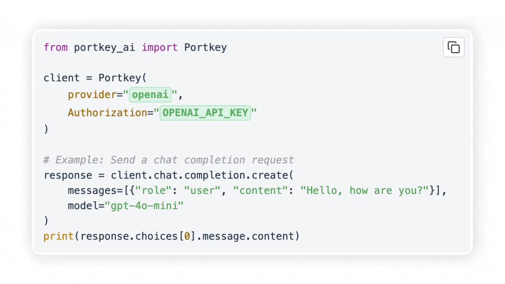
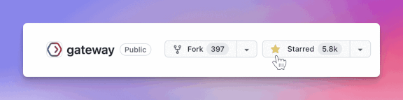
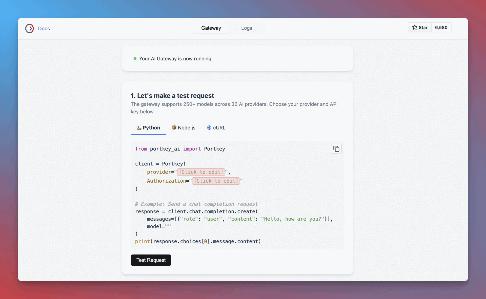
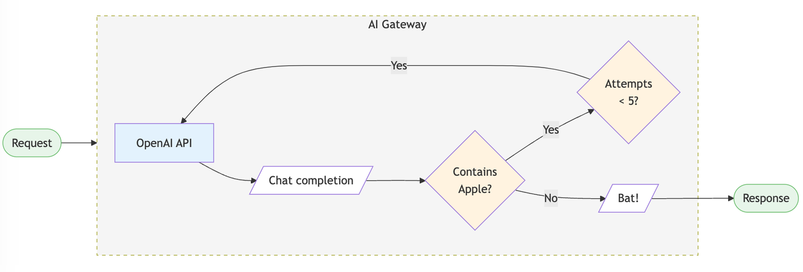
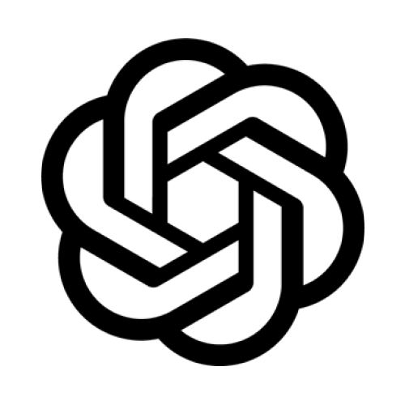

<p align="right">
   <strong>English</strong> | <a href="./.github/README.cn.md">中文</a> | <a href="./.github/README.jp.md">日本語</a>
</p>

> [!IMPORTANT]
> :rocket: Gateway 2.0（预发布版）Portkey 的核心企业级网关正在通过 2.0 版本合并到开源中。你可以[在此](https://github.com/portkey-ai/gateway/tree/2.0.0)试用预发布分支。
> 请在我们的 [**A 轮融资公告**](https://portkey.wiki/rohit-a)中了解 Portkey 的下一步计划。

<div align="center">

🆕 **[Portkey Models](https://github.com/Portkey-AI/models)** - 覆盖 40+ 提供商的 2,300+ 模型的开源 LLM 定价数据库。[探索 →](https://portkey.ai/models)

# AI Gateway
#### 通过 1 个快速友好的 API 路由到 250+ LLM



[文档](https://portkey.wiki/gh-1) | [企业版](https://portkey.wiki/gh-2) | [托管网关](https://portkey.wiki/gh-3) | [更新日志](https://portkey.wiki/gh-4) | [API 参考](https://portkey.wiki/gh-5)

[](./LICENSE)
[](https://portkey.wiki/gh-6)
[](https://portkey.wiki/gh-7)
[](https://portkey.wiki/gh-8)
[](https://portkey.wiki/gh-9)

<a href="https://us-east-1.console.aws.amazon.com/cloudformation/home?region=us-east-1#/stacks/quickcreate?stackName=portkey-gateway&templateURL=https://portkey-gateway-ec2-quicklaunch.s3.us-east-1.amazonaws.com/portkey-gateway-ec2-quicklaunch.template.yaml"></a> [](https://deepwiki.com/Portkey-AI/gateway)
</div>

<br/>

[**AI Gateway**](https://portkey.wiki/gh-10) 专为快速、可靠、安全地路由到 1600+ 语言、视觉、音频和图像模型而设计。它是一个轻量级、开源、企业就绪的解决方案，让你在 2 分钟内即可集成任何语言模型。

- [x] **极速响应**（<1ms 延迟），体积小巧（122kb）
- [x] **久经考验**，每天处理超过 100 亿 token
- [x] **企业就绪**，提供增强的安全性、可扩展性和自定义部署

<br>

#### AI Gateway 能做什么？
- 在 2 分钟内集成任意 LLM - [快速入门](#quickstart-2-mins)
- 通过**[自动重试](https://portkey.wiki/gh-11)**和**[降级](https://portkey.wiki/gh-12)**防止服务中断
- 通过**[负载均衡](https://portkey.wiki/gh-13)**和**[条件路由](https://portkey.wiki/gh-14)**扩展 AI 应用
- 通过**[安全护栏](https://portkey.wiki/gh-15)**保护你的 AI 部署
- 通过**[多模态能力](https://portkey.wiki/gh-16)**超越文本
- 探索**[代理工作流](https://portkey.wiki/gh-17)**集成
- 使用 **[MCP Gateway](https://portkey.ai/docs/product/mcp-gateway)** 管理带有企业认证与可观测性的 MCP 服务器

<br><br>

> [!TIP]
> 给这个仓库加星有助于更多开发者发现 AI Gateway 🙏🏻
>
> 
> 
<br>

<br>

<a id="quickstart-2-mins"></a>

## 快速入门（2 分钟）

### 1. 设置你的 AI Gateway

```bash
# 在本地运行网关（需要 Node.js 和 npm）
npx @portkey-ai/gateway
```
> Gateway 运行在 `http://localhost:8787/v1`
> 
> Gateway 控制台运行在 `http://localhost:8787/public/`

<sup>
部署指南：
&nbsp; <a href="https://portkey.wiki/gh-18"> Portkey Cloud（推荐）</a>
&nbsp; <a href="./docs/installation-deployments.md#docker"> Docker</a>
&nbsp; <a href="./docs/installation-deployments.md#nodejs-server"> Node.js</a>
&nbsp; <a href="./docs/installation-deployments.md#cloudflare-workers"> Cloudflare</a>
&nbsp; <a href="./docs/installation-deployments.md#replit"> Replit</a>
&nbsp; <a href="./docs/installation-deployments.md"> 更多...</a>

</sup>

### 2. 发起你的第一个请求

<!-- <details open>
<summary>Python 示例</summary> -->
```python
# pip install -qU portkey-ai

from portkey_ai import Portkey

# 兼容 OpenAI 的客户端
client = Portkey(
    provider="openai", # 或 'anthropic'、'bedrock'、'groq' 等
    Authorization="sk-***" # 提供商 API 密钥
)

# 通过你的 AI Gateway 发起请求
client.chat.completions.create(
    messages=[{"role": "user", "content": "What's the weather like?"}],
    model="gpt-4o-mini"
)
```

<sup>支持的库：
&nbsp; [ JS](https://portkey.wiki/gh-19)
&nbsp; [ Python](https://portkey.wiki/gh-20)
&nbsp; [ REST](https://portkey.sh/gh-84)
&nbsp; [ OpenAI SDKs](https://portkey.wiki/gh-21)
&nbsp; [ Langchain](https://portkey.wiki/gh-22)
&nbsp; [LlamaIndex](https://portkey.wiki/gh-23)
&nbsp; [Autogen](https://portkey.wiki/gh-24)
&nbsp; [CrewAI](https://portkey.wiki/gh-25)
&nbsp; [更多..](https://portkey.wiki/gh-26)
</sup>

在 Gateway 控制台（`http://localhost:8787/public/`）中，你可以在一个地方查看所有本地日志。



### 3. 路由与安全护栏
LLM 网关中的 `Configs` 允许你创建路由规则、增加可靠性并设置安全护栏。
```python
config = {
  "retry": {"attempts": 5},

  "output_guardrails": [{
    "default.contains": {"operator": "none", "words": ["Apple"]},
    "deny": True
  }]
}

# 将配置附加到客户端
client = client.with_options(config=config)

client.chat.completions.create(
    model="gpt-4o-mini",
    messages=[{"role": "user", "content": "Reply randomly with Apple or Bat"}]
)

# 这将始终返回 "Bat"，因为安全护栏会拒绝所有包含 "Apple" 的回复。重试配置将在放弃前重试 5 次。
```
<div align="center">

</div>

你可以通过 AI Gateway 中的配置实现更多功能。[查看示例 →](https://portkey.wiki/gh-27)

<br/>

### 企业版（私有部署）

<sup>

[ AWS](https://portkey.wiki/gh-28)
&nbsp; [ Azure](https://portkey.wiki/gh-29)
&nbsp; [ GCP](https://portkey.wiki/gh-30)
&nbsp; [ OpenShift](https://portkey.wiki/gh-31)
&nbsp; [ Kubernetes](https://portkey.wiki/gh-85)

</sup>

LLM Gateway 的[企业版](https://portkey.wiki/gh-86)提供开箱即用的高级**组织管理**、**治理**、**安全**等功能。[查看功能对比 →](https://portkey.wiki/gh-32)

支持平台的企业部署架构可在此查看 - [**企业私有云部署**](https://portkey.ai/docs/self-hosting/hybrid-deployments/architecture)

<a href="https://portkey.sh/demo-13"></a><br/>

<br>

## MCP Gateway

[MCP Gateway](https://portkey.ai/docs/product/mcp-gateway) 提供集中化的控制面，用于管理组织内的 MCP（Model Context Protocol）服务器。

- **认证** — 在网关层提供统一认证。用户只需认证一次；你的 MCP 服务器即可收到已验证的请求
- **访问控制** — 控制哪些团队和用户可以访问哪些服务器和工具。支持即时撤销权限
- **可观测性** — 每次工具调用都记录完整上下文：谁调用了什么、参数、响应、延迟
- **身份转发** — 自动将用户身份（邮箱、团队、角色）转发到 MCP 服务器

兼容 Claude Desktop、Cursor、VS Code 及任何兼容 MCP 的客户端。[开始使用 →](https://portkey.ai/docs/product/mcp-gateway/quickstart)

<br>

## 核心功能
### 可靠路由
- <a href="https://portkey.wiki/gh-37">**降级**</a>：当请求失败时，通过 LLM 网关降级到另一个提供商或模型。你可以指定触发降级的错误类型。提升应用的可靠性。
- <a href="https://portkey.wiki/gh-38">**自动重试**</a>：自动重试失败的请求，最多 5 次。指数退避策略将重试间隔逐步拉长，避免网络过载。
- <a href="https://portkey.wiki/gh-39">**负载均衡**</a>：按权重将 LLM 请求分发到多个 API 密钥或 AI 提供商，确保高可用性和最优性能。
- <a href="https://portkey.wiki/gh-40">**请求超时**</a>：通过设置精细的请求超时来管控 LLM 和延迟，自动终止超过指定时长的请求。
- <a href="https://portkey.wiki/gh-41">**多模态 LLM 网关**</a>：调用来自多个提供商的视觉、音频（文本转语音和语音转文本）及图像生成模型——全部使用熟悉的 OpenAI 签名
- <a href="https://portkey.wiki/gh-42">**实时 API**</a>：通过集成的 WebSocket 服务器调用 OpenAI 推出的实时 API。

### 安全与准确性
- <a href="https://portkey.wiki/gh-88">**安全护栏**</a>：验证你的 LLM 输入和输出是否符合指定检查。从 40+ 预构建安全护栏中选择，确保符合安全和准确性标准。你可以<a href="https://portkey.wiki/gh-43">自带安全护栏</a>或从我们的<a href="https://portkey.wiki/gh-44">众多合作伙伴</a>中选择。
- [**安全密钥管理**](https://portkey.wiki/gh-45)：使用你自己的密钥或即时生成虚拟密钥。
- [**基于角色的访问控制**](https://portkey.wiki/gh-46)：为用户、工作空间和 API 密钥提供精细化的访问控制。
- <a href="https://portkey.wiki/gh-47">**合规与数据隐私**</a>：AI 网关符合 SOC2、HIPAA、GDPR 和 CCPA 标准。

### 成本管理
- [**智能缓存**](https://portkey.wiki/gh-48)：缓存 LLM 响应以降低成本和改善延迟。支持简单缓存和语义缓存*。
- [**使用分析**](https://portkey.wiki/gh-49)：监控和分析你的 AI 和 LLM 使用情况，包括请求量、延迟、成本和错误率。
- [**提供商优化***](https://portkey.wiki/gh-89)：根据使用模式和定价模型自动切换到最具成本效益的提供商。

### 协作与工作流
- <a href="https://portkey.ai/docs/integrations/agents">**代理支持**</a>：无缝集成主流代理框架，构建复杂的 AI 应用。网关可与 [Autogen](https://portkey.wiki/gh-50)、[CrewAI](https://portkey.wiki/gh-51)、[LangChain](https://portkey.wiki/gh-52)、[LlamaIndex](https://portkey.wiki/gh-53)、[Phidata](https://portkey.wiki/gh-54)、[Control Flow](https://portkey.wiki/gh-55) 以及[自定义代理](https://portkey.wiki/gh-56)无缝集成。
- [**提示词模板管理***](https://portkey.wiki/gh-57)：通过统一的提示词 playground 协作创建、管理和版本化你的提示词模板。
<br/><br/>

<sup>
*&nbsp;仅在托管版和企业版中可用
</sup>

<br>

## Portkey Models
覆盖 40+ 提供商的开源 LLM 定价数据库 - Gateway 用于成本追踪。

[GitHub](https://github.com/Portkey-AI/models) | [模型浏览器](https://portkey.ai/models)

<br>

## 实战手册

### ☄️ 热门
- 使用 AI Gateway 调用 [Nvidia NIM](/cookbook/providers/nvidia.ipynb) 的模型
- 使用 Portkey 监控 [CrewAI 代理](/cookbook/monitoring-agents/CrewAI_with_Telemetry.ipynb)！
- 使用 AI Gateway [对比 Top 10 LMSYS 模型](/cookbook/use-cases/LMSYS%20Series/comparing-top10-LMSYS-models-with-Portkey.ipynb)。

### 🚨 最新
* [使用 Nemotron 创建合成数据集](/cookbook/use-cases/Nemotron_GPT_Finetuning_Portkey.ipynb)
* [搭配 Vercel AI SDK 使用 LLM Gateway](/cookbook/integrations/vercel-ai.md)
* [使用 Portkey 的 LLM Gateway 监控 Llama 代理](/cookbook/monitoring-agents/Llama_Agents_with_Telemetry.ipynb)

[查看所有实战手册 →](https://portkey.wiki/gh-58)
<br/><br/>

## 支持的提供商

探索 Gateway 与 [45+ 提供商](https://portkey.wiki/gh-59)和 [8+ 代理框架](https://portkey.wiki/gh-90)的集成。

|                                                                                                                            | 提供商                                                                                      | 支持 | 流式 |
| -------------------------------------------------------------------------------------------------------------------------- | --------------------------------------------------------------------------------------------- | ------- | ------ |
|                                                                               | [OpenAI](https://portkey.wiki/gh-60)                           | ✅       | ✅      |
|                                                                                  | [Azure OpenAI](https://portkey.wiki/gh-61)               | ✅       | ✅      |
|                                                                               | [Anyscale](https://portkey.wiki/gh-62) | ✅       | ✅      |
|                            | [Google Gemini](https://portkey.wiki/gh-63)             | ✅       | ✅      |
|                                                                              | [Anthropic](https://portkey.wiki/gh-64)                     | ✅       | ✅      |
|                                                                                 | [Cohere](https://portkey.wiki/gh-65)                           | ✅       | ✅      |
|  | [Together AI](https://portkey.wiki/gh-66)                 | ✅       | ✅      |
|                                                                  | [Perplexity](https://portkey.wiki/gh-67)                | ✅       | ✅      |
|                                                                | [Mistral](https://portkey.wiki/gh-68)                      | ✅       | ✅      |
|                                                               | [Nomic](https://portkey.wiki/gh-69)                             | ✅       | ✅      |
|                                               | [AI21](https://portkey.wiki/gh-91)                                    | ✅       | ✅      |
|                                                    | [Stability AI](https://portkey.wiki/gh-71)               | ✅       | ✅      |
|                                             | [DeepInfra](https://portkey.sh/gh-92)                               | ✅       | ✅      |
|                                                                   | [Ollama](https://portkey.wiki/gh-72)                           | ✅       | ✅      |
|                                                                          | [Novita AI](https://portkey.wiki/gh-73)                              | ✅       | ✅      | `/chat/completions`, `/completions` |

> [在此查看 200+ 支持模型的完整列表](https://portkey.wiki/gh-74)
<br>

<br>

## 代理
Gateway 与主流代理框架无缝集成。[阅读文档](https://portkey.wiki/gh-75)。

| 框架 | 调用 200+ LLM | 高级路由 | 缓存 | 日志与追踪* | 可观测性* | 提示词管理* |
|------------------------------|--------|-------------|---------|------|---------------|-------------------|
| [Autogen](https://portkey.wiki/gh-93)    | ✅     | ✅          | ✅      | ✅   | ✅            | ✅                |
| [CrewAI](https://portkey.wiki/gh-94)             | ✅     | ✅          | ✅      | ✅   | ✅            | ✅                |
| [LangChain](https://portkey.wiki/gh-95)             | ✅     | ✅          | ✅      | ✅   | ✅            | ✅                |
| [Phidata](https://portkey.wiki/gh-96)             | ✅     | ✅          | ✅      | ✅   | ✅            | ✅                |
| [Llama Index](https://portkey.wiki/gh-97)             | ✅     | ✅          | ✅      | ✅   | ✅            | ✅                |
| [Control Flow](https://portkey.wiki/gh-98) | ✅     | ✅          | ✅      | ✅   | ✅            | ✅                |
| [构建自定义代理](https://portkey.wiki/gh-99) | ✅     | ✅          | ✅      | ✅   | ✅            | ✅                |
|  | [IO Intelligence](https://io.net/intelligence) | ✅ | ✅ |

<br>

*在[托管应用](https://portkey.wiki/gh-76)上可用。详细文档请[点击此处](https://portkey.wiki/gh-100)。

## Gateway 企业版
让你的 AI 应用更<ins>可靠</ins>、更具<ins>前向兼容性</ins>，同时确保完整的<ins>数据安全</ins>和<ins>隐私</ins>。

✅&nbsp; 安全密钥管理 - 用于基于角色的访问控制和追踪 <br>
✅&nbsp; 简单和语义缓存 - 更快响应重复查询并节省成本 <br>
✅&nbsp; 访问控制与入站规则 - 控制哪些 IP 和地理位置可以连接到你的部署 <br>
✅&nbsp; PII 脱敏 - 自动从请求中移除敏感数据，防止意外泄露 <br>
✅&nbsp; SOC2、ISO、HIPAA、GDPR 合规 - 遵循最佳安全实践 <br>
✅&nbsp; 专业支持 - 包括功能优先级排序 <br>

[预约咨询企业部署](https://portkey.sh/demo-13)

<br>

## 参与贡献

最简单的贡献方式是选择带有 `good first issue` 标签的议题 💪。请阅读[贡献指南](/.github/CONTRIBUTING.md)。

报告 Bug？[在此提交](https://portkey.wiki/gh-78) | 功能请求？[在此提交](https://portkey.wiki/gh-78)

### 加入社区入门
参加我们每周五（太平洋时间上午 8 点）的 AI 工程交流：
- 结识其他贡献者和社区成员
- 学习高级 Gateway 功能和实现模式
- 分享你的经验并获得帮助
- 了解最新的开发优先级

[参加下一次会议 →](https://portkey.wiki/gh-101) | [会议记录](https://portkey.wiki/gh-102)

<br>

## 社区

加入我们不断成长的全球社区，获取帮助、分享想法并讨论 AI。

- 查看我们的官方[博客](https://portkey.wiki/gh-78)
- 在 [Discord](https://portkey.wiki/community) 上与我们交流
- 在 [Twitter](https://portkey.wiki/gh-79) 上关注我们
- 在 [LinkedIn](https://portkey.wiki/gh-80) 上联系我们
- 阅读[日文版](./.github/README.jp.md)文档
- 访问我们的 [YouTube](https://portkey.wiki/gh-103) 频道
- 加入我们的[开发者社区](https://portkey.wiki/gh-82)
<!-- - Questions tagged #portkey on [Stack Overflow](https://stackoverflow.com/questions/tagged/portkey) -->


