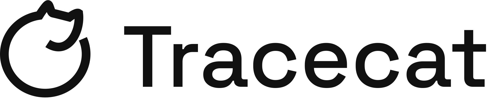

  <picture>
    <source media="(prefers-color-scheme: dark)" srcset="assets/003-banner-dark-0dc47596d4.svg">
    <source media="(prefers-color-scheme: light)" srcset="assets/001-banner-light-93173d5cdb.svg">
    
  </picture>
  

    面向代理的安全自动化平台。
  

   

## 简介

[Tracecat](https://tracecat.com) 是面向团队和 AI 代理的开源安全自动化平台。

- **提示词到自动化**：通过你自己的 agent harness（如 Claude Code、Codex、OpenCode）构建包含代理、工作流、工单和数据表的端到端自动化。
- **代码原生**：将你的 Git 仓库中的自定义 Python 脚本同步到 Tracecat。
- **一体化**：代理、工作流、查找表和工单管理。技术团队所需的一切自动化工具尽在一处。
- **随处自托管**：Docker、Kubernetes、AWS Fargate。

默认使用 [`nsjail`](https://github.com/google/nsjail) 进行沙箱隔离，并基于 [Temporal](https://temporal.io) 运行，确保安全性、可靠性和可扩展性。

## 功能特性

> [!IMPORTANT]
> Tracecat 正在积极开发中。更新前请查看发布[变更日志](https://github.com/TracecatHQ/tracecat/releases)。

### 核心能力

- **代理**：使用提示词、工具、聊天和任何 MCP 服务器（远程 HTTP / OAuth 或通过 `npx` / `uvx` 命令本地运行）构建自定义代理
- **工作流**：低代码构建器，支持复杂控制流（if 条件、循环）和持久化执行（Temporal）
- **工单管理**：使用代理和工作流跟踪、自动化和解决工作事项
- **集成**：通过 HTTP、SMTP、gRPC、OAuth 等方式提供 100+ 预构建的企业工具连接器
- **MCP 服务器**：通过你自己的 agent harness 使用 Tracecat
- **自定义注册表**：将自定义 Python 脚本转换为代理工具和工作流步骤

### 其他开源亮点

- **沙箱隔离**：在 `nsjail` 沙箱或 `pid` 运行时中运行不受信任的代码和代理
- **查找表**：存储和查询结构化数据
- **变量**：跨工作流和代理复用值
- **无 SSO 附加收费**：支持 SAML / OIDC
- **审计日志**：可导出到你的 SIEM

### 企业版

- **细粒度访问控制**：面向人类和代理的 RBAC、ABAC、OAuth 2.0 作用域
- **人机协同**：从统一收件箱、Slack 或邮件中审查和批准敏感的工具调用
- **工作流版本控制**：同步到 GitHub、GitLab、Bitbucket 等
- **指标与监控**：面向工作流、代理和工单

## 技术栈

- 后端：Python + FastAPI、SQLAlchemy、Pydantic、uv
- 前端：Next.js + TypeScript、React Query、Shadcn UI
- 持久化工作流与任务：Temporal
- 沙箱：nsjail
- 数据库：PostgreSQL
- 对象存储：S3 兼容

## 开源版 vs 企业版

本仓库基于 [AGPL-3.0 许可证](https://github.com/TracecatHQ/tracecat/blob/main/LICENSE)提供，以下内容除外：

- `packages/tracecat-ee` 目录采用 Tracecat 付费的企业版（EE）许可证。
- `deployments/k8s` 是一个 git 子模块，采用源码可用的 [PolyForm Shield License](https://polyformproject.org/licenses/shield/1.0.0/)。它包含 Tracecat Helm chart 和 EKS 部署模板，仅供内部使用，其 chart 发布版从该仓库发布到公共 ECR。
- 仓库中任何控制 `ee` 功能的代码

属于上述例外的代码未经许可不得重新分发、出售或以其他方式商业化。

*如果你对 Tracecat 的企业许可证或托管云服务感兴趣，请访问[我们的网站](https://tracecat.com)或[预约会议](https://cal.com/team/tracecat)。*

## 社区

有问题？有反馈？欢迎加入 [Tracecat 社区 Discord](https://discord.gg/H4XZwsYzY4) 与我们交流。

## 贡献者

感谢我们所有出色的贡献者贡献代码、集成、文档和支持。正因为有你们，开源才成为可能。
查看我们的[贡献指南](CONTRIBUTING.md)了解更多信息。

 
 

  **`Tracecat`** 基于 [**AGPL-3.0**](https://github.com/TracecatHQ/tracecat/blob/main/LICENSE) 许可证分发

