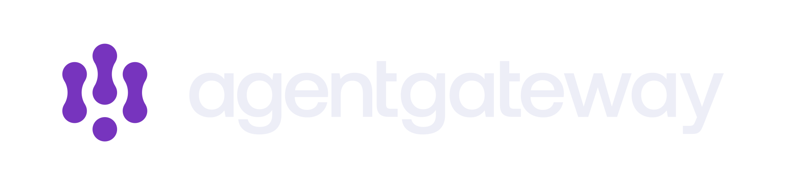
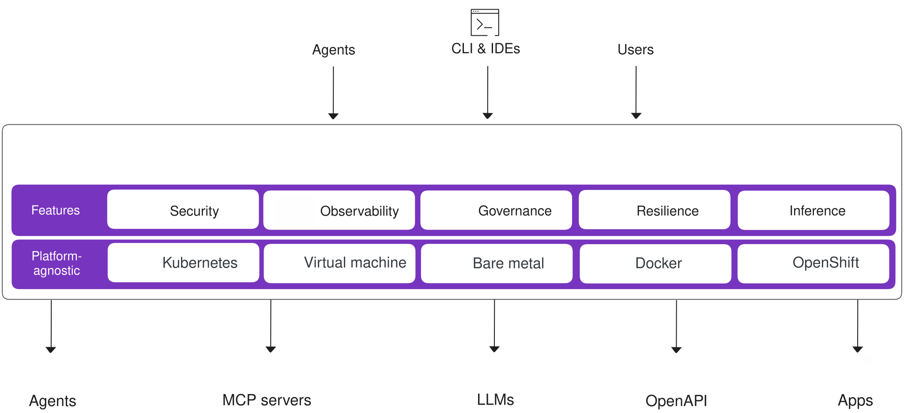
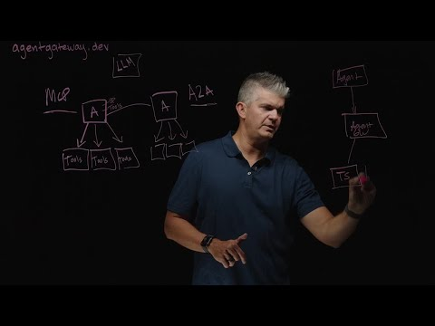
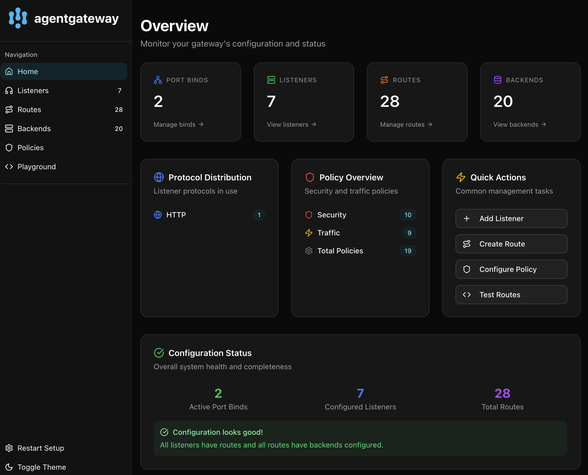
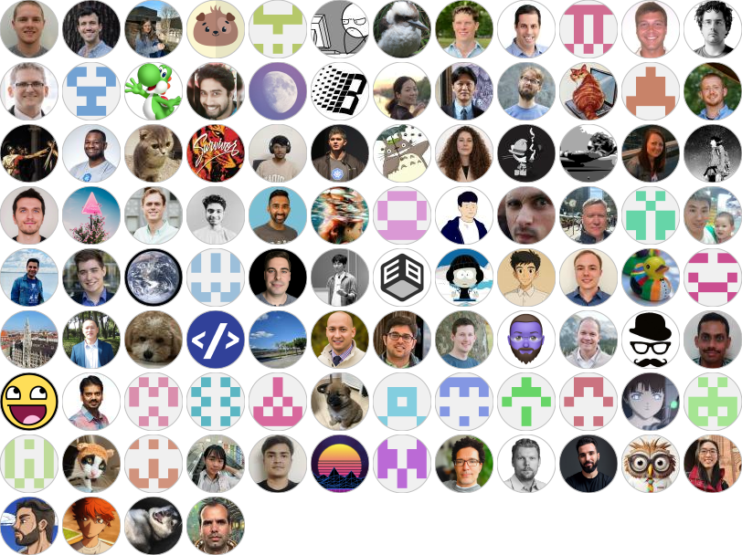
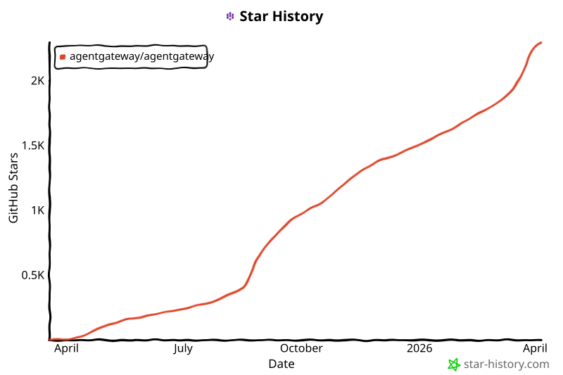

  <picture>
    <source media="(prefers-color-scheme: dark)" srcset="assets/002-banner-light-2ecd9756f8.svg" alt="agentgateway" width="400">
    <source media="(prefers-color-scheme: light)" srcset="assets/008-banner-dark-ac58c5d99c.svg" alt="agentgateway" width="400">
    
  </picture>
  

    
    
    
    
    
    
  

  

    面向 Agentic AI 的<strong>首个完整</strong>连接解决方案。
  

---

**Agentgateway** 是一个基于 AI 原生协议（[MCP](https://modelcontextprotocol.io/introduction) 和 [A2A](https://developers.googleblog.com/en/a2a-a-new-era-of-agent-interoperability/)）构建的开源代理，可为任意框架和环境中的 agent 与 LLM、agent 与工具以及 agent 与 agent 之间的通信提供即插即用的安全性、可观测性和治理能力。

  

  

 

## Agentgateway 介绍视频

## 关键特性

- **LLM Gateway** 
  通过统一的 OpenAI 兼容 API，将流量路由到主流 LLM 提供商（OpenAI、Anthropic、Gemini、Bedrock 等），并提供预算与支出控制、提示增强、负载均衡和故障切换能力。

- **MCP Gateway** 
  通过 MCP 将 LLM 连接到工具和外部数据源，支持工具联邦、stdio/HTTP/SSE/Streamable HTTP 传输、OpenAPI 集成以及 OAuth 身份验证。

- **A2A Gateway** 
  使用 A2A 启用安全的 agent 间通信，支持能力发现、模态协商和任务协作。

- **Inference Routing** 
  借助 Kubernetes Inference Gateway 扩展，将请求智能路由到自托管模型，基于 GPU 利用率、KV 缓存、LoRA 适配器和队列深度做出决策。

- **Guardrails** 
  通过正则表达式、OpenAI Moderation、AWS Bedrock Guardrails、Google Model Armor 和自定义 webhook 实现多层内容过滤。

- **Security & Observability** 
  提供身份验证（JWT、API 密钥、OAuth）、基于 CEL 策略引擎的细粒度 RBAC、限流、TLS 以及 OpenTelemetry 指标、日志和追踪。
 

## 快速开始

- [Standalone Quickstart](https://agentgateway.dev/docs/quickstart) — 在几分钟内开始使用 agentgateway。
- [Kubernetes Quickstart](https://agentgateway.dev/docs/kubernetes/latest) — 使用内置控制器和 Gateway API 部署到 Kubernetes。

## 文档

根据你的部署环境，请查看以下文档：

- [agentgateway.dev/docs](https://agentgateway.dev/docs/)：适用于本地或本地部署（on-prem）等独立部署场景。这些文档对应上游 `agentgateway/agentgateway` GitHub 项目。
- [agentgateway.dev/docs/kubernetes/latest](https://agentgateway.dev/docs/kubernetes/latest)：适用于使用内置 Kubernetes 控制器和 Gateway API 支持的 Kubernetes 部署场景。

Agentgateway 内置了一个 UI，方便你探索 agentgateway 如何实现 agent 与 agent 或 agent 与工具之间的连接：

  

## 贡献

有关如何为 agentgateway 项目做贡献，请参阅 [CONTRIBUTION.md](CONTRIBUTION.md) 文件。

## 社区会议
要加入社区会议，请将 [agentgateway calendar](https://calendar.google.com/calendar/u/0?cid=Y18zZTAzNGE0OTFiMGUyYzU2OWI1Y2ZlOWNmOWM4NjYyZTljNTNjYzVlOTdmMjdkY2I5ZTZmNmM5ZDZhYzRkM2ZmQGdyb3VwLmNhbGVuZGFyLmdvb2dsZS5jb20) 添加到你的 Google 账户。然后，你就可以在该日历中查看活动详情。

社区会议的录像将发布到我们的 [Google Drive](https://drive.google.com/drive/folders/138716fESpxLkbd_KkGrUHa6TD7OA2tHs?usp=sharing)。

## 路线图

`agentgateway` 当前处于积极开发中。如果你希望添加某个尚未提供的功能，请在我们的 [GitHub repo](https://github.com/agentgateway/agentgateway/issues) 中提交 issue。

## 贡献者

感谢所有帮助 agentgateway 变得更好的贡献者。

### Star History

<a href="https://www.star-history.com/#agentgateway/agentgateway&Date">
 <picture>
   <source media="(prefers-color-scheme: dark)" srcset="assets/009-svg-22bff27fb6.svg" />
   <source media="(prefers-color-scheme: light)" srcset="assets/006-svg-801dcf1a48.svg" />
   
 </picture>
</a>

---

    
    
Agentgateway 是 <a href="https://www.linuxfoundation.org/">Linux Foundation</a> 项目。

