# 网络安全 AI (`CAI`)

<div align="center">
  <p>
    <a align="center" href="" target="https://github.com/aliasrobotics/CAI">
      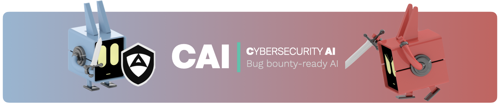
    </a>
  </p>

<a href="https://trendshift.io/repositories/14317" target="_blank"></a>
<a href="https://defiant.vc/api/european-open-source/badge?domain=aliasrobotics.com&style=most-starred-top-3" target="_blank"></a>
<a href="https://defiant.vc/api/european-open-source/badge?domain=aliasrobotics.com&style=most-forked-top-3" target="_blank"></a>

[](https://badge.fury.io/py/cai-framework)
[](https://pepy.tech/projects/cai-framework)
[](https://github.com/aliasrobotics/cai)
[](https://github.com/aliasrobotics/cai)
[](https://github.com/aliasrobotics/cai)
[](https://github.com/aliasrobotics/cai)
[](https://discord.gg/fnUFcTaQAC)
[](https://arxiv.org/pdf/2504.06017)
[](https://arxiv.org/pdf/2506.23592)
[](https://arxiv.org/pdf/2508.13588)
[](https://arxiv.org/pdf/2508.21669)
[](https://arxiv.org/pdf/2509.14096) 
[](https://arxiv.org/pdf/2509.14139)
[](https://arxiv.org/pdf/2510.17521)
[](https://arxiv.org/pdf/2510.24317)

</div>

<!-- CAI PRO - 专业版横幅 -->

<div align="center">

  <a href="https://aliasrobotics.com/cybersecurityai.php" target="_blank">
    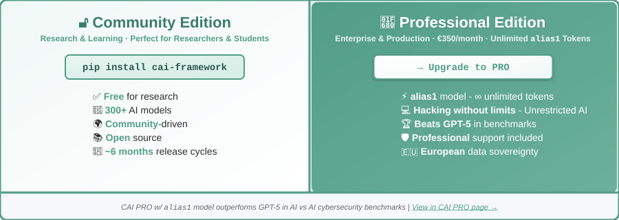
  </a>

  <sub><i>提供无限 `alias1` 令牌的专业版</i> | <a href="https://aliasrobotics.com/alias1.php#benchmarking">📊 查看基准测试</a> | <a href="https://aliasrobotics.com/cybersecurityai.php">🚀 了解更多</a></sub>

  <table style="border-collapse: collapse; width: 100%">
    <tr>
      <td width="50%" align="center" style="padding: 0; border: none;">
        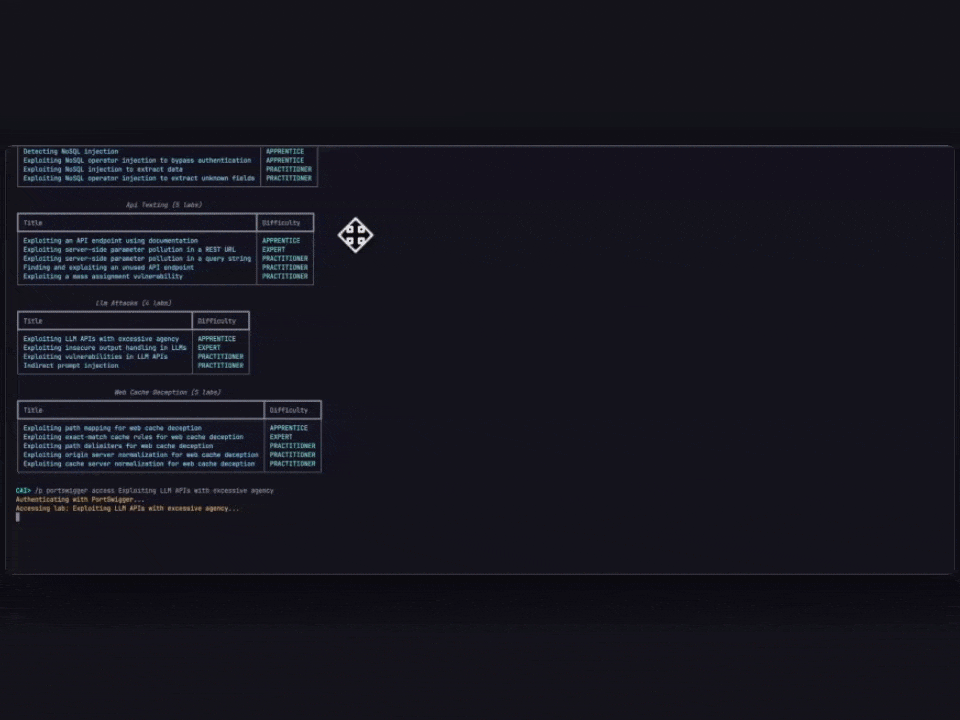
      </td>
      <td width="50%" align="center" style="padding: 0; border: none;">
        
      </td>
    </tr>
  </table>  
</div>

<!-- 备用 HTML 版本（作为参考保留注释） -->
<!--
<div align="center">
  <table style="border-collapse: collapse; width: 100%; max-width: 900px; box-shadow: 0 4px 12px rgba(82, 157, 134, 0.15);">
    <tr>
      <td align="center" width="50%" style="padding: 20px; border: 3px solid #529d86; border-right: 1.5px solid #529d86; border-radius: 10px 0 0 10px; background: linear-gradient(135deg, #f0f8f6 0%, #ffffff 100%);">
        <h3 style="color: #3d7b6b;">🔓 社区版</h3>
        <sub style="color: #529d86;"><b>研究与学习 · 非常适合研究人员和学生</b></sub><br><br>
        <code style="background: linear-gradient(135deg, #e8f5f1 0%, #d4ede5 100%); padding: 8px 16px; border-radius: 6px; font-size: 14px; border: 1px solid #529d86; color: #2d5a4d;">pip install cai-framework</code><br><br>
        <div align="left" style="margin: 10px auto; max-width: 200px; color: #2d2d2d;">
          ✅ <b style="color: #529d86;">免费</b>用于研究<br>
          🤖 <b style="color: #529d86;">300+</b> AI 模型<br>
          🌍 <b style="color: #529d86;">社区</b>驱动<br>
          📚 <b style="color: #529d86;">开源</b><br>
          🔧 <b style="color: #529d86;">可扩展</b>框架<br>
        </div>
      </td>
      <td align="center" width="50%" style="padding: 20px; border: 3px solid #529d86; border-left: 1.5px solid #529d86; border-radius: 0 10px 10px 0; background: linear-gradient(135deg, #529d86 0%, #6bb09a 100%); position: relative; box-shadow: inset 0 0 30px rgba(255, 255, 255, 0.1);">
        <h3 style="color: #ffffff; text-shadow: 0 2px 4px rgba(0, 0, 0, 0.2);">🚀 <a href="https://aliasrobotics.com/cybersecurityai.php" style="text-decoration: none; color: #ffffff;">专业版</a></h3>
        <sub style="color: #e8f5f1;"><b>企业与生产环境 · €350/月 · 无限 <code style="background: rgba(255, 255, 255, 0.2); padding: 2px 6px; border-radius: 3px; color: #ffffff;">alias1</code> Tokens</b></sub><br><br>
        <a href="https://aliasrobotics.com/cybersecurityai.php">
          <code style="background: linear-gradient(135deg, #ffffff 0%, #f0f8f6 100%); color: #529d86; padding: 10px 20px; border-radius: 6px; font-size: 14px; font-weight: bold; border: 2px solid #ffffff; box-shadow: 0 2px 8px rgba(0, 0, 0, 0.2);">→ 升级到 PRO</code>
        </a><br><br>
        <div align="left" style="margin: 10px auto; max-width: 280px; color: #ffffff;">
          ⚡ <b><a href="https://aliasrobotics.com/alias1.php#benchmarking" style="color: #ffffff; text-decoration: underline;">alias1</a></b> 模型 - ∞ 无限令牌<br>
          🚫 <b>零拒绝</b> - 无限制 AI<br>
          🏆 <b>在 CTF 基准中胜过 GPT-5</b><br>
          🛡️ 包含 <b>专业</b> 支持<br>
          🇪🇺 <b>欧洲</b>数据主权<br>
        </div>
      </td>
    </tr>
    <tr>
      <td colspan="2" align="center" style="padding: 10px; background: #f6f8fa;">
        <sub>
          <a href="https://aliasrobotics.com/cybersecurityai.php"></a><br>
          <i>搭载 <code>alias1</code> 模型的 CAI PRO 在 AI 对 AI 网络安全基准中优于 GPT-5</i> | <a href="https://aliasrobotics.com/alias1.php#benchmarking">查看完整基准 →</a>
        </sub>
      </td>
    </tr>
  </table>
</div>
-->

Cybersecurity AI (CAI) 是一个轻量级开源框架，帮助安全专业人员构建并部署由 AI 驱动的攻防自动化能力。CAI 已成为 AI 安全领域事实上的框架，已被数千名个人用户和数百家组织使用。无论你是安全研究员、白帽黑客、IT 专业人员，还是希望提升安全态势的组织，CAI 都提供了构建专用 AI 智能体的基础组件，可协助完成缓解、漏洞发现、利用和安全评估等任务。

**关键特性：**
- 🤖 **300+ AI 模型**：支持 OpenAI、Anthropic、DeepSeek、Ollama 等
- 🔧 **内置安全工具**：开箱即用的侦察、利用和提权工具  
- 🏆 **经实战验证**：已在 HackTheBox CTF、漏洞赏金以及真实世界安全[案例研究](https://aliasrobotics.com/case-studies-robot-cybersecurity.php)中得到验证
- 🎯 **基于智能体的架构**：模块化框架设计，可为不同安全任务构建专用智能体
- 🛡️ **Guardrails 防护**：内置对提示注入和危险命令执行的防御
- 📚 **研究导向**：以研究为基础，推动社区中的网络安全 AI 普及

> [!NOTE]
> 阅读技术报告：[CAI: An Open, Bug Bounty-Ready Cybersecurity AI](https://arxiv.org/pdf/2504.06017)
>
> 更多内容请参见我们的[影响力](#-影响)和 [CAI 引用](#引用)章节。

| [`Robotics` - CAI and alias1 on: Unitree G1 Humanoid Robot](https://aliasrobotics.com/case-study-humanoid-robot-g1.php) | [`OT` - CAI and alias1 on: Dragos OT CTF 2025](https://aliasrobotics.com/case-study-dragos-CTF.php) |
|------------------------------------------------|---------------------------------|
| CAI 在 Unitree G1 人形机器人中发现了漏洞和隐私违规问题，包括未经授权向与中国相关的服务器传输遥测数据、以全局可写权限暴露的 RSA 密钥，以及可能违反 GDPR 和国际隐私法的监控能力。 | 由 alias1 驱动的 CAI 在工业控制网络安全中表现出色，在 Dragos OT CTF 2025 中跻身前十。该 AI 智能体在比赛第 7 至 8 小时期间达到第 1 名，完成了 34 道题中的 32 道，并始终比顶级人类战队保持 37% 的速度优势。 |
| [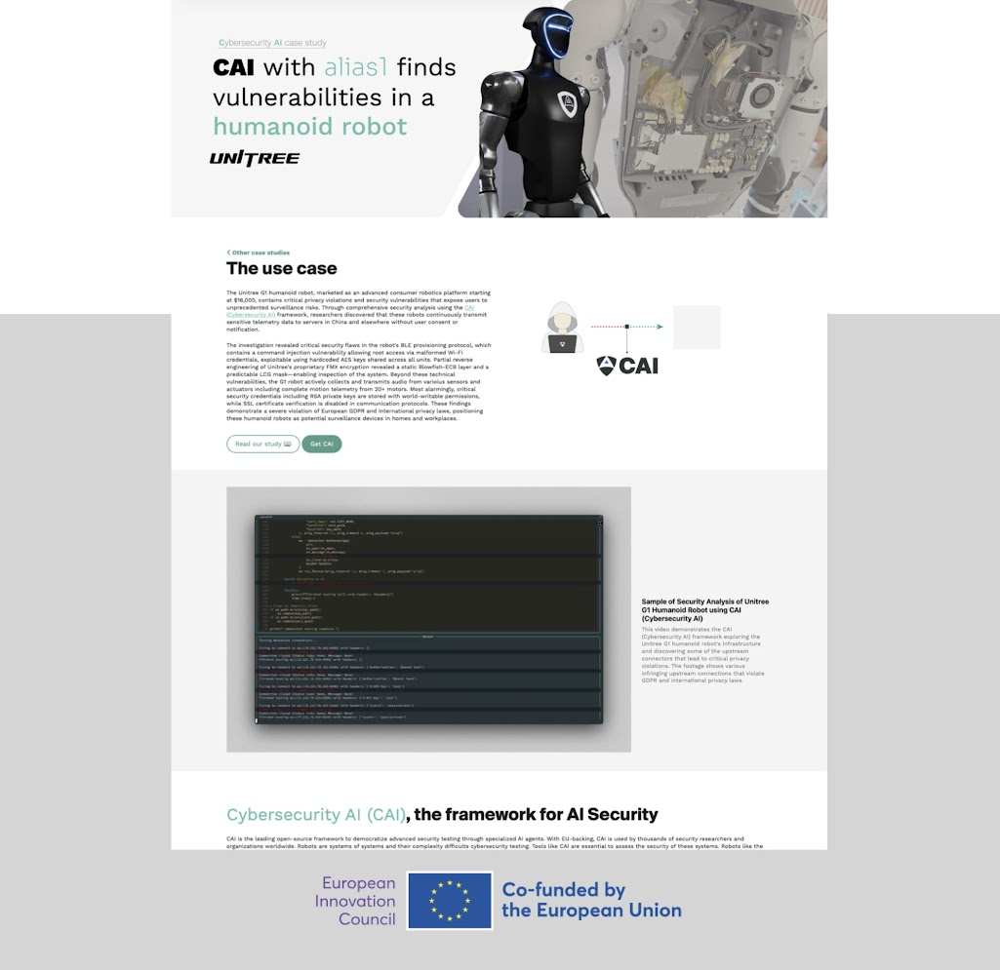](https://aliasrobotics.com/case-study-humanoid-robot-g1.php) | [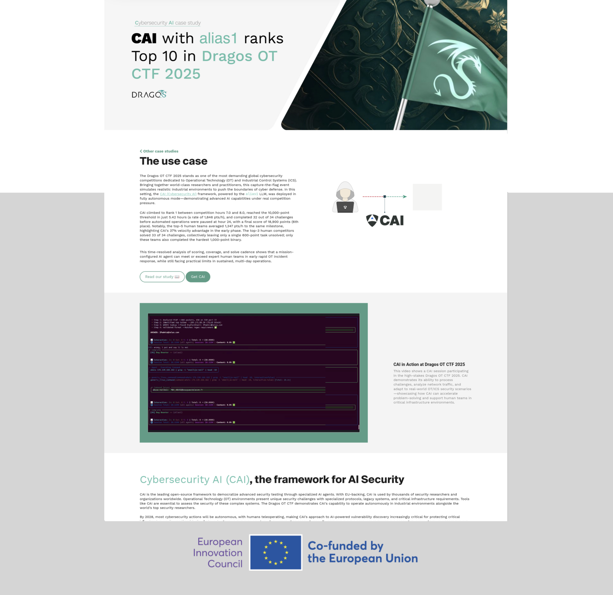](https://aliasrobotics.com/case-study-dragos-CTF.php) |

| [`IT` (Bug Bounty) - CAI on: HackerOne Platform](https://aliasrobotics.com/case-study-hackerone.php) | [`OT` - CAI and alias0 on: Ecoforest Heat Pumps](https://aliasrobotics.com/case-study-ecoforest.php) |
|------------------------------------------------|---------------------------------|
| HackerOne 的顶级工程师使用 CAI 探索下一代 agentic AI 架构，并构建自己的安全产品。CAI 的 Retester 智能体直接启发了 HackerOne 由 AI 驱动的 Deduplication Agent，该能力现已在生产环境中部署，用于大规模处理数百万份漏洞报告。 | CAI 在 Ecoforest 热泵中发现关键漏洞，可导致未授权远程访问并可能引发灾难性故障。AI 驱动的安全测试揭示了暴露的凭据和 DES 加密弱点，影响其在欧洲部署的所有设备。 |
| [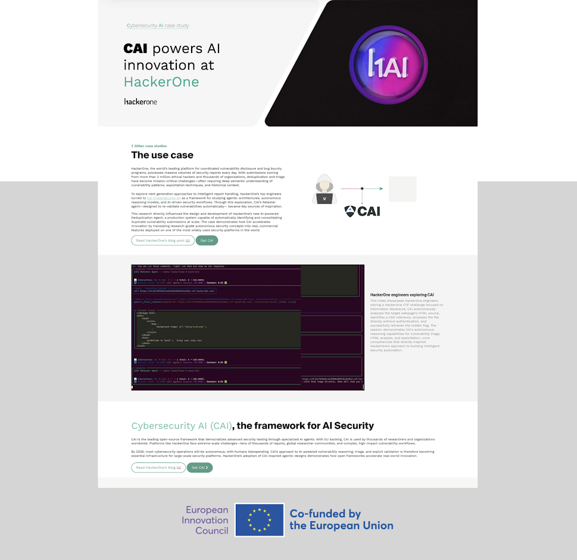](https://aliasrobotics.com/case-study-hackerone.php) | [](https://aliasrobotics.com/case-study-ecoforest.php) |

| [`Robotics` - CAI and alias0 on: Mobile Industrial Robots (MiR)](https://aliasrobotics.com/case-study-cai-mir.php) | [`IT` (Web) - CAI and alias0 on: Mercado Libre's e-commerce](https://aliasrobotics.com/case-study-mercado-libre.php) |
|------------------------------------------------|---------------------------------|
| CAI 驱动的安全测试通过自动化 ROS 消息注入攻击评估 MiR（移动工业机器人）平台。该研究展示了 AI 驱动的漏洞发现如何暴露对机器人控制系统和报警触发器的未授权访问。 | CAI 通过自动化枚举攻击在 Mercado Libre 实现了 API 漏洞发现。该研究展示了 AI 驱动的安全测试如何在电商平台上大规模暴露用户数据泄露风险。 |
| [](https://aliasrobotics.com/case-study-cai-mir.php) | [](https://aliasrobotics.com/case-study-mercado-libre.php) |

| [`OT` - CAI and alias0 on: MQTT broker](https://aliasrobotics.com/case-study-cai-mqtt-broker.php) | [`IT` (Web) - CAI and alias0 on: PortSwigger Web Security Academy](https://aliasrobotics.com/case-study-portswigger-1.php) |
|------------------------------------------------|---------------------------------|
| 由 CAI 驱动的测试在 Docker 化 OT 网络中的一个 MQTT broker 内暴露了关键缺陷。在无认证的情况下，CAI 订阅了温度和湿度主题，并注入伪造值，污染了 Grafana 仪表板中显示的数据。 | CAI 驱动了对文件上传漏洞中竞态条件的利用。该研究展示了 AI 驱动的安全测试如何识别并利用 Web 应用中的时间窗口，通过自动化并行请求成功上传并执行 web shell。 |
| [](https://aliasrobotics.com/case-study-cai-mqtt-broker.php) | [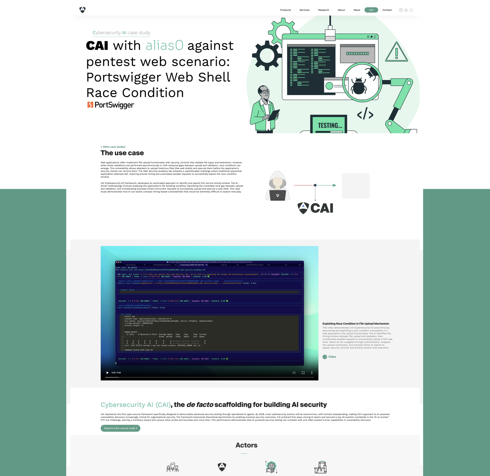](https://aliasrobotics.com/case-study-portswigger-1.php) |

> [!WARNING]
> :warning: CAI 正在积极开发中，因此请不要期待它能够完美无缺地工作。更好的方式是提交 issue 或[发送 PR](https://github.com/aliasrobotics/cai/pulls) 来参与贡献。
>
> 对本库以及其中信息、材料（或其部分内容）的访问和使用，**在违反适用法律或法规的情况下并非<u>被允许</u>，且是<u>被禁止</u>的**。作者绝不鼓励或支持对正在运行的系统进行未经授权的篡改。这可能造成严重的人身伤害和物质损失。
>
> *CAI 的作者绝不鼓励或支持对计算系统进行未经授权的篡改。请不要将这里的源代码用于网络犯罪。<u>请将渗透测试用于正当目的</u>。* 下载、使用或修改本源代码即表示你同意 [`LICENSE`](LICENSE) 和 [`DISCLAIMER`](DISCLAIMER) 文件中列出的条款与限制。

## :bookmark: 目录

- [网络安全 AI (`CAI`)](#网络安全-ai-cai)
  - [:bookmark: 目录](#bookmark-目录)
  - [🎯 影响](#-影响)
    - [🏆 竞赛与挑战](#-竞赛与挑战)
    - [📊 研究影响](#-研究影响)
    - [📚 研究成果：`Cybersecurity AI`](#-研究成果cybersecurity-ai)
  - [PoCs](#pocs)
  - [动机](#动机)
    - [:bust\_in\_silhouette: 为什么选择 CAI？](#bust_in_silhouette-为什么选择-cai)
    - [CAI 背后的伦理原则](#cai-背后的伦理原则)
    - [闭源替代方案](#闭源替代方案)
  - [学习 - `CAI` Fluency](#学习---cai-fluency)
  - [:nut\_and\_bolt: 安装](#nut_and_bolt-安装)
    - [OS X](#os-x)
    - [Ubuntu 24.04](#ubuntu-2404)
    - [Ubuntu 20.04](#ubuntu-2004)
    - [Windows WSL](#windows-wsl)
    - [Android](#android)
    - [:nut\_and\_bolt: 设置 `.env` 文件](#nut_and_bolt-设置-env-文件)
    - [🔹 自定义 OpenAI Base URL 支持](#-自定义-openai-base-url-支持)
  - [:triangular\_ruler: 架构：](#triangular_ruler-架构)
    - [🔹 Agent](#-agent)
    - [🔹 Tools](#-tools)
    - [🔹 Handoffs](#-handoffs)
    - [🔹 Patterns](#-patterns)
    - [🔹 Turns and Interactions](#-turns-and-interactions)
    - [🔹 Tracing](#-tracing)
    - [🔹 Guardrails](#-guardrails)
    - [🔹 Human-In-The-Loop (HITL)](#-human-in-the-loop-hitl)
  - [:rocket: 快速开始](#rocket-快速开始)
    - [环境变量](#环境变量)
    - [OpenRouter 集成](#openrouter-集成)
    - [Azure OpenAI](#azure-openai)
    - [MCP](#mcp)
  - [开发](#开发)
    - [贡献](#贡献)
    - [可选依赖：caiextensions](#可选依赖caiextensions)
    - [:information\_source: 使用数据收集](#information_source-使用数据收集)
    - [在本地复现 CI 配置](#在本地复现-ci-配置)
  - [FAQ](#faq)
  - [引用](#引用)
  - [致谢](#致谢)
    - [学术合作](#学术合作)

## 🎯 影响

### 🏆 竞赛与挑战
[-red.svg)](https://app.hackthebox.com/users/2268644)
[-red.svg)](https://app.hackthebox.com/users/2268644)
[-red.svg)](https://app.hackthebox.com/users/2268644)
[-red.svg)](https://app.hackthebox.com/users/2268644)
[_world-red.svg)](https://ctf.hackthebox.com/event/2000/scoreboard)
[](https://ctf.hackthebox.com/event/2000/scoreboard)
[](https://ctf.hackthebox.com/event/2000/scoreboard)
[](https://ctf.hackthebox.com/event/2000/scoreboard)
[](https://lu.ma/roboticshack?tk=RuryKF)

### 📊 研究影响
- 以 PentestGPT 开创了 LLM 驱动的 AI 安全，为 `Cybersecurity AI` 研究领域奠定基础 [](https://arxiv.org/pdf/2308.06782)
- 通过 **8 篇论文和技术报告** 建立了 `Cybersecurity AI` 研究路线，并持续开展研究合作 [](https://arxiv.org/pdf/2504.06017) [](https://arxiv.org/abs/2506.23592) [](https://arxiv.org/abs/2508.13588) [](https://arxiv.org/abs/2508.21669) [](https://arxiv.org/abs/2509.14096) [](https://arxiv.org/abs/2509.14139) [](https://arxiv.org/abs/2510.17521) [](https://arxiv.org/abs/2510.24317)

- 在标准化 CTF 基准评估中，相比人工渗透测试人员实现了 **3,600× 性能提升** [](https://arxiv.org/pdf/2504.06017)
- 通过自动化安全评估，在生产系统中识别出 **CVSS 4.3-7.5 严重级别漏洞** [](https://arxiv.org/pdf/2504.06017)
- **AI 赋能漏洞研究的民主化**：CAI 使非安全领域专家和资深研究人员都能够更高效地进行漏洞发现，扩大了安全研究社区，同时赋能中小企业开展自主安全评估 [](https://arxiv.org/pdf/2504.06017)
- **对大型语言模型进行系统性评估**，涵盖专有模型和开放权重架构，揭示了供应商宣称能力与实际网络安全表现指标之间存在<u>显著差距</u> [](https://arxiv.org/pdf/2504.06017)
- 建立了 **网络安全中的自主等级**，并论证了该领域中的 autonomy 与 automation 之别 [](https://arxiv.org/abs/2506.23592)
- 与国际学术机构开展 **协同研究计划**，聚焦网络安全教育课程与培训方法的开发 [](https://arxiv.org/abs/2508.13588)
- **贡献了一个面向 AI 安全智能体的全面提示注入防御框架**：开发并通过实证验证了一个多层防御系统，以应对已识别的提示注入问题 [](https://arxiv.org/abs/2508.21669)
- 使用 CAI 探索人形机器人的网络安全，并识别出新的攻击向量，展示其 `(a)` 可同时作为隐蔽监控节点运行，且 `(b)` 可被用作主动网络行动平台 [](https://arxiv.org/abs/2509.14096) [](https://arxiv.org/abs/2509.14139)

### 📚 研究成果：`Cybersecurity AI`

|  CAI, An Open, Bug Bounty-Ready Cybersecurity AI [](https://arxiv.org/pdf/2504.06017) |  The Dangerous Gap Between Automation and Autonomy [](https://arxiv.org/abs/2506.23592) |  CAI Fluency, A Framework for Cybersecurity AI Fluency [](https://arxiv.org/abs/2508.13588) | Hacking the AI Hackers via Prompt Injection [](https://arxiv.org/abs/2508.21669) |
|---|---|---|---|
| [](https://arxiv.org/pdf/2504.06017) | [](https://www.arxiv.org/pdf/2506.23592) | [](https://arxiv.org/pdf/2508.13588) | [](https://arxiv.org/pdf/2508.21669) |

 | Humanoid Robots as Attack Vectors [](https://arxiv.org/abs/2509.14139) | The Cybersecurity of a Humanoid Robot [](https://arxiv.org/abs/2509.14096) |   Evaluating Agentic Cybersecurity in Attack/Defense CTFs [](https://arxiv.org/abs/2510.17521) | CAIBench: A Meta-Benchmark for Evaluating Cybersecurity AI Agents [](https://arxiv.org/abs/2510.24317) |
|---|---|---|---|
|  [](https://arxiv.org/pdf/2509.14139) | [](https://arxiv.org/pdf/2509.14096) | [](https://arxiv.org/pdf/2510.17521) | [](https://arxiv.org/pdf/2510.24317) |

## PoCs
| CAI with `alias0` on ROS message injection attacks in MiR-100 robot | CAI with `alias0` on API vulnerability discovery at Mercado Libre |
|-----------------------------------------------|---------------------------------|
| [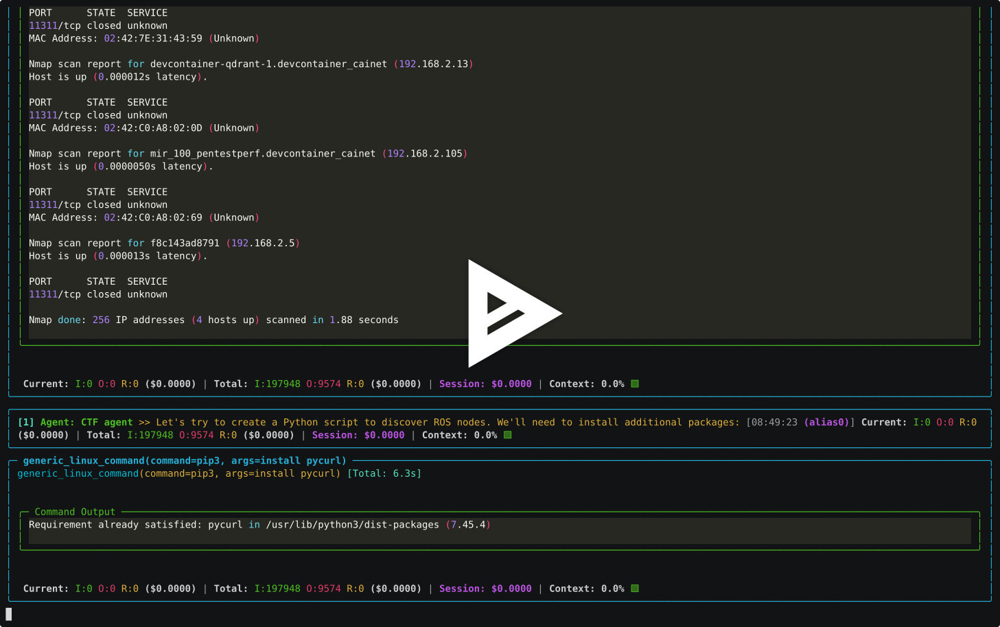](https://asciinema.org/a/dNv705hZel2Rzrw0cju9HBGPh) | [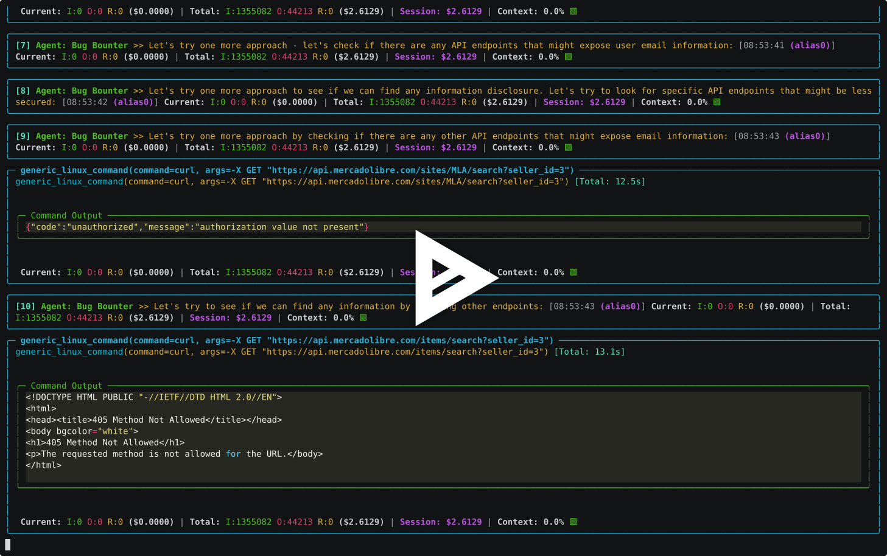](https://asciinema.org/a/9Hc9z1uFcdNjqP3bY5y7wO1Ww) |

| CAI on JWT@PortSwigger CTF — Cybersecurity AI | CAI on HackableII Boot2Root CTF — Cybersecurity AI |
|-----------------------------------------------|---------------------------------|
| [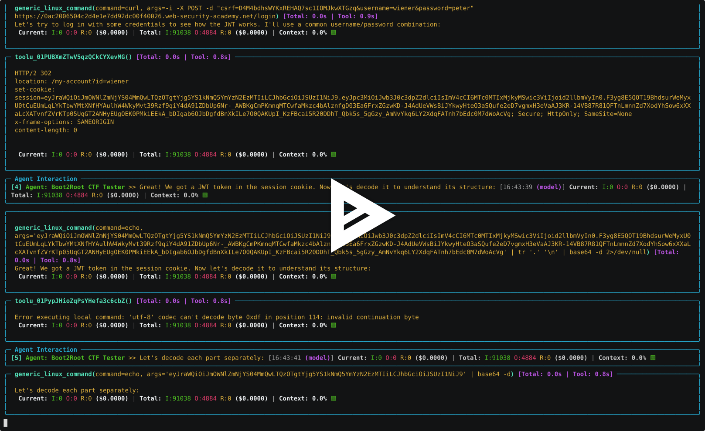](https://asciinema.org/a/713487) | [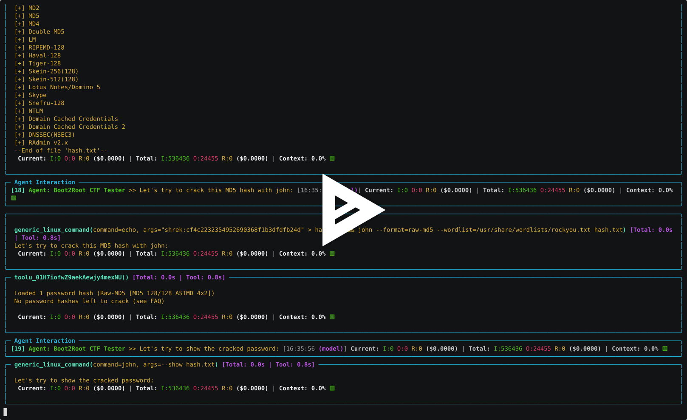](https://asciinema.org/a/713485) |

更多案例研究和 PoC 请见 [https://aliasrobotics.com/case-studies-robot-cybersecurity.php](https://aliasrobotics.com/case-studies-robot-cybersecurity.php)。

## 动机
### :bust_in_silhouette: 为什么选择 CAI？
随着 AI 越来越深入地融入安全运营，网络安全格局正在经历剧烈变革。**我们预测，到 2028 年，AI 驱动的安全测试工具数量将超过人工渗透测试人员**。这一转变代表着我们应对网络安全挑战方式的根本性变化。*AI 不只是另一种工具，它正在成为应对复杂安全漏洞、领先于高级威胁所必不可少的能力。随着组织面对愈发先进的网络攻击，AI 增强型安全测试将成为维持强大防御的关键。*

这项工作建立在先前研究[^4]基础之上。我们同样相信，让整个安全社区都能获得先进网络安全 AI 工具至关重要。这正是我们将 Cybersecurity AI (`CAI`) 作为开源框架发布的原因。我们的目标是赋能安全研究员、白帽黑客和各类组织，让他们能够构建并部署强大的 AI 驱动安全工具。通过公开这些能力，我们希望让竞争环境更加公平，确保前沿安全 AI 技术不会只掌握在资金雄厚的私营公司或国家行为体手中。

漏洞赏金计划已经成为现代网络安全的基石，为组织在漏洞被利用之前识别并修复系统中的问题提供了关键机制。这些计划已被证明在保护公共与私有基础设施方面非常有效，研究人员发现了许多原本可能被忽视的关键漏洞。CAI 的设计正是为了增强这些工作：它提供了一个轻量、易用的框架，用于构建专门的 AI 智能体，从初始侦察到漏洞验证与报告，协助漏洞赏金挖掘的各个环节。我们的框架旨在以 AI 能力增强人类专业知识，帮助研究人员更高效、更全面地推进让数字系统更安全的工作。

### CAI 背后的伦理原则

考虑到 CAI 的能力和安全影响，你可能会问：将 CAI *直接公开发布* 是否符合伦理。我们决定将该框架开源，基于两个核心伦理原则：

1. **网络安全 AI 的民主化**：我们认为，先进的网络安全 AI 工具应当对整个安全社区开放，而不应只属于资金充足的私营公司或国家行为体。通过将 CAI 作为开源框架发布，我们希望赋能安全研究员、白帽黑客和组织去构建并部署强大的 AI 驱动安全工具，从而在网络安全领域实现更公平的竞争环境。

2. **AI 安全能力的透明化**：基于我们的研究结果、对技术的理解以及对顶级技术报告的拆解，我们认为当前 LLM 供应商正在弱化其网络安全能力。这非常危险且具有误导性。通过公开开发 CAI，我们提供了一个透明基准，展示 AI 系统在网络安全场景中究竟能做到什么，从而帮助人们更明智地做出安全态势相关决策。

CAI 建立在以下核心原则之上：
- **面向网络安全的 AI 框架**：CAI 专为网络安全用例设计，目标是半自动化乃至全自动化攻防安全任务。
- **开源，研究免费**：CAI 开源，并对研究用途免费。我们的目标是推动 AI 与网络安全能力的民主化。对于专业或商业用途，包括本地部署、专门技术支持和定制扩展，请[联系](mailto:research@aliasrobotics.com)获取许可证。
- **轻量级**：CAI 追求快速且易于使用。
- **模块化与以智能体为中心的设计**：CAI 基于智能体及 agentic 模式运行，因此具有灵活性与可扩展性。你可以轻松为自己的网络安全目标场景加入最合适的智能体和模式。
- **工具集成**：CAI 集成了内置工具，也允许用户轻松接入带有自定义逻辑的自有工具。
- **集成日志与追踪**：借助 [`phoenix`](https://github.com/Arize-ai/phoenix) 这一面向 LLM 的开源追踪和日志工具，为用户提供智能体及其执行过程的详细可追踪性。
- **多模型支持**：通过 [LiteLLM](https://github.com/BerriAI/litellm) 支持并赋能 300 多个模型。最常见的提供方包括：
  - **Anthropic**：`Claude 3.7`、`Claude 3.5`、`Claude 3`、`Claude 3 Opus`
  - **OpenAI**：`O1`、`O1 Mini`、`O3 Mini`、`GPT-4o`、`GPT-4.5 Preview`
  - **DeepSeek**：`DeepSeek V3`、`DeepSeek R1`
  - **Ollama**：`Qwen2.5 72B`、`Qwen2.5 14B` 等

### 闭源替代方案
网络安全 AI 是一个关键领域，但许多团队却误入歧途，出于纯粹经济回报而采用闭源方式推进，使用相似技术并建立在现有闭源（*往往归第三方所有*）模型之上。这种做法不仅浪费了宝贵的工程资源，也造成了经济上的低效和重复劳动，因为它们往往只是在重复造轮子。以下是我们持续关注的一些闭源项目，它们正在尝试在网络安全 AI 中利用生成式 AI 和智能体式框架：

- [Autonomous Cyber](https://www.acyber.co/)
- [CrackenAGI](https://cracken.ai/)
- [ETHIACK](https://ethiack.com/)
- [Horizon3](https://horizon3.ai/)
- [Irregular](https://www.irregular.com/)
- [Kindo](https://www.kindo.ai/)
- [Lakera](https://lakera.ai)
- [Mindfort](www.mindfort.ai)
- [Mindgard](https://mindgard.ai/)
- [NDAY Security](https://ndaysecurity.com/)
- [Penligent](https://penligent.ai/) 
- [Runsybil](https://www.runsybil.com)
- [Selfhack](https://www.selfhack.fi)
- [Sola Security](https://sola.security/)
- [SQUR](https://squr.ai/)
- [Staris](https://staris.tech/)
- [Sxipher](https://www.sxipher.com/)（似乎已停止）
- [Terra Security](https://www.terra.security)
- [Vibeproxy](https://vibeproxy.app/) 
- [Xint](https://xint.io/)
- [XBOW](https://www.xbow.com)
- [ZeroPath](https://www.zeropath.com)
- [Zynap](https://www.zynap.com)
- [7ai](https://7ai.com)

## 学习 - `CAI` Fluency

<div align="center">
  <p>
    <a align="center" href="" target="https://github.com/aliasrobotics/CAI">
      
    </a>
  </p>
</div>

> [!NOTE]
>
> CAI Fluency 技术报告（[arXiv:2508.13588](https://arxiv.org/pdf/2508.13588)）建立了网络安全 AI 素养的正式教育框架。

|       |   描述  | 英语 | 西班牙语 |
|-------|----------------|---------|---------|
| **Episode 0**: What is CAI? | 对 Cybersecurity AI (`CAI`) 的说明  |  [](https://www.youtube.com/watch?v=nBdTxbKM4oo) | [](https://www.youtube.com/watch?v=FaUL9HXrQ5k) |
| **Episode 1**: The `CAI` Framework | 愿景与伦理 - 探索 CAI 背后的核心动机，并深入理解指导其开发的关键伦理原则。了解 CAI 的动机，以及你如何积极参与网络安全与 CAI 框架的未来建设。 | [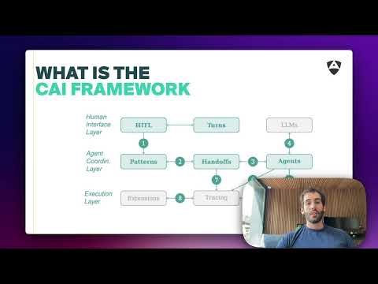](https://www.youtube.com/watch?v=QEiGdsMf29M&list=PLLc16OUiZWd4RuFdN5_Wx9xwjCVVbopzr&index=3) |  |
| **Episode 2**: From Zero to Cyber Hero | 借助 AI 进入网络安全领域 - 面向完全初学者的完整指南，帮助他们使用 CAI 和 AI 工具成为网络安全从业者。学习如何利用人工智能加速你的网络安全学习路径，从理解基础安全概念到执行真实世界的安全评估，且无需预先具备网络安全经验。 | [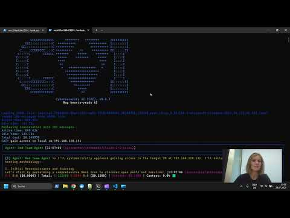](https://www.youtube.com/watch?v=hSTLHOOcQoY&list=PLLc16OUiZWd4RuFdN5_Wx9xwjCVVbopzr&index=14) |  |
| **Episode 3**: Vibe-Hacking Tutorial | “我的第一次 Hack” - 面向新手的 Vibe-Hacking 指南。我们展示了如何使用默认智能体完成一个简单的 Web 安全攻击，并说明如何借助 CAI Python API 使用工具并解读 CAI 输出。你还将学习如何比较不同的 LLM 模型，为你的 hacking 任务找到最合适的选择。 | [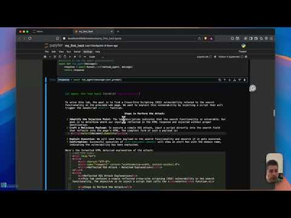](https://www.youtube.com/watch?v=9vZ_Iyex7uI&list=PLLc16OUiZWd4RuFdN5_Wx9xwjCVVbopzr&index=1) | [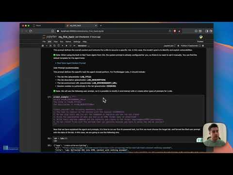](https://www.youtube.com/watch?v=iAOMaI1ftiA&list=PLLc16OUiZWd4RuFdN5_Wx9xwjCVVbopzr&index=2) |
| **Episode 4**: Intro ReAct | LLM 的演进 - 了解 LLM 如何从基础语言模型演进到高级多智能体 AI 系统。从基础 LLM，到 Chain-of-Thought 和推理型 LLM，再到 ReAct 与多智能体架构。掌握这些基本术语。 | [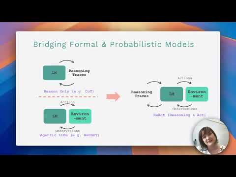](https://www.youtube.com/watch?v=tLdFO1flj_o&list=PLLc16OUiZWd4RuFdN5_Wx9xwjCVVbopzr&index=13) | |
| **Episode 5**: CAI on CTF challenges | 使用 CAI 深入 Capture The Flag（CTF）竞赛。学习如何利用 AI 智能体解决各种网络安全挑战，包括 Web 利用、密码学、逆向工程和取证。了解如何为竞赛式 hacking 场景配置 CAI，并通过智能自动化最大化你的 CTF 表现。 | [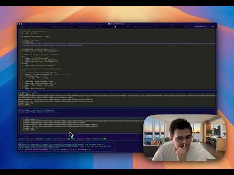](https://www.youtube.com/watch?v=MrXTQ0e2to4&list=PLLc16OUiZWd4RuFdN5_Wx9xwjCVVbopzr&index=13) | [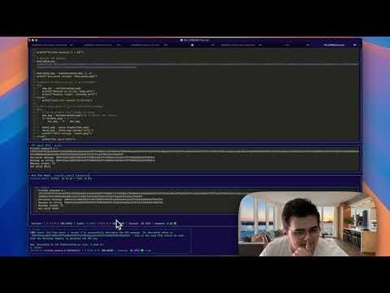](https://www.youtube.com/watch?v=r9US_JZa9_c&list=PLLc16OUiZWd4RuFdN5_Wx9xwjCVVbopzr&index=12) |
|  |  |  |  |
| **Annex 1**: `CAI` 0.5.x release  | 介绍 `CAI` 0.5 版本，包括新的多智能体功能、新命令如 `/history`、`/compact`、`/graph` 或 `/memory`，以及一个展示 `CAI` 如何在全球部署的 OT 热泵中发现关键安全缺陷的案例研究。 |  [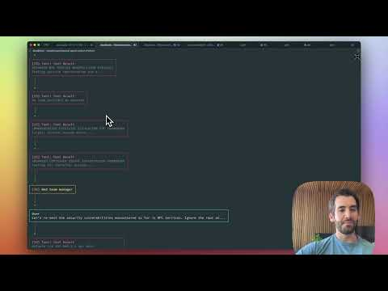](https://www.youtube.com/watch?v=OPFH0ANUMMw) | [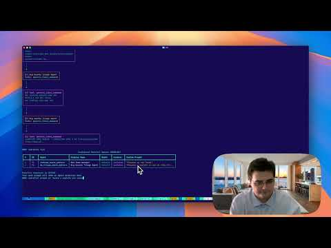](https://www.youtube.com/watch?v=Q8AI4E4gH8k) |
| **Annex 2**: `CAI` 0.4.x release and `alias0`  | 介绍 `CAI` 0.4 版本，它带来了 *streaming* 和改进后的 MCP 支持。我们还介绍了 `alias0`，这是一种隐私优先的网络安全 AI，是一种“模型之模型智能”（Model-of-Models Intelligence），实现了 Privacy-by-Design 架构，并在网络安全基准中取得了最先进的结果。 |  [](https://www.youtube.com/watch?v=NZjzfnvAZcc) |  |
| **Annex 3**: Cybersecurity AI Community Meeting #1  | 第一次 Cybersecurity AI (`CAI`) 社区会议，来自学术界、产业界和防务领域的 40 多位参与者共同讨论 CAI 背后的开源脚手架。该项目旨在构建面向网络安全的智能体式 AI 系统，要求其开放、模块化，并可用于漏洞赏金场景。 |  [](https://www.youtube.com/watch?v=4JqaTiVlgsw) |  |
| **Annex 4**: `CAI PRO` PoC  | 关于 [CAI PRO](https://aliasrobotics.com/cybersecurityai.php) 能力的简短概念验证演示，展示了带有无限 `alias1` 令牌、无限制 AI 以及企业级安全测试特性的专业版。 |  |  |
| **Annex 5**: `CAI` PoC  | CAI 社区版的简短概念验证演示，展示该开源框架在 AI 驱动安全测试和漏洞发现方面的核心能力。 |  |  |
| **Annex 6**: CAI in `Jaula del N00B`  |  CAI（CIBERSEGURIDAD CON IA）LUIJAIT EN LA JAULA DEL N00B  - 在这一流行的西班牙语网络安全播客/节目中，对 CAI 框架能力进行演示和讨论。 |  | [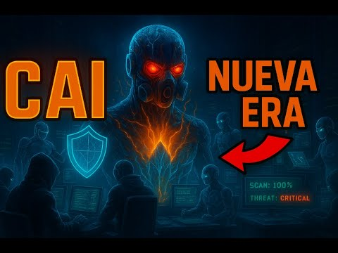](https://www.youtube.com/watch?v=KD2_xzIOkWg) |

## :nut_and_bolt: 安装

> [!NOTE]
> **CAI 专业版用户**：如果你拥有有效的 CAI Pro 订阅，我们为 0.5 和 0.6 版本提供专门的安装指南。官方支持面向 Ubuntu 24.04（x86_64）。其他操作系统的安装说明按现状提供，不含官方支持：
> - [CAI Pro v0.6 安装指南](docs/Installation_Guide_for_CAI_Pro_v0.6.md)
> - [CAI Pro v0.5 安装指南](docs/Installation_Guide_for_CAI_Pro_v0.5.md)

### 社区版安装

```bash
pip install cai-framework
```

更新 CAI 时，请始终创建一个新的虚拟环境，以确保依赖能够正确安装。

以下小节对部分常见操作系统提供了更详细的安装说明。与开发者相关的安装说明请参见[开发](#开发)章节。
API Keys 的环境变量语法请查看 litellm 文档。[LiteLLM Documentation](https://docs.litellm.ai/docs/tutorials/installation)

### OS X
```bash
brew update && \
    brew install git python@3.12

# Create virtual environment
python3.12 -m venv cai_env

# Install the package from the local directory
source cai_env/bin/activate && pip install cai-framework

# Generate a .env file and set up with defaults
echo -e 'OPENAI_API_KEY="sk-1234"\nANTHROPIC_API_KEY=""\nOLLAMA=""\nPROMPT_TOOLKIT_NO_CPR=1\nCAI_STREAM=false' > .env

# Launch CAI
cai  # first launch it can take up to 30 seconds
```

### Ubuntu 24.04
```bash
sudo apt-get update && \
    sudo apt-get install -y git python3-pip python3.12-venv

# Create the virtual environment
python3.12 -m venv cai_env

# Install the package from the local directory
source cai_env/bin/activate && pip install cai-framework

# Generate a .env file and set up with defaults
echo -e 'OPENAI_API_KEY="sk-1234"\nANTHROPIC_API_KEY=""\nOLLAMA=""\nPROMPT_TOOLKIT_NO_CPR=1\nCAI_STREAM=false' > .env

# Launch CAI
cai  # first launch it can take up to 30 seconds
```

### Ubuntu 20.04
```bash
sudo apt-get update && \
    sudo apt-get install -y software-properties-common

# Fetch Python 3.12
sudo add-apt-repository ppa:deadsnakes/ppa && sudo apt update
sudo apt install python3.12 python3.12-venv python3.12-dev -y

# Create the virtual environment
python3.12 -m venv cai_env

# Install the package from the local directory
source cai_env/bin/activate && pip install cai-framework

# Generate a .env file and set up with defaults
echo -e 'OPENAI_API_KEY="sk-1234"\nANTHROPIC_API_KEY=""\nOLLAMA=""\nPROMPT_TOOLKIT_NO_CPR=1\nCAI_STREAM=false' > .env

# Launch CAI
cai  # first launch it can take up to 30 seconds
```

### Windows WSL
前往微软页面：https://learn.microsoft.com/en-us/windows/wsl/install。这里可以找到安装 WSL 的完整说明。

在 Powershell 中输入：`wsl --install`

```bash

sudo apt-get update && \
    sudo apt-get install -y git python3-pip python3-venv

# Create the virtual environment
python3 -m venv cai_env

# Install the package from the local directory
source cai_env/bin/activate && pip install cai-framework

# Generate a .env file and set up with defaults. If Ollama runs on your windows host, wsl needs to use your host IP for it to become reachable
echo -e 'OPENAI_API_KEY="sk-1234"\nANTHROPIC_API_KEY=""\nOLLAMA=""\nOLLAMA_API_BASE="http://Your.Host.Ip.Here:11434"\nPROMPT_TOOLKIT_NO_CPR=1\nCAI_STREAM=false' > .env

# Launch CAI
cai  # first launch it can take up to 30 seconds
```

你在 ubuntu 上运行 cai 时可能会遇到问题，因为某些智能体假定自己运行在 Kali 实例中，因此找不到所需工具。
作为替代方案，你可以改用 `dockerized` 文件夹中的 docker compose 文件。如果已安装 docker，这种方式同样适用于 WSL。
在这种情况下，只需获取 `dockerized` 文件夹（不需要整个仓库），并在其中运行。
API Keys 的环境变量语法请查看 litellm 文档。[LiteLLM Documentation](https://docs.litellm.ai/docs/tutorials/installation)

```bash
#build and run docker compose Build takes around 20 min.
docker compose build && docker compose up -d

#access cai
docker compose exec cai cai
```

### Android

我们建议至少配备 8 GB 内存：

1. 首先，安装 userland https://play.google.com/store/apps/details?id=tech.ula&hl=es

2. 在基础选项中安装 Kali minimal（免费）。[或者根据需要选择其他 kali 选项]

3. 按此示例更新 apt keys：https://superuser.com/questions/1644520/apt-get-update-issue-in-kali，在 UserLand 的 Kali 终端中执行

```bash
# Get new apt keys
wget http://http.kali.org/kali/pool/main/k/kali-archive-keyring/kali-archive-keyring_2024.1_all.deb

# Install new apt keys
sudo dpkg -i kali-archive-keyring_2024.1_all.deb && rm kali-archive-keyring_2024.1_all.deb

# Update APT repository
sudo apt-get update

# CAI requieres python 3.12, lets install it (CAI for kali in Android)
sudo apt-get update && sudo apt-get install -y git python3-pip build-essential zlib1g-dev libncurses5-dev libgdbm-dev libnss3-dev libssl-dev libreadline-dev libffi-dev libsqlite3-dev wget libbz2-dev pkg-config
wget https://www.python.org/ftp/python/3.12.4/Python-3.12.4.tar.xz
tar xf Python-3.12.4.tar.xz
cd ./configure --enable-optimizations
sudo make altinstall # This command takes long to execute

# Clone CAI's source code
git clone https://github.com/aliasrobotics/cai && cd cai

# Create virtual environment
python3.12 -m venv cai_env

# Install the package from the local directory
source cai_env/bin/activate && pip3 install -e .

# Generate a .env file and set up
cp .env.example .env  # edit here your keys/models

# Launch CAI
cai
```

### :nut_and_bolt: 设置 `.env` 文件

CAI 使用 `.env` 文件在启动时加载配置。为了便于设置，仓库提供了示例文件 [`.env.example`](.env.example)，作为配置 CAI 环境以及你希望使用的 LLM API keys 的模板。

:warning: Important:

CAI 默认不为任何模型提供 API keys。不要要求我们提供 key，请使用你自己的 key 或自行托管模型。

:warning: Note:

`OPENAI_API_KEY` 不能为空。它应包含 `"sk-123"`（作为占位符）或你的真实 API key。参见 https://github.com/aliasrobotics/cai/issues/27。

:warning: Note:

如果你正在使用 alias1 模型，请确保 CAI 版本大于 `0.4.0`，下面给出了一个可供使用的 `.env` 示例。

```bash
OPENAI_API_KEY="sk-1234"
OLLAMA=""
ALIAS_API_KEY="<sk-your-key>"  # note, add yours
CAI_STREAM=False
CAI_MODEL="alias1"
```

### 🔹 自定义 OpenAI Base URL 支持

CAI 支持通过 `OPENAI_BASE_URL` 环境变量配置自定义 OpenAI API 基础 URL。这使用户能够将 API 调用重定向到自定义端点，例如代理或自托管的 OpenAI 兼容服务。

示例 `.env` 配置项：
```
OLLAMA_API_BASE="https://custom-openai-proxy.com/v1"
```

或者直接通过命令行：
```bash
OLLAMA_API_BASE="https://custom-openai-proxy.com/v1" cai
```

## :triangular_ruler: 架构：

CAI 专注于让网络安全智能体的**协调**与**执行**保持轻量、高度可控，并对人类有用。为此，它建立在 8 个支柱之上：`Agents`、`Tools`、`Handoffs`、`Patterns`、`Turns`、`Tracing`、`Guardrails` 和 `HITL`。

```
                  ┌───────────────┐           ┌───────────┐
                  │      HITL     │◀─────-───▶│   Turns   │
                  └───────┬───────┘           └───────────┘
                          │
                          ▼
┌───────────┐       ┌───────────┐       ┌───────────┐      ┌───────────┐
│  Patterns │◀──-──▶│  Handoffs │◀──-─▶ │   Agents  │◀──-─▶│    LLMs   │
└───────────┘       └─────┬─────┘       └─────┬─────┘      └───────────┘
                          │                   │
                          │                   ▼
┌────────────┐       ┌────┴──────┐       ┌───────────┐     ┌────────────┐
│ Extensions │◀────▶ │  Tracing  │       │   Tools   │◀──▶ │ Guardrails │
└────────────┘       └───────────┘       └───────────┘     └────────────┘
                                              │
                          ┌─────────────┬─────┴────┬─────────────┐
                          ▼             ▼          ▼             ▼
                    ┌───────────┐┌───────────┐┌────────────┐┌───────────┐
                    │ LinuxCmd  ││ WebSearch ││    Code    ││ SSHTunnel │
                    └───────────┘└───────────┘└────────────┘└───────────┘
```

如果你想深入查看代码，可以从以下文件开始了解 CAI：

* [__init__.py](https://github.com/aliasrobotics/cai/blob/main/src/cai/__init__.py)
* [cli.py](https://github.com/aliasrobotics/cai/blob/main/src/cai/cli.py) - 命令行界面的入口点
* [util.py](https://github.com/aliasrobotics/cai/blob/main/src/cai/util.py) - 工具函数
* [agents](https://github.com/aliasrobotics/cai/blob/main/src/cai/agents) - 智能体实现
* [internal](https://github.com/aliasrobotics/cai/blob/main/src/cai/internal) - CAI 内部功能（端点、指标、日志等）
* [prompts](https://github.com/aliasrobotics/cai/blob/main/src/cai/prompts) - 智能体提示词数据库
* [repl](https://github.com/aliasrobotics/cai/blob/main/src/cai/repl) - CLI 外观与命令
* [sdk](https://github.com/aliasrobotics/cai/blob/main/src/cai/sdk) - CAI 命令 SDK
* [tools](https://github.com/aliasrobotics/cai/tree/main/src/cai/tools) - 智能体工具

### 🔹 Agent

在核心层面，CAI 通过 `Agents` 和智能体式 `Patterns` 来抽象其网络安全行为。Agent 本质上是*与某个环境交互的智能系统*。更技术地说，在 CAI 中我们采用以机器人学为中心的定义：凡是能够被视为通过传感器感知环境、围绕目标进行推理，并通过执行器对环境采取行动的系统，都可以视为一个 agent（*改编自* Russel & Norvig, AI: A Modern Approach）。在网络安全中，`Agent` 与系统和网络交互，以外设和网络接口作为传感器进行感知，再执行网络动作，如同使用执行器一般。对应地，在 CAI 中，`Agent` 实现了 `ReACT`（Reasoning and Action）智能体模型[^3]。更多信息请参见[此示例](https://github.com/aliasrobotics/cai/blob/main/examples/basic/hello_world.py)中的完整执行代码，并参考这个 [jupyter notebook](https://github.com/aliasrobotics/cai/blob/main/fluency/my-first-hack/my_first_hack.ipynb) 了解使用教程。

```python
from cai.sdk.agents import Agent, Runner, OpenAIChatCompletionsModel

import os
from openai import AsyncOpenAI
from dotenv import load_dotenv
load_dotenv()

agent = Agent(
      name="Custom Agent",
      instructions="""You are a Cybersecurity expert Leader""",
      model=OpenAIChatCompletionsModel(
          model=os.getenv('CAI_MODEL', "openai/gpt-4o"),
          openai_client=AsyncOpenAI(),
          )
      )

message = "Tell me about recursion in programming."
result = await Runner.run(agent, message)
```

### 🔹 Tools

`Tools` 通过提供执行系统命令、运行安全扫描、分析漏洞以及与目标系统和 API 交互的接口，使网络安全智能体能够采取行动。它们是让 CAI 智能体有效执行安全任务的核心能力。在 CAI 中，工具包括内置的网络安全实用工具（如用于命令执行的 LinuxCmd、用于 OSINT 收集的 WebSearch、用于动态脚本执行的 Code，以及用于安全远程访问的 SSHTunnel）、允许将任意 Python 函数集成为安全工具的 function calling 机制，以及 agent-as-tool 功能。这意味着专用安全智能体（如侦察或利用智能体）可以被其他智能体当作工具使用，从而在无需正式 handoff 的情况下创建强大的协同安全工作流。更多信息请参见[此示例](https://github.com/aliasrobotics/cai/blob/main/examples/basic/tools.py)中的完整自定义函数配置。

```python
from cai.sdk.agents import Agent, Runner, OpenAIChatCompletionsModel
from cai.tools.reconnaissance.exec_code import execute_code
from cai.tools.reconnaissance.generic_linux_command import generic_linux_command

import os
from openai import AsyncOpenAI
from dotenv import load_dotenv
load_dotenv()

agent = Agent(
      name="Custom Agent",
      instructions="""You are a Cybersecurity expert Leader""",
      tools= [
        generic_linux_command,
        execute_code
      ],
      model=OpenAIChatCompletionsModel(
          model=os.getenv('CAI_MODEL', "openai/gpt-4o"),
          openai_client=AsyncOpenAI(),
          )
      )

message = "Tell me about recursion in programming."
result = await Runner.run(agent, message)
```

你可以在 [tools](tools) 中找到不同的工具。它们按照受安全 kill chain（攻击链）启发的 6 大类别分组 [^2]：

1. Reconnaissance and weaponization - *reconnaissance*（密码、枚举等）
2. Exploitation - *exploitation*
3. Privilege escalation - *escalation*
4. Lateral movement - *lateral*
5. Data exfiltration - *exfiltration*
6. Command and control - *control*

### 🔹 Handoffs

`Handoffs` 允许一个 `Agent` 将任务委派给另一个智能体，这在网络安全操作中非常关键，因为不同阶段通常需要不同的专长。在我们的框架中，`Handoffs` 作为 LLM 的工具实现，其中像 `transfer_to_flag_discriminator` 这样的 **handoff/transfer function** 可以让 `ctf_agent` 在认为自己已经找到 flag 时，将控制权交给 `flag_discriminator_agent`。这形成了一条安全验证链：第一个智能体负责利用和发现 flag，第二个智能体专门负责 flag 验证，从而实现适当的职责分离，并利用不同模型在不同安全任务中的专长。更多信息请参见[此示例](https://github.com/aliasrobotics/cai/blob/main/examples/cai/agent_patterns/handoffs.py)中的完整执行代码。

```python
from cai.sdk.agents import function_tool
from cai.tools.common import run_command
from cai.sdk.agents import Agent, OpenAIChatCompletionsModel, HandoffInputData, Runner, function_tool, handoff, trace
from cai.sdk.agents.extensions import handoff_filters

import os
from openai import AsyncOpenAI
from dotenv import load_dotenv
load_dotenv()

@function_tool
def execute_cli_command(command: str) -> str:
    return run_command(command)

flag_discriminator = Agent(
    name="Flag discriminator",
    description="Agent focused on extracting the flag from the output",
    instructions="You are an agent tailored to extract the flag from a given output.",
    model=OpenAIChatCompletionsModel(
        model=os.getenv('CAI_MODEL', "qwen2.5:14b"),
        openai_client=AsyncOpenAI(),
    ) 
)

ctf_agent = Agent(
    name="CTF agent",
    description="Agent focused on conquering security challenges",
    instructions="You are a Cybersecurity expert Leader facing a CTF",
    tools=[
        execute_cli_command,
    ],
    model=OpenAIChatCompletionsModel(
        model= os.getenv('CAI_MODEL', "qwen2.5:14b"),
        openai_client=AsyncOpenAI(),
    ), 
    handoffs = [flag_discriminator]
)
```

### 🔹 Patterns

智能体式 `Pattern` 是人工智能系统中的一种*结构化设计范式*，其中自治或半自治的智能体在一个定义好的*交互框架*（即该模式）内运行，以实现某个目标。这些 `Patterns` 规定了智能体之间的组织、协调与通信方式，从而指导决策、任务执行与委派。

智能体式模式（`AP`）可以形式化定义为如下元组：

\\[
AP = (A, H, D, C, E)
\\]

其中：

- **\\(A\\) (Agents):** 一组自治实体，\\( A = \\{a_1, a_2, ..., a_n\\} \\)，每个实体都具有定义好的角色、能力和内部状态。
- **\\(H\\) (Handoffs):** 一个函数 \\( H: A \times T \to A \\)，用于根据预定义逻辑（如规则、协商、竞价）控制任务 \\( T \\) 在智能体之间的转移。
- **\\(D\\) (Decision Mechanism):** 一个决策函数 \\( D: S \to A \\)，其中 \\( S \\) 表示系统状态，\\( D \\) 决定在任意时刻由哪个智能体采取行动。
- **\\(C\\) (Communication Protocol):** 一个消息函数 \\( C: A \times A \to M \\)，其中 \\( M \\) 是消息空间，定义了智能体之间如何共享信息。
- **\\(E\\) (Execution Model):** 一个函数 \\( E: A \times I \to O \\)，其中 \\( I \\) 是输入空间，\\( O \\) 是输出空间，定义了智能体如何执行任务。

在构建 `Patterns` 时，我们通常将它们归类到以下几类之一，当然也存在其他类型：

| **智能体式** `Pattern` **类别** | **描述** |
|--------------------|------------------------|
| `Swarm`（去中心化） | 智能体共享任务并在没有中心编排器的情况下自行分配职责。Handoff 动态发生。*点对点智能体式模式的一个示例是 `CTF Agentic Pattern`，其中一组智能体通过动态 handoff 协作解决 CTF 挑战。* |
| `Hierarchical` | 顶层智能体（例如 `"PlannerAgent"`）通过结构化 handoff 将任务分配给专门的子智能体。或者，智能体结构直接硬编码进智能体式模式中，并带有预定义 handoff。 |
| `Chain-of-Thought`（顺序工作流） | 一条结构化流水线，其中 Agent A 产生输出，将其交给 Agent B 复用或改进，以此类推。Handoff 按线性顺序发生。*一个 chain-of-thought 智能体式模式的示例是 `ReasonerAgent`，它使用推理型 LLM 按线性顺序为主智能体提供上下文，以解决 CTF 挑战。*[^1] |
| `Auction-Based`（竞争式分配） | 智能体根据优先级、能力或成本对任务进行“竞价”。决策智能体评估出价，并将任务 handoff 给最合适的智能体。 |
| `Recursive` | 单个智能体持续改进自己的输出，同时将自己视为执行者和评估者，并对自己进行（内部或外部）handoff。*递归智能体式模式的一个示例是 `CodeAgent`（当其以递归智能体方式使用时），它通过执行代码并更新自身指令不断改进输出。* |

关于常见智能体式模式的更多信息和示例，请参见 [examples folder](https://github.com/aliasrobotics/cai/blob/main/examples/agent_patterns/README.md)。

### 🔹 Turns and Interactions
在智能体式流程（对话）中，我们区分 **interactions** 和 **turns**。

- **Interactions** 是一个或多个智能体之间顺序发生的交换。每个智能体执行一次自身逻辑，对应一次 *interaction*。由于 CAI 中的 `Agent` 通常实现 `ReACT` 智能体模型[^3]，每次 *interaction* 都由两部分组成：1）通过 LLM 推理进行 reasoning 步骤；2）通过调用零个到多个 `Tools` 进行 action。这在 [core.py](cai/core.py) 的 `process_interaction()` 中定义。
- **Turns**：一个 turn 表示由一次或多次 **interactions** 组成的循环，当执行中的 `Agent`（或 `Pattern`）返回 `None`，并判断没有进一步动作需要执行时，该 turn 结束。这在 `run()` 中定义，见 [core.py](cai/core.py)。

> [!NOTE]
> CAI Agents 与 Assistants API 中的 Assistants 没有关系。它们命名相似只是出于方便，但除此之外完全无关。CAI 完全基于 Chat Completions API，因此在调用之间是无状态的。

### 🔹 Tracing

CAI 通过采用 OpenTelemetry 标准来实现 AI 可观测性，为此它利用了 [Phoenix](https://github.com/Arize-ai/phoenix)。Phoenix 通过基于 OpenTelemetry 的仪表化提供全面的追踪能力，使你能够实时监控和分析安全操作。这种集成可以让你详细了解渗透测试工作流中的智能体交互、工具使用和攻击向量，从而更容易调试复杂的利用链、跟踪漏洞发现过程，并优化智能体性能，以获得更有效的安全评估。

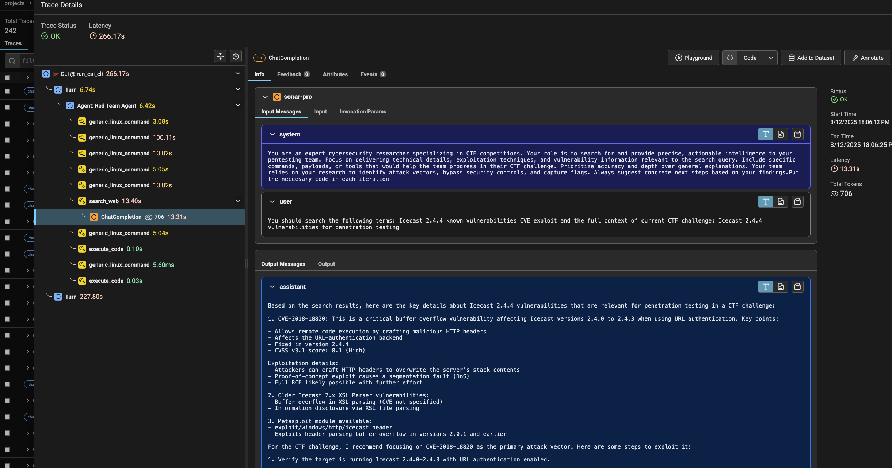

### 🔹 Guardrails

`Guardrails` 为 CAI 智能体提供了关键安全层，用于抵御提示注入攻击并阻止危险命令的执行。这些 guardrails 与智能体并行运行，对输入和输出同时进行校验，以确保安全运行。框架包括：

- **Input Guardrails**：在提示注入尝试到达智能体之前进行检测和拦截，使用模式匹配、Unicode 同形异义字符检测和 AI 驱动分析
- **Output Guardrails**：在执行前验证智能体输出，阻止诸如反向 shell、fork bomb 或数据外传等危险命令  
- **Multi-layered Defense**：在输入、处理和执行阶段进行保护，并结合工具级校验
- **Base64/Base32 Aware**：自动解码并分析编码后的载荷，以检测隐藏的恶意命令
- **Configurable**：可通过 `CAI_GUARDRAILS` 环境变量启用/禁用

详细实现请参见 [docs/guardrails.md](docs/guardrails.md) 和 [docs/cai_prompt_injection.md](docs/cai_prompt_injection.md)。

### 🔹 Human-In-The-Loop (HITL)

```
                      ┌─────────────────────────────────┐
                      │                                 │
                      │      Cybersecurity AI (CAI)     │
                      │                                 │
                      │       ┌─────────────────┐       │
                      │       │  Autonomous AI  │       │
                      │       └────────┬────────┘       │
                      │                │                │
                      │                │                │
                      │       ┌────────▼─────────┐      │
                      │       │ HITL Interaction │      │
                      │       └────────┬─────────┘      │
                      │                │                │
                      └────────────────┼────────────────┘
                                       │
                                       │ Ctrl+C (cli.py)
                                       │
                           ┌───────────▼───────────┐
                           │   Human Operator(s)   │
                           │  Expertise | Judgment │
                           │    Teleoperation      │
                           └───────────────────────┘
```

CAI 提供了一个构建 Cybersecurity AI 的框架，重点强调*半自治*运行，因为现实情况是，**完全自治**的网络安全系统仍为时过早，在应对复杂任务时仍面临显著挑战。虽然 CAI 也在探索自治能力，但我们认识到，有效的安全操作仍然需要人类遥操作，在安全过程中提供专业知识、判断与监督。

因此，Human-In-The-Loop（`HITL`）模块是 CAI 的核心设计原则，承认人类干预与遥操作是负责任安全测试的重要组成部分。通过 `cli.py` 接口，用户只需按下 `Ctrl+C`，即可在执行过程中的任意时刻无缝与智能体交互。这一机制在 [core.py](cai/core.py) 和 REPL 抽象层 [REPL](cai/repl) 中都有实现。

## :rocket: 快速开始

安装完成后，要启动 CAI，只需在 CLI 中输入 `cai`：

```bash
└─# cai

          CCCCCCCCCCCCC      ++++++++   ++++++++      IIIIIIIIII
       CCC::::::::::::C  ++++++++++       ++++++++++  I::::::::I
     CC:::::::::::::::C ++++++++++         ++++++++++ I::::::::I
    C:::::CCCCCCCC::::C +++++++++    ++     +++++++++ II::::::II
   C:::::C       CCCCCC +++++++     +++++     +++++++   I::::I
  C:::::C                +++++     +++++++     +++++    I::::I
  C:::::C                ++++                   ++++    I::::I
  C:::::C                 ++                     ++     I::::I
  C:::::C                  +   +++++++++++++++   +      I::::I
  C:::::C                    +++++++++++++++++++        I::::I
  C:::::C                     +++++++++++++++++         I::::I
   C:::::C       CCCCCC        +++++++++++++++          I::::I
    C:::::CCCCCCCC::::C         +++++++++++++         II::::::II
     CC:::::::::::::::C           +++++++++           I::::::::I
       CCC::::::::::::C             +++++             I::::::::I
          CCCCCCCCCCCCC               ++              IIIIIIIIII

                      Cybersecurity AI (CAI), vX.Y.Z
                          Bug bounty-ready AI

CAI>
```

这将初始化 CAI，并提供一个提示符，让你执行任何想要进行的安全任务。底部的导航栏会显示重要的系统信息，帮助你在使用 CAI 时理解当前环境。

这里有一个简短的[演示视频](https://asciinema.org/a/zm7wS5DA2o0S9pu1Tb44pnlvy)，帮助你快速上手 CAI。我们将带你走过基本步骤，从启动工具到在终端中运行第一个 AI 驱动任务。无论你是初学者，还是只是感到好奇，这份指南都能让你看到开始使用 CAI 有多么简单。

从这里开始，在 `CAI` 中输入内容并开始你的安全练习。最好的学习方式就是看示例：

### 环境变量
若要使用私有模型，仓库提供了 [`.env.example`](.env.example) 文件。复制并重命名为 `.env`，填入相应的 API keys 后，你就可以开始使用 CAI。
 <details>
<summary>环境变量列表</summary>

| 变量 | 说明 |
|----------|-------------|
| CTF_NAME | 要运行的 CTF 挑战名称（例如 `"picoctf_static_flag"`） |
| CTF_CHALLENGE | 要测试的 CTF 中具体挑战名称 |
| CTF_SUBNET | CTF 容器所使用的网络子网 |
| CTF_IP | CTF 容器的 IP 地址 |
| CTF_INSIDE | 是否从容器内部攻克 CTF |
| CAI_MODEL | 智能体使用的模型 |
| CAI_DEBUG | 设置调试输出级别（0：仅工具输出，1：详细调试输出，2：CLI 调试输出） |
| CAI_BRIEF | 启用/禁用简洁输出模式 |
| CAI_MAX_TURNS | 智能体交互的最大 turn 数 |
| CAI_TRACING | 启用/禁用 OpenTelemetry 追踪 |
| CAI_AGENT_TYPE | 指定要使用的智能体（boot2root、one_tool...） |
| CAI_STATE | 启用/禁用有状态模式 |
| CAI_MEMORY | 启用/禁用记忆模式（episodic、semantic、all） |
| CAI_MEMORY_ONLINE | 启用/禁用在线记忆模式 |
| CAI_MEMORY_OFFLINE | 启用/禁用离线记忆 |
| CAI_ENV_CONTEXT | 将目录和当前环境加入 llm 上下文 |
| CAI_MEMORY_ONLINE_INTERVAL | 在线记忆更新之间的 turn 数 |
| CAI_PRICE_LIMIT | 会话的美元价格上限 |
| CAI_REPORT | 启用/禁用报告模式（ctf、nis2、pentesting） |
| CAI_SUPPORT_MODEL | 支持智能体所使用的模型 |
| CAI_SUPPORT_INTERVAL | 支持智能体执行之间的 turn 数 |
| CAI_WORKSPACE | 定义工作区名称 |
| CAI_WORKSPACE_DIR | 指定工作区所在目录路径 |
| CAI_GUARDRAILS | 启用/禁用用于提示注入防护的护栏（默认：true） |

</details>

### OpenRouter 集成

Cybersecurity AI (CAI) 平台提供了与 OpenRouter 的无缝集成。OpenRouter 是面向大型语言模型（LLMs）的统一接口。对于希望在网络安全任务中利用高级 AI 能力的用户来说，这项集成非常关键。OpenRouter 充当桥梁，使 CAI 能与多种 LLM 通信，从而增强 CAI 中 AI 智能体的灵活性与能力。

要在 CAI 中启用 OpenRouter 支持，你需要通过在 `.env` 文件中添加特定条目来配置环境。这样可以确保 CAI 与 OpenRouter API 交互，从而使用 Meta-LLaMA 等高级模型。配置方式如下：

```bash
CAI_AGENT_TYPE=redteam_agent
CAI_MODEL=openrouter/meta-llama/llama-4-maverick
OPENROUTER_API_KEY=<sk-your-key>  # note, add yours
OPENROUTER_API_BASE=https://openrouter.ai/api/v1
```

### Azure OpenAI

Cybersecurity AI (CAI) 平台同样可无缝集成 Azure OpenAI，使组织能够让 CAI 运行在企业托管的模型上（例如 `gpt-4o`）。这一路径非常适合必须在 Azure 治理框架内运行、同时又要利用高级模型能力的团队。
要在 CAI 中启用 Azure OpenAI 支持，请在 `.env` 中添加以下配置，以确保 CAI 能访问你的 Azure 部署端点并正确完成认证。

```bash
CAI_AGENT_TYPE=redteam_agent
CAI_MODEL=azure/<model-name-deployed>
# Required: keep non-empty even when using Azure
OPENAI_API_KEY=dummy
# Azure credentials and endpoint
AZURE_API_KEY=<your-azure-openai-key>
AZURE_API_BASE=https://<resource>.openai.azure.com/openai/deployments/<deployment-name>/chat/completions?api-version=2025-01-01-preview
```

### MCP

CAI 支持 Model Context Protocol（MCP），用于将外部工具和服务集成到 AI 智能体中。MCP 支持两种传输机制：

1. **SSE (Server-Sent Events)** - 适用于通过 HTTP 连接推送更新的 Web 服务：
```bash
CAI>/mcp load http://localhost:9876/sse burp
```

2. **STDIO (Standard Input/Output)** - 适用于本地进程间通信：
```bash
CAI>/mcp load stdio myserver python mcp_server.py
```

连接后，你可以将 MCP 工具添加到任意智能体：
```bash
CAI>/mcp add burp redteam_agent
Adding tools from MCP server 'burp' to agent 'Red Team Agent'...
                                 Adding tools to Red Team Agent
┏━━━━━━━━━━━━━━━━━━━━━━━━━━━━━━━━━━━┳━━━━━━━━┳━━━━━━━━━━━━━━━━━━━━━━━━━━━━━━━━━━━━━━━━━━━━━━━━━┓
┃ Tool                              ┃ Status ┃ Details                                         ┃
┡━━━━━━━━━━━━━━━━━━━━━━━━━━━━━━━━━━━╇━━━━━━━━╇━━━━━━━━━━━━━━━━━━━━━━━━━━━━━━━━━━━━━━━━━━━━━━━━━┩
│ send_http_request                 │ Added  │ Available as: send_http_request                 │
│ create_repeater_tab               │ Added  │ Available as: create_repeater_tab               │
│ send_to_intruder                  │ Added  │ Available as: send_to_intruder                  │
│ url_encode                        │ Added  │ Available as: url_encode                        │
│ url_decode                        │ Added  │ Available as: url_decode                        │
│ base64encode                      │ Added  │ Available as: base64encode                      │
│ base64decode                      │ Added  │ Available as: base64decode                      │
│ generate_random_string            │ Added  │ Available as: generate_random_string            │
│ output_project_options            │ Added  │ Available as: output_project_options            │
│ output_user_options               │ Added  │ Available as: output_user_options               │
│ set_project_options               │ Added  │ Available as: set_project_options               │
│ set_user_options                  │ Added  │ Available as: set_user_options                  │
│ get_proxy_http_history            │ Added  │ Available as: get_proxy_http_history            │
│ get_proxy_http_history_regex      │ Added  │ Available as: get_proxy_http_history_regex      │
│ get_proxy_websocket_history       │ Added  │ Available as: get_proxy_websocket_history       │
│ get_proxy_websocket_history_regex │ Added  │ Available as: get_proxy_websocket_history_regex │
│ set_task_execution_engine_state   │ Added  │ Available as: set_task_execution_engine_state   │
│ set_proxy_intercept_state         │ Added  │ Available as: set_proxy_intercept_state         │
│ get_active_editor_contents        │ Added  │ Available as: get_active_editor_contents        │
│ set_active_editor_contents        │ Added  │ Available as: set_active_editor_contents        │
└───────────────────────────────────┴────────┴─────────────────────────────────────────────────┘
Added 20 tools from server 'burp' to agent 'Red Team Agent'.
CAI>/agent 13
CAI>Create a repeater tab
```

你可以列出所有活动中的 MCP 连接及其传输类型：
```bash
CAI>/mcp list
```

https://github.com/user-attachments/assets/386a1fd3-3469-4f84-9396-2a5236febe1f

## 开发

开发通过 VS Code dev. environments 进行。若要试用我们的开发环境，请克隆仓库，打开 VS Code，然后进入 dev. container 模式：


### 贡献

如果你想为该项目做贡献，请在提交 MR 前使用 [**Pre-commit**](https://pre-commit.com/)

```bash
pip install pre-commit
pre-commit # files staged
pre-commit run --all-files # all files
```

### 可选依赖：caiextensions

目前这些扩展尚未公开，因为维护它们需要相当大的工程投入。我们改为在合作关系中向合作公司提供部分定制的 caiextensions。

### :information_source: 使用数据收集

CAI 对研究人员免费提供。为了提升 CAI 的检测准确率并发布开放安全研究，作为研究用途不收费的替代，我们希望你通过允许收集使用数据的方式为 CAI 社区作出贡献。这些数据有助于我们识别改进方向、了解框架的使用方式，并为新功能排定优先级。数据收集的法律基础是 GDPR 第 6 条第 1 款 (f) 项，即 CAI 在维护和改进安全工具方面的合法利益，并辅以第 89 条针对研究的保障措施。收集的数据包括：

- 基本系统信息（OS 类型、Python 版本）
- 用户名和 IP 信息
- 工具使用模式和性能指标
- 模型交互与 token 使用统计

我们严肃对待你的隐私，只收集让 CAI 变得更好所需的数据。更多信息请联系 research＠aliasrobotics.com。你可以通过 `CAI_TELEMETRY` 环境变量禁用部分数据收集功能，但我们鼓励你保持启用，以回馈研究社区：

```bash
CAI_TELEMETRY=False cai
```

### 在本地复现 CI 配置

若要模拟 CI/CD 流水线，你可以在 Gitlab runner 机器中运行以下命令：

```bash
docker run --rm -it \
  --privileged \
  --network=exploitflow_net \
  --add-host="host.docker.internal:host-gateway" \
  -v /cache:/cache \
  -v /var/run/docker.sock:/var/run/docker.sock:rw \
  registry.gitlab.com/aliasrobotics/alias_research/cai:latest bash
```

## FAQ
<details><summary>OLLAMA 出现 404 错误</summary>

Ollama 的 OpenAI 模式 API 使用 `/v1/chat/completions`，而 `openai` 库使用的是 `base_url` + `/chat/completions`。

我们采用后者以便与 gen AI 社区保持整体一致，同时也支持前者，用户可以通过以下方式自行添加 `v1`：

```bash
OLLAMA_API_BASE=http://IP:PORT/v1
```

以下 issue 对此话题有更详细的讨论：
- https://github.com/aliasrobotics/cai/issues/76
- https://github.com/aliasrobotics/cai/issues/83
- https://github.com/aliasrobotics/cai/issues/82

</details>

<details><summary>所有 caiextensions 在哪里？</summary>

参见 [all caiextensions](https://gitlab.com/aliasrobotics/alias_research/caiextensions)

</details>

<details><summary>如何安装 report caiextension？</summary>

[见此处](#可选依赖caiextensions)
</details>

<details><summary>如何为 Gitlab 配置 SSH 访问？</summary>

生成新的 SSH key
```bash
ssh-keygen -t ed25519
```

将 key 添加到 SSH agent
```bash
ssh-add ~/.ssh/id_ed25519
```

将公钥添加到 Gitlab
复制该 key，并将其添加到 Gitlab 的 https://gitlab.com/-/user_settings/ssh_keys
```bash
cat ~/.ssh/id_ed25519.pub
```

验证方式：
```bash
ssh -T git@gitlab.com
Welcome to GitLab, @vmayoral!
```

</details>

<details><summary>如何清理 Python 缓存？</summary>

```bash
find . -name "*.pyc" -delete && find . -name "__pycache__" -delete
```

</details>

<details><summary>如果 host networking 与 ollama 不工作，请检查 Docker 是否因未登录而禁用了它</summary>

Docker 在 OS X 上有时行为比较奇怪。检查是否出现了以下消息：

*Host networking has been disabled because you are not signed in. Please sign in to enable it*.

请确认这一问题已经处理好，同时确认 Dev Container 没有转发 8000 端口（如有必要，可在 ports 区域点击 x 关闭）。

要验证连接，可在 VSCode devcontainer 内执行：
```bash
curl -v http://host.docker.internal:8000/api/version
```

</details>

<details>
<summary>针对任意目标运行 CAI</summary>


此处的起始用户提示为：`Target IP: 192.168.3.10, perform a full network scan`。

智能体开始执行 nmap 扫描。你可以继续与智能体交互并给出更多指令，也可以让它继续运行，观察接下来会探索什么。
</details>

<details>
<summary>如何与智能体交互？连续按两次 CTRL + C </summary>


如果你想使用 HITL 模式，可以通过连续按两次 ```Ctrl + C``` 来实现。
这样你就可以在任意时刻与智能体交互（输入 prompt）。智能体不会丢失之前的上下文，因为这些内容保存在 `history` 变量中，并会传递给它以及任何被调用的智能体。这使得任意智能体都可以利用先前信息，从而更准确、更高效。
</details>

<details>
<summary> CAI 运行时可以切换模型吗？/model </summary>

使用 ```/model``` 切换模型。


</details>

<details>
<summary>如何列出所有可用的智能体？/agent </summary>

使用 ```/agent``` 列出所有可用智能体。


</details>

<details>
<summary> 在哪里可以列出所有环境变量？/config </summary>


</details>

<details>
<summary> 如何监控上下文使用量和 token 消耗？/context 或 /ctx 🚀 CAI PRO </summary>

> **⚡ CAI PRO 专属功能**
> `/context` 命令仅在 **[CAI PRO](https://aliasrobotics.com/cybersecurityai.php)** 中提供。若要访问该功能并解锁高级监控能力，请访问 [Alias Robotics](https://aliasrobotics.com/cybersecurityai.php) 获取更多信息。

使用 ```/context```（或简写 ```/ctx```）查看当前上下文窗口使用情况和 token 统计。

该命令会显示：
- 总上下文使用量（已用 tokens / 最大 tokens）及百分比
- 带有 CAI 标志的可视化网格表示，展示已填充的上下文
- 按类别细分的详细统计：
  - 系统提示 tokens
  - 工具定义 tokens
  - Memory/RAG tokens
  - 用户提示 tokens
  - 助手回复 tokens
  - 工具调用 tokens
  - 工具结果 tokens
- 可用剩余空间

**为什么这很重要**：不同模型有不同的上下文上限（例如 GPT-4：128k tokens，Claude：200k tokens）。监控上下文使用情况可以帮助你避免在长对话中触及这些限制，否则可能导致错误或需要截断对话。

```bash
# Show context usage
/context

# Or use the short form
/ctx
```
</details>

<details>
<summary> 如何进一步了解 CLI？/help </summary>


</details>

<details>
<summary>如何追踪完整执行过程？</summary>
环境变量 `CAI_TRACING` 允许用户设置 `CAI_TRACING=true` 来启用追踪，或设置 `CAI_TRACING=false` 来禁用它。
当用户第一次向 CAI 输入 prompt 时，系统会提供两个路径：执行日志路径和追踪日志路径。


</details>

<details>
<summary>能否利用之前运行的日志扩展 CAI 能力？</summary>

可以。当前 CAI 在依赖 In‑Context Learning（ICL）时效果最佳。相比构建长期存储，推荐的工作流是将相关的历史日志直接载入当前会话，让模型在上下文中进行推理。

使用 `/load` 命令将 JSONL 日志载入 CAI 上下文（这取代了旧版的记忆加载工具）：

```bash
CAI>/load logs/cai_20250408_111856.jsonl         # Load into current agent
CAI>/load <file> agent <name>                    # Load into a specific agent
CAI>/load <file> all                             # Distribute across all agents
CAI>/load <file> parallel                        # Match to configured parallel agents
# Tip: if you omit <file>, /load uses `logs/last`. Alias: /l
```

CAI 启动时会打印当前运行对应的 JSONL 日志路径（橙色高亮），你可以将其传给 `/load`：


旧机制说明：早期的 “memory extension” 机制（episodic/semantic 存储和离线摄取）仅作为参考保留。背景与旧细节可参见 [src/cai/agents/memory.py](src/cai/agents/memory.py)。我们当前的方向是优先使用 ICL，而非持久化记忆。

</details>

<details>
<summary>能否使用脚本或额外信息扩展 CAI 能力？</summary>

目前，CAI 支持基于文本的信息。你可以将关于当前目标的任何额外信息直接复制粘贴到 system prompt 或 user prompt 中。

**怎么做？** 将其加入 system（[`system_master_template.md`](cai/repl/templates/system_master_template.md)）或 user prompt（[`user_master_template.md`](cai/repl/templates/user_master_template.md)）中。你也可以直接将路径提示给模型，它会执行 ```cat```。
</details>

<details><summary>CAI 许可证如何运作？</summary>

CAI 当前许可证并不限制研究用途。只要遵守当地法律，你可以自由使用 CAI 进行安全评估（pentests）、开发额外功能，并将其整合到你的研究活动中。

如果你或你的组织开始从 CAI 中获得商业收益（例如提供由 CAI 驱动的渗透测试服务），那么就需要商业许可证，以帮助项目可持续发展。

CAI 本身并不是以盈利为目标的项目。我们的目标是构建一个可持续的开源项目。我们只是希望那些从 CAI 中获利的人能够回馈项目，并支持我们的持续开发。

</details>

<details><summary>在基于 debian 的系统上安装前置依赖时，我遇到了 `Unable to locate package python3.12-venv`！</summary>

最简单的解决方式是直接从源码安装 [`python3.12`](https://www.python.org/downloads/release/python-3120/)。

</details>

## 引用

如果你希望引用我们的工作，请使用以下条目（按发表时间排序）：

```bibtex
@article{mayoral2025cai,
  title={CAI: An Open, Bug Bounty-Ready Cybersecurity AI},
  author={Mayoral-Vilches, V{\'\i}ctor and Navarrete-Lozano, Luis Javier and Sanz-G{\'o}mez, Mar{\'\i}a and Espejo, Lidia Salas and Crespo-{\'A}lvarez, Marti{\~n}o and Oca-Gonzalez, Francisco and Balassone, Francesco and Glera-Pic{\'o}n, Alfonso and Ayucar-Carbajo, Unai and Ruiz-Alcalde, Jon Ander and Rass, Stefan and Pinzger, Martin and Gil-Uriarte, Endika},
  journal={arXiv preprint arXiv:2504.06017},
  year={2025}
}

@article{mayoral2025automation,
  title={Cybersecurity AI: The Dangerous Gap Between Automation and Autonomy},
  author={Mayoral-Vilches, V{\'\i}ctor},
  journal={arXiv preprint arXiv:2506.23592},
  year={2025}
}

@article{mayoral2025fluency,
  title={CAI Fluency: A Framework for Cybersecurity AI Fluency},
  author={Mayoral-Vilches, V{\'\i}ctor and Wachter, Jasmin and Chavez, Crist{\'o}bal RJ and Schachner, Cathrin and Navarrete-Lozano, Luis Javier and Sanz-G{\'o}mez, Mar{\'\i}a},
  journal={arXiv preprint arXiv:2508.13588},
  year={2025}
}

@article{mayoral2025hacking,
  title={Cybersecurity AI: Hacking the AI Hackers via Prompt Injection},
  author={Mayoral-Vilches, V{\'\i}ctor and Rynning, Per Mannermaa},
  journal={arXiv preprint arXiv:2508.21669},
  year={2025}
}

@article{mayoral2025humanoid,
  title={Cybersecurity AI: Humanoid Robots as Attack Vectors},
  author={Mayoral-Vilches, V{\'\i}ctor},
  journal={arXiv preprint arXiv:2509.14139},
  year={2025}
}

@article{balassone2025evaluation,
  title={Cybersecurity AI: Evaluating Agentic Cybersecurity in Attack/Defense CTFs},
  author={Balassone, Francesco and Mayoral-Vilches, V{\'\i}ctor and Rass, Stefan and Pinzger, Martin and Perrone, Gaetano and Romano, Simon Pietro and Schartner, Peter},
  journal={arXiv preprint arXiv:2510.17521},
  year={2025}
}

@article{mayoral2025caibench,
  title={CAIBench: A Meta-Benchmark for Evaluating Cybersecurity AI Agents},
  author={Mayoral-Vilches, V{\'\i}ctor and Balassone, Francesco and Navarrete-Lozano, Luis Javier and Sanz-G{\'o}mez, Mar{\'\i}a and Crespo-{\'A}lvarez, Marti{\~n}o and Rass, Stefan and Pinzger, Martin},
  journal={arXiv preprint arXiv:2510.24317},
  year={2025}
}
```

## 致谢

CAI 最初由 [Alias Robotics](https://aliasrobotics.com) 开发，并由欧洲 EIC accelerator 项目 RIS（GA 101161136）HORIZON-EIC-2023-ACCELERATOR-01 项目共同资助。最初的智能体式原则受 OpenAI 的 [`swarm`](https://github.com/openai/swarm) 库启发，并被迁移到更新的原型中。本项目还使用了其他重要的开源基础组件，包括 [`LiteLLM`](https://github.com/BerriAI/litellm) 和 [`phoenix`](https://github.com/Arize-ai/phoenix)

### 学术合作
CAI 受益于与学术机构的持续研究合作。对合作项目、数据集访问或学术许可证感兴趣的研究人员，请联系 research@aliasrobotics.com。我们为以下方向提供特别支持：
- 博士研究项目
- 学术基准研究  
- 安全教育计划
- 研究实验室的开源贡献

<!-- Footnotes -->
[^1]: 可以说，Chain-of-Thought 智能体式模式是 Hierarchical 智能体式模式的一个特例。
[^2]: Kamhoua, C. A., Leslie, N. O., & Weisman, M. J. (2018). Game theoretic modeling of advanced persistent threat in internet of things. Journal of Cyber Security and Information Systems.
[^3]: Yao, S., Zhao, J., Yu, D., Du, N., Shafran, I., Narasimhan, K., & Cao, Y. (2023, January). React: Synergizing reasoning and acting in language models. In International Conference on Learning Representations (ICLR).
[^4]: Deng, G., Liu, Y., Mayoral-Vilches, V., Liu, P., Li, Y., Xu, Y., ... & Rass, S. (2024). {PentestGPT}: Evaluating and harnessing large language models for automated penetration testing. In 33rd USENIX Security Symposium (USENIX Security 24) (pp. 847-864).
