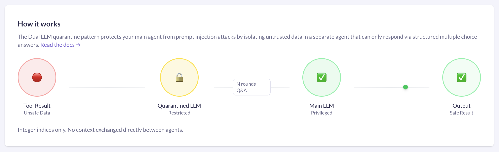
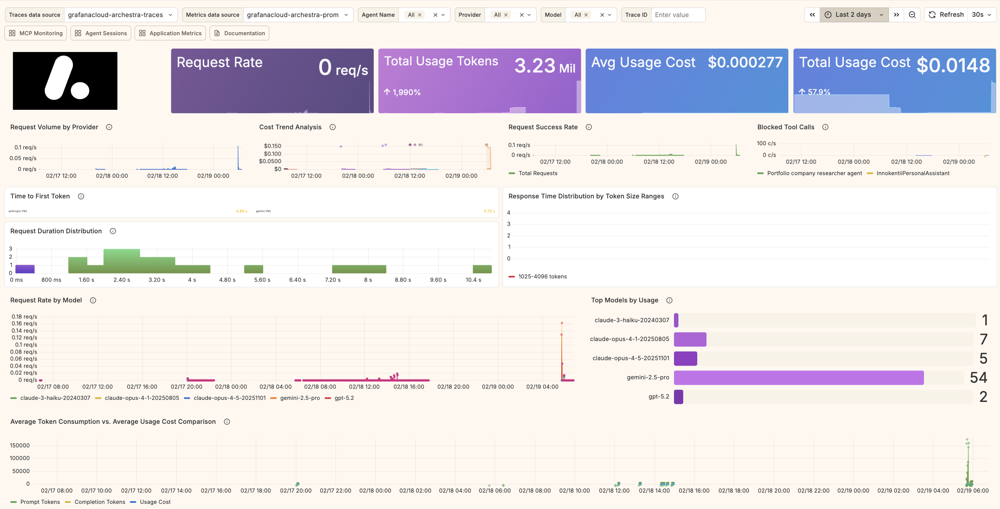
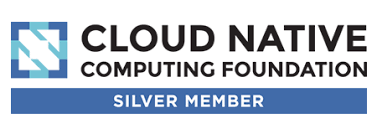

# MCP 原生安全 AI 平台

简化公司中的 AI 使用方式，提供用户友好的 MCP 工具箱、可观测性与控制能力，并建立在强大的安全基础之上。

<div align="center">

[](LICENSE)


[](https://github.com/archestra-ai/archestra/graphs/contributors)

<p align="center">
  <a href="https://www.archestra.ai/docs/platform-quickstart">快速开始</a>
  - <a href="https://github.com/archestra-ai/archestra/releases">发布版本</a>
  - <a href="https://archestra.ai/join-slack">Slack 社区</a>
</p>
</div>

_面向平台团队：_

- 缓解 MCP 混乱，将 MCP 服务器从个人机器迁移到集中式编排器
- 管理 MCP 对数据和凭据的访问与使用方式
- 降低数据外泄风险
- 管理 AI 成本
- AI 可观测性

_面向开发者：_

- 在整个组织范围内部署你的 MCP 服务器
- 构建并部署代理，而无需担心安全问题

_面向管理层：_

- 让整个组织中的技术和非技术用户都能一键启用 MCP
- 将 AI 成本最高降低 96%
- 全面掌握 AI 采用情况、使用情况和数据访问情况

## 🚀 使用 Docker 快速开始

```
docker pull archestra/platform:latest;
docker run -p 9000:9000 -p 3000:3000 \
  -e ARCHESTRA_QUICKSTART=true \
  -v /var/run/docker.sock:/var/run/docker.sock \
  -v archestra-postgres-data:/var/lib/postgresql/data \
  -v archestra-app-data:/app/data \
  archestra/platform;
```

[完整快速开始指南 →](https://archestra.ai/docs/platform-quickstart)

## 👩‍💻 类 ChatGPT 的 MCP 聊天

🎁 附带企业私有的全公司提示词注册表！

<div align="center">

</div>

## 📋 带治理能力的私有 MCP 注册表

将 MCP 添加到你的私有注册表中，与团队共享：支持自托管和远程、自建和第三方。

[了解更多关于私有 MCP 注册表 →](https://archestra.ai/docs/platform-private-registry)

<div align="center">

</div>

## ☁️ Kubernetes 原生 MCP 编排器

在 Kubernetes 中运行 MCP 服务器，并管理其状态、API 密钥和 OAuth。

[了解更多关于 MCP 编排器 →](https://archestra.ai/docs/platform-orchestrator)

<div align="center">

</div>

## 🤖 安全子代理

将危险的工具响应与主代理隔离，防止提示词注入。

[了解更多关于 Dual LLM →](https://archestra.ai/docs/platform-dual-llm)

<div align="center">

</div>

## 🚫 使用非概率式安全机制防止数据外泄

模型可能会通过 MCP 不受控地摄入提示词注入内容（读取你的收件箱、读取你的 GitHub issues、读取客户咨询），并据此执行操作，最终导致数据外泄。

[了解更多关于工具护栏 →](https://archestra.ai/docs/platform-ai-tool-guardrails) | [致命三联征 →](https://archestra.ai/docs/platform-lethal-trifecta)

Archestra 安全引擎实时演示：阻止数据从私有 GitHub 仓库泄露到公共仓库：
[](https://www.youtube.com/watch?v=SkmluS-xzmM&t=2155s)

延伸阅读：[Simon Willison](https://simonwillison.net/2025/Jun/16/the-lethal-trifecta/)、[The Economist](https://www.economist.com/leaders/2025/09/25/how-to-stop-ais-lethal-trifecta)

攻击示例：
[ChatGPT](https://simonwillison.net/2023/Apr/14/new-prompt-injection-attack-on-chatgpt-web-version-markdown-imag/) （2023 年 4 月）、[ChatGPT Plugins](https://simonwillison.net/2023/May/19/chatgpt-prompt-injection/) （2023 年 5 月）、[Google Bard](https://simonwillison.net/2023/Nov/4/hacking-google-bard-from-prompt-injection-to-data-exfiltration/) （2023 年 11 月）、[Writer.com](https://simonwillison.net/2023/Dec/15/writercom-indirect-prompt-injection/) （2023 年 12 月）、[Amazon Q](https://simonwillison.net/2024/Jan/19/aws-fixes-data-exfiltration/) （2024 年 1 月）、[Google NotebookLM](https://simonwillison.net/2024/Apr/16/google-notebooklm-data-exfiltration/) （2024 年 4 月）、[GitHub Copilot Chat](https://simonwillison.net/2024/Jun/16/github-copilot-chat-prompt-injection/) （2024 年 6 月）、[Google AI Studio](https://simonwillison.net/2024/Aug/7/google-ai-studio-data-exfiltration-demo/) （2024 年 8 月）、[Microsoft Copilot](https://simonwillison.net/2024/Aug/14/living-off-microsoft-copilot/) （2024 年 8 月）、[Slack](https://simonwillison.net/2024/Aug/20/data-exfiltration-from-slack-ai/) （2024 年 8 月）、[Mistral Le Chat](https://simonwillison.net/2024/Oct/22/imprompter/) （2024 年 10 月）、[xAI's Grok](https://simonwillison.net/2024/Dec/16/security-probllms-in-xais-grok/) （2024 年 12 月）、[Anthropic's Claude iOS app](https://simonwillison.net/2024/Dec/17/johann-rehberger/) （2024 年 12 月）、[ChatGPT Operator](https://simonwillison.net/2025/Feb/17/chatgpt-operator-prompt-injection/) （2025 年 2 月）、[Notion 3.0](https://www.codeintegrity.ai/blog/notion)（2024 年 9 月）。

## 💰 成本监控、限制与动态优化

支持按团队、按代理或按组织进行成本监控与限制。动态优化器可通过在较简单任务上自动切换到更便宜的模型，将成本最高降低 96%。

[了解更多关于成本与限制 →](https://archestra.ai/docs/platform-costs-and-limits)

<div align="center">

</div>

## 📊 可观测性

通过指标、追踪和日志，帮助你了解按组织、按代理和按团队划分的 token 与工具使用情况及性能表现。

[了解更多关于可观测性 →](https://archestra.ai/docs/platform-observability)

<div align="center">

</div>

## 👍 已做好生产准备

1. ✅ 极速性能，95 分位延迟 45ms：[性能与延迟基准测试 →](https://archestra.ai/docs/platform-performance-benchmarks)
2. ✅ [Terraform Provider →](https://github.com/archestra-ai/terraform-provider-archestra)
3. ✅ [Helm Chart →](https://archestra.ai/docs/platform-deployment#helm-deployment-recommended-for-production)

## 🤝 参与贡献

欢迎社区贡献！

- [贡献指南 →](https://archestra.ai/docs/contributing)
- [开发者快速开始 →](https://archestra.ai/docs/platform-developer-quickstart)
- [安全与漏洞赏金计划 →](https://archestra.ai/docs/security)

感谢你的贡献，并持续让 <b>Archestra</b> 变得更好，<b>你非常棒</b> 🫶

<a href="https://github.com/archestra-ai/archestra/graphs/contributors">
  
</a>

---

<div align="center">
  <br />
  <a href="https://www.archestra.ai/blog/archestra-joins-cncf-linux-foundation"></a>
  &nbsp;&nbsp;&nbsp;&nbsp;&nbsp;&nbsp;
  <a href="https://www.archestra.ai/blog/archestra-joins-cncf-linux-foundation"></a>
</div>
