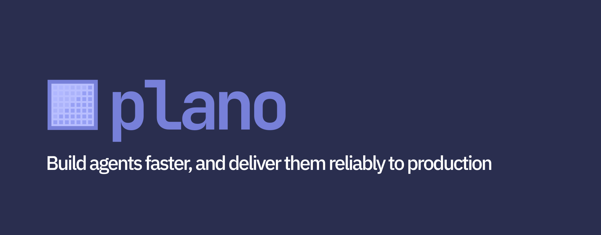
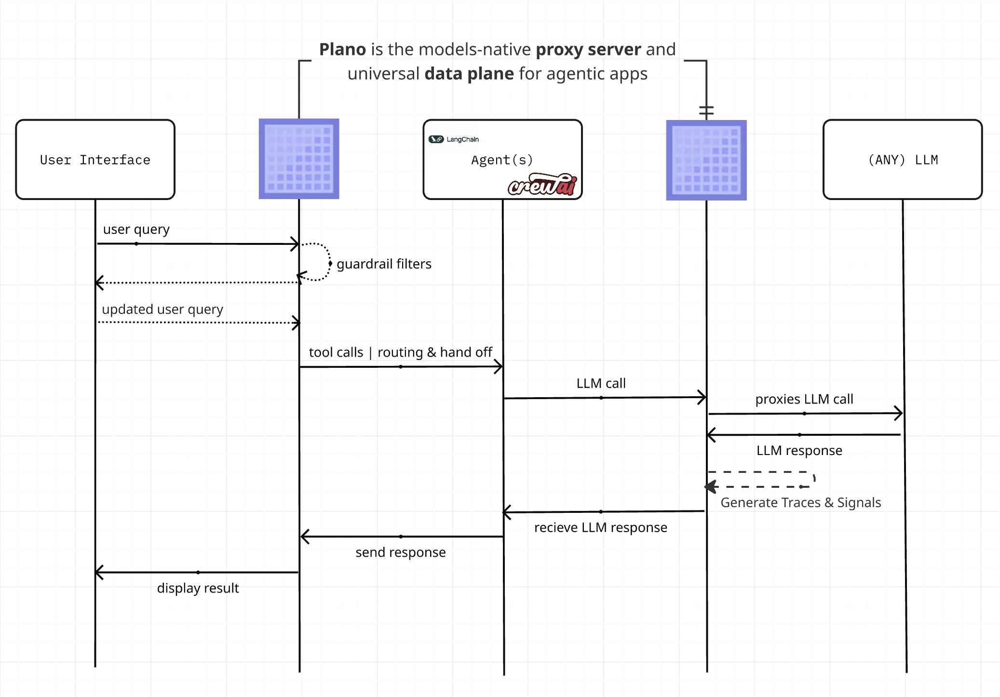
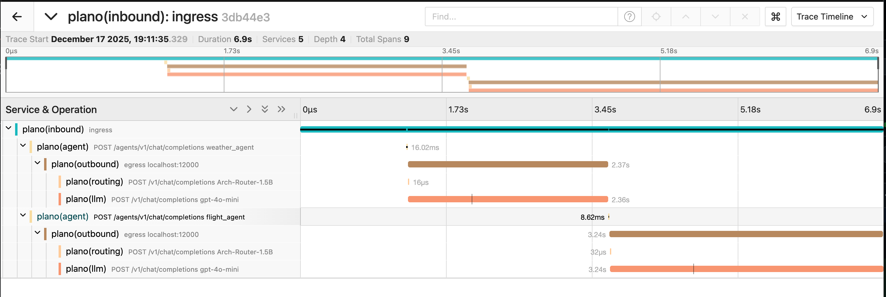

<div align="center">
  
</div>
<div align="center">

 _面向智能体应用的 AI 原生代理服务器与数据平面。_<br><br>
 Plano 将繁琐的基础管线工作抽离出来，使你摆脱脆弱的框架抽象，把不应在每个代码库中重复定制的能力集中起来，例如智能体路由与编排、用于持续改进的丰富智能体信号与追踪、安全与审核的护栏过滤器，以及实现模型灵活性的智能 LLM 路由 API。你可以使用任意语言或 AI 框架，更快将智能体交付到生产环境。

[快速开始指南](https://docs.planoai.dev/get_started/quickstart.html) •
[使用 Plano 构建智能体应用](#Build-Agentic-Apps-with-Plano) •
[文档](https://docs.planoai.dev) •
[联系我们](#Contact)

[](https://github.com/katanemo/plano/actions/workflows/ci.yml)
[](https://github.com/katanemo/plano/actions/workflows/docker-push-main.yml)
[](https://github.com/katanemo/plano/actions/workflows/static.yml)

如果你觉得 Plano 有帮助，请给仓库点个 Star ⭐️，新版本和更新会最先发布在这里。
</div>

# 概览
构建智能体演示很容易。要将智能体应用安全、可靠、可重复地交付到生产环境却很难。快速试做带来的兴奋过去后，你最终还是得构建那些通向生产环境的“隐藏中间件”：用于找到正确智能体的路由逻辑、安全与审核的护栏钩子、支持持续学习的评估与可观测性胶水层，以及散落在框架和应用代码中的模型或提供商差异处理。

Plano 通过将核心交付关注点迁移到统一的进程外数据平面来解决这一问题。

- **🚦 Orchestration:** 在智能体之间进行低延迟编排；新增智能体时无需修改应用代码。
- **🔗 Model Agility:** 支持[按模型名称、别名（语义名称）或通过偏好自动路由](#use-plano-as-a-llm-router)。
- **🕵 Agentic Signals&trade;:** 无需编写代码即可采集 [Signals](https://docs.planoai.dev/concepts/signals.html) 以及跨每个智能体的 OTEL traces/metrics。
- **🛡️ Moderation & Memory Hooks:** 通过 [Filter Chains](https://docs.planoai.dev/concepts/filter_chain.html) 一致地构建越狱防护、添加审核策略和记忆能力。

Plano 将重复性的基础管线工作从你的框架中抽离出来，让你能够专注于最重要的部分：智能体应用的核心产品逻辑。Plano 由[业界领先的 LLM 研究](https://planoai.dev/research)提供支持，并由其核心贡献者基于 [Envoy](https://envoyproxy.io) 构建，这些贡献者曾为现代工作负载打造大规模关键基础设施。

**高层网络时序图**：


**跳转到我们的 [docs](https://docs.planoai.dev)**，了解如何使用 Plano 提升你的智能体应用的速度、安全性和可观测性。

> [!IMPORTANT]
> Plano 和 Arch 系列 LLM（例如 Plano-Orchestrator-4B、Arch-Router 等）目前在美国中部区域免费托管，旨在为你提供出色的 Plano 初次运行开发体验。若要扩展并运行于生产环境中，你可以选择在本地运行这些 LLM，或通过 [Discord](https://discord.gg/pGZf2gcwEc) 联系我们获取 API keys。

---

<a id="Build-Agentic-Apps-with-Plano"></a>

## 使用 Plano 构建智能体应用

Plano 以模块化构建块的方式处理**编排、模型管理和可观测性**，让你只配置自己需要的部分（用于智能体编排和护栏的边缘代理，或从你的服务进行 LLM 路由，或两者同时使用），从而能自然融入现有架构。下面是一个使用 Plano 构建的简单多智能体旅行助手示例，展示了这三项核心能力。

> 📁 **完整可运行代码：** 请查看 [`demos/agent_orchestration/travel_agents/`](demos/agent_orchestration/travel_agents/)，其中包含可在本地运行的完整天气和航班智能体。

### 1. 在 YAML 中定义你的智能体

```yaml
# config.yaml
version: v0.3.0

# 你声明的内容：Agent URLs 和自然语言描述
# 你无需编写的内容：意图分类器、路由逻辑、模型回退、提供商适配器或追踪埋点

agents:
  - id: weather_agent
    url: http://localhost:10510
  - id: flight_agent
    url: http://localhost:10520

model_providers:
  - model: openai/gpt-4o
    access_key: $OPENAI_API_KEY
    default: true
  - model: anthropic/claude-3-5-sonnet
    access_key: $ANTHROPIC_API_KEY

listeners:
  - type: agent
    name: travel_assistant
    port: 8001
    router: plano_orchestrator_v1  # 由我们的 4B 参数路由模型驱动。你也可以改用其他模型
    agents:
      - id: weather_agent
        description: |
          获取全球任意城市的实时天气和预报。
          处理："What's the weather in Paris?", "Will it rain in Tokyo?"

      - id: flight_agent
        description: |
          搜索机场之间的航班，包括实时状态和时刻表。
          处理："Flights from NYC to LA", "Show me flights to Seattle"

tracing:
  random_sampling: 100  # 自动采集 traces 以用于评估
```

### 2. 编写简单的智能体代码

你的智能体本质上就是实现 OpenAI 兼容 chat completions endpoint 的 HTTP 服务器。可以使用任意语言或框架：

```python
# weather_agent.py
from fastapi import FastAPI, Request
from fastapi.responses import StreamingResponse
from openai import AsyncOpenAI

app = FastAPI()

# 指向 Plano 的 LLM gateway，它会为你处理模型路由
llm = AsyncOpenAI(base_url="http://localhost:12001/v1", api_key="EMPTY")

@app.post("/v1/chat/completions")
async def chat(request: Request):
    body = await request.json()
    messages = body.get("messages", [])
    days = 7

    # 你的智能体逻辑：获取数据、调用 APIs、运行工具
    # 完整实现见 demos/agent_orchestration/travel_agents/
    weather_data = await get_weather_data(request, messages, days)

    # 通过 Plano 将响应流式返回
    async def generate():
        stream = await llm.chat.completions.create(
            model="openai/gpt-4o",
            messages=[{"role": "system", "content": f"Weather: {weather_data}"}, *messages],
            stream=True
        )
        async for chunk in stream:
            yield f"data: {chunk.model_dump_json()}\n\n"

    return StreamingResponse(generate(), media_type="text/event-stream")
```

### 3. 启动 Plano 并查询你的智能体

**前置条件：** 请遵循[前置条件指南](https://docs.planoai.dev/get_started/quickstart.html#prerequisites)安装 Plano 并完成环境设置。

```bash
# 启动 Plano
planoai up config.yaml
...

# 发起查询，Plano 会在一次对话中智能路由到两个智能体
curl http://localhost:8001/v1/chat/completions \
  -H "Content-Type: application/json" \
  -d '{
    "model": "gpt-4o",
    "messages": [
      {"role": "user", "content": "I want to travel from NYC to Paris next week. What is the weather like there, and can you find me some flights?"}
    ]
  }'
# → Plano 将请求路由到 weather_agent 以获取巴黎天气 ✓
# → 然后再路由到 flight_agent 以获取 NYC → Paris 航班 ✓
# → 返回完整旅行计划，其中包含天气信息和航班选项
```

### 4. 免费获得可观测性和模型灵活性

每个请求都会通过 OpenTelemetry 进行端到端追踪，无需任何埋点代码。



### 你无需构建的内容

| 基础设施关注点 | 没有 Plano | 使用 Plano |
|---------|---------------|------------|
| **Agent Orchestration** | 编写意图分类器 + 路由逻辑 | 在 YAML 中声明智能体描述 |
| **Model Management** | 处理各提供商 API 的差异细节 | 使用统一 LLM APIs 和状态管理 |
| **Rich Tracing** | 为每个服务编写 OTEL 埋点 | 自动获得端到端 traces 和 logs |
| **Learning Signals** | 构建采集/导出 spans 的管道 | 零代码智能体信号 |
| **Adding Agents** | 更新路由代码、测试、重新部署 | 添加到配置中并重启 |

**为何高效：** Plano 使用专门构建的轻量级 LLM（例如我们的 4B 参数编排器）来进行路由，而不是依赖重量级框架或 GPT-4，因此能够以更低的成本和延迟提供生产级路由能力。

---

<a id="Contact"></a>

## 联系我们
如果你想联系我们，请加入我们的 [discord server](https://discord.gg/pGZf2gcwEc)。我们会积极关注那里并提供支持。

## 开始使用

准备好试用 Plano 了吗？请查看我们的完整文档：

- **[快速开始指南](https://docs.planoai.dev/get_started/quickstart.html)** - 几分钟内快速开始
- **[LLM 路由](https://docs.planoai.dev/guides/llm_router.html)** - 按模型名、别名或智能偏好进行路由
- **[智能体编排](https://docs.planoai.dev/guides/orchestration.html)** - 构建多智能体工作流
- **[过滤器链](https://docs.planoai.dev/concepts/filter_chain.html)** - 添加护栏、审核和记忆钩子
- **[Prompt Targets](https://docs.planoai.dev/concepts/prompt_target.html)** - 将 prompts 转换为确定性的 API 调用
- **[可观测性](https://docs.planoai.dev/guides/observability/observability.html)** - Traces、metrics 和 logs

## 贡献
我们非常期待你对我们的 [Roadmap](https://github.com/orgs/katanemo/projects/1) 提供反馈，也欢迎你为 **Plano** 做出贡献！无论你是在修复 bug、添加新功能、改进文档还是编写教程，我们都非常感谢你的帮助。更多细节请访问我们的 [Contribution Guide](CONTRIBUTING.md)。

如果你觉得 Plano 有帮助，请给仓库点个 Star ⭐️，新版本和更新会最先发布在这里。
