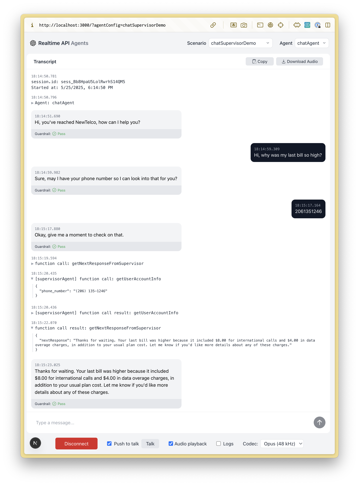
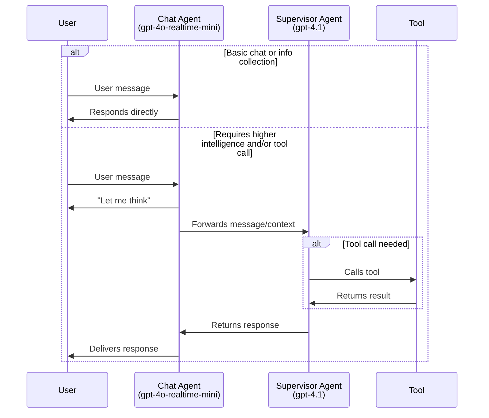
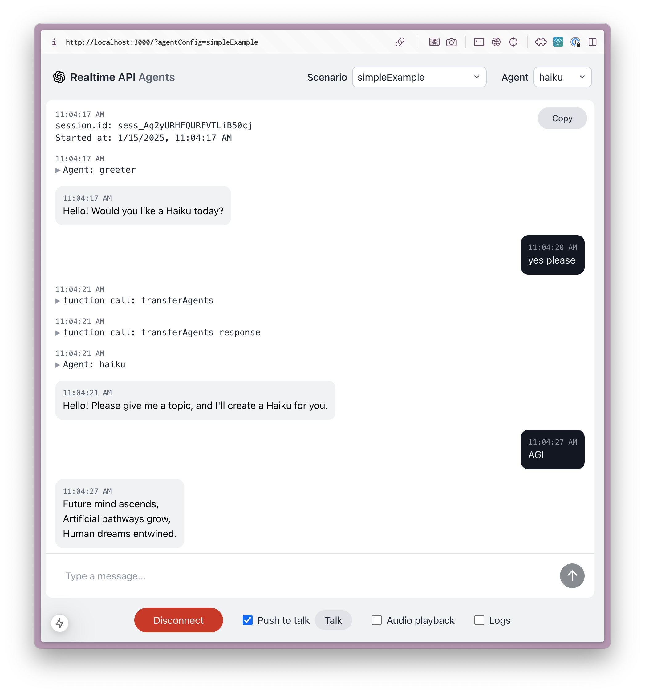
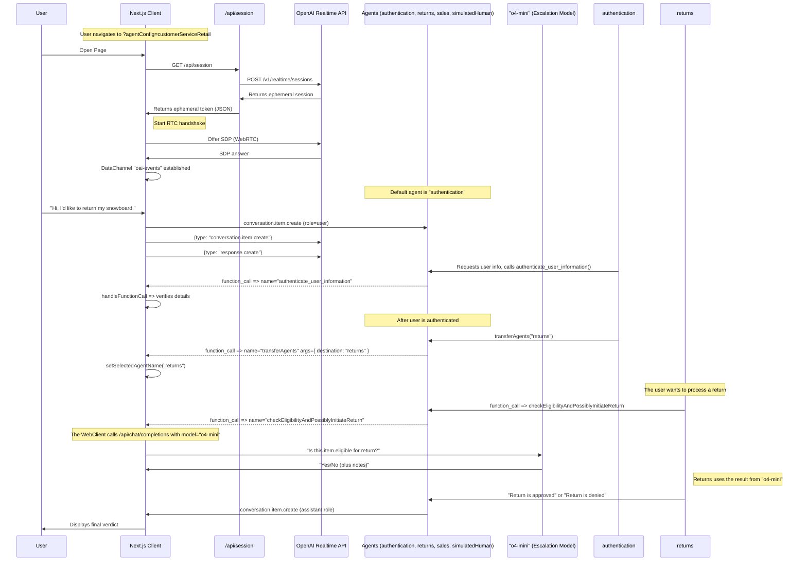

# Realtime API Agents 演示

这是一个展示更高级语音代理模式的演示项目，使用了 OpenAI Realtime API 和 OpenAI Agents SDK。

## 关于 OpenAI Agents SDK

本项目使用 [OpenAI Agents SDK](https://github.com/openai/openai-agents-js)，这是一个用于构建、管理和部署高级 AI 代理的工具包。该 SDK 提供：

- 用于定义代理行为与工具集成的统一接口。
- 内置对代理编排、状态管理和事件处理的支持。
- 可与 OpenAI Realtime API 轻松集成，以实现低延迟的流式交互。
- 可扩展的多代理协作、交接、工具使用与防护机制。

如需完整文档、指南和 API 参考，请参阅官方的 [OpenAI Agents SDK Documentation](https://github.com/openai/openai-agents-js#readme)。

**注意：** 如需不使用 OpenAI Agents SDK 的版本，请参阅 [branch without-agents-sdk](https://github.com/openai/openai-realtime-agents/tree/without-agents-sdk)。

这里演示了两种主要模式：
1. **Chat-Supervisor：** 一个基于 realtime 的聊天代理与用户交互并处理基础任务，而一个更智能的、基于文本的监督模型（例如 `gpt-4.1`）被广泛用于工具调用和更复杂的响应。这种方法提供了易于上手的路径和高质量回答，但会带来少量延迟增加。
2. **Sequential Handoff：** 专门化代理（由 realtime api 驱动）会按顺序接手用户，以处理特定用户意图。这非常适合客户服务场景，在此场景中，用户意图可以由擅长特定领域的专家模型顺序处理。这有助于避免将所有指令和工具都塞进单个代理中，因为那样会降低性能。

## 设置

- 这是一个 Next.js typescript 应用。使用 `npm i` 安装依赖。
- 将你的 `OPENAI_API_KEY` 添加到环境变量中。你可以把它加到 `.bash_profile` 或等效文件中，或者将 `.env.sample` 复制为 `.env` 后在其中添加。
- 使用 `npm run dev` 启动服务器
- 在浏览器中打开 [http://localhost:3000](http://localhost:3000)。默认应加载 `chatSupervisor` Agent Config。
- 你可以通过右上角的 “Scenario” 下拉菜单切换示例。

# Agentic 模式 1：Chat-Supervisor

这一模式在 [chatSupervisor](src/app/agentConfigs/chatSupervisor/index.ts) Agent Config 中演示。聊天代理使用 realtime 模型与用户对话并处理基础任务，例如向用户打招呼、闲聊和收集信息；而一个更智能的、基于文本的监督模型（例如 `gpt-4.1`）则被广泛用于处理工具调用和更有挑战性的响应。你可以根据需要将特定任务“选择加入”聊天代理，从而控制决策边界。

视频讲解：[https://x.com/noahmacca/status/1927014156152058075](https://x.com/noahmacca/status/1927014156152058075)

## 示例

*在这段交互中，请注意系统会立即回应以收集电话号码，并将工具调用以及回复生成延后交由 supervisor agent 处理。从 “give me a moment to check on that.” 被说完，到 “Thanks for waiting. Your last bill...” 开始之间，大约有 2 秒。*

## 示意图


## 优势
- **上手更简单。** 如果你已经有一个性能良好的基于文本的聊天代理，你可以将相同的提示词和工具集交给 supervisor agent，再对 chat agent 的提示词做一些调整，就能得到一个表现与文本代理相当的自然语音代理。
- **平滑过渡到完整的 realtime 代理**：你不必一次性将整个代理切换到 realtime api，而是可以一次迁移一个任务，在部署到生产环境前逐项进行验证和建立信任。
- **高智能**：在语音代理中，你可以受益于像 `gpt-4.1` 这样的模型所具备的高智能、优秀工具调用能力和指令遵循能力。
- **更低成本**：如果 chat agent 只用于基础任务，你可以使用 realtime-mini 模型；即便与 GPT-4.1 组合使用，通常也会比使用完整的 4o-realtime 模型更便宜。
- **用户体验**：相比拼接式模型架构（stitched model architecture），这种方式提供了更自然的对话体验；在拼接式模型架构中，用户说完话后响应延迟通常为 1.5 秒甚至更长。而在这个架构中，模型会立刻回应用户，即使它需要借助 supervisor agent。
  - 不过，更多助手回复会以 “Let me think” 开头，而不是立即给出完整回答。

## 修改为适用于你自己的代理
1. 更新 [supervisorAgent](src/app/agentConfigs/chatSupervisorDemo/supervisorAgent.ts)。
  - 如果你已经有现成的文本代理提示词和工具，请将它们添加进去。这里应包含你的语音代理逻辑的“核心内容”，并且应非常明确说明它该做什么、不该做什么，以及应当如何具体响应。请将这些信息添加到 `==== Domain-Specific Agent Instructions ====` 下方。
  - 你很可能还需要将这个提示词调整得更适合语音场景，例如要求表达简洁并避免长列表。
2. 更新 [chatAgent](src/app/agentConfigs/chatSupervisor/index.ts)。
  - 用你自己的语气、问候语等自定义 chatAgent 指令。
  - 将你的工具定义添加到 `chatAgentInstructions` 中。我们建议使用简短的 yaml 描述而不是 json，以避免模型困惑并试图直接调用工具。
  - 你可以通过向 `# Allow List of Permitted Actions` 部分添加新条目来修改决策边界。
3. 为了降低成本，可尝试为 chatAgent 使用 `gpt-4o-mini-realtime`，以及/或者为 supervisor model 使用 `gpt-4.1-mini`。为了在特别困难或高风险的任务上最大化智能程度，可以考虑在 supervisor prompt 中以延迟为代价加入 chain-of-thought，或者增加一个基于推理模型、使用 `o4-mini` 的额外 supervisor。

# Agentic 模式 2：Sequential Handoffs

这一模式受到 [OpenAI Swarm](https://github.com/openai/swarm) 的启发，涉及在多个专门化代理之间按顺序交接用户。交接由模型决定，并通过工具调用进行协调；可用的交接路径则在代理图中显式定义。一次交接会触发 `session.update` 事件，并带入新的指令和工具。该模式非常适合使用专家代理来处理多种用户意图，因为每个代理都可能拥有较长的指令和大量工具。

这里有一个展示其工作方式的[视频讲解](https://x.com/OpenAIDevs/status/1880306081517432936)。你应该能够使用这个仓库在不到 20 分钟内原型化你自己的多代理 realtime 语音应用！


*在这个简单示例中，用户会从 greeter agent 被转交给 haiku agent。下方给出了这一流程的简单完整配置。*

配置位于 `src/app/agentConfigs/simpleExample.ts`
```typescript
import { RealtimeAgent } from '@openai/agents/realtime';

// Define agents using the OpenAI Agents SDK
export const haikuWriterAgent = new RealtimeAgent({
  name: 'haikuWriter',
  handoffDescription: 'Agent that writes haikus.', // Context for the agent_transfer tool
  instructions:
    'Ask the user for a topic, then reply with a haiku about that topic.',
  tools: [],
  handoffs: [],
});

export const greeterAgent = new RealtimeAgent({
  name: 'greeter',
  handoffDescription: 'Agent that greets the user.',
  instructions:
    "Please greet the user and ask them if they'd like a haiku. If yes, hand off to the 'haikuWriter' agent.",
  tools: [],
  handoffs: [haikuWriterAgent], // Define which agents this agent can hand off to
});

// An Agent Set is just an array of the agents that participate in the scenario
export default [greeterAgent, haikuWriterAgent];
```
## CustomerServiceRetail 流程

这是一个更复杂、也更具代表性的实现，用于说明客户服务流程，具备以下特性：
- 更复杂的代理图，包含用于用户身份验证、退货、销售的代理，以及一个用于升级处理的占位 human agent。
- [returns](https://github.com/openai/openai-realtime-agents/blob/60f4effc50a539b19b2f1fa4c38846086b58c295/src/app/agentConfigs/customerServiceRetail/returns.ts#L233) agent 会将流程升级给 `o4-mini`，以验证并发起退货，作为高风险决策的示例，其模式与上文类似。
- 通过提示模型遵循状态机，例如逐字符确认姓名和电话号码，以准确收集此类信息并验证用户身份。
  - 若要测试这个流程，可以说你想退掉你的 snowboard，然后按照必要提示继续！

配置位于 [src/app/agentConfigs/customerServiceRetail/index.ts](src/app/agentConfigs/customerServiceRetail/index.ts)。
```javascript
import authentication from "./authentication";
import returns from "./returns";
import sales from "./sales";
import simulatedHuman from "./simulatedHuman";
import { injectTransferTools } from "../utils";

authentication.downstreamAgents = [returns, sales, simulatedHuman];
returns.downstreamAgents = [authentication, sales, simulatedHuman];
sales.downstreamAgents = [authentication, returns, simulatedHuman];
simulatedHuman.downstreamAgents = [authentication, returns, sales];

const agents = injectTransferTools([
  authentication,
  returns,
  sales,
  simulatedHuman,
]);

export default agents;
```

## 示意图

该图展示了在 `src/app/agentConfigs/customerServiceRetail/` 中定义的一个更高级交互流程，包括详细事件。

<details>
<summary><strong>Show CustomerServiceRetail Flow Diagram</strong></summary>



</details>

# 其他信息
## 后续步骤
- 你可以复制这些模板来构建自己的多代理语音应用！创建新的 agent set config 后，将其添加到 `src/app/agentConfigs/index.ts`，然后你就应该能在 UI 的 “Scenario” 下拉菜单中选择它。
- 每个 agentConfig 都可以定义 instructions、tools 和 toolLogic。默认情况下，所有工具调用都只返回 `True`；除非你定义了 toolLogic，它会运行你特定的工具逻辑，并向对话返回一个对象（例如检索到的 RAG 上下文）。
- 如果你希望参考 customerServiceRetail 中展示的约定来创建自己的提示词，包括定义状态机，我们在[这里](src/app/agentConfigs/voiceAgentMetaprompt.txt)提供了一个 metaprompt，你也可以使用我们的 [Voice Agent Metaprompter GPT](https://chatgpt.com/g/g-678865c9fb5c81918fa28699735dd08e-voice-agent-metaprompt-gpt)。

## 输出防护机制
在显示到 UI 之前，助手消息会先经过安全与合规检查。现在，guardrail 检查直接位于 `src/app/App.tsx` 中：当 `response.text.delta` 流开始时，我们会将消息标记为 **IN_PROGRESS**；当服务器发出 `guardrail_tripped` 或 `response.done` 时，我们会分别将消息标记为 **FAIL** 或 **PASS**。如果你想更改审核的触发方式或展示方式，请在 `App.tsx` 中搜索 `guardrail_tripped` 并调整那里的逻辑。

## UI 导航
- 你可以在 Scenario 下拉菜单中选择代理场景，并通过 Agent 下拉菜单切换到特定代理。
- 对话转录位于左侧，其中包括工具调用、工具调用响应和代理切换。点击可展开非消息元素。
- 事件日志位于右侧，同时显示客户端和服务器事件。点击可查看完整 payload。
- 在底部，你可以断开连接、在自动语音活动检测与 PTT 之间切换、关闭音频播放以及切换日志显示。

## 拉取请求

欢迎提交 issue 或 pull request，我们会尽力进行评审。这个仓库的宗旨是展示新型 agentic flow 的核心逻辑；超出这一核心范围的 PR 很可能不会被合并。

# 核心贡献者
- Noah MacCallum - [noahmacca](https://x.com/noahmacca)
- Ilan Bigio - [ibigio](https://github.com/ibigio)
- Brian Fioca - [bfioca](https://github.com/bfioca)
