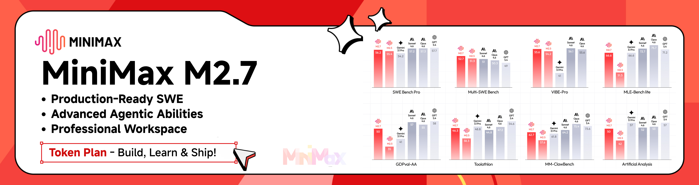

<div align="center">

# Open Claude Cowork

[](https://github.com/DevAgentForge/Claude-Cowork/releases)
[](https://github.com/DevAgentForge/Claude-Cowork/releases)

[简体中文](README_ZH.md)

</div>

## ❤️ 合作

[](https://platform.minimax.io/subscribe/coding-plan?code=5q2B2ljfdw&source=link)

MiniMax M2.7 是一款专为代理执行、SOTA 性能和实际生产力而构建的前沿 LLM——它能够规划、编码、使用工具并端到端完成复杂工作流，然后迭代改进自身性能。它在软件工程和代理基准测试上取得了最先进的结果（例如 SWE-Pro 约 56%，在 VIBE、Terminal Bench 和代理评估中表现强劲），同时将同样的能力扩展到办公领域——以交付级别的准确性创建和编辑高质量的 Word、Excel 和 PowerPoint 文件。M2.7 为长程任务而设计，结合深度推理、工具编排和可靠的多步执行，超越静态模型，向持续优化技术工作流和日常生产力工作流的系统迈进。

[点击](https://platform.minimax.io/subscribe/coding-plan?code=5q2B2ljfdw&source=link)获取 MiniMax Token 计划的独家 12% 折扣优惠！

## Agent Cowork

Agent Cowork 是 Claude Cowork 的开源替代方案——一个桌面 AI 助手，可帮助编程、文件管理以及任何你能描述的任务。

> 不仅是一个 GUI。  
> 一个真正的 AI 协作伙伴。  
> 无需学习 Claude Agent SDK——只需创建任务并选择执行路径。

## ✨ 为什么选择 Agent Cowork？

Claude Code 功能强大——但它**只能在终端中运行**。

这意味着：
- ❌ 复杂任务没有可视反馈
- ❌ 难以追踪多个会话
- ❌ 工具输出不方便查看

**Agent Cowork 解决了这些问题：**

- 🖥️ 作为**原生桌面应用**运行
- 🤖 作为你的 **AI 协作伙伴**处理任何任务
- 🔁 复用你**现有的 `~/.claude/settings.json`**
- 无需开发环境或安装 Claude Code。

## 🚀 快速开始

### 方式一：下载发布版

👉 [前往 Releases](https://github.com/DevAgentForge/agent-cowork/releases)

### 方式二：从源码构建

#### 前提条件

- [Bun](https://bun.sh/) 或 Node.js 22+
- 已安装并完成认证的 [Claude Code](https://docs.anthropic.com/en/docs/claude-code)

```bash
#### 克隆仓库
git clone https://github.com/DevAgentForge/agent-cowork.git
cd agent-cowork

#### 安装依赖
bun install

#### 以开发模式运行
bun run dev

#### 或构建生产版本
```

```bash
bun run dist:mac-arm64    # macOS Apple Silicon (M1/M2/M3)
bun run dist:mac-x64      # macOS Intel
bun run dist:win          # Windows
bun run dist:linux        # Linux
```

## 示例
一个整理本地文件夹的示例：

https://github.com/user-attachments/assets/8ce58c8b-4024-4c01-82ee-f8d8ed6d4bba

## 🛠 开发

```bash
#### 启动开发服务器（热重载）
bun run dev

#### 类型检查 / 构建
bun run build
```

## 🗺 路线图

计划中的功能：

todo

## 🤝 贡献

欢迎提交 Pull Request。

1. Fork 本仓库
2. 创建你的功能分支
3. 提交你的更改
4. 发起 Pull Request

请仅做最小的改动。

## ⭐ 最后的话

如果你曾经想要：

* 一个持久的桌面 AI 协作伙伴
* 直观了解 Claude 的工作方式
* 跨项目便捷的会话管理

这个项目就是为你而建的。

👉 **如果对你有帮助，请给个 Star。**

## 许可证

MIT
