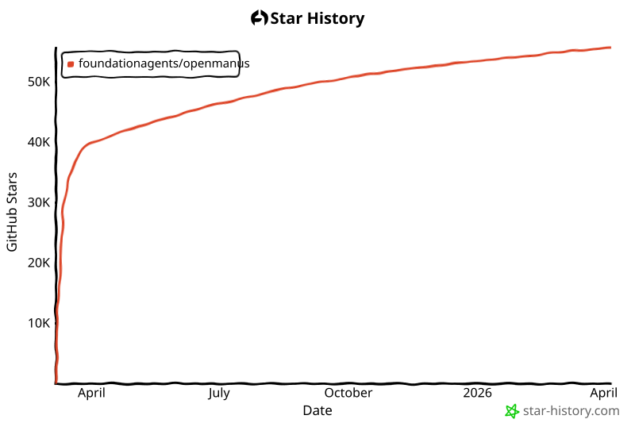

<p align="center">
  
</p>

English | [中文](README.zh-CN.md) | [한국어](README_ko.md) | [日本語](README_ja.md)

[](https://github.com/FoundationAgents/OpenManus/stargazers)
&ensp;
[](https://opensource.org/licenses/MIT) &ensp;
[](https://discord.gg/DYn29wFk9z)
[](https://huggingface.co/spaces/lyh-917/OpenManusDemo)
[](https://doi.org/10.5281/zenodo.15186407)

# 👋 OpenManus

Manus 很棒，但 OpenManus 无需 *邀请码* 就能实现任何想法 🛫！

我们的团队成员 [@Xinbin Liang](https://github.com/mannaandpoem) 和 [@Jinyu Xiang](https://github.com/XiangJinyu)（核心作者），以及 [@Zhaoyang Yu](https://github.com/MoshiQAQ)、[@Jiayi Zhang](https://github.com/didiforgithub) 和 [@Sirui Hong](https://github.com/stellaHSR)，我们来自 [@MetaGPT](https://github.com/geekan/MetaGPT)。原型在 3 小时内发布，我们正在持续构建中！

这是一个简单的实现，因此我们欢迎任何建议、贡献和反馈！

用 OpenManus 享受你自己的代理吧！

我们还很高兴地推出 [OpenManus-RL](https://github.com/OpenManus/OpenManus-RL)，这是一个专注于基于强化学习（RL）（如 GRPO）的 LLM 代理微调方法的开源项目，由 UIUC 和 OpenManus 的研究人员合作开发。

## 项目演示

<video src="https://private-user-images.githubusercontent.com/61239030/420168772-6dcfd0d2-9142-45d9-b74e-d10aa75073c6.mp4?jwt=eyJhbGciOiJIUzI1NiIsInR5cCI6IkpXVCJ9.eyJpc3MiOiJnaXRodWIuY29tIiwiYXVkIjoicmF3LmdpdGh1YnVzZXJjb250ZW50LmNvbSIsImtleSI6ImtleTUiLCJleHAiOjE3NDEzMTgwNTksIm5iZiI6MTc0MTMxNzc1OSwicGF0aCI6Ii82MTIzOTAzMC80MjAxNjg3NzItNmRjZmQwZDItOTE0Mi00NWQ5LWI3NGUtZDEwYWE3NTA3M2M2Lm1wND9YLUFtei1BbGdvcml0aG09QVdTNC1ITUFDLVNIQTI1NiZYLUFtei1DcmVkZW50aWFsPUFLSUFWQ09EWUxTQTUzUFFLNFpBJTJGMjAyNTAzMDclMkZ1cy1lYXN0LTElMkZzMyUyRmF3czRfcmVxdWVzdCZYLUFtei1EYXRlPTIwMjUwMzA3VDAzMjIzOVomWC1BbXotRXhwaXJlcz0zMDAmWC1BbXotU2lnbmF0dXJlPTdiZjFkNjlmYWNjMmEzOTliM2Y3M2VlYjgyNDRlZDJmOWE3NWZhZjE1MzhiZWY4YmQ3NjdkNTYwYTU5ZDA2MzYmWC1BbXotU2lnbmVkSGVhZGVycz1ob3N0In0.UuHQCgWYkh0OQq9qsUWqGsUbhG3i9jcZDAMeHjLt5T4" data-canonical-src="https://private-user-images.githubusercontent.com/61239030/420168772-6dcfd0d2-9142-45d9-b74e-d10aa75073c6.mp4?jwt=eyJhbGciOiJIUzI1NiIsInR5cCI6IkpXVCJ9.eyJpc3MiOiJnaXRodWIuY29tIiwiYXVkIjoicmF3LmdpdGh1YnVzZXJjb250ZW50LmNvbSIsImtleSI6ImtleTUiLCJleHAiOjE3NDEzMTgwNTksIm5iZiI6MTc0MTMxNzc1OSwicGF0aCI6Ii82MTIzOTAzMC80MjAxNjg3NzItNmRjZmQwZDItOTE0Mi00NWQ5LWI3NGUtZDEwYWE3NTA3M2M2Lm1wND9YLUFtei1BbGdvcml0aG09QVdTNC1ITUFDLVNIQTI1NiZYLUFtei1DcmVkZW50aWFsPUFLSUFWQ09EWUxTQTUzUFFLNFpBJTJGMjAyNTAzMDclMkZ1cy1lYXN0LTElMkZzMyUyRmF3czRfcmVxdWVzdCZYLUFtei1EYXRlPTIwMjUwMzA3VDAzMjIzOVomWC1BbXotRXhwaXJlcz0zMDAmWC1BbXotU2lnbmF0dXJlPTdiZjFkNjlmYWNjMmEzOTliM2Y3M2VlYjgyNDRlZDJmOWE3NWZhZjE1MzhiZWY4YmQ3NjdkNTYwYTU5ZDA2MzYmWC1BbXotU2lnbmVkSGVhZGVycz1ob3N0In0.UuHQCgWYkh0OQq9qsUWqGsUbhG3i9jcZDAMeHjLt5T4" controls="controls" muted="muted" class="d-block rounded-bottom-2 border-top width-fit" style="max-height:640px; min-height: 200px"></video>

## 安装

我们提供两种安装方式。推荐使用方式 2（使用 uv），安装速度更快，依赖管理更好。

### 方式 1：使用 conda

1. 创建新的 conda 环境：

```bash
conda create -n open_manus python=3.12
conda activate open_manus
```

2. 克隆仓库：

```bash
git clone https://github.com/FoundationAgents/OpenManus.git
cd OpenManus
```

3. 安装依赖：

```bash
pip install -r requirements.txt
```

### 方式 2：使用 uv（推荐）

1. 安装 uv（一个快速的 Python 包安装器和解析器）：

```bash
curl -LsSf https://astral.sh/uv/install.sh | sh
```

2. 克隆仓库：

```bash
git clone https://github.com/FoundationAgents/OpenManus.git
cd OpenManus
```

3. 创建新的虚拟环境并激活：

```bash
uv venv --python 3.12
source .venv/bin/activate  # Unix/macOS
# 或者在 Windows 上：
# .venv\Scripts\activate
```

4. 安装依赖：

```bash
uv pip install -r requirements.txt
```

### 浏览器自动化工具（可选）
```bash
playwright install
```

## 配置

OpenManus 需要配置所使用的 LLM API。请按以下步骤设置配置：

1. 在 `config` 目录下创建 `config.toml` 文件（可以从示例复制）：

```bash
cp config/config.example.toml config/config.toml
```

2. 编辑 `config/config.toml` 添加你的 API 密钥并自定义设置：

```toml
# 全局 LLM 配置
[llm]
model = "gpt-4o"
base_url = "https://api.openai.com/v1"
api_key = "sk-..."  # 替换为你的实际 API 密钥
max_tokens = 4096
temperature = 0.0

# 特定 LLM 模型的可选配置
[llm.vision]
model = "gpt-4o"
base_url = "https://api.openai.com/v1"
api_key = "sk-..."  # 替换为你的实际 API 密钥
```

## 快速开始

一行命令运行 OpenManus：

```bash
python main.py
```

然后在终端中输入你的想法！

对于 MCP 工具版本，你可以运行：
```bash
python run_mcp.py
```

对于不稳定的多代理版本，你也可以运行：

```bash
python run_flow.py
```

### 自定义添加多个代理

目前，除了通用的 OpenManus Agent 之外，我们还集成了 DataAnalysis Agent，适用于数据分析和数据可视化任务。你可以在 `config.toml` 的 `run_flow` 中添加此代理。

```toml
# run-flow 的可选配置
[runflow]
use_data_analysis_agent = true     # 默认禁用，改为 true 以激活
```
此外，你还需要安装相关依赖以确保代理正常运行：[详细安装指南](app/tool/chart_visualization/README.md##Installation)

## 如何贡献

我们欢迎任何友好的建议和有益的贡献！只需创建 issue 或提交 pull request 即可。

也可以通过📧邮件联系 @mannaandpoem：mannaandpoem@gmail.com

**注意**：提交 pull request 之前，请使用 pre-commit 工具检查你的更改。运行 `pre-commit run --all-files` 来执行检查。

## 社区群组
加入我们的飞书交流群，与其他开发者分享你的经验！

<div align="center" style="display: flex; gap: 20px;">
    
</div>

## Star 历史

[](https://star-history.com/#FoundationAgents/OpenManus&Date)

## 赞助商
感谢 [PPIO](https://ppinfra.com/user/register?invited_by=OCPKCN&utm_source=github_openmanus&utm_medium=github_readme&utm_campaign=link) 提供计算资源支持。
> PPIO：最具性价比且易于集成的 MaaS 和 GPU 云解决方案。

## 致谢

感谢 [anthropic-computer-use](https://github.com/anthropics/anthropic-quickstarts/tree/main/computer-use-demo)、[browser-use](https://github.com/browser-use/browser-use) 和 [crawl4ai](https://github.com/unclecode/crawl4ai) 为本项目提供了基础支持！

此外，我们感谢 [AAAJ](https://github.com/metauto-ai/agent-as-a-judge)、[MetaGPT](https://github.com/geekan/MetaGPT)、[OpenHands](https://github.com/All-Hands-AI/OpenHands) 和 [SWE-agent](https://github.com/SWE-agent/SWE-agent)。

我们还要感谢 stepfun（阶跃星辰）对我们 Hugging Face demo 空间的支持。

OpenManus 由来自 MetaGPT 的贡献者构建。衷心感谢这个代理社区！

## 引用
```bibtex
@misc{openmanus2025,
  author = {Xinbin Liang and Jinyu Xiang and Zhaoyang Yu and Jiayi Zhang and Sirui Hong and Sheng Fan and Xiao Tang and Bang Liu and Yuyu Luo and Chenglin Wu},
  title = {OpenManus: An open-source framework for building general AI agents},
  year = {2025},
  publisher = {Zenodo},
  doi = {10.5281/zenodo.15186407},
  url = {https://doi.org/10.5281/zenodo.15186407},
}
```
