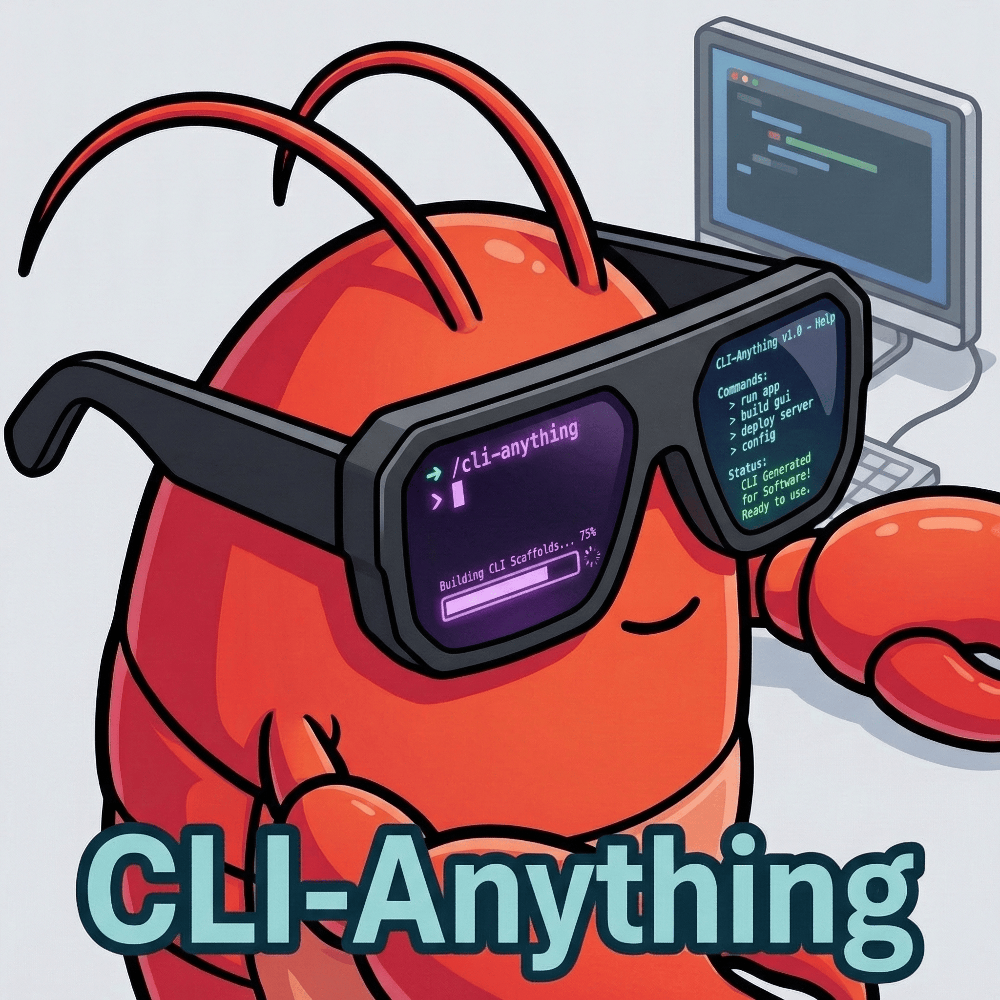
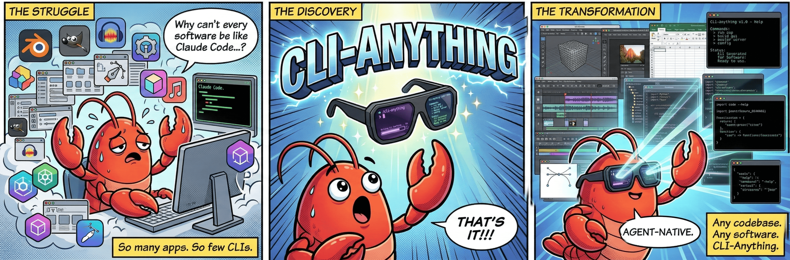
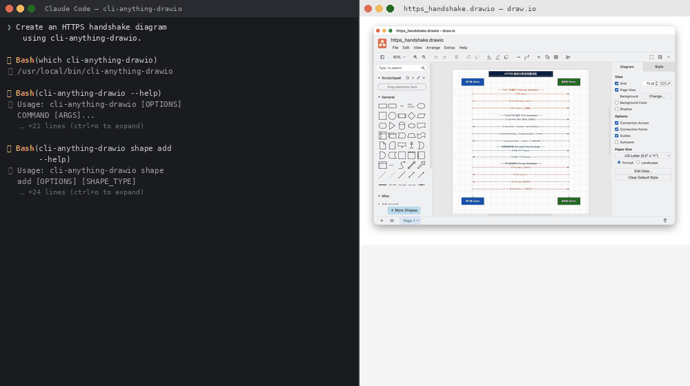
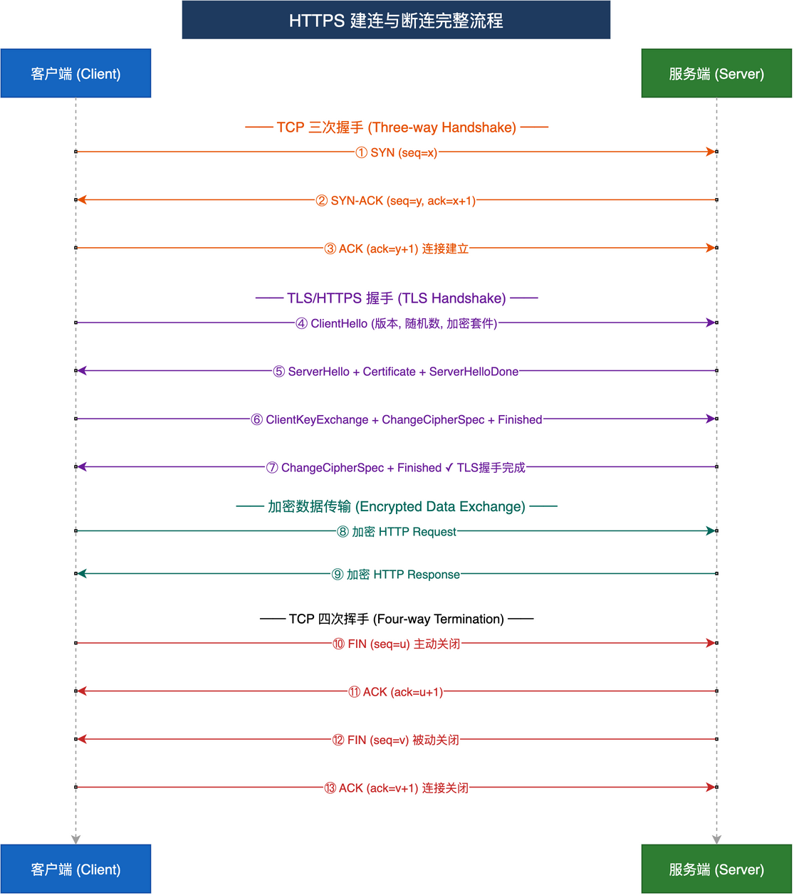
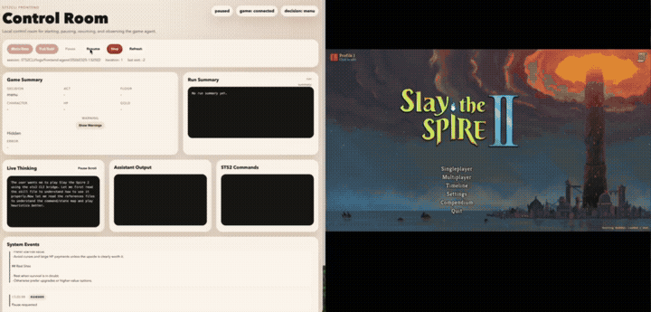
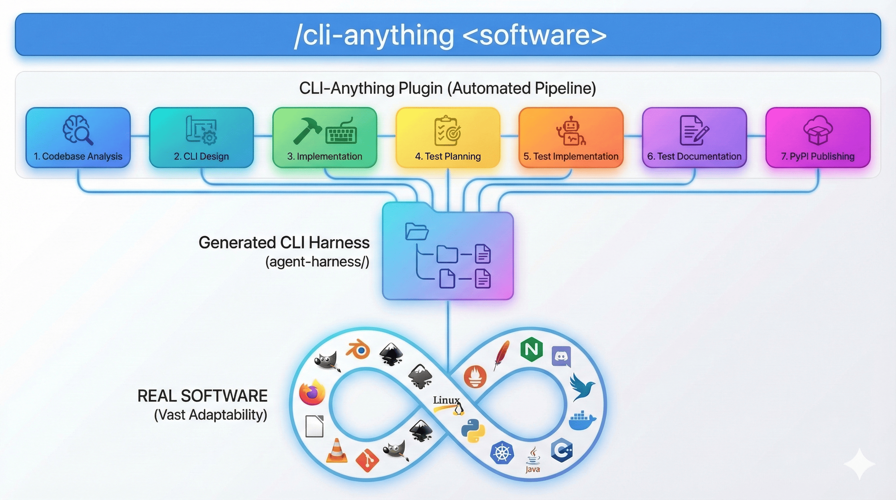

<h1 align="center">&nbsp; CLI-Anything: 让所有软件都成为 Agent-Native</h1>

<p align="center">
  <strong>今天的软件服务于人类👨‍💻。明天的用户将是智能体🤖。<br>
CLI-Anything：弥合 AI 智能体与世界软件之间的鸿沟</strong><br>
</p>

**🌐 [CLI-Hub](https://hkuds.github.io/CLI-Anything/)**：在 **[CLI-Hub](https://hkuds.github.io/CLI-Anything/)** 浏览所有社区构建的 CLI，并用一条命令完成安装。想加入你自己的？[提交 PR](https://github.com/HKUDS/CLI-Anything/blob/main/CONTRIBUTING.md) 即可，Hub 会立即更新。

**🎬 [查看演示](#-real-world-demos)**：观看 AI 智能体如何使用生成的 CLI 产出真实成果，例如图表、游戏过程、字幕等。

<p align="center">
  <a href="#-quick-start"></a>
  <a href="https://hkuds.github.io/CLI-Anything/"></a>
  <a href="#-demonstrations"></a>
  <a href="#-test-results"></a>
  <a href="LICENSE"></a>
</p>

<p align="center">
  
  
  
  
  
  <a href="https://github.com/HKUDS/.github/blob/main/profile/README.md"></a>
<a href="https://github.com/HKUDS/.github/blob/main/profile/README.md"></a>
</p>

**一条命令行**：让任意软件为 OpenClaw、nanobot、Cursor、Claude Code 等做好面向智能体的准备。&nbsp;&nbsp;[**中文文档**](README_CN.md) | [**日本語ドキュメント**](README_JA.md)

<p align="center">
  
</p>

<p align="center">
  
</p>

---

## 📰 新闻

> 感谢社区所有宝贵的贡献！更多更新仍在每天持续到来。

- **2026-03-30** 🏗️ **CLI-Anything v0.2.0** — HARNESS.md 渐进式披露重构。将详细指南（MCP 后端、滤镜转换、时间码、会话锁定、PyPI 发布、SKILL.md 生成）拆分到 `guides/` 中，按需加载。Phase 1–7 现在连续排列。将 Key Principles 和 Rules 合并为单一权威章节。新增 Guides Reference 路由表。将 “Critical Lessons Learned” 重命名为 “Architecture Patterns & Pitfalls”。

- **2026-03-29** 📐 Blender 技能文档更新——强制使用绝对渲染路径并修正前置要求。

- **2026-03-28** 🌐 **CLIBrowser** 已加入 CLI-Hub 注册表，用于支持智能体访问的浏览器自动化。

- **2026-03-27** 📚 Zotero 的 SKILL.md 已增强智能体侧约束；修复 REPL 配置与可执行文件解析问题。

- **2026-03-26** 📖 **Zotero CLI** harness 已支持 Zotero 桌面端（文库管理、集合、引用）。修复 Draw.io 自定义 ID 缺陷（#132）以及 registry.json 语法问题。

- **2026-03-25** 🎮 **RenderDoc CLI** 已合并，用于 GPU 帧捕获分析（PSO 计算、REPL 捕获缓存）。FreeCAD 更新到 v1.1（新 datum 系统、攻丝、仿真）。修正 Blender EEVEE 引擎名称。加强 Zoom token 权限限制。

- **2026-03-24** 🏭 **FreeCAD CLI** 已加入，共有 17 个分组、258 条命令。**iTerm2** 和 **Teltonika RMS** harness 已加入注册表。CLI-Hub 前端和 README 安装 URL 已更新。

- **2026-03-23** 🤖 发布 **CLI-Hub meta-skill** —— 智能体现可通过 [`cli-hub-meta-skill/SKILL.md`](cli-hub-meta-skill/SKILL.md) 自主发现并安装 CLI。**Krita CLI** harness 已合并，用于数字绘画。修复 DOMShell MCP 参数不匹配和连接模型问题。

<details>
<summary>更早的新闻（3 月 17–22 日）</summary>

- **2026-03-22** 🎵 **MuseScore CLI** 已合并，支持移调、导出和乐器管理。

- **2026-03-21** 🔧 基础设施改进——优化多个 CLI 的测试 harness 和文档。增强多个后端的 Windows 兼容性。

- **2026-03-20** 🌐 **Novita AI** CLI 已加入，用于 OpenAI 兼容 API 访问。改进注册表元数据以提升 hub 发现能力。

- **2026-03-19** 📦 多个 harness 的包结构已优化。改进 SKILL.md 生成，以提供更好的命令文档。

- **2026-03-18** 🧪 测试覆盖扩展——为多个 CLI 增加额外 E2E 场景和边界情况校验。

- **2026-03-17** 🌐 发布 **[CLI-Hub](https://hkuds.github.io/CLI-Anything/)** —— 一个中心化注册表，可用一条 `pip` 命令浏览、搜索并安装任意 CLI。

</details>

<details>
<summary>更早的新闻（3 月 11–16 日）</summary>

- **2026-03-16** 🤖 新增 **SKILL.md generation**（Phase 6.5）——每个生成的 CLI 现在都会附带 AI 可发现的技能定义。包含 `skill_generator.py`、Jinja2 模板和 51 个新测试。

- **2026-03-15** 🐾 来自社区的 **OpenClaw** 支持！已合并 Windows `cygpath` 保护逻辑以支持跨平台。

- **2026-03-14** 🔒 修复 GIMP Script-Fu 路径注入漏洞，并新增 **日文 README** 翻译。

- **2026-03-13** 🔌 **Qodercli** 插件作为社区贡献正式合并，并附带专用安装脚本。

- **2026-03-12** 📦 **Codex skill** 集成落地，将 CLI-Anything 带到又一个 AI 编码平台。

- **2026-03-11** 📞 **Zoom** 视频会议 harness 已加入，成为第 11 个受支持应用。

</details>

---

## 🤔 为什么选择 CLI？

CLI 是人类和 AI 智能体通用的接口：

• **结构化且可组合** - 文本命令天然匹配 LLM 格式，并可串联形成复杂工作流

• **轻量且通用** - 开销极小，无需额外依赖即可跨所有系统运行

• **自描述** - `--help` 标志提供智能体可自动发现的文档

• **已有成功实践** - Claude Code 每天都通过 CLI 跑数千个真实工作流

• **面向智能体优先设计** - 结构化 JSON 输出消除解析复杂度

• **确定且可靠** - 一致的结果让智能体行为可预测

<a id="-quick-start"></a>
## 🚀 快速开始

### 前置要求

- **Python 3.10+**
- 已安装目标软件（例如 GIMP、Blender、LibreOffice，或你自己的应用）
- 一个受支持的 AI 编码智能体：[Claude Code](#-claude-code) | [OpenClaw](#-openclaw) | [OpenCode](#-opencode) | [Codex](#-codex) | [Qodercli](#-qodercli) | [GitHub Copilot CLI](#-github-copilot-cli) | [更多平台](#-more-platforms-coming-soon)

### 选择你的平台

<details open>
<summary><h4 id="-claude-code">⚡ Claude Code</h4></summary>

**步骤 1：添加 Marketplace**

CLI-Anything 以托管在 GitHub 上的 Claude Code 插件市场形式发布。

```bash
# Add the CLI-Anything marketplace
/plugin marketplace add HKUDS/CLI-Anything
```

**步骤 2：安装插件**

```bash
# Install the cli-anything plugin from the marketplace
/plugin install cli-anything
```

到这里就完成了。该插件现在已可在你的 Claude Code 会话中使用。

> **Win 用户注意：** Claude Code 通过 `bash` 执行 shell 命令。在 Windows 上，请安装 Git for Windows（包含 `bash` 和
`cygpath`），或使用 WSL；否则命令可能会因 `cygpath: command not found` 而失败。

**步骤 3：一条命令构建 CLI**

```bash
# /cli-anything:cli-anything <software-path-or-repo>
# Generate a complete CLI for GIMP (all 7 phases)
/cli-anything:cli-anything ./gimp

# Note: If your Claude Code is under 2.x, use "/cli-anything" instead.
```

这会运行完整流水线：
1. 🔍 **Analyze** — 扫描源码，将 GUI 操作映射到 API
2. 📐 **Design** — 设计命令分组、状态模型和输出格式
3. 🔨 **Implement** — 构建带 REPL、JSON 输出、undo/redo 的 Click CLI
4. 📋 **Plan Tests** — 创建包含单元测试和 E2E 测试计划的 TEST.md
5. 🧪 **Write Tests** — 实现完整测试套件
6. 📝 **Document** — 用结果更新 TEST.md
7. 📦 **Publish** — 创建 `setup.py`，安装到 PATH

**步骤 4（可选）：打磨并改进 CLI**

完成初始构建后，你可以迭代地打磨 CLI，以扩展覆盖面并补足缺失能力：

```bash
# Broad refinement — agent analyzes gaps across all capabilities
/cli-anything:refine ./gimp

# Focused refinement — target a specific functionality area
/cli-anything:refine ./gimp "I want more CLIs on image batch processing and filters"
```

`refine` 命令会在软件完整能力与当前 CLI 覆盖之间做差距分析，然后为识别出的缺口实现新命令、测试和文档。你可以多次运行它，以稳步扩展覆盖范围；每次运行都是增量式且非破坏性的。

<details>
<summary><strong>替代方案：手动安装</strong></summary>

如果你不想使用 marketplace：

```bash
# Clone the repo
git clone https://github.com/HKUDS/CLI-Anything.git

# Copy plugin to Claude Code plugins directory
cp -r CLI-Anything/cli-anything-plugin ~/.claude/plugins/cli-anything

# Reload plugins
/reload-plugins
```

</details>

</details>

<details>
<summary><h4 id="-opencode">⚡ OpenCode（实验性）</h4></summary>

**步骤 1：安装命令**

> **注意：** 请升级到最新版本的 OpenCode。旧版本可能使用不同的命令路径。

将 CLI-Anything 的命令文件**以及** `HARNESS.md` 复制到你的 OpenCode 命令目录：

```bash
# Clone the repo
git clone https://github.com/HKUDS/CLI-Anything.git

# Global install (available in all projects)
cp CLI-Anything/opencode-commands/*.md ~/.config/opencode/commands/
cp CLI-Anything/cli-anything-plugin/HARNESS.md ~/.config/opencode/commands/

# Or project-level install
cp CLI-Anything/opencode-commands/*.md .opencode/commands/
cp CLI-Anything/cli-anything-plugin/HARNESS.md .opencode/commands/
```

> **注意：** `HARNESS.md` 是所有命令都会引用的方法规范。它必须与这些命令位于同一目录。

这会新增 5 个斜杠命令：`/cli-anything`、`/cli-anything-refine`、`/cli-anything-test`、`/cli-anything-validate` 和 `/cli-anything-list`。

**步骤 2：一条命令构建 CLI**

```bash
# Generate a complete CLI for GIMP (all 7 phases)
/cli-anything ./gimp

# Build from a GitHub repo
/cli-anything https://github.com/blender/blender
```

该命令以子任务方式运行，并遵循与 Claude Code 相同的 7 阶段方法论。

**步骤 3（可选）：打磨并改进 CLI**

```bash
# Broad refinement — agent analyzes gaps across all capabilities
/cli-anything-refine ./gimp

# Focused refinement — target a specific functionality area
/cli-anything-refine ./gimp "batch processing and filters"
```

</details>

<details>
<summary><h4 id="-goose">⚡ Goose（桌面版 / CLI）<sup><code>实验性</code></sup> <sup><code>社区</code></sup></h4></summary>

**步骤 1：安装 Goose**

根据适用于你操作系统的官方 Goose 说明安装 Goose（Desktop 或 CLI）。

**步骤 2：配置 CLI Provider**

将 Goose 配置为使用某个 CLI provider，例如 Claude Code，并确保该 CLI 已安装且已完成认证。

**步骤 3：在 Goose 会话中使用 CLI-Anything**

配置完成后，启动一个会话，并像上面 Claude Code 的示例那样使用相同的 CLI-Anything 命令，例如：

```bash
/cli-anything:cli-anything ./gimp
/cli-anything:refine ./gimp "batch processing and filters"
```

> 注意：当 Goose 通过某个 CLI provider 运行时，它会使用该 provider 的能力和命令格式。
</details>

<details>

<summary><h4 id="-qodercli">⚡ Qodercli <sup><code>社区</code></sup></h4></summary>

**步骤 1：注册插件**

```bash
git clone https://github.com/HKUDS/CLI-Anything.git
bash CLI-Anything/qoder-plugin/setup-qodercli.sh
```

这会在 `~/.qoder.json` 中注册 `cli-anything` 插件。注册后请启动一个新的 Qodercli 会话。

**步骤 2：从 Qodercli 使用 CLI-Anything**

```bash
/cli-anything:cli-anything ./gimp
/cli-anything:refine ./gimp "batch processing and filters"
/cli-anything:validate ./gimp
```
</details>

<details>

<summary><h4 id="-openclaw">⚡ OpenClaw <sup><code>社区</code></sup></h4></summary>

**步骤 1：安装 Skill**

CLI-Anything 提供原生的 OpenClaw `SKILL.md` 文件。把它复制到你的 OpenClaw skills 目录：

```bash
# Clone the repo
git clone https://github.com/HKUDS/CLI-Anything.git

# Install to the global skills folder
mkdir -p ~/.openclaw/skills/cli-anything
cp CLI-Anything/openclaw-skill/SKILL.md ~/.openclaw/skills/cli-anything/SKILL.md
```

**步骤 2：构建 CLI**

现在你可以在 OpenClaw 内调用这个 skill：

`@cli-anything build a CLI for ./gimp`

该 skill 遵循与 Claude Code 和 OpenCode 相同的 7 阶段方法论。

</details>

<details>

<summary><h4 id="-codex">⚡ Codex <sup><code>实验性</code></sup> <sup><code>社区</code></sup></h4></summary>

**步骤 1：安装 Skill**

运行随仓库附带的安装器：

```bash
# Clone the repo
git clone https://github.com/HKUDS/CLI-Anything.git

# Install the skill
bash CLI-Anything/codex-skill/scripts/install.sh
```

在 Windows PowerShell 中，请使用：

```powershell
.\CLI-Anything\codex-skill\scripts\install.ps1
```

这会将 skill 安装到 `$CODEX_HOME/skills/cli-anything`（如果 `CODEX_HOME` 未设置，则为 `~/.codex/skills/cli-anything`）。

安装后请重启 Codex，以便其被发现。

**步骤 2：从 Codex 使用 CLI-Anything**

用自然语言描述任务，例如：

```text
Use CLI-Anything to build a harness for ./gimp
Use CLI-Anything to refine ./shotcut for picture-in-picture workflows
Use CLI-Anything to validate ./libreoffice
```

Codex skill 适配了 Claude Code 插件和 OpenCode 命令所使用的同一套方法论，同时保持生成出的 Python harness 格式不变。
</details>

<details>

<summary><h4 id="-github-copilot-cli">⚡ GitHub Copilot CLI <sup><code>社区</code></sup></h4></summary>

**步骤 1：安装插件**

```bash
git clone https://github.com/HKUDS/CLI-Anything.git
cd CLI-Anything
copilot plugin install ./cli-anything-plugin
```

这会将 CLI-Anything 插件安装到 GitHub Copilot CLI 中。该插件现在应已可在你的 GitHub Copilot CLI 会话中使用。

**步骤 2：从 GitHub Copilot CLI 使用 CLI-Anything**

```bash
/cli-anything:cli-anything ./gimp
/cli-anything:refine ./gimp "batch processing and filters"
/cli-anything:validate ./gimp
```

</details>

<details>
<summary><h4 id="-more-platforms-coming-soon">🔮 更多平台（即将推出）</h4></summary>

CLI-Anything 的设计与平台无关。未来计划支持更多 AI 编码智能体：

- **Codex** — 已可通过内置 skill 使用，见 `codex-skill/`
- **Cursor** — 即将推出
- **Windsurf** — 即将推出
- **你最喜欢的工具** — 欢迎贡献！可参考 `opencode-commands/` 目录中的实现。

</details>

### 使用生成后的 CLI

无论你使用哪个平台完成构建，生成的 CLI 的使用方式都相同：

```bash
# Install to PATH
cd gimp/agent-harness && pip install -e .

# Use from anywhere
cli-anything-gimp --help
cli-anything-gimp project new --width 1920 --height 1080 -o poster.json
cli-anything-gimp --json layer add -n "Background" --type solid --color "#1a1a2e"

# Enter interactive REPL
cli-anything-gimp
```

每个已安装的 CLI 都会在 Python 包中附带一个 [`SKILL.md`](#-skillmd-generation)（路径为 `cli_anything/<software>/skills/SKILL.md`）。REPL 启动横幅会自动显示该文件的绝对路径，以便 AI 智能体准确知道该去哪里读取 skill 定义。无需额外配置，`pip install` 就会让这个 skill 可被发现。

---

## 🤖 用 CLI-Hub 赋能你的智能体

CLI-Hub 允许智能体自主发现并安装它们所需的 CLI，全程无需人工干预。

我们发布了一个 **meta-skill**，让任何 AI 智能体都可以自由探索社区 CLI 的完整目录，并为当前任务选择合适的工具。

**一条命令安装：**

```bash
# OpenClaw
openclaw skills install cli-anything-hub

# nanobot
nanobot skills install cli-anything-hub
```

**然后只需这样提示你的智能体：**

```
Find appropriate CLI software in CLI-Hub and complete the task: <your task here>
```

智能体会浏览目录，安装最适合任务的 CLI，然后直接使用它，全程自治完成。

**底层工作方式如下：**

1. meta-skill 指向在线目录 [`https://hkuds.github.io/CLI-Anything/SKILL.txt`](https://hkuds.github.io/CLI-Anything/SKILL.txt)
2. 智能体读取按类别组织的 20+ 个 CLI，每个都附带一行 `pip install` 命令
3. 智能体安装适合任务的 CLI，然后再读取该 CLI 自己的 `SKILL.md` 以获取详细用法

当 `registry.json` 发生变化时，目录会自动更新，因此新的社区 CLI 会自动出现。

> **给 Claude Code 用户：** 将 [`cli-hub-meta-skill/SKILL.md`](cli-hub-meta-skill/SKILL.md) 复制到你的项目目录或 skills 目录中，即可获得相同的自动 CLI 发现能力。

---

## 💡 CLI-Anything 的愿景：构建 Agent-Native 软件

• 🌐 **通用访问** - 每个软件都可通过结构化 CLI 立刻变得可被智能体控制。

• 🔗 **无缝集成** - 智能体无需 API、GUI、重建或复杂封装，就能控制任意应用。

• 🚀 **面向未来的生态** - 用一条命令把面向人类设计的软件转化为面向智能体的工具。

---

## 🔧 何时使用 CLI-Anything

| 类别 | 如何实现 Agent-native | 代表性示例 |
|----------|----------------------|----------|
| **📂 GitHub Repositories** | 通过自动 CLI 生成，将任意开源项目转化为智能体可控工具 | VSCodium, WordPress, Calibre, Zotero, Joplin, Logseq, Penpot, Super Productivity |
| **🤖 AI/ML Platforms** | 通过结构化命令自动化模型训练、推理流水线和超参数调优 | Stable Diffusion WebUI, ComfyUI, Ollama, InvokeAI, Text-generation-webui, Open WebUI, Fooocus, Kohya_ss, AnythingLLM, SillyTavern |
| **📊 Data & Analytics** | 启用可编程的数据处理、可视化和统计分析工作流 | JupyterLab, Apache Superset, Metabase, Redash, DBeaver, KNIME, Orange, OpenSearch Dashboards, Lightdash |
| **💻 Development Tools** | 通过命令接口串联代码编辑、构建、测试与部署流程 | Jenkins, Gitea, Hoppscotch, Portainer, pgAdmin, SonarQube, ArgoCD, OpenLens, Insomnia, Beekeeper Studio, **[iTerm2](https://iterm2.com)** |
| **🎨 Creative & Media** | 以编程方式控制内容创作、编辑与渲染工作流 | Blender, GIMP, OBS Studio, Audacity, Krita, Kdenlive, Shotcut, Inkscape, Darktable, LMMS, Ardour |
| **🎮 Game Development** | 通过无头引擎接口管理游戏项目、场景、导出和脚本 | **[Godot Engine](https://godotengine.org)** |
| **🔬 Scientific Computing** | 自动化科研工作流、仿真和复杂计算 | ImageJ, FreeCAD, QGIS, ParaView, Gephi, LibreCAD, Stellarium, KiCad, JASP, Jamovi |
| **🏢 Enterprise & Office** | 将业务应用与生产力工具转化为智能体可访问系统 | NextCloud, GitLab, Grafana, Mattermost, LibreOffice, AppFlowy, NocoDB, Odoo (Community), Plane, ERPNext |
| **📞 Communication & Collaboration** | 通过结构化 CLI 自动化会议安排、参会人管理、录制获取和报告生成 | Zoom, Jitsi Meet, BigBlueButton, Mattermost |
| **📐 Diagramming & Visualization** | 以编程方式创建与操作图表、流程图、架构图和可视化文档 | Draw.io (diagrams.net), Mermaid, PlantUML, Excalidraw, yEd |
| **🌐 Network & Infrastructure** | 通过结构化 CLI 管理网络服务、DNS、广告拦截和基础设施 | AdGuardHome |
| **🧪 Testing & Mocking** | 控制 HTTP mock 服务器、管理测试桩、记录和回放 API 流量以进行集成测试 | **[WireMock](https://wiremock.org)** |
| **🔬 Graphics & GPU Debugging** | 分析 GPU 帧捕获、检查 pipeline state、导出 shader 并比较渲染状态 | RenderDoc |
| **🎬 Video & Subtitles** | 语音转录、字幕翻译、将样式化字幕烧录进视频，覆盖完整字幕生产流水线 | VideoCaptioner |
| **🔍 AI-Native Search** | 通过基于嵌入的 API 进行神经搜索和深网搜索，结构化检索内容 | [Exa](https://exa.ai) |
| **✨ AI Content Generation** | 通过 AI 驱动的云 API 生成专业交付物（幻灯片、文档、图表、网站、研究报告） | [AnyGen](https://www.anygen.io), Gamma, Beautiful.ai, Tome |

---

## CLI-Anything 的关键特性

### 智能体与软件之间的鸿沟
AI 智能体擅长推理，但非常不擅长使用真实的专业软件。现有方案通常只有脆弱的 UI 自动化、受限的 API，或是功能缩水 90% 的简化重写版本。

**CLI-Anything 的方案**：把任意专业软件转化为面向智能体的工具，同时不丢失能力。

| **当前痛点** | **CLI-Anything 的解决方案** |
|----------|----------------------|
| 🤖 “AI can't use real tools” | 直接接入真实软件后端（Blender、LibreOffice、FFmpeg）——完整专业能力，零妥协 |
| 💸 “UI automation breaks constantly” | 不需要截图、不需要点击、没有 RPA 脆弱性。纯命令行可靠性加结构化接口 |
| 📊 “Agents need structured data” | 每条命令内置 JSON 输出，便于智能体无缝消费；同时保留人类可读格式便于调试 |
| 🔧 “Custom integrations are expensive” | 一个 Claude 插件即可通过成熟的 7 阶段流水线为任何代码库自动生成 CLI |
| ⚡ “Prototype vs Production gap” | 1,839+ 项测试，且通过真实软件进行验证。已在 16 个大型应用中实战检验 |

---

## 🎯 你可以用 CLI-Anything 做什么？

<table>
<tr>
<td width="33%">

### 🛠️ 让智能体接管你的工作流

无论专业软件还是日常软件，直接把代码库丢给 `/cli-anything`。GIMP、Blender、Shotcut 适合创意工作；LibreOffice、OBS Studio 可用于日常任务。没有源码？那就找一个开源替代品，把*那个*也丢进去。你会立刻得到一个可供智能体使用的完整 CLI。

</td>
<td width="33%">

### 🔗 把零散 API 统一成一个 CLI

厌倦了同时处理碎片化的 Web 服务 API？把文档或 SDK 手册喂给 `/cli-anything`，你的智能体就会得到一个**强大且有状态的 CLI**，把分散的 endpoint 封装成一致的命令分组。一个工具替代几十次原始 API 调用，能力更强，还能节省 tokens。

</td>
<td width="33%">

### 🚀 替代或强化 GUI 智能体

CLI-Anything 可以直接**替代基于 GUI 的智能体方案**——不再需要截图，也不再需要脆弱的像素点击。更有意思的是，一旦你对某个 GUI 软件运行 `/cli-anything`，就可以完全通过代码和终端**合成智能体任务、评估器和基准测试**——全自动、可迭代优化，而且效率高得多。

</td>
</tr>
</table>

---

## ✨ ⚙️ CLI-Anything 如何工作

<table>
<tr>
<td width="50%">

### 🏗️ 全自动 7 阶段流水线
从代码库分析到 PyPI 发布，插件会全自动完成架构设计、实现、测试规划、测试编写与文档整理。

</td>
<td width="50%">

### 🎯 真实软件集成
直接调用真实应用进行实际渲染。LibreOffice 生成 PDF，Blender 渲染 3D 场景，Audacity 通过 sox 处理音频。**零妥协**，**零玩具实现**。

</td>
</tr>
<tr>
<td width="50%">

### 🔁 智能会话管理
持久化项目状态，支持 undo/redo，同时提供统一 REPL 界面（ReplSkin），让所有 CLI 都拥有一致的交互体验。

</td>
<td width="50%">

### 📦 零配置安装
只需 `pip install -e .`，即可把 `cli-anything-<software>` 直接放进 PATH。智能体可通过标准 `which` 命令发现工具。无需额外设置、无需 wrapper。

</td>
</tr>
<tr>
<td width="50%">

### 🧪 生产级测试
多层校验：使用合成数据的单元测试、使用真实文件和软件的端到端测试，以及对已安装命令的 CLI 子进程验证。

</td>
<td width="50%">

### 🐍 清晰的包架构
所有 CLI 都组织在 `cli_anything.*` 命名空间下——无冲突、可通过 `pip` 安装，并采用一致命名：`cli-anything-gimp`、`cli-anything-blender` 等。

</td>
</tr>
</table>

<a id="-skillmd-generation"></a>
### 🤖 SKILL.md 生成

每个生成的 CLI 都会在 Python 包中的 `cli_anything/<software>/skills/SKILL.md` 路径下包含一个 `SKILL.md` 文件。这个自包含的 skill 定义使 AI 智能体能够通过 Claude Code 的技能系统或其他智能体框架发现并使用该 CLI。

**SKILL.md 提供的内容：**
- **YAML frontmatter**，包含名称和描述，便于智能体进行 skill 发现
- **命令分组**，记录所有可用子命令
- **使用示例**，覆盖常见工作流
- **面向智能体的说明**，包括 JSON 输出、错误处理和程序化使用方式

SKILL.md 文件会在流水线的 Phase 6.5 中使用 `skill_generator.py` 自动生成，该脚本会直接从 CLI 的 Click decorators、`setup.py` 和 README 提取元数据。由于该文件位于包内部，因此会随 `pip install` 一起安装，并由 REPL 横幅自动检测——智能体可以读取启动时显示的绝对路径。

---

<a id="-real-world-demos"></a>
## 🎬 真实世界演示

AI 智能体使用生成的 CLI 产出完整、实用的成果物，全程无需 GUI。

### Draw.io &mdash; HTTPS 握手图

> **Harness:** `cli-anything-drawio` | **Time:** ~4 min | **Artifact:** `.drawio` + `.png`

智能体从零开始创建一个完整的 HTTPS 连接生命周期图——TCP 三次握手、TLS 协商、加密数据交换，以及 TCP 四次挥手——全部通过 CLI 命令完成。

<p align="center">
  
</p>

<details>
<summary>最终产物</summary>
<p align="center">
  
</p>
</details>

*由 [@zhangxilong-43](https://github.com/zhangxilong-43) 贡献*

### Slay the Spire II &mdash; 游戏自动化

> **Harness:** `cli-anything-slay-the-spire-ii` | **Artifact:** 自动化游戏会话

智能体使用 CLI harness 进行一局 Slay the Spire II——读取游戏状态、选择卡牌、挑选路径，并实时做出策略决策。

<p align="center">
  
</p>

*由 [@TianyuFan0504](https://github.com/TianyuFan0504) 贡献*

### VideoCaptioner &mdash; 自动生成字幕

> **Harness:** `cli-anything-videocaptioner` | **Artifact:** 已加字幕的视频帧

智能体使用 VideoCaptioner CLI 自动生成并叠加样式化字幕到视频内容上，支持双语文本渲染和可定制格式。

<table align="center">
<tr>
<td align="center"><strong>Sub A</strong></td>
<td align="center"><strong>Sub B</strong></td>
</tr>
<tr>
<td></td>
<td></td>
</tr>
</table>

*由 [@WEIFENG2333](https://github.com/WEIFENG2333) 贡献*

*更多 CLI 演示即将到来。*

---

<a id="-demonstrations"></a>
## 🎬 展示

### 🎯 通用能力
CLI-Anything 适用于任何拥有代码库的软件，没有领域限制，也没有架构限制。

### 🏭 专业级测试
已在 16 个多样且复杂的应用上完成测试，覆盖创意、生产力、沟通协作、图表绘制、AI 图像生成、AI 内容生成、网络广告拦截，以及此前 AI 智能体无法触及的本地 LLM 推理等领域。

### 🎨 多领域覆盖
从创意工作流（图像编辑、3D 建模、矢量图形）到生产工具（音频、办公、直播、视频编辑）均有覆盖。

### ✅ 完整 CLI 生成
每个应用都获得了完整、生产可用的 CLI 接口，不是演示，而是保留全部能力的全面工具访问。

<table>
<tr>
<th align="center">Software</th>
<th align="center">Domain</th>
<th align="center">CLI Command</th>
<th align="center">Backend</th>
<th align="center">Tests</th>
</tr>
<tr>
<td align="center"><strong>🎨 GIMP</strong></td>
<td>图像编辑</td>
<td><code>cli-anything-gimp</code></td>
<td>Pillow + GEGL/Script-Fu</td>
<td align="center">✅ 107</td>
</tr>
<tr>
<td align="center"><strong>🧊 Blender</strong></td>
<td>3D 建模与渲染</td>
<td><code>cli-anything-blender</code></td>
<td>bpy (Python scripting)</td>
<td align="center">✅ 208</td>
</tr>
<tr>
<td align="center"><strong>✏️ Inkscape</strong></td>
<td>矢量图形</td>
<td><code>cli-anything-inkscape</code></td>
<td>直接操作 SVG/XML</td>
<td align="center">✅ 202</td>
</tr>
<tr>
<td align="center"><strong>🎵 Audacity</strong></td>
<td>音频制作</td>
<td><code>cli-anything-audacity</code></td>
<td>Python wave + sox</td>
<td align="center">✅ 161</td>
</tr>
<tr>
<td align="center"><strong>🌐 Browser</strong></td>
<td>浏览器自动化</td>
<td><code>cli-anything-browser</code></td>
<td>DOMShell MCP + Accessibility Tree</td>
<td align="center">✅ <a href="browser/agent-harness/">New</a></td>
</tr>
<tr>
<td align="center"><strong>📄 LibreOffice</strong></td>
<td>办公套件（Writer、Calc、Impress）</td>
<td><code>cli-anything-libreoffice</code></td>
<td>ODF generation + headless LO</td>
<td align="center">✅ 158</td>
</tr>
<tr>
<td align="center"><strong>📚 <a href="zotero/agent-harness/">Zotero</a></strong></td>
<td>文献管理</td>
<td><code>cli-anything-zotero</code></td>
<td>本地 SQLite + connector + Local API</td>
<td align="center">✅ <a href="zotero/agent-harness/">New</a></td>
</tr>
<tr>
<td align="center"><strong>📝 <a href="mubu/agent-harness/">Mubu</a></strong></td>
<td>知识管理与大纲整理</td>
<td><code>cli-anything-mubu</code></td>
<td>本地 Mubu data + sync logs</td>
<td align="center">✅ 96</td>
</tr>
<tr>
<td align="center"><strong>📹 OBS Studio</strong></td>
<td>直播与录制</td>
<td><code>cli-anything-obs-studio</code></td>
<td>JSON scene + obs-websocket</td>
<td align="center">✅ 153</td>
</tr>
<tr>
<td align="center"><strong>🎞️ Kdenlive</strong></td>
<td>视频编辑</td>
<td><code>cli-anything-kdenlive</code></td>
<td>MLT XML + melt renderer</td>
<td align="center">✅ 155</td>
</tr>
<tr>
<td align="center"><strong>🎬 Shotcut</strong></td>
<td>视频编辑</td>
<td><code>cli-anything-shotcut</code></td>
<td>Direct MLT XML + melt</td>
<td align="center">✅ 154</td>
</tr>
<tr>
<td align="center"><strong>📞 Zoom</strong></td>
<td>视频会议</td>
<td><code>cli-anything-zoom</code></td>
<td>Zoom REST API (OAuth2)</td>
<td align="center">✅ 22</td>
</tr>
<tr>
<td align="center"><strong>🎵 MuseScore</strong></td>
<td>乐谱制作</td>
<td><code>cli-anything-musescore</code></td>
<td>mscore CLI (MSCX/MusicXML)</td>
<td align="center">✅ 56</td>
</tr>
<tr>
<td align="center"><strong>📐 Draw.io</strong></td>
<td>图表绘制</td>
<td><code>cli-anything-drawio</code></td>
<td>mxGraph XML + draw.io CLI</td>
<td align="center">✅ 138</td>
</tr>
<tr>
<td align="center"><strong>🧜 Mermaid Live Editor</strong></td>
<td>图表绘制</td>
<td><code>cli-anything-mermaid</code></td>
<td>Mermaid state + mermaid.ink renderer</td>
<td align="center">✅ 10</td>
</tr>
<tr>
<td align="center"><strong>✨ AnyGen</strong></td>
<td>AI 内容生成</td>
<td><code>cli-anything-anygen</code></td>
<td>AnyGen REST API (anygen.io)</td>
<td align="center">✅ 50</td>
</tr>
<tr>
<td align="center"><strong>🧠 NotebookLM</strong></td>
<td>AI 研究助手</td>
<td><code>cli-anything-notebooklm</code></td>
<td>NotebookLM CLI wrapper (experimental)</td>
<td align="center">✅ 21</td>
</tr>
<tr>
<td align="center"><strong>🖼️ ComfyUI</strong></td>
<td>AI 图像生成</td>
<td><code>cli-anything-comfyui</code></td>
<td>ComfyUI REST API</td>
<td align="center">✅ 70</td>
</tr>
<tr>
<td align="center"><strong>🛡️ AdGuard Home</strong></td>
<td>全网广告拦截</td>
<td><code>cli-anything-adguardhome</code></td>
<td>AdGuard Home REST API</td>
<td align="center">✅ 36</td>
</tr>
<tr>
<td align="center"><strong>🦙 Ollama</strong></td>
<td>本地 LLM 推理</td>
<td><code>cli-anything-ollama</code></td>
<td>Ollama REST API</td>
<td align="center">✅ 98</td>
</tr>
<tr>
<td align="center"><strong>🎬 <a href="videocaptioner/agent-harness/">VideoCaptioner</a></strong></td>
<td>AI 视频字幕</td>
<td><code>cli-anything-videocaptioner</code></td>
<td>videocaptioner CLI (PyPI)</td>
<td align="center">✅ 26</td>
</tr>
<tr>
<td align="center"><strong>🎨 Sketch</strong></td>
<td>UI 设计</td>
<td><code>sketch-cli</code></td>
<td>sketch-constructor (Node.js)</td>
<td align="center">✅ 19</td>
</tr>
<tr>
<td align="center"><strong>🎮 Godot Engine</strong></td>
<td>游戏开发</td>
<td><code>cli-anything-godot</code></td>
<td>Godot 4.x headless subprocess</td>
<td align="center">✅ 24</td>
</tr>
<tr>
<td align="center"><strong>🔍 <a href="exa/agent-harness/">Exa</a></strong></td>
<td>AI-Native Web Search</td>
<td><code>cli-anything-exa</code></td>
<td>exa-py SDK</td>
<td align="center">✅ 40</td>
</tr>
<tr>
<td align="center" colspan="4"><strong>总计</strong></td>
<td align="center"><strong>✅ 2,045</strong></td>
</tr>
</table>

> **100% 通过率**，共 2,045 项测试全部通过——1,493 项单元测试 + 533 项端到端测试 + 19 项 Node.js 测试。

---

<a id="-test-results"></a>
## 📊 测试结果

每个 CLI harness 都会经过严格的多层测试，以确保其达到生产级可靠性：

| 测试层级 | 测试内容 | 示例 |
|-------|---------------|---------|
| **单元测试** | 使用合成数据对每个核心函数进行隔离测试 | `test_core.py` — project creation, layer ops, filter params |
| **E2E 测试（原生）** | 项目文件生成流水线 | 合法的 ODF ZIP 结构、正确的 MLT XML、格式良好的 SVG |
| **E2E 测试（真实后端）** | 调用真实软件并验证输出 | LibreOffice → 含 `%PDF-` magic bytes 的 PDF，Blender → 渲染 PNG |
| **CLI 子进程测试** | 通过 `subprocess.run` 调用已安装命令 | `cli-anything-gimp --json project new` → 有效 JSON 输出 |

```
================================ Test Summary ================================
gimp          107 passed  ✅   (64 unit + 43 e2e)
blender       208 passed  ✅   (150 unit + 58 e2e)
inkscape      202 passed  ✅   (148 unit + 54 e2e)
audacity      161 passed  ✅   (107 unit + 54 e2e)
libreoffice   158 passed  ✅   (89 unit + 69 e2e)
mubu           96 passed  ✅   (85 unit + 11 e2e)
obs-studio    153 passed  ✅   (116 unit + 37 e2e)
kdenlive      155 passed  ✅   (111 unit + 44 e2e)
shotcut       154 passed  ✅   (110 unit + 44 e2e)
zoom           22 passed  ✅   (22 unit + 0 e2e)
drawio        138 passed  ✅   (116 unit + 22 e2e)
mermaid        10 passed  ✅   (5 unit + 5 e2e)
anygen         50 passed  ✅   (40 unit + 10 e2e)
notebooklm     21 passed  ✅   (21 unit + 0 e2e)
comfyui        70 passed  ✅   (60 unit + 10 e2e)
adguardhome    36 passed  ✅   (24 unit + 12 e2e)
ollama         98 passed  ✅   (87 unit + 11 e2e)
sketch         19 passed  ✅   (19 jest, Node.js)
renderdoc      59 passed  ✅   (45 unit + 14 e2e)
cloudcompare   88 passed  ✅   (49 unit + 39 e2e)
──────────────────────────────────────────────────────────────────────────────
TOTAL        2,005 passed  ✅   100% pass rate
```

---

## 🏗️ CLI-Anything 的架构

<p align="center">
  
</p>

### 🎯 核心设计原则

1. **真实软件集成** —— CLI 负责生成合法的项目文件（ODF、MLT XML、SVG），并将渲染委托给真实应用。**我们是在为软件构建结构化接口，而不是替代软件本身**。

2. **灵活的交互模型** —— 每个 CLI 都以双模式工作：用于交互式智能体会话的有状态 REPL + 用于脚本/流水线的子命令接口。**直接运行裸命令 → 进入 REPL 模式**。

3. **一致的用户体验** —— 所有生成的 CLI 都共享统一的 REPL 界面（`repl_skin.py`），具备品牌横幅、样式化提示符、命令历史、进度指示和标准化格式。

4. **Agent-Native 设计** —— 每条命令内置 `--json` 标志，为机器消费提供结构化数据，同时也保留人类可读的表格格式以支持交互式使用。**智能体通过标准的 `--help` 和 `which` 命令发现能力**。

5. **零妥协依赖** —— 真实软件是硬性要求，没有 fallback，也没有 graceful degradation。**缺少后端时测试会失败（而不是跳过），以确保功能真实可靠**。

---

## 📂 项目结构

```
cli-anything/
├── 📄 README.md                          # 你当前所在位置
├── 📁 assets/                            # 图片与媒体资源
│   ├── icon.png                          # 项目图标
│   └── teaser.png                        # 预告图
│
├── 🔌 cli-anything-plugin/               # Claude Code 插件
│   ├── HARNESS.md                        # 方法论 SOP（单一事实来源）
│   ├── README.md                         # 插件文档
│   ├── QUICKSTART.md                     # 5 分钟上手
│   ├── PUBLISHING.md                     # 分发指南
│   ├── repl_skin.py                      # 统一 REPL 界面
│   ├── commands/                         # 插件命令定义
│   │   ├── cli-anything.md               # 主构建命令
│   │   ├── refine.md                     # 扩展现有 harness 覆盖范围
│   │   ├── test.md                       # 测试运行器
│   │   └── validate.md                   # 标准校验
│   └── scripts/
│       └── setup-cli-anything.sh         # 安装脚本
│
├── 🤖 codex-skill/                      # Codex skill 入口
├── 🎨 gimp/agent-harness/               # GIMP CLI（107 项测试）
├── 🧊 blender/agent-harness/            # Blender CLI（208 项测试）
├── ✏️ inkscape/agent-harness/            # Inkscape CLI（202 项测试）
├── 🎵 audacity/agent-harness/           # Audacity CLI（161 项测试）
├── 🌐 browser/agent-harness/            # Browser CLI（DOMShell MCP，新）
├── 📄 libreoffice/agent-harness/        # LibreOffice CLI（158 项测试）
├── 📚 zotero/agent-harness/             # Zotero CLI（新，支持写入导入）
├── 📝 mubu/agent-harness/               # Mubu CLI（96 项测试）
├── 📹 obs-studio/agent-harness/         # OBS Studio CLI（153 项测试）
├── 🎞️ kdenlive/agent-harness/           # Kdenlive CLI（155 项测试）
├── 🎬 shotcut/agent-harness/            # Shotcut CLI（154 项测试）
├── 📞 zoom/agent-harness/               # Zoom CLI（22 项测试）
├── 🎵 musescore/agent-harness/          # MuseScore CLI（56 项测试）
├── 📐 drawio/agent-harness/             # Draw.io CLI（138 项测试）
├── 🧜 mermaid/agent-harness/            # Mermaid Live Editor CLI（10 项测试）
├── ✨ anygen/agent-harness/             # AnyGen CLI（50 项测试）
├── 🖼️ comfyui/agent-harness/            # ComfyUI CLI（70 项测试）
├── 🧠 notebooklm/agent-harness/         # NotebookLM CLI（实验性，21 项测试）
├── 🛡️ adguardhome/agent-harness/       # AdGuard Home CLI（36 项测试）
├── 🦙 ollama/agent-harness/             # Ollama CLI（98 项测试）
├── 🎮 godot/agent-harness/              # Godot Engine CLI（24 项测试）
├── 🎨 sketch/agent-harness/             # Sketch CLI（19 项测试，Node.js）
├── 🔬 renderdoc/agent-harness/          # RenderDoc CLI（59 项测试）
├── 🎬 videocaptioner/agent-harness/     # VideoCaptioner CLI（26 项测试）
├── ☁️ cloudcompare/agent-harness/       # CloudCompare CLI（88 项测试）
└── 🔍 exa/agent-harness/               # Exa CLI（40 项测试）
```

每个 `agent-harness/` 都包含一个位于 `cli_anything.<software>/` 下的可安装 Python 包，内含 Click CLI、核心模块、工具模块（包括 `repl_skin.py` 和后端 wrapper），以及完整测试。

---

## 🎯 插件命令

| 命令 | 说明 |
|---------|-------------|
| `/cli-anything <software-path-or-repo>` | 构建完整 CLI harness —— 全 7 个阶段 |
| `/cli-anything:refine <software-path> [focus]` | 打磨现有 harness —— 通过差距分析扩展覆盖面 |
| `/cli-anything:test <software-path-or-repo>` | 运行测试并用结果更新 TEST.md |
| `/cli-anything:validate <software-path-or-repo>` | 按 HARNESS.md 标准进行校验 |

### 示例

```bash
# Build a complete CLI for GIMP from local source
/cli-anything /home/user/gimp

# Build from a GitHub repo
/cli-anything https://github.com/blender/blender

# Refine an existing harness — broad gap analysis
/cli-anything:refine /home/user/gimp

# Refine with a specific focus area
/cli-anything:refine /home/user/shotcut "vid-in-vid and picture-in-picture compositing"

# Run tests and update TEST.md
/cli-anything:test /home/user/inkscape

# Validate against HARNESS.md standards
/cli-anything:validate /home/user/audacity
```

---

## 🎮 演示：使用生成的 CLI

下面是智能体使用 `cli-anything-libreoffice` 能做到的事情：

```bash
# Create a new Writer document
$ cli-anything-libreoffice document new -o report.json --type writer
✓ Created Writer document: report.json

# Add content
$ cli-anything-libreoffice --project report.json writer add-heading -t "Q1 Report" --level 1
✓ Added heading: "Q1 Report"

$ cli-anything-libreoffice --project report.json writer add-table --rows 4 --cols 3
✓ Added 4×3 table

# Export to real PDF via LibreOffice headless
$ cli-anything-libreoffice --project report.json export render output.pdf -p pdf --overwrite
✓ Exported: output.pdf (42,831 bytes) via libreoffice-headless

# JSON mode for agent consumption
$ cli-anything-libreoffice --json document info --project report.json
{
  "name": "Q1 Report",
  "type": "writer",
  "pages": 1,
  "elements": 2,
  "modified": true
}
```

### REPL 模式

```
$ cli-anything-blender
╔══════════════════════════════════════════╗
║       cli-anything-blender v1.0.0       ║
║     Blender CLI for AI Agents           ║
╚══════════════════════════════════════════╝

blender> scene new --name ProductShot
✓ Created scene: ProductShot

blender[ProductShot]> object add-mesh --type cube --location 0 0 1
✓ Added mesh: Cube at (0, 0, 1)

blender[ProductShot]*> render execute --output render.png --engine CYCLES
✓ Rendered: render.png (1920×1080, 2.3 MB) via blender --background

blender[ProductShot]> exit
Goodbye! 👋
```

---

## 📖 标准作战手册：HARNESS.md

HARNESS.md 是我们将任意软件变成智能体可访问 CLI 的权威 SOP。

它编码了经由自动化生成流程不断打磨出的成熟模式与方法论。

这套手册提炼了成功构建全部 16 个多样化、生产可用 harness 的关键洞见。

### 关键经验

| 经验 | 说明 |
|--------|-------------|
| **Use the real software** | CLI **必须**调用真实应用进行渲染。不能用 Pillow 替代 GIMP，也不能为 Blender 写自定义渲染器。应生成合法项目文件 → 调用真实后端。 |
| **The Rendering Gap** | GUI 应用在渲染时才应用效果。如果你的 CLI 只是操作项目文件，却使用了天真的导出工具，这些效果会被静默丢弃。解决方案：native renderer → filter translation → render script。 |
| **Filter Translation** | 在格式之间映射效果时（MLT → ffmpeg），要注意重复滤镜合并、交错流顺序、参数空间差异以及无法映射的效果。 |
| **Timecode Precision** | 非整数帧率（29.97fps）会引发累计舍入误差。要使用 `round()` 而不是 `int()`，显示时使用整数运算，并在测试中允许 ±1 帧误差。 |
| **Output Verification** | 不要因为导出返回 0 就认定成功。要校验：magic bytes、ZIP/OOXML 结构、像素分析、音频 RMS 级别、时长检查。 |

> 查看完整方法论：[`cli-anything-plugin/HARNESS.md`](cli-anything-plugin/HARNESS.md)

---

## 📦 安装与使用

### 面向插件用户（Claude Code）

```bash
# Add marketplace & install (recommended)
/plugin marketplace add HKUDS/CLI-Anything
/plugin install cli-anything

# Build a CLI for any software with a codebase
/cli-anything <software-name>
```

### 面向生成后的 CLI

```bash
# Install any generated CLI
cd <software>/agent-harness
pip install -e .

# Verify
which cli-anything-<software>

# Use
cli-anything-<software> --help
cli-anything-<software>                    # enters REPL
cli-anything-<software> --json <command>   # JSON output for agents
```

### 运行测试

```bash
# Run tests for a specific CLI
cd <software>/agent-harness
python3 -m pytest cli_anything/<software>/tests/ -v

# Force-installed mode (recommended for validation)
CLI_ANYTHING_FORCE_INSTALLED=1 python3 -m pytest cli_anything/<software>/tests/ -v -s
```

---

## 🤝 贡献

欢迎贡献！CLI-Anything 被设计为可扩展系统：

- **新的软件目标** —— 使用插件为任意有代码库的软件生成 CLI，然后按 [`cli-anything-plugin/PUBLISHING.md`](cli-anything-plugin/PUBLISHING.md) 提交你的 harness。
- **方法论改进** —— 向 `HARNESS.md` 提交编码新经验教训的 PR
- **插件增强** —— 新命令、阶段改进、更好的校验
- **测试覆盖** —— 更多 E2E 场景、边界情况和工作流测试

### 限制

- **需要强大的基础模型** —— CLI-Anything 依赖前沿级模型（例如 Claude Opus 4.6、Claude Sonnet 4.6、GPT-5.4）来可靠地生成 harness。更弱或更小的模型可能会生成不完整或不正确的 CLI，从而需要大量人工修正。
- **依赖可用源码** —— 7 阶段流水线基于源码进行分析与生成。当目标软件只提供需要反编译的编译后二进制时，harness 的质量与覆盖度会明显下降。
- **可能需要迭代式打磨** —— 单次 `/cli-anything` 运行可能无法完全覆盖所有能力。通常需要额外运行一次或多次 `/refine`，才能把 CLI 的表现和覆盖推进到生产质量。

### 路线图

- [ ] 支持更多应用类别（CAD、DAW、IDE、EDA、科研工具）
- [ ] 面向智能体任务完成率的 benchmark 套件
- [ ] 支持面向内部/定制软件的社区贡献 CLI harness
- [ ] 集成 Claude Code 之外的更多智能体框架
- [ ] 支持将闭源软件和 Web 服务的封装 API 打包为 CLI
- [x] 随 CLI 一同生成 `SKILL.md`，用于智能体技能发现与编排

---

## 📖 文档

| 文档 | 说明 |
|----------|-------------|
| [`cli-anything-plugin/HARNESS.md`](cli-anything-plugin/HARNESS.md) | 方法论 SOP —— 单一事实来源 |
| [`cli-anything-plugin/README.md`](cli-anything-plugin/README.md) | 插件文档 —— 命令、选项、阶段 |
| [`cli-anything-plugin/QUICKSTART.md`](cli-anything-plugin/QUICKSTART.md) | 5 分钟上手指南 |
| [`cli-anything-plugin/PUBLISHING.md`](cli-anything-plugin/PUBLISHING.md) | 分发与发布指南 |

每个生成的 harness 还包含：
- `<SOFTWARE>.md` —— 针对该应用的架构 SOP
- `tests/TEST.md` —— 测试计划与结果文档

---

## ⭐ Star History

如果 CLI-Anything 帮助你的软件成为 Agent-native，欢迎给我们点个 star！⭐

<div align="center">
  <a href="https://star-history.com/#HKUDS/CLI-Anything&Date">
    <picture>
      <source media="(prefers-color-scheme: dark)" srcset="assets/011-svg-4f5d2686f8.svg" />
      <source media="(prefers-color-scheme: light)" srcset="assets/010-svg-cde27a92ba.svg" />
      
    </picture>
  </a>
</div>

---

## 📄 许可证

MIT License —— 可自由使用、修改与分发。

---

<div align="center">

**CLI-Anything** — *让任何拥有代码库的软件成为 Agent-native。*

<sub>属于 AI 智能体时代的方法论 | 16 个专业软件演示 | 1,839 项通过测试</sub>

<br>


</div>

<p align="center">
  <em> 感谢访问 ✨ CLI-Anything！</em><br><br>
  
</p>
