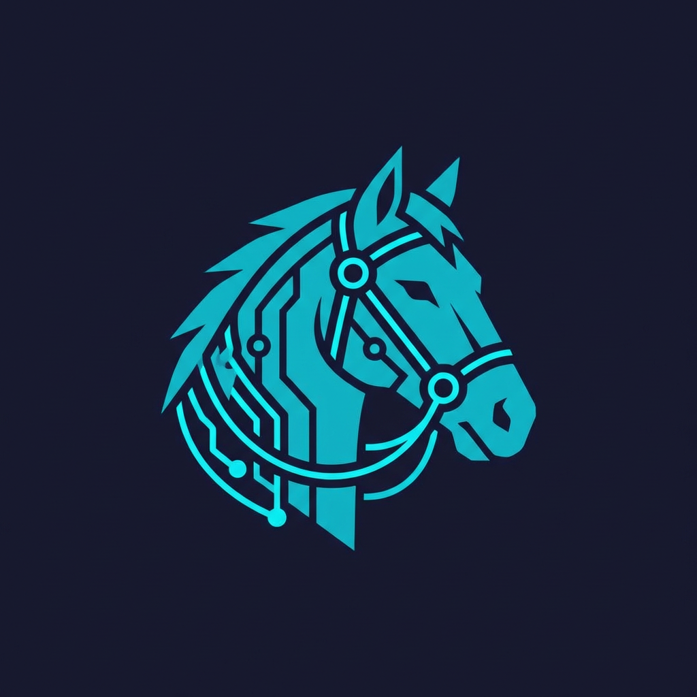
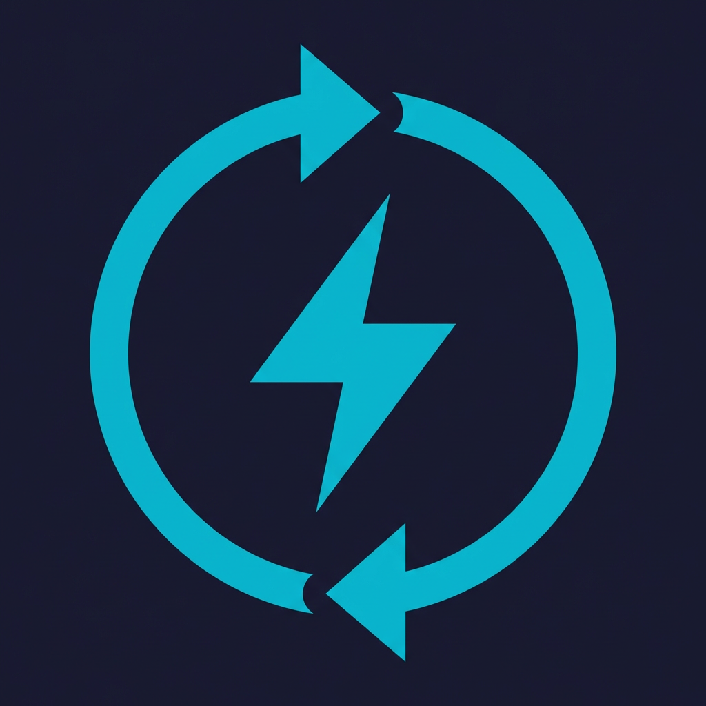
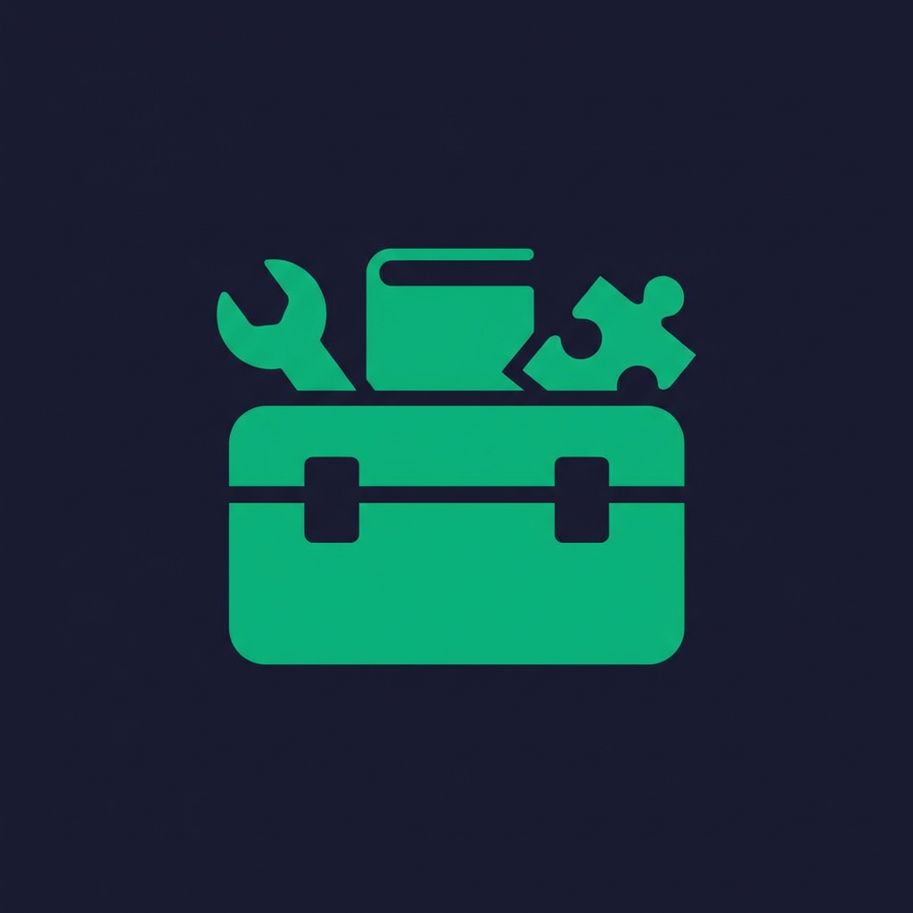
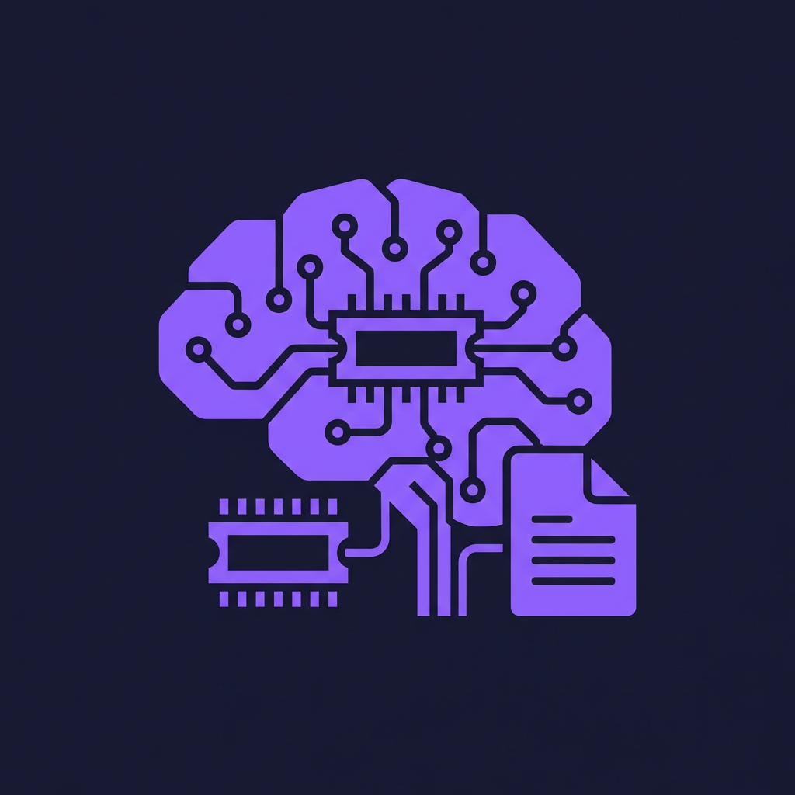
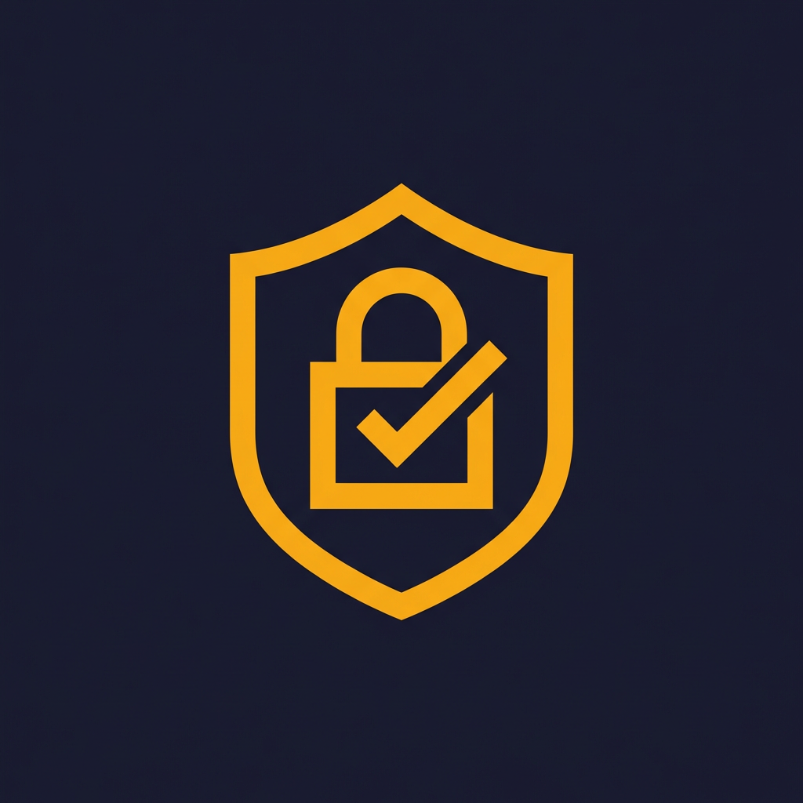
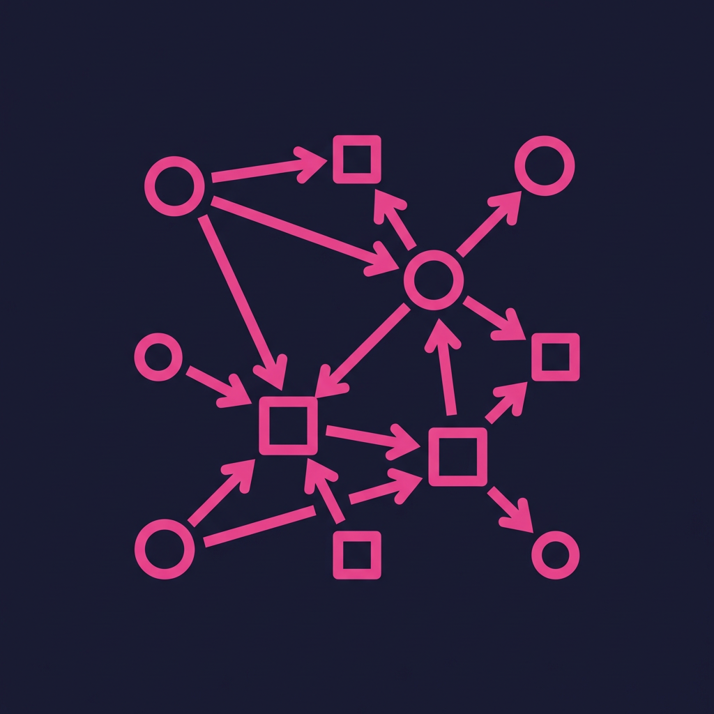
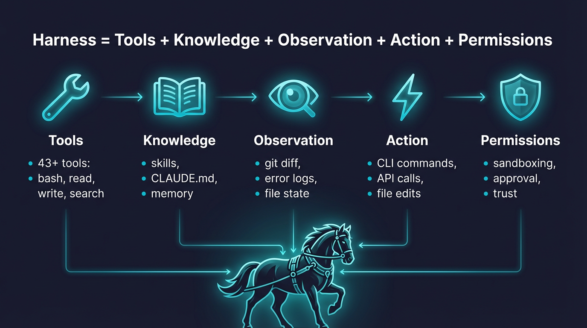
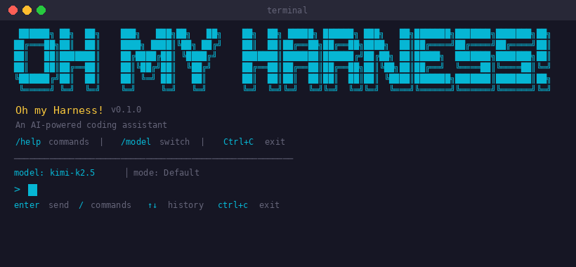
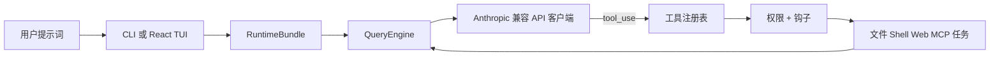

<h1 align="center">&nbsp; <code>oh</code> — OpenHarness: 开源代理 Harness</h1>

<p align="center">
  <a href="README.md"><strong>English</strong></a> ·
  <a href="README.zh-CN.md"><strong>简体中文</strong></a>
</p>

**OpenHarness** 提供核心轻量级代理基础设施：工具使用、技能、内存和多代理协调。

**加入社区**：为开放的代理开发贡献 **Harness**。

<p align="center">
  <a href="#-quick-start"></a>
  <a href="#-harness-architecture"></a>
  <a href="#-features"></a>
  <a href="#-test-results"></a>
  <a href="LICENSE"></a>
</p>

<p align="center">
  
  
  
  
  
  <a href="https://github.com/HKUDS/OpenHarness/actions/workflows/ci.yml"></a>
  <a href="https://github.com/HKUDS/.github/blob/main/profile/README.md"></a>
  <a href="https://github.com/HKUDS/.github/blob/main/profile/README.md"></a>
</p>

一条命令（**oh**）启动 **OpenHarness**，解锁所有代理 Harness 能力。

支持 CLI 代理集成，包括 OpenClaw、nanobot、Cursor 等。

<p align="center">
  
</p>

<p align="center">
  
</p>

---
## ✨ OpenHarness 核心 Harness 特性

<table align="center" width="100%">
<tr>
<td width="20%" align="center" style="vertical-align: top; padding: 15px;">

<h3>🔄 代理循环</h3>

<div align="center">
  
</div>



<p align="center"><strong>• 流式工具调用循环</strong></p>
<p align="center"><strong>• 指数退避 API 重试</strong></p>
<p align="center"><strong>• 并行工具执行</strong></p>
<p align="center"><strong>• Token 计数与成本追踪</strong></p>

</td>
<td width="20%" align="center" style="vertical-align: top; padding: 15px;">

<h3>🔧 Harness 工具包</h3>

<div align="center">
  
</div>



<p align="center"><strong>• 43 个工具（文件、Shell、搜索、Web、MCP）</strong></p>
<p align="center"><strong>• 按需技能加载（.md）</strong></p>
<p align="center"><strong>• 插件生态系统（技能 + 钩子 + 代理）</strong></p>
<p align="center"><strong>• 兼容 anthropics/skills 和插件</strong></p>

</td>
<td width="20%" align="center" style="vertical-align: top; padding: 15px;">

<h3>🧠 上下文与内存</h3>

<div align="center">
  
</div>



<p align="center"><strong>• CLAUDE.md 发现与注入</strong></p>
<p align="center"><strong>• 上下文压缩（Auto-Compact）</strong></p>
<p align="center"><strong>• MEMORY.md 持久化内存</strong></p>
<p align="center"><strong>• 会话恢复与历史记录</strong></p>

</td>
<td width="20%" align="center" style="vertical-align: top; padding: 15px;">

<h3>🛡️ 治理</h3>

<div align="center">
  
</div>



<p align="center"><strong>• 多级权限模式</strong></p>
<p align="center"><strong>• 路径级和命令规则</strong></p>
<p align="center"><strong>• PreToolUse / PostToolUse 钩子</strong></p>
<p align="center"><strong>• 交互式审批对话框</strong></p>

</td>
<td width="20%" align="center" style="vertical-align: top; padding: 15px;">

<h3>🤝 群体协调</h3>

<div align="center">
  
</div>



<p align="center"><strong>• 子代理生成与委派</strong></p>
<p align="center"><strong>• 团队注册与任务管理</strong></p>
<p align="center"><strong>• 后台任务生命周期</strong></p>
<p align="center"><strong>• <a href="https://github.com/HKUDS/ClawTeam">ClawTeam</a> 集成（路线图）</strong></p>

</td>
</tr>
</table>

---

## 🤔 什么是代理 Harness？

**代理 Harness** 是围绕 LLM 使其成为功能性代理的完整基础设施。模型提供智能；harness 提供**双手、眼睛、记忆和安全边界**。

<p align="center">
  
</p>

OpenHarness 是一个专为**研究人员、构建者和社区**设计的开源 Python 实现：

- **理解**生产级 AI 代理的底层工作原理
- **实验**前沿的工具、技能和代理协调模式
- **扩展** harness，添加自定义插件、提供商和领域知识
- **构建**基于经过验证的架构的专业代理

---

## 📰 最新动态

- **2026-04-06** 🚀 **v0.1.2** — 统一设置流程和 `ohmo` 个人代理应用：
  - `oh setup` 现在以工作流方式引导提供商选择，而非暴露原始认证/提供商细节
  - 兼容 API 设置现在按配置文件区分，因此 Anthropic/OpenAI 兼容端点可以使用不同的密钥
  - `ohmo` 作为打包应用发布，带有 `~/.ohmo` 工作空间、网关、引导提示词和通道配置流程
- **2026-04-01** 🎨 **v0.1.0** — **OpenHarness** 初始开源发布，包含完整的 Harness 架构：

<p align="center">
  <strong>从此开始：</strong>
  <a href="#-quick-start">快速开始</a> ·
  <a href="#-provider-compatibility">提供商兼容性</a> ·
  <a href="docs/SHOWCASE.md">展示</a> ·
  <a href="CONTRIBUTING.md">贡献</a> ·
  <a href="CHANGELOG.md">更新日志</a>
</p>

---

## 🚀 快速开始

### 一键安装

最快的入门方式 — 一条命令处理操作系统检测、依赖检查和安装：

```bash
curl -fsSL https://raw.githubusercontent.com/HKUDS/OpenHarness/main/scripts/install.sh | bash
```

**选项：**

| 标志 | 说明 |
|------|------|
| `--from-source` | 从 GitHub 克隆并以可编辑模式安装（`pip install -e .`） |
| `--with-channels` | 同时安装 IM 通道依赖（`slack-sdk`、`python-telegram-bot`、`discord.py`） |

```bash
# 从源码安装（适合贡献者 / 最新代码）
curl -fsSL https://raw.githubusercontent.com/HKUDS/OpenHarness/main/scripts/install.sh | bash -s -- --from-source

# 安装 IM 通道支持
curl -fsSL https://raw.githubusercontent.com/HKUDS/OpenHarness/main/scripts/install.sh | bash -s -- --with-channels

# 或者克隆后本地运行
bash scripts/install.sh --from-source --with-channels
```

脚本将：
1. 检测你的操作系统（Linux / macOS / WSL）
2. 验证 Python >= 3.10 和 Node.js >= 18
3. 通过 `pip` 安装 OpenHarness
4. 如果有 Node.js，设置 React TUI（`npm install`）
5. 创建 `~/.openharness/` 配置目录
6. 用 `oh --version` 确认安装

### 前提条件

- **Python 3.10+** 和 [uv](https://docs.astral.sh/uv/)
- **Node.js 18+**（可选，用于 React 终端 UI）
- 一个 LLM API 密钥

### 一条命令演示

```bash
ANTHROPIC_API_KEY=your_key uv run oh -p "检查此仓库并列出前 3 个重构建议"
```

### 安装与运行

```bash
# 克隆并安装
git clone https://github.com/HKUDS/OpenHarness.git
cd OpenHarness
uv sync --extra dev

# 示例：使用 Kimi 作为后端
export ANTHROPIC_BASE_URL=https://api.moonshot.cn/anthropic
export ANTHROPIC_API_KEY=your_kimi_api_key
export ANTHROPIC_MODEL=kimi-k2.5

# 启动
oh                    # 如果虚拟环境已激活
uv run oh             # 不激活虚拟环境
```

### 配置工作流

使用统一的设置流程，而无需手动考虑 `认证 -> 提供商 -> 模型`：

```bash
uv run oh setup
```

`oh setup` 引导流程：

1. 选择工作流：
   - `Anthropic 兼容 API`
   - `Claude 订阅`
   - `OpenAI 兼容 API`
   - `Codex 订阅`
   - `GitHub Copilot`
2. 对于兼容 API 系列，选择具体的后端预设
3. 如需要，对所选工作流进行认证
4. 选择或确认模型
5. 保存并激活配置文件

兼容 API 系列目前引导你通过以下预设：

- `Anthropic 兼容 API`：
  - Claude 官方
  - Moonshot / Kimi
  - Zhipu / GLM
  - MiniMax
- `OpenAI 兼容 API`：
  - OpenAI 官方
  - OpenRouter

任意兼容端点仍通过高级配置文件命令支持：

```bash
oh provider add my-endpoint \
  --label "My Endpoint" \
  --provider anthropic \
  --api-format anthropic \
  --auth-source anthropic_api_key \
  --model my-model \
  --base-url https://example.com/anthropic
```

OpenHarness 在适当时候以配置文件级别的凭据存储基于 API 密钥的兼容配置文件，因此不同的兼容端点不必共享一个全局密钥。

<p align="center">
  
</p>

### 非交互模式（管道与脚本）

```bash
# 单条提示词 -> stdout
oh -p "解释这个代码库"

# JSON 输出，用于编程使用
oh -p "列出 main.py 中的所有函数" --output-format json

# 实时流式 JSON 事件
oh -p "修复这个 bug" --output-format stream-json
```

## 🔌 提供商兼容性

OpenHarness 将提供商视为由命名配置文件支持的**工作流**。日常使用中，推荐：

```bash
oh setup
oh provider list
oh provider use <profile>
```

### 内置工作流

| 工作流 | 说明 | 典型后端 |
|----------|------------|------------------|
| **Anthropic 兼容 API** | Anthropic 风格请求格式 | Claude 官方、Kimi、GLM、MiniMax、内部 Anthropic 兼容网关 |
| **Claude 订阅** | Claude CLI 订阅桥接 | 本地 `~/.claude/.credentials.json` |
| **OpenAI 兼容 API** | OpenAI 风格请求格式 | OpenAI 官方、OpenRouter、DashScope、DeepSeek、SiliconFlow、Groq、Ollama、GitHub Models |
| **Codex 订阅** | Codex CLI 订阅桥接 | 本地 `~/.codex/auth.json` |
| **GitHub Copilot** | Copilot OAuth 工作流 | GitHub Copilot 设备流登录 |

### 兼容 API 系列

#### Anthropic 兼容 API

典型示例：

| 后端 | Base URL | 示例模型 |
|---------|----------|----------------|
| **Claude 官方** | `https://api.anthropic.com` | `claude-sonnet-4-6`, `claude-opus-4-6` |
| **Moonshot / Kimi** | `https://api.moonshot.cn/anthropic` | `kimi-k2.5` |
| **Zhipu / GLM** | 自定义 Anthropic 兼容端点 | `glm-4.5` |
| **MiniMax** | 自定义 Anthropic 兼容端点 | `minimax-m1` |

#### OpenAI 兼容 API

任何实现 OpenAI `/v1/chat/completions` 风格 API 的提供商均可使用：

| 后端 | Base URL | 示例模型 |
|---------|----------|----------------|
| **OpenAI** | `https://api.openai.com/v1` | `gpt-5.4`, `gpt-4.1` |
| **OpenRouter** | `https://openrouter.ai/api/v1` | 提供商特定 |
| **阿里 DashScope** | `https://dashscope.aliyuncs.com/compatible-mode/v1` | `qwen3.5-flash`, `qwen3-max`, `deepseek-r1` |
| **DeepSeek** | `https://api.deepseek.com` | `deepseek-chat`, `deepseek-reasoner` |
| **GitHub Models** | `https://models.inference.ai.azure.com` | `gpt-4o`, `Meta-Llama-3.1-405B-Instruct` |
| **SiliconFlow** | `https://api.siliconflow.cn/v1` | `deepseek-ai/DeepSeek-V3` |
| **Groq** | `https://api.groq.com/openai/v1` | `llama-3.3-70b-versatile` |
| **Ollama（本地）** | `http://localhost:11434/v1` | 任意本地模型 |

### 高级配置文件管理

```bash
# 列出已保存的工作流
oh provider list

# 切换活跃工作流
oh provider use codex

# 添加自己的兼容端点
oh provider add my-endpoint \
  --label "My Endpoint" \
  --provider openai \
  --api-format openai \
  --auth-source openai_api_key \
  --model my-model \
  --base-url https://example.com/v1
```

对于自定义兼容端点，OpenHarness 可以按配置文件绑定凭据，而不强制每个 Anthropic 兼容或 OpenAI 兼容后端共享同一个 API 密钥。

### GitHub Copilot 格式（`--api-format copilot`）

使用你现有的 GitHub Copilot 订阅作为 LLM 后端。认证使用 GitHub 的 OAuth 设备流 — 无需 API 密钥。

```bash
# 一次性登录（打开浏览器进行 GitHub 授权）
oh auth copilot-login

# 然后使用 Copilot 作为提供商启动
uv run oh --api-format copilot

# 或通过环境变量
export OPENHARNESS_API_FORMAT=copilot
uv run oh

# 检查认证状态
oh auth status

# 移除存储的凭据
oh auth copilot-logout
```

| 功能 | 详情 |
|---------|---------|
| **认证方式** | GitHub OAuth 设备流（无需 API 密钥） |
| **令牌管理** | 短期会话令牌自动刷新 |
| **企业版** | 通过 `--github-domain` 标志支持 GitHub Enterprise |
| **模型** | 使用 Copilot 的默认模型选择 |
| **API** | 底层为 OpenAI 兼容的 chat completions |

---

## 🏗️ Harness 架构

OpenHarness 实现了核心代理 Harness 模式，包含 10 个子系统：

```
openharness/
  engine/          # 🧠 代理循环 — 查询 -> 流式传输 -> 工具调用 -> 循环
  tools/           # 🔧 43 个工具 — 文件 I/O、shell、搜索、web、MCP
  skills/          # 📚 知识 — 按需技能加载（.md 文件）
  plugins/         # 🔌 扩展 — 命令、钩子、代理、MCP 服务器
  permissions/     # 🛡️ 安全 — 多级模式、路径规则、命令拒绝
  hooks/           # ⚡ 生命周期 — PreToolUse/PostToolUse 事件钩子
  commands/        # 💬 54 个命令 — /help、/commit、/plan、/resume ...
  mcp/             # 🌐 MCP — Model Context Protocol 客户端
  memory/          # 🧠 内存 — 持久化的跨会话知识
  tasks/           # 📋 任务 — 后台任务管理
  coordinator/     # 🤝 多代理 — 子代理生成、团队协调
  prompts/         # 📝 上下文 — 系统提示词组装、CLAUDE.md、技能
  config/          # ⚙️ 设置 — 多层配置、迁移
  ui/              # 🖥️ React TUI — 后端协议 + 前端
```

### 代理循环

harness 的核心。一个循环，无限可组合：

```python
while True:
    response = await api.stream(messages, tools)

    if response.stop_reason != "tool_use":
        break  # 模型完成

    for tool_call in response.tool_uses:
        # 权限检查 -> 钩子 -> 执行 -> 钩子 -> 结果
        result = await harness.execute_tool(tool_call)

    messages.append(tool_results)
    # 循环继续 — 模型看到结果，决定下一步行动
```

模型决定**做什么**。harness 处理**怎么做** — 安全、高效，具有完整的可观测性。

### Harness 流程



---

## ✨ 功能特性

### 🔧 工具（43+）

| 类别 | 工具 | 说明 |
|----------|-------|-------------|
| **文件 I/O** | Bash, Read, Write, Edit, Glob, Grep | 带权限检查的核心文件操作 |
| **搜索** | WebFetch, WebSearch, ToolSearch, LSP | Web 和代码搜索能力 |
| **笔记本** | NotebookEdit | Jupyter 笔记本单元格编辑 |
| **代理** | Agent, SendMessage, TeamCreate/Delete | 子代理生成和协调 |
| **任务** | TaskCreate/Get/List/Update/Stop/Output | 后台任务管理 |
| **MCP** | MCPTool, ListMcpResources, ReadMcpResource | Model Context Protocol 集成 |
| **模式** | EnterPlanMode, ExitPlanMode, Worktree | 工作流模式切换 |
| **调度** | CronCreate/List/Delete, RemoteTrigger | 定时和远程执行 |
| **元工具** | Skill, Config, Brief, Sleep, AskUser | 知识加载、配置、交互 |

每个工具具有：
- **Pydantic 输入验证** — 结构化、类型安全的输入
- **自描述 JSON Schema** — 模型自动理解工具
- **权限集成** — 每次执行前检查
- **钩子支持** — PreToolUse/PostToolUse 生命周期事件

### 📚 技能系统

技能是**按需知识** — 仅在模型需要时加载：

```
可用技能：
- commit: 创建干净、结构良好的 git 提交
- review: 审查代码中的 bug、安全问题和质量
- debug: 系统化诊断和修复 bug
- plan: 在编码前设计实施方案
- test: 编写和运行代码测试
- simplify: 重构代码使其更简单、更易维护
- pdf: 使用 pypdf 处理 PDF（来自 anthropics/skills）
- xlsx: Excel 操作（来自 anthropics/skills）
- ... 40+ 更多
```

**兼容 [anthropics/skills](https://github.com/anthropics/skills)** — 只需将 `.md` 文件复制到 `~/.openharness/skills/`。

### 🔌 插件系统

**兼容 [claude-code 插件](https://github.com/anthropics/claude-code/tree/main/plugins)**。已用 12 个官方插件测试：

| 插件 | 类型 | 功能 |
|--------|------|-------------|
| `commit-commands` | 命令 | Git 提交、推送、PR 工作流 |
| `security-guidance` | 钩子 | 文件编辑时的安全警告 |
| `hookify` | 命令 + 代理 | 创建自定义行为钩子 |
| `feature-dev` | 命令 | 功能开发工作流 |
| `code-review` | 代理 | 多代理 PR 审查 |
| `pr-review-toolkit` | 代理 | 专门的 PR 审查代理 |

```bash
# 管理插件
oh plugin list
oh plugin install <source>
oh plugin enable <name>
```

### 🤝 生态系统工作流

OpenHarness 作为围绕 Claude 风格工具约定的轻量级 harness 层非常有用：

- **OpenClaw 导向的工作流**可以复用以 Markdown 为优先的知识和命令驱动的协作模式。
- **Claude 风格的插件和技能**保持可移植性，因为 OpenHarness 保持了这些格式的熟悉性。
- **ClawTeam 风格的多代理工作**很好地映射到内置的团队、任务和后台执行原语。

具体的用法示例而非泛泛而谈，请参见 [`docs/SHOWCASE.md`](docs/SHOWCASE.md)。

### 🛡️ 权限

多级安全，细粒度控制：

| 模式 | 行为 | 使用场景 |
|------|----------|----------|
| **默认** | 写入/执行前询问 | 日常开发 |
| **自动** | 允许一切 | 沙箱环境 |
| **计划模式** | 阻止所有写入 | 大型重构，先审查 |

**路径级规则**在 `settings.json` 中：
```json
{
  "permission": {
    "mode": "default",
    "path_rules": [{"pattern": "/etc/*", "allow": false}],
    "denied_commands": ["rm -rf /", "DROP TABLE *"]
  }
}
```

### 🖥️ 终端 UI

React/Ink TUI，完整的交互体验：

- **命令选择器**：输入 `/` -> 方向键选择 -> Enter
- **权限对话框**：交互式 y/n，带工具详情
- **模式切换器**：`/permissions` -> 从列表选择
- **会话恢复**：`/resume` -> 从历史记录选择
- **动画加载**：工具执行期间的实时反馈
- **键盘快捷键**：底部显示，上下文感知

### 📡 CLI

```
oh [OPTIONS] COMMAND [ARGS]

会话:     -c/--continue, -r/--resume, -n/--name
模型:       -m/--model, --effort, --max-turns
输出:      -p/--print, --output-format text|json|stream-json
权限: --permission-mode, --dangerously-skip-permissions
上下文:     -s/--system-prompt, --append-system-prompt, --settings
高级:    -d/--debug, --mcp-config, --bare
子命令: oh setup | oh provider | oh auth | oh mcp | oh plugin
```

### 🧑‍💼 ohmo 个人代理

`ohmo` 是基于 OpenHarness 构建的个人代理应用。它与 `oh` 一起打包，拥有自己的工作空间和网关：

```bash
# 初始化个人工作空间
ohmo init

# 配置网关通道并选择提供商配置文件
ohmo config

# 运行个人代理
ohmo

# 在前台运行网关
ohmo gateway run

# 检查或重启网关
ohmo gateway status
ohmo gateway restart
```

核心概念：

- `~/.ohmo/`
  - 个人工作空间根目录
- `soul.md`
  - 长期代理个性和行为
- `identity.md`
  - `ohmo` 是谁
- `user.md`
  - 用户资料和偏好
- `BOOTSTRAP.md`
  - 首次运行着陆仪式
- `memory/`
  - 个人记忆
- `gateway.json`
  - 选定的提供商配置文件和通道配置

`ohmo config` 使用与 `oh setup` 相同的工作流语言，因此你可以将个人代理网关指向：

- `Anthropic 兼容 API`
- `Claude 订阅`
- `OpenAI 兼容 API`
- `Codex 订阅`
- `GitHub Copilot`

`ohmo init` 一次性创建主工作空间。之后使用 `ohmo config` 更新提供商和通道设置；如果网关已在运行，配置流程可以为你重启它。

目前 `ohmo init` / `ohmo config` 可以引导以下通道设置：

- Telegram
- Slack
- Discord
- Feishu

---

## 📊 测试结果

| 测试套件 | 测试数 | 状态 |
|-------|-------|--------|
| 单元 + 集成 | 114 | ✅ 全部通过 |
| CLI 标志 E2E | 6 | ✅ 真实模型调用 |
| Harness 功能 E2E | 9 | ✅ 重试、技能、并行、权限 |
| React TUI E2E | 3 | ✅ 欢迎、对话、状态 |
| TUI 交互 E2E | 4 | ✅ 命令、权限、快捷键 |
| 真实技能 + 插件 | 12 | ✅ anthropics/skills + claude-code/plugins |

```bash
# 运行所有测试
uv run pytest -q                           # 114 单元/集成
python scripts/test_harness_features.py     # Harness E2E
python scripts/test_real_skills_plugins.py  # 真实插件 E2E
```

---

## 🔧 扩展 OpenHarness

### 添加自定义工具

```python
from pydantic import BaseModel, Field
from openharness.tools.base import BaseTool, ToolExecutionContext, ToolResult

class MyToolInput(BaseModel):
    query: str = Field(description="Search query")

class MyTool(BaseTool):
    name = "my_tool"
    description = "Does something useful"
    input_model = MyToolInput

    async def execute(self, arguments: MyToolInput, context: ToolExecutionContext) -> ToolResult:
        return ToolResult(output=f"Result for: {arguments.query}")
```

### 添加自定义技能

创建 `~/.openharness/skills/my-skill.md`：

```markdown
---
name: my-skill
description: Expert guidance for my specific domain
---

# My Skill

## When to use
Use when the user asks about [your domain].

## Workflow
1. Step one
2. Step two
...
```

### 添加插件

创建 `.openharness/plugins/my-plugin/.claude-plugin/plugin.json`：

```json
{
  "name": "my-plugin",
  "version": "1.0.0",
  "description": "My custom plugin"
}
```

在 `commands/*.md` 中添加命令，在 `hooks/hooks.json` 中添加钩子，在 `agents/*.md` 中添加代理。

---

## 🌍 展示

OpenHarness 在作为一个小型、可检查的 harness 适配实际工作流时最为有用：

- **代码库编程助手**，用于阅读代码、修补文件和在本地运行检查。
- **无头脚本工具**，用于自动化流程中的 `json` 和 `stream-json` 输出。
- **插件和技能试验场**，用于实验 Claude 风格的扩展。
- **多代理原型 harness**，用于任务委派和后台执行。
- **提供商对比沙箱**，跨 Anthropic 兼容后端进行比较。

简短、可复现的示例见 [`docs/SHOWCASE.md`](docs/SHOWCASE.md)。

---

## 🤝 贡献

OpenHarness 是一个**社区驱动的研究项目**。我们欢迎以下方面的贡献：

| 领域 | 示例 |
|------|---------|
| **工具** | 面向特定领域的新工具实现 |
| **技能** | 领域知识 `.md` 文件（金融、科学、DevOps...） |
| **插件** | 带命令、钩子、代理的工作流插件 |
| **提供商** | 支持更多 LLM 后端（OpenAI、Ollama 等） |
| **多代理** | 协调协议、团队模式 |
| **测试** | E2E 场景、边界情况、基准测试 |
| **文档** | 架构指南、教程、翻译 |

```bash
# 开发设置
git clone https://github.com/HKUDS/OpenHarness.git
cd OpenHarness
uv sync --extra dev
uv run pytest -q  # 验证一切正常
```

有用的贡献者入口：

- [`CONTRIBUTING.md`](CONTRIBUTING.md) 了解设置、检查和 PR 期望
- [`CHANGELOG.md`](CHANGELOG.md) 了解用户可见的变更
- [`docs/SHOWCASE.md`](docs/SHOWCASE.md) 了解值得记录的真实用法模式

---

## 📄 许可证

MIT — 详见 [LICENSE](LICENSE)。

---

<p align="center">
  
  <br>
  <strong>Oh my Harness!</strong>
  <br>
  <em>模型即代理。代码即 harness。</em>
</p>

<div align="center">
  <a href="https://star-history.com/#HKUDS/OpenHarness&Date">
    <picture>
      <source media="(prefers-color-scheme: dark)" srcset="assets/012-svg-1173cc4671.svg" />
      <source media="(prefers-color-scheme: light)" srcset="assets/011-svg-0e134c34bf.svg" />
      
    </picture>
  </a>
</div>

<p align="center">
  <em> 感谢访问 ✨ OpenHarness！</em><br><br>
  
</p>
