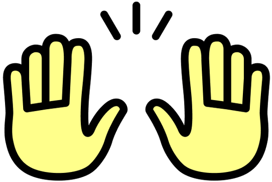
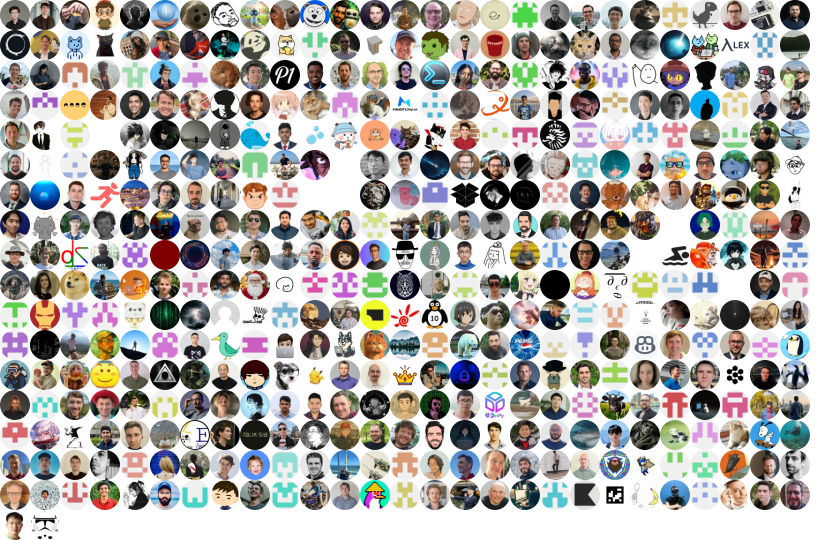

  
  <h1 align="center" style="border-bottom: none">OpenHands: AI-Driven Development</h1>

  
  
   
  
  

  <!-- Keep these links. Translations will automatically update with the README. -->
  <a href="https://www.readme-i18n.com/OpenHands/OpenHands?lang=de">Deutsch</a> |
  <a href="https://www.readme-i18n.com/OpenHands/OpenHands?lang=es">Español</a> |
  <a href="https://www.readme-i18n.com/OpenHands/OpenHands?lang=fr">français</a> |
  <a href="https://www.readme-i18n.com/OpenHands/OpenHands?lang=ja">日本語</a> |
  <a href="https://www.readme-i18n.com/OpenHands/OpenHands?lang=ko">한국어</a> |
  <a href="https://www.readme-i18n.com/OpenHands/OpenHands?lang=pt">Português</a> |
  <a href="https://www.readme-i18n.com/OpenHands/OpenHands?lang=ru">Русский</a> |
  <a href="https://www.readme-i18n.com/OpenHands/OpenHands?lang=zh">中文</a>

🙌 Welcome to OpenHands, a [community](COMMUNITY.md) focused on AI-driven development. We’d love for you to [join us on Slack](https://dub.sh/openhands).

There are a few ways to work with OpenHands:

### OpenHands Software Agent SDK
The SDK is a composable Python library that contains all of our agentic tech. It's the engine that powers everything else below.

Define agents in code, then run them locally, or scale to 1000s of agents in the cloud.

[Check out the docs](https://docs.openhands.dev/sdk) or [view the source](https://github.com/OpenHands/software-agent-sdk/)

### OpenHands CLI
The CLI is the easiest way to start using OpenHands. The experience will be familiar to anyone who has worked
with e.g. Claude Code or Codex. You can power it with Claude, GPT, or any other LLM.

[Check out the docs](https://docs.openhands.dev/openhands/usage/run-openhands/cli-mode) or [view the source](https://github.com/OpenHands/OpenHands-CLI)

### OpenHands Local GUI
Use the Local GUI for running agents on your laptop. It comes with a REST API and a single-page React application.
The experience will be familiar to anyone who has used Devin or Jules.

[Check out the docs](https://docs.openhands.dev/openhands/usage/run-openhands/local-setup) or view the source in this repo.

### OpenHands Cloud
This is a deployment of OpenHands GUI, running on hosted infrastructure.

You can try it for free using the Minimax model by [signing in with your GitHub or GitLab account](https://app.all-hands.dev).

OpenHands Cloud comes with source-available features and integrations:
- Integrations with Slack, Jira, and Linear
- Multi-user support
- RBAC and permissions
- Collaboration features (e.g., conversation sharing)

### OpenHands Enterprise
Large enterprises can work with us to self-host OpenHands Cloud in their own VPC, via Kubernetes.
OpenHands Enterprise can also work with the CLI and SDK above.

OpenHands Enterprise is source-available--you can see all the source code here in the enterprise/ directory,
but you'll need to purchase a license if you want to run it for more than one month.

Enterprise contracts also come with extended support and access to our research team.

Learn more at [openhands.dev/enterprise](https://openhands.dev/enterprise)

### Everything Else

Check out our [Product Roadmap](https://github.com/orgs/openhands/projects/1), and feel free to
[open up an issue](https://github.com/OpenHands/OpenHands/issues) if there's something you'd like to see!

You might also be interested in our [evaluation infrastructure](https://github.com/OpenHands/benchmarks), our [chrome extension](https://github.com/OpenHands/openhands-chrome-extension/), or our [Theory-of-Mind module](https://github.com/OpenHands/ToM-SWE).

All our work is available under the MIT license, except for the `enterprise/` directory in this repository (see the [enterprise license](enterprise/LICENSE) for details).
The core `openhands` and `agent-server` Docker images are fully MIT-licensed as well.

If you need help with anything, or just want to chat, [come find us on Slack](https://dub.sh/openhands).

### Thank You to Our Contributors

### Trusted by Engineers at

    
  <picture>
    <source media="(prefers-color-scheme: dark)" srcset="assets/015-tiktok-367f0891f7.svg">
    
  </picture>
  <picture>
    <source media="(prefers-color-scheme: dark)" srcset="assets/016-vmware-07a5f2592b.svg">
    
  </picture>
  <picture>
    <source media="(prefers-color-scheme: dark)" srcset="assets/017-roche-f75621d28c.svg">
    
  </picture>
  <picture>
    <source media="(prefers-color-scheme: dark)" srcset="assets/018-amazon-98733729be.svg">
    
  </picture>
  <picture>
    <source media="(prefers-color-scheme: dark)" srcset="assets/019-c3-ai-af0f07123d.svg">
    
  </picture>
  <picture>
    <source media="(prefers-color-scheme: dark)" srcset="assets/020-netflix-d115736be3.svg">
    
  </picture>
  <picture>
    <source media="(prefers-color-scheme: dark)" srcset="assets/021-mastercard-dde924d53d.svg">
    
  </picture>
  <picture>
    <source media="(prefers-color-scheme: dark)" srcset="assets/022-red-hat-8918d393ef.svg">
    
  </picture>
  <picture>
    <source media="(prefers-color-scheme: dark)" srcset="assets/023-mongodb-1a082ec22c.svg">
    
  </picture>
  <picture>
    <source media="(prefers-color-scheme: dark)" srcset="assets/024-apple-111052cb38.svg">
    
  </picture>
  <picture>
    <source media="(prefers-color-scheme: dark)" srcset="assets/025-nvidia-10c520ed18.svg">
    
  </picture>
  <picture>
    <source media="(prefers-color-scheme: dark)" srcset="assets/026-google-ee8fc9fd55.svg">
    
  </picture>

