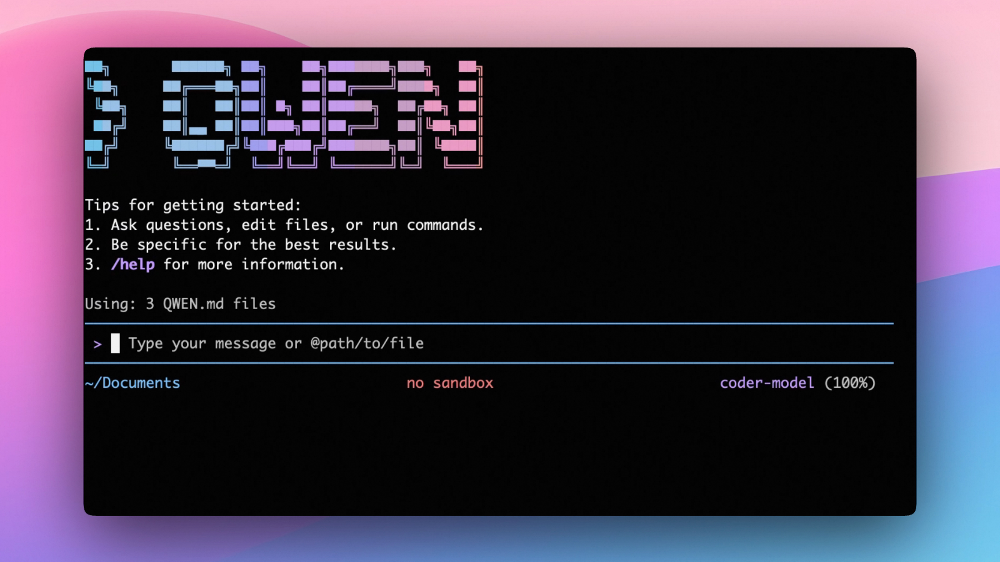

<div align="center">

[](https://www.npmjs.com/package/@qwen-code/qwen-code)
[](./LICENSE)
[](https://nodejs.org/)
[](https://www.npmjs.com/package/@qwen-code/qwen-code)

<a href="https://trendshift.io/repositories/15287" target="_blank"></a>

**一个运行在你终端中的开源 AI 代理。**

<a href="https://qwenlm.github.io/qwen-code-docs/zh/users/overview">中文</a> |
<a href="https://qwenlm.github.io/qwen-code-docs/de/users/overview">Deutsch</a> |
<a href="https://qwenlm.github.io/qwen-code-docs/fr/users/overview">français</a> |
<a href="https://qwenlm.github.io/qwen-code-docs/ja/users/overview">日本語</a> |
<a href="https://qwenlm.github.io/qwen-code-docs/ru/users/overview">Русский</a> |
<a href="https://qwenlm.github.io/qwen-code-docs/pt-BR/users/overview">Português (Brasil)</a>

</div>

## 🎉 新闻

- **2026-04-02**：Qwen3.6-Plus 已上线！通过 Qwen OAuth 登录即可直接使用，或从 [Alibaba Cloud ModelStudio](https://modelstudio.console.alibabacloud.com/ap-southeast-1?tab=doc#/doc/?type=model&url=2840914_2&modelId=qwen3.6-plus) 获取 API 密钥，通过 OpenAI 兼容 API 访问。

- **2026-02-16**：Qwen3.5-Plus 已上线！

## 为什么选择 Qwen Code？

Qwen Code 是一个面向终端的开源 AI 代理，针对 Qwen 系列模型进行了优化。它帮助你理解大型代码库、自动化繁琐工作并更快地交付。

- **多协议，OAuth 免费额度**：支持 OpenAI / Anthropic / Gemini 兼容 API，或通过 Qwen OAuth 登录即可获得每天 1,000 次免费请求。
- **开源，共同进化**：框架和 Qwen3-Coder 模型均为开源——它们同步发布、共同进化。
- **代理工作流，功能丰富**：丰富的内置工具（Skills、SubAgents），提供完整的代理工作流和类似 Claude Code 的体验。
- **终端优先，IDE 友好**：为在命令行中工作的开发者而构建，同时支持 VS Code、Zed 和 JetBrains IDE 集成。



## 安装

### 快速安装（推荐）

#### Linux / macOS

```bash
bash -c "$(curl -fsSL https://qwen-code-assets.oss-cn-hangzhou.aliyuncs.com/installation/install-qwen.sh)"
```

#### Windows（以管理员身份运行 CMD）

```cmd
curl -fsSL -o %TEMP%\install-qwen.bat https://qwen-code-assets.oss-cn-hangzhou.aliyuncs.com/installation/install-qwen.bat && %TEMP%\install-qwen.bat
```

> **注意**：安装后建议重启终端，以确保环境变量生效。

### 手动安装

#### 前置条件

确保已安装 Node.js 20 或更高版本。从 [nodejs.org](https://nodejs.org/en/download) 下载。

#### NPM

```bash
npm install -g @qwen-code/qwen-code@latest
```

#### Homebrew（macOS、Linux）

```bash
brew install qwen-code
```

## 快速开始

```bash
# 启动 Qwen Code（交互模式）
qwen

# 然后在会话中运行：
/help
/auth
```

首次使用时，系统会提示你登录。你可以随时运行 `/auth` 切换认证方式。

示例提示词：

```text
这个项目是做什么的？
解释一下代码库结构。
帮我重构这个函数。
为这个模块生成单元测试。
```

<details>
<summary>点击观看演示视频</summary>

<video src="https://cloud.video.taobao.com/vod/HLfyppnCHplRV9Qhz2xSqeazHeRzYtG-EYJnHAqtzkQ.mp4" controls>
Your browser does not support the video tag.
</video>

</details>

## 🦞 在 Claw 中使用 Qwen Code 执行编码任务

复制以下提示词并粘贴到你的代理中：

```
Use Qwen Code as a coding agent. First, fetch and read this skill reference:
https://raw.githubusercontent.com/QwenLM/qwen-code/refs/heads/main/.qwen/skills/qwen-code-claw/SKILL.md
Then follow the instructions inside to install, authenticate, and use Qwen Code via acpx for all coding tasks.
```

## 认证

Qwen Code 支持两种认证方式：

- **Qwen OAuth（推荐且免费）**：使用你的 `qwen.ai` 账号在浏览器中登录。
- **API-KEY**：使用 API 密钥连接到任何受支持的提供商（OpenAI、Anthropic、Google GenAI、阿里云百炼及其他兼容端点）。

#### Qwen OAuth（推荐）

启动 `qwen`，然后运行：

```bash
/auth
```

选择 **Qwen OAuth** 并完成浏览器登录流程。你的凭证会在本地缓存，通常无需再次登录。

> **注意**：在非交互式或无头环境中（如 CI、SSH、容器），通常**无法**完成 OAuth 浏览器登录流程。在这些情况下，请使用 API-KEY 认证方式。

<a id="api-key-flexible"></a>

#### API-KEY（灵活）

适用于需要灵活选择提供商和模型的场景。支持多种协议：

- **OpenAI 兼容**：阿里云百炼、ModelScope、OpenAI、OpenRouter 及其他 OpenAI 兼容提供商
- **Anthropic**：Claude 模型
- **Google GenAI**：Gemini 模型

配置模型和提供商的**推荐**方式是编辑 `~/.qwen/settings.json`（如果不存在则创建）。该文件让你在一个地方定义所有可用模型、API 密钥和默认设置。

##### 三步快速配置

**第一步：** 创建或编辑 `~/.qwen/settings.json`

以下是一个完整示例：

```json
{
  "modelProviders": {
    "openai": [
      {
        "id": "qwen3.6-plus",
        "name": "qwen3.6-plus",
        "baseUrl": "https://dashscope.aliyuncs.com/compatible-mode/v1",
        "description": "Qwen3-Coder via Dashscope",
        "envKey": "DASHSCOPE_API_KEY"
      }
    ]
  },
  "env": {
    "DASHSCOPE_API_KEY": "sk-xxxxxxxxxxxxx"
  },
  "security": {
    "auth": {
      "selectedType": "openai"
    }
  },
  "model": {
    "name": "qwen3.6-plus"
  }
}
```

**第二步：** 了解每个字段

| 字段 | 作用 |
| ---------------------------- | ---------------------------------------------------------------------- |
| `modelProviders` | 声明哪些模型可用以及如何连接。键如 `openai`、`anthropic`、`gemini` 代表 API 协议。 |
| `modelProviders[].id` | 发送给 API 的模型 ID（如 `qwen3.6-plus`、`gpt-4o`）。 |
| `modelProviders[].envKey` | 保存 API 密钥的环境变量名称。 |
| `modelProviders[].baseUrl` | API 端点 URL（非默认端点时必填）。 |
| `env` | 存储 API 密钥的备用位置（优先级最低；敏感密钥建议使用 `.env` 文件或 `export`）。 |
| `security.auth.selectedType` | 启动时使用的协议（`openai`、`anthropic`、`gemini`、`vertex-ai`）。 |
| `model.name` | Qwen Code 启动时使用的默认模型。 |

**第三步：** 启动 Qwen Code——配置将自动生效：

```bash
qwen
```

随时使用 `/model` 命令在所有已配置的模型之间切换。

##### 更多示例

<details>
<summary>编码套餐（阿里云百炼）—— 固定月费，更高额度</summary>

```json
{
  "modelProviders": {
    "openai": [
      {
        "id": "qwen3.6-plus",
        "name": "qwen3.6-plus (Coding Plan)",
        "baseUrl": "https://coding.dashscope.aliyuncs.com/v1",
        "description": "qwen3.6-plus from ModelStudio Coding Plan",
        "envKey": "BAILIAN_CODING_PLAN_API_KEY"
      },
      {
        "id": "qwen3.5-plus",
        "name": "qwen3.5-plus (Coding Plan)",
        "baseUrl": "https://coding.dashscope.aliyuncs.com/v1",
        "description": "qwen3.5-plus with thinking enabled from ModelStudio Coding Plan",
        "envKey": "BAILIAN_CODING_PLAN_API_KEY",
        "generationConfig": {
          "extra_body": {
            "enable_thinking": true
          }
        }
      },
      {
        "id": "glm-4.7",
        "name": "glm-4.7 (Coding Plan)",
        "baseUrl": "https://coding.dashscope.aliyuncs.com/v1",
        "description": "glm-4.7 with thinking enabled from ModelStudio Coding Plan",
        "envKey": "BAILIAN_CODING_PLAN_API_KEY",
        "generationConfig": {
          "extra_body": {
            "enable_thinking": true
          }
        }
      },
      {
        "id": "kimi-k2.5",
        "name": "kimi-k2.5 (Coding Plan)",
        "baseUrl": "https://coding.dashscope.aliyuncs.com/v1",
        "description": "kimi-k2.5 with thinking enabled from ModelStudio Coding Plan",
        "envKey": "BAILIAN_CODING_PLAN_API_KEY",
        "generationConfig": {
          "extra_body": {
            "enable_thinking": true
          }
        }
      }
    ]
  },
  "env": {
    "BAILIAN_CODING_PLAN_API_KEY": "sk-xxxxxxxxxxxxx"
  },
  "security": {
    "auth": {
      "selectedType": "openai"
    }
  },
  "model": {
    "name": "qwen3.6-plus"
  }
}
```

> 订阅编码套餐并在 [阿里云百炼（北京）](https://bailian.console.aliyun.com/cn-beijing?tab=coding-plan#/efm/coding-plan-index) 或 [阿里云百炼（国际）](https://modelstudio.console.alibabacloud.com/?tab=coding-plan#/efm/coding-plan-index) 获取 API 密钥。

</details>

<details>
<summary>多个提供商（OpenAI + Anthropic + Gemini）</summary>

```json
{
  "modelProviders": {
    "openai": [
      {
        "id": "gpt-4o",
        "name": "GPT-4o",
        "envKey": "OPENAI_API_KEY",
        "baseUrl": "https://api.openai.com/v1"
      }
    ],
    "anthropic": [
      {
        "id": "claude-sonnet-4-20250514",
        "name": "Claude Sonnet 4",
        "envKey": "ANTHROPIC_API_KEY"
      }
    ],
    "gemini": [
      {
        "id": "gemini-2.5-pro",
        "name": "Gemini 2.5 Pro",
        "envKey": "GEMINI_API_KEY"
      }
    ]
  },
  "env": {
    "OPENAI_API_KEY": "sk-xxxxxxxxxxxxx",
    "ANTHROPIC_API_KEY": "sk-ant-xxxxxxxxxxxxx",
    "GEMINI_API_KEY": "AIzaxxxxxxxxxxxxx"
  },
  "security": {
    "auth": {
      "selectedType": "openai"
    }
  },
  "model": {
    "name": "gpt-4o"
  }
}
```

</details>

<details>
<summary>启用思考模式（适用于 qwen3.5-plus 等支持的模型）</summary>

```json
{
  "modelProviders": {
    "openai": [
      {
        "id": "qwen3.5-plus",
        "name": "qwen3.5-plus (thinking)",
        "envKey": "DASHSCOPE_API_KEY",
        "baseUrl": "https://dashscope.aliyuncs.com/compatible-mode/v1",
        "generationConfig": {
          "extra_body": {
            "enable_thinking": true
          }
        }
      }
    ]
  },
  "env": {
    "DASHSCOPE_API_KEY": "sk-xxxxxxxxxxxxx"
  },
  "security": {
    "auth": {
      "selectedType": "openai"
    }
  },
  "model": {
    "name": "qwen3.5-plus"
  }
}
```

</details>

> **提示：** 你也可以通过 shell 中的 `export` 或 `.env` 文件设置 API 密钥，其优先级高于 `settings.json` → `env`。详见[认证指南](https://qwenlm.github.io/qwen-code-docs/en/users/configuration/auth/)。

> **安全提示：** 切勿将 API 密钥提交到版本控制中。`~/.qwen/settings.json` 文件位于你的主目录，应保持私密。

## 使用方式

作为一个开源终端代理，你可以通过四种主要方式使用 Qwen Code：

1. 交互模式（终端 UI）
2. 无头模式（脚本、CI）
3. IDE 集成（VS Code、Zed）
4. TypeScript SDK

#### 交互模式

```bash
cd your-project/
qwen
```

在项目文件夹中运行 `qwen` 启动交互式终端 UI。使用 `@` 引用本地文件（例如 `@src/main.ts`）。

#### 无头模式

```bash
cd your-project/
qwen -p "你的问题"
```

使用 `-p` 在无交互 UI 的情况下运行 Qwen Code——适用于脚本、自动化和 CI/CD。了解更多：[无头模式](https://qwenlm.github.io/qwen-code-docs/en/users/features/headless)。

#### IDE 集成

在你的编辑器中使用 Qwen Code（VS Code、Zed 和 JetBrains IDE）：

- [在 VS Code 中使用](https://qwenlm.github.io/qwen-code-docs/en/users/integration-vscode/)
- [在 Zed 中使用](https://qwenlm.github.io/qwen-code-docs/en/users/integration-zed/)
- [在 JetBrains IDE 中使用](https://qwenlm.github.io/qwen-code-docs/en/users/integration-jetbrains/)

#### TypeScript SDK

基于 Qwen Code 进行构建：

- [使用 Qwen Code SDK](./packages/sdk-typescript/README.md)

## 命令与快捷键

### 会话命令

- `/help` - 显示可用命令
- `/clear` - 清除对话历史
- `/compress` - 压缩历史以节省 token
- `/stats` - 显示当前会话信息
- `/bug` - 提交 bug 报告
- `/exit` 或 `/quit` - 退出 Qwen Code

### 键盘快捷键

- `Ctrl+C` - 取消当前操作
- `Ctrl+D` - 退出（在空行时）
- `Up/Down` - 浏览命令历史

> 了解更多关于[命令](https://qwenlm.github.io/qwen-code-docs/en/users/features/commands/)的信息
>
> **提示**：在 YOLO 模式（`--yolo`）下，检测到图像时会自动切换视觉模式，无需提示。了解更多关于[审批模式](https://qwenlm.github.io/qwen-code-docs/en/users/features/approval-mode/)的信息

## 配置

Qwen Code 可通过 `settings.json`、环境变量和 CLI 标志进行配置。

| 文件 | 作用域 | 说明 |
| ----------------------- | ------------- | ---------------------------------------------------------------------- |
| `~/.qwen/settings.json` | 用户（全局） | 适用于所有 Qwen Code 会话。**推荐用于 `modelProviders` 和 `env`。** |
| `.qwen/settings.json` | 项目 | 仅在当前项目中运行 Qwen Code 时生效。覆盖用户设置。 |

`settings.json` 中最常用的顶层字段：

| 字段 | 说明 |
| ---------------------------- | ---------------------------------------------------------------------- |
| `modelProviders` | 按协议（`openai`、`anthropic`、`gemini`、`vertex-ai`）定义可用模型。 |
| `env` | 备用环境变量（如 API 密钥）。优先级低于 shell `export` 和 `.env` 文件。 |
| `security.auth.selectedType` | 启动时使用的协议（如 `openai`）。 |
| `model.name` | Qwen Code 启动时使用的默认模型。 |

> 有关完整的 `settings.json` 示例，请参见上方[认证](#api-key-flexible)部分；有关所有可用选项，请参见[设置参考](https://qwenlm.github.io/qwen-code-docs/en/users/configuration/settings/)。

## 基准测试结果

### Terminal-Bench 性能

| 代理 | 模型 | 准确率 |
| --------- | ------------------ | -------- |
| Qwen Code | Qwen3-Coder-480A35 | 37.5% |
| Qwen Code | Qwen3-Coder-30BA3B | 31.3% |

## 生态系统

需要图形界面？

- [**AionUi**](https://github.com/iOfficeAI/AionUi) 一个面向命令行 AI 工具（包括 Qwen Code）的现代 GUI
- [**Gemini CLI Desktop**](https://github.com/Piebald-AI/gemini-cli-desktop) 一个跨平台的桌面/Web/移动端 UI，支持 Qwen Code

## 故障排除

如果遇到问题，请查看[故障排除指南](https://qwenlm.github.io/qwen-code-docs/en/users/support/troubleshooting/)。

要在 CLI 中报告 bug，请运行 `/bug` 并附上简短标题和复现步骤。

## 联系我们

- Discord: https://discord.gg/RN7tqZCeDK
- 钉钉: https://qr.dingtalk.com/action/joingroup?code=v1,k1,+FX6Gf/ZDlTahTIRi8AEQhIaBlqykA0j+eBKKdhLeAE=&_dt_no_comment=1&origin=1

## 致谢

本项目基于 [Google Gemini CLI](https://github.com/google-gemini/gemini-cli)。我们感谢 Gemini CLI 团队的出色工作。我们的主要贡献集中在解析器层面的适配，以更好地支持 Qwen-Coder 模型。
