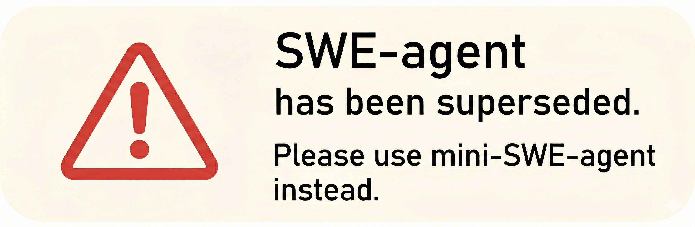
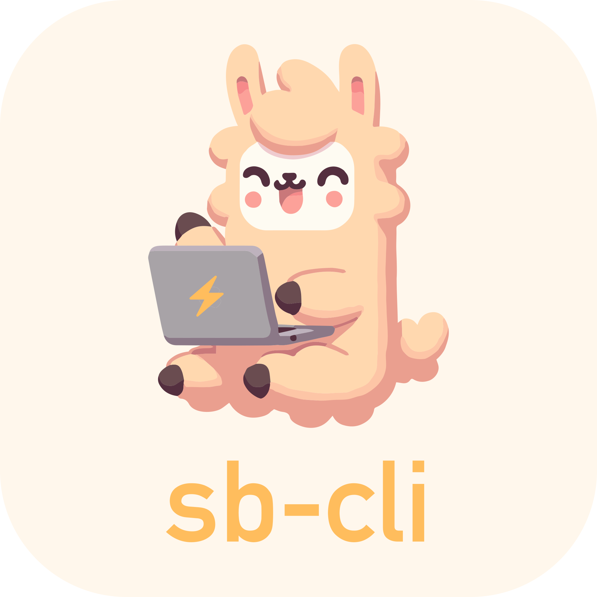

<p align="center">
  <a href="https://swe-agent.com/latest/">
    
  </a>
</p>

<p align="center">
<a href="https://swe-agent.com/latest/"></a>
<a href="https://join.slack.com/t/swe-bench/shared_invite/zt-36pj9bu5s-o3_yXPZbaH2wVnxnss1EkQ"></a>
<a href="https://arxiv.org/abs/2405.15793"></a>
</p>

<p align="center">
  <a href="https://github.com/SWE-agent/mini-swe-agent/">
    
  </a>
</p>

> [!warning]
> 我们目前的大部分开发工作集中在 [mini-swe-agent](https://github.com/SWE-agent/mini-swe-agent/)，
> 它已取代了 SWE-agent。其性能与 SWE-agent 相当，同时要简单得多。
> 有关差异的更多详情，请参阅 [FAQ](https://mini-swe-agent.com/latest/faq/)。
> 我们的一般建议是今后使用 mini-SWE-agent 而非 SWE-agent。

SWE-agent 能让你选择的语言模型（如 GPT-4o 或 Claude Sonnet 4）自主使用工具来
[修复真实 GitHub 仓库中的问题](https://swe-agent.com/latest/usage/hello_world)、
[发现网络安全漏洞](https://enigma-agent.com/)，或
[执行任意自定义任务](https://swe-agent.com/latest/usage/coding_challenges)。

* ✅ 在 SWE-bench 的开源项目中达到 **SOTA 水平**
* ✅ **自由灵活且可泛化**：将最大自主权交给语言模型
* ✅ **可配置且文档完善**：由单个 `yaml` 文件控制
* ✅ **为研究而生**：设计简洁、易于修改

SWE-agent 由来自普林斯顿大学和斯坦福大学的研究人员构建和维护。

## 📣 新闻

* 7月24日：[Mini-SWE-Agent](https://github.com/SWE-agent/mini-SWE-agent) 用 100 行 Python 在 SWE-bench verified 上达到 65%！
* 5月2日：[SWE-agent-LM-32b](https://github.com/SWE-bench/SWE-smith) 在 SWE-bench 开放权重模型中达到 SOTA
* 2月28日：[SWE-agent 1.0 + Claude 3.7 在 SWE-Bench full 上达到 SoTA](https://x.com/KLieret/status/1895487966409298067)
* 2月25日：[SWE-agent 1.0 + Claude 3.7 在 SWE-bench verified 上达到 SoTA](https://x.com/KLieret/status/1894408819670733158)
* 2月13日：[发布 SWE-agent 1.0：在 SWE-bench light 上达到 SoTA 及大量新功能](https://x.com/KLieret/status/1890048205448220849)
* 12月7日：[SWE-agent 与 SWE-bench 团队访谈](https://www.youtube.com/watch?v=fcr8WzeEXyk)

## 🚀 快速开始！

👉 在浏览器中试用 SWE-agent：[](https://codespaces.new/SWE-agent/SWE-agent)（[更多信息](https://swe-agent.com/latest/installation/codespaces/)）

阅读我们的[文档][docs]了解更多：

* [安装](https://swe-agent.com/latest/installation/source/)
* [命令行 Hello World](https://swe-agent.com/latest/usage/hello_world/)
* [在 SWE-bench 上进行基准测试](https://swe-agent.com/latest/usage/batch_mode/)
* [常见问题](https://swe-agent.com/latest/faq/)

[docs]: assets/001-asset-60ebe362be.html

## 用于进攻性网络安全的 SWE-agent (EnIGMA) <a name="enigma"></a>

</img>

[SWE-agent: EnIGMA][enigma] 是一种用于解决进攻性网络安全（夺旗赛）挑战的模式。
EnIGMA 在多个网络安全基准测试中取得了 SOTA 结果（参见[排行榜](https://enigma-agent.com/#results)）。
在我们将 EnIGMA 更新至 1.0 期间，请使用 [SWE-agent 0.7](https://github.com/SWE-agent/SWE-agent/tree/v0.7)。

[enigma]: assets/002-asset-427b0bc83e.html
[SWE-bench]: assets/003-swe-bench-79514e5192.html
[nyu-ctf]: assets/004-2406-f68f3ea5d6.05590

此外，你可能对我们的其他项目感兴趣：

<div align="center">
  <a href="https://github.com/SWE-agent/mini-SWE-agent"></a>
   &nbsp;&nbsp;
  <a href="https://github.com/SWE-agent/SWE-ReX"></a>
   &nbsp;&nbsp;
  <a href="https://github.com/SWE-bench/SWE-bench"></a>
  &nbsp;&nbsp;
  <!-- <a href="https://github.com/SWE-agent/SWE-agent"></a> -->
  <a href="https://github.com/SWE-bench/SWE-smith"></a>
  &nbsp;&nbsp;
  <a href="https://github.com/SWE-bench/sb-cli"></a>
</div>

## 贡献 <a name="contributions"></a>

如果你希望为代码库做出贡献，我们欢迎提交 [issue](https://github.com/SWE-agent/SWE-agent/issues) 和 [pull request](https://github.com/SWE-agent/SWE-agent/pulls)！对于较大的代码变更，我们始终建议先在 issue 中进行讨论。

## 引用与联系 <a name="citation"></a>

SWE-agent 是由 John Yang*、Carlos E. Jimenez*、Alexander Wettig、Kilian Lieret、Shunyu Yao、Karthik Narasimhan 和 Ofir Press 在普林斯顿大学发起的学术项目。
联系人：[John Yang](https://john-b-yang.github.io/)、[Carlos E. Jimenez](http://www.carlosejimenez.com/) 和 [Kilian Lieret](https://www.lieret.net/)（邮箱：johnby@stanford.edu、carlosej@cs.princeton.edu、kl5675@princeton.edu）。

如果你觉得这项工作对你有帮助，请考虑使用以下格式引用：

<details>
<summary>SWE-agent 引用</summary>

```bibtex
@inproceedings{yang2024sweagent,
  title={{SWE}-agent: Agent-Computer Interfaces Enable Automated Software Engineering},
  author={John Yang and Carlos E Jimenez and Alexander Wettig and Kilian Lieret and Shunyu Yao and Karthik R Narasimhan and Ofir Press},
  booktitle={The Thirty-eighth Annual Conference on Neural Information Processing Systems},
  year={2024},
  url={https://arxiv.org/abs/2405.15793}
}
```
</details>

如果你使用了 SWE-agent 中的摘要器、交互式命令或进攻性网络安全功能，也请考虑引用：

<details>
<summary>EnIGMA 引用</summary>

```bibtex
@misc{abramovich2024enigmaenhancedinteractivegenerative,
      title={EnIGMA: Enhanced Interactive Generative Model Agent for CTF Challenges},
      author={Talor Abramovich and Meet Udeshi and Minghao Shao and Kilian Lieret and Haoran Xi and Kimberly Milner and Sofija Jancheska and John Yang and Carlos E. Jimenez and Farshad Khorrami and Prashanth Krishnamurthy and Brendan Dolan-Gavitt and Muhammad Shafique and Karthik Narasimhan and Ramesh Karri and Ofir Press},
      year={2024},
      eprint={2409.16165},
      archivePrefix={arXiv},
      primaryClass={cs.AI},
      url={https://arxiv.org/abs/2409.16165},
}
```
</details>

## 🪪 许可证 <a name="license"></a>
MIT。请查看 `LICENSE`。

<div align="center">

[](https://github.com/SWE-agent/SWE-agent/actions/workflows/pytest.yaml)
[](https://github.com/SWE-agent/SWE-agent/actions/workflows/build-docs.yaml)
[](https://codecov.io/gh/SWE-agent/SWE-agent)
[](https://results.pre-commit.ci/latest/github/SWE-agent/SWE-agent/main)
[](https://github.com/SWE-agent/SWE-agent/actions/workflows/check-links-periodic.yaml)

</div>
