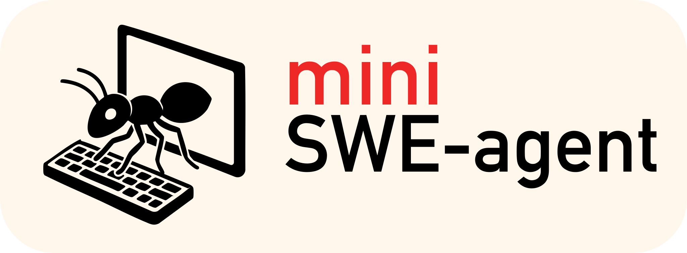
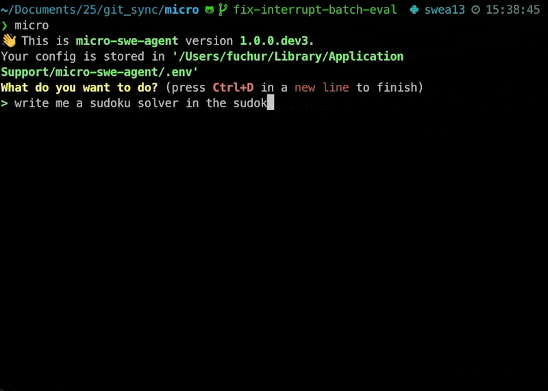
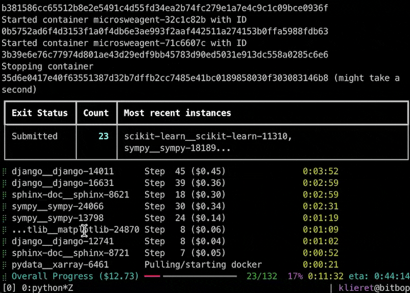
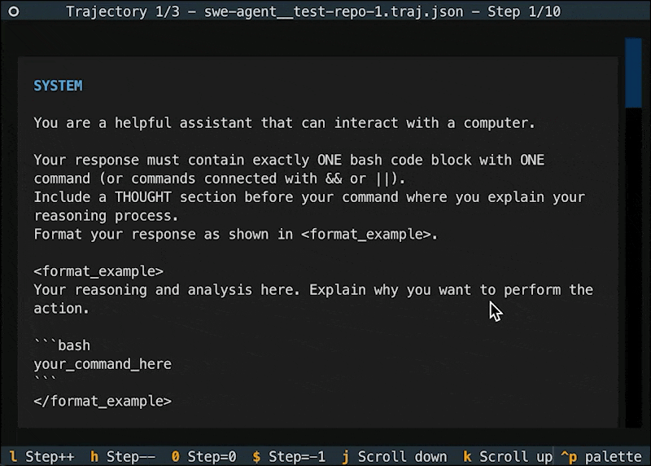
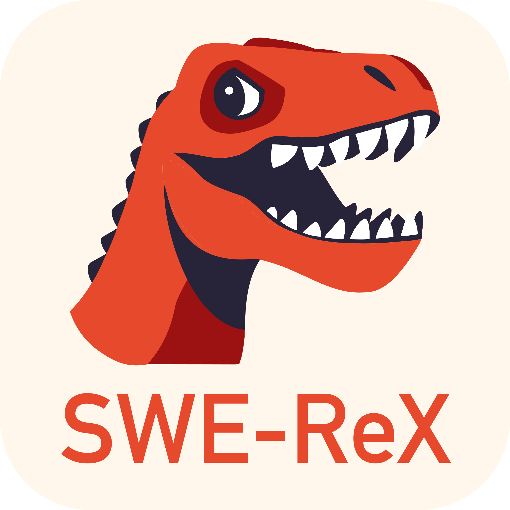
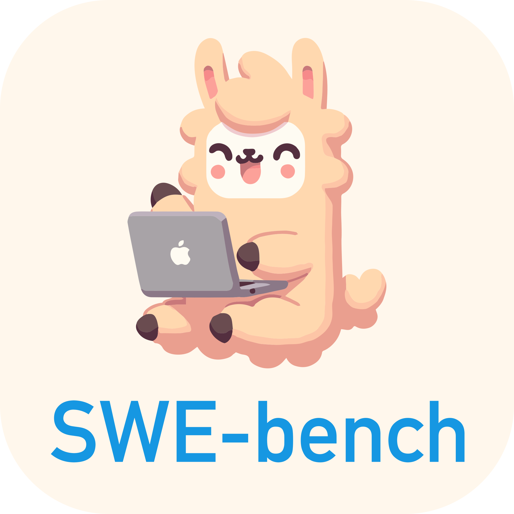

<div align="center">
<a href="https://mini-swe-agent.com/latest/"></a>
</div>

# 最小化的 AI 软件工程代理

📣 [构建最小化 AI 代理的新教程](https://minimal-agent.com/)<br/>
📣 [Gemini 3 Pro 在 SWE-bench verified 上使用 mini-swe-agent 达到 74%！](https://x.com/KLieret/status/1991164693839270372)<br/>
📣 [新博文：随机切换 GPT-5 和 Sonnet 4 提升性能](https://www.swebench.com/post-250820-mini-roulette.html)

[](https://mini-swe-agent.com/latest/)
[](https://join.slack.com/t/swe-bench/shared_invite/zt-36pj9bu5s-o3_yXPZbaH2wVnxnss1EkQ)
[](https://pypi.org/project/mini-swe-agent/)

> [!WARNING]
> 这是 **mini-swe-agent v2**。请阅读[迁移指南](https://mini-swe-agent.com/latest/advanced/v2_migration/)。对于之前的版本，请查看 [v1 分支](https://github.com/SWE-agent/mini-swe-agent/tree/v1)。

2024 年，我们构建了 [SWE-bench](https://github.com/swe-bench/SWE-bench) 和 [SWE-agent](https://github.com/swe-agent/swe-agent)，帮助开启了编程代理革命。

现在我们提出问题：**如果我们的代理简单 100 倍，效果是否仍然差不多？**

`mini` 是

- **广泛采用**：被 Meta、NVIDIA、Essential AI、IBM、Nebius、Anyscale、Princeton University、Stanford University 等许多机构使用。
- **最小化**：[代理类](https://github.com/SWE-agent/mini-swe-agent/blob/main/src/minisweagent/agents/default.py)仅约 100 行 Python 代码（再加上少量[环境](https://github.com/SWE-agent/mini-swe-agent/blob/main/src/minisweagent/environments/local.py)、[模型](https://github.com/SWE-agent/mini-swe-agent/blob/main/src/minisweagent/models/litellm_model.py)和[运行脚本](https://github.com/SWE-agent/mini-swe-agent/blob/main/src/minisweagent/run/hello_world.py)的代码）— 没有花哨的依赖！
- **高性能：** 在 [SWE-bench verified 基准测试](https://www.swebench.com/)上得分 >74%；启动速度远快于 Claude Code
- **可部署：** 支持**本地环境**、**docker/podman**、**singularity/apptainer**、**bublewrap**、**contree** 等
- **兼容：** 通过 **litellm**、**openrouter**、**portkey** 等支持所有模型。支持 `/completion` 和 `/response` 端点、交错式思维等。
- 由 [SWE-bench](https://swebench.com)、[SWE-agent](https://swe-agent.com) 等的 Princeton 和 Stanford 团队构建
- **经过测试：** [](https://codecov.io/gh/swe-agent/mini-swe-agent)

<details>

<summary>更多动机（面向研究）</summary>

[SWE-agent](https://swe-agent.com/latest/) 在 2024 年开启了 AI 代理的发展。当时我们在工具和代理的专用接口上投入了大量精力。
然而，一年后，随着 LM 变得更加强大，这些对于构建有用的代理来说根本不需要！
事实上，`mini` 代理

- **除了 bash 没有任何其他工具** — 它甚至不需要使用 LM 的工具调用接口。
  这意味着你可以用任何模型运行它。在沙箱环境中运行时，你也不需要安装任何包 — 它只需要 bash。
- **拥有完全线性的历史** — 代理的每一步只是追加到消息中，仅此而已。
  所以轨迹和传递给 LM 的消息之间没有区别。
  非常适合调试和微调。
- **使用 `subprocess.run` 执行操作** — 每个操作完全独立（与保持有状态的 shell 会话运行不同）。
  这使得在沙箱中执行操作变得简单（只需将 `subprocess.run` 替换为 `docker exec`）并且可以轻松扩展。说真的，这[是件大事](https://mini-swe-agent.com/latest/faq/#why-no-shell-session)，相信我。

这使它成为理想的基线系统，也是一个将语言模型（而非代理脚手架）置于注意力中心的系统。
你可以在 [SWE-bench（仅 bash）](https://www.swebench.com/) 排行榜上看到结果，该排行榜评估不同 LM 使用 `mini` 的性能。

</details>

<details>
<summary>更多动机（作为工具）</summary>

有些代理是过拟合的研究产物。另一些是 UI 密集的前端怪物。

`mini` 代理想成为一个易于改造的工具，而不是黑箱。

- **足够简单**，一目了然
- **足够方便**，用于日常工作流
- **足够灵活**，可以扩展

与其他代理（包括我们自己的 [swe-agent](https://swe-agent.com/latest/)）不同，它从根本上更简单，因为它：

- **除了 bash 没有任何其他工具** — 它甚至不需要使用 LM 的工具调用接口。
  与其为代理可能想做的每件特定事情实现自定义工具，重点完全放在 LM 充分利用 shell 的潜力上。
  想让它做特定的事情比如打开 PR？
  直接告诉 LM 去解决，而不是花时间在代理中实现它。
- **使用 `subprocess.run` 执行操作** — 每个操作完全独立（与保持有状态的 shell 会话运行不同）。
  这对代理的稳定性来说[是件大事](https://mini-swe-agent.com/latest/faq/#why-no-shell-session)，相信我。
- **拥有完全线性的历史** — 代理的每一步只是追加到下一步传递给 LM 的消息中，仅此而已。
  这对于调试和理解 LM 被提示的内容非常有帮助。

</details>

<details>
<summary>我应该使用 SWE-agent 还是 mini-SWE-agent？</summary>

你应该将 `mini-swe-agent` 视为默认选择。
特别是，你应该在以下情况下使用 `mini-swe-agent`：

- 你想要一个在本地运行的快速命令行工具
- 你想要一个控制流非常简单的代理
- 你想要更快、更简单、更稳定的沙箱和基准测试评估
- 你在做 FT 或 RL，不想过拟合到特定的代理脚手架

你应该在以下情况下使用 `swe-agent`：

- 你想用不同的工具集进行实验，每个工具都有自己的接口
- 你想实验不同的历史处理器

两者共同拥有

- 在 SWE-Bench 上的出色表现
- 轨迹浏览器

</details>

<table>
<tr>
<td width="50%">
<a href="https://mini-swe-agent.com/latest/usage/mini/"><strong>CLI</strong></a> (<code>mini</code>)
</td>
<td>
<a href="https://mini-swe-agent.com/latest/usage/swebench/"><strong>批量推理</strong></a>
</td>
</tr>
<tr>
<td width="50%">



</td>
<td>



</td>
</tr>
<tr>
<td>
<a href="https://mini-swe-agent.com/latest/usage/inspector/"><strong>轨迹浏览器</strong></a>
</td>
<td>
<a href="https://mini-swe-agent.com/latest/advanced/cookbook/"><strong>Python 绑定</strong></a>
</td>
</tr>
<tr>
<td>



</td>
<td>

```python
agent = DefaultAgent(
    LitellmModel(model_name=...),
    LocalEnvironment(),
)
agent.run("Write a sudoku game")
```

</td>
</tr>
</table>

## 开始吧！

**选项 1：** 如果你只想尝试 CLI（安装在临时虚拟环境中）

```bash
pip install uv && uvx mini-swe-agent
# 或
pip install pipx && pipx ensurepath && pipx run mini-swe-agent
```

**选项 2：** 在当前环境中安装 CLI 和 Python 绑定

```bash
pip install mini-swe-agent
mini  # 运行 CLI
```

**选项 3：** 从源码安装（开发者设置）

```bash
git clone https://github.com/SWE-agent/mini-swe-agent.git
cd mini-swe-agent && pip install -e .
mini  # 运行 CLI
```

在我们的[文档](https://mini-swe-agent.com/latest/)中阅读更多：

* [快速入门指南](https://mini-swe-agent.com/latest/quickstart/)
* [使用 `mini` CLI](https://mini-swe-agent.com/latest/usage/mini/)
* [全局配置](https://mini-swe-agent.com/latest/advanced/global_configuration/)
* [Yaml 配置文件](https://mini-swe-agent.com/latest/advanced/yaml_configuration/)
* [通过 cookbook 进一步增强](https://mini-swe-agent.com/latest/advanced/cookbook/)
* [FAQ](https://mini-swe-agent.com/latest/faq/)
* [贡献！](https://mini-swe-agent.com/latest/contributing/)

## 引用

如果你觉得这项工作有帮助，请在你的工作中考虑引用 [SWE-agent 论文](https://arxiv.org/abs/2405.15793)：

```bibtex
@inproceedings{yang2024sweagent,
  title={{SWE}-agent: Agent-Computer Interfaces Enable Automated Software Engineering},
  author={John Yang and Carlos E Jimenez and Alexander Wettig and Kilian Lieret and Shunyu Yao and Karthik R Narasimhan and Ofir Press},
  booktitle={The Thirty-eighth Annual Conference on Neural Information Processing Systems},
  year={2024},
  url={https://arxiv.org/abs/2405.15793}
}
```

我们的其他项目：

<div align="center">
  <a href="https://github.com/SWE-agent/SWE-agent"></a>
   &nbsp;&nbsp;
  <a href="https://github.com/SWE-agent/SWE-ReX"></a>
   &nbsp;&nbsp;
  <a href="https://github.com/SWE-bench/SWE-bench"></a>
  &nbsp;&nbsp;
  <a href="https://github.com/SWE-bench/SWE-smith"></a>
  &nbsp;&nbsp;
  <a href="https://github.com/codeclash-ai/codeclash"></a>
  &nbsp;&nbsp;
  <a href="https://github.com/SWE-bench/sb-cli"></a>
</div>
