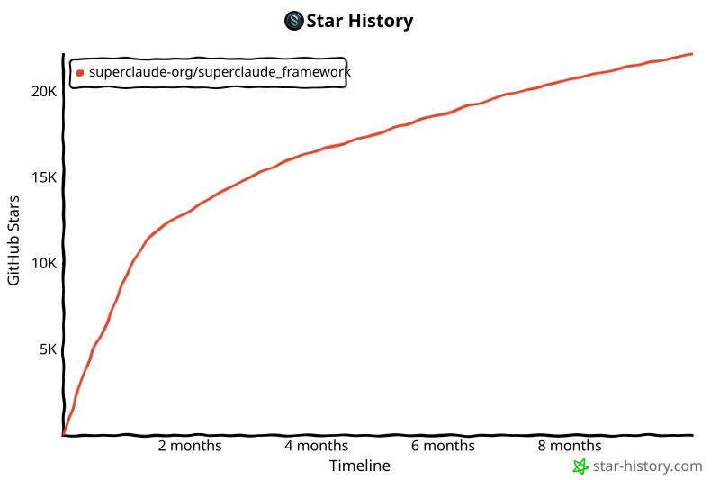

<div align="center">

<a id="-superclaude-framework"></a>

# 🚀 SuperClaude Framework

[](https://smithery.ai/skills?ns=SuperClaude-Org&utm_source=github&utm_medium=badge)

### **将 Claude Code 转变为结构化开发平台**

<p align="center">
  <a href="https://github.com/hesreallyhim/awesome-claude-code/">
  
  </a>
<a href="https://github.com/SuperClaude-Org/SuperGemini_Framework" target="_blank">
  
</a>
<a href="https://github.com/SuperClaude-Org/SuperQwen_Framework" target="_blank">
  
</a>
  
  <a href="https://github.com/SuperClaude-Org/SuperClaude_Framework/actions/workflows/test.yml">
    
  </a>
  
  
</p>

<p align="center">
  <a href="https://superclaude.netlify.app/">
    
  </a>
  <a href="https://pypi.org/project/superclaude/">
    
  </a>
  <a href="https://pepy.tech/projects/superclaude">
    
  </a>
  <a href="https://www.npmjs.com/package/@bifrost_inc/superclaude">
    
  </a>
</p>

<p align="center">
  <a href="README.md">
    
  </a>
  <a href="README.zh-CN.md">
    
  </a>
  <a href="README-ja.md">
    
  </a>
</p>

<p align="center">
  <a href="#-quick-installation">快速开始</a> •
  <a href="#-support-the-project">支持项目</a> •
  <a href="#-whats-new-in-v4">功能特性</a> •
  <a href="#-documentation">文档</a> •
  <a href="#-contributing">参与贡献</a>
</p>

</div>

---

<div align="center">

## 📊 **框架统计**

| **命令** | **代理** | **模式** | **MCP 服务器** |
|:--------:|:--------:|:--------:|:--------------:|
| **30** | **20** | **7** | **8** |
| Slash 命令 | 专业化 AI | 行为模式 | 集成能力 |

30 个 slash 命令覆盖了从头脑风暴到部署的完整开发生命周期。

</div>

---

<div align="center">

## 🎯 **概览**

SuperClaude 是一个**元编程配置框架**，通过行为指令注入和组件编排，将 Claude Code 转变为结构化开发平台。它提供系统化的工作流自动化，以及强大的工具和智能代理。

## 声明

本项目与 Anthropic 没有任何关联，也未获得其认可。
Claude Code 是由 [Anthropic](https://www.anthropic.com/) 构建并维护的产品。

## 📖 **面向开发者与贡献者**

**使用 SuperClaude Framework 时必读的核心文档：**

| 文档 | 用途 | 何时阅读 |
|------|------|----------|
| **[PLANNING.md](PLANNING.md)** | 架构、设计原则、绝对规则 | 会话开始时、实现前 |
| **[TASK.md](TASK.md)** | 当前任务、优先级、待办列表 | 每天、开始工作前 |
| **[KNOWLEDGE.md](KNOWLEDGE.md)** | 累积洞见、最佳实践、故障排查 | 遇到问题时、学习模式时 |
| **[CONTRIBUTING.md](CONTRIBUTING.md)** | 贡献指南、工作流 | 提交 PR 前 |
| **[Commands Reference](docs/user-guide/commands.md)** | 全部 30 个 `/sc:*` 命令的完整参考，包含语法、示例、工作流和决策指南 | 学习 SuperClaude、选择合适命令时 |

> **💡 专业提示**：Claude Code 会在会话开始时读取这些文件，以确保开发过程与项目标准保持一致，并维持稳定的高质量输出。
>
> **📚 刚接触 SuperClaude？** 从 [Commands Reference](docs/user-guide/commands.md) 开始，它包含可视化决策树、详细的命令对比和工作流示例，帮助你理解该在什么场景下使用哪些命令。

<a id="-quick-installation"></a>

## ⚡ **快速安装**

> **重要**：旧版文档中描述的 TypeScript 插件系统
> 目前尚不可用（计划在 v5.0 推出）。当前版本的安装
> 请按照下面的 v4.x 步骤进行。

### **当前稳定版本（v4.3.0）**

SuperClaude 当前使用 slash 命令。

**选项 1：pipx（推荐）**
```bash
# Install from PyPI
pipx install superclaude

# Install commands (installs all 30 slash commands)
superclaude install

# Install MCP servers (optional, for enhanced capabilities)
superclaude mcp --list         # List available MCP servers
superclaude mcp                # Interactive installation
superclaude mcp --servers tavily --servers context7  # Install specific servers

# Verify installation
superclaude install --list
superclaude doctor
```

安装完成后，重启 Claude Code，即可使用以下 30 个命令，包括：
- `/sc:research` - 深度网页研究（由 Tavily MCP 增强）
- `/sc:brainstorm` - 结构化头脑风暴
- `/sc:implement` - 代码实现
- `/sc:test` - 测试工作流
- `/sc:pm` - 项目管理
- `/sc` - 显示全部 30 个可用命令

**选项 2：直接从 Git 安装**
```bash
# Clone the repository
git clone https://github.com/SuperClaude-Org/SuperClaude_Framework.git
cd SuperClaude_Framework

# Run the installation script
./install.sh
```

### **v5.0 即将推出（开发中）**

我们正在积极开发新的 TypeScript 插件系统（详见 issue [#419](https://github.com/SuperClaude-Org/SuperClaude_Framework/issues/419)）。发布后，安装将简化为：

```bash
# This feature is not yet available
/plugin marketplace add SuperClaude-Org/superclaude-plugin-marketplace
/plugin install superclaude
```

**状态**：开发中。尚未设定 ETA。

### **增强性能（可选 MCP）**

若想获得**2-3 倍更快**的执行速度和**30-50% 更少的 token 消耗**，可以选择安装 MCP 服务器：

```bash
# Optional MCP servers for enhanced performance (via airis-mcp-gateway):
# - Serena: Code understanding (2-3x faster)
# - Sequential: Token-efficient reasoning (30-50% fewer tokens)
# - Tavily: Web search for Deep Research
# - Context7: Official documentation lookup
# - Mindbase: Semantic search across all conversations (optional enhancement)

# Note: Error learning available via built-in ReflexionMemory (no installation required)
# Mindbase provides semantic search enhancement (requires "recommended" profile)
# Install MCP servers: https://github.com/agiletec-inc/airis-mcp-gateway
# See docs/mcp/mcp-integration-policy.md for details
```

**性能对比：**
- **不使用 MCP**：功能完整，标准性能 ✅
- **使用 MCP**：速度提升 2-3 倍，token 消耗减少 30-50% ⚡

</div>

---

<div align="center">

<a id="-support-the-project"></a>

## 💖 **支持项目**

> 直说吧，维护 SuperClaude 需要投入时间和资源。
>
> *仅 Claude Max 订阅用于测试每月就要 $100，这还没算上编写文档、修复 bug 和开发功能所花的时间。*
> *如果你在日常工作中确实从 SuperClaude 获益，欢迎考虑支持这个项目。*
> *哪怕只是几美元，也能帮助覆盖基础成本，并让开发持续推进。*
>
> 无论是代码、反馈还是资金支持，每一位贡献者都很重要。感谢你成为这个社区的一部分！🙏

<table>
<tr>
<td align="center" width="33%">
  
### ☕ **Ko-fi**
[](https://ko-fi.com/superclaude)

*一次性支持*

</td>
<td align="center" width="33%">

### 🎯 **Patreon**
[](https://patreon.com/superclaude)

*按月支持*

</td>
<td align="center" width="33%">

### 💜 **GitHub**
[](https://github.com/sponsors/SuperClaude-Org)

*灵活档位*

</td>
</tr>
</table>

### **你的支持将用于：**

| 项目 | 成本/影响 |
|------|-----------|
| 🔬 **Claude Max 测试** | $100/月，用于验证与测试 |
| ⚡ **功能开发** | 新能力与持续改进 |
| 📚 **文档编写** | 完整指南与示例 |
| 🤝 **社区支持** | 更快地响应 issue 与提供帮助 |
| 🔧 **MCP 集成** | 测试新的服务器连接 |
| 🌐 **基础设施** | 托管与部署成本 |

> **说明：** 当然没有任何压力，无论如何框架都会保持开源。只要知道有人在使用并认可它，就已经很有激励作用了。贡献代码、完善文档，或者帮忙传播项目，也同样重要！🙏

</div>

---

<div align="center">

<a id="-whats-new-in-v4"></a>

## 🎉 **v4.1 新增内容**

> *4.1 版本重点在于稳定 slash command 架构、增强代理能力，以及改进文档。*

<table>
<tr>
<td width="50%">

### 🤖 **更智能的代理系统**
**20 个专业代理**，具备领域专长：
- PM Agent 通过系统化文档确保持续学习
- Deep Research agent 用于自主网页研究
- Security engineer 能发现真实漏洞
- Frontend architect 理解 UI 模式
- 基于上下文的自动协调
- 按需提供领域专长

</td>
<td width="50%">

### ⚡ **性能优化**
**更小的框架，更大的项目空间：**
- 降低框架占用
- 为你的代码留出更多上下文
- 支持更长的对话
- 能执行更复杂的操作

</td>
</tr>
<tr>
<td width="50%">

### 🔧 **MCP 服务器集成**
**8 个强大服务器**，支持便捷 CLI 安装：

```bash
# List available MCP servers
superclaude mcp --list

# Install specific servers
superclaude mcp --servers tavily context7

# Interactive installation
superclaude mcp
```

**可用服务器：**
- **Tavily** → 主网页搜索（Deep Research）
- **Context7** → 官方文档查询
- **Sequential-Thinking** → 多步推理
- **Serena** → 会话持久化与记忆
- **Playwright** → 跨浏览器自动化
- **Magic** → UI 组件生成
- **Morphllm-Fast-Apply** → 上下文感知的代码修改
- **Chrome DevTools** → 性能分析

</td>
<td width="50%">

### 🎯 **行为模式**
**7 种自适应模式**，适用于不同场景：
- **Brainstorming** → 提出正确的问题
- **Business Panel** → 多专家战略分析
- **Deep Research** → 自主网页研究
- **Orchestration** → 高效工具协调
- **Token-Efficiency** → 节省 30-50% 上下文
- **Task Management** → 系统化组织
- **Introspection** → 元认知分析

</td>
</tr>
<tr>
<td width="50%">

### 📚 **文档全面升级**
**完整重写**，面向开发者：
- 真实示例与使用场景
- 记录常见陷阱
- 纳入实用工作流
- 更好的导航结构

</td>
<td width="50%">

### 🧪 **稳定性增强**
**聚焦可靠性：**
- 修复核心命令中的 bug
- 改进测试覆盖率
- 更稳健的错误处理
- 优化 CI/CD 流水线

</td>
</tr>
</table>

</div>

---

<div align="center">

## 🔬 **Deep Research 能力**

### **与 DR Agent 架构对齐的自主网页研究**

SuperClaude v4.2 引入了完整的 Deep Research 能力，实现自主、自适应且智能的网页研究。

<table>
<tr>
<td width="50%">

### 🎯 **自适应规划**
**三种智能策略：**
- **Planning-Only**：针对明确查询直接执行
- **Intent-Planning**：针对模糊请求先做澄清
- **Unified**：协作式计划优化（默认）

</td>
<td width="50%">

### 🔄 **多跳推理**
**最多 5 轮迭代搜索：**
- 实体扩展（论文 → 作者 → 作品）
- 概念深化（主题 → 细节 → 示例）
- 时间演进（当前 → 历史）
- 因果链（结果 → 原因 → 预防）

</td>
</tr>
<tr>
<td width="50%">

### 📊 **质量评分**
**基于置信度的验证：**
- 来源可信度评估（0.0-1.0）
- 覆盖完整度跟踪
- 综合一致性评估
- 最低阈值：0.6，目标：0.8

</td>
<td width="50%">

### 🧠 **基于案例的学习**
**跨会话智能：**
- 模式识别与复用
- 策略随时间持续优化
- 保存成功的查询表达方式
- 跟踪性能提升

</td>
</tr>
</table>

### **研究命令用法**

```bash
# Basic research with automatic depth
/research "latest AI developments 2024"

# Controlled research depth (via options in TypeScript)
/research "quantum computing breakthroughs"  # depth: exhaustive

# Specific strategy selection
/research "market analysis"  # strategy: planning-only

# Domain-filtered research (Tavily MCP integration)
/research "React patterns"  # domains: reactjs.org,github.com
```

### **研究深度级别**

| 深度 | 来源数 | 跳数 | 时间 | 最适合 |
|:----:|:------:|:----:|:----:|--------|
| **Quick** | 5-10 | 1 | ~2min | 快速事实、简单查询 |
| **Standard** | 10-20 | 3 | ~5min | 通用研究（默认） |
| **Deep** | 20-40 | 4 | ~8min | 全面分析 |
| **Exhaustive** | 40+ | 5 | ~10min | 学术级研究 |

### **集成式工具编排**

Deep Research 系统会智能协调多个工具：
- **Tavily MCP**：主网页搜索与发现
- **Playwright MCP**：复杂内容提取
- **Sequential MCP**：多步推理与综合
- **Serena MCP**：记忆与学习持久化
- **Context7 MCP**：技术文档查询

</div>

---

<div align="center">

<a id="-documentation"></a>

## 📚 **文档**

### **SuperClaude 完整指南**

<table>
<tr>
<th align="center">🚀 入门</th>
<th align="center">📖 用户指南</th>
<th align="center">🛠️ 开发者资源</th>
<th align="center">📋 参考资料</th>
</tr>
<tr>
<td valign="top">

- 📝 [**快速开始指南**](docs/getting-started/quick-start.md)  
  *快速上手并运行起来*

- 💾 [**安装指南**](docs/getting-started/installation.md)  
  *详细安装说明*

</td>
<td valign="top">

- 🎯 [**Slash 命令**](docs/reference/commands-list.md)
  *按类别整理的全部 30 个命令*

- 🤖 [**代理指南**](docs/user-guide/agents.md)  
  *20 个专业代理*

- 🎨 [**行为模式**](docs/user-guide/modes.md)  
  *7 种自适应模式*

- 🚩 [**标志指南**](docs/user-guide/flags.md)  
  *控制行为*

- 🔧 [**MCP 服务器**](docs/user-guide/mcp-servers.md)  
  *8 个服务器集成*

- 💼 [**会话管理**](docs/user-guide/session-management.md)  
  *保存并恢复状态*

</td>
<td valign="top">

- 🏗️ [**技术架构**](docs/developer-guide/technical-architecture.md)  
  *系统设计细节*

- 💻 [**代码贡献**](docs/developer-guide/contributing-code.md)  
  *开发工作流*

- 🧪 [**测试与调试**](docs/developer-guide/testing-debugging.md)  
  *质量保障*

</td>
<td valign="top">
- 📓 [**示例手册**](docs/reference/examples-cookbook.md)  
  *真实场景配方*

- 🔍 [**故障排查**](docs/reference/troubleshooting.md)  
  *常见问题与修复方法*

</td>
</tr>
</table>

</div>

---

<div align="center">

<a id="-contributing"></a>

## 🤝 **参与贡献**

### **加入 SuperClaude 社区**

欢迎各种形式的贡献！你可以这样帮助项目：

| 优先级 | 领域 | 说明 |
|:------:|------|------|
| 📝 **高** | 文档 | 完善指南、添加示例、修正拼写 |
| 🔧 **高** | MCP 集成 | 添加服务器配置、测试集成 |
| 🎯 **中** | 工作流 | 创建命令模式与配方 |
| 🧪 **中** | 测试 | 添加测试、验证功能 |
| 🌐 **低** | i18n | 将文档翻译成其他语言 |

<p align="center">
  <a href="CONTRIBUTING.md">
    
  </a>
  <a href="https://github.com/SuperClaude-Org/SuperClaude_Framework/graphs/contributors">
    
  </a>
</p>

</div>

---

<div align="center">

## ⚖️ **许可证**

本项目基于 **MIT License** 授权，详见 [LICENSE](LICENSE) 文件。

<p align="center">
  
</p>

</div>

---

<div align="center">

## ⭐ **Star History**

<a href="https://www.star-history.com/#SuperClaude-Org/SuperClaude_Framework&Timeline">
 <picture>
   <source media="(prefers-color-scheme: dark)" srcset="assets/002-svg-0bbf619f48.svg" />
   <source media="(prefers-color-scheme: light)" srcset="assets/001-svg-a2195fccb5.svg" />
   
 </picture>
</a>

</div>

---

<div align="center">

### **🚀 由 SuperClaude 社区满怀热情打造**

<p align="center">
  <sub>献给不断突破边界的开发者 ❤️</sub>
</p>

<p align="center">
  <a href="#-superclaude-framework">返回顶部 ↑</a>
</p>

</div>

---

## 📋 **全部 30 个命令**

<details>
<summary><b>点击展开完整命令列表</b></summary>

### 🧠 规划与设计 (4)
- `/brainstorm` - 结构化头脑风暴
- `/design` - 系统架构
- `/estimate` - 时间/工作量估算
- `/spec-panel` - 规格分析

### 💻 开发 (5)
- `/implement` - 代码实现
- `/build` - 构建工作流
- `/improve` - 代码改进
- `/cleanup` - 重构
- `/explain` - 代码说明

### 🧪 测试与质量 (4)
- `/test` - 测试生成
- `/analyze` - 代码分析
- `/troubleshoot` - 调试
- `/reflect` - 复盘

### 📚 文档 (2)
- `/document` - 文档生成
- `/help` - 命令帮助

### 🔧 版本控制 (1)
- `/git` - Git 操作

### 📊 项目管理 (3)
- `/pm` - 项目管理
- `/task` - 任务跟踪
- `/workflow` - 工作流自动化

### 🔍 研究与分析 (2)
- `/research` - 深度网页研究
- `/business-panel` - 商业分析

### 🎯 工具类 (9)
- `/agent` - AI 代理
- `/index-repo` - 仓库索引
- `/index` - 索引别名
- `/recommend` - 命令推荐
- `/select-tool` - 工具选择
- `/spawn` - 并行任务
- `/load` - 加载会话
- `/save` - 保存会话
- `/sc` - 显示全部命令

[**📖 查看详细命令参考 →**](docs/reference/commands-list.md)

</details>
