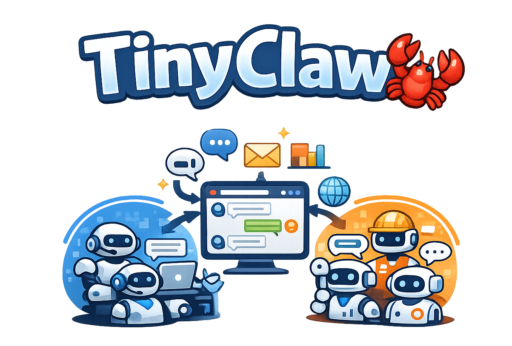
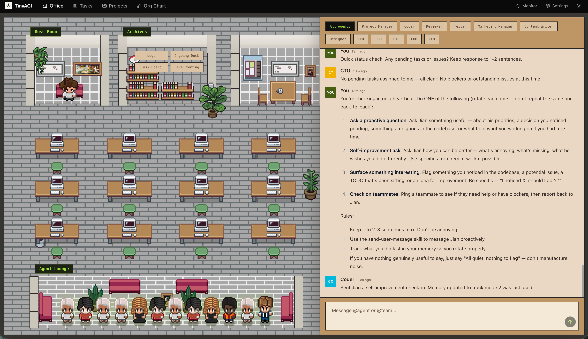

<div align="center">
  
  <h1>TinyAGI 🦞</h1>
  <p><strong>多代理、多团队、多渠道、7×24 小时 AI 助手</strong></p>
  <p>运行多个 AI 代理团队，在隔离的工作空间中同时协作。</p>
  <p>
    
    <a href="https://opensource.org/licenses/MIT">
      
    </a>
    <a href="https://discord.gg/jH6AcEChuD">
      
    </a>
    <a href="https://github.com/TinyAGI/tinyagi/releases/latest">
      
    </a>
  </p>
</div>

<div align="center">
  <video src="https://github.com/user-attachments/assets/c5ef5d3c-d9cf-4a00-b619-c31e4380df2e" width="600" controls></video>
</div>

## ✨ 特性

- ✅ **多代理** - 运行多个具有专门角色的隔离 AI 代理
- ✅ **多团队协作** - 代理通过链式执行和扇出方式将工作交接给队友
- ✅ **多渠道** - Discord、WhatsApp 和 Telegram
- ✅ **Web 门户 (TinyOffice)** - 基于浏览器的仪表板，用于聊天、代理、团队、任务、日志和设置管理
- ✅ **团队聊天室** - 每个团队拥有持久化的异步聊天室，并配有实时 CLI 查看器
- ✅ **多 AI 提供商** - Anthropic Claude、OpenAI Codex 及自定义提供商（任何 OpenAI/Anthropic 兼容端点）
- ✅ **认证令牌管理** - 按提供商存储 API 密钥，无需单独的 CLI 认证
- ✅ **并行处理** - 代理并发处理消息
- ✅ **实时 TUI 仪表板** - 实时团队可视化和聊天室查看器
- ✅ **持久会话** - 对话上下文在重启后保持
- ✅ **SQLite 队列** - 原子事务、重试逻辑、死信管理
- ✅ **插件系统** - 通过自定义插件扩展 TinyAGI，支持消息钩子和事件监听器
- ✅ **7×24 小时运行** - 作为后台进程或 Docker 容器运行

## 社区

[Discord](https://discord.com/invite/jH6AcEChuD)

我们正在积极寻找贡献者，欢迎联系。

## 🚀 快速开始

### 前提条件

- macOS、Linux 和 Windows (WSL2)
- Node.js v18+
- [Claude Code CLI](https://claude.com/claude-code)（用于 Anthropic 提供商）
- [Codex CLI](https://docs.openai.com/codex)（用于 OpenAI 提供商）

### 安装与首次运行

```bash
curl -fsSL https://raw.githubusercontent.com/TinyAGI/tinyagi/main/scripts/install.sh | bash
```

这会下载并全局安装 `tinyagi` 命令。然后只需运行：

```bash
tinyagi
```

就这样。TinyAGI 会自动创建默认设置、启动守护进程并在浏览器中打开 TinyOffice。无需向导，无需配置。

- **默认工作空间：** `~/tinyagi-workspace`
- **默认代理：** `tinyagi`（Anthropic/Opus）
- **渠道：** 初始无 — 之后可通过 `tinyagi channel setup` 添加

<details>
<summary><b>开发模式（从源码仓库运行）</b></summary>

```bash
git clone https://github.com/TinyAGI/tinyagi.git
cd tinyagi && npm install && npm run build
npx tinyagi start
npx tinyagi agent list
```
</details>

<details>
<summary><b>其他安装方式</b></summary>

**从源码安装：**

```bash
git clone https://github.com/TinyAGI/tinyagi.git
cd tinyagi && npm install && ./scripts/install.sh
```

</details>

<details>
<summary><b>🐳 Docker</b></summary>

```bash
docker compose up -d
```

在 `.env` 文件中设置你的 API 密钥，或直接传入：

```bash
ANTHROPIC_API_KEY=sk-ant-... docker compose up -d
```

API 运行在 `http://localhost:3777`。数据持久化在 `tinyagi-data` Docker 卷中。

</details>

<details>
<summary><b>📱 渠道设置指南</b></summary>

### Discord 设置

1. 前往 [Discord 开发者门户](https://discord.com/developers/applications)
2. 创建应用 → Bot 部分 → 创建机器人
3. 复制机器人令牌
4. 启用 "Message Content Intent"
5. 使用 OAuth2 URL 生成器邀请机器人

### Telegram 设置

1. 打开 Telegram → 搜索 `@BotFather`
2. 发送 `/newbot` → 按提示操作
3. 复制机器人令牌
4. 开始与你的机器人聊天

### WhatsApp 设置

启动 TinyAGI 后，扫描二维码：

```text
━━━━━━━━━━━━━━━━━━━━━━━━━━━━━━━━━━━
     WhatsApp QR Code
━━━━━━━━━━━━━━━━━━━━━━━━━━━━━━━━━━━
[QR CODE HERE]

📱 Settings → Linked Devices → Link a Device
```

</details>

---

## 🌐 TinyOffice Web 门户

TinyAGI 包含一个 Web 门户，用于管理代理、团队、任务和聊天 — 全部通过浏览器操作。

<div align="center">
  
</div>

在本地启动 TinyAGI 后，你可以通过访问 **[office.tinyagicompany.com](https://office.tinyagicompany.com/)** 来控制它。它连接到你的本地 TinyAGI API（`localhost:3777`）— 无需账户或注册。

或者，你也可以在本地运行 TinyOffice：

```bash
tinyagi office  # 构建并启动在 http://localhost:3000
```

<details>
<summary><b>TinyOffice 功能与设置</b></summary>

- **仪表板** - 实时队列/系统概览和事件流
- **聊天控制台** - 向默认代理发送消息，支持 `@agent` 或 `@team`
- **代理与团队** - 创建、编辑和删除代理/团队
- **任务 (看板)** - 创建任务，拖拽跨阶段，分配给代理/团队
- **日志与事件** - 检查队列日志和流式事件
- **设置** - 通过 UI 编辑 TinyAGI 配置（`settings.json`）
- **办公视图** - 代理交互的可视化模拟
- **组织架构图** - 团队和代理的层级可视化
- **聊天室** - 每个团队的 Slack 风格持久聊天室
- **项目** - 项目级任务管理，支持筛选看板

### 本地运行

先启动 TinyAGI（API 默认：`http://localhost:3777`），然后：

```bash
tinyagi office
```

这会自动检测是否需要安装依赖或构建（例如 `tinyagi update` 之后），并在 `http://localhost:3000` 启动生产服务器。

带热重载的开发模式：

```bash
cd tinyoffice
npm install
npm run dev
```

如果 TinyAGI API 在不同的主机/端口上，设置：

```bash
cd tinyoffice
echo 'NEXT_PUBLIC_API_URL=http://localhost:3777' > .env.local
```

</details>

## 📋 命令

命令通过 `tinyagi` CLI 使用。

### 核心命令

| 命令       | 说明                                               | 示例               |
| ------------- | --------------------------------------------------------- | --------------------- |
| *(无命令)* | 安装、配置默认值、启动并打开 TinyOffice  | `tinyagi`            |
| `start`       | 启动 TinyAGI 守护进程                                     | `tinyagi start`      |
| `stop`        | 停止所有进程                                        | `tinyagi stop`       |
| `restart`     | 重启 TinyAGI                                          | `tinyagi restart`    |
| `status`      | 显示当前状态和活动                          | `tinyagi status`     |
| `channel setup` | 交互式配置渠道                        | `tinyagi channel setup` |
| `logs [type]` | 查看日志 (discord/telegram/whatsapp/queue/heartbeat/all) | `tinyagi logs queue` |

### 代理命令

| 命令                               | 说明                     | 示例                                                      |
| ------------------------------------- | ------------------------------- | ------------------------------------------------------------ |
| `agent list`                          | 列出所有已配置的代理      | `tinyagi agent list`                                        |
| `agent add`                           | 添加新代理（交互式）     | `tinyagi agent add`                                         |
| `agent show <id>`                     | 显示代理配置        | `tinyagi agent show coder`                                  |
| `agent remove <id>`                   | 删除代理                 | `tinyagi agent remove coder`                                |
| `agent reset <id>`                    | 重置代理对话        | `tinyagi agent reset coder`                                 |
| `agent provider <id> [provider]`      | 显示或设置代理的 AI 提供商 | `tinyagi agent provider coder anthropic`                    |
| `agent provider <id> <p> --model <m>` | 设置代理的提供商和模型  | `tinyagi agent provider coder openai --model gpt-5.3-codex` |

### 团队命令

| 命令                     | 说明                        | 示例                                   |
| --------------------------- | ---------------------------------- | ----------------------------------------- |
| `team list`                 | 列出所有已配置的团队          | `tinyagi team list`                      |
| `team add`                  | 添加新团队（交互式）         | `tinyagi team add`                       |
| `team show <id>`            | 显示团队配置            | `tinyagi team show dev`                  |
| `team remove <id>`          | 删除团队                      | `tinyagi team remove dev`                |
| `team add-agent <t> <a>`    | 将现有代理添加到团队    | `tinyagi team add-agent dev reviewer`    |
| `team remove-agent <t> <a>` | 从团队中移除代理        | `tinyagi team remove-agent dev reviewer` |
| `team visualize [id]`       | 团队链的实时 TUI 仪表板 | `tinyagi team visualize dev`             |

### 聊天室命令

| 命令             | 说明                                   | 示例                    |
| ------------------- | --------------------------------------------- | -------------------------- |
| `chatroom <team>`   | 实时 TUI 查看器，支持输入发送        | `tinyagi chatroom dev`    |
| `office`            | 在 3000 端口启动 TinyOffice Web 门户      | `tinyagi office`          |

每个团队都有一个持久聊天室。代理使用 `[#team_id: message]` 标签在其中发帖，消息会广播给所有队友。聊天室查看器实时轮询新消息 — 输入消息并按 Enter 发送，或按 `q`/Esc 退出。

**API 端点：**

```
GET  /api/chatroom/:teamId          # 获取消息 (?limit=100&since=0)
POST /api/chatroom/:teamId          # 发送消息 (body: { "message": "..." })
```

### 提供商与自定义提供商命令

| 命令                                       | 说明                                              | 示例                                          |
| --------------------------------------------- | -------------------------------------------------------- | ------------------------------------------------ |
| `provider [name]`                             | 显示或切换全局 AI 提供商                        | `tinyagi provider anthropic`                    |
| `provider <name> --model <model>`             | 切换提供商和模型；同步到匹配的代理 | `tinyagi provider openai --model gpt-5.3-codex` |
| `provider <name> --oauth-token <token>`        | 为内置提供商存储 OAuth 令牌                | `tinyagi provider anthropic --oauth-token sk-ant-oat01-...` |
| `provider list`                               | 列出所有自定义提供商                                | `tinyagi provider list`                         |
| `provider add`                                | 添加新的自定义提供商（交互式）                  | `tinyagi provider add`                          |
| `provider remove <id>`                        | 删除自定义提供商                                 | `tinyagi provider remove proxy`                 |
| `model [name]`                                | 显示或切换 AI 模型                                  | `tinyagi model opus`                            |

<details>
<summary><b>自定义提供商详情</b></summary>

自定义提供商允许你使用任何 OpenAI 或 Anthropic 兼容的 API 端点（例如 OpenRouter、代理服务器、自托管模型）。

**在 `settings.json` 中定义自定义提供商：**

```json
{
  "custom_providers": {
    "my-proxy": {
      "name": "My Proxy",
      "harness": "claude",
      "base_url": "https://proxy.example.com/v1",
      "api_key": "sk-...",
      "model": "claude-sonnet-4-6"
    }
  }
}
```

| 字段      | 必填 | 说明                          |
| ---------- | -------- | ------------------------------------ |
| `name`     | 是      | 人类可读的显示名称          |
| `harness`  | 是      | 要使用的 CLI：`claude` 或 `codex`      |
| `base_url` | 是      | API 端点 URL                     |
| `api_key`  | 是      | 用于认证的 API 密钥           |
| `model`    | 否       | CLI 的默认模型名称           |

**将自定义提供商分配给代理：**

```bash
tinyagi agent provider coder custom:my-proxy
tinyagi agent provider coder custom:my-proxy --model gpt-4o
```

**认证令牌存储** — 为内置提供商存储凭据，无需单独的 CLI 认证：

```bash
tinyagi provider anthropic --oauth-token sk-ant-oat01-...
tinyagi provider anthropic --api-key sk-ant-...
tinyagi provider openai --api-key sk-...
```

Anthropic 同时支持 `oauth_token`（导出为 `CLAUDE_CODE_OAUTH_TOKEN`）和 `api_key`（导出为 `ANTHROPIC_API_KEY`）。如果两者都设置了，OAuth 优先。OpenAI 密钥保存为 `models.openai.api_key` 并导出为 `OPENAI_API_KEY`。如果未配置任何内容，进程将直接继承环境变量。

**API 端点：**

```
GET    /api/custom-providers              # 列出自定义提供商
PUT    /api/custom-providers/:id          # 创建或更新
DELETE /api/custom-providers/:id          # 删除
```

详见 [docs/AGENTS.md](docs/AGENTS.md#custom-providers)。

</details>

<details>
<summary><b>配对命令</b></summary>

使用发送者配对来控制谁可以向你的代理发送消息。

| 命令                                | 说明                                        | 示例                                    |
| -------------------------------------- | -------------------------------------------------- | ------------------------------------------ |
| `pairing pending`                      | 显示待审批的发送者（含配对码） | `tinyagi pairing pending`                 |
| `pairing approved`                     | 显示已批准的发送者                              | `tinyagi pairing approved`                |
| `pairing list`                         | 显示待审批和已批准的发送者             | `tinyagi pairing list`                    |
| `pairing approve <code>`               | 通过配对码将发送者从待审批移至已批准     | `tinyagi pairing approve ABCD1234`        |
| `pairing unpair <channel> <sender_id>` | 从白名单中移除已批准的发送者       | `tinyagi pairing unpair telegram 1234567` |

配对行为：

- 来自未知发送者的第一条消息：TinyAGI 生成一个配对码并发送审批说明。
- 待审批期间的后续消息：TinyAGI 静默拦截（不重复发送配对消息）。
- 审批后：该发送者的消息正常处理。

</details>

<details>
<summary><b>消息与聊天内命令</b></summary>

| 命令          | 说明                 | 示例                          |
| ---------------- | --------------------------- | -------------------------------- |
| `send <message>` | 手动发送消息给 AI | `tinyagi send "Hello!"`         |
| `send <message>` | 路由到指定代理     | `tinyagi send "@coder fix bug"` |

以下命令在 Discord、Telegram 和 WhatsApp 中可用：

| 命令             | 说明                          | 示例                 |
| ------------------- | ------------------------------------ | ----------------------- |
| `@agent_id message` | 将消息路由到指定代理      | `@coder fix the bug`    |
| `@team_id message`  | 将消息路由到团队领导         | `@dev fix the auth bug` |
| `/agent`            | 列出所有可用代理            | `/agent`                |
| `/team`             | 列出所有可用团队             | `/team`                 |
| `@agent_id /reset`  | 重置指定代理对话    | `@coder /reset`         |
| `/reset`            | 重置对话（WhatsApp/全局） | `/reset` 或 `!reset`    |
| `/restart`          | 重启 TinyAGI 进程             | `/restart`              |
| `message`           | 发送到默认代理（无前缀）    | `help me with this`     |

**注意：** `@agent_id` 路由前缀后面需要加空格（例如 `@coder fix` 而非 `@coderfix`）。

**访问控制说明：** 在路由前，各渠道客户端会先检查发送者配对白名单。

</details>

<details>
<summary><b>更新命令</b></summary>

| 命令  | 说明                       | 示例           |
| -------- | --------------------------------- | ----------------- |
| `update` | 将 TinyAGI 更新到最新版本 | `tinyagi update` |

> **注意：** 如果你使用的是 v0.0.1 或 v0.0.2，更新脚本存在问题。请改为重新安装：
>
> ```bash
> curl -fsSL https://raw.githubusercontent.com/TinyAGI/tinyagi/main/scripts/install.sh | bash
> ```
>
> 你的设置和用户数据将被保留。

**自动检测：** TinyAGI 在启动时检查更新（每小时一次）。

**禁用更新检查：**

```bash
export TINYAGI_SKIP_UPDATE_CHECK=1
```

</details>

<details>
<summary><b>配置命令</b></summary>

| 命令                  | 说明                  | 示例                          |
| ------------------------ | ---------------------------- | -------------------------------- |
| `reset`                  | 重置所有对话      | `tinyagi reset`                 |
| `channels reset <chan>`  | 重置渠道认证 | `tinyagi channels reset whatsapp` |

</details>

## 🤖 使用代理

使用 `@agent_id` 前缀将消息路由到指定代理：

```text
@coder fix the authentication bug
@writer document the API endpoints
help me with this  ← 发送到 tinyagi 代理（无需前缀）
```

<details>
<summary><b>代理配置</b></summary>

代理在 `.tinyagi/settings.json` 中配置：

```json
{
  "agents": {
    "coder": {
      "name": "Code Assistant",
      "provider": "anthropic",
      "model": "sonnet",
      "working_directory": "/Users/me/tinyagi-workspace/coder"
    },
    "writer": {
      "name": "Technical Writer",
      "provider": "custom:my-proxy",
      "model": "gpt-5.3-codex",
      "working_directory": "/Users/me/tinyagi-workspace/writer"
    }
  }
}
```

每个代理独立运行：

- **独立工作空间目录** - `~/tinyagi-workspace/{agent_id}/`
- **独立的对话历史** - 由 CLI 维护
- **自定义配置** - `.claude/`、`heartbeat.md`（根目录）、`AGENTS.md`
- **独立重置** - 可单独重置代理对话

详见 [docs/AGENTS.md](docs/AGENTS.md) 了解架构、用例和高级功能的完整说明。

</details>

## 📐 架构

<details>
<summary><b>消息流程图</b></summary>

```text
┌─────────────────────────────────────────────────────────────┐
│                     Message Channels                         │
│         (Discord, Telegram, WhatsApp, Web, API)             │
└────────────────────┬────────────────────────────────────────┘
                     │ enqueueMessage()
                     ↓
┌─────────────────────────────────────────────────────────────┐
│               ~/.tinyagi/tinyagi.db (SQLite)               │
│                                                              │
│  messages: pending → processing → completed / dead          │
│  responses: pending → acked                                  │
│                                                              │
└────────────────────┬────────────────────────────────────────┘
                     │ Queue Processor
                     ↓
┌─────────────────────────────────────────────────────────────┐
│              Parallel Processing by Agent                    │
│                                                              │
│  Agent: coder        Agent: writer       Agent: assistant   │
│  ┌──────────┐       ┌──────────┐        ┌──────────┐       │
│  │ Message 1│       │ Message 1│        │ Message 1│       │
│  │ Message 2│ ...   │ Message 2│  ...   │ Message 2│ ...   │
│  │ Message 3│       │          │        │          │       │
│  └────┬─────┘       └────┬─────┘        └────┬─────┘       │
│       │                  │                     │            │
└───────┼──────────────────┼─────────────────────┼────────────┘
        ↓                  ↓                     ↓
   claude CLI         claude CLI             claude CLI
  (workspace/coder)  (workspace/writer)  (workspace/assistant)
```

</details>

**核心特性：**

- **SQLite 队列** - 通过 WAL 模式实现原子事务，无竞态条件
- **并行代理** - 不同代理并发处理消息
- **每个代理内串行处理** - 保持每个代理内部的对话顺序
- **重试与死信** - 失败的消息最多重试 5 次，然后进入死信队列
- **隔离工作空间** - 每个代理拥有独立的目录和上下文

详见 [docs/QUEUE.md](docs/QUEUE.md) 了解队列系统的详细文档。

## ⚙️ 配置

<details>
<summary><b>设置文件参考</b></summary>

位于 `.tinyagi/settings.json`：

```json
{
  "channels": {
    "enabled": ["discord", "telegram", "whatsapp"],
    "discord": { "bot_token": "..." },
    "telegram": { "bot_token": "..." },
    "whatsapp": {}
  },
  "workspace": {
    "path": "/Users/me/tinyagi-workspace",
    "name": "tinyagi-workspace"
  },
  "agents": {
    "tinyagi": {
      "name": "TinyAGI Agent",
      "provider": "anthropic",
      "model": "opus",
      "working_directory": "/Users/me/tinyagi-workspace/tinyagi"
    }
  },
  "teams": {
    "dev": {
      "name": "Development Team",
      "agents": ["coder", "reviewer"],
      "leader_agent": "coder"
    }
  },
  "custom_providers": {
    "my-proxy": {
      "name": "My Proxy",
      "harness": "claude",
      "base_url": "https://proxy.example.com/v1",
      "api_key": "sk-...",
      "model": "claude-sonnet-4-6"
    }
  },
  "models": {
    "anthropic": { "api_key": "sk-ant-...", "oauth_token": "sk-ant-oat01-..." },
    "openai": { "api_key": "sk-..." }
  },
  "monitoring": {
    "heartbeat_interval": 3600
  }
}
```

</details>

<details>
<summary><b>心跳配置</b></summary>

编辑代理专属的心跳提示词：

```bash
nano ~/tinyagi-workspace/coder/heartbeat.md
```

默认心跳提示词：

```markdown
Check for:

1. Pending tasks
2. Errors
3. Unread messages

Take action if needed.
```

</details>

<details>
<summary><b>目录结构</b></summary>

```text
tinyagi/
├── packages/                # Monorepo packages
│   ├── core/                #   共享类型、配置、队列、代理调用
│   ├── main/                #   队列处理器入口
│   ├── teams/               #   团队对话编排
│   ├── server/              #   API 服务器 (REST + SSE)
│   ├── channels/            #   渠道客户端 (Discord, Telegram, WhatsApp)
│   ├── cli/                 #   CLI 命令
│   └── visualizer/          #   TUI 仪表板和聊天室查看器
├── tinyoffice/              # TinyOffice Web 门户 (Next.js)
├── .tinyagi/               # TinyAGI 数据（运行时创建）
│   ├── settings.json        #   配置
│   ├── tinyagi.db          #   SQLite 队列数据库
│   ├── logs/                #   所有日志
│   ├── channels/            #   渠道状态
│   ├── files/               #   上传的文件
│   ├── pairing.json         #   发送者白名单状态
│   ├── chats/               #   团队对话历史
│   │   └── {team_id}/       #     每个团队的聊天日志
│   ├── .claude/             #   代理模板
│   ├── heartbeat.md         #   代理模板
│   └── AGENTS.md            #   代理模板
├── ~/tinyagi-workspace/    # 代理工作空间
│   ├── tinyagi/            #   默认代理
│   ├── coder/
│   └── writer/
└── scripts/                 # 安装脚本
```

</details>

## 🎯 用例

<details>
<summary><b>示例</b></summary>

### 个人 AI 助手

```text
You: "Remind me to call mom"
Claude: "I'll remind you!"
[1 hour later via heartbeat]
Claude: "Don't forget to call mom!"
```

### 多代理工作流

```text
@coder Review and fix bugs in auth.ts
@writer Document the changes
@reviewer Check the documentation quality
```

### 团队协作

```text
@dev fix the auth bug
# → 路由到团队领导 (@coder)
# → Coder 修复 bug，在回复中提及 @reviewer
# → Reviewer 自动被调用，审查更改
# → 合并后的回复发送给用户
```

团队支持顺序链（单次交接）和并行扇出（多个队友提及）。详见 [docs/TEAMS.md](docs/TEAMS.md)。

### 跨设备访问

- 手机用 WhatsApp，桌面用 Discord，随时随地用 Telegram，自动化用 CLI
- 所有渠道共享代理对话！

</details>

## 📚 文档

- [AGENTS.md](docs/AGENTS.md) - 代理管理、路由和自定义提供商
- [TEAMS.md](docs/TEAMS.md) - 团队协作、链式执行、聊天室和可视化器
- [QUEUE.md](docs/QUEUE.md) - 队列系统和消息流程
- [tinyoffice/README.md](tinyoffice/README.md) - TinyOffice Web 门户
- [PLUGINS.md](docs/PLUGINS.md) - 插件开发指南
- [TROUBLESHOOTING.md](docs/TROUBLESHOOTING.md) - 常见问题与解决方案

## 🐛 故障排除

<details>
<summary><b>快速修复与常见问题</b></summary>

```bash
# 重置所有内容（保留设置）
tinyagi stop && rm -rf .tinyagi/queue/* && tinyagi start

# 重置 WhatsApp
tinyagi channels reset whatsapp

# 检查状态
tinyagi status

# 查看日志
tinyagi logs all
```

**常见问题：**

- WhatsApp 无法连接 → 重置认证：`tinyagi channels reset whatsapp`
- 消息卡住 → 清除队列：`rm -rf .tinyagi/queue/processing/*`
- 找不到代理 → 检查：`tinyagi agent list`
- settings.json 损坏 → TinyAGI 会自动修复无效 JSON（尾随逗号、注释、BOM）并创建 `.bak` 备份

</details>

**需要帮助？** [GitHub Issues](https://github.com/TinyAGI/tinyagi/issues) · `tinyagi logs all`

## 🙏 致谢

- 灵感来自 Peter Steinberger 的 [OpenClaw](https://openclaw.ai/)
- 基于 [Claude Code](https://claude.com/claude-code) 和 [Codex CLI](https://docs.openai.com/codex) 构建
- 使用 [discord.js](https://discord.js.org/)、[whatsapp-web.js](https://github.com/pedroslopez/whatsapp-web.js)、[node-telegram-bot-api](https://github.com/yagop/node-telegram-bot-api)

## 📄 许可证

MIT

---

**TinyAGI - 小巧但强大！** 🦞✨

[](https://www.star-history.com/?repos=TinyAGI%2Ftinyagi&type=date&legend=top-left)
