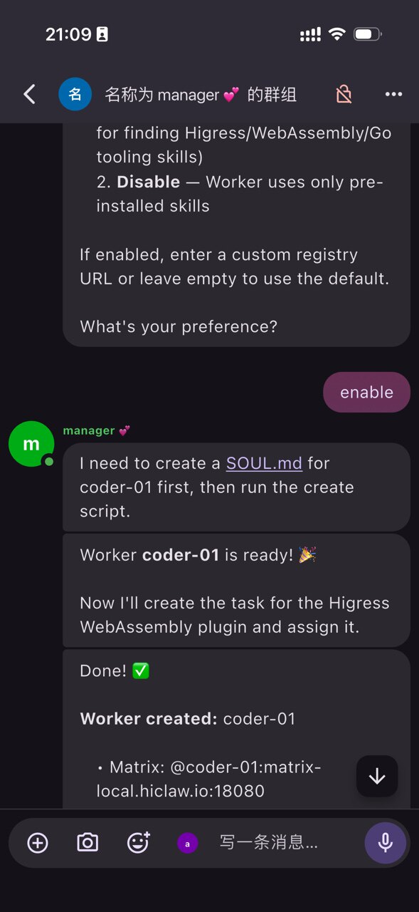
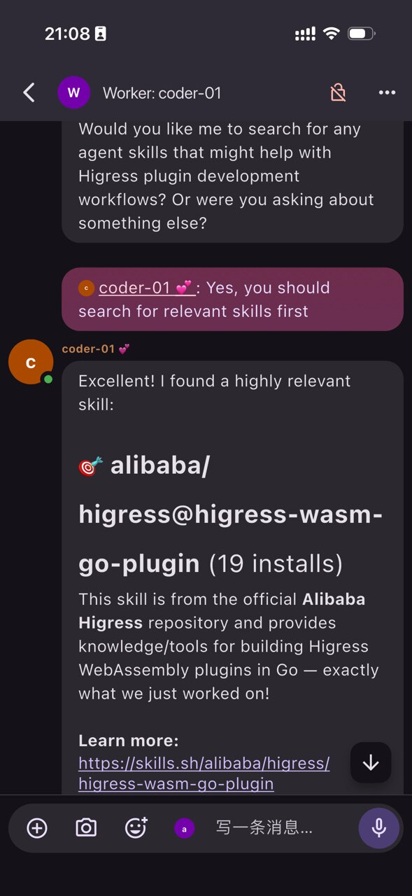

<h1 align="center">
    
  <br>
</h1>

[English](./README.md) | [中文](./README.zh-CN.md) | [日本語](./README.ja-JP.md)

<p align="center">
  <a href="https://deepwiki.com/higress-group/hiclaw"></a>
  <a href="https://discord.com/invite/NVjNA4BAVw"></a>
</p>

**HiClaw 是一个开源的协作多代理操作系统，通过 Matrix 聊天室实现透明的、人在环中的任务协调。**

采用 **Manager-Workers 架构** 构建，HiClaw 让你通过 Manager Agent 协调多个 Worker Agent 来完成复杂任务 — 所有对话在 Matrix 聊天室中可见，你可以随时介入。

把它想象成聊天室里的 AI 团队：告诉 Manager 你需要什么，它会启动 Workers，你可以实时观看一切进展。

## 核心特性

- 🧬 **Manager-Workers 架构**：通过让代理管理其他代理，免除了人工逐个监督各个 Worker Claw 的需求。

- 🦞 **可定制代理**：每个代理支持灵活的配置，包括 OpenClaw、CoPaw、NanoClaw、ZeroClaw 和企业自建代理 — 从个人"养虾"到规模化"虾场"运营。

- 📦 **MinIO 共享文件系统**：引入代理间信息交换的共享文件系统，显著减少多代理协作场景中的 token 消耗。

- 🔐 **Higress AI 网关**：集中化流量管理并缓解凭据相关风险，减轻用户对原生 Lobster 框架中安全漏洞的担忧。

- ☎️ **Element IM 客户端 + Tuwunel IM 服务器（均基于 Matrix 协议）**：消除钉钉/飞书集成开销和企业审批流程。让用户能够快速上手，在 IM 环境中体验模型服务带来的"愉悦感"，同时保持与原生 OpenClaw IM 集成的兼容性。

## 新闻

- **2026-03-14**: HiClaw 1.0.6 — 企业级 MCP Server 管理，零凭据暴露。[博客](blog/hiclaw-1.0.6-release.md)
- **2026-03-10**: HiClaw 1.0.4 — CoPaw Worker 支持，内存减少 80%。[博客](blog/hiclaw-1.0.4-release.md)
- **2026-03-04**: HiClaw 开源发布。[公告](blog/hiclaw-announcement.md)

## 为什么选择 HiClaw

- **企业级安全**：Worker Agent 仅使用 consumer token 运行。真实凭据（API 密钥、GitHub PAT）保留在网关中 — Worker 无法看到，攻击者也无法看到。

- **完全私有**：Matrix 是一个去中心化的开放协议。自行托管，按需与其他服务器联邦。无供应商锁定，无数据收割。

- **默认人在环中**：每个 Matrix 聊天室都包含你、Manager 和相关的 Workers。观看一切。随时介入。没有黑箱。

- **零配置 IM**：内置 Matrix 服务器意味着无需机器人应用、无需 API 审批、无需等待。只需打开 Element Web 即可开始聊天。

- **一条命令安装**：`curl | bash` 即可完成 — AI 网关、Matrix 服务器、文件存储、Web 客户端和 Manager Agent。

- **技能生态系统**：Workers 按需从 [skills.sh](https://skills.sh)（80,000+ 社区技能）拉取。这样做是安全的，因为 Workers 无法访问真实凭据。

## 快速开始

**前提条件**：Docker Desktop（Windows/macOS）或 Docker Engine（Linux）。

**资源要求**：至少 2 个 CPU 核心 + 4 GB 内存。多个 Worker 建议 4 核心 + 8 GB 内存。

### 安装

**macOS / Linux:**
```bash
bash <(curl -sSL https://higress.ai/hiclaw/install.sh)
```

**Windows（建议使用 PowerShell 7+）:**
```powershell
Set-ExecutionPolicy Bypass -Scope Process -Force; $wc=New-Object Net.WebClient; $wc.Encoding=[Text.Encoding]::UTF8; iex $wc.DownloadString('https://higress.ai/hiclaw/install.ps1')
```

安装程序将引导你：
1. 选择 LLM 提供商（支持 OpenAI 兼容 API）
2. 输入你的 API 密钥
3. 选择网络模式（仅本地或外部访问）
4. 等待安装完成

### 访问

在浏览器中打开 http://127.0.0.1:18088 并登录 Element Web。Manager 将向你打招呼并说明如何创建你的第一个 Worker。

**移动端**：使用任何 Matrix 客户端（Element、FluffyChat）连接到你的服务器地址。

**就是这样。** 无需机器人应用。无需外部服务。你的 AI 团队完全在你的机器上运行。

## 升级

```bash
# 升级到最新版本（保留所有数据）
bash <(curl -sSL https://higress.ai/hiclaw/install.sh)

# 升级到特定版本
HICLAW_VERSION=v1.0.5 bash <(curl -sSL https://higress.ai/hiclaw/install.sh)
```

## 工作原理

### Manager 作为你的 AI 参谋长

```
你：创建一个名为 alice 的前端开发 Worker

Manager：完成。Worker alice 已就绪。
         聊天室：Worker: Alice
         告诉 alice 要构建什么。

你：@alice 用 React 实现一个登录页面

Alice：开始了... [几分钟后]
       完成。PR 已提交：https://github.com/xxx/pull/1
```

<p align="center">
  
  &nbsp;&nbsp;&nbsp;&nbsp;
  
</p>
<p align="center">
  <sub>① Manager 创建 Worker 并分配任务</sub>
  &nbsp;&nbsp;&nbsp;&nbsp;&nbsp;&nbsp;&nbsp;&nbsp;&nbsp;&nbsp;&nbsp;&nbsp;&nbsp;&nbsp;&nbsp;&nbsp;&nbsp;&nbsp;
  <sub>② 你也可以在聊天室中直接指导 Workers</sub>
</p>

### 安全模型

```
Worker（仅持有 consumer token）
    → Higress AI Gateway（持有真实 API 密钥、GitHub PAT）
        → LLM API / GitHub API / MCP Servers
```

Workers 只能看到自己的 consumer token。网关处理所有真实凭据。Manager 知道 Workers 在做什么，但从不接触实际密钥。

### 人在环中

每个 Matrix 聊天室都包含你、Manager 和相关的 Workers：

```
你：@bob 等等，把密码规则改为最少 8 个字符
Bob：收到，已更新。
Alice：前端验证也更新了。
```

没有隐藏的代理间调用。一切可见、可介入。

## 架构

```
┌─────────────────────────────────────────────┐
│         hiclaw-manager-agent                │
│  Higress │ Tuwunel │ MinIO │ Element Web    │
│  Manager Agent (OpenClaw)                   │
└──────────────────┬──────────────────────────┘
                   │ Matrix + HTTP Files
┌──────────────────┴──────┐  ┌────────────────┐
│  hiclaw-worker-agent    │  │  hiclaw-worker │
│  Worker Alice (OpenClaw)│  │  Worker Bob    │
└─────────────────────────┘  └────────────────┘
```

| 组件 | 角色 |
|-----------|------|
| Higress AI Gateway | LLM 代理、MCP Server 托管、凭据管理 |
| Tuwunel (Matrix) | 自托管 IM 服务器，用于所有代理 + 人类通信 |
| Element Web | 浏览器客户端，零配置 |
| MinIO | 集中文件存储，Workers 无状态 |
| OpenClaw | 带 Matrix 插件和技能的代理运行时 |

## HiClaw vs OpenClaw 原生

| | OpenClaw 原生 | HiClaw |
|---|---|---|
| 部署方式 | 单进程 | 分布式容器 |
| 代理创建 | 手动配置 + 重启 | 对话式 |
| 凭据管理 | 每个代理持有真实密钥 | Workers 仅持有 consumer token |
| 人类可见性 | 可选 | 内置（Matrix 聊天室） |
| 移动端访问 | 取决于通道设置 | 任何 Matrix 客户端，零配置 |
| 监控 | 无 | Manager 心跳，在聊天室中可见 |

## 路线图

### ✅ 已发布

- ~~**CoPaw** — 轻量级代理运行时~~ [在 1.0.4 中发布](blog/hiclaw-1.0.4-release.md)：~150MB 内存使用（对比 OpenClaw 的 ~500MB），加上本地主机模式用于浏览器自动化。
- ~~**通用 MCP 服务支持** — MCP 服务器集成~~ [在 1.0.6 中发布](blog/hiclaw-1.0.6-release.md)：任何 MCP 服务器都可以安全地通过网关暴露给 Worker。Worker 仅使用 Higress 颁发的 token 访问工具；真实凭据从不离开网关。

### 进行中

#### 轻量级 Worker 运行时

- **ZeroClaw** — 基于 Rust 的超轻量运行时，3.4MB 二进制文件，<10ms 冷启动。
- **NanoClaw** — 最小化的 OpenClaw 替代品，<4000 行代码，基于容器的隔离。

目标：将每个 Worker 的内存从 ~500MB 降低到 <100MB。

### 计划中

#### 团队管理中心

一个内置仪表板，用于观察和控制你的代理团队 — 实时观察、主动中断、任务时间线、资源监控。

---

## 文档

| | |
|---|---|
| [docs/quickstart.md](docs/quickstart.md) | 分步指南 |
| [docs/architecture.md](docs/architecture.md) | 系统架构深度解析 |
| [docs/manager-guide.md](docs/manager-guide.md) | Manager 配置 |
| [docs/worker-guide.md](docs/worker-guide.md) | Worker 部署 |
| [docs/development.md](docs/development.md) | 贡献和本地开发 |

## 故障排除

```bash
docker exec -it hiclaw-manager cat /var/log/hiclaw/manager-agent.log
```

常见问题见 [docs/zh-cn/faq.md](docs/zh-cn/faq.md)。

### 报告 Bug

导出你的 Matrix 消息日志，让 AI 工具对照代码库分析后再提交 issue — 这有助于我们更快地修复 bug。

```bash
# 导出调试日志（Matrix 消息 + 代理会话，PII 自动脱敏）
python scripts/export-debug-log.py --range 1h
```

然后在 Cursor、Claude Code 或类似 AI 工具中打开 HiClaw 仓库，询问：

> "读取 debug-log/ 中的 JSONL 文件。分析 Matrix 消息日志和代理会话日志。与 HiClaw 代码库交叉引用，找出 [描述你的 bug] 的根本原因。"

在 [bug 报告](https://github.com/alibaba/hiclaw/issues/new?template=bug_report.yml)中包含 AI 的分析。

你也可以让 AI 工具直接提交 issue 或 PR。安装 [GitHub CLI](https://cli.github.com/)，运行 `gh auth login` 在浏览器中认证，然后将 [OpenClaw GitHub 技能](https://github.com/openclaw/openclaw/blob/main/skills/github/SKILL.md)添加到你的 AI 编程工具（Cursor、Claude Code 等）。之后，只需要求它根据分析提交 issue 或打开 PR。

## 构建与测试

```bash
make build          # 构建所有镜像
make test           # 构建 + 运行所有集成测试
make test-quick     # 仅冒烟测试
```

## 其他命令

```bash
make replay TASK="创建一个名为 alice 的前端开发 Worker"
make uninstall
make help
```

## 社区

- [Discord](https://discord.gg/NVjNA4BAVw)
- [GitHub Issues](https://github.com/alibaba/hiclaw/issues)

## 许可证

Apache License 2.0
