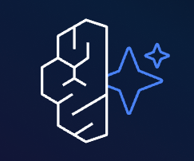
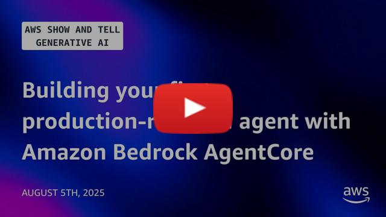

<div align="center">
  <div>
    <a href="https://aws.amazon.com/bedrock/agentcore/">
      
   </a>
  </div>

  <h1>
      Amazon Bedrock AgentCore 示例
  </h1>

  <h2>
    安全地大规模部署和运行 AI 代理 - 使用任何框架和模型
  </h2>

  <div align="center">
    <a href="https://github.com/awslabs/amazon-bedrock-agentcore-samples/graphs/commit-activity"></a>
    <a href="https://github.com/awslabs/amazon-bedrock-agentcore-samples/issues"></a>
    <a href="https://github.com/awslabs/amazon-bedrock-agentcore-samples/pulls"></a>
    <a href="https://github.com/awslabs/amazon-bedrock-agentcore-samples/blob/main/LICENSE"></a>
  </div>

  <p>
    <a href="https://docs.aws.amazon.com/bedrock-agentcore/">文档</a>
    ◆ <a href="https://github.com/aws/bedrock-agentcore-sdk-python">Python SDK</a>
    ◆ <a href="https://github.com/aws/agentcore-cli">AgentCore CLI</a>
    ◆ <a href="https://discord.gg/bedrockagentcore-preview">Discord</a>
  </p>
</div>

欢迎来到 Amazon Bedrock AgentCore 示例仓库！

Amazon Bedrock AgentCore 同时具备框架无关性和模型无关性，让你能够灵活地安全大规模部署和运行高级 AI 代理。无论你是使用 [Strands Agents](https://strandsagents.com/latest/)、[CrewAI](https://www.crewai.com/)、[LangGraph](https://www.langchain.com/langgraph)、[LlamaIndex](https://www.llamaindex.ai/) 还是其他任何框架来构建，并在任何大型语言模型（LLM）上运行，Amazon Bedrock AgentCore 都能提供相应的基础设施支持。Amazon Bedrock AgentCore 免除了构建和管理专用代理基础设施这类同质化的繁重工作，让你可以直接使用自己偏好的框架和模型，无需重写代码即可完成部署。

本合集提供了示例和教程，帮助你理解、实现 Amazon Bedrock AgentCore 的功能并将其集成到你的应用中。

> **从 Starter Toolkit 迁移？** 本仓库正在从 [Bedrock AgentCore Starter Toolkit](https://github.com/aws/bedrock-agentcore-starter-toolkit) 过渡到新的 [AgentCore CLI](https://github.com/aws/agentcore-cli)。仍依赖 Starter Toolkit 的示例在 [`legacy/`](./legacy/) 中，将在未来几周内更新。完整的新旧路径映射请参见 [`MIGRATION.md`](./MIGRATION.md)。

## 🎥 视频

使用 Amazon Bedrock AgentCore 构建你的第一个生产级 AI 代理。我们将带你超越原型阶段，展示如何使用 Amazon Bedrock AgentCore 将你的第一个代理式 AI 应用生产化。

<p align="center">
  <a href="https://www.youtube.com/watch?v=wzIQDPFQx30"></a>
</p>

## 📁 仓库结构

### 🚀 [`getting-started/`](./getting-started/)

**几分钟内构建你的第一个代理**

通过 [AgentCore CLI](https://github.com/aws/agentcore-cli) 快速上手 — 在 Amazon Bedrock AgentCore 上创建、开发和部署代理的最快方式。

- **[`python/`](./getting-started/python/)** — Python 代理示例（Code Interpreter、Gateway、Memory、Identity 等）
- **[`typescript/`](./getting-started/typescript/)** — TypeScript 代理示例

### 🧩 [`features/`](./features/)

**AgentCore 功能深入解析**

各个 AgentCore 功能的聚焦示例：

- **[Runtime](https://docs.aws.amazon.com/bedrock-agentcore/latest/devguide/agents-tools-runtime.html)** — 安全、无服务器的运行时，用于大规模部署代理和工具
- **[Gateway](https://docs.aws.amazon.com/bedrock-agentcore/latest/devguide/gateway.html)** — 将 API、Lambda 函数和服务转换为 MCP 兼容的工具
- **[Identity](https://docs.aws.amazon.com/bedrock-agentcore/latest/devguide/identity.html)** — 跨 AWS 和第三方应用的代理身份和访问管理
- **[Memory](https://docs.aws.amazon.com/bedrock-agentcore/latest/devguide/memory.html)** — 托管的内存基础设施，用于个性化代理体验
- **[Tools](https://docs.aws.amazon.com/bedrock-agentcore/latest/devguide/code-interpreter-tool.html)** — 内置的 Code Interpreter 和 Browser Tool
- **[Observability](https://docs.aws.amazon.com/bedrock-agentcore/latest/devguide/observability.html)** — 使用 OpenTelemetry 进行代理性能的追踪、调试和监控
- **[Evaluation](https://docs.aws.amazon.com/bedrock-agentcore/latest/devguide/evaluations.html)** — 内置和自定义评估器，用于按需和在线评估
- **[Policy](https://docs.aws.amazon.com/bedrock-agentcore/latest/devguide/policy.html)** — 使用 Cedar 策略进行细粒度访问控制

### 💡 [`end-to-end/`](./end-to-end/)

**完整应用**

生产就绪的用例，结合多种 AgentCore 功能来解决实际业务问题。每个都包含部署说明、架构图和测试指南。

### 🔌 [`integrations/`](./integrations/)

**将 AgentCore 连接到你的技术栈**

- **[`identity-providers/`](./integrations/identity-providers/)** — Okta、Entra、Cognito 和其他 IdP 集成
- **[`observability/`](./integrations/observability/)** — Grafana、Datadog、Dynatrace 和其他监控平台
- **[`data-platforms/`](./integrations/data-platforms/)** — 数据湖、数据仓库和分析集成
- **[`ux-examples/`](./integrations/ux-examples/)** — Streamlit、AG-UI 和其他前端模式

### 🏗️ [`infrastructure-as-code/`](./infrastructure-as-code/)

**部署自动化**

使用 CloudFormation、AWS CDK 或 Terraform 部署 AgentCore 资源的生产就绪模板。

### 🚀 [`blueprints/`](./blueprints/)

**全栈参考应用**

完整的、可直接部署的代理式应用，集成了服务、认证和业务逻辑，你可以根据自己的用例进行定制。

### 📦 [`legacy/`](./legacy/)

**Starter Toolkit 示例（待迁移）**

仍依赖 [Bedrock AgentCore Starter Toolkit](https://github.com/aws/bedrock-agentcore-starter-toolkit) CLI 的示例。这些将随着 SDK 支持的推出迁移到 AgentCore CLI。状态请参见 [`MIGRATION.md`](./MIGRATION.md)。

## 使用 AgentCore CLI 快速开始

[AgentCore CLI](https://github.com/aws/agentcore-cli) 是在 Amazon Bedrock AgentCore 上创建、开发和部署代理的推荐方式。它以简化的基于项目的工作流取代了之前的 Starter Toolkit。

### 步骤 1：前提条件

- 一个已配置凭据的 [AWS 账户](https://signin.aws.amazon.com/signin?redirect_uri=https%3A%2F%2Fportal.aws.amazon.com%2Fbilling%2Fsignup%2Fresume&client_id=signup)（`aws configure`）
- [Node.js 20.x](https://nodejs.org/) 或更高版本
- [`uv`](https://docs.astral.sh/uv/)（用于 Python 代理）或 Node.js（用于 TypeScript 代理）
- 模型访问：在 [Amazon Bedrock 控制台](https://docs.aws.amazon.com/bedrock/latest/userguide/model-access-modify.html)中启用 Anthropic Claude 4.0
- AWS 权限：
  - `BedrockAgentCoreFullAccess` 托管策略
  - `AmazonBedrockFullAccess` 托管策略

### 步骤 2：安装 CLI 并创建项目

```bash
# 安装 AgentCore CLI
npm install -g @aws/agentcore

# 创建新项目（交互式向导）
agentcore create
cd my-agent
```

`create` 向导会生成一个开箱即用的项目，你可以选择框架（Strands Agents、LangGraph、Google ADK、OpenAI 等）和语言（Python 或 TypeScript）。

### 步骤 3：本地开发

```bash
# 启动本地开发服务器
agentcore dev
```

你的代理现在在本地运行。CLI 监控文件变更并提供本地调用端点用于测试。

### 步骤 4：部署到 AWS

```bash
# 部署到 Amazon Bedrock AgentCore
agentcore deploy

# 测试你部署的代理
agentcore invoke
```

### 添加更多功能

```bash
agentcore add memory           # 添加托管内存
agentcore add identity         # 添加身份提供商
agentcore add evaluator        # 添加 LLM-as-a-Judge 评估
agentcore add online-eval      # 启用持续评估
agentcore deploy               # 同步变更到 AWS
```

恭喜！你的代理现在运行在 Amazon Bedrock AgentCore Runtime 上。

完整的 CLI 参考，请参见 [AgentCore CLI 文档](https://github.com/aws/agentcore-cli)。

## 运行 Notebook

本仓库中的一些示例以 Jupyter notebook 形式提供：

1. 创建并激活虚拟环境

```bash
python -m venv .venv
source .venv/bin/activate
```

2. 安装依赖

```bash
pip install -r requirements.txt
```

3. 导出/激活 notebook 运行所需的 AWS 凭据

4. 将虚拟环境注册为 Jupyter notebook 使用的内核

```bash
python -m ipykernel install --user --name=notebook-venv --display-name="Python (notebook-venv)"
```

你可以使用以下命令列出内核：

```bash
jupyter kernelspec list
```

5. 运行 notebook 并确保选择了正确的内核

```bash
jupyter notebook path/to/your/notebook.ipynb
```

**重要：** 在 Jupyter 中打开 notebook 后，请确保依次选择 `Kernel` → `Change kernel` → "Python (notebook-venv)"，以确保虚拟环境中的软件包可用。

## 🔗 相关链接

- [AgentCore CLI](https://github.com/aws/agentcore-cli)
- [Amazon Bedrock AgentCore 文档](https://docs.aws.amazon.com/bedrock-agentcore/)
- [Amazon Bedrock AgentCore 入门 - 研讨会](https://catalog.us-east-1.prod.workshops.aws/workshops/850fcd5c-fd1f-48d7-932c-ad9babede979/en-US)
- [深入探索 Bedrock AgentCore - 研讨会](https://catalog.workshops.aws/agentcore-deep-dive/en-US)
- [Amazon Bedrock AgentCore 定价](https://aws.amazon.com/bedrock/agentcore/pricing/)
- [Amazon Bedrock AgentCore 常见问题](https://aws.amazon.com/bedrock/agentcore/faqs/)

## 🤝 贡献

我们欢迎贡献！请参阅我们的[贡献指南](CONTRIBUTING.md)了解以下方面的详细信息：

- 添加新示例
- 改进现有示例
- 报告问题
- 提出改进建议

## 📄 许可证

本项目基于 Apache License 2.0 许可 - 详见 [LICENSE](LICENSE) 文件。

## 贡献者

<a href="https://github.com/awslabs/amazon-bedrock-agentcore-samples/graphs/contributors">
  
</a>
