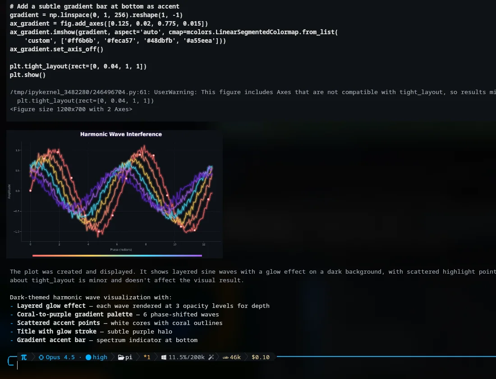
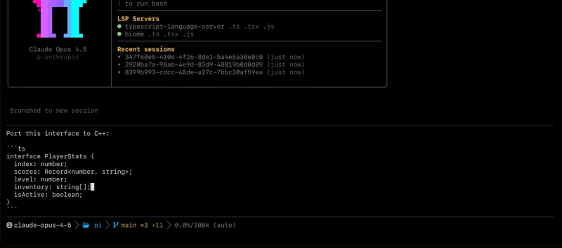
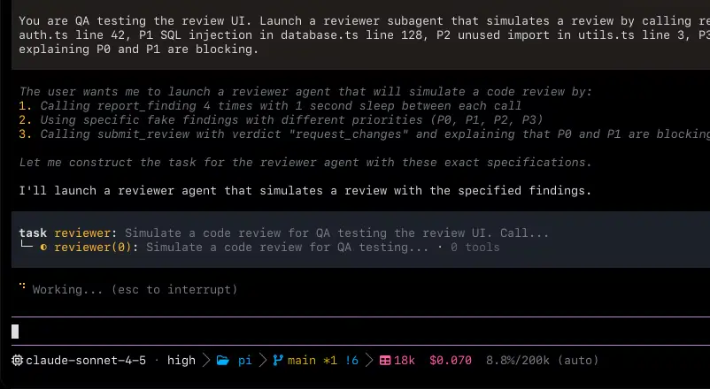
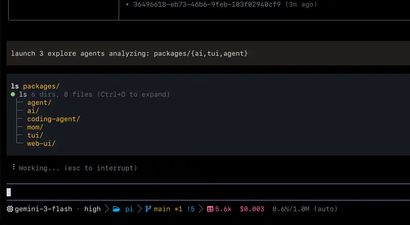
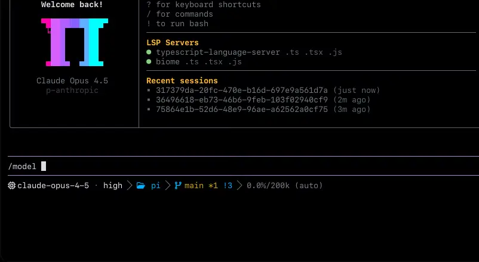
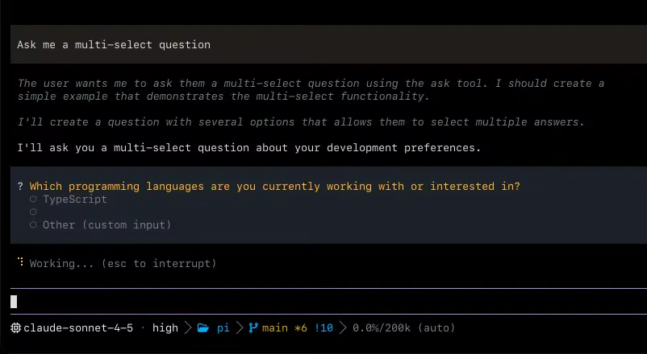
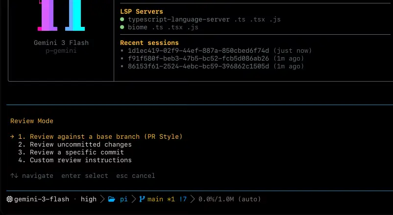
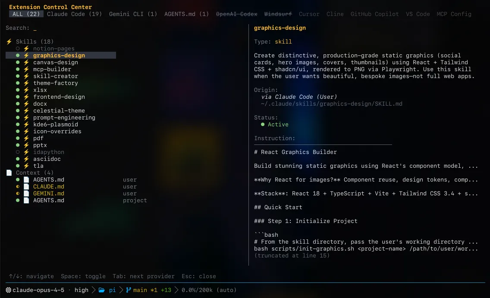
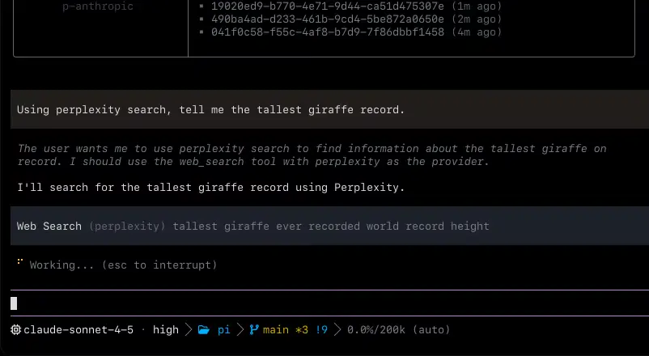
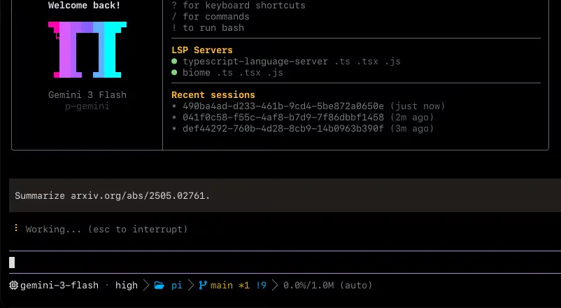

<p align="center">
  
</p>

<p align="center">
  <strong>面向终端的 AI 编码代理</strong>
</p>

<p align="center">
  <a href="https://www.npmjs.com/package/@oh-my-pi/pi-coding-agent"></a>
  <a href="https://github.com/can1357/oh-my-pi/blob/main/packages/coding-agent/CHANGELOG.md"></a>
  <a href="https://github.com/can1357/oh-my-pi/actions"></a>
  <a href="https://github.com/can1357/oh-my-pi/blob/main/LICENSE"></a>
  <a href="https://www.typescriptlang.org"></a>
  <a href="https://www.rust-lang.org"></a>
  <a href="https://bun.sh"></a>
  <a href="https://discord.gg/4NMW9cdXZa"></a>
</p>

<p align="center">
  由 <a href="https://github.com/mariozechner">@mariozechner</a> 开发的 <a href="https://github.com/badlogic/pi-mono">badlogic/pi-mono</a> 分叉而来
</p>

## 目录

- [亮点](#亮点)
- [安装](#安装)
- [快速开始](#快速开始)
  - [终端设置](#终端设置)
  - [API 密钥与 OAuth](#api-密钥与-oauth)
  - [前 15 分钟（推荐）](#前-15-分钟推荐)
- [使用](#使用)
  - [斜杠命令](#斜杠命令)
  - [编辑器特性](#编辑器特性)
  - [键盘快捷键](#键盘快捷键)
  - [Bash 模式](#bash-模式)
  - [图像支持](#图像支持)
- [会话](#会话)
  - [会话管理](#会话管理)
  - [上下文压缩](#上下文压缩)
  - [分支](#分支)
  - [自治记忆](#自治记忆)
- [配置](#配置)
  - [项目上下文文件](#项目上下文文件)
  - [自定义系统提示词](#自定义系统提示词)
  - [自定义模型与提供商](#自定义模型与提供商)
  - [设置文件](#设置文件)
- [扩展](#扩展)
  - [主题](#主题)
  - [自定义斜杠命令](#自定义斜杠命令)
  - [技能](#技能)
  - [钩子](#钩子)
  - [自定义工具](#自定义工具)
- [CLI 参考](#cli-参考)
- [工具](#工具)
- [程序化使用](#程序化使用)
  - [SDK](#sdk)
  - [RPC 模式](#rpc-模式)
  - [HTML 导出](#html-导出)
- [理念](#理念)
- [开发](#开发)
- [Monorepo 包](#monorepo-包)
- [许可证](#许可证)

---

## 亮点

### + Commit 工具（AI 驱动的 Git 提交）

AI 驱动的 Conventional Commit 生成，并带有智能变更分析：

- **Agentic 模式**：基于工具的 git 检查，使用 `git-overview`、`git-file-diff`、`git-hunk` 进行细粒度分析
- **拆分提交**：自动将无关改动拆分为原子提交，并处理依赖顺序
- **基于 hunk 的暂存**：当改动跨越多个关注点时，可暂存单独的 hunk
- **生成变更日志**：为 `CHANGELOG.md` 文件提议并应用变更日志条目
- **提交校验**：检测填充词、元话语，并强制符合 Conventional Commit 格式
- **传统模式**：在偏好确定性流水线时可使用 `--legacy` 标志
- 通过 `omp commit` 运行，可选参数包括：`--push`、`--dry-run`、`--no-changelog`、`--context`

### + Python 工具（IPython Kernel）

<p align="center">
  
</p>

使用持久化 IPython 内核执行 Python 代码，并提供丰富的辅助前导环境：

- **流式输出**：实时 stdout/stderr，并支持图像和 JSON 渲染
- **前导辅助函数**：内核内置文件 I/O、搜索、查找/替换、行操作、shell 与文本工具
- **行操作**：`lines()`、`insert_at()`、`delete_lines()`、`delete_matching()` 及相关辅助函数，可实现精确编辑
- **共享网关**：跨会话复用内核，提升资源效率（`python.sharedGateway` 设置）
- **自定义模块**：从 `.omp/modules/` 和 `~/.omp/agent/modules/` 加载扩展
- **富输出**：支持 `display()` 渲染 HTML、Markdown、图像和交互式 JSON 树
- **Markdown 渲染**：Python 单元输出中的 Markdown 内容可内联渲染
- **Mermaid 图表**：在 iTerm2/Kitty 终端中将 mermaid 代码块渲染为内联图形
- 通过 `omp setup python` 安装依赖

### + LSP 集成（Language Server Protocol）

<p align="center">
  
</p>

具备完整 IDE 式代码智能，支持自动格式化与诊断：

- **11 种 LSP 操作**：`diagnostics`、`definition`、`type_definition`、`implementation`、`references`、`hover`、`symbols`、`rename`、`code_actions`、`status`、`reload`
- **写入即格式化**：使用语言服务器格式化器自动格式化代码（rustfmt、gofmt、prettier 等）
- **写入/编辑即诊断**：每次文件变更后立即反馈语法错误和类型问题
- **工作区诊断**：通过 `lsp` 的 `diagnostics` 操作（不传文件）检查整个项目错误
- **40+ 语言配置**：开箱即用支持 Rust、Go、Python、TypeScript、Java、Kotlin、Scala、Haskell、OCaml、Elixir、Ruby、PHP、C#、Lua、Nix 等众多语言
- **本地二进制解析**：自动发现项目本地的 LSP 服务器，如 `node_modules/.bin/`、`.venv/bin/` 等
- **符号消歧**：`occurrence` 参数可解析同一行上的重复符号

### + Time Traveling Streamed Rules (TTSR)

<p align="center">
  
</p>

零上下文消耗的规则，仅在需要时才会注入：

- **基于模式触发的注入**：规则定义用于监视模型输出流的正则触发器
- **即时激活**：当模式匹配时，输出流会中止，规则作为系统提醒注入，请求随后重试
- **零前置成本**：在真正相关之前，TTSR 规则不会消耗任何上下文
- **每会话仅触发一次**：每条规则只会触发一次，避免循环
- 通过规则文件中的 `ttsrTrigger` 字段（正则模式）定义

示例：一条“不要使用已弃用 API”的规则，只有在模型开始编写已弃用代码时才会激活，从而为从未触及该 API 的会话节省上下文。

### + 交互式代码审查

<p align="center">
  
</p>

带有基于优先级发现项的结构化代码审查：

- **`/review` 命令**：交互式模式选择（分支比较、未提交变更、提交审查）
- **结构化发现项**：`report_finding` 工具支持优先级等级（P0-P3：严重 → nit）
- **结论渲染**：将发现项聚合为 approve/request-changes/comment
- 合并后的结果树会显示结论及全部发现项

### + Task 工具（子代理系统）

<p align="center">
  
</p>

并行执行框架，具备专门代理与实时流式输出：

- **内置 6 个代理**：explore、plan、designer、reviewer、task、quick_task
- **并行探索**：在大型代码库分析中，reviewer 代理可派生 explore 代理
- **实时工件流式输出**：Task 输出在生成过程中实时流出，而不只是完成时显示
- **完整输出访问**：当预览被截断时，可通过 `agent://<id>` 资源读取完整子代理输出
- **隔离后端**：`isolated: true` 可让任务在 git worktree、Unix fuse-overlay 文件系统或 Windows ProjFS（`fuse-projfs`）中运行，并支持 patch 或 branch 合并策略
- **异步后台作业**：后台执行支持可配置并发（最高 100 个作业），并提供 `await` 工具用于阻塞等待结果
- **代理控制中心**：通过 `/agents` 仪表板管理和创建自定义代理
- **AI 驱动的代理创建**：使用 architect 模型生成自定义代理定义
- **按代理覆盖模型**：可通过 swarm 扩展为单个代理分配特定模型
- 支持用户级（`~/.omp/agent/agents/`）和项目级（`.omp/agents/`）自定义代理

### + 模型角色

<p align="center">
  
</p>

为不同用途配置不同模型，并支持自动发现：

- **基于角色的路由**：`default`、`smol`、`slow`、`plan` 和 `commit` 角色
- **可配置的发现机制**：角色默认值会自动解析，也可按角色覆盖
- **基于角色的选择**：Task 工具中的代理可以使用 `model: pi/smol` 进行低成本探索
- CLI 参数（`--smol`、`--slow`、`--plan`）以及环境变量（`PI_SMOL_MODEL`、`PI_SLOW_MODEL`、`PI_PLAN_MODEL`）
- 通过 `/model` 选择器交互式配置角色，并将分配结果持久化到设置中

### + Todo 工具（任务跟踪）

带有阶段式进度跟踪的结构化任务管理：

- **阶段化任务列表**：将工作组织为具名阶段与有序任务
- **5 种操作**：`replace`（初始化）、`add_phase`、`add_task`、`update`（状态变更）、`remove_task`
- **4 种任务状态**：`pending`、`in_progress`、`completed`、`abandoned`
- **自动规范化**：确保始终恰好有一个任务处于 `in_progress`
- **持久面板**：Todo 列表显示在编辑器上方，并实时更新进度
- **完成提醒**：代理在仍有未完成 todo 时停止会收到警告（`todo.reminders` 设置）
- **切换可见性**：`Ctrl+T` 展开/折叠 todo 面板

### + Ask 工具（交互式提问）

<p align="center">
  
</p>

带有类型化选项的结构化用户交互：

- **单选问题**：展示带描述的选项供用户选择
- **多选支持**：当选项并非互斥时允许多个答案
- **多段问题**：通过 `questions` 数组参数顺序提问多个相关问题

### + 自定义 TypeScript 斜杠命令

<p align="center">
  
</p>

可编程命令，具备完整 API 访问能力：

- 创建位置：`~/.omp/agent/commands/[name]/index.ts` 或 `.omp/commands/[name]/index.ts`
- 导出工厂函数，返回 `{ name, description, execute(args, ctx) }`
- 可完整访问 `HookCommandContext`，用于 UI 对话框、会话控制、shell 执行
- 返回字符串可作为发送给 LLM 的提示词，或返回 void 用于 fire-and-forget 动作
- 同时也会从 Claude Code 目录加载（`~/.claude/commands/`、`.claude/commands/`）

### + 通用配置发现

<p align="center">
  
</p>

统一的基于能力的发现机制，可从 8 种 AI 编码工具加载配置：

- **多工具支持**：Claude Code、Cursor、Windsurf、Gemini、Codex、Cline、GitHub Copilot、VS Code
- **发现全部内容**：MCP 服务器、规则、技能、钩子、工具、斜杠命令、提示词、上下文文件
- **原生格式支持**：Cursor MDC frontmatter 元数据、Windsurf 规则、Cline `.clinerules`、Copilot `applyTo` glob、Gemini `system.md`、Codex `AGENTS.md`
- **提供商归属**：可查看每个配置项由哪个工具提供
- **发现设置**：通过 `/extensions` 交互式仪表板启用/禁用单独的提供商
- **优先级排序**：跨 `.omp`、`.claude`、`.codex` 和 `.gemini` 目录的多路径解析

### + MCP 与插件系统

<p align="center">
  
</p>

完整支持 Model Context Protocol，并可集成外部工具：

- 支持 Stdio 和 HTTP 传输方式连接 MCP 服务器
- **OAuth 支持**：MCP 服务器配置中可显式指定 `clientId` 和 `callbackPort`，并可通过斜杠命令手动处理 OAuth 回调
- **浏览器服务器过滤**：自动过滤浏览器类型的 MCP 服务器，避免与内置浏览器工具冲突
- **Exa 自动过滤**：提取 Exa API 密钥，并优先使用原生 Exa 集成
- **配置模式 + 设置指南**：[`docs/mcp-config.md`](./docs/mcp-config.md) 和 [`packages/coding-agent/src/config/mcp-schema.json`](./packages/coding-agent/src/config/mcp-schema.json)
- 插件 CLI（`omp plugin install/enable/configure/doctor`）
- 从 `~/.omp/plugins/` 热加载插件，并集成 npm/bun
- `disabledServers` 同时适用于项目级和用户级第三方服务器

### + Web 搜索与抓取

<p align="center">
  
</p>

多提供商搜索与整页抓取，并带有专门处理器：

- **多提供商搜索**：`auto`、`exa`、`brave`、`jina`、`kimi`、`zai`、`anthropic`、`perplexity`、`gemini`、`codex`、`synthetic`
- **专门处理器**：针对代码托管站、注册表、研究来源、论坛和文档站点的站点级提取
- **包注册表**：npm、PyPI、crates.io、Hex、Hackage、NuGet、Maven、RubyGems、Packagist、pub.dev、Go packages
- **安全数据库**：NVD、OSV、CISA KEV 漏洞数据
- HTML 转 Markdown，并保留链接

### + SSH 工具

通过持久连接执行远程命令：

- **项目发现**：从项目中的 `ssh.json` / `.ssh.json` 读取 SSH 主机
- **主机管理**：通过 `omp ssh` CLI 或 `/ssh` 斜杠命令添加、删除和列出主机
- **持久连接**：跨命令复用 SSH 连接以提升执行速度
- **OS/shell 检测**：自动检测远程操作系统和 shell 类型
- **SSHFS 挂载**：可选自动挂载远程目录
- **兼容模式**：支持 Windows 主机并自动探测 shell

### + Browser 工具（带 Stealth 的 Puppeteer）

无头浏览器自动化，带有 14 个 stealth 脚本以规避机器人检测：

- **自动化动作**：导航、点击、输入、填表、滚动、拖拽、截图、执行 JS、提取可读内容
- **无障碍快照**：通过无障碍树观察交互元素，并使用数字 ID 实现可靠定位
- **14 个 stealth 插件**：自定义脚本覆盖 toString 篡改、WebGL 指纹、音频上下文、屏幕尺寸、字体枚举、plugin/mime-type 模拟、硬件并发、编解码器可用性、iframe 检测、区域设置伪装、worker 检测等
- **User agent 伪装**：移除 `HeadlessChrome` 标识，生成正确的 Client Hints 品牌列表，并通过 CDP 的 Network 与 Emulation 域应用覆盖
- **选择器灵活性**：支持 CSS、`aria/`、`text/`、`xpath/`、`pierce/` 查询处理器，可穿透 Shadow DOM
- **阅读模式**：`extract_readable` 动作用 Mozilla Readability 提取干净的文章内容
- **无头/可视切换**：通过 `/browser` 命令或 `browser.headless` 设置在运行时切换模式
- **NixOS 支持**：自动检测 NixOS（`/etc/NIXOS`），并解析系统 Chromium（PATH 中的 `chromium`、`~/.nix-profile/bin/chromium` 或 `/run/current-system/sw/bin/chromium`），因为 Puppeteer 自带二进制无法在非 FHS 系统上运行

### + Cursor 提供商

使用你的 Cursor Pro 订阅进行 AI 补全：

- **基于浏览器的 OAuth**：通过 Cursor 的 OAuth 流程进行认证
- **工具执行桥接**：将 Cursor 原生工具映射到 omp 对应实现（read、write、shell、diagnostics）
- **会话缓存**：在同一会话中跨请求持久化上下文
- **Shell 流式输出**：命令执行期间实时输出 stdout/stderr

### + 多凭据支持

将负载分发到多个 API 密钥：

- **轮询分配**：每个会话自动轮换使用凭据
- **按使用情况选择**：对于 OpenAI Codex，会在选择凭据前检查账户限制
- **自动回退**：命中速率限制时在会话中途切换凭据
- **一致性哈希**：FNV-1a 哈希确保每个会话的凭据分配稳定

### + 图像生成

直接从代理创建图像：

- **Gemini 集成**：默认使用 `gemini-3-pro-image-preview`
- **OpenRouter 回退**：设置 `OPENROUTER_API_KEY` 后自动使用 OpenRouter
- **内联显示**：图像可在支持 Kitty/iTerm2 图形的终端中渲染
- 保存到临时文件，并报告路径以便后续处理

### + TUI 全面升级

现代化终端界面，并带有智能会话管理：

- **自动会话标题**：根据首条消息自动命名会话，使用 commit 模型，失败时回退到 smol
- **欢迎界面**：Logo、技巧、最近会话及其选择
- **Powerline 页脚**：模型、cwd、git 分支/状态、token 使用量、上下文百分比
- **LSP 状态**：显示哪些语言服务器已激活并准备就绪
- **热键**：编辑器为空时按 `?` 显示快捷键
- **持久化提示历史**：基于 SQLite，并支持 `Ctrl+R` 跨会话搜索
- **分组工具显示**：连续的 Read 调用以紧凑树状视图显示
- **流式文本预览**：代理输出期间实时更新增量内容
- **覆盖式 UI**：自定义钩子可将组件显示为底部居中的浮层
- **可配置 tab 宽度**：`display.tabWidth` 设置，并与 `.editorconfig` 集成
- **保留回滚缓冲区**：使用 home+erase-below，而不是 clear-screen
- **终端紧急恢复**：崩溃处理器可防止终端状态损坏

### + Hashline 编辑

Hashline 为每一行提供一个短内容哈希锚点。模型引用锚点而不是重现文本，因此不会再有空白复现问题、不会出现 “string not found”，也不会有歧义匹配。如果文件自上次读取后发生变化，哈希将不匹配，编辑会在任何内容被破坏之前遭到拒绝。

在 16 个模型、180 个任务、每个任务 3 次运行上的基准测试结果：

- **Grok Code Fast 1**：6.7% → 68.3%，在机械性 patch 失败背后隐藏着 _十倍_ 提升
- **Gemini 3 Flash**：相较 `str_replace` 提升 +5pp，超过 Google 自家的最佳尝试
- **Grok 4 Fast**：输出 token 减少 61%，不再把上下文浪费在重试循环上
- **MiniMax**：成功率提升超过一倍
- 在几乎所有测试模型上都能匹配或超过 `str_replace`；模型越弱，收益越明显

### + 原生引擎（Rust N-API）

约 7,500 行 Rust，编译为带平台标签的 N-API 扩展模块，提供高性能关键操作，无需 shell 调用外部命令：

| 模块 | 行数 | 功能 | 基于 |
| ------------- | -----: | ---------------------------------------------------------------------------------------------------------------------------------------------------- | ----------------------------------------------------------------- |
| **grep** | ~1,300 | 对文件和内存内容进行正则搜索，支持并行/顺序模式、glob/类型过滤、上下文行，以及自动补全用模糊查找 | `grep-regex`、`grep-searcher`、`grep-matcher`（ripgrep internals） |
| **shell** | ~1,025 | 内嵌 bash 执行，支持持久会话、流式输出、超时/中止、自定义内建命令 | [brush-shell](https://github.com/reubeno/brush)（vendored） |
| **text** | ~1,280 | ANSI 感知的可见宽度、带省略号截断、列切片、在换行间保留 SGR 代码的文本换行，全部针对 UTF-16 优化 | `unicode-width`、`unicode-segmentation` |
| **keys** | ~1,300 | Kitty 键盘协议解析器，带传统 xterm/VT100 回退、修饰键支持、PHF 完美哈希查找 | `phf` |
| **highlight** | ~475 | 语法高亮，带 11 类语义颜色和 30+ 语言别名 | `syntect` |
| **glob** | ~340 | 使用 glob 模式进行文件系统发现，支持类型过滤、mtime 排序、遵守 `.gitignore` | `ignore`、`globset`（ripgrep internals） |
| **task** | ~350 | libuv 线程池上的阻塞工作调度器，支持协作式/外部取消、超时、性能分析钩子 | `tokio`、`napi` |
| **ps** | ~290 | 跨平台进程树终止与子进程枚举，在 Linux 上使用 `/proc`，macOS 上使用 `libproc`，Windows 上使用 `CreateToolhelp32Snapshot` | `libc` |
| **prof** | ~250 | 常驻循环缓冲区 profiler，输出 folded-stack，并可选生成 SVG flamegraph | `inferno` |
| **image** | ~150 | 解码/编码 PNG/JPEG/WebP/GIF，支持 5 种采样滤镜的 resize | `image` |
| **clipboard** | ~95 | 从系统剪贴板复制文本和读取图像，无需 `xclip`/`pbcopy` | `arboard` |
| **html** | ~50 | HTML 转 Markdown，并可选内容清洗 | `html-to-markdown-rs` |

支持的平台：`linux-x64`、`linux-arm64`、`darwin-x64`、`darwin-arm64`、`win32-x64`。

### ... 以及更多

- **`omp config` 子命令**：通过 CLI 管理设置（`list`、`get`、`set`、`reset`、`path`）
- **`omp setup` 子命令**：安装可选依赖（例如 `omp setup python` 用于安装 Jupyter 内核）
- **`omp stats` 子命令**：AI 使用情况的本地可观测性仪表板（请求、成本、缓存率、tokens/s）
- **`xhigh` 思考等级**：为 Anthropic 模型提供更长推理与更高 token 预算
- **后台模式**：`/background` 分离 UI，并继续执行代理
- **完成通知**：代理结束时可配置 bell/OSC99/OSC9 通知
- **65+ 内置主题**：Catppuccin、Dracula、Nord、Gruvbox、Tokyo Night、Poimandres 及 material 变体
- **自动暗/亮切换**：通过 Mode 2031 终端检测、原生 macOS 外观 CoreFoundation FFI、COLORFGBG 回退实现
- **自动环境检测**：在系统提示词中注入 OS、发行版、内核、CPU、GPU、shell、终端、桌面环境信息
- **Git 上下文**：系统提示词包含分支、状态、最近提交
- **Bun 运行时**：原生 TypeScript 执行、更快启动、所有包均已迁移
- **集中式文件日志**：调试日志按天轮转写入 `~/.omp/logs/`
- **Bash 拦截器**：可选阻止那些已有专用工具的 shell 命令
- **按命令控制 PTY**：Bash 工具支持 `pty: true`，适用于需要真实终端的命令（sudo、ssh）
- **@file 自动读取**：在提示词中输入 `@path/to/file` 即可内联注入文件内容
- **AST 工具**：`ast_grep` 和 `ast_edit`，通过 ast-grep 实现语法感知的代码搜索与 codemod
- **采样控制**：`topP`、`topK`、`minP`、`presencePenalty`、`repetitionPenalty` 设置，支持细粒度模型调优

---

## 安装

### 通过 Bun（推荐）

要求 [Bun](https://bun.sh) **>= 1.3.7**：

```bash
bun install -g @oh-my-pi/pi-coding-agent
```

### 通过安装脚本

**Linux / macOS：**

```bash
curl -fsSL https://raw.githubusercontent.com/can1357/oh-my-pi/main/scripts/install.sh | sh
```

**Windows（PowerShell）：**

```powershell
irm https://raw.githubusercontent.com/can1357/oh-my-pi/main/scripts/install.ps1 | iex
```

默认情况下，安装程序会优先使用 Bun（如果可用且兼容），否则安装预构建二进制。

选项：

- POSIX（`install.sh`）：`--source`、`--binary`、`--ref <ref>`、`-r <ref>`
- PowerShell（`install.ps1`）：`-Source`、`-Binary`、`-Ref <ref>`
- 在 binary 模式下使用 `--ref`/`-Ref` 必须引用发布标签；分支/提交引用需要 source 模式

使用 `PI_INSTALL_DIR` 设置自定义安装目录。

示例：

```bash
# Source install (Bun)
curl -fsSL https://raw.githubusercontent.com/can1357/oh-my-pi/main/scripts/install.sh | sh -s -- --source

# Install release tag via binary
curl -fsSL https://raw.githubusercontent.com/can1357/oh-my-pi/main/scripts/install.sh | sh -s -- --binary --ref v3.20.1

# Install branch/commit via source
curl -fsSL https://raw.githubusercontent.com/can1357/oh-my-pi/main/scripts/install.sh | sh -s -- --source --ref main
```

```powershell
# Install release tag via binary
& ([scriptblock]::Create((irm https://raw.githubusercontent.com/can1357/oh-my-pi/main/scripts/install.ps1))) -Binary -Ref v3.20.1
# Install branch/commit via source
& ([scriptblock]::Create((irm https://raw.githubusercontent.com/can1357/oh-my-pi/main/scripts/install.ps1))) -Source -Ref main
```

### 通过 [mise](https://mise.jdx.dev)

```bash
mise use -g github:can1357/oh-my-pi
```

### 手动下载

可直接从 [GitHub Releases](https://github.com/can1357/oh-my-pi/releases/latest) 下载二进制。

---

## 快速开始

### 终端设置

Pi 使用 [Kitty keyboard protocol](https://sw.kovidgoyal.net/kitty/keyboard-protocol/) 来可靠地检测修饰键。大多数现代终端都支持该协议，但有些需要额外配置。

**Kitty、iTerm2：** 开箱即用。

**Ghostty：** 在 Ghostty 配置（`~/.config/ghostty/config`）中添加：

```
keybind = alt+backspace=text:\x1b\x7f
keybind = shift+enter=text:\n
```

**wezterm：** 创建 `~/.wezterm.lua`：

```lua
local wezterm = require 'wezterm'
local config = wezterm.config_builder()
config.enable_kitty_keyboard = true
return config
```

**Windows Terminal：** 不支持 Kitty keyboard protocol。无法区分 Shift+Enter 与 Enter。请改用 Ctrl+Enter 输入多行。其他键位绑定均可正常工作。

### API 密钥与 OAuth

**选项 1：环境变量**（常见示例）

| 提供商 | 环境变量 |
|-------------------------------------------------| -------------------------------------------- |
| Anthropic | `ANTHROPIC_API_KEY` |
| OpenAI | `OPENAI_API_KEY` |
| Google | `GEMINI_API_KEY` |
| Mistral | `MISTRAL_API_KEY` |
| Groq | `GROQ_API_KEY` |
| Cerebras | `CEREBRAS_API_KEY` |
| Hugging Face (`huggingface`) | `HUGGINGFACE_HUB_TOKEN` or `HF_TOKEN` |
| Synthetic | `SYNTHETIC_API_KEY` |
| NVIDIA (`nvidia`) | `NVIDIA_API_KEY` |
| NanoGPT (`nanogpt`) | `NANO_GPT_API_KEY` |
| Together (`together`) | `TOGETHER_API_KEY` |
| Ollama (`ollama`) | `OLLAMA_API_KEY` _(optional)_ |
| LiteLLM (`litellm`) | `LITELLM_API_KEY` |
| LM Studio (`lm-studio`) | `LM_STUDIO_API_KEY` _(optional)_ |
| llama.cpp (`llama.cpp`) | `LLAMA_CPP_API_KEY` _(optional)_ |
| Xiaomi MiMo (`xiaomi`) | `XIAOMI_API_KEY` |
| Moonshot (`moonshot`) | `MOONSHOT_API_KEY` |
| Venice (`venice`) | `VENICE_API_KEY` |
| Kilo Gateway (`kilo`) | `KILO_API_KEY` |
| GitLab Duo (`gitlab-duo`) | _仅 OAuth_ |
| Jina (`jina`, web search) | `JINA_API_KEY` |
| Perplexity | `PERPLEXITY_API_KEY` or `PERPLEXITY_COOKIES` |
| xAI | `XAI_API_KEY` |
| OpenRouter | `OPENROUTER_API_KEY` |
| Z.AI | `ZAI_API_KEY` |
| Qwen Portal (`qwen-portal`) | `QWEN_OAUTH_TOKEN` or `QWEN_PORTAL_API_KEY` |
| vLLM (`vllm`) | `VLLM_API_KEY` |
| Cloudflare AI Gateway (`cloudflare-ai-gateway`) | `CLOUDFLARE_AI_GATEWAY_API_KEY` |
| Vercel AI Gateway (`vercel-ai-gateway`) | `AI_GATEWAY_API_KEY` |
| Qianfan (`qianfan`) | `QIANFAN_API_KEY` |

完整列表见 [环境变量](docs/environment-variables.md)。

**选项 2：`/login`（交互式认证 / API 密钥设置）**

使用 `/login` 支持以下提供商：

- Anthropic (Claude Pro/Max)
- ChatGPT Plus/Pro (Codex)
- GitHub Copilot
- Google Cloud Code Assist (Gemini CLI)
- Antigravity (Gemini 3, Claude, GPT-OSS)
- Cursor
- Kimi Code
- Perplexity
- NVIDIA (`nvidia`)
- NanoGPT (`nanogpt`)
- Hugging Face Inference (`huggingface`)
- OpenCode Zen
- Kilo Gateway (`kilo`)
- GitLab Duo (`gitlab-duo`)
- Qianfan (`qianfan`)
- Ollama（本地 / 自托管，`ollama`）
- LM Studio（本地 / 自托管，`lm-studio`）
- llama.cpp（本地 / 自托管，`llama.cpp`）
- vLLM（本地 OpenAI 兼容，`vllm`）
- Z.AI (GLM Coding Plan)
- Synthetic
- Together (`together`)
- LiteLLM (`litellm`)
- Xiaomi MiMo (`xiaomi`)
- Moonshot (Kimi API, `moonshot`)
- Venice (`venice`)
- MiniMax Coding Plan（国际 / 中国）
- Qwen Portal (`qwen-portal`)
- Cloudflare AI Gateway (`cloudflare-ai-gateway`)
- Vercel AI Gateway (`vercel-ai-gateway`)

对于 `ollama`，API 密钥为可选项。对于本地无认证实例可以留空；若主机需要认证，请设置 `OLLAMA_API_KEY`。
对于 `llama.cpp`，API 密钥为可选项。对于本地无认证实例可以留空；若主机需要认证，请设置 `LLAMA_CPP_API_KEY`。
对于 `lm-studio`，API 密钥为可选项。对于本地无认证实例可以留空；若主机需要认证，请设置 `LM_STUDIO_API_KEY`。
对于 `vllm`，可在 `/login` 中粘贴你的密钥（或使用 `VLLM_API_KEY`）。对于本地无认证服务器，任意占位值都可使用（例如 `vllm-local`）。
对于 `nanogpt`，`/login nanogpt` 会打开 `https://nano-gpt.com/api` 并提示输入你的 `sk-...` 密钥（也可设置 `NANO_GPT_API_KEY`）。登录时会通过 NanoGPT 的 models 端点校验该密钥（不是固定模型权限）。
对于 `cloudflare-ai-gateway`，请将提供商 base URL 设置为
`https://gateway.ai.cloudflare.com/v1/<account_id>/<gateway_id>/anthropic`
（例如在 `~/.omp/agent/models.yml` 中）。

```bash
omp
/login
```

**凭据行为：**

- `/login` 会为该提供商追加凭据（不会清空现有条目）
- `/logout` 会清除所选提供商保存的凭据
- 凭据存储在 `~/.omp/agent/agent.db`
- 对于同一提供商，已保存的 API 密钥凭据会优先于 OAuth 凭据被选中

### 前 15 分钟（推荐）

这是面向新用户的实用上手流程。

#### 1) 设置提供商

- **API 密钥**（最快）：导出 `ANTHROPIC_API_KEY`、`OPENAI_API_KEY`、`GEMINI_API_KEY` 等
- **OAuth 订阅**：运行 `/login` 并使用你的提供商账户完成认证

#### 2) 通过 `/model` 配置模型角色

在 TUI 中使用 `/model`，并分配角色模型：

- `default` → 常规实现工作
- `smol` → 快速/低成本探索与轻量任务
- `slow` → 复杂调试/重构时的深度推理
- `plan` → 计划模式启用时（`/plan`）使用的模型
- `commit` → commit/changelog 工作流使用的模型

该设置过程是交互式的，并会为你持久化保存。

#### 3) 在进行大改动前先使用 `/plan`

`/plan` 用于切换计划模式。当你希望在编辑前先获得架构与执行顺序时，请使用它。

典型流程：

1. 运行 `/plan`
2. 请求一个具体的实现计划
3. 调整计划
4. 批准并执行

#### 4) 通过 `/extensions` 审查上下文

如果上下文使用量异常偏高，请检查已发现的外部提供商资产（规则/提示词/上下文/钩子/扩展）。

运行 `/extensions` 并：

- 浏览提供商标签页（`Tab` / `Shift+Tab`）
- 检查每个条目的来源（`via <provider>` + 文件路径）
- 禁用你不需要的整类提供商或特定条目（`Space`）

---

## 使用

### 斜杠命令

这些是**聊天内斜杠命令**（不是 CLI 子命令）。
| 命令 | 说明 |
| ------- | ----------- |
| `/settings` | 打开设置菜单 |
| `/plan` | 切换计划模式 |
| `/model` (`/models`) | 打开模型选择器 |
| `/export [path]` | 将会话导出为 HTML |
| `/dump` | 将会话转录复制到剪贴板 |
| `/share` | 将会话上传为 secret gist |
| `/session` | 显示会话信息与用量 |
| `/usage` | 显示提供商用量与限制 |
| `/hotkeys` | 显示键盘快捷键 |
| `/extensions` (`/status`) | 打开扩展控制中心 |
| `/changelog` | 显示变更日志条目 |
| `/tree` | 浏览会话树 |
| `/branch` | 打开分支选择器（树或消息选择器，取决于设置） |
| `/fork` | 从先前消息分叉 |
| `/resume` | 打开会话选择器 |
| `/new` | 开始新会话 |
| `/compact [focus]` | 手动压缩上下文 |
| `/handoff [focus]` | 将上下文交接给新会话 |
| `/browser [headless\|visible]` | 切换浏览器模式 |
| `/mcp ...` | 管理 MCP 服务器 |
| `/memory ...` | 检查/清除/重建记忆状态 |
| `/move <path>` | 将当前会话移动到不同 cwd |
| `/background` (`/bg`) | 分离 UI 并继续在后台运行 |
| `/debug` | 打开调试工具 |
| `/copy` | 复制上一条代理消息 |
| `/login` / `/logout` | OAuth 登录/登出 |
| `/exit` (`/quit`) | 退出交互模式 |

内置的自定义斜杠命令包括 `/review`（交互式代码审查启动器）。

### 编辑器特性

**文件引用（`@`）：** 输入 `@` 可对项目文件进行模糊搜索。遵守 `.gitignore`。

**路径补全（Tab）：** 可补全相对路径、`../`、`~/` 等。

**拖放：** 可将文件从文件管理器拖入终端。

**多行粘贴：** 预览中会折叠粘贴内容，但发送时仍为完整内容。

**消息排队：** 代理工作期间仍可提交消息；排队行为可在 `/settings` 中配置。

### 键盘快捷键

**导航：**

| 键位 | 动作 |
| ------------------------ | -------------------------------------------- |
| Arrow keys | 移动光标 / 浏览历史（输入框为空时按 Up） |
| Option+Left/Right | 按单词移动 |
| Ctrl+A / Home / Cmd+Left | 跳到行首 |
| Ctrl+E / End / Cmd+Right | 跳到行尾 |

**编辑：**

| 键位 | 动作 |
| ------------------------- | ----------------------- |
| Enter | 发送消息 |
| Shift+Enter / Alt+Enter | 换行 |
| Ctrl+W / Option+Backspace | 向后删除一个单词 |
| Ctrl+U | 删除到行首 |
| Ctrl+K | 删除到行尾 |

**其他：**

| 键位 | 动作 |
| --------------------- | --------------------------------------------------------- |
| Tab | 路径补全 / 接受自动补全 |
| Escape | 取消自动补全 / 中止流式输出 |
| Ctrl+C | 清空编辑器（第一次）/ 退出（第二次） |
| Ctrl+D | 退出（当编辑器为空时） |
| Ctrl+Z | 挂起到后台（在 shell 中使用 `fg` 恢复） |
| Shift+Tab | 切换思考等级 |
| Ctrl+P / Shift+Ctrl+P | 轮换角色模型（slow/default/smol），按住 shift 为临时切换 |
| Alt+P | 临时选择模型 |
| Ctrl+L | 打开模型选择器 |
| Alt+Shift+P | 切换计划模式 |
| Ctrl+R | 搜索提示历史 |
| Ctrl+O | 切换工具输出展开状态 |
| Ctrl+T | 切换 todo 列表展开状态 |
| Ctrl+G | 在外部编辑器中编辑消息（`$VISUAL` 或 `$EDITOR`） |
| Alt+H | 切换语音转文本录音 |

### Bash 模式

在命令前加 `!` 可执行该命令，并将输出纳入上下文：

```bash
!git status
!ls -la
```

使用 `!!` 可执行命令，但**不将输出纳入 LLM 上下文**：

```bash
!!git status
```

输出会实时流式显示。按 Escape 可取消。

### 图像支持

**通过引用附加图像：**

```text
What's in @/path/to/image.png?
```

或直接粘贴/拖放图像（`Ctrl+V` 或拖放）。

支持的格式：`.jpg`、`.jpeg`、`.png`、`.gif`、`.webp`

可通过 `/settings` 切换内联图像，或设置 `terminal.showImages: false`。

---

## 会话

会话以带树状结构的 JSONL 存储，用于分支与回放。

文件格式与 API 见 [docs/session.md](docs/session.md)。

### 会话管理

会话会自动保存到 `~/.omp/agent/sessions/`（按工作目录分组）。

```bash
omp --continue             # Continue most recent session
omp -c

omp --resume               # Open session picker
omp -r

omp --resume <id-prefix>   # Resume by session ID prefix
omp --resume <path>        # Resume by explicit .jsonl path
omp --session <value>      # Alias of --resume
omp --no-session    # Ephemeral mode (don't save)
```

会话 ID 为 Snowflake 风格的十六进制 ID（不是 UUID）。

### 上下文压缩

长会话可能耗尽上下文窗口。压缩会总结较旧消息，同时保留近期上下文。

**手动：** `/compact` 或 `/compact Focus on the API changes`

**自动：** 通过 `/settings` 启用。

- **溢出恢复**：模型返回上下文溢出时，自动压缩并重试。
- **阈值维护**：成功完成一轮后，如果上下文超过配置的余量，则进行压缩。

**配置**（`~/.omp/agent/config.yml`）：

```yaml
compaction:
  enabled: true
  reserveTokens: 16384
  keepRecentTokens: 20000
  autoContinue: true
```

内部机制与钩子集成见 [docs/compaction.md](docs/compaction.md)。

### 分支

**原地导航（`/tree`）：** 在不创建新文件的情况下浏览会话树。

- 可直接输入进行搜索，使用 ←/→ 翻页
- 过滤模式（`Ctrl+O`）：default → no-tools → user-only → labeled-only → all
- 按 `Shift+L` 将条目标记为书签

**创建新会话（`/branch` / `/fork`）：** 从选定的历史消息分叉到新的会话文件。

### 自治记忆

启用后，代理会从过往会话中提取持久知识，并在启动时注入。该流程在后台运行，不会阻塞当前会话。

记忆按项目（工作目录）隔离，存储在 `~/.omp/agent/memories/` 下。会话启动时，会将一份紧凑摘要注入系统提示词。代理可通过 `memory://root/MEMORY.md` 和 `memory://root/skills/<name>/SKILL.md` 读取更深层上下文。

通过 `/memory` 斜杠命令管理：

- `/memory view` — 显示当前注入载荷
- `/memory clear` — 删除所有记忆数据和工件
- `/memory enqueue` — 强制在下次启动时进行整合

> 参见 [记忆文档](docs/memory.md)。

---

## 配置

### 项目上下文文件

omp 会从受支持的配置目录中发现项目上下文（例如 `.omp`、`.claude`、`.codex`、`.gemini`）。

常见文件：

- `AGENTS.md`
- `CLAUDE.md`

可用于：

- 项目说明与约束
- 常用命令与工作流
- 架构文档
- 编码/测试约定

### 自定义系统提示词

通过创建 `SYSTEM.md` 替换默认系统提示词：

1. **项目本地：** `.omp/SYSTEM.md`（优先）
2. **全局：** `~/.omp/agent/SYSTEM.md`（回退）
   `--system-prompt` 会覆盖这两个文件。使用 `--append-system-prompt` 可追加额外指令。

### 自定义模型与提供商

通过 `~/.omp/agent/models.yml` 添加自定义提供商/模型。

`models.json` 仍兼容旧配置，但 `models.yml` 是现代格式。

> 模式与合并行为见 [models.yml 提供商集成指南](docs/models.md)。

```yaml
providers:
  ollama:
    baseUrl: http://localhost:11434/v1
    apiKey: OLLAMA_API_KEY
    api: openai-completions
    models:
      - id: llama-3.1-8b
        name: Llama 3.1 8B (Local)
        reasoning: false
        input: [text]
        cost:
          input: 0
          output: 0
          cacheRead: 0
          cacheWrite: 0
        contextWindow: 128000
        maxTokens: 32000

  llama.cpp:
    baseUrl: http://127.0.0.1:8080
    api: openai-responses
    auth: none
    discovery:
      type: llama.cpp
```

**支持的 API：** `openai-completions`、`openai-responses`、`openai-codex-responses`、`azure-openai-responses`、`anthropic-messages`、`google-generative-ai`、`google-vertex`

### 设置文件

全局设置存储于：

- `~/.omp/agent/config.yml`

项目覆盖设置会从已发现的项目设置文件中加载（通常是 `.omp/settings.json`）。

全局 `config.yml` 示例：

```yaml
theme:
  dark: titanium
  light: light

enabledModels:
  - "anthropic/*"
  - "*gpt*"
  - "gemini-2.5-pro:high"

modelRoles:
  default: anthropic/claude-sonnet-4-20250514
  plan: anthropic/claude-opus-4-1:high
  smol: anthropic/claude-sonnet-4-20250514
defaultThinkingLevel: high

retry:
  enabled: true
  # Number of retries before giving up on rate limits/server errors
  maxRetries: 3
  # Wait this long as a base (exponentially backed off) unless the API provides a retry-after-ms
  baseDelayMs: 2000
  # Configure role-specific model fallback chains
  fallbackChains:
    default:
      - "openai/gpt-4o-mini"
      - "openai/gpt-4o"
    plan:
      - "anthropic/claude-sonnet-4-6:high"
      - "openai/o3:high"
  # Whether to revert to the primary model when a fallback's cooldown expires
  fallbackRevertPolicy: cooldown-expiry
steeringMode: one-at-a-time
followUpMode: one-at-a-time
interruptMode: immediate

shellPath: C:\\path\\to\\bash.exe
hideThinkingBlock: false
collapseChangelog: false

disabledProviders: []
disabledExtensions: []

compaction:
  enabled: true
  reserveTokens: 16384
  keepRecentTokens: 20000

skills:
  enabled: true

terminal:
  showImages: true

topP: -1 # Nucleus sampling (0-1, -1 = provider default)
topK: -1 # Top-K tokens (-1 = provider default)
minP: -1 # Minimum probability (0-1, -1 = provider default)

display:
  tabWidth: 4 # Tab rendering width (.editorconfig integration)

async:
  enabled: false
  maxJobs: 100

task:
  eager: false
  isolation:
    mode: none # none | worktree | fuse-overlay | fuse-projfs
    merge: patch # patch | branch
```

旧版迁移说明：

- `settings.json` → `config.yml`
- `queueMode` → `steeringMode`
- 扁平 `theme: "..."` → `theme.dark` / `theme.light`

---

## 扩展

### 主题

内置主题包括 `dark`、`light` 以及许多捆绑变体。

**自动暗/亮切换：** omp 会通过 Mode 2031、原生 macOS CoreFoundation FFI，或 `COLORFGBG` 回退来检测终端外观，并在 `theme.dark` 与 `theme.light` 之间自动切换。

可通过 `/settings` 选择主题，或在 `~/.omp/agent/config.yml` 中设置：

```yaml
theme:
  dark: titanium
  light: light
```

**自定义主题：** 创建 `~/.omp/agent/themes/*.json`。

> 参见 [主题文档](docs/theme.md)。

### 自定义斜杠命令

可将可复用的提示命令定义为 Markdown 文件：

- 全局：`~/.omp/agent/commands/*.md`
- 项目：`.omp/commands/*.md`

```markdown
---
description: Review staged git changes
---

Review the staged changes (`git diff --cached`). Focus on:

- Bugs and logic errors
- Security issues
- Error handling gaps
```

文件名（去掉 `.md`）即为命令名。

参数占位符：

- `$1`、`$2`、... 位置参数
- `$@` 和 `$ARGUMENTS` 表示拼接后的全部参数

同时也支持 TypeScript 自定义命令：

- `~/.omp/agent/commands/<name>/index.ts`
- `.omp/commands/<name>/index.ts`

内置 TypeScript 命令：`/review`。

### 技能

技能是按需加载的能力包。

常见位置：

- `~/.omp/agent/skills/*/SKILL.md`
- `.omp/skills/*/SKILL.md`
- `~/.claude/skills/*/SKILL.md`、`.claude/skills/*/SKILL.md`
- `~/.codex/skills/*/SKILL.md`、`.codex/skills/*/SKILL.md`

```markdown
---
name: brave-search
description: Web search via Brave Search API.
---

# Brave Search
```

`description` 用于驱动匹配；若省略 `name`，则默认使用文件夹名。

可通过 `omp --no-skills` 或 `skills.enabled: false` 禁用技能。

> 参见 [技能文档](docs/skills.md)。

### 钩子

钩子是订阅生命周期事件的 TypeScript 模块。

钩子位置：

- 全局：`~/.omp/agent/hooks/pre/*.ts`、`~/.omp/agent/hooks/post/*.ts`
- 项目：`.omp/hooks/pre/*.ts`、`.omp/hooks/post/*.ts`
- CLI：`--hook <path>`

```typescript
import type { HookAPI } from "@oh-my-pi/pi-coding-agent/hooks";

export default function (omp: HookAPI) {
	omp.on("tool_call", async (event, ctx) => {
		if (event.toolName === "bash" && /sudo/.test(event.input.command as string)) {
			const ok = await ctx.ui.confirm("Allow sudo?", event.input.command as string);
			if (!ok) return { block: true, reason: "Blocked by user" };
		}
		return undefined;
	});
}
```

可通过以下方式从钩子注入消息：

```ts
omp.sendMessage(message, { triggerTurn: true });
```

> 参见 [钩子文档](docs/hooks.md) 和 [examples/hooks/](packages/coding-agent/examples/hooks/)。

### 自定义工具

自定义工具可扩展内置工具集，并可由模型调用。

自动发现位置：

- 全局：`~/.omp/agent/tools/*/index.ts`
- 项目：`.omp/tools/*/index.ts`

```typescript
import { Type } from "@sinclair/typebox";
import type { CustomToolFactory } from "@oh-my-pi/pi-coding-agent";
const factory: CustomToolFactory = () => ({
	name: "greet",
	label: "Greeting",
	description: "Generate a greeting",
	parameters: Type.Object({
		name: Type.String({ description: "Name to greet" }),
	}),
	async execute(_toolCallId, params) {
		const { name } = params as { name: string };
		return { content: [{ type: "text", text: `Hello, ${name}!` }] };
	},
});
export default factory;
```

> 参见 [自定义工具文档](docs/custom-tools.md) 和 [examples/custom-tools/](packages/coding-agent/examples/custom-tools/)。

---

## CLI 参考

```bash
omp [options] [@files...] [messages...]
omp <command> [args] [flags]
```

### 选项

| 选项 | 说明 |
| ------------------------------------- | ------------------------------------------------------------------ |
| `--provider <name>` | 提供商提示（旧用法；推荐 `--model`） |
| `--model <id>` | 模型 ID（支持模糊匹配） |
| `--smol <id>` | 为本次运行覆盖 `smol` 角色模型 |
| `--slow <id>` | 为本次运行覆盖 `slow` 角色模型 |
| `--plan <id>` | 为本次运行覆盖 `plan` 角色模型 |
| `--models <patterns>` | 用于角色轮换的逗号分隔模型模式 |
| `--list-models [pattern]` | 列出可用模型（可选模糊过滤） |
| `--thinking <level>` | 思考等级：`off`、`minimal`、`low`、`medium`、`high`、`xhigh` |
| `--api-key <key>` | API 密钥（覆盖环境变量/提供商查找） |
| `--system-prompt <text\|file>` | 替换系统提示词 |
| `--append-system-prompt <text\|file>` | 追加到系统提示词 |
| `--mode <mode>` | 输出模式：`text`、`json`、`rpc` |
| `--print`, `-p` | 非交互模式：处理提示后退出 |
| `--continue`, `-c` | 继续最近的会话 |
| `--resume`, `-r [id\|path]` | 通过 ID 前缀/路径恢复（省略时打开选择器） |
| `--session <value>` | `--resume` 的别名 |
| `--session-dir <dir>` | 会话存储与查找目录 |
| `--no-session` | 不保存会话 |
| `--tools <tools>` | 将内置工具限制为逗号分隔的工具名 |
| `--no-tools` | 禁用所有内置工具 |
| `--no-lsp` | 禁用 LSP 集成 |
| `--no-pty` | 禁用基于 PTY 的交互式 bash 执行 |
| `--extension <path>`, `-e` | 加载扩展文件（可重复） |
| `--hook <path>` | 加载 hook/extension 文件（可重复） |
| `--no-extensions` | 禁用扩展发现（`-e` 路径仍会加载） |
| `--no-skills` | 禁用技能发现与加载 |
| `--skills <patterns>` | 用于过滤技能的逗号分隔 glob 模式 |
| `--no-rules` | 禁用规则发现与加载 |
| `--allow-home` | 允许从 home 目录启动而不自动 chdir |
| `--no-title` | 禁用自动会话标题生成 |
| `--export <file> [output]` | 将会话导出为 HTML |
| `--help`, `-h` | 显示帮助 |
| `--version`, `-v` | 显示版本 |

### 子命令

`omp` 还内置了专用子命令：

- `commit`
- `config`
- `grep`
- `jupyter`
- `plugin`
- `search`（别名：`q`）
- `setup`
- `shell`
- `ssh`
- `stats`
- `update`

### 文件参数

使用 `@` 前缀包含文件：

```bash
omp @prompt.md "Answer this"
omp @screenshot.png "What's in this image?"
omp @requirements.md @design.png "Implement this"
```

文本文件会被包装在 `<file ...>` 块中。图像会作为附件添加。

### 示例

```bash
# Interactive mode
omp
# Non-interactive
omp -p "List all .ts files in src/"
omp -c "What did we discuss?"
# Resume by ID prefix
omp -r abc123

# Model cycling with patterns
omp --models "sonnet:high,haiku:low"

# Restrict toolset for read-only review
omp --tools read,grep,find -p "Review the architecture"
# Export session
omp --export session.jsonl output.html
```

### 环境变量

| 变量 | 说明 |
| ------------------------------------------------- | ------------------------------------------------------- |
| `ANTHROPIC_API_KEY`, `OPENAI_API_KEY`, etc. | 提供商凭据 |
| `PI_CODING_AGENT_DIR` | 覆盖 agent 数据目录（默认：`~/.omp/agent`） |
| `PI_PACKAGE_DIR` | 覆盖包目录解析 |
| `PI_SMOL_MODEL`, `PI_SLOW_MODEL`, `PI_PLAN_MODEL` | 角色模型覆盖 |
| `PI_NO_PTY` | 禁用基于 PTY 的 bash 执行 |
| `VISUAL`, `EDITOR` | Ctrl+G 使用的外部编辑器 |

完整参考见 [环境变量](docs/environment-variables.md)。

---

## 工具

使用 `--tools <list>` 可限制可用的内置工具。

### 内置工具名称（`--tools`）

| 工具 | 说明 |
| ---------------- | -------------------------------------------------------------- |
| `ask` | 以结构化方式向用户发起后续提问（交互模式） |
| `bash` | 执行 shell 命令 |
| `python` | 在 IPython 内核中执行 Python 代码 |
| `calc` | 确定性计算器/求值器 |
| `ssh` | 在已配置的 SSH 主机上执行命令 |
| `edit` | 使用 LINE#ID 锚点进行原位文件编辑 |
| `find` | 通过 glob 模式查找文件 |
| `grep` | 搜索文件内容 |
| `ast_grep` | 使用 AST 匹配进行结构化代码搜索（ast-grep） |
| `ast_edit` | 结构化、AST 感知的代码重写（ast-grep） |
| `lsp` | 语言服务器操作（11 种操作） |
| `notebook` | 编辑 Jupyter notebooks |
| `read` | 读取文件/目录（默认文本上限：3000 行） |
| `browser` | 浏览器自动化工具（面向模型的名称：`puppeteer`） |
| `task` | 启动子代理进行并行执行 |
| `await` | 阻塞等待异步后台作业 |
| `todo_write` | 带进度管理的阶段式任务跟踪 |
| `fetch` | 抓取并提取 URL 内容 |
| `web_search` | 多提供商网页搜索 |
| `write` | 创建/覆盖文件 |
| `generate_image` | 使用 Gemini 图像模型生成或编辑图像 |

说明：

- 部分工具受设置开关控制（`calc`、`browser` 等）
- `ask` 需要交互式 UI
- `ssh` 需要预先配置 SSH 主机

示例：

`omp --tools read,grep,find -p "Review this codebase"`

如需新增工具，参见 [自定义工具](#自定义工具)。

---

## 程序化使用

### SDK

若要在 Node.js/TypeScript 应用中嵌入 omp，请使用 SDK：

```typescript
import { ModelRegistry, SessionManager, createAgentSession, discoverAuthStorage } from "@oh-my-pi/pi-coding-agent";
const authStorage = await discoverAuthStorage();
const modelRegistry = new ModelRegistry(authStorage);
await modelRegistry.refresh();
const { session } = await createAgentSession({
	sessionManager: SessionManager.inMemory(),
	authStorage,
	modelRegistry,
});
session.subscribe((event) => {
	if (event.type === "message_update" && event.assistantMessageEvent.type === "text_delta") {
		process.stdout.write(event.assistantMessageEvent.delta);
	}
});
await session.prompt("What files are in the current directory?");
```

SDK 提供了以下控制能力：

- 模型选择与思考等级
- 系统提示词（替换或追加）
- 内置/自定义工具
- 钩子、技能、上下文文件、斜杠命令
- 会话持久化（`SessionManager`）
- 设置（`Settings`）
- API 密钥与 OAuth 解析

> 参见 [SDK 文档](docs/sdk.md) 和 [examples/sdk/](packages/coding-agent/examples/sdk/)。

### RPC 模式

若要从其他语言嵌入，或需要进程隔离：

```bash
omp --mode rpc --no-session
```

通过 stdin 发送 JSON 命令：

```json
{"id":"req-1","type":"prompt","message":"List all .ts files"}
{"id":"req-2","type":"abort"}
```

响应会以 `type: "response"` 发出；会话事件也会在 stdout 上实时流出。

> 完整协议见 [RPC 文档](docs/rpc.md)。

### HTML 导出

```bash
omp --export session.jsonl              # Auto-generated filename
omp --export session.jsonl output.html  # Custom filename
```

适用于会话文件与 `--mode json` 生成的 JSON 事件日志。

---

## 理念

omp 是 [Mario Zechner](https://github.com/mariozechner) 开发的 [pi-mono](https://github.com/badlogic/pi-mono) 的一个分叉，并扩展为一个开箱即用的编码工作流。

核心理念：

- 保持以交互式终端为核心的 UX，以服务真实编码工作
- 内置实用能力（工具、会话、分支、子代理、可扩展性）
- 将高级行为设计为可配置，而不是隐藏起来

---

## 开发

### 调试命令

`/debug` 会打开用于调试、报告和性能分析的工具。

架构与贡献指南见 [packages/coding-agent/DEVELOPMENT.md](packages/coding-agent/DEVELOPMENT.md)。

---

## Monorepo 包

| 包 | 说明 |
| --------------------------------------------------------- | -------------------------------------------------------------------------- |
| **[@oh-my-pi/pi-ai](packages/ai)** | 带流式输出和模型/提供商集成的多提供商 LLM 客户端 |
| **[@oh-my-pi/pi-agent-core](packages/agent)** | 带工具调用与状态管理的代理运行时 |
| **[@oh-my-pi/pi-coding-agent](packages/coding-agent)** | 交互式编码代理 CLI 与 SDK |
| **[@oh-my-pi/pi-tui](packages/tui)** | 带差分渲染的终端 UI 库 |
| **[@oh-my-pi/pi-natives](packages/natives)** | grep、shell、image、text、语法高亮等能力的 N-API 绑定 |
| **[@oh-my-pi/omp-stats](packages/stats)** | AI 使用统计的本地可观测性仪表板 |
| **[@oh-my-pi/pi-utils](packages/utils)** | 共享工具集（日志、流、目录/env/进程辅助函数） |
| **[@oh-my-pi/swarm-extension](packages/swarm-extension)** | Swarm 编排扩展包 |

### Rust Crates

| Crate | 说明 |
| ------------------------------------------------------------- | -------------------------------------------------------------------------------------------- |
| **[pi-natives](crates/pi-natives)** | `@oh-my-pi/pi-natives` 使用的核心 Rust 原生扩展模块 |
| **[brush-core-vendored](crates/brush-core-vendored)** | [brush-shell](https://github.com/reubeno/brush) 的内置分叉，用于内嵌 bash 执行 |
| **[brush-builtins-vendored](crates/brush-builtins-vendored)** | 内置的 bash 内建命令（cd、echo、test、printf、read、export 等） |

---

## 许可证

MIT。见 [LICENSE](LICENSE)。

Copyright (c) 2025 Mario Zechner  
Copyright (c) 2025-2026 Can Bölük
