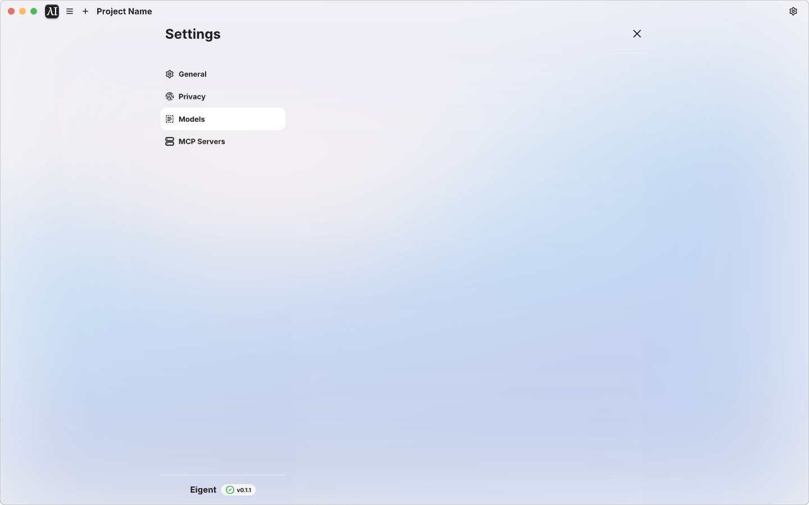
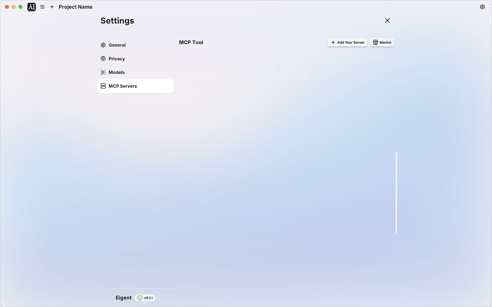
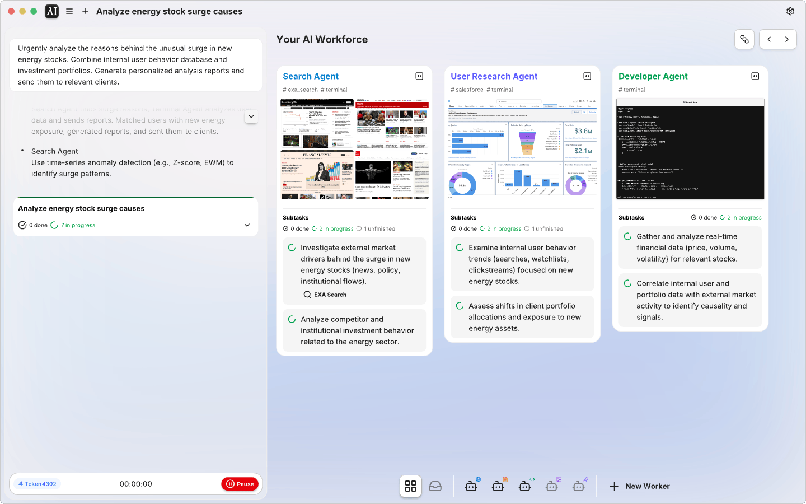
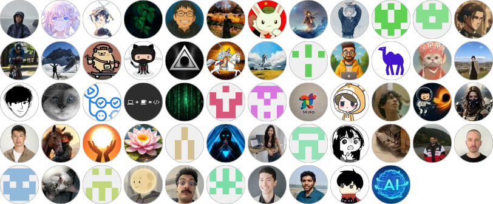

<div align="center"><a name="readme-top"></a>

[![][image-head]][eigent-site]

[![][image-seperator]][eigent-site]

### Eigent: 开源协同办公桌面，释放卓越生产力

<!-- SHIELD GROUP -->

[![][download-shield]][eigent-download]
[![][github-star]][eigent-github]
[![][social-x-shield]][social-x-link]
[![][discord-image]][discord-url]<br>
[![Reddit][reddit-image]][reddit-url]
[![Wechat][wechat-image]][wechat-url]
[![][sponsor-shield]][sponsor-link]
[![][built-with-camel]][camel-github]
[![][join-us-image]][join-us]

</div>

<hr/>
<div align="center">

**English** · [Português](./README_PT-BR.md) · [简体中文](./README.zh-CN.md) · [日本語](./README_JA.md) · [官方网站][eigent-site] · [文档][docs-site] · [反馈][github-issue-link]

</div>
<br/>

**Eigent** 是开源协同办公桌面应用，让你能够构建、管理和部署自定义 AI 团队，将最复杂的工作流转化为自动化任务。作为领先的开源协同办公产品，Eigent 融合了开源协作与 AI 驱动自动化的最佳实践。

基于 [CAMEL-AI][camel-site] 广受赞誉的开源项目构建，我们的系统引入了**多代理团队**，通过并行执行、定制化和隐私保护来**提升生产力**。

### ⭐ 100% 开源 - 🥇 本地部署 - 🏆 MCP 集成

- ✅ **零配置** - 无需技术配置
- ✅ **多代理协调** - 处理复杂的多代理工作流
- ✅ **企业级功能** - SSO/访问控制
- ✅ **本地部署**
- ✅ **开源**
- ✅ **自定义模型支持**
- ✅ **MCP 集成**

<br/>

[![][image-join-us]][join-us]

<details>
<summary><kbd>目录</kbd></summary>

#### TOC

- [🚀 开源协同办公快速入门](#-getting-started-with-open-source-Cowork)
  - [🏠 本地部署（推荐）](#-local-deployment-recommended)
  - [⚡ 快速开始（云端连接）](#-quick-start-cloud-connected)
  - [🏢 企业版](#-enterprise)
  - [☁️ 云版本](#%EF%B8%8F-cloud-version)
- [✨ 核心特性 - 开源协同办公](#-key-features---open-source-Cowork)
  - [🏭 团队](#-workforce)
  - [🧠 全面的模型支持](#-comprehensive-model-support)
  - [🔌 MCP 工具集成](#-mcp-tools-integration-mcp)
  - [✋ 人在环中](#-human-in-the-loop)
  - [👐 100% 开源](#-100-open-source)
- [🧩 使用场景 - 开源协同办公](#-use-cases---open-source-Cowork)
- [🛠️ 技术栈](#-tech-stack)
  - [后端](#backend)
  - [前端](#frontend)
- [🌟 保持领先 - 开源协同办公](#-staying-ahead---open-source-Cowork)
- [🗺️ 路线图 - 开源协同办公](#%EF%B8%8F-roadmap---open-source-Cowork)
- [📖 贡献](#-contributing)
  - [主要贡献者](#main-contributors)
  - [杰出大使](#distinguished-ambassador)
- [生态系统](#ecosystem)
- [📄 开源许可证](#-open-source-license)
- [🌐 社区与联系](#-community--contact)

####

<br/>

</details>

## **🚀 开源协同办公快速入门**

> **🔓 公开构建** — Eigent 从第一天起就是 **100% 开源**的。每个功能、每次提交、每个决策都是透明的。我们相信最好的 AI 工具应该与社区公开构建，而不是闭门造车。

### 🏠 本地部署（推荐）

运行 Eigent 的推荐方式 — 完全独立运行，完全控制你的数据，无需云账户。

👉 **[完整本地部署指南](./server/README_EN.md)**

此设置包括：

- 带有完整 API 的本地后端服务器
- 本地模型集成（vLLM、Ollama、LM Studio 等）
- 与云服务完全隔离
- 零外部依赖

### ⚡ 快速开始（云端连接）

使用我们的云端后端进行快速预览 — 几秒钟即可开始：

#### 前提条件

- Node.js（18-22 版本）和 npm

#### 步骤

```bash
git clone https://github.com/eigent-ai/eigent.git
cd eigent
npm install
npm run dev
```

> 注意：此模式连接到 Eigent 云服务，需要注册账户。如需完全独立的体验，请改用[本地部署](#-local-deployment-recommended)。

#### 更新依赖

拉取新代码（`git pull`）后，更新前端和后端依赖：

```bash
# 1. 更新前端依赖（在项目根目录）
npm install

# 2. 更新后端/Python 依赖（在后端目录）
cd backend
uv sync
```

### 🏢 企业版

适用于需要最高安全性、定制化和控制权的组织：

- **专属功能**（如 SSO 和定制开发）
- **可扩展的企业部署**
- **协商 SLA** 和实施服务

📧 详情请联系 [info@eigent.ai](mailto:info@eigent.ai)。

### ☁️ 云版本

对于偏好托管基础设施的团队，我们还提供云平台。这是体验 Eigent 多代理 AI 能力的最快方式，无需复杂的设置。我们将托管模型、API 和云存储，确保 Eigent 完美运行。

- **即时访问** - 几分钟内开始构建多代理工作流。
- **托管基础设施** - 我们负责扩展、更新和维护。
- **高级支持** - 订阅并获取工程团队的优先协助。

<br/>

[![image-public-beta]][eigent-download]

<div align="right">
<a href="https://www.eigent.ai/download">在 Eigent.ai 开始使用 →</a>
</div>

## **✨ 核心特性 - 开源协同办公**

通过 Eigent 开源协同办公的强大功能释放卓越生产力的全部潜力 — 专为无缝集成、更智能的任务执行和无限自动化而构建。

### 🏭 团队

采用一组专门的 AI 代理协同解决复杂任务。Eigent 的开源协同办公动态分解任务并激活多个代理**并行**工作。

Eigent 预定义了以下代理工作者：

- **开发者代理：** 编写和执行代码，运行终端命令。
- **浏览器代理：** 搜索网页并提取内容。
- **文档代理：** 创建和管理文档。
- **多模态代理：** 处理图像和音频。


<br/>

### 🧠 全面的模型支持

使用你偏好的模型在本地部署 Eigent 开源协同办公桌面。



<br/>

### 🔌 MCP 工具集成

Eigent 内置大量 **Model Context Protocol (MCP)** 工具（用于网页浏览、代码执行、Notion、Google 套件、Slack 等），并允许你**安装自己的工具**。为代理配备适合你场景的精确工具 — 甚至集成内部 API 或自定义函数 — 以增强其能力。



<br/>

### ✋ 人在环中

如果任务遇到困难或遇到不确定性，Eigent 会自动请求人工输入。



<br/>

### 👐 100% 开源

Eigent 完全开源。你可以下载、检查和修改代码，确保透明度并培育社区驱动的多代理创新生态系统。

![Opensource][image-opensource]

<br/>

## 🧩 使用场景 - 开源协同办公

探索全球开发者如何利用 Eigent 的开源协同办公能力自动化复杂工作流，在各行各业提升生产力。

### 1. 棕榈泉网球之旅行程规划与 Slack 摘要 [回放 ▶️](https://www.eigent.ai/download?share_token=IjE3NTM0MzUxNTEzMzctNzExMyI.aIeysw.MUeG6ZcBxI1GqvPDvn4dcv-CDWw__1753435151337-7113)

<details>
<summary><strong>提示词：</strong> <kbd>我们是两个网球迷，想去看网球锦标赛 ... <kbd></summary>
<br>
我们是两位网球迷，想在 2026 年去棕榈泉观看网球锦标赛。我住在旧金山，请围绕半决赛/决赛举行期间，为我们准备一份详细的 3 天行程安排，包括航班、酒店和可做的事情。我们喜欢徒步、纯素食和水疗。预算是 5000 美元。行程应以详细时间线形式呈现，包含时间、活动、费用、其他细节，以及适用时用于购票/预约等的链接。其他偏好：如果能有水疗服务更好，但不是必须。完成此任务后，请生成一份关于这次旅行的 HTML 报告；撰写该计划的摘要，并将文字摘要和报告 HTML 链接发送到 Slack 的 `#tennis-trip-sf` 频道。
</details>

<br>

### 2. 从 CSV 银行数据生成 Q2 报告 [回放 ▶️](https://www.eigent.ai/download?share_token=IjE3NTM1MjY4OTE4MDgtODczOSI.aIjJmQ.WTdoX9mATwrcBr_w53BmGEHPo8U__1753526891808-8739)

<details>
<summary><strong>提示词：</strong> <kbd>请根据我的银行转账记录帮我准备 Q2 财务报表 ... <kbd></summary>
<br>
请根据我桌面上的银行转账记录文件 `bank_transacation.csv`，帮我准备一份 Q2 财务报表，并生成一份带图表的 HTML 报告，向投资人展示我们的支出情况。
</details>

<br>

### 3. 英国医疗保健市场研究报告自动化 [回放 ▶️](https://www.eigent.ai/download?share_token=IjE3NTMzOTM1NTg3OTctODcwNyI.aIey-Q.Jh9QXzYrRYarY0kz_qsgoj3ewX0__1753393558797-8707)

<details>
<summary><strong>提示词：</strong> <kbd>分析英国医疗保健行业以支持我下一家公司的规划 ... <kbd></summary>
<br>
分析英国医疗保健行业，以支持我下一家公司的规划。请提供全面的市场概览，包括当前趋势、增长预测和相关法规。识别市场中 5 到 10 个主要机会、空白点或服务不足的细分领域。将所有发现整理成一份结构清晰、专业的 HTML 报告。任务完成后，请向 Slack 的 `#eigentr-product-test` 频道发送一条消息，以便我与队友对齐报告内容。
</details>

<br>

### 4. 德国电动滑板市场可行性分析 [回放 ▶️](https://www.eigent.ai/download?share_token=IjE3NTM2NTI4MjY3ODctNjk2Ig.aIjGiA.t-qIXxk_BZ4ENqa-yVIm0wMVyXU__1753652826787-696)

<details>
<summary><strong>提示词：</strong> <kbd>我们是一家生产高端电动滑板的公司 ... <kbd></summary>
<br>
我们是一家生产高端电动滑板的公司，正在考虑进入德国市场。请为我准备一份详细的市场进入可行性报告。报告需要涵盖以下方面：
1. 市场规模与法规：研究德国个人轻型电动车（PLEV）的市场规模、年增长率、主要参与者和市场份额。同时，详细拆解并总结德国关于电动滑板在公共道路上使用的法律法规，包括认证要求（如 ABE 认证）和保险政策。
2. 消费者画像：分析潜在德国消费者的画像，包括年龄、收入水平、主要使用场景（通勤、娱乐）、关键购买决策驱动因素（价格、性能、品牌、设计），以及他们通常使用哪些渠道获取信息（论坛、社交媒体、线下零售店）。
3. 渠道与分销：调查德国主流线上电子产品销售平台（如 Amazon.de、MediaMarkt.de）以及高端体育用品线下零售连锁。列出排名前 5 的潜在线上和线下分销合作伙伴，并尽可能找到其采购部门的联系方式。
4. 成本与定价：基于我桌面上 `Product_Cost.csv` 文件中的产品成本结构，并考虑德国关税、增值税（VAT）、物流与仓储成本以及潜在营销费用，估算建议零售价（MSRP），并分析其在市场中的竞争力。
5. 综合报告与展示：将所有研究结果汇总成一个 HTML 报告文件。内容应包括数据图表、关键发现以及最终的市场进入策略建议（推荐 / 不推荐 / 有条件推荐）。
</details>

<br>

### 5. 团队多代理产品发布的 SEO 审计 [回放 ▶️](https://www.eigent.ai/download?share_token=IjE3NTM2OTk5NzExNDQtNTY5NiI.aIex0w.jc_NIPmfIf9e3zGt-oG9fbMi3K4__1753699971144-5696)

<details>
<summary><strong>提示词：</strong> <kbd>为支持我们新 Workforce Multiagent 产品的发布 ... <kbd></summary>
<br>
为支持我们新推出的 Workforce Multiagent 产品，请对我们的官方网站（https://www.camel-ai.org/）进行一次全面的 SEO 审计，并交付一份包含可执行优化建议的详细报告。
</details>

<br>

### 6. 识别下载文件夹中的重复文件 [回放 ▶️](https://www.eigent.ai/download?share_token=IjE3NTM3NjAzODgxNzEtMjQ4Ig.aIhKLQ.epOG--0Nj0o4Bqjtdqm9OZdaqRQ__1753760388171-248)

<details>
<summary><strong>提示词：</strong> <kbd>我在 Documents 目录里有一个名为 mydocs 的文件夹 ... <kbd></summary>
<br>
我在 `Documents` 目录中有一个名为 `mydocs` 的文件夹。请扫描它，并识别所有完全重复或近似重复的文件，包括内容、文件大小或格式相同的文件（即使文件名或扩展名不同）。请按相似度分组，清晰列出这些文件。
</details>

<br>

### 7. 为 PDF 添加签名 [回放 ▶️](https://www.eigent.ai/download?share_token=IjE3NTQwOTU0ODM0NTItNTY2MSI.aJCHrA.Mg5yPOFqj86H_GQvvRNditzepXc__1754095483452-5661)

<details>
<summary><strong>提示词：</strong> <kbd>请将此签名图片添加到 PDF 的签名区域 ... <kbd></summary>
<br>
请将这张签名图片添加到 PDF 中的签名区域。你可以安装 CLI 工具 `tesseract` 来帮助完成此任务（它可通过 OCR 更可靠地定位“签名区域”）。
</details>

<br>

## 🛠️ 技术栈

Eigent 开源协同办公桌面基于现代、可靠的技术构建，确保可伸缩性、性能和可扩展性。

### 后端

- **框架：** FastAPI
- **包管理器：** uv
- **异步服务器：** Uvicorn
- **认证：** OAuth 2.0, Passlib
- **多代理框架：** CAMEL

### 前端

- **框架：** React
- **桌面应用框架：** Electron
- **语言：** TypeScript
- **UI：** Tailwind CSS, Radix UI, Lucide React, Framer Motion
- **状态管理：** Zustand
- **流程编辑器：** React Flow

## 🌟 保持领先 - 开源协同办公

> [!IMPORTANT]
>
> **给 Eigent 加星**，你将及时收到 GitHub 的所有发布通知 ~ ⭐️

![][image-star-us]

## 🗺️ 路线图 - 开源协同办公

我们的开源协同办公在社区的输入下持续发展。以下是接下来的计划：

| 主题 | 详情 | Discord 频道 |
| --------------------------- | ------------------------------------------------------------------------------------------------------------------------------ | ----------------------------------------------------------- |
| **上下文工程** | - 提示词缓存<br> - 系统提示词优化<br> - 工具包文档字符串优化<br> - 上下文压缩                       | [**加入 Discord →**](https://discord.com/invite/CNcNpquyDc) |
| **多模态增强** | - 使用浏览器时更准确的图像理解<br> - 高级视频生成                                         | [**加入 Discord →**](https://discord.com/invite/CNcNpquyDc) |
| **多代理系统** | - 团队支持固定工作流<br> - 团队支持多轮对话                                              | [**加入 Discord →**](https://discord.com/invite/CNcNpquyDc) |
| **浏览器工具包** | - BrowseComp 集成<br> - 基准测试改进<br> - 禁止重复页面访问<br> - 自动点击缓存按钮 | [**加入 Discord →**](https://discord.com/invite/CNcNpquyDc) |
| **文档工具包** | - 支持动态文件编辑                                                                                                 | [**加入 Discord →**](https://discord.com/invite/CNcNpquyDc) |
| **终端工具包** | - 基准测试改进<br> - Terminal-Bench 集成                                                                       | [**加入 Discord →**](https://discord.com/invite/CNcNpquyDc) |
| **环境与 RL** | - 环境设计<br> - 数据生成<br> - RL 框架集成（VERL、TRL、OpenRLHF）                                | [**加入 Discord →**](https://discord.com/invite/CNcNpquyDc) |

## [🤝 贡献][contribution-link]

我们相信建立信任并拥抱所有形式的开源协作。你的创意贡献有助于推动 `Eigent` 的创新。探索我们的 GitHub issues 和项目，加入我们，展示你的才华 🤝❤️ [贡献指南][contribution-link]

## 贡献者

<a href="https://github.com/eigent-ai/eigent/graphs/contributors">
  
</a>

由 [contrib.rocks](https://contrib.rocks) 生成。

<br>

## [❤️ 赞助][sponsor-link]

Eigent 基于 [CAMEL-AI.org][camel-ai-org-github] 的研究和基础设施构建。[赞助 CAMEL-AI.org][sponsor-link] 将使 `Eigent` 变得更好。

## **📄 开源许可证**

本仓库基于 [Apache License 2.0](LICENSE) 许可。

## 🌐 社区与联系

更多信息请联系 info@eigent.ai

- **GitHub Issues：** 报告 bug、请求功能、跟踪开发。[提交 issue][github-issue-link]

- **Discord：** 获取实时支持、与社区聊天、保持最新动态。[加入我们](https://discord.com/invite/CNcNpquyDc)

- **X (Twitter)：** 关注获取更新、AI 洞察和重要公告。[关注我们][social-x-link]

- **微信社区：** 扫描下方二维码添加我们的微信助手，加入我们的微信社区群。

<div align="center">
  
</div>

<!-- LINK GROUP -->

<!-- Social -->

<!-- camel & eigent -->

<!-- marketing -->

<!-- feature -->

[built-with-camel]: https://img.shields.io/badge/-Built--with--CAMEL-4C19E8.svg?logo=data:image/svg+xml;base64,PHN2ZyB3aWR0aD0iMjQ4IiBoZWlnaHQ9IjI3MiIgdmlld0JveD0iMCAwIDI0OCAyNzIiIGZpbGw9Im5vbmUiIHhtbG5zPSJodHRwOi8vd3d3LnczLm9yZy8yMDAwL3N2ZyI+CjxwYXRoIGQ9Ik04LjgzMTE3IDE4LjU4NjVMMCAzMC44MjY3QzUuNDY2OTIgMzUuMDQzMiAxNS4xMzkxIDM4LjgyNTggMjQuODExNCAzNi4yOTU5QzMwLjY5ODggNDAuOTM0MSAzOS42NzAyIDQwLjIzMTMgNDQuMTU1OSA0MC4wOTA4QzQzLjQ1NSA0Ny4zOTk0IDQyLjQ3MzcgNzAuOTU1OCA0NC4xNTU5IDEwNi43MTJDNDUuODM4IDE0Mi40NjggNzEuNzcwOCAxNjYuODY4IDg0LjUyNjkgMTc0LjU5OEw3Ni4wMDAyIDIyMEw4NC41MjY5IDI3MkgxMDguOTE4TDk4LjAwMDIgMjIwTDEwOC45MTggMTc0LjU5OEwxMjkuOTQ0IDI3MkgxNTQuNzU2TDEzNC4xNSAxNzQuNTk4SDE4Ny4xMzdMMTY2LjUzMSAyNzJIMTkxLjc2M0wyMTIuMzY5IDE3NC41OThMMjI2IDIyMEwyMTIuMzY5IDI3MkgyMzcuNjAxTDI0OC4wMDEgMjIwTDIzNy4xOCAxNzQuNTk4QzIzOS4yODMgMTY5LjExNyAyNDAuNDAxIDE2Ni45NzYgMjQxLjgwNiAxNjEuMTA1QzI0OS4zNzUgMTI5LjQ4MSAyMzUuMDc3IDEwMy45MDEgMjI2LjY2NyA5NC40ODRMMjA2LjQ4MSA3My44MjNDMTk3LjY1IDY0Ljk2ODMgMTgyLjUxMSA2NC41NDY3IDE3Mi44MzkgNzIuNTU4MUMxNjUuNzI4IDc4LjQ0NzcgMTYxLjcwMSA3OC43NzI3IDE1NC43NTYgNzIuNTU4MUMxNTEuODEyIDcwLjAyODEgMTQ0LjUzNSA2MS40ODg5IDEzNC45OTEgNTMuNTgzN0MxMjUuMzE5IDQ1LjU3MjMgMTA4LjQ5NyA0OC45NDU1IDEwMi4xODkgNTUuNjkxOUw3My41OTMxIDg0LjM2NDRWNy42MjM0OUw3OS4xMjczIDBDNjAuOTA0MiAzLjY1NDMzIDIzLjgwMjEgOS41NjMwOSAxOS43NjUgMTAuNTc1MUMxNS43Mjc5IDExLjU4NyAxMC43OTM3IDE2LjMzNzcgOC44MzExNyAxOC41ODY1WiIgZmlsbD0id2hpdGUiLz4KPHBhdGggZD0iTTQzLjIwMzggMTguNzE4N0w0OS4wOTEyIDEzLjA0OTNMNTQuOTc4NyAxOC43MTg3TDQ5LjA5MTIgMjQuODI0Mkw0My4yMDM4IDE4LjcxODdaIiBmaWxsPSIjNEMxOUU4Ii8+Cjwvc3ZnPgo=
[camel-ai-org-github]: assets/001-camel-ai-f3e565ddc5.html
[camel-github]: assets/002-camel-dc298a351e.html
[camel-site]: assets/003-asset-28a6014262.html
[contribution-link]: assets/004-contributing-0ed27420ac.md
[discord-image]: https://img.shields.io/discord/1082486657678311454?logo=discord&labelColor=%20%235462eb&logoColor=%20%23f5f5f5&color=%20%235462eb
[discord-url]: assets/005-cncnpquydc-fa1070c2e6.html
[docs-site]: assets/006-asset-d7bc82e285.html
[download-shield]: https://img.shields.io/badge/Download%20Eigent-363AF5?style=plastic
[eigent-download]: assets/007-download-1ee241f2b5.html
[eigent-github]: assets/008-eigent-b3f0f3bd7c.html
[eigent-site]: assets/009-asset-a38f161aa9.html
[github-issue-link]: assets/010-issues-76fb88c801.html
[github-star]: https://img.shields.io/github/stars/eigent-ai?color=F5F4F0&labelColor=gray&style=plastic&logo=github
[image-head]: assets/011-head-634bc2f885.png
[image-join-us]: assets/012-join-us-20159c9a1f.png
[image-opensource]: assets/013-opensource-53f4ffea99.png
[image-public-beta]: assets/014-banner-718742f084.png
[image-seperator]: assets/015-seperator-c38770e85a.png
[image-star-us]: assets/016-star-us-ca68fd011d.gif
[join-us]: assets/017-eigent-ai-careers-c20688b132.html
[join-us-image]: https://img.shields.io/badge/Join%20Us-yellow?style=plastic
[reddit-image]: https://img.shields.io/reddit/subreddit-subscribers/CamelAI?style=plastic&logo=reddit&label=r%2FCAMEL&labelColor=white
[reddit-url]: https://www.reddit.com/r/CamelAI/
[social-x-link]: assets/018-eigent-ai-91d7389011.html
[social-x-shield]: https://img.shields.io/badge/-%40Eigent_AI-white?labelColor=gray&logo=x&logoColor=white&style=plastic
[sponsor-link]: assets/019-camel-ai-477e45a10b.html
[sponsor-shield]: https://img.shields.io/badge/-Sponsor%20CAMEL--AI-1d1d1d?logo=github&logoColor=white&style=plastic
[wechat-image]: https://img.shields.io/badge/WeChat-CamelAIOrg-brightgreen?logo=wechat&logoColor=white
[wechat-url]: assets/020-wechat-6f4040e9d0.png
