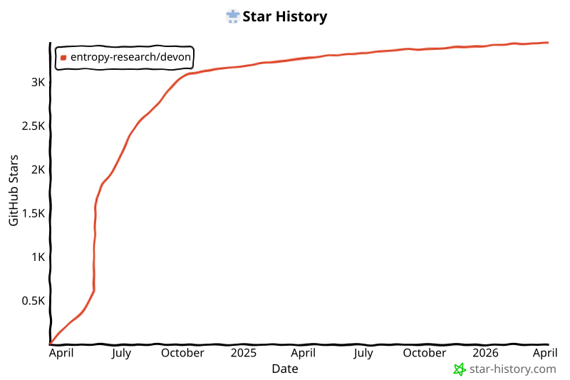

<!-- PROJECT LOGO -->
<div align="center">
  <h1 align="center">Devon：一个开源结对程序员</h1>
</div>
<div align="center">
  <a href="https://github.com/entropy-research/Devon/graphs/contributors"></a>
  <a href="https://github.com/entropy-research/Devon/network/members"></a>
  <a href="https://github.com/entropy-research/Devon/stargazers"></a>
  <a href="https://github.com/entropy-research/Devon/issues"></a>
  <br/>
  <a href="https://github.com/entropy-research/Devon/blob/main/LICENSE"></a>
  <a href="https://discord.gg/p5YpZ5vjd9"></a>
  <br/>

https://github.com/entropy-research/Devon/assets/61808204/f3197a56-3d6d-479f-bc0e-9cffe69f159b
</div>

### 你们怎么发布得这么快？
<a href="https://discord.gg/p5YpZ5vjd9"></a> 
← 这个仓库有一个 __**社区驱动的开发团队**__。欢迎加入，真的很棒。
  
# 安装

## 前提条件

1. `node.js` 和 `npm`
2. `pipx`，如果没有安装，请前往 [这里](https://pipx.pypa.io/stable/installation/)
3. API 密钥 <samp>（只需其中一个即可）</samp>
   - [**Anthropic**](https://console.anthropic.com/settings/keys)
    - [**OpenAI**](https://platform.openai.com/api-keys)

> 我们正在开发 Windows 支持！（如果你能帮忙，请告诉我们）

## 安装命令

使用 `pipx` + `npm` 安装：

```bash
# 步骤 1：确保 pipx 存储应用的目录在你的 PATH 环境变量中
pipx ensurepath

# 步骤 2：安装后端
pipx install devon_agent

# 步骤 3：安装并运行主 UI
npx devon-ui
```

> 如果你已经安装了 devon_agent，可以通过以下命令更新：
> ```pipx install --force devon_agent```

### 就这样！祝构建愉快 :)

# 运行代理

然后要*运行*主 UI，命令是：
```bash
npx devon-ui
```

就这么简单。

# 终端 UI
> 如果你想使用终端界面，请按以下步骤操作：
### 安装
1. 确保已安装后端
```bash
# 安装后端
pipx install devon_agent
```
2. 安装 TUI
```bash
# 安装 TUI
npm install -g devon-tui
```
> [!NOTE]
> 如果你已经安装了 devon-tui，可以通过以下命令更新：
```bash
npm uninstall -g devon-tui
npm install -g devon-tui
```

### 运行

1. 导航到你的项目文件夹并打开终端。
2. 将你的 Anthropic API 或 OpenAI API 密钥设置为环境变量：

```bash
export ANTHROPIC_API_KEY=sk-xxxxxxxxxxxxxxxxxxxxxxxxxxxxxxxxxxxxxxxx

#或

export OPENAI_API_KEY=sk-xxxxxxxxxxxxxxxxxxxxxxxxxxxxxxxxxxxxxxxx

#或

export GROQ_API_KEY=sk-xxxxxxxxxxxxxxxxxxxxxxxxxxxxxxxxxxxxxxxx
```

3. 然后要*运行*终端 UI，命令是：
```bash
devon-tui
```

就这么简单。

> [!NOTE]
> 不用担心，代理只能访问你启动它时所在目录中的文件和文件夹。你还可以在代理执行操作时对其进行纠正。

---

要以 *调试* 模式运行，命令是：
```bash
devon-tui --debug
```

---

要以 *本地* 模式运行：
> [!WARNING]
> 当前版本的本地模型支持尚不成熟，请谨慎使用，预计性能相比其他选项会显著下降。

1. 使用 [ollama](https://ollama.com/library/deepseek-coder:6.7b) 运行 deepseek

2. 通过运行以下命令启动本地 ollama 服务器
```
ollama run deepseek-coder:6.7b
```

4. 然后配置 devon 使用该模型
```bash
devon-tui configure

Configuring Devon CLI...
? Select the model name: 
  claude-opus 
  gpt4-o 
  llama-3-70b 
❯ ollama/deepseek-coder:6.7b
```

4. 最后，运行：
```
devon-tui --api_key=FOSS
```

---

查看所有可用命令：
```bash
devon-tui --help
```

# 功能特性
- 多文件编辑
- 代码库探索
- 配置编写
- 测试编写
- Bug 修复
- 架构探索
- 本地模型支持

### 局限性
- 对非 Python 语言的功能支持有限
- 有时需要手动指定要修改的文件
- 本地模式目前效果不佳，建议尽量避免使用

# 进展

### 这个项目仍处于非常早期的阶段，<ins>我们非常需要你的帮助</ins>来让它变得更好！

### 当前目标
- 多模型支持
  - [x] Claude 3.5 Sonnet
  - [x] GPT4-o
  - [x] Groq llama3-70b
  - [x] Ollama deepseek-6.7b
  - [ ] Google Gemini 1.5 Pro
- 启动面向工具和代理构建者的插件系统
- 改进我们可自托管的 Electron 应用
- 在 [SWE-bench Lite](https://www.swebench.com/lite.html) 上取得 SOTA

> 查看我们关于下一步计划的最新想法[**这里**](https://docs.google.com/document/d/e/2PACX-1vTjLCQcWE_n-uUHFhtBkxTCIJ4FFe5ftY_E4_q69SjXhuEZv_CYpLaQDh3HqrJlAxsgikUx0sTzf9le/pub)

### Star 历史
<p align="center">
  <a href="https://star-history.com/#entropy-research/Devon&Date">
    
  </a>
</p>

### 过往里程碑

- [x] **2024 年 6 月 28 日** - 文件和代码引用、改进可控性、Claude Sonnet 支持 v0.0.16
- [x] **2024 年 6 月 14 日** - 发布 Electron UI v0.0.13
- [x] **2024 年 6 月 1 日** - Devon V2 Beta Electron UI
- [x] **2024 年 5 月 19 日** - GPT4o 支持 + 更好的界面支持 v0.1.7
- [x] **2024 年 5 月 12 日** - 完成交互式代理 v0.1.0
- [x] **2024 年 5 月 10 日** - 添加可控性特性
- [x] **2024 年 5 月 8 日** - 在 SWE-Bench Lite 上超越 AutoCodeRover
- [x] **2024 年 4 月中旬** - 添加仓库级代码搜索工具
- [x] **2024 年 4 月 2 日** - 开始开发 v0.1.0 交互式代理
- [x] **2024 年 3 月 17 日** - 发布非交互式代理 v0.0.1

> [!NOTE]
> 如果你已经安装了 TUI，请执行干净的重装：
```bash
npm uninstall -g devon-tui
npm install -g devon-tui
```

## 当前开发优先级

1. 改进上下文收集和代码索引能力，例如：
    - 添加记忆模块
    - 改进代码索引
2. 添加替代模型和代理，以：
    - a) 降低终端用户成本
    - b) 降低终端用户延迟
3. Electron 应用
    - 保存和加载项目概览，用于代理上下文
    - 回退和"步退"时间线界面
    - 更好的代码差异视图
    - 将用户文件事件/变更发送给 Devon

# 如何贡献？

Devon 和 entropy-research 组织是社区驱动的，我们欢迎所有人的贡献！
从解决问题到构建功能再到创建数据集，有很多参与方式：

- **核心功能：** 帮助我们开发核心代理、用户体验、工具集成、插件等。
- **研究：** 帮助我们研究代理性能（包括基准测试！）、构建数据管道和微调模型。
- **反馈和测试：** 使用 Devon、报告 bug、建议功能或提供可用性反馈。

详情请查看 [CONTRIBUTING.md](./CONTRIBUTING.md)。

如果你想为项目做贡献，请加入 Discord：[Discord](https://discord.gg/p5YpZ5vjd9)

# 反馈

我们非常期待你的反馈！欢迎在我们的 [Discord](https://discord.gg/p5YpZ5vjd9) #feedback 频道留言，或者[创建 issue](https://github.com/entropy-research/Devon/issues)！

我们收集基本的事件类型（即"工具调用"）和失败遥测数据来修复 bug 和改善用户体验，如果你想联系我们，我们很乐意听取你的意见！

要禁用遥测，请将环境变量 `DEVON_TELEMETRY_DISABLED` 设置为 `true`：
```bash
export DEVON_TELEMETRY_DISABLED=true
```

# 社区

加入我们的 Discord 服务器打个招呼吧！
[Discord](https://discord.gg/p5YpZ5vjd9)

# 许可证

根据 AGPL 许可证分发。更多信息请参见 [`LICENSE`](./LICENSE)。
