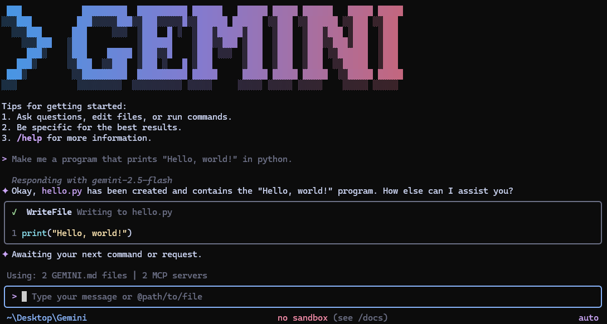

# Gemini CLI

[](https://github.com/google-gemini/gemini-cli/actions/workflows/ci.yml)
[](https://github.com/google-gemini/gemini-cli/actions/workflows/chained_e2e.yml)
[](https://www.npmjs.com/package/@google/gemini-cli)
[](https://github.com/google-gemini/gemini-cli/blob/main/LICENSE)
[](https://codewiki.google/github.com/google-gemini/gemini-cli?utm_source=badge&utm_medium=github&utm_campaign=github.com/google-gemini/gemini-cli)



Gemini CLI 是一个开源 AI 代理，将 Gemini 的强大能力直接带入你的终端。它提供了对 Gemini 的轻量级访问，让你从提示词到模型之间获得最直接的路径。

欢迎阅读我们的[文档](https://geminicli.com/docs/)，全面了解 Gemini CLI。

## 🚀 为什么选择 Gemini CLI？

- **免费额度**：使用个人 Google 账号可享受每分钟 60 次请求、每天 1,000 次请求。
- **强大的 Gemini 3 模型**：访问增强的推理能力和 100 万 token 上下文窗口。
- **内置工具**：Google Search grounding、文件操作、Shell 命令、网页抓取。
- **可扩展**：支持 MCP (Model Context Protocol) 以实现自定义集成。
- **终端优先**：专为在命令行中工作的开发者设计。
- **开源**：采用 Apache 2.0 许可证。

## 📦 安装

请参阅 [Gemini CLI 安装、执行和发布](https://www.geminicli.com/docs/get-started/installation)了解推荐系统配置和详细安装指南。

### 快速安装

#### 使用 npx 直接运行

```bash
# 使用 npx（无需安装）
npx @google/gemini-cli
```

#### 使用 npm 全局安装

```bash
npm install -g @google/gemini-cli
```

#### 使用 Homebrew 全局安装 (macOS/Linux)

```bash
brew install gemini-cli
```

#### 使用 MacPorts 全局安装 (macOS)

```bash
sudo port install gemini-cli
```

#### 使用 Anaconda 安装（适用于受限环境）

```bash
# 创建并激活新环境
conda create -y -n gemini_env -c conda-forge nodejs
conda activate gemini_env

# 在环境中通过 npm 全局安装 Gemini CLI
npm install -g @google/gemini-cli
```

## 发布渠道

详情请参阅[发布说明](https://www.geminicli.com/docs/changelogs)。

### 预览版

每周二 UTC 23:59 将发布新的预览版。这些版本未经充分验证，可能包含回归问题或其他待解决的问题。欢迎帮助我们测试，使用 `preview` 标签安装。

```bash
npm install -g @google/gemini-cli@preview
```

### 稳定版

- 每周二 UTC 20:00 将发布新的稳定版，这是上周 `preview` 版本的完整升级加上所有错误修复和验证。使用 `latest` 标签。

```bash
npm install -g @google/gemini-cli@latest
```

### 每日构建版

- 每天 UTC 00:00 将发布新版本，包含发布时主分支上的所有变更。请假定其中存在待验证和待修复的问题。使用 `nightly` 标签。

```bash
npm install -g @google/gemini-cli@nightly
```

## 📋 核心功能

### 代码理解与生成

- 查询和编辑大型代码库
- 利用多模态能力从 PDF、图片或草图生成新应用
- 使用自然语言调试问题和排查故障

### 自动化与集成

- 自动化运维任务，如查询 pull request 或处理复杂的变基操作
- 使用 MCP 服务器连接新功能，包括[使用 Imagen、Veo 或 Lyria 进行媒体生成](https://github.com/GoogleCloudPlatform/vertex-ai-creative-studio/tree/main/experiments/mcp-genmedia)
- 在脚本中以非交互模式运行，实现工作流自动化

### 高级功能

- 使用内置 [Google Search](https://ai.google.dev/gemini-api/docs/grounding) 为查询提供实时信息锚定
- 对话检查点功能，可保存和恢复复杂会话
- 自定义上下文文件 (GEMINI.md) 为项目定制行为

### GitHub 集成

通过 [**Gemini CLI GitHub Action**](https://github.com/google-github-actions/run-gemini-cli) 将 Gemini CLI 直接集成到你的 GitHub 工作流中：

- **Pull Request 审查**：带有上下文反馈和建议的自动化代码审查
- **Issue 分类**：基于内容分析自动为 GitHub issue 添加标签和确定优先级
- **按需协助**：在 issue 和 pull request 中提及 `@gemini-cli` 即可获得调试、解释或任务委派方面的帮助
- **自定义工作流**：构建满足团队需求的自动化、定时和按需工作流

## 🔐 认证选项

选择最适合你需求的认证方式：

### 方式 1：使用 Google 登录（使用 Google 账号进行 OAuth 登录）

**✨ 最适合：** 个人开发者以及拥有 Gemini Code Assist 许可证的用户。（详情请参阅[配额限制和服务条款](https://cloud.google.com/gemini/docs/quotas)）

**优势：**

- **免费额度**：每分钟 60 次请求、每天 1,000 次请求
- **Gemini 3 模型**，配备 100 万 token 上下文窗口
- **无需管理 API 密钥** - 只需使用 Google 账号登录即可
- **自动更新**到最新模型

#### 启动 Gemini CLI，然后选择 _使用 Google 登录_，并在提示时按照浏览器中的身份验证流程操作

```bash
gemini
```

#### 如果你使用的是组织提供的付费 Code Assist 许可证，请记得设置 Google Cloud 项目

```bash
# 设置你的 Google Cloud 项目
export GOOGLE_CLOUD_PROJECT="YOUR_PROJECT_ID"
gemini
```

### 方式 2：Gemini API 密钥

**✨ 最适合：** 需要特定模型控制或付费额度访问的开发者

**优势：**

- **免费额度**：使用 Gemini 3（flash 和 pro 混合）每天 1,000 次请求
- **模型选择**：选择特定的 Gemini 模型
- **按用量计费**：需要时升级以获取更高的使用限制

```bash
# 从 https://aistudio.google.com/apikey 获取你的密钥
export GEMINI_API_KEY="YOUR_API_KEY"
gemini
```

### 方式 3：Vertex AI

**✨ 最适合：** 企业团队和生产工作负载

**优势：**

- **企业功能**：高级安全性和合规性
- **可扩展**：配合计费账号获得更高速率限制
- **集成**：与现有 Google Cloud 基础设施配合使用

```bash
# 从 Google Cloud Console 获取你的密钥
export GOOGLE_API_KEY="YOUR_API_KEY"
export GOOGLE_GENAI_USE_VERTEXAI=true
gemini
```

关于 Google Workspace 账号和其他认证方式，请参阅[认证指南](https://www.geminicli.com/docs/get-started/authentication)。

## 🚀 快速开始

### 基本使用

#### 在当前目录启动

```bash
gemini
```

#### 包含多个目录

```bash
gemini --include-directories ../lib,../docs
```

#### 使用特定模型

```bash
gemini -m gemini-2.5-flash
```

#### 用于脚本的非交互模式

获取简单的文本响应：

```bash
gemini -p "Explain the architecture of this codebase"
```

对于更高级的脚本编写，包括如何解析 JSON 和处理错误，请使用 `--output-format json` 标志获取结构化输出：

```bash
gemini -p "Explain the architecture of this codebase" --output-format json
```

对于实时事件流（适用于监控长时间运行的操作），请使用 `--output-format stream-json` 获取换行分隔的 JSON 事件：

```bash
gemini -p "Run tests and deploy" --output-format stream-json
```

### 快速示例

#### 启动新项目

```bash
cd new-project/
gemini
> Write me a Discord bot that answers questions using a FAQ.md file I will provide
```

#### 分析现有代码

```bash
git clone https://github.com/google-gemini/gemini-cli
cd gemini-cli
gemini
> Give me a summary of all of the changes that went in yesterday
```

## 📚 文档

### 入门

- [**快速入门指南**](https://www.geminicli.com/docs/get-started) - 快速上手。
- [**认证配置**](https://www.geminicli.com/docs/get-started/authentication) - 详细的认证配置说明。
- [**配置指南**](https://www.geminicli.com/docs/reference/configuration) - 设置和自定义。
- [**键盘快捷键**](https://www.geminicli.com/docs/reference/keyboard-shortcuts) - 提高效率的技巧。

### 核心功能

- [**命令参考**](https://www.geminicli.com/docs/reference/commands) - 所有斜杠命令（`/help`、`/chat` 等）。
- [**自定义命令**](https://www.geminicli.com/docs/cli/custom-commands) - 创建你自己的可复用命令。
- [**上下文文件 (GEMINI.md)**](https://www.geminicli.com/docs/cli/gemini-md) - 为 Gemini CLI 提供持久化上下文。
- [**检查点**](https://www.geminicli.com/docs/cli/checkpointing) - 保存和恢复对话。
- [**Token 缓存**](https://www.geminicli.com/docs/cli/token-caching) - 优化 token 用量。

### 工具与扩展

- [**内置工具概览**](https://www.geminicli.com/docs/reference/tools)
  - [文件系统操作](https://www.geminicli.com/docs/tools/file-system)
  - [Shell 命令](https://www.geminicli.com/docs/tools/shell)
  - [网页抓取与搜索](https://www.geminicli.com/docs/tools/web-fetch)
- [**MCP 服务器集成**](https://www.geminicli.com/docs/tools/mcp-server) - 使用自定义工具扩展。
- [**自定义扩展**](https://geminicli.com/docs/extensions/writing-extensions) - 构建和分享你自己的命令。

### 高级主题

- [**无头模式（脚本编写）**](https://www.geminicli.com/docs/cli/headless) - 在自动化工作流中使用 Gemini CLI。
- [**IDE 集成**](https://www.geminicli.com/docs/ide-integration) - VS Code 配套。
- [**沙箱与安全**](https://www.geminicli.com/docs/cli/sandbox) - 安全的执行环境。
- [**受信任文件夹**](https://www.geminicli.com/docs/cli/trusted-folders) - 按文件夹控制执行策略。
- [**企业指南**](https://www.geminicli.com/docs/cli/enterprise) - 在企业环境中部署和管理。
- [**遥测与监控**](https://www.geminicli.com/docs/cli/telemetry) - 使用量跟踪。
- [**工具参考**](https://www.geminicli.com/docs/reference/tools) - 内置工具概览。
- [**本地开发**](https://www.geminicli.com/docs/local-development) - 本地开发工具。

### 故障排除与支持

- [**故障排除指南**](https://www.geminicli.com/docs/resources/troubleshooting) - 常见问题与解决方案。
- [**常见问题**](https://www.geminicli.com/docs/resources/faq) - 常见问题解答。
- 使用 `/bug` 命令直接从 CLI 报告问题。

### 使用 MCP 服务器

在 `~/.gemini/settings.json` 中配置 MCP 服务器，用自定义工具扩展 Gemini CLI：

```text
> @github List my open pull requests
> @slack Send a summary of today's commits to #dev channel
> @database Run a query to find inactive users
```

设置说明请参阅 [MCP 服务器集成指南](https://www.geminicli.com/docs/tools/mcp-server)。

## 🤝 贡献

欢迎贡献！Gemini CLI 完全开源（Apache 2.0），我们鼓励社区：

- 报告错误并提出功能建议。
- 改进文档。
- 提交代码改进。
- 分享你的 MCP 服务器和扩展。

请参阅我们的[贡献指南](./CONTRIBUTING.md)了解开发环境设置、编码规范以及如何提交 pull request。

请查看我们的[官方路线图](https://github.com/orgs/google-gemini/projects/11)了解计划中的功能和优先事项。

## 📖 资源

- **[官方路线图](./ROADMAP.md)** - 了解即将推出的功能。
- **[更新日志](https://www.geminicli.com/docs/changelogs)** - 查看近期重要更新。
- **[NPM 包](https://www.npmjs.com/package/@google/gemini-cli)** - 包注册表。
- **[GitHub Issues](https://github.com/google-gemini/gemini-cli/issues)** - 报告错误或请求功能。
- **[安全公告](https://github.com/google-gemini/gemini-cli/security/advisories)** - 安全更新。

### 卸载

请参阅[卸载指南](https://www.geminicli.com/docs/resources/uninstall)了解移除说明。

## 📄 法律信息

- **许可证**：[Apache License 2.0](LICENSE)
- **服务条款**：[条款与隐私](https://www.geminicli.com/docs/resources/tos-privacy)
- **安全**：[安全策略](SECURITY.md)

---

<p align="center">
  由 Google 与开源社区用 ❤️ 打造
</p>
