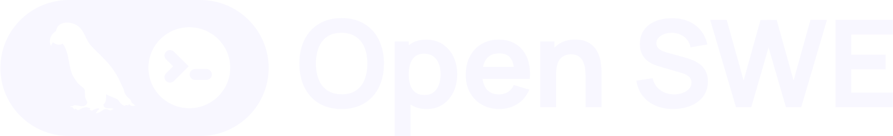

<div align="center">
  <a href="https://github.com/langchain-ai/open-swe">
    <picture>
      <source media="(prefers-color-scheme: dark)" srcset="assets/001-dark-2d5a6669fc.svg">
      <source media="(prefers-color-scheme: light)" srcset="assets/002-light-aab2d19adc.svg">
      
    </picture>
  </a>
</div>

<div align="center">
  <h3>用于构建组织内部编程代理的开源框架。</h3>
</div>

<div align="center">
  <a href="https://opensource.org/licenses/MIT" target="_blank"></a>
  <a href="https://github.com/langchain-ai/open-swe/stargazers" target="_blank"></a>
  <a href="https://github.com/langchain-ai/langgraph" target="_blank"></a>
  <a href="https://github.com/langchain-ai/deepagents" target="_blank"></a>
  <a href="https://x.com/langchain" target="_blank"></a>
</div>

<br>

像 Stripe、Ramp 和 Coinbase 这样的顶尖工程团队正在构建自己的内部编程代理 — Slackbot、CLI 和 Web 应用，让代理在工程师已经工作的环境中运行。这些代理连接到内部系统，拥有正确的上下文、权限和安全边界，可以在最少人工监督的情况下运行。

Open SWE 是这一模式的开源版本。基于 [LangGraph](https://langchain-ai.github.io/langgraph/) 和 [Deep Agents](https://github.com/langchain-ai/deepagents) 构建，它为你提供了与这些公司内部构建的相同架构：云沙箱、Slack 和 Linear 调用、子代理编排和自动 PR 创建 — 可为你的代码库和工作流进行定制。

> [!NOTE]
> 💬 在**[此处](https://blog.langchain.com/open-swe-an-open-source-framework-for-internal-coding-agents/)**阅读发布博文

---

## 架构

Open SWE 采用了与最优秀的内部编程代理相同的核心架构决策。以下是其如何对应 Stripe 的 Minions、Ramp 的 Inspect 和 Coinbase 的 Cloudbot [概述](https://x.com/kishan_dahya/status/2028971339974099317)中描述的模式：

### 1. Agent Harness — 基于 Deep Agents 组合

Open SWE 不是分叉现有代理或从零构建，而是基于 [Deep Agents](https://github.com/langchain-ai/deepagents) 框架进行**组合** — 类似于 Ramp 基于 OpenCode 构建的方式。这为你提供了升级路径（拉取上游改进），同时允许你为组织定制编排、工具和中间件。

```python
create_deep_agent(
    model="anthropic:claude-opus-4-6",
    system_prompt=construct_system_prompt(repo_dir, ...),
    tools=[http_request, fetch_url, commit_and_open_pr, linear_comment, slack_thread_reply],
    backend=sandbox_backend,
    middleware=[ToolErrorMiddleware(), check_message_queue_before_model, ...],
)
```

### 2. 沙箱 — 隔离的云环境

每个任务运行在自己的**隔离云沙箱**中 — 一个具有完整 shell 访问权限的远程 Linux 环境。代码库会被克隆进去，代理获得完整权限，任何错误的影响范围都被完全限制住。没有生产环境访问权限，也没有确认提示。

Open SWE 开箱即支持多个沙箱提供商 — [Modal](https://modal.com/)、[Daytona](https://www.daytona.io/)、[Runloop](https://www.runloop.ai/) 和 [LangSmith](https://smith.langchain.com/) — 你也可以接入自己的提供商。详见[定制指南](CUSTOMIZATION.md#1-sandbox)。

这遵循了三家公司都趋同的原则：**先隔离，然后在边界内给予完整权限。**

- 每个线程获得一个持久沙箱（在后续消息中复用）
- 沙箱在不可达时自动重建
- 多个任务并行运行 — 每个在自己的沙箱中，无需排队

### 3. 工具 — 精选而非堆砌

Stripe 的关键洞察：*工具精选比工具数量更重要。* Open SWE 遵循这一原则，提供一个小而精的工具集：

| 工具 | 用途 |
|---|---|
| `execute` | 在沙箱中执行 shell 命令 |
| `fetch_url` | 以 markdown 格式获取网页 |
| `http_request` | API 调用（GET、POST 等） |
| `commit_and_open_pr` | Git 提交 + 打开 GitHub 草稿 PR |
| `linear_comment` | 向 Linear 工单发布更新 |
| `slack_thread_reply` | 在 Slack 线程中回复 |

再加上 Deep Agents 内置工具：`read_file`、`write_file`、`edit_file`、`ls`、`glob`、`grep`、`write_todos` 和 `task`（启动子代理）。

### 4. 上下文工程 — AGENTS.md + 源上下文

Open SWE 从两个来源获取上下文：

- **`AGENTS.md`** — 如果代码库根目录包含 `AGENTS.md` 文件，它会从沙箱中读取并注入到系统提示词中。这相当于 Stripe 规则文件的代码库级别等价物：编码约定、测试要求和架构决策，每次代理运行都应该遵循。
- **源上下文** — 完整的 Linear issue（标题、描述、评论）或 Slack 线程历史被组装并传递给代理，因此它一开始就拥有丰富的上下文，而不是通过工具调用逐步发现。

### 5. 编排 — 子代理 + 中间件

Open SWE 的编排有两层：

**子代理：** Deep Agents 框架原生支持通过 `task` 工具生成子代理。主代理可以将独立子任务分发给隔离的子代理 — 每个子代理都有自己的中间件栈、待办列表和文件操作。这类似于 Ramp 用于并行工作的子会话。

**中间件：** 确定性的中间件钩子围绕代理循环运行：

- **`check_message_queue_before_model`** — 在下一次模型调用之前注入后续消息（运行期间到达的 Linear 评论或 Slack 消息）。你可以在代理工作时发送消息，它会在下一步获取你的输入。
- **`open_pr_if_needed`** — 代理运行后的安全网，如果代理没有自己打开 PR，它会自动提交并打开 PR。这是 Stripe 确定性节点的轻量版本 — 确保关键步骤无论 LLM 行为如何都会发生。
- **`ToolErrorMiddleware`** — 优雅地捕获和处理工具错误。

### 6. 调用 — Slack、Linear 和 GitHub

文章中三家公司都趋同于 **Slack 作为主要调用界面**。Open SWE 也是如此：

- **Slack** — 在任何线程中提及机器人。支持 `repo:owner/name` 语法指定要处理的代码库。代理在线程中回复状态更新和 PR 链接。
- **Linear** — 在任何 issue 上评论 `@openswe`。代理读取完整的 issue 上下文，以 👀 反应确认，并将结果作为评论发布。
- **GitHub** — 在代理创建的 PR 的评论中标记 `@openswe`，让它处理审查反馈并将修复推送到同一分支。

每次调用创建一个确定性的线程 ID，因此同一 issue 或线程上的后续消息路由到同一运行中的代理。

### 7. 验证 — 提示词驱动 + 安全网

代理被指示在提交前运行代码检查器、格式化器和测试。`open_pr_if_needed` 中间件作为兜底 — 如果代理完成但未打开 PR，中间件会自动处理。

这是你可以为组织扩展 Open SWE 的领域：添加确定性的 CI 检查、可视化验证或审查门禁作为额外的中间件。详见[定制指南](CUSTOMIZATION.md#6-middleware)。

---

## 对比

| 决策 | Open SWE | Stripe (Minions) | Ramp (Inspect) | Coinbase (Cloudbot) |
|---|---|---|---|---|
| **Harness** | 组合（Deep Agents/LangGraph） | 分叉（Goose） | 组合（OpenCode） | 从零构建 |
| **沙箱** | 可插拔（Modal、Daytona、Runloop 等） | AWS EC2 开发盒（预热） | Modal 容器（预热） | 自研 |
| **工具** | ~15 个，精选 | ~500 个，按代理精选 | OpenCode SDK + 扩展 | MCP + 自定义技能 |
| **上下文** | AGENTS.md + issue/线程 | 规则文件 + 预填充 | OpenCode 内置 | Linear 优先 + MCP |
| **编排** | 子代理 + 中间件 | 蓝图（确定性 + 代理式） | 会话 + 子会话 | 三种模式 |
| **调用** | Slack、Linear、GitHub | Slack + 嵌入式按钮 | Slack + Web + Chrome 扩展 | Slack 原生 |
| **验证** | 提示词驱动 + PR 安全网 | 3 层（本地 + CI + 1 次重试） | 可视化 DOM 验证 | 代理委员会 + 自动合并 |

---

## 功能特性

- **从 Linear、Slack 或 GitHub 触发** — 在评论中提及 `@openswe` 即可启动任务
- **即时确认** — 获取消息后立即以 👀 反应
- **运行中发消息** — 在任务执行期间发送后续消息，代理会在下一步获取
- **并行运行多个任务** — 每个任务在独立的云沙箱中运行
- **内置 GitHub OAuth** — 自动使用你的 GitHub 账户认证
- **自动打开 PR** — 完成后提交更改并打开草稿 PR，关联到你的工单
- **子代理支持** — 代理可以为并行子任务生成子代理

---

## 入门

- **[安装指南](INSTALLATION.md)** — GitHub App 创建、LangSmith、Linear/Slack/GitHub 触发器和生产部署
- **[定制指南](CUSTOMIZATION.md)** — 为你的组织替换沙箱、模型、工具、触发器、系统提示词和中间件

## 许可证

MIT
