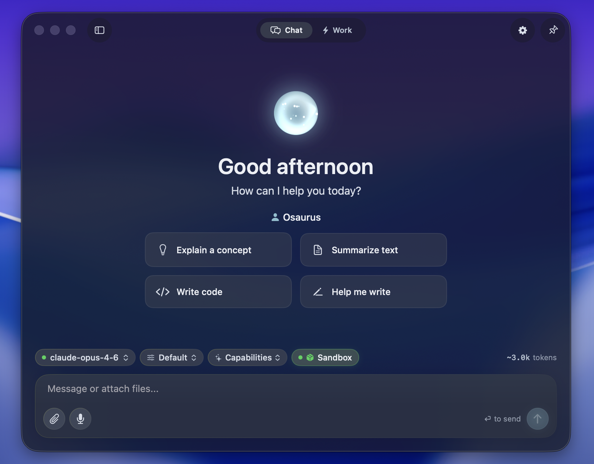

<p align="center">

</p>

<h1 align="center">Osaurus</h1>

<p align="center">
  <strong>掌控你的 AI。</strong><br>
  代理、记忆、工具和身份，全部在你的 Mac 上运行。纯 Swift 构建。完全离线。开源。
</p>

<p align="center">
  <a href="https://github.com/osaurus-ai/osaurus/releases/latest"></a>
  <a href="https://github.com/osaurus-ai/osaurus/releases"></a>
  <a href="https://github.com/osaurus-ai/osaurus/blob/main/LICENSE"></a>
  <a href="https://github.com/osaurus-ai/osaurus/stargazers"></a>
</p>

<p align="center">
  
  
  
  
  
  
  <a href="https://huggingface.co/OsaurusAI"></a>
  
</p>

<p align="center">
  <a href="https://github.com/osaurus-ai/osaurus/releases/latest/download/Osaurus.dmg">下载 Mac 版</a> ·
  <a href="https://docs.osaurus.ai">文档</a> ·
  <a href="https://huggingface.co/OsaurusAI">模型</a> ·
  <a href="https://discord.com/invite/dinoki">Discord</a> ·
  <a href="https://x.com/OsaurusAI">Twitter</a> ·
  <a href="https://github.com/osaurus-ai/osaurus-tools">插件注册表</a>
</p>

---

## 推理就是你所需要的。其他一切都可以由你掌控。

模型一天天变得更便宜、也更容易互换。不可替代的是围绕模型的那一层 -- 你的上下文、你的记忆、你的工具、你的身份。其他人把这一层放在他们的服务器上。Osaurus 则把它留在你的机器上。

Osaurus 是 macOS 上的 AI harness。它位于你和任何模型之间 -- 无论本地还是云端 -- 并提供让 AI 真正个性化的连续性：能记忆、能自主执行、能运行真实代码、并且可从任何地方访问的代理。模型可以互换。真正不断积累价值的是 harness。

完全离线使用本地模型。需要更强能力时连接任何云提供商。除非你选择，否则没有任何数据离开你的 Mac。

Apple Silicon 上的原生 Swift。没有 Electron。没有妥协。MIT 许可证。

## 安装

```bash
brew install --cask osaurus
```

或者从 [Releases](https://github.com/osaurus-ai/osaurus/releases/latest) 下载最新的 `.dmg`。安装后，从 Spotlight（`⌘ Space` → "Osaurus"）或 CLI 启动：

```bash
osaurus ui       # 打开聊天界面
osaurus serve    # 启动服务器
osaurus status   # 检查状态
```

> 需要 macOS 15.5+ 和 Apple Silicon。

## 代理

代理是 Osaurus 的核心。每个代理都有自己的提示词、记忆和视觉主题 -- 无论是研究助手、编程伙伴还是文件整理器，都可以按需定制。工具和技能会根据当前任务通过 RAG 搜索自动选择 -- 无需手动配置。Harness 中的其他一切，都是为了让代理随着时间推移变得更智能、更快速、更强大。

### 工作模式

给代理一个目标。它会把工作拆分成可追踪的事项，并逐步执行 -- 包括并行任务、文件操作和后台处理。描述你想完成什么，而不是具体怎么做。

### 沙箱

代理在由 Apple [Containerization](https://developer.apple.com/documentation/containerization) 框架驱动的隔离 Linux VM 中执行代码。完整的开发环境 -- shell、Python、Node.js、编译器、包管理器一应俱全，而且对你的 Mac 零风险。

每个代理都会获得自己的 Linux 用户和主目录。VM 通过 vsock 桥接回连 Osaurus（推理、记忆、机密信息）-- 处于沙箱中，但并未与外界断开。通过简单的 JSON 插件配方即可扩展，无需 Xcode 或代码签名。

```
┌────────────────┐       ┌────────────────────────────┐
│    Osaurus     │       │   Linux VM (Alpine)        │
│                │       │                            │
│  Sandbox Mgr ──┼───────┤→ /workspace  (VirtioFS)    │
│  Host API   ←──┼─vsock─┤→ osaurus-host bridge       │
│                │       │                            │
│                │       │  agent-alice  (Linux user) │
│                │       │  agent-bob    (Linux user) │
└────────────────┘       └────────────────────────────┘
```

> 需要 macOS 26+ (Tahoe)。详见 [沙箱指南](docs/SANDBOX.md)，了解配置、内置工具和插件编写。

### 内存

4 层系统：用户画像、工作记忆、对话摘要和知识图谱。自动提取事实、检测矛盾，并召回相关上下文。代理会随着时间变得更智能，而这些知识始终归你所有，不属于任何服务提供商。

### 身份

每个参与者 -- 人类、代理、设备 -- 都拥有一个 secp256k1 加密地址。授权从你的主密钥（iCloud Keychain）一路传递到每个代理，形成一条可验证的信任链。你可以创建可移植的访问密钥（`osk-v1`），按代理限定权限范围，并可随时撤销。详见 [Identity 文档](docs/IDENTITY.md)。

### 中继

通过 `agent.osaurus.ai` 的安全 WebSocket 隧道将代理暴露到互联网。基于加密地址的每个代理唯一 URL。无需端口转发，无需 ngrok，无需配置。

## 模型

Harness 与模型无关。你可以自由切换 -- 你的代理、记忆和工具都会保持不变。

### 本地

在 Apple Silicon 上通过优化的 MLX 推理运行 Gemma 4、Qwen3.5、GPT-OSS、Llama 等模型。Osaurus 在 [Hugging Face 上维护自己的优化模型库](https://huggingface.co/OsaurusAI)，精心提供适合 Apple Silicon、在质量与体积之间取得最佳平衡的量化版本。模型存储在 `~/MLXModels`（可通过 `OSU_MODELS_DIR` 覆盖）。完全私密，完全离线。

### Liquid Foundation Models

Osaurus 支持 [Liquid AI 的 LFM](https://www.liquid.ai/models) 系列 — 基于非 Transformer 架构构建的设备端模型，专为边缘部署优化。快速解码、低内存占用、开箱即用的强大工具调用。

### Apple Foundation Models

在 macOS 26+ 上，使用 Apple 的设备端模型作为一等公民提供商。在 API 请求中传入 `model: "foundation"`。工具调用通过 Apple 的原生接口自动映射。零推理成本，完全隐私。

### 云端

连接到 OpenAI、Anthropic、Gemini、xAI/Grok、[Venice AI](https://venice.ai)、OpenRouter、Ollama 或 LM Studio。Venice 提供无审查、注重隐私的推理，不保留数据。上下文和内存在所有提供商间持久保存。

## MCP

Osaurus 是完整的 MCP（Model Context Protocol）服务器。让 Cursor、Claude Desktop 或任何 MCP 客户端访问你的工具：

```json
{
  "mcpServers": {
    "osaurus": {
      "command": "osaurus",
      "args": ["mcp"]
    }
  }
}
```

同时它也是一个 MCP 客户端 -- 可以把远程 MCP 服务器的工具聚合到 Osaurus 中。详见 [远程 MCP 提供商指南](docs/REMOTE_MCP_PROVIDERS.md)。

## 工具与插件

```bash
osaurus tools install osaurus.browser    # 从注册表安装
osaurus tools list                       # 列出已安装
osaurus tools create MyPlugin --swift    # 创建插件
osaurus tools dev com.acme.my-plugin     # 开发热重载
```

20+ 原生插件：Mail、Calendar、Vision、macOS Use、XLSX、PPTX、Browser、Music、Git、Filesystem、Search、Fetch 等。插件支持 v1（仅工具）和 v2（完整主机 API）ABI -- 可注册 HTTP 路由、提供 Web 应用、将数据持久化到 SQLite、分派代理任务，并通过任意模型调用推理。详见 [插件编写指南](docs/PLUGIN_AUTHORING.md)。

## 更多

**技能与方法** -- 技能可从 GitHub 仓库或文件导入可复用的 AI 能力，并兼容 [Agent Skills](https://agentskills.io/)。方法则是代理随着时间学习、保存并重复使用的工作流。两者都会通过 RAG 搜索自动选择 -- 无需手动配置。详见 [技能指南](docs/SKILLS.md)。

**自动化** -- 调度器在后台运行周期性任务。监视器监控文件夹并在文件变更时触发代理。

**语音** -- 通过 FluidAudio 在 Apple 的 Neural Engine 上进行设备端转录。聊天中的语音输入、带唤醒词激活的 VAD 模式、以及将语音转录到任何应用的全局热键。没有音频离开你的 Mac。详见[语音输入指南](docs/VOICE_INPUT.md)。

**开发者工具** -- 服务器资源管理器、MCP 工具检查器、推理监控和插件调试。详见 [开发者工具指南](docs/DEVELOPER_TOOLS.md)。

## 兼容 API

为现有工具提供即插即用的端点：

| API       | 端点                                      |
| --------- | --------------------------------------------- |
| OpenAI    | `http://127.0.0.1:1337/v1/chat/completions`   |
| Anthropic | `http://127.0.0.1:1337/anthropic/v1/messages` |
| Ollama    | `http://127.0.0.1:1337/api/chat`              |

支持所有前缀（`/v1`、`/api`、`/v1/api`）。支持完整的函数调用，以及流式工具调用增量。详见 [OpenAI API 指南](docs/OpenAI_API_GUIDE.md)，了解工具调用、流式传输和 SDK 示例。要构建连接 Osaurus 的 macOS 应用？参见 [共享配置指南](docs/SHARED_CONFIGURATION_GUIDE.md)。

## CLI

```bash
osaurus serve --port 1337              # 在 localhost 启动
osaurus serve --port 1337 --expose     # 在局域网暴露
osaurus ui                             # 打开聊天界面
osaurus status                         # 检查状态
osaurus stop                           # 停止服务器
```

Homebrew 自动链接 CLI，或手动符号链接：

```bash
ln -sf "/Applications/Osaurus.app/Contents/MacOS/osaurus" "$(brew --prefix)/bin/osaurus"
```

## 架构

```
┌─────────────────────────────────────────────────────┐
│                   The Harness                       │
├──────────┬──────────┬───────────┬───────────────────┤
│ 代理     │ 内存     │ 工作模式   │ 自动化            │
├──────────┴──────────┴───────────┴───────────────────┤
│              MCP 服务器 + 客户端                     │
├──────────┬──────────┬───────────┬───────────────────┤
│ MLX      │ OpenAI   │ Anthropic │ Ollama / 其他     │
│ 运行时   │ API      │ API       │                   │
├──────────┴──────────┴───────────┴───────────────────┤
│      插件系统 (v1 / v2 ABI) · 原生插件               │
├──────────┬──────────┬───────────┬───────────────────┤
│ 身份     │ 中继     │ 工具      │ 技能 · 方法       │
├──────────┴──────────┴───────────┴───────────────────┤
│  沙箱 VM (Alpine · Apple Containerization)          │
│  vsock 桥接 · VirtioFS · 按代理隔离                 │
└─────────────────────────────────────────────────────┘
```

大多数功能都可通过管理窗口访问（`⌘ ⇧ M`）。

## 从源码构建

```bash
git clone https://github.com/osaurus-ai/osaurus.git
cd osaurus
open osaurus.xcworkspace
```

构建并运行 `osaurus` 目标。需要 Xcode 16+ 和 macOS 15.5+。

### Git Hooks (lefthook)

安装 [lefthook](https://github.com/evilmartians/lefthook) 以设置验证代码质量的钩子：

```bash
brew install lefthook
lefthook install
```

这会安装一个 `pre-push` 钩子，在每次推送前对 `Packages/` 目录运行 `swift-format`。

## 项目结构

```
osaurus/
├── App/                          # macOS 应用目标（SwiftUI 入口、资产、权限）
├── Packages/
│   ├── OsaurusCore/              # 核心库 — 所有应用逻辑
│   │   ├── Models/               # 数据类型、DTO、配置存储
│   │   ├── Services/             # 业务逻辑（actor 和无状态类型）
│   │   ├── Managers/             # UI 面向的状态持有者（@MainActor、observable）
│   │   ├── Views/                # SwiftUI 视图，按功能组织
│   │   ├── Networking/           # HTTP 服务器、路由、中继
│   │   ├── Storage/              # SQLite 数据库
│   │   ├── Identity/             # 加密身份和访问密钥
│   │   ├── Tools/                # MCP 工具、插件 ABI、工具注册表
│   │   ├── Work/                 # 工作模式执行上下文和文件操作
│   │   ├── Utils/                # 跨领域工具类
│   │   └── Tests/                # 单元和集成测试
│   ├── OsaurusCLI/               # CLI（osaurus 命令）
│   └── OsaurusRepository/        # 插件注册表和安装
├── docs/                         # 功能指南和文档
├── scripts/                      # 构建、发布和基准测试脚本
├── sandbox/                      # 沙箱 VM Dockerfile
└── assets/                       # DMG 打包资产
```

详见 [CONTRIBUTING.md](docs/CONTRIBUTING.md) 了解架构指南和层定义。

## 贡献

Osaurus 正在积极开发中，我们欢迎各种贡献：bug 修复、新插件、文档、UI/UX 改进和测试。

查看 [Good First Issues](https://github.com/osaurus-ai/osaurus/issues?q=is%3Aissue+is%3Aopen+label%3A%22good+first+issue%22)，阅读[贡献指南](CONTRIBUTING.md)，或加入 [Discord](https://discord.com/invite/dinoki)。完整功能清单见 [docs/FEATURES.md](docs/FEATURES.md)。

## 社区

- [Discord](https://discord.com/invite/dinoki) -- 聊天、反馈、展示
- [Twitter](https://x.com/OsaurusAI) -- 更新和演示
- [Hugging Face](https://huggingface.co/OsaurusAI) -- 为 Apple Silicon 优化的模型
- [社区交流会](https://lu.ma/osaurus) -- 每两周一次，对所有人开放
- [博客](https://osaurus.ai/blog) -- 关于个人 AI 的深度思考
- [文档](https://docs.osaurus.ai) -- 指南和教程
- [插件注册表](https://github.com/osaurus-ai/osaurus-tools) -- 浏览和贡献工具

## 许可证

[MIT](LICENSE)

---

<p align="center">
  Osaurus, Inc. · <a href="https://osaurus.ai">osaurus.ai</a>
</p>
