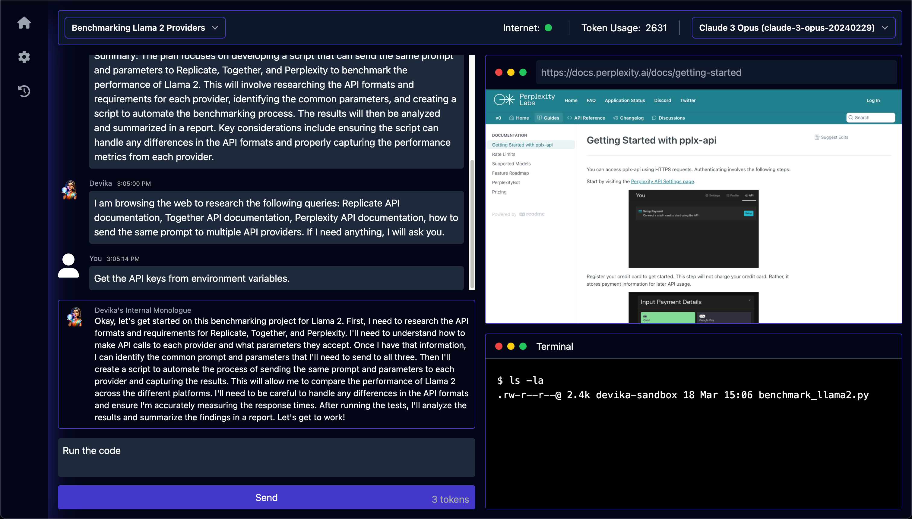
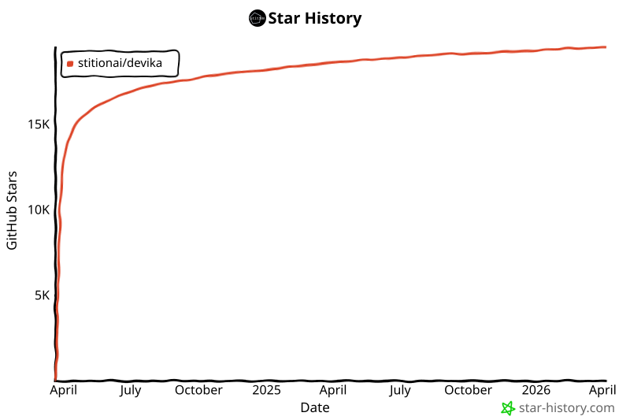

<h1 align="center">查看 <a href="https://opcode.sh/">Opcode</a>，Devika 的第二代产品。新版本即将发布！</h1>

---

<p align="center">
  
</p>

<h1 align="center">🚀 Devika - 代理式 AI 软件工程师 👩‍💻</h1>



> [!IMPORTANT]
> 本项目目前处于非常早期的开发/实验阶段。有许多功能尚未实现或存在问题。欢迎贡献以帮助推进进度！

## 目录

- [简介](#about)
- [核心功能](#核心功能)
- [系统架构](#系统架构)
- [快速开始](#快速开始)
  - [系统要求](#系统要求)
  - [安装](#安装)
  - [使用方法](#使用方法)
- [配置](#配置)
- [贡献](#贡献)
- [帮助与支持](#帮助与支持)
- [许可证](#许可证)

## 简介

Devika 是一个先进的 AI 软件工程师，能够理解高级人类指令，将其分解为步骤，研究相关信息，并编写代码以实现给定目标。Devika 利用大语言模型、规划和推理算法以及网络浏览能力来智能地开发软件。

Devika 旨在通过提供一个 AI 配对程序员来革新我们构建软件的方式，该程序员可以在最少的人类指导下承担复杂的编码任务。无论你是需要创建新功能、修复 bug，还是从零开始开发整个项目，Devika 都能为你提供帮助。

> [!NOTE]
> Devika 以 Cognition AI 的 [Devin](https://www.cognition-labs.com/introducing-devin) 为原型。本项目的目标是成为 Devin 的开源替代方案，并以"雄心勃勃"的目标在 [SWE-bench](https://www.swebench.com/) 基准测试中达到与 Devin 相同的分数……甚至最终超越它？

## 演示

https://github.com/stitionai/devika/assets/26198477/cfed6945-d53b-4189-9fbe-669690204206

## 核心功能

- 🤖 支持 **Claude 3**、**GPT-4**、**Gemini**、**Mistral**、**Groq** 及通过 [Ollama](https://ollama.com) 的**本地 LLM**。为获得最佳性能：使用 **Claude 3** 系列模型。
- 🧠 先进的 AI 规划和推理能力
- 🔍 上下文关键词提取，专注于相关研究
- 🌐 无缝的网络浏览和信息收集
- 💻 支持多种编程语言的代码编写
- 📊 动态的代理状态跟踪和可视化
- 💬 通过聊天界面进行自然语言交互
- 📂 基于项目的组织和管理
- 🔌 可扩展的架构，便于添加新功能和集成

## 系统架构

阅读 [**README.md**](docs/architecture) 获取详细文档。

## 快速开始

### 系统要求
```
版本要求
  - Python >= 3.10 and < 3.12
  - NodeJs >= 18
  - bun
```

- 安装 uv - Python 包管理器 [下载](https://github.com/astral-sh/uv)
- 安装 bun - JavaScript 运行时 [下载](https://bun.sh/docs/installation)
- 关于 Ollama [Ollama 设置指南](docs/Installation/ollama.md)（可选：如果不想使用本地模型，可跳过此步骤）
- 对于 API 模型，通过 UI 设置页面配置 API 密钥。

### 安装

要安装 Devika，请按照以下步骤操作：

1. 克隆 Devika 仓库：
   ```bash
   git clone https://github.com/stitionai/devika.git
   ```
2. 进入项目目录：
   ```bash
   cd devika
   ```
3. 创建虚拟环境并安装所需依赖（可以使用任何虚拟环境管理器）：
   ```bash
   uv venv

   # 在 macOS 和 Linux 上：
   source .venv/bin/activate

   # 在 Windows 上：
   .venv\Scripts\activate

   uv pip install -r requirements.txt
   ```
4. 安装 Playwright 以获取浏览器功能：
   ```bash
   playwright install --with-deps # 安装 Playwright 浏览器（及其依赖），如需要
   ```
5. 启动 Devika 服务器：
   ```bash
   python devika.py
   ```
6. 如果一切正常，你将看到以下输出：
   ```bash
   root: INFO   : Devika is up and running!
   ```
7. 接下来，在前端方面，打开一个新终端并进入 `ui` 目录：
   ```bash
   cd ui/
   bun install
   bun run start
   ```
8. 在浏览器中访问 `http://127.0.0.1:3001` 打开 Devika Web 界面

### 使用方法

要开始使用 Devika，请按照以下步骤操作：

1. 在浏览器中打开 Devika Web 界面。
2. 要创建项目，点击"select project"然后点击"new project"。
3. 为你的项目选择搜索引擎和模型配置。
4. 在聊天界面中，提供高级目标或任务描述让 Devika 处理。
5. Devika 将处理你的请求，将其分解为步骤，并开始执行任务。
6. 监控 Devika 的进度，查看生成的代码，并根据需要提供额外的指导或反馈。
7. Devika 完成任务后，查看生成的代码和项目文件。
8. 通过提供进一步的指令或修改来迭代和优化项目。

## 配置

Devika 需要某些配置设置和 API 密钥才能正常运行：

首次运行 Devika 时，它会在根目录为你创建一个 `config.toml` 文件。你可以通过 UI 的设置页面配置以下设置：

- API 密钥
   - `BING`：用于网络搜索功能的 Bing Search API 密钥。
   - `GOOGLE_SEARCH`：用于网络搜索功能的 Google Search API 密钥。
   - `GOOGLE_SEARCH_ENGINE_ID`：用于 Google 搜索的搜索引擎 ID。
   - `OPENAI`：用于访问 GPT 模型的 OpenAI API 密钥。
   - `GEMINI`：用于访问 Gemini 模型的 Gemini API 密钥。
   - `CLAUDE`：用于访问 Claude 模型的 Anthropic API 密钥。
   - `MISTRAL`：用于访问 Mistral 模型的 Mistral API 密钥。
   - `GROQ`：用于访问 Groq 模型的 Groq API 密钥。
   - `NETLIFY`：用于部署和管理 Web 项目的 Netlify API 密钥。

- API 端点
   - `BING`：用于网络搜索的 Bing API 端点。
   - `GOOGLE`：用于网络搜索的 Google API 端点。
   - `OLLAMA`：用于访问本地 LLM 的 Ollama API 端点。
   - `OPENAI`：用于访问 OpenAI 模型的 OpenAI API 端点。

请确保妥善保管你的 API 密钥，不要公开分享。有关设置 Bing 和 Google 搜索 API 密钥的说明，请参阅[搜索引擎设置](docs/Installation/search_engine.md)

## 贡献

我们欢迎贡献以增强 Devika 的功能并改进其性能。要贡献，请参阅 [`CONTRIBUTING.md`](CONTRIBUTING.md) 文件中的步骤。

## 帮助与支持

如果你有任何问题、反馈或建议，请随时与我们联系。你可以在 [issue 跟踪器](https://github.com/stitionai/devika/issues) 中提出问题，或在 [讨论区](https://github.com/stitionai/devika/discussions) 进行一般性讨论。

我们还有一个 Devika 社区的 Discord 服务器，你可以与其他用户交流、分享经验、提问和协作开发项目。要加入 Devika 社区 Discord 服务器，[点击这里](https://discord.gg/CYRp43878y)。

## 许可证

Devika 在 [MIT 许可证](https://opensource.org/licenses/MIT) 下发布。详见 `LICENSE` 文件。

## Star 历史

<div align="center">
<a href="https://star-history.com/#stitionai/devika&Date">
 <picture>
   <source media="(prefers-color-scheme: dark)" srcset="assets/004-svg-3b66fbf531.svg" />
   <source media="(prefers-color-scheme: light)" srcset="assets/003-svg-cd29fc4ee4.svg" />
   
 </picture>
</a>
</div>

---

希望 Devika 能成为你软件开发旅程中的得力工具。如果你有任何问题、反馈或建议，请随时联系我们。祝你使用 Devika 编程愉快！
