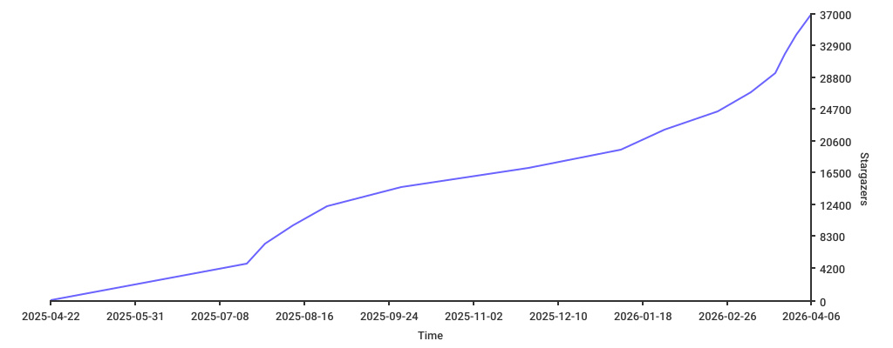

<!-- GENERATED FILE: do not edit directly -->
<h3 align="center">选择你的风格：</h3>

  <picture>
    
  </picture>

# Awesome Claude Code

> 一份经过选择性策划的技能、代理、插件、hooks，以及其他用于增强你的 [Claude Code](https://docs.anthropic.com/en/docs/claude-code) 工作流的优秀工具清单。

## 最新添加

- [Claude Code Agent Teams: Exercises](https://github.com/panaversity/claude-code-agent-teams-exercises) by [Panaversity](https://github.com/panaversity) - 面向 Claude Code Agent Teams 的实战练习资源，包含 6 个练习和 2 个综合项目，覆盖团队创建、任务协调、质量 hooks 和并行代码审查，是很好的学习材料。
- [Harness](https://github.com/revfactory/harness) by [revfactory](https://github.com/revfactory) - 一个元技能，用于设计特定领域的代理团队、定义专用代理，并生成它们所使用的技能。资源是韩文，但可以产出高质量的英文内容。
- [claude-devtools](https://github.com/matt1398/claude-devtools) by [matt1398](https://github.com/matt1398) - 一款设计精良的桌面应用，通过分析会话日志，为你的 Claude Code 会话提供细粒度可观测性。它提供按回合划分的多类别上下文数据、压缩可视化、子代理执行树以及自定义通知触发器。安装简单，视觉设计也很不错。

## 目录

- [Agent Skills 🤖](#agent-skills-)
  - [通用](#通用)
- [工作流与知识指南 🧠](#工作流与知识指南-)
  - [通用](#通用-1)
  - [团队](#团队)
  - [Ralph Wiggum](#ralph-wiggum)
- [工具 🧰](#工具-)
  - [通用](#通用-2)
  - [IDE 集成](#ide-集成)
  - [使用监控](#使用监控)
  - [编排器](#编排器)
  - [配置管理器](#配置管理器)
- [状态栏 📊](#状态栏-)
  - [通用](#通用-3)
- [Hooks 🪝](#hooks-)
  - [通用](#通用-4)
- [Slash Commands 🔪](#slash-commands-)
  - [通用](#通用-5)
  - [版本控制与 Git](#版本控制与-git)
  - [代码分析与测试](#代码分析与测试)
  - [上下文加载与预热](#上下文加载与预热)
  - [文档与变更日志](#文档与变更日志)
  - [CI / 部署](#ci--部署)
  - [项目与任务管理](#项目与任务管理)
  - [杂项](#杂项)
- [CLAUDE.md 文件 📂](#claudemd-文件-)
  - [语言相关](#语言相关)
  - [领域相关](#领域相关)
  - [项目脚手架与 MCP](#项目脚手架与-mcp)
- [替代客户端 📱](#替代客户端-)
  - [通用](#通用-6)
- [官方文档 🏛️](#官方文档-)
  - [通用](#通用-7)

## Agent Skills 🤖

> Agent skills 是由模型控制的配置（文件、脚本、资源等），使 Claude Code 能执行那些需要特定知识或能力的专门任务。

### 通用

- [AgentSys](https://github.com/avifenesh/agentsys) by [avifenesh](https://github.com/avifenesh) - 面向 Claude 的工作流自动化系统，包含一组实用插件、代理和技能。可自动化从任务到生产的流程、PR 管理、代码清理、性能调查、漂移检测以及多代理代码审查。还包含用于校验代理配置的 [agnix](https://github.com/avifenesh/agnix)。构建于数千行代码与数千个测试之上。为了效率，它结合了确定性检测（regex、AST）与 LLM 判断。已用于多个生产系统。
- [AI Agent, AI Spy](https://youtu.be/0ANECpNdt-4) by [Whittaker & Tiwari](https://signalfoundation.org/) - 来自 Signal Foundation 的成员分享了一些很棒的技巧，讲解如何把你的操作系统变成一台全方位监控工具，以及为什么有些公司正在做这种“很厉害”的事。[warning: YouTube link]。
- [Book Factory](https://github.com/robertguss/claude-skills) by [Robert Guss](https://github.com/robertguss) - 一套全面的技能流水线，通过专门的 Claude skills 复刻传统出版基础设施，用于创作非虚构类书籍。
- [cc-devops-skills](https://github.com/akin-ozer/cc-devops-skills) by [akin-ozer](https://github.com/akin-ozer) - 为 DevOps 工程师设计的一组极其细致的技能集（其实凡是要部署代码的人都适用）。它配合验证器、生成器、shell 脚本和 CLI 工具，能够为几乎所有你曾痛苦对接过的平台生成高质量 IaC 代码。就算只把它当文档来源下载下来也很值。
- [Claude Code Agents](https://github.com/undeadlist/claude-code-agents) by [Paul - UndeadList](https://github.com/undeadlist) - 为独立开发者提供的完整 E2E 开发工作流，附带实用的 Claude Code 子代理提示。可并行运行多个审计器，用微检查点协议自动化修复循环，并进行基于浏览器的 QA。还包含严格协议，防止 AI 失控。
- [Claude Codex Settings](https://github.com/fcakyon/claude-codex-settings) by [fatih akyon](https://github.com/fcakyon) - 一套组织良好、书写清晰的插件集合，覆盖开发者的核心活动，例如 GitHub、Azure、MongoDB 等常见云平台，以及 Tavily、Playwright 等热门服务。清晰、不算太武断，也兼容一些其他提供方。
- [Claude Mountaineering Skills](https://github.com/dreamiurg/claude-mountaineering-skills) by [Dmytro Gaivoronsky](https://github.com/dreamiurg) - 一个 Claude Code skill，用于自动化北美山峰登山路线研究。它聚合了 10+ 个登山信息源，如 Mountaineers.org、PeakBagger.com 和 SummitPost.com，以生成包含天气、雪崩状况和行程报告的详细路线 beta 报告。
- [Claude Scientific Skills](https://github.com/K-Dense-AI/claude-scientific-skills) by [K-Dense](https://github.com/K-Dense-AI/) - “一套开箱即用的 Agent Skills，适用于研究、科学、工程、分析、金融和写作。”这是他们自己的描述，谦逊、简单。正因为如此，你就知道这真的是 GitHub 上最好的 skills 仓库之一。如果你曾想过去读个 PhD……不如先把这些文档都读完。还有我觉得它本身可能也是个 AI agent 之类的？总之很棒。
- [Codebase to Course](https://github.com/zarazhangrui/codebase-to-course) by [Zara Zhang](https://github.com/zarazhangrui) - 一个 Claude Code skill，可以把任意代码库转成漂亮、交互式的单页 HTML 课程，面向没有技术背景的 vibe coder。
- [Codex Skill](https://github.com/skills-directory/skill-codex) by [klaudworks](https://github.com/klaudworks) - 让用户可以从 claude code 中提示 codex。与原始 codex mcp server 不同，这个 skill 会根据你的提示推断 model、reasoning effort、sandboxing 等参数，或要求你明确指定。它还简化了继续之前 codex 会话的过程，让 codex 可以接着已有上下文继续工作。
- [Compound Engineering Plugin](https://github.com/EveryInc/compound-engineering-plugin) by [EveryInc](https://github.com/EveryInc) - 一套非常务实、设计优秀的 agents、skills 和 commands，其核心理念是把过去的错误和失败转化为未来成长和改进的经验。文档也很好。
- [Context Engineering Kit](https://github.com/NeoLabHQ/context-engineering-kit) by [Vlad Goncharov](https://github.com/LeoVS09) - 一套手工打造的高级上下文工程技术与模式集合，token 开销很小，重点在于提高 agent 输出质量。
- [Everything Claude Code](https://github.com/affaan-m/everything-claude-code) by [Affaan Mustafa](https://github.com/affaan-m/) - 顶级、写得很好的资源集合，覆盖“几乎所有”核心工程领域。这个“everything-”资源库的好处在于，大多数资源本身就有很强的独立价值；不像某些包罗万象的框架那样强绑定作者的工作流。虽然你也可以选择采用作者的特定工作流模式，但其中单独的资源几乎在你能找到的每个 Claude Code 特性上都提供了示范性模式（向 Output Styles 的信徒致歉）。
- [Fullstack Dev Skills](https://github.com/jeffallan/claude-skills) by [jeffallan](https://github.com/jeffallan) - 一个全面的 Claude Code 插件，包含 65 个专用技能，覆盖大量具体框架下的全栈开发。附带 9 个项目工作流命令，用于 Jira/Confluence 集成；尤其值得一提的是，它通过 `/common-ground` 命令来揭示 Claude 对项目的隐藏假设，这是一种很有意思的上下文工程思路。这么做很聪明。
- [read-only-postgres](https://github.com/jawwadfirdousi/agent-skills) by [jawwadfirdousi](https://github.com/jawwadfirdousi) - 面向 Claude Code 的只读 PostgreSQL 查询技能。可在配置好的数据库上执行 SELECT/SHOW/EXPLAIN/WITH 查询，并带有严格校验、超时和行数限制。支持多连接，并可通过描述帮助选择数据库。
- [Superpowers](https://github.com/obra/superpowers) by [Jesse Vincent](https://github.com/obra) - 一组很强的软件工程核心能力，覆盖了 SDLC 的大部分内容，从规划、评审到测试、调试。写得好、组织也好，而且可适配。作者称之为“superpowers”，但其中很多其实是在整合工程最佳实践，而在 Claude Code 上工作时，这有时候确实就像超能力。
- [Trail of Bits Security Skills](https://github.com/trailofbits/skills) by [Trail of Bits](https://github.com/trailofbits) - 一个非常专业、包含十多个安全导向技能的集合，面向代码审计与漏洞检测。包括基于 CodeQL 和 Semgrep 的静态分析、跨代码库的变体分析、修复验证以及差异代码评审技能。
- [TÂCHES Claude Code Resources](https://github.com/glittercowboy/taches-cc-resources) by [TÂCHES](https://github.com/glittercowboy) - 一套平衡良好、接地气的子代理、技能与命令集合，组织清晰、易于阅读，并且对“元”技能/代理如 “skill-auditor”、hook 创建等投入了健康的关注。这类东西是你可以适配进自己工作流的，而不是反过来。
- [Web Assets Generator Skill](https://github.com/alonw0/web-asset-generator) by [Alon Wolenitz](https://github.com/alonw0) - 轻松从 Claude Code 生成 Web 资源，包括 favicon、应用图标（PWA）以及面向 Facebook、Twitter、WhatsApp 和 LinkedIn 的社交媒体 meta 图片（Open Graph）。支持图像缩放、文生图、emoji，并提供合适的 HTML meta 标签。

 

## 工作流与知识指南 🧠

> 工作流是紧密耦合的一组原生 Claude Code 资源，用于促进特定项目的开展。

### 通用

- [AB Method](https://github.com/ayoubben18/ab-method) by [Ayoub Bensalah](https://github.com/ayoubben18) - 一种有原则、以规范驱动的工作流，使用 Claude Code 的专用子代理把大型问题拆解成聚焦且渐进的任务。包含 slash-commands、子代理，以及为 SDLC 特定阶段设计的专门工作流。
- [Agentic Workflow Patterns](https://github.com/ThibautMelen/agentic-workflow-patterns) by [ThibautMelen](https://github.com/ThibautMelen) - 一套全面且文档完善的 agentic 模式集合，来源于 Anthropic 文档，并为每种模式配有色彩丰富的 Mermaid 图和代码示例。涵盖 Subagent Orchestration、Progressive Skills、Parallel Tool Calling、Master-Clone Architecture、Wizard Workflows 等。也兼容其他提供方。
- [Blogging Platform Instructions](https://github.com/cloudartisan/cloudartisan.github.io/tree/main/.claude/commands) by [cloudartisan](https://github.com/cloudartisan) - 提供一组结构良好的命令，用于发布和维护博客平台，包括创建文章、管理分类和处理媒体文件的命令。
- [Claude Code Documentation Mirror](https://github.com/ericbuess/claude-code-docs) by [Eric Buess](https://github.com/ericbuess) - Anthropic &copy; PBC 的 Claude Code 文档页面镜像，每隔几小时更新一次。在你想跟上 Dr. Claw D. Code, Ph.D. 那不断扩展的功能集时，会非常有用。
- [Claude Code Handbook](https://nikiforovall.blog/claude-code-rules/) by [nikiforovall](https://github.com/nikiforovall) - 关于 Claude Code 开发工作流的最佳实践、技巧与方法集合，并结合了可分发插件进行了增强。
- [Claude Code Infrastructure Showcase](https://github.com/diet103/claude-code-infrastructure-showcase) by [diet103](https://github.com/diet103) - 一种在 Skills 上工作的极具创新性的方式，其核心是一种利用 hooks 来确保 Claude 能根据当前上下文智能选择并激活合适 Skill 的技术。文档完善，也容易适配到不同项目和工作流中。
- [Claude Code PM](https://github.com/automazeio/ccpm) by [Ran Aroussi](https://github.com/ranaroussi) - 面向 Claude Code 的项目管理工作流，内容非常全面且功能丰富。包含大量专门代理、slash-commands 和扎实文档。
- [Claude Code Repos Index](https://github.com/danielrosehill/Claude-Code-Repos-Index) by [Daniel Rosehill](https://github.com/DanielRosehill) - 这要么是一位高产天才的作品，要么是一个非常聪明的机器人（或者两者兼有），不过都不重要，因为质量确实很好。这是作者发布的 75+ 个 Claude Code 仓库的索引，而且我说的不是 AI 垃圾。CMS、系统设计、深度研究、IoT、agentic 工作流、服务器管理、个人健康……如果你发现有假的，请告诉我；否则请务必看看这些。
- [Claude Code System Prompts](https://github.com/Piebald-AI/claude-code-system-prompts) by [Piebald AI](https://github.com/Piebald-AI) - Claude Code system prompt 的全部组成部分，包括内置工具说明、子代理提示（Plan/Explore/Task）、实用提示（CLAUDE.md、compact、Bash cmd、安全审查、代理创建等）。会随 Claude Code 版本更新。
- [Claude Code Tips](https://github.com/ykdojo/claude-code-tips) by [ykdojo](https://github.com/ykdojo) - 一组很不错的 35+ 条 Claude Code 技巧，篇幅短但信息密度高，涵盖语音输入、system prompt patching、用于高风险任务的容器工作流、会话克隆(!)、结合 Gemini CLI 的多模型编排等等。演示不错、脚本可用、还有插件，我会说这里大概对每个人都有点东西。
- [Claude Code Ultimate Guide](https://github.com/FlorianBruniaux/claude-code-ultimate-guide) by [Florian BRUNIAUX](https://www.linkedin.com/in/florian-bruniaux-43408b83/) - 一项文档工程壮举，这份指南从初学者一路覆盖到高级用户，包含面向生产的 Claude Code 特性模板、agentic 工作流指南以及大量优质学习材料，其中还有测验和方便的 “cheatsheet”。它是不是 Claude Code 的“终极”指南就见仁见智了，但无论如何都是宝贵资源（和所有文档站一样，真要押上全部身家前记得先确认是否过时）。
- [Claude CodePro](https://github.com/maxritter/claude-codepro) by [Max Ritter](https://www.maxritter.net) - 面向 Claude Code 的专业开发环境，具备规范驱动工作流、TDD 强约束、跨会话记忆、语义搜索、质量 hooks 和模块化规则集成。稍微有点“重型”，但功能很多，覆盖范围也广。
- [claude-code-docs](https://github.com/costiash/claude-code-docs) by [Constantin Shafranski](https://github.com/costiash) - Anthropic&copy; PBC 的 Claude/Code 文档站镜像，但带有全文搜索和查询时更新等额外特性；与 `claude-code-docs` 搭配时，是获取最新、完整索引信息的不错补充，让 Claude Code 可以读关于它自己的资料。
- [ClaudoPro Directory](https://github.com/JSONbored/claudepro-directory) by [ghost](https://github.com/JSONbored) - 精心打造、选择面很广的 Claude Code hooks、slash commands、subagent 文件等资源目录，覆盖多种专门任务和工作流。比一般那种“Claude 万能模板站”的资源质量更高。
- [Context Priming](https://github.com/disler/just-prompt/tree/main/.claude/commands) by [disler](https://github.com/disler) - 提供一种系统化方法，通过针对不同项目场景和开发上下文的专门命令，为 Claude Code 预热完整项目上下文。
- [Design Review Workflow](https://github.com/OneRedOak/claude-code-workflows/tree/main/design-review) by [Patrick Ellis](https://github.com/OneRedOak) - 一个定制化工作流，用于启用自动化 UI/UX 设计评审，包含专用子代理、slash commands、`CLAUDE.md` 片段等内容。覆盖从响应式设计到无障碍性的广泛标准。
- [Laravel TALL Stack AI Development Starter Kit](https://github.com/tott/laravel-tall-claude-ai-configs) by [tott](https://github.com/tott) - 通过一套全面的 Claude Code 配置，提升你的 Laravel TALL（Tailwind、AlpineJS、Laravel、Livewire）栈开发体验，提供智能辅助、系统化工作流和领域专家咨询。
- [Learn Claude Code](https://github.com/shareAI-lab/learn-claude-code) by [shareAI-Lab](https://github.com/shareAI-lab/) - 一个非常有意思的分析，探讨 Claude Code 这类编码代理是如何设计的。它尝试把一个 agent 拆解为最基本的部件，并用尽量少的代码把它重新构造出来。是很好的学习材料。最终成品是一个相当基础的 agent，包含 skills、sub-agents 和 todo-list，总共大约几百行 Python。
- [learn-faster-kit](https://github.com/cheukyin175/learn-faster-kit) by [Hugo Lau](https://github.com/cheukyin175) - 一个富有创意的 Claude Code 教育框架，灵感来自自学领域的 “FASTER” 方法。附带多种代理、slash commands 和工具，让 Claude Code 能按照你的节奏帮助你进步，并运用主动学习、间隔重复等成熟教学技术。
- [n8n_agent](https://github.com/kingler/n8n_agent/tree/main/.claude/commands) by [kingler](https://github.com/kingler) - 一套令人惊叹且非常全面的命令集合，用于代码分析、QA、设计、文档、项目结构、项目管理、优化等诸多场景。
- [Project Bootstrapping and Task Management](https://github.com/steadycursor/steadystart/tree/main/.claude/commands) by [steadycursor](https://github.com/steadycursor) - 提供一组结构化命令，用于新项目的启动与管理，其中还包含用于创建和编辑自定义 slash-commands 的元命令。
- [Project Management, Implementation, Planning, and Release](https://github.com/scopecraft/command/tree/main/.claude/commands) by [scopecraft](https://github.com/scopecraft) - 一组真正全面的命令，覆盖 SDLC 的各个方面。
- [Project Workflow System](https://github.com/harperreed/dotfiles/tree/master/.claude/commands) by [harperreed](https://github.com/harperreed) - 一组命令，提供管理项目的完整工作流系统，包括任务管理、代码审查和部署流程。
- [RIPER Workflow](https://github.com/tony/claude-code-riper-5) by [Tony Narlock](https://tony.sh) - 一个结构化开发工作流，强制区分 Research、Innovate、Plan、Execute 与 Review 阶段。特点包括为节省上下文而整合的子代理、具备分支感知能力的记忆库，以及用于引导开发的严格模式约束。
- [Shipping Real Code w/ Claude](https://diwank.space/field-notes-from-shipping-real-code-with-claude) by [Diwank](https://github.com/creatorrr) - 一篇详细博客，讲述作者如何借助 Claude Code 交付产品，包括 CLAUDE.md 文件及其他有趣资源。
- [Simone](https://github.com/Helmi/claude-simone) by [Helmi](https://github.com/Helmi) - 一个更广义的 Claude Code 项目管理工作流，覆盖的不只是命令集合，而是一整套文档、指南和流程系统，用于支持项目规划和执行。

### 团队

- [Claude Code Agent Teams: Exercises](https://github.com/panaversity/claude-code-agent-teams-exercises) by [Panaversity](https://github.com/panaversity) - 面向 Claude Code Agent Teams 的实战练习资源，包含 6 个练习和 2 个综合项目，覆盖团队创建、任务协调、质量 hooks 和并行代码审查，是很好的学习材料。
- [Harness](https://github.com/revfactory/harness) by [revfactory](https://github.com/revfactory) - 一个元技能，用于设计特定领域的代理团队、定义专用代理，并生成它们所使用的技能。资源是韩文，但可以产出高质量的英文内容。

### Ralph Wiggum

- [awesome-ralph](https://github.com/snwfdhmp/awesome-ralph) by [Martin Joly](https://github.com/snwfdhmp) - 一份关于 Ralph 的精选资源列表。Ralph 是一种 AI 编码技术，会让 AI 编码代理在自动循环中持续运行，直到满足规范要求。
- [Ralph for Claude Code](https://github.com/frankbria/ralph-claude-code) by [Frank Bria](https://github.com/frankbria) - 一个自治式 AI 开发框架，让 Claude Code 能在项目上迭代工作直到完成。具有智能退出检测、速率限制、断路器模式，以及全面的安全护栏来防止无限循环和 API 过度使用。基于 Bash 构建，集成 tmux 用于实时监控，并包含 75+ 个全面测试。
- [Ralph Wiggum Marketer](https://github.com/muratcankoylan/ralph-wiggum-marketer) by [Muratcan Koylan](https://github.com/muratcankoylan) - 一个 Claude Code 插件，提供自治式 AI 文案写手，将 Ralph 循环与为市场研究代理定制的知识库结合起来。代理负责调研，Ralph 负责写文案，而你可以躺着不动。无论你是否实践 Ralph-Driven Development (RDD)，我都觉得这些项目是对通用 agentic 模式非常有趣且有创意的探索。
- [ralph-orchestrator](https://github.com/mikeyobrien/ralph-orchestrator) by [mikeyobrien](https://github.com/mikeyobrien) - Ralph Orchestrator 实现了简单但有效的 “Ralph Wiggum” 技术，会持续让一个 AI agent 对着 prompt 文件运行，直到任务被标记为完成或达到限制。这个实现提供了稳健、测试充分且功能完备的 AI 驱动开发编排系统。也被 Anthropic 的 Ralph 插件文档引用。
- [ralph-wiggum-bdd](https://github.com/marcindulak/ralph-wiggum-bdd) by [marcindulak](https://github.com/marcindulak) - 一个用于 Ralph Wiggum Loop 下行为驱动开发的独立 Bash 脚本。理论上，它在无人值守运行时可以让代码和需求保持同步；但实践上仍需要人类交互式监督，因此同时支持两种模式。脚本本身是独立的，可以直接修改并提交到你的项目里。
- [The Ralph Playbook](https://github.com/ClaytonFarr/ralph-playbook) by [Clayton Farr](https://github.com/ClaytonFarr) - 一份异常细致且全面的 Ralph Wiggum 技术指南，包含写得很好的理论性评论，以及配套的实践指南和建议。

 

## 工具 🧰

> Tooling 指的是构建在 Claude Code 之上的应用，它们比 slash-commands 和 `CLAUDE.md` 文件包含更多组件。

### 通用

- [cc-sessions](https://github.com/GWUDCAP/cc-sessions) by [toastdev](https://github.com/satoastshi) - 一种偏好明确的 Claude Code 高效开发方式。
- [cc-tools](https://github.com/Veraticus/cc-tools) by [Josh Symonds](https://github.com/Veraticus) - 用 Go 实现的高性能 Claude Code hooks 与工具集。以极低开销提供智能 lint、测试和 statusline 生成功能。
- [ccexp](https://github.com/nyatinte/ccexp) by [nyatinte](https://github.com/nyatinte) - 交互式 CLI 工具，用于发现和管理 Claude Code 配置文件与 slash commands，带有漂亮的终端 UI。
- [cchistory](https://github.com/eckardt/cchistory) by [eckardt](https://github.com/eckardt) - 就像 shell 的 history 命令，但面向 Claude Code 会话。可以轻松列出 Claude Code 在某次会话中运行过的所有 Bash 或 “Bash-mode” (`!`) 命令，以供参考。
- [cclogviewer](https://github.com/Brads3290/cclogviewer) by [Brad S.](https://github.com/Brads3290) - 一个朴素但实用的工具，可用漂亮的 HTML UI 查看 Claude Code `.jsonl` 对话文件。
- [Claude Code Templates](https://github.com/davila7/claude-code-templates) by [Daniel Avila](https://github.com/davila7) - 这个集合简直好得惊人，囊括了这份列表中各类别资源，并通过精致打磨的 UI 呈现，还带有使用仪表板、分析功能，以及从 slash commands 到 hooks 再到 agents 的所有内容。是这份 awesome 列表的绝佳搭档。
- [Claude Composer](https://github.com/possibilities/claude-composer) by [Mike Bannister](https://github.com/possibilities) - 一个为 Claude Code 添加小幅增强功能的工具。
- [Claude Hub](https://github.com/claude-did-this/claude-hub) by [Claude Did This](https://github.com/claude-did-this) - 一个 webhook 服务，用于把 Claude Code 连接到 GitHub 仓库，使 AI 驱动的代码辅助可以直接通过 pull request 和 issue 触发。借助这项集成，Claude 能分析仓库、回答技术问题，并通过简单的 @mentions 帮助开发者理解和改进代码库。
- [Claude Session Restore](https://github.com/ZENG3LD/claude-session-restore) by [ZENG3LD](https://github.com/ZENG3LD) - 通过分析会话文件和 git 历史，高效恢复之前 Claude Code 会话中的上下文。支持跨多个 Claude Code 能力维度的多因素数据收集以及基于时间的过滤。采用基于 tail 的解析方式，高效处理高达 2GB 的大型会话文件。既包含用于手动分析的 CLI 工具，也包含用于自动恢复会话的 Claude Code skill。
- [claude-code-tools](https://github.com/pchalasani/claude-code-tools) by [Prasad Chalasani](https://github.com/pchalasani) - 一套制作精良的工具集，面向会话连续性，提供 skills/commands 来避免 compaction 并在跨会话时恢复上下文，同时支持 Claude Code 与 Codex CLI 之间的跨代理交接。还包含一个快速、基于 Rust/Tantivy 的全文会话搜索（对人类提供 TUI，对代理提供 skill/CLI）、用于与脚本和 CLI 代理交互的 tmux-cli skill + command，以及用于阻止危险命令的安全 hooks。
- [claude-devtools](https://github.com/matt1398/claude-devtools) by [matt1398](https://github.com/matt1398) - 一款设计精良的桌面应用，通过分析会话日志，为你的 Claude Code 会话提供细粒度可观测性。它提供按回合划分的多类别上下文数据、压缩可视化、子代理执行树以及自定义通知触发器。安装简单，视觉设计也很不错。
- [claude-toolbox](https://github.com/serpro69/claude-toolbox) by [serpro69](https://github.com/serpro69) - 这是一个起步模板仓库，旨在为 Claude-Code 提供完整开发环境，内置预配置的 MCP servers 和工具，用于 AI 驱动的开发工作流。仓库有意保持极简，只包含三个主要系统的配置模板：Claude Code、Serena 和 Task Master。
- [claudekit](https://github.com/carlrannaberg/claudekit) by [Carl Rannaberg](https://github.com/carlrannaberg) - 一个令人印象深刻的 CLI 工具包，提供自动保存检查点、代码质量 hooks、规范生成与执行，以及 20+ 个专门子代理，包括 oracle (gpt-5)、code-reviewer（6 个维度的深度分析）、ai-sdk-expert（Vercel AI SDK）、typescript-expert 等，服务于 Claude Code 工作流。
- [Container Use](https://github.com/dagger/container-use) by [dagger](https://github.com/dagger) - 为编码代理准备的开发环境。让多个代理可以用你偏好的技术栈安全、独立地工作。
- [ContextKit](https://github.com/FlineDev/ContextKit) by [Cihat Gündüz](https://github.com/Jeehut) - 一个系统化开发框架，把 Claude Code 变成主动型开发伙伴。具备 4 阶段规划方法、专门的质量代理和结构化工作流，帮助 AI 第一次就产出可用于生产的代码。
- [recall](https://github.com/zippoxer/recall) by [zippoxer](https://github.com/zippoxer) - 为你的 Claude Code 会话做全文搜索。在终端运行 `recall`，输入内容搜索，按 Enter 恢复。是 `claude --resume` 的一个替代方案。
- [Rulesync](https://github.com/dyoshikawa/rulesync) by [dyoshikawa](https://github.com/dyoshikawa) - 一个 Node.js CLI 工具，可自动为多种 AI 编码代理生成配置（rules、ignore files、MCP servers、commands 和 subagents）。Rulesync 还能在 Claude Code 与其他 AI 代理之间双向转换配置。
- [run-claude-docker](https://github.com/icanhasjonas/run-claude-docker) by [Jonas](https://github.com/icanhasjonas/) - 一个自包含的 Docker runner，可将当前工作区转发到更安全的隔离 docker 容器中，同时依然保留对 Claude Code 设置、认证、ssh agent、pgp，以及可选 aws keys 等的访问。
- [stt-mcp-server-linux](https://github.com/marcindulak/stt-mcp-server-linux) by [marcindulak](https://github.com/marcindulak) - 一个面向 Linux 的按键通话语音转录方案，使用 Python MCP server。完全在本地 Docker 中运行，无需外部 API 调用。你的语音会被录制、转写为文本，然后发送给在 Tmux 会话中运行的 Claude。
- [SuperClaude](https://github.com/SuperClaude-Org/SuperClaude_Framework) by [SuperClaude-Org](https://github.com/SuperClaude-Org) - 一个多用途配置框架，通过专用命令、认知 persona 和开发方法学增强 Claude Code，例如 “Introspection” 和 “Orchestration”。
- [tweakcc](https://github.com/Piebald-AI/tweakcc) by [Piebald-AI](https://github.com/Piebald-AI) - 用于自定义 Claude Code 风格的命令行工具。
- [Vibe-Log](https://github.com/vibe-log/vibe-log-cli) by [Vibe-Log](https://github.com/vibe-log) - 在本地分析你的 Claude Code prompts（使用 CC），提供智能会话分析和可执行的战略建议。既能在 statusline 中工作，也能生成非常漂亮的 HTML 报告。安装和移除都很容易。
- [viwo-cli](https://github.com/OverseedAI/viwo) by [Hal Shin](https://github.com/hal-shin) - 在 Docker 容器中运行 Claude Code，并使用 git worktrees 作为 volume mounts，从而更安全地使用 `--dangerously-skip-permissions` 实现低摩擦的一次性 prompt 执行。允许用户轻松在后台启动多个 Claude Code 实例，并减少权限疲劳。
- [VoiceMode MCP](https://github.com/mbailey/voicemode) by [Mike Bailey](https://github.com/mbailey) - VoiceMode MCP 为 Claude Code 带来自然对话。它支持任何与 OpenAI API 兼容的语音服务，也会安装免费开源的语音服务（Whisper.cpp 和 Kokoro-FastAPI）。

### IDE 集成

- [Claude Code Chat](https://marketplace.visualstudio.com/items?itemName=AndrePimenta.claude-code-chat) by [andrepimenta](https://github.com/andrepimenta) - 一个优雅且用户友好的 VS Code Claude Code 聊天界面。
- [claude-code-ide.el](https://github.com/manzaltu/claude-code-ide.el) by [manzaltu](https://github.com/manzaltu) - claude-code-ide.el 将 Claude Code 集成进 Emacs，类似 Anthropic 的 VS Code/IntelliJ 扩展。它展示基于 ediff 的代码建议，拉取 LSP/flymake/flycheck 诊断，并跟踪 buffer 上下文。还增加了可扩展的 MCP 工具支持，用于 symbol refs/defs、项目元数据和 tree-sitter AST 查询。
- [claude-code.el](https://github.com/stevemolitor/claude-code.el) by [stevemolitor](https://github.com/stevemolitor) - Claude Code CLI 的 Emacs 界面。
- [claude-code.nvim](https://github.com/greggh/claude-code.nvim) by [greggh](https://github.com/greggh) - Claude Code AI 助手与 Neovim 之间的无缝集成。
- [Claudix - Claude Code for VSCode](https://github.com/Haleclipse/Claudix) by [Haleclipse](https://github.com/Haleclipse) - 一个 VSCode 扩展，把 Claude Code 直接带进编辑器，提供交互式聊天界面、会话管理、智能文件操作、终端执行和实时流式响应。基于 Vue 3、TypeScript 构建。

### 使用监控

- [CC Usage](https://github.com/ryoppippi/ccusage) by [ryoppippi](https://github.com/ryoppippi) - 一个方便的 CLI 工具，用于管理和分析 Claude Code 使用情况，基于对本地 Claude Code 日志的分析。提供不错的仪表板，可查看成本信息、token 消耗等。
- [ccflare](https://github.com/snipeship/ccflare) by [snipeship](https://github.com/snipeship) - 一个 Claude Code 使用情况仪表板，Web UI 华丽到会让 Tableau 自愧不如。指标非常全面，配置几乎无摩擦，日志细致，UI 真的非常非常好。
- [ccflare -> **better-ccflare**](https://github.com/tombii/better-ccflare/) by [tombii](https://github.com/tombii) - 著名 `ccflare` 使用仪表板的一个维护良好、功能增强的分支，作者是 @snipeship（截至写作时，原项目已经几个月没有更新）。`better-ccflare` 在这个基础上增加了一些性能优化、更广的 provider 支持、bug 修复、Docker 部署等功能。
- [Claude Code Usage Monitor](https://github.com/Maciek-roboblog/Claude-Code-Usage-Monitor) by [Maciek-roboblog](https://github.com/Maciek-roboblog) - 一个实时的终端工具，用于监控 Claude Code token 使用情况。可展示实时 token 消耗、燃烧速率以及 token 耗尽预测。还支持可视化进度条、会话感知分析和多种订阅计划。
- [Claudex](https://github.com/kunwar-shah/claudex) by [Kunwar Shah](https://github.com/kunwar-shah) - Claudex 是一个 Web 浏览器界面，用于跨项目浏览你的 Claude Code 对话历史。它会为代码库建立全文索引。UI 清晰易导航，也有用于高层分析的简洁仪表板界面和多种导出选项。（而且完全本地，无遥测！）
- [viberank](https://github.com/sculptdotfun/viberank) by [nikshepsvn](https://github.com/nikshepsvn) - 一个社区驱动的排行榜工具，让开发者能够可视化、跟踪并根据自己的 Claude Code 使用统计进行竞争。它具备扎实的数据分析、GitHub OAuth、数据校验，以及友好的 CLI/Web 提交方式。

### 编排器

- [Auto-Claude](https://github.com/AndyMik90/Auto-Claude) by [AndyMik90](https://github.com/AndyMik90) - 面向 Claude Code（Claude Agent SDK）的自治式多代理编码框架，集成了完整 SDLC，“为你规划、构建并验证软件”。带有顺滑的看板式 UI，以及设计良好但不过度工程化的代理编排系统。
- [Claude Code Flow](https://github.com/ruvnet/claude-code-flow) by [ruvnet](https://github.com/ruvnet) - 这个模式充当以代码为先的编排层，使 Claude 能在递归代理循环中自治地编写、编辑、测试和优化代码。
- [Claude Squad](https://github.com/smtg-ai/claude-squad) by [smtg-ai](https://github.com/smtg-ai) - Claude Squad 是一个终端应用，可在独立工作区中管理多个 Claude Code、Codex（以及包括 Aider 在内的其他本地代理），让你能够同时处理多个任务。
- [Claude Swarm](https://github.com/parruda/claude-swarm) by [parruda](https://github.com/parruda) - 启动一个连接到一群 Claude Code Agents 的 Claude Code 会话。
- [Claude Task Master](https://github.com/eyaltoledano/claude-task-master) by [eyaltoledano](https://github.com/eyaltoledano) - 一个面向 Claude 的 AI 驱动开发任务管理系统，设计上可与 Cursor AI 无缝协作。
- [Claude Task Runner](https://github.com/grahama1970/claude-task-runner) by [grahama1970](https://github.com/grahama1970) - 一个专门工具，用于管理上下文隔离和聚焦任务执行，解决了 Claude 在复杂多步骤项目中面临的上下文长度限制与任务聚焦这一关键问题。
- [Happy Coder](https://github.com/slopus/happy) by [GrocerPublishAgent](https://peoplesgrocers.com/en/projects) - 可以从手机或桌面并行启动并控制多个 Claude Code。当 Claude 需要更多输入或权限时，Happy Coder 会发送推送通知，而且不额外收费。
- [Ruflo](https://github.com/ruvnet/ruflo) by [rUv](https://github.com/ruvnet) - 一个用于部署和协调多代理 swarm 的编排平台。如果我详细展开，浏览器大概会崩。它是一项令人印象深刻的工程成果，试图覆盖一切，而且确实做得不错。自学习、自治多代理群体、基于向量的多层记忆、系统规划、安全护栏等等。这个项目还在成长，YMMV，但哪怕只是研究其中模式都极有价值，而且工程质量显然很好。
- [sudocode](https://github.com/sudocode-ai/sudocode) by [ssh-randy](https://github.com/ssh-randy) - 一个轻量级代理编排开发工具，直接存在于你的仓库中。可集成多种规范框架。有点 Jira 那味儿。
- [The Agentic Startup](https://github.com/rsmdt/the-startup) by [Rudolf Schmidt](https://github.com/rsmdt) - 又一个 Claude 编排器，集合了 agents、commands 等内容，目标是交付生产代码。但我喜欢它是因为它全面、写得好，而且是少数真正使用 Output Styles 的资源之一！加 10 分！
- [TSK - AI Agent Task Manager and Sandbox](https://github.com/dtormoen/tsk) by [dtormoen](https://github.com/dtormoen) - 一个 Rust CLI 工具，让你可以把开发任务委派给运行在沙箱化 Docker 环境中的 AI agents。多个 agents 并行工作，并返回 git 分支供人工评审。

### 配置管理器

- [agnix](https://github.com/agent-sh/agnix) by [agent-sh](https://github.com/agent-sh) - 一个面向 Claude Code agent 文件的综合 linter。可校验 CLAUDE.md、AGENTS.md、SKILL.md、hooks、MCP 等。附带所有主流 IDE 的插件，并支持自动修复。
- [claude-rules-doctor](https://github.com/nulone/claude-rules-doctor) by [nulone](https://github.com/nulone) - 一个 CLI，用于检测失效的 `.claude/rules/` 文件，方法是检查 `paths:` globs 是否真的能匹配仓库中的文件。它能捕捉那些静默失败的规则场景，例如目录被重命名或 glob 模式拼写错误，导致规则永远不会生效。支持 CI 模式（死规则时 exit 1）、JSON 输出，以及显示匹配文件的 verbose 模式。
- [ClaudeCTX](https://github.com/foxj77/claudectx) by [John Fox](https://github.com/foxj77) - claudectx 让你通过一条命令切换整个 Claude Code 配置。

 

## 状态栏 📊

> 状态栏配置与自定义，用于 Claude Code 的状态栏功能。

### 通用

- [CCometixLine - Claude Code Statusline](https://github.com/Haleclipse/CCometixLine) by [Haleclipse](https://github.com/Haleclipse) - 一个用 Rust 编写的高性能 Claude Code statusline 工具，支持 Git 集成、使用情况跟踪、交互式 TUI 配置，以及 Claude Code 增强实用工具。
- [ccstatusline](https://github.com/sirmalloc/ccstatusline) by [sirmalloc](https://github.com/sirmalloc) - 一个高度可定制的 Claude Code CLI 状态栏格式化工具，可在终端中显示模型信息、git 分支、token 用量以及其他指标。
- [claude-code-statusline](https://github.com/rz1989s/claude-code-statusline) by [rz1989s](https://github.com/rz1989s) - 增强版 4 行 Claude Code statusline，支持主题、成本跟踪和 MCP server 监控。
- [claude-powerline](https://github.com/Owloops/claude-powerline) by [Owloops](https://github.com/Owloops) - 一个 vim 风格的 Claude Code powerline statusline，支持实时使用跟踪、git 集成、自定义主题等。
- [claudia-statusline](https://github.com/hagan/claudia-statusline) by [Hagan Franks](https://github.com/hagan) - 基于 Rust 的高性能 Claude Code statusline，支持持久化统计跟踪、进度条和可选云同步。特点包括 SQLite-first 持久化、git 集成、上下文进度条、燃烧速率计算、符合 XDG 规范，以及主题支持（dark/light、NO_COLOR）。

 

## Hooks 🪝

> Hooks 是 Claude Code 的一个强大 API，允许用户在 Claude 的 agentic 生命周期的不同阶段激活命令并运行脚本。

### 通用

- [Britfix](https://github.com/Talieisin/britfix) by [Talieisin](https://github.com/Talieisin) - Claude 默认输出美式拼写，这可能影响职业可信度、合规性、文档等。Britfix 会将其转换为英式英语，并提供 Claude Code hook，在文件写入时自动转换。具备上下文感知能力：对代码文件只转换注释和 docstrings，绝不触碰标识符或字符串字面量。
- [CC Notify](https://github.com/dazuiba/CCNotify) by [dazuiba](https://github.com/dazuiba) - CCNotify 为 Claude Code 提供桌面通知，在需要输入或任务完成时提醒你，并支持一键跳回 VS Code 和显示任务耗时。
- [cchooks](https://github.com/GowayLee/cchooks) by [GowayLee](https://github.com/GowayLee) - 一个轻量级 Python SDK，API 干净、文档清晰；它简化了编写 hooks 并把它们集成到代码库中的过程，为 JSON 配置文件提供了不错的抽象。
- [Claude Code Hook Comms (HCOM)](https://github.com/aannoo/claude-hook-comms) by [aannoo](https://github.com/aannoo) - 一个轻量级 CLI 工具，用于借助 hooks 在 Claude Code 子代理之间进行实时通信。支持通过 @ 提及定向、多代理协作、实时仪表板监控，以及零依赖实现。[NOTE: 在发布这条时，这个资源还稍微有点不稳定，但我还是分享它，因为我觉得它非常有前景，也很有创意。希望你读到这里时，它已经可以用于生产。]。
- [claude-code-hooks-sdk](https://github.com/beyondcode/claude-hooks-sdk) by [beyondcode](https://github.com/beyondcode) - 一个受 Laravel 启发的 PHP SDK，用于通过干净、流畅的 API 构建 Claude Code hook 响应。这个 SDK 通过富表达力、可链式调用的接口，让创建结构化 JSON hook 响应变得简单。
- [claude-hooks](https://github.com/johnlindquist/claude-hooks) by [John Lindquist](https://github.com/johnlindquist) - 一个基于 TypeScript 的系统，用于以强大灵活的接口配置和自定义 Claude Code hooks。
- [Claudio](https://github.com/ctoth/claudio) by [Christopher Toth](https://github.com/ctoth) - 一个简洁直接的小库，通过简单 hooks 为 Claude Code 增加令人愉悦的操作系统原生音效。它真的能带来快乐。
- [Dippy](https://github.com/ldayton/Dippy) by [Lily Dayton](https://github.com/ldayton) - 使用基于 AST 的解析自动批准安全的 bash 命令，同时对破坏性操作保留提示。它解决了权限疲劳问题，而无需禁用安全机制。支持 Claude Code、Gemini CLI 和 Cursor。
- [parry](https://github.com/vaporif/parry) by [Dmytro Onypko](https://github.com/vaporif) - 一个用于 Claude Code hooks 的提示注入扫描器。会扫描工具输入输出中的注入攻击、机密以及数据外泄尝试。[NOTE: 仍处于早期开发阶段，但值得一看。]。
- [TDD Guard](https://github.com/nizos/tdd-guard) by [Nizar Selander](https://github.com/nizos) - 一个由 hooks 驱动的系统，可实时监控文件操作，并阻止违反 TDD 原则的变更。
- [TypeScript Quality Hooks](https://github.com/bartolli/claude-code-typescript-hooks) by [bartolli](https://github.com/bartolli) - 面向 Node.js TypeScript 项目的质量检查 hook，支持 TypeScript 编译、ESLint 自动修复和 Prettier 格式化。通过 SHA256 配置缓存，在实时编辑期间实现 < 5ms 的校验性能。

 

## Slash-Commands 🔪

> “Slash Commands 是经过定制和精心打磨的 prompts，用来控制 Claude 的行为，以完成特定任务”

### 通用

- [/create-hook](https://github.com/omril321/automated-notebooklm/blob/main/.claude/commands/create-hook.md) by [Omri Lavi](https://github.com/omril321) - 用于创建 hook 的 slash command，会智能地引导你完成创建流程，并根据项目设置（TS、Prettier、ESLint...）给出聪明建议。
- [/linux-desktop-slash-commands](https://github.com/danielrosehill/Claude-Code-Linux-Desktop-Slash-Commands) by [Daniel Rosehill](https://github.com/danielrosehill) - 一个 slash commands 库，专门用于支持 Linux 桌面环境上的常见与高级操作（尽管其中很多在 Linux 服务器上也同样有用）。命令分组包括硬件基准测试、文件系统整理和安全态势校验。

### 版本控制与 Git

- [/analyze-issue](https://github.com/jerseycheese/Narraitor/blob/feature/issue-227-ai-suggestions/.claude/commands/analyze-issue.md) by [jerseycheese](https://github.com/jerseycheese) - 获取 GitHub issue 详情，生成全面的实现规范，分析需求并规划结构化方案，附带清晰的实施步骤。
- [/commit](https://github.com/evmts/tevm-monorepo/blob/main/.claude/commands/commit.md) by [evmts](https://github.com/evmts) - 使用 conventional commit 格式和合适的 emoji 创建 git commit，遵循项目标准，并生成能解释变更目的的描述性消息。
- [/commit-fast](https://github.com/steadycursor/steadystart/blob/main/.claude/commands/2-commit-fast.md) by [steadycursor](https://github.com/steadycursor) - 通过直接选择第一条建议消息来自动化 git commit 流程，生成结构化且格式一致的提交，同时跳过手动确认并去除 Claude 共作者页脚。
- [/create-pr](https://github.com/toyamarinyon/giselle/blob/main/.claude/commands/create-pr.md) by [toyamarinyon](https://github.com/toyamarinyon) - 简化 pull request 创建流程，负责完整工作流：创建新分支、提交更改、使用 Biome 格式化修改过的文件，并提交 PR。
- [/create-pull-request](https://github.com/liam-hq/liam/blob/main/.claude/commands/create-pull-request.md) by [liam-hq](https://github.com/liam-hq) - 提供全面的 PR 创建指导，结合 GitHub CLI，强制标题约定、遵循模板结构，并给出附带最佳实践的具体命令示例。
- [/create-worktrees](https://github.com/evmts/tevm-monorepo/blob/main/.claude/commands/create-worktrees.md) by [evmts](https://github.com/evmts) - 为所有打开的 PR 或指定分支创建 git worktrees，能够处理带斜杠的分支、清理陈旧 worktrees，并支持为开发创建自定义分支。
- [/fix-github-issue](https://github.com/jeremymailen/kotlinter-gradle/blob/master/.claude/commands/fix-github-issue.md) by [jeremymailen](https://github.com/jeremymailen) - 使用结构化方法分析并修复 GitHub issues，结合 GitHub CLI 获取 issue 详情、实施必要的代码变更、运行测试，并创建合适的 commit message。
- [/fix-issue](https://github.com/metabase/metabase/blob/master/.claude/commands/fix-issue.md) by [metabase](https://github.com/metabase) - 通过将 issue 编号作为参数来处理 GitHub issues，分析上下文、实施解决方案，并对修复进行测试和验证，确保正确集成。
- [/fix-pr](https://github.com/metabase/metabase/blob/master/.claude/commands/fix-pr.md) by [metabase](https://github.com/metabase) - 获取并修复未解决的 PR 评论，通过自动拉取反馈、处理审阅者关注点、进行有针对性的代码改进，从而简化审查流程。
- [/husky](https://github.com/evmts/tevm-monorepo/blob/main/.claude/commands/husky.md) by [evmts](https://github.com/evmts) - 设置和管理 Husky Git hooks，包括配置 pre-commit hooks、建立 commit message 标准、集成 lint 工具，并在提交时确保代码质量。
- [/update-branch-name](https://github.com/giselles-ai/giselle/blob/main/.claude/commands/update-branch-name.md) by [giselles-ai](https://github.com/giselles-ai) - 以正确前缀和格式更新分支名，强制命名约定，支持语义前缀，并管理远程分支更新。

### 代码分析与测试

- [/check](https://github.com/rygwdn/slack-tools/blob/main/.claude/commands/check.md) by [rygwdn](https://github.com/rygwdn) - 执行全面的代码质量与安全检查，集成静态分析、安全漏洞扫描、代码风格约束和详细报告。
- [/code_analysis](https://github.com/kingler/n8n_agent/blob/main/.claude/commands/code_analysis.md) by [kingler](https://github.com/kingler) - 提供一组高级代码分析命令菜单，可进行深度检查，包括知识图谱生成、优化建议和质量评估。
- [/optimize](https://github.com/to4iki/ai-project-rules/blob/main/.claude/commands/optimize.md) by [to4iki](https://github.com/to4iki) - 分析代码性能以识别瓶颈，并给出附带实现指导的具体优化方案，以改善应用性能。
- [/repro-issue](https://github.com/rzykov/metabase/blob/master/.claude/commands/repro-issue.md) by [rzykov](https://github.com/rzykov) - 为 GitHub issues 创建可复现的测试用例，确保测试能稳定失败，并为开发者记录清晰的复现步骤。
- [/tdd](https://github.com/zscott/pane/blob/main/.claude/commands/tdd.md) by [zscott](https://github.com/zscott) - 以测试驱动开发原则指导开发，强制执行 Red-Green-Refactor 纪律，集成 git 工作流，并管理 PR 创建。
- [/tdd-implement](https://github.com/jerseycheese/Narraitor/blob/feature/issue-227-ai-suggestions/.claude/commands/tdd-implement.md) by [jerseycheese](https://github.com/jerseycheese) - 通过分析功能需求，先写测试（red）、再实现最小通过代码（green）、然后在保持测试通过的前提下重构，来落实测试驱动开发。

### 上下文加载与预热

- [/context-prime](https://github.com/elizaOS/elizaos.github.io/blob/main/.claude/commands/context-prime.md) by [elizaOS](https://github.com/elizaOS) - 通过加载仓库结构、设定开发上下文、明确项目目标和定义协作参数，为 Claude 预热出完整的项目理解。
- [/initref](https://github.com/okuvshynov/cubestat/blob/main/.claude/commands/initref.md) by [okuvshynov](https://github.com/okuvshynov) - 初始化参考文档结构，提供标准文档模板、API 参考设置、文档约定和占位内容生成。
- [/load-llms-txt](https://github.com/ethpandaops/xatu-data/blob/master/.claude/commands/load-llms-txt.md) by [ethpandaops](https://github.com/ethpandaops) - 将 LLM 配置文件加载进上下文，导入特定术语、模型配置，并为 AI 讨论建立基础术语体系。
- [/load_coo_context](https://github.com/Mjvolk3/torchcell/blob/main/.claude/commands/load_coo_context.md) by [Mjvolk3](https://github.com/Mjvolk3) - 引用稀疏矩阵操作的特定文件，解释 transform 用法，与先前方案做对比，并为开发建立数据格式化上下文。
- [/load_dango_pipeline](https://github.com/Mjvolk3/torchcell/blob/main/.claude/commands/load_dango_pipeline.md) by [Mjvolk3](https://github.com/Mjvolk3) - 通过引用 pipeline 文件来为模型训练设定上下文，建立工作背景，并结合相关文档为 pipeline 工作做准备。
- [/prime](https://github.com/yzyydev/AI-Engineering-Structure/blob/main/.claude/commands/prime.md) by [yzyydev](https://github.com/yzyydev) - 通过查看目录结构和阅读关键文件建立初始项目上下文，以目录可视化和重点文档为中心，形成标准化上下文。
- [/rsi](https://github.com/ddisisto/si/blob/main/.claude/commands/rsi.md) by [ddisisto](https://github.com/ddisisto) - 读取所有命令和关键项目文件，以优化 AI 辅助开发流程，通过加载命令上下文来为更好的开发工作流做准备。

### 文档与变更日志

- [/add-to-changelog](https://github.com/berrydev-ai/blockdoc-python/blob/main/.claude/commands/add-to-changelog.md) by [berrydev-ai](https://github.com/berrydev-ai) - 向 changelog 文件中添加新条目，同时保持格式一致，正确记录变更，并遵循项目既有的版本追踪标准。
- [/create-docs](https://github.com/jerseycheese/Narraitor/blob/feature/issue-227-ai-suggestions/.claude/commands/create-docs.md) by [jerseycheese](https://github.com/jerseycheese) - 通过分析代码结构和用途来创建全面文档，详细说明输入/输出、行为、用户交互流程以及带错误处理的边界情况。
- [/docs](https://github.com/slunsford/coffee-analytics/blob/main/.claude/commands/docs.md) by [slunsford](https://github.com/slunsford) - 生成遵循项目结构的全面文档，以一致格式记录 API 与使用模式，帮助用户更好理解。
- [/explain-issue-fix](https://github.com/hackdays-io/toban-contribution-viewer/blob/main/.claude/commands/explain-issue-fix.md) by [hackdays-io](https://github.com/hackdays-io) - 为 GitHub issue 记录解决方案思路，解释技术决策、详细说明克服的挑战，并提供实现背景以加深理解。
- [/update-docs](https://github.com/Consiliency/Flutter-Structurizr/blob/main/.claude/commands/update-docs.md) by [Consiliency](https://github.com/Consiliency) - 审查当前文档状态、更新实现进度、回顾阶段文档，并保持整个项目中文档的一致性。

### CI / 部署

- [/release](https://github.com/kelp/webdown/blob/main/.claude/commands/release.md) by [kelp](https://github.com/kelp) - 通过更新 changelog、审查 README 变更、评估版本升级并记录发布变化来管理软件发布，改善版本追踪。
- [/run-ci](https://github.com/hackdays-io/toban-contribution-viewer/blob/main/.claude/commands/run-ci.md) by [hackdays-io](https://github.com/hackdays-io) - 激活虚拟环境、运行兼容 CI 的检查脚本、迭代修复错误，并在结束前确保所有测试通过。

### 项目与任务管理

- [/create-command](https://github.com/scopecraft/command/blob/main/.claude/commands/create-command.md) by [scopecraft](https://github.com/scopecraft) - 通过分析需求、按类别套用命令模板、强制命令标准并创建配套文档，引导 Claude 创建新的自定义命令并保持正确结构。
- [/create-plan](https://github.com/hesreallyhim/inkverse-fork/blob/preserve-claude-resources/.claude/commands/create-plan.md) by [taddyorg](https://github.com/taddyorg) - 生成全面的产品需求文档，按标准文档结构和格式列出详细规格、需求与功能。*(Removed from origin)*
- [/create-prp](https://github.com/Wirasm/claudecode-utils/blob/main/.claude/commands/create-prp.md) by [Wirasm](https://github.com/Wirasm) - 通过阅读 PRP 方法论、遵循模板结构、创建全面需求并结构化产品定义，来编写产品需求计划。
- [/do-issue](https://github.com/jerseycheese/Narraitor/blob/feature/issue-227-ai-suggestions/.claude/commands/do-issue.md) by [jerseycheese](https://github.com/jerseycheese) - 通过带有人工审查节点的结构化方法实现 GitHub issues，使用 issue 编号作为参数，并提供可提升效率的自动化模式选项。
- [/prd-generator](https://github.com/dredozubov/prd-generator) by [Denis Redozubov](https://github.com/dredozubov) - 一个 Claude Code 插件，可从对话上下文生成全面的 Product Requirements Documents (PRDs)。在讨论完需求后调用 `/create-prd`，它会产出包含 Executive Summary、User Stories、MVP Scope、Architecture、Success Criteria 和 Implementation Phases 等标准章节的完整 PRD。
- [/project_hello_w_name](https://github.com/disler/just-prompt/blob/main/.claude/commands/project_hello_w_name.md) by [disler](https://github.com/disler) - 创建可自定义的问候组件，接收名称输入，用于演示参数传递、组件复用、状态管理和用户输入处理。
- [/todo](https://github.com/chrisleyva/todo-slash-command/blob/main/todo.md) by [chrisleyva](https://github.com/chrisleyva) - 一个方便的命令，让你无需离开 Claude Code 界面就能快速管理项目待办事项，支持截止日期、排序、任务优先级和完整的 todo list 管理。

### 杂项

- [/fixing_go_in_graph](https://github.com/Mjvolk3/torchcell/blob/main/.claude/commands/fixing_go_in_graph.md) by [Mjvolk3](https://github.com/Mjvolk3) - 聚焦图数据库中的 Gene Ontology 注释集成，处理多个数据源、解决图表示问题，并确保数据被正确纳入。
- [/review_dcell_model](https://github.com/Mjvolk3/torchcell/blob/main/.claude/commands/review_dcell_model.md) by [Mjvolk3](https://github.com/Mjvolk3) - 审查旧版 Dcell 实现文件，与较新的 Dango 模型进行比较，记录随时间发生的变化，并分析重构方式以改善代码组织。
- [/use-stepper](https://github.com/zuplo/docs/blob/main/.claude/commands/use-stepper.md) by [zuplo](https://github.com/zuplo) - 将文档重构为使用 React Stepper 组件，转换标题格式、应用正确缩进，并在适配 admonition 格式时保持 markdown 兼容性。

 

## CLAUDE.md 文件 📂

> `CLAUDE.md` 文件包含重要指南以及与上下文相关的信息或说明，用于帮助 Claude Code 更好地理解你的项目和编码标准。

### 语言相关

- [AI IntelliJ Plugin](https://github.com/didalgolab/ai-intellij-plugin/blob/main/CLAUDE.md) by [didalgolab](https://github.com/didalgolab) - 提供 IntelliJ 插件开发的全面 Gradle 命令，涵盖平台特定编码模式、详细包结构指南和清晰的国际化标准。
- [AWS MCP Server](https://github.com/alexei-led/aws-mcp-server/blob/main/CLAUDE.md) by [alexei-led](https://github.com/alexei-led) - 提供多种 Python 环境设置方案，附带详细代码风格指南、全面的错误处理建议以及 AWS CLI 交互中的安全注意事项。
- [DroidconKotlin](https://github.com/touchlab/DroidconKotlin/blob/main/CLAUDE.md) by [touchlab](https://github.com/touchlab) - 提供面向跨平台 Kotlin Multiplatform 开发的完整 Gradle 命令，模块结构清晰，并给出实用的依赖注入指导。
- [EDSL](https://github.com/hesreallyhim/awesome-claude-code/blob/main/resources/claude.md-files/EDSL/CLAUDE.md) by [expectedparrot](https://github.com/expectedparrot) - 提供详细的构建和测试命令，严格执行代码风格约束、全面测试要求，以及基于 Black 和 mypy 的标准化开发工作流。*(Removed from origin)*
- [Giselle](https://github.com/giselles-ai/giselle/blob/main/CLAUDE.md) by [giselles-ai](https://github.com/giselles-ai) - 提供使用 pnpm 和 Vitest 的详细构建测试命令，并对代码格式与命名约定提出严格要求，以保持代码一致性。
- [HASH](https://github.com/hashintel/hash/blob/main/CLAUDE.md) by [hashintel](https://github.com/hashintel) - 提供对仓库结构的全面拆解，特别强调编码标准、详细的 Rust 文档编写规范，以及系统化的 PR 审查流程。
- [Inkline](https://github.com/inkline/inkline/blob/main/CLAUDE.md) by [inkline](https://github.com/inkline) - 使用 pnpm 组织开发工作流，重点强调 TypeScript 与 Vue 3 Composition API，包含详细组件创建流程和全面测试建议。
- [JSBeeb](https://github.com/mattgodbolt/jsbeeb/blob/main/CLAUDE.md) by [mattgodbolt](https://github.com/mattgodbolt) - 为 JavaScript BBC Micro 模拟器提供开发指南，包含构建与测试说明、架构文档和调试工作流。
- [Lamoom Python](https://github.com/LamoomAI/lamoom-python/blob/main/CLAUDE.md) by [LamoomAI](https://github.com/LamoomAI) - 作为生产级 prompt engineering 库的参考，包含 AI Models 负载均衡、API 文档以及带示例的使用模式。
- [LangGraphJS](https://github.com/langchain-ai/langgraphjs/blob/main/CLAUDE.md) by [langchain-ai](https://github.com/langchain-ai) - 提供全面的构建和测试命令、详细的 TypeScript 风格指南、分层库架构，以及基于 yarn workspaces 的 monorepo 结构。
- [Metabase](https://github.com/metabase/metabase/blob/master/CLAUDE.md) by [metabase](https://github.com/metabase) - 详细说明在 Clojure/ClojureScript 中以 REPL 驱动开发的工作流，重点强调渐进式开发、测试，以及实现功能时的逐步方法。
- [SG Cars Trends Backend](https://github.com/sgcarstrends/backend/blob/main/CLAUDE.md) by [sgcarstrends](https://github.com/sgcarstrends) - 为 TypeScript monorepo 项目提供全面结构，包含开发、测试、部署以及 AWS/Cloudflare 集成的详细命令。
- [SPy](https://github.com/spylang/spy/blob/main/CLAUDE.md) by [spylang](https://github.com/spylang) - 强制执行严格编码约定，提供全面测试指南、多种代码编译方式，以及用于定向过滤的后端专用测试装饰器。
- [TPL](https://github.com/KarpelesLab/tpl/blob/master/CLAUDE.md) by [KarpelesLab](https://github.com/KarpelesLab) - 详细说明 Go 项目约定，包含全面的错误处理建议、table-driven testing 方法指南，以及对最新 Go 特性的现代化建议。

### 领域相关

- [AVS Vibe Developer Guide](https://github.com/Layr-Labs/avs-vibe-developer-guide/blob/master/CLAUDE.md) by [Layr-Labs](https://github.com/Layr-Labs) - 为 AI 辅助的 EigenLayer AVS 开发建立结构化工作流，统一 prompt 文件命名约定，并为区块链概念建立既定术语标准。
- [Cursor Tools](https://github.com/eastlondoner/cursor-tools/blob/main/CLAUDE.md) by [eastlondoner](https://github.com/eastlondoner) - 创建一个通用的 AI 命令接口，支持多个 provider 与模型，提供灵活命令选项，并通过 “Stagehand” 功能支持浏览器自动化。
- [Guitar](https://github.com/soramimi/Guitar/blob/master/CLAUDE.md) by [soramimi](https://github.com/soramimi) - 作为 Guitar Git GUI Client 的开发指南，提供多平台构建命令、贡献用代码风格指南以及项目结构说明。
- [Network Chronicles](https://github.com/Fimeg/NetworkChronicles/blob/legacy-v1/CLAUDE.md) by [Fimeg](https://github.com/Fimeg) - 提供 AI 驱动游戏角色的详细实现计划，包括 LLM 集成技术规格、角色准则和服务发现机制。
- [Pareto Mac](https://github.com/ParetoSecurity/pareto-mac/blob/main/CLAUDE.md) by [ParetoSecurity](https://github.com/ParetoSecurity) - 作为 Mac 安全审计工具的开发指南，提供构建说明、贡献指南、测试流程和工作流文档。
- [pre-commit-hooks](https://github.com/aRustyDev/pre-commit-hooks) by [aRustyDev](https://github.com/aRustyDev) - 这个仓库整体是关于 pre-commit-hooks 的，但其中的 `CLAUDE.md` 及相关 `.claude/` 文档堪称典范。详尽但不冗长。与很多 `CLAUDE.md` 文件不同，它主要不是在全大写地冲 Claude 大喊大叫。是非常好的学习资源。而且，也有 hooks。
- [SteadyStart](https://github.com/steadycursor/steadystart/blob/main/CLAUDE.md) by [steadycursor](https://github.com/steadycursor) - 关于风格、权限、Claude 的“角色”、沟通方式，以及为其他团队成员记录 Claude Code 会话的清晰直接说明，便于他们保持同步。

### 项目脚手架与 MCP

- [Basic Memory](https://github.com/basicmachines-co/basic-memory/blob/main/CLAUDE.md) by [basicmachines-co](https://github.com/basicmachines-co) - 提出一种创新的人机 AI 协作框架，结合 Model Context Protocol 实现双向 LLM-markdown 通信，并为复杂项目提供灵活的知识结构。
- [claude-code-mcp-enhanced](https://github.com/grahama1970/claude-code-mcp-enhanced/blob/main/CLAUDE.md) by [grahama1970](https://github.com/grahama1970) - 为 Claude 作为编码代理提供详细且措辞强调的指令，包含测试指南、代码示例和合规检查。

 

## 替代客户端 📱

> 替代客户端是用于与 Claude Code 交互的替代 UI 和前端，可运行在移动端或桌面端。

### 通用

- [Claudable](https://github.com/opactorai/Claudable) by [Ethan Park](https://www.linkedin.com/in/seongil-park/) - Claudable 是一个开源 Web builder，借助本地 CLI agents，例如 Claude Code 和 Cursor Agent，轻松构建并部署产品。
- [claude-esp](https://github.com/phiat/claude-esp) by [phiat](https://github.com/phiat) - 一个基于 Go 的 TUI，可将 Claude Code 的隐藏输出（thinking、tool calls、subagents）流式发送到另一个终端。你可以同时观察多个会话，按内容类型过滤，并跟踪后台任务。非常适合调试，或在不打断主会话的情况下了解 Claude 底层在做什么。
- [claude-tmux](https://github.com/nielsgroen/claude-tmux) by [Niels Groeneveld](https://github.com/nielsgroen) - 在 tmux 中管理 Claude Code。它提供一个包含所有 Claude Code 实例的 tmux 弹窗，支持快速切换、状态监控、会话生命周期管理，以及 git worktree 和 pull request 支持。
- [crystal](https://github.com/stravu/crystal) by [stravu](https://github.com/stravu) - 一个功能完整的桌面应用，用于编排、监控以及与 Claude Code agents 交互。
- [Omnara](https://github.com/omnara-ai/omnara) by [Ishaan Sehgal](https://github.com/ishaansehgal99) - 一个 AI agents 指挥中心，可在终端、Web 和移动端之间同步 Claude Code 会话。支持远程监控、human-in-the-loop 交互和团队协作。

 

## 官方文档 🏛️

> 一些 Anthropic 关于 Claude Code 的优秀文档和资源链接。

### 通用

- [Anthropic Documentation](https://docs.claude.com/en/home) by [Anthropic](https://github.com/anthropics) - Claude Code 的官方文档，包含安装说明、使用指南、API 参考、教程、示例，以及大量我不会逐条列出的信息。和 Claude Code 一样，这些文档会频繁更新。
- [Anthropic Quickstarts](https://github.com/anthropics/claude-quickstarts) by [Anthropic](https://github.com/anthropics) - 为三个不同的 AI 驱动演示项目提供全面开发指南，带有标准化工作流、严格代码风格指南和容器化说明。
- [Claude Code GitHub Actions](https://github.com/anthropics/claude-code-action/tree/main/examples) by [Anthropic](https://github.com/anthropics) - 面向 Claude Code 的官方 GitHub Actions 集成，附带示例与文档，用于在 CI/CD 流水线中自动化 AI 驱动工作流。

## 参与贡献 [🔝](#awesome-claude-code)

### **[在这里推荐新资源！](https://github.com/hesreallyhim/awesome-claude-code/issues/new?template=recommend-resource.yml)**

向这份列表推荐资源非常简单，自动化系统会替你处理一切。请不要通过 PR 提交推荐内容，这个仓库里唯一被允许提交 PR 的人是 Claude。

提交推荐之前，请确保你已经阅读了 CONTRIBUTING.md 和 CODE_OF_CONDUCT.md。

如果你对仓库本身有建议，请[提交一个仓库改进 issue](https://github.com/hesreallyhim/awesome-claude-code/issues/new?template=repository-enhancement.yml)。

本项目在发布时附带了一份行为准则。参与即表示你同意遵守其条款。虽然我会采取强有力的措施来维护这份列表的质量与安全性，但对于这些第三方资源可能导致的任何后果，我不承担任何责任或义务。

## 因你而持续增长

## 许可证

此列表采用 [Creative Commons CC BY-NC-ND 4.0](https://creativecommons.org/licenses/by-nc-nd/4.0/) 许可，这意味着你可以 fork、clone、复制并重新分发该列表，前提是包含适当署名；但你不得分发任何修改版本，也不得将其用于任何商业目的。这样做是为了避免无视此处所列资源作者各自的许可证。请注意，这份列表中的所有资源都有它们自己的许可条款。

<!-- OBLIGATORY GUARD AGAINST SILLY END-OF-FILE PROBLEM -->
