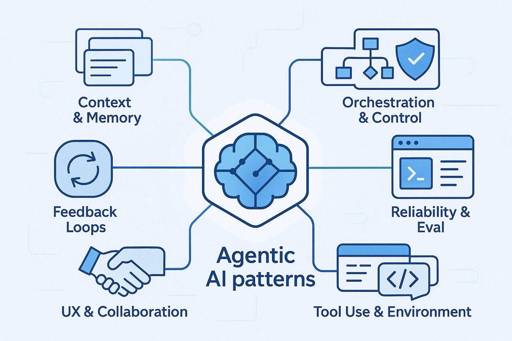
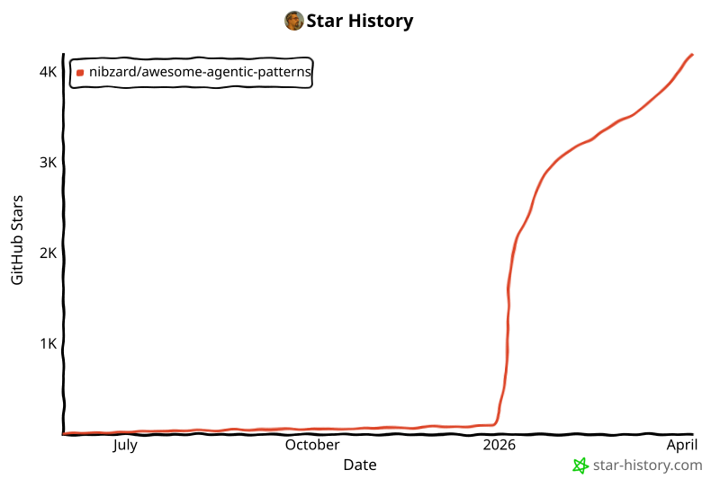

# Awesome Agentic Patterns

一份精心整理的**代理式 AI 模式**目录 — 收录了帮助自主或半自主 AI 代理在生产环境中完成实际工作的真实技巧、工作流和微型架构。

> **为什么要做这个？**
> 教程只展示玩具示例，真实产品则隐藏了那些复杂的细节。本列表提炼出可复用的模式来弥合两者之间的鸿沟，帮助大家更快地构建更聪明的代理。

---

## 什么算作一个模式？

* **可复用** – 不止一个团队在用它。
* **以代理为中心** – 改善 AI 代理的感知、推理或行动能力。
* **有据可查** – 有公开参考资料支撑：博客文章、演讲、代码仓库或论文。

如果你的链接符合以上条件，就适合收录在这里。

---

## 🌐 浏览网站

**访问：** [https://agentic-patterns.com](https://agentic-patterns.com)

本网站提供了超越此 README 的强大探索工具：

- **Pattern Explorer（模式浏览器）**：按类别、状态、复杂度等条件浏览、过滤和搜索所有模式
- **Compare Tool（对比工具）**：多个模式的并排对比，展示共有属性
- **Decision Explorer（决策浏览器）**：交互式指南，帮你找到适合自己用例的模式
- **Graph Visualization（图谱可视化）**：模式之间关系和连接的可视化地图
- **Pattern Packs（模式包）**：针对常见代理架构策划的模式集合
- **Developer Guides（开发者指南）**：关于模式选择和使用的深度文档
- **Dark Mode（暗色模式）**：完整的主题支持，在任何环境下都能舒适阅读

使用 [Astro](https://astro.build) 构建，部署在 [Vercel](https://vercel.com)，源代码位于 [`apps/web/`](./apps/web/)。

---

## 分类快速导览

<!-- AUTO-GENERATED TOC START -->
|  类别                                              |  你会发现什么                                         |
| ------------------------------------------------------ | --------------------------------------------------------- |
| [**Context & Memory（上下文与记忆）**](#context-memory)               | 滑动窗口整理、向量缓存、情景记忆    |
| [**Feedback Loops（反馈循环）**](#feedback-loops)                 | 编译器、CI、人工审查、自愈重试         |
| [**Learning & Adaptation（学习与适应）**](#learning-adaptation)     | Agent RFT、技能库、基于方差的 RL             |
| [**Orchestration & Control（编排与控制）**](#orchestration-control) | 任务分解、生成子代理、工具路由      |
| [**Reliability & Eval（可靠性与评估）**](#reliability-eval)           | 安全护栏、评估框架、日志、可复现性      |
| [**Security & Safety（安全与保障）**](#security-safety)             | 隔离 VM、PII 令牌化、安全扫描         |
| [**Tool Use & Environment（工具使用与环境）**](#tool-use-environment)   | Shell、浏览器、数据库、Playwright、沙箱技巧            |
| [**UX & Collaboration（用户体验与协作）**](#ux-collaboration)           | 提示词交接、分阶段提交、异步后台代理 |
<!-- AUTO-GENERATED TOC END -->

*分类是流动的 — 如果你有更好的划分方式，欢迎提交 PR！*
以下表格由 `patterns/` 文件夹自动生成。

---

<!-- …existing content above… -->

<!-- AUTO-GENERATED PATTERNS START -->

### Context & Memory

- [Agent-Powered Codebase Q&A / Onboarding](patterns/agent-powered-codebase-qa-onboarding.md)
- [Context Window Anxiety Management](patterns/context-window-anxiety-management.md)
- [Context Window Auto-Compaction](patterns/context-window-auto-compaction.md)
- [Context-Minimization Pattern](patterns/context-minimization-pattern.md)
- [Curated Code Context Window](patterns/curated-code-context-window.md)
- [Curated File Context Window](patterns/curated-file-context-window.md)
- [Dynamic Context Injection](patterns/dynamic-context-injection.md)
- [Episodic Memory Retrieval & Injection](patterns/episodic-memory-retrieval-injection.md)
- [Filesystem-Based Agent State](patterns/filesystem-based-agent-state.md)
- [Layered Configuration Context](patterns/layered-configuration-context.md)
- [Memory Synthesis from Execution Logs](patterns/memory-synthesis-from-execution-logs.md)
- [Proactive Agent State Externalization](patterns/proactive-agent-state-externalization.md)
- [Progressive Disclosure for Large Files](patterns/progressive-disclosure-large-files.md)
- [Prompt Caching via Exact Prefix Preservation](patterns/prompt-caching-via-exact-prefix-preservation.md)
- [Self-Identity Accumulation](patterns/self-identity-accumulation.md)
- [Semantic Context Filtering Pattern](patterns/semantic-context-filtering.md)
- [Tool Search Lazy Loading](patterns/tool-search-lazy-loading.md)
- [Working Memory via TodoWrite](patterns/working-memory-via-todos.md)

### Feedback Loops

- [AI-Assisted Code Review / Verification](patterns/ai-assisted-code-review-verification.md)
- [Background Agent with CI Feedback](patterns/background-agent-ci.md)
- [Coding Agent CI Feedback Loop](patterns/coding-agent-ci-feedback-loop.md)
- [Dogfooding with Rapid Iteration for Agent Improvement](patterns/dogfooding-with-rapid-iteration-for-agent-improvement.md)
- [Graph of Thoughts (GoT)](patterns/graph-of-thoughts.md)
- [Incident-to-Eval Synthesis](patterns/incident-to-eval-synthesis.md)
- [Inference-Healed Code Review Reward](patterns/inference-healed-code-review-reward.md)
- [Iterative Prompt & Skill Refinement](patterns/iterative-prompt-skill-refinement.md)
- [Reflection Loop](patterns/reflection.md)
- [Rich Feedback Loops > Perfect Prompts](patterns/rich-feedback-loops.md)
- [Self-Critique Evaluator Loop](patterns/self-critique-evaluator-loop.md)
- [Self-Discover: LLM Self-Composed Reasoning Structures](patterns/self-discover-reasoning-structures.md)
- [Spec-As-Test Feedback Loop](patterns/spec-as-test-feedback-loop.md)
- [Tool Use Incentivization via Reward Shaping](patterns/tool-use-incentivization-via-reward-shaping.md)

### Learning & Adaptation

- [Agent Reinforcement Fine-Tuning (Agent RFT)](patterns/agent-reinforcement-fine-tuning.md)
- [Compounding Engineering Pattern](patterns/compounding-engineering-pattern.md)
- [Frontier-Focused Development](patterns/frontier-focused-development.md)
- [Memory Reinforcement Learning (MemRL)](patterns/memory-reinforcement-learning-memrl.md)
- [Shipping as Research](patterns/shipping-as-research.md)
- [Skill Library Evolution](patterns/skill-library-evolution.md)
- [Variance-Based RL Sample Selection](patterns/variance-based-rl-sample-selection.md)

### Orchestration & Control

- [Action-Selector Pattern](patterns/action-selector-pattern.md)
- [Agent Modes by Model Personality](patterns/agent-modes-by-model-personality.md)
- [Agent-Driven Research](patterns/agent-driven-research.md)
- [Artifact-Driven Analysis Pipeline Orchestration](patterns/multi-step-analysis-pipeline-orchestration.md)
- [Autonomous Workflow Agent Architecture](patterns/autonomous-workflow-agent-architecture.md)
- [Budget-Aware Model Routing with Hard Cost Caps](patterns/budget-aware-model-routing-with-hard-cost-caps.md)
- [Burn the Boats](patterns/burn-the-boats.md)
- [Conditional Parallel Tool Execution](patterns/parallel-tool-execution.md)
- [Continuous Autonomous Task Loop Pattern](patterns/continuous-autonomous-task-loop-pattern.md)
- [Cross-Cycle Consensus Relay](patterns/cross-cycle-consensus-relay.md)
- [Custom Sandboxed Background Agent](patterns/custom-sandboxed-background-agent.md)
- [Discrete Phase Separation](patterns/discrete-phase-separation.md)
- [Disposable Scaffolding Over Durable Features](patterns/disposable-scaffolding-over-durable-features.md)
- [Distributed Execution with Cloud Workers](patterns/distributed-execution-cloud-workers.md)
- [Dual LLM Pattern](patterns/dual-llm-pattern.md)
- [Economic Value Signaling in Multi-Agent Networks](patterns/economic-value-signaling-multi-agent.md)
- [Explicit Posterior-Sampling Planner](patterns/explicit-posterior-sampling-planner.md)
- [Factory over Assistant](patterns/factory-over-assistant.md)
- [Feature List as Immutable Contract](patterns/feature-list-as-immutable-contract.md)
- [Hybrid LLM/Code Workflow Coordinator](patterns/hybrid-llm-code-workflow-coordinator.md)
- [Inference-Time Scaling](patterns/inference-time-scaling.md)
- [Initializer-Maintainer Dual Agent Architecture](patterns/initializer-maintainer-dual-agent.md)
- [Inversion of Control](patterns/inversion-of-control.md)
- [Iterative Multi-Agent Brainstorming](patterns/iterative-multi-agent-brainstorming.md)
- [Lane-Based Execution Queueing](patterns/lane-based-execution-queueing.md)
- [Language Agent Tree Search (LATS)](patterns/language-agent-tree-search-lats.md)
- [LLM Map-Reduce Pattern](patterns/llm-map-reduce-pattern.md)
- [Multi-Model Orchestration for Complex Edits](patterns/multi-model-orchestration-for-complex-edits.md)
- [Opponent Processor / Multi-Agent Debate Pattern](patterns/opponent-processor-multi-agent-debate.md)
- [Oracle and Worker Multi-Model Approach](patterns/oracle-and-worker-multi-model.md)
- [Parallel Tool Call Learning](patterns/parallel-tool-call-learning.md)
- [Plan-Then-Execute Pattern](patterns/plan-then-execute-pattern.md)
- [Planner-Worker Separation for Long-Running Agents](patterns/planner-worker-separation-for-long-running-agents.md)
- [Progressive Autonomy with Model Evolution](patterns/progressive-autonomy-with-model-evolution.md)
- [Progressive Complexity Escalation](patterns/progressive-complexity-escalation.md)
- [Recursive Best-of-N Delegation](patterns/recursive-best-of-n-delegation.md)
- [Self-Rewriting Meta-Prompt Loop](patterns/self-rewriting-meta-prompt-loop.md)
- [Specification-Driven Agent Development](patterns/specification-driven-agent-development.md)
- [Stop Hook Auto-Continue Pattern](patterns/stop-hook-auto-continue-pattern.md)
- [Sub-Agent Spawning](patterns/sub-agent-spawning.md)
- [Subject Hygiene for Task Delegation](patterns/subject-hygiene.md)
- [Swarm Migration Pattern](patterns/swarm-migration-pattern.md)
- [Three-Stage Perception Architecture](patterns/three-stage-perception-architecture.md)
- [Tool Capability Compartmentalization](patterns/tool-capability-compartmentalization.md)
- [Tool Selection Guide](patterns/tool-selection-guide.md)
- [Tree-of-Thought Reasoning](patterns/tree-of-thought-reasoning.md)
- [Workspace-Native Multi-Agent Orchestration](patterns/workspace-native-multi-agent-orchestration.md)

### Reliability & Eval

- [Action Caching & Replay Pattern](patterns/action-caching-replay.md)
- [Adaptive Sandbox Fan-Out Controller](patterns/adaptive-sandbox-fanout-controller.md)
- [Anti-Reward-Hacking Grader Design](patterns/anti-reward-hacking-grader-design.md)
- [Asynchronous Coding Agent Pipeline](patterns/asynchronous-coding-agent-pipeline.md)
- [Canary Rollout and Automatic Rollback for Agent Policy Changes](patterns/canary-rollout-and-automatic-rollback-for-agent-policy-changes.md)
- [CriticGPT-Style Code Review](patterns/criticgpt-style-evaluation.md)
- [Extended Coherence Work Sessions](patterns/extended-coherence-work-sessions.md)
- [Failover-Aware Model Fallback](patterns/failover-aware-model-fallback.md)
- [Lethal Trifecta Threat Model](patterns/lethal-trifecta-threat-model.md)
- [LLM Observability](patterns/llm-observability.md)
- [Merged Code + Language Skill Model](patterns/merged-code-language-skill-model.md)
- [No-Token-Limit Magic](patterns/no-token-limit-magic.md)
- [Reliability Problem Map Checklist for RAG and Agents](patterns/wfgy-reliability-problem-map.md)
- [RLAIF (Reinforcement Learning from AI Feedback)](patterns/rlaif-reinforcement-learning-from-ai-feedback.md)
- [Schema Validation Retry with Cross-Step Learning](patterns/schema-validation-retry-cross-step-learning.md)
- [Structured Output Specification](patterns/structured-output-specification.md)
- [Subagent Compilation Checker](patterns/subagent-compilation-checker.md)
- [Versioned Constitution Governance](patterns/versioned-constitution-governance.md)
- [Workflow Evals with Mocked Tools](patterns/workflow-evals-with-mocked-tools.md)

### Security & Safety

- [Deterministic Security Scanning Build Loop](patterns/deterministic-security-scanning-build-loop.md)
- [External Credential Sync](patterns/external-credential-sync.md)
- [Hook-Based Safety Guard Rails for Autonomous Code Agents](patterns/hook-based-safety-guard-rails.md)
- [Isolated VM per RL Rollout](patterns/isolated-vm-per-rl-rollout.md)
- [Non-Custodial Spending Controls](patterns/non-custodial-spending-controls.md)
- [PII Tokenization](patterns/pii-tokenization.md)
- [Sandboxed Tool Authorization](patterns/sandboxed-tool-authorization.md)
- [Soulbound Identity Verification](patterns/soulbound-identity-verification.md)
- [Transitive Vouch-Chain Trust](patterns/transitive-vouch-chain-trust.md)
- [Zero-Trust Agent Mesh](patterns/zero-trust-agent-mesh.md)

### Tool Use & Environment

- [Agent SDK for Programmatic Control](patterns/agent-sdk-for-programmatic-control.md)
- [Agent-First Tooling and Logging](patterns/agent-first-tooling-and-logging.md)
- [Agentic Search Over Vector Embeddings](patterns/agentic-search-over-vector-embeddings.md)
- [AI Web Search Agent Loop](patterns/ai-web-search-agent-loop.md)
- [CLI-First Skill Design](patterns/cli-first-skill-design.md)
- [CLI-Native Agent Orchestration](patterns/cli-native-agent-orchestration.md)
- [Code Mode MCP Tool Interface Improvement Pattern](patterns/code-first-tool-interface-pattern.md)
- [Code-Over-API Pattern](patterns/code-over-api-pattern.md)
- [Code-Then-Execute Pattern](patterns/code-then-execute-pattern.md)
- [Dual-Use Tool Design](patterns/dual-use-tool-design.md)
- [Dynamic Code Injection (On-Demand File Fetch)](patterns/dynamic-code-injection-on-demand-file-fetch.md)
- [Egress Lockdown (No-Exfiltration Channel)](patterns/egress-lockdown-no-exfiltration-channel.md)
- [Intelligent Bash Tool Execution](patterns/intelligent-bash-tool-execution.md)
- [LLM-Friendly API Design](patterns/llm-friendly-api-design.md)
- [Multi-Platform Communication Aggregation](patterns/multi-platform-communication-aggregation.md)
- [Multi-Platform Webhook Triggers](patterns/multi-platform-webhook-triggers.md)
- [Patch Steering via Prompted Tool Selection](patterns/patch-steering-via-prompted-tool-selection.md)
- [Progressive Tool Discovery](patterns/progressive-tool-discovery.md)
- [Shell Command Contextualization](patterns/shell-command-contextualization.md)
- [Static Service Manifest for Agents](patterns/static-service-manifest-for-agents.md)
- [Tool Use Steering via Prompting](patterns/tool-use-steering-via-prompting.md)
- [Virtual Machine Operator Agent](patterns/virtual-machine-operator-agent.md)
- [Visual AI Multimodal Integration](patterns/visual-ai-multimodal-integration.md)

### UX & Collaboration

- [Abstracted Code Representation for Review](patterns/abstracted-code-representation-for-review.md)
- [Agent-Assisted Scaffolding](patterns/agent-assisted-scaffolding.md)
- [Agent-Friendly Workflow Design](patterns/agent-friendly-workflow-design.md)
- [AI-Accelerated Learning and Skill Development](patterns/ai-accelerated-learning-and-skill-development.md)
- [Chain-of-Thought Monitoring & Interruption](patterns/chain-of-thought-monitoring-interruption.md)
- [Codebase Optimization for Agents](patterns/codebase-optimization-for-agents.md)
- [Democratization of Tooling via Agents](patterns/democratization-of-tooling-via-agents.md)
- [Dev Tooling Assumptions Reset](patterns/dev-tooling-assumptions-reset.md)
- [Human-in-the-Loop Approval Framework](patterns/human-in-loop-approval-framework.md)
- [Latent Demand Product Discovery](patterns/latent-demand-product-discovery.md)
- [Milestone Escrow for Agent Resource Funding](patterns/agentfund-crowdfunding.md)
- [Proactive Trigger Vocabulary](patterns/proactive-trigger-vocabulary.md)
- [Seamless Background-to-Foreground Handoff](patterns/seamless-background-to-foreground-handoff.md)
- [Spectrum of Control / Blended Initiative](patterns/spectrum-of-control-blended-initiative.md)
- [Team-Shared Agent Configuration as Code](patterns/team-shared-agent-configuration.md)
- [Verbose Reasoning Transparency](patterns/verbose-reasoning-transparency.md)

<!-- AUTO-GENERATED PATTERNS END -->

<!-- …existing content below… -->

---

## 面向 AI 助手 (llms.txt)

本项目包含 [`llms.txt`](https://agentic-patterns.com/llms.txt)，这是一份机器可读的文档文件，旨在帮助 AI 助手和 LLM 理解并推荐合适的模式。

**包含内容：**
- 模式分类及其用途
- 关键模式的简要描述
- AI 助手的使用指南
- 基于用例需求的模式选择策略

**面向构建 AI 助手的开发者：**
可以将 `llms.txt` 文件作为上下文提供给 LLM，以改善模式推荐。它针对以下场景进行了优化：
- 为此目录建立索引的 RAG 系统
- 推荐模式的 AI 编程助手
- 推荐代理式模式的 LLM 驱动工具

**访问地址：** https://agentic-patterns.com/llms.txt（也可在 [`apps/web/public/llms.txt`](./apps/web/public/llms.txt) 获取）

---

## 三步贡献

1. **Fork 并创建分支** → `git checkout -b add-my-pattern`
2. **添加模式文件** 在 `patterns/` 目录下，使用上述模板。
3. **运行** `bun run build:data` 来刷新自动生成的 README 部分和站点数据。
4. **提交 PR**，标题格式为 `Add: my-pattern-name`。
5. 本仓库以模式为先：主要属于产品公告或推广性质的提案将被拒绝，即使技术上是有效的。

详情参见 [`CONTRIBUTING.md`](https://github.com/nibzard/awesome-agentic-patterns/blob/main/CONTRIBUTING.md)。

---

## 灵感来源

本项目源于 [**"What Sourcegraph learned building AI coding agents"**](https://www.nibzard.com/ampcode)（2025 年 5 月 28 日）这篇文章以及持续更新的 *Raising an Agent* 视频日记。许多首批模式直接来自这些经验 — 感谢所有在公开场合分享自己旅程的人！

---

## 许可证

Apache‑2.0。参见 [`LICENSE`](https://github.com/nibzard/awesome-agentic-patterns/blob/main/LICENSE)。

---

## Star 历史

